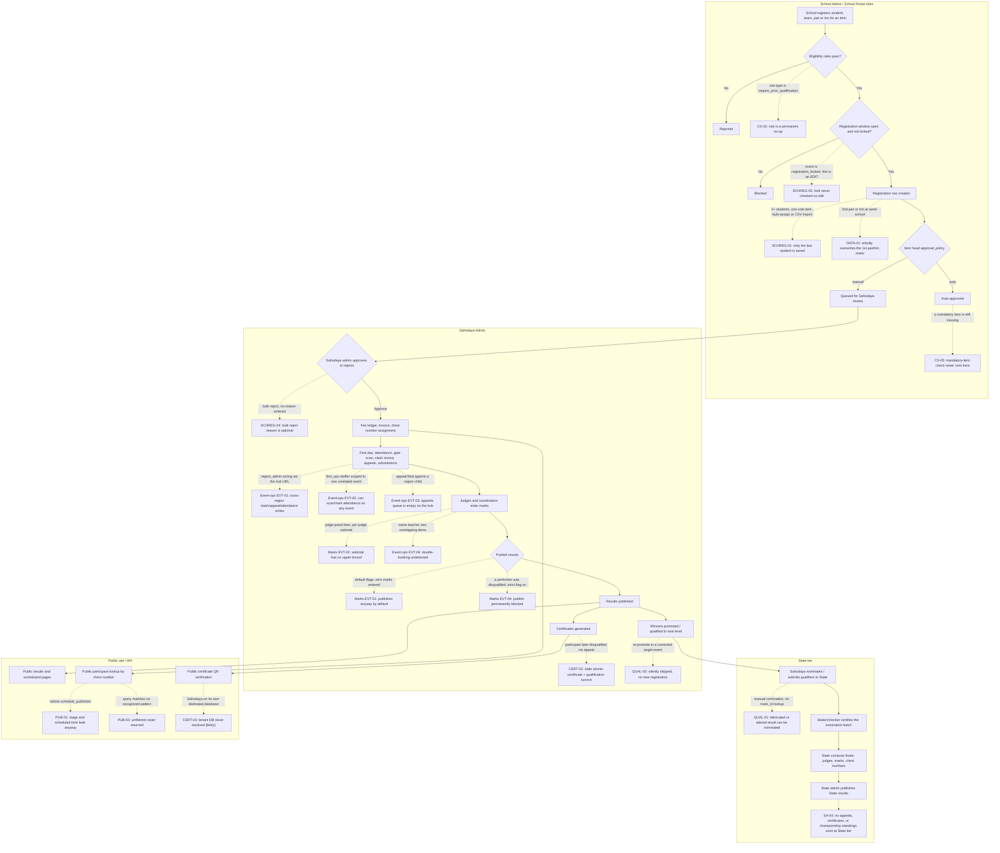

# Audit 1 of 3 — Kalolsavam (Fest) Features & End-to-End Workflows

**Date:** 2026-08-18
**Scope:** Fest/Kalotsav engine only (event setup, competition setup, school registration, event operations, marks & results, qualification & promotion, certificates & closure), across School Admin, Sahodaya Admin, State Admin, and Public/API surfaces. This is audit 1 of a 3-part series; MCQ, Board Results, Training, and Membership modules are out of scope here except where Fest code directly touches them.

---

## 1. Method and status

**Method.** This audit combined static code cross-reference with execution of the existing automated test suite, not code reading alone. For each candidate finding, the verifying agent: (a) read the actual controller/service/model/migration/route/middleware source at the cited file and line numbers; (b) where a relevant committed test existed, re-ran it and recorded the pass/fail result and assertion count; (c) where no committed test covered the claim, wrote a throwaway PHPUnit test exercising the real HTTP route or service method against the real (SQLite, in-memory) test database, ran it, recorded the result, and then deleted the scratch file — no scratch test was left in the repository and no application source file was modified. Every finding below was then independently re-checked by a second verification pass, which is why several findings carry corrections to the original claim (narrower or broader impact than first reported, a wrong severity, a stale citation, or a reclassification from "confirmed" to "not_a_gap"). Findings are reported after that second pass.

**Representative tenant.** Malappuram Sahodaya (subdomain `malappuram`) and AMU Residential School (subdomain `amu-school`) were used as the one representative tenant/school pair, per repo facts confirming this is the only Sahodaya tenant actually seeded anywhere in this repository. No seeded `FestEvent` competition data exists to click through in a browser, so live UI walkthroughs were not the primary evidence mechanism — the automated test suite (60+ files under `tests/**/Fest*`, `tests/**/Kalotsav*`, `tests/**/Sahodaya*`) plus targeted scratch tests were.

**Sandbox constraints that shape some findings.** `phpunit.xml` forces `APP_ENV=testing`, `DB_CONNECTION=central`, `DB_DRIVER=sqlite`, `DB_DATABASE=:memory:`, `TENANCY_DATABASE_PER_SAHODAYA=false` — the opposite of production, which runs one Postgres database per Sahodaya cluster. Two consequences recur throughout this report: (1) some Postgres-only constraints (partial unique indexes gated on `getDriverName() === 'pgsql'`) are invisible to the SQLite test connection, so a defect that is real in production can look absent here, or vice versa a defect visible here can be masked by a constraint that only exists on Postgres — each such case is called out explicitly in the finding; (2) per-tenant database resolution (`InitializeTenancyByRouteTenant`, `TenancyDatabase`) cannot be exercised end-to-end in this sandbox, so two findings are marked `status: likely` rather than `confirmed` because the code trace is conclusive but the live cross-database failure mode could not be executed here.

**Status summary.** 80 findings total, organized into 12 verification groups (7 core Fest lifecycle areas + 1 cross-cutting data-integrity pass + 4 portal-specific UI/navigation passes):

| Status | Count | Meaning |
|---|---|---|
| `confirmed` | 46 | A real defect, reproduced (via existing test, or a scratch test written and run this session). |
| `not_a_gap` | 21 | Verified working as intended — included so this report does not misrepresent working code as broken. |
| `design_gap` | 9 | Not a bug in existing code — a capability the workflow implies but that was never built. |
| `test_gap` | 2 | Code appears correct on inspection/scratch-test, but has zero permanent regression coverage. |
| `likely` | 2 | Multi-layer code trace is conclusive but the live failure mode could not be executed in this sandbox (both are per-tenant-database resolution issues, only observable under `TENANCY_DATABASE_PER_SAHODAYA=true`). |

| Severity | Count |
|---|---|
| P0 (production-breaking / full authorization bypass) | 5 |
| P1 (real data-integrity, workflow, or auth defect on a normal path) | 20 |
| P2 (real defect, narrower reach or trigger) | 21 |
| P3 (minor, cosmetic, dead-code, or capability-gap) | 34 |

This document does not claim exhaustive coverage. Section 10 lists explicitly what was not verified.

---

## 2. Architecture map

The Fest/Kalotsav engine is a shared module inside a multi-tenant Laravel/Vue application (`TENANCY_DATABASE_PER_SAHODAYA=true` in production — one Postgres database per Sahodaya cluster). All Inertia pages for every non-public portal — Super Admin, Sahodaya Admin, School Admin, State Admin, and every Portal role (fest ops, mark coordinator, judge, group, student, teacher, house admin) — are served through **one single Inertia entry point**, `resources/js/admin.js`, whose page-loader glob is scoped to `./Pages/Admin/**/*.vue`. Controllers pass a `'{Prefix}/...'` string to `Inertia::render()`; whichever prefix is used (`Sahodaya/Events/...`, `School/Events/...`, `StateAdmin/Fest/...`, `Portal/FestOps/...`) determines which Vue file resolves, and none of the four prefixes are written by the loader itself. `resources/js/app.js` is an empty, unbundled stub.

There are **no Laravel Policy classes** anywhere in the Fest module (`app/Policies/` exists but is empty). Authorization is entirely: (a) five route-middleware aliases (below), (b) inline Spatie `hasRole`/`hasAnyRole` checks scattered across ~45 `SahodayaAdmin\Fest*Controller` files (150+ action methods), and (c) rare Spatie permission checks (`$user->can('fest.reports.lifecycle_override')`). This manual, per-controller, no-auto-scoping pattern is the structural root cause behind several findings in this report (NAV-SEC-01, DATA-06, and the region-scoping gaps in the Event operations group) — the same class of gap (a route/action that forgets to re-apply a check its siblings already have) recurs independently in several unrelated corners of the codebase.

The competition data model is one linear chain, with fees running in parallel:

| Model | Relationships |
|---|---|
| `FestEvent` | hasMany items/registrations/results/phases/registrationBatches/houses/childEvents/schoolPhaseRegionSelections; belongsTo academicYear/parent/parentEvent/conductingSchool/foodHostSchool/region/sourcePhase/registrationBatch/sourceHead. Self-referential parent↔childEvents (state→sahodaya→school cascade, and hub→region/finale partition children). |
| `FestEventPhase` | belongsTo event/sourcePhase/registrationBatch; hasMany items/childPhases/allowedRegions/regionSelections. Self-referential for phase cloning; represents one conduct phase (e.g. a regional heat). |
| `FestEventItem` | belongsTo event/head(`FestItemHead`)/area(`FestCompetitionArea`)/phase; hasMany registrations. |
| `FestRegistration` | belongsTo event/item/school/feeReceipt; hasMany groups/participants. Central join of school + item + event. |
| `FestParticipant` | belongsTo registration/group/student/teacher; hasOne mark(`FestMark`). |
| `FestGroup` | belongsTo registration; hasMany participants (team/pair/trio items). |
| `FestMark` | belongsTo participant/item. |
| `FestResult` / `FestQualification` | belongsTo event/item/school (Result) or event/item/participant/nextLevelEvent (Qualification — drives promotion). |
| `FestSchoolEventFee` / `FestEventInvoice` | belongsTo event/school/(head/phase/registrationBatch)/feeReceipt. Parallel fee/ledger chain, not part of the competition chain proper. |

Route groups, middleware, and the controllers/services behind them:

| Route group | Prefix | Middleware alias → guard class | Portal | Representative controllers/services |
|---|---|---|---|---|
| Sahodaya fest engine | `sahodaya-admin/{tenantId}/*` | `sahodaya.admin` → `EnsureSahodayaAdmin` (role or `FestEventStaff` duty scope; tenant-active + subscription gate) | Sahodaya Admin | FestEventController, FestMarkEntryController, FestRegistrationReviewController, FestChestNumberController, FestCertificateController/FestCertificateOpsController, FestChampionshipController, FestEventSettingsController, FestJudgeAssignmentController, FestEventFeesController, FestResultsController, FestHouseController, FestAppealController, FestCateringController, FestClashReviewController, FestAttendanceController, FestSubstitutionReviewController, FestStateNominationController, plus 6 per-program sub-groups (kalotsav/sports/kids-fest/teacher-fest/english-fest/science-fest) |
| Sahodaya fest engine (API) | `api/v1/sahodaya/{tenantId}/*` | `sahodaya.admin.api` → `EnsureSahodayaAdminApi` (API twin) | Sahodaya (API clients) | EventsApiController, FestRegistrationsWriteApiController |
| School fest engine | `school-admin/{tenantId}/*` | `school.admin` + `event.coordinator` → `EventCoordinatorScope` | School Admin | FestEventStudentRegistrationController (bulk assign), FestRegistrationController (create/edit/import), FestSubstitutionRequestController, FestClashRequestController, FestEventPortalController, food-coupon/host-billing controllers, FestSchoolReportController, plus 5 per-program sub-groups each wrapped in `EnsureSchoolFestProgramMatchesEvent` |
| School fest engine (API) | `api/v1/school/{tenantId}/*` | `school.admin.api` | School (API clients) | FestApiController |
| Fest Ops portal | `portal/fest-ops/{tenantId}/*` | `fest.event.ops` → `EnsureFestEventOps` (sahodaya_admin OR fest_ops role OR any `FestEventStaff` row) | Portal (fest_ops / any duty) | FestEventOpsController, FestGateController |
| Mark Coordinator portal | `portal/fest-coordinator/{tenantId}/*` | `fest.mark.coordinator` → `EnsureFestMarkCoordinator` | Portal (mark_entry_coordinator/admin) | FestMarkCoordinatorController |
| State workspace | `admin/state-programs/*`, `admin/kalotsav/*`, `admin/state-workspace/fest/*` | `state.admin` → `EnsureStateAdmin` (state_admin/state_staff, superadmin bypass) | State Admin / Super Admin | StateFestWorkspaceController, KalotsavStateController, StateFestProgramController, StateQualifierReviewController, StateAttendanceController |
| Public site | none (server-rendered Blade, not Inertia) | `web` group only; tenancy resolved per-route where a tenant/school param is present | Public / anonymous | `Public\FestPortalController`; print-only Blade under `resources/views/fest/**` |
| — (dead) | not attached to any route | `fest.discipline` → `EnsureFestDisciplineAdmin` | — | Fully implemented, wired to zero routes (see NAV-03 / Event-ops EVT-05) |

Frontend nav data lives separately from layouts, in `resources/js/support/*.js` (`sahodayaAdminNav.js`, `schoolAdminNav.js`, `adminNav.js`, `festOpsPortalNav.js`, `festCoordinatorPortalNav.js`). A **State Admin has no standalone "Fest" nav group** — its Fest links are blended into a generic "State Workspace" section, unlike Sahodaya/School which each have an explicit "Fest" section. Ten `.vue` files (fest- and board-results-related) sit outside the `Pages/Admin/**` glob root entirely and are dead, unbundled code — some are byte-identical stale copies, others have diverged with real content drift while still receiving commits on both the live and dead copy (see SA-05, UI-School EVT-03).

---

## 3. Actor / permission matrix

| Actor | Portal | Designed capability in Fest | Confirmed gaps / risks (finding IDs — section noted where the ID repeats elsewhere in this report) |
|---|---|---|---|
| Super Admin | Admin (shared `AdminLayout`) | Everything; also gets the State-tier bypass | SA-05 (dead duplicate Vue tree is a live churn risk) |
| State Admin (`state_admin`) | State Admin | Manage own state's programs, State Finals judges/marks/attendance/chest numbers, state user accounts | **SA-01** (P0 — zero state isolation on state-user management, full cross-state admin takeover), **SA-02** (P0 — the state isolation fix for the fest workspace itself is uncommitted, so HEAD may ship without it), SA-04 (no appeals/certificates/championship standings exist at this tier at all), SA-03 (Sports/MCQ rollup pages have no graceful degradation if one cluster's DB isn't ready) |
| State Staff (`state_staff`) | State Admin | Same as State Admin, blocked from non-GET on some routes | Inherits SA-01's exposure — `EnsureStateAdmin` admits both roles identically for the affected controller |
| Sahodaya Admin (`sahodaya_admin`) | Sahodaya Admin | Full, unrestricted control of the tenant's own fest events | Subject to the same certificate/marks/registration findings as any Sahodaya-scoped actor (CERT-01, CERT-02, Marks EVT-01/02/04, etc.) |
| `event_admin` (FestEventStaff-scoped) | Sahodaya Admin | Per its own code comment: "a full sahodaya-admin experience, but locked to the specific events they've been assigned" | **NAV-SEC-01** (P1 — every non-event-scoped read page — individual student PII, the full user roster, finance pages — is fully readable regardless of event scope; only write actions are gated), **API-01** (P1 — the API event-list endpoint ignores the scope entirely and returns every event in the tenant) |
| `region_admin` (FestEventStaff-scoped, one region on a partitioned hub) | Sahodaya Admin | Same as event_admin, further scoped to one region | **Event-ops EVT-01** (P1 — can approve/reject another region's clash requests via the hub URL, and by the identical unfixed code pattern likely disqualify/reinstate and falsify attendance for that region too; only the `/reports/*` route group has the containment fix), SCHREG-05 (P3 — can verify documents for a school outside their assigned region), plus NAV-SEC-01 / API-01 above |
| `fest_ops` (auto-granted the instant a staffer gets *any* single operational duty on *any* single event) | Fest Ops Portal | Gate scanning, attendance marking, stage/kitchen ops — intended to be scoped to the assigning event | **Event-ops EVT-02** (P1 — gate-check scan and attendance-mark have no per-event check at all; a staffer assigned `duty=food` on Event Y can falsify "present/absent" attendance and view participant PII on completely unrelated Event X) |
| `mark_entry_coordinator` / `mark_entry_admin` | Mark Coordinator Portal | Enter marks for assigned events | Subject to Marks EVT-01/02/03/04 (shared save services, no surface-specific gap found beyond those) |
| `discipline` duty (FestEventStaff) | intended: a dedicated ops surface | Documented in the UI as "Discipline / item head admin" | NAV-03 / **Event-ops EVT-05** (P3 — the dedicated `fest.discipline` middleware is fully implemented but attached to zero routes; today this duty grants nothing beyond generic `fest_ops` access plus item-head scoping) |
| School Admin (`school_admin`) | School Admin | Register/withdraw/edit rosters, bulk-assign, CSV import, view reports, request substitutions/clash reviews | **SCHREG-01** (P0 — bulk/CSV silently drops all but the last student on a shared solo item), **SCHREG-02** (P0 — `registration_locked` is never checked on roster edits), SCHREG-03 (P1, reviewed on the Sahodaya side but school-initiated), **UI-School EVT-01** (P1 — substitution requests are missing the partition-scope guard the sibling clash-request flow already has) |
| `school_event_coordinator` (program-scoped via `SchoolUserEventScope`) | School Admin | Same as School Admin, restricted to one program | UI-School EVT-02 (P2 — Sports Meet's bare hub URL 403s for a correctly-scoped Sports coordinator, a URL-matching bug unique to that one program's middleware branch) |
| Judge (Judge Dashboard) | Portal | Enter marks/scores for assigned items | Marks EVT-02 (P1 — a judge's entered subtotal has no upper bound anywhere in the stack) |
| Student / Teacher / Group self-service | Portal | View/manage own registrations, standby swaps | Not separately audited beyond what the School registration and Marks sections already cover |
| Public / anonymous visitor | Public site (server-rendered Blade, no auth) | Search participants, view schedule/results/scoreboard once published, verify certificates by QR | **PUB-01** (P1 — participant lookup leaks scheduled time/stage before `schedule_published`), API-01 above, PUB-03 (P2 — an unrecognized search query falls through to an unfiltered roster dump), PUB-02 (P2 — the public schedule page renders empty for phased events even after publication), **CERT-03** (P1, likely — the public certificate verify/print endpoint never resolves the correct per-Sahodaya database once a Sahodaya has its own dedicated production database) |

---

## 4. Feature coverage matrix

These are the 7 core Fest lifecycle feature areas. Status reflects the worst confirmed defect reachable through ordinary use in that area; "Broken" is reserved for areas containing at least one P0.

| # | Feature area | Status | Key evidence |
|---|---|---|---|
| 1 | **Event setup** (create/edit/publish/cancel/delete) | **Broken** | EVT-01 (P0): the Cancel action fatals every time via a wrong PHP namespace, so no fest event can be cancelled through the UI at all. EVT-03 (P2): no chronological validation on registration/event date pairs (every sibling endpoint has it). EVT-02 (P2): deleting an event orphans `fest_item_heads`/`fest_competition_areas` rows permanently. EVT-06 (P2): reopening a cancelled event never restores the registrations that cancellation force-withdrew. *Positive:* EVT-04/EVT-05 confirm the status-transition guard and phase-lifecycle write paths both work correctly. |
| 2 | **Competition setup** (items, taxonomy, eligibility rules, competition types) | **Partially working** | CS-01 (P1): Pair/Trio items — a first-class, admin-selectable option — don't enforce minimum roster size and don't count toward group participation caps. CS-02 (P1): the "prior qualification required" eligibility rule is a permanent no-op, and can silently defeat a sibling rule when combined as an OR alternative. CS-03 (P1): every eligibility rule stops applying the moment a registration routes to a region/finale partition child — the normal case for that topology. CS-04 (P2): bulk "reset taxonomy to defaults" hard-deletes custom, in-use entries with no protection. CS-05 (P2): mandatory-item enforcement only runs on manual single-registration review, never on auto-approval or bulk-approve. *Positive:* CS-06/CS-07 confirm custom competition types and eligibility-rule-controller tenant/scope checks both work correctly. |
| 3 | **School registration** (create, bulk, import, edit, substitution, withdrawal) | **Broken** | SCHREG-01 (P0): bulk-assign and CSV import both silently keep only the *last* student processed when 2+ students share one solo item — full roster/data loss reported as full success. SCHREG-02 (P0): `registration_locked` is checked on new registrations but never on edits to an existing one — the "freeze the roster" control does not do what its label promises. SCHREG-03 (P1): approving a substitution via `replacement_student_id` skips eligibility validation entirely. SCHREG-04 (P2): bulk-reject doesn't require a reason even though single-reject does. *Positive:* SCHREG-08 confirms resubmission after rejection works end to end, backend and frontend both. |
| 4 | **Event operations** (fest-day: attendance, gate, clash, appeals, schedule, staff) | **Partially working** | Event-ops EVT-01 (P1): a region_admin can approve/reject another region's clash requests via the hub URL — the `/reports/*` group is the *only* route group with region containment. Event-ops EVT-02 (P1): any `fest_ops` staffer, however narrowly assigned, can scan/mark attendance on any other event in the tenant. Event-ops EVT-03 (P1): the Appeals queue silently shows zero rows on any partitioned hub event. Event-ops EVT-04 (P1): teacher double-booking is never detected by the schedule clash checker (it only looks up `student_id`). *Positive:* EVT-06 confirms chest/registration-number sequencing is race-safe under Postgres locking. |
| 5 | **Marks and results** (entry, judge panels, grading, publish, championship) | **Partially working** | Marks EVT-01 (P1): results can be published with **zero marks entered** — this is the out-of-the-box default configuration for every new event, not an opt-in misconfiguration. Marks EVT-02 (P1): judge-panel subtotals have no upper bound anywhere in the stack (validation, service, or DB). Marks EVT-04 (P1): a single disqualification can permanently block hub-level publish once the stricter completeness flag is on. Marks EVT-03 (P2): marks can still be edited after an item's own results are individually published, silently invalidating that "Results Published" timestamp. Marks EVT-05 (P2): the public Individual Championship board never auto-recalculates on mark save/publish, unlike the school scoreboard on the same page. *Positive:* EVT-06/EVT-07 confirm grade-banding and tie-break/hub-level-lock logic are both correct. |
| 6 | **Qualification and promotion** (multi-level advancement to Sahodaya/State) | **Partially working** | QUAL-01 (P1): a Sahodaya-scoped admin can nominate a fabricated or altered State qualifier — `select()` never looks up the real `FestMark`/`FestRegistration`/`FestParticipant`. QUAL-02 (P2): re-promoting to a corrected target event after a mistaken promotion silently no-ops (0 promoted, 1 skipped) with no path to fix it short of a separate revoke action. QUAL-03 (P2): resubmitting qualifiers to State after an unrelated correction duplicates every unchanged entry. QUAL-04 (P2, design gap): the reserve-replacement workflow both error messages promise for a certified nomination doesn't exist anywhere in the code. *Positive:* QUAL-06 confirms partitioned-hub promotion correctly aggregates winners across region children. |
| 7 | **Certificates and closure** (issuance, collection, verification, event lockdown) | **Partially working** | CERT-01 (P1): certificate collection resolves the target record by ID alone, never checking `entity_type` — a cross-tenant/cross-entity mutation is possible on ID collision. CERT-02 (P1): a disqualified participant keeps their winner certificate and qualification with **no invalidation path anywhere in the codebase**. CERT-03 (P1, likely): the public verify/print endpoint never resolves the correct per-Sahodaya database for Fest/Training certificates once a Sahodaya runs on its own dedicated production database. CERT-06 (P2): volunteer/staff "duty" certificate issuance is fully implemented in the service layer but wired to zero call sites — dead code, not a missing feature. *Positive:* CERT-05 confirms the post-completion lockdown (mark entry, registration review, event deletion) all correctly block once an event reaches `completed`. |

---

## 5. Complete lifecycle diagram

The flow below traces one registration from School Admin through Sahodaya Admin, optionally through the State tier, to the Public site — annotated with the finding IDs that break or gap each step. Dotted arrows mark a defect path; solid arrows mark the intended flow.

---

## 6. Findings

Findings are grouped into the 12 verification passes used during this audit, most severe first within each group. **The finding ID `EVT-##` is reused across four different groups** (Event setup, Event operations, Marks and results, and the School Admin UI/navigation pass) — each is a distinct finding; the group heading disambiguates. Everywhere this report references an `EVT-##` finding from outside its own group, it is written as `EVT-## (<group>)`.

### 6.1 Event setup — 6 findings (1 P0, 3 P2, 2 P3)

#### EVT-01 — Cancelling a fest event always fails with a 500
**P0 · confirmed · scope: small**
Portal/Actor: Sahodaya Admin · Event types: all (shared, event-type-agnostic code) · Workflow stage: event closure (cancel)

**Expected.** Setting a fest event's status to "Cancelled" (via the Overview page's status dropdown + Save, or the one-click quick-status action) should withdraw active registrations, issue fee credits where applicable, notify, and persist `status='cancelled'`.

**Actual.** `FestEventStatusService::transitionToCancelled()` reads `\App\Support\Enums\FestPageActivity` inside the audit-log call at the end of its `DB::transaction()` closure. The real class is `App\Support\FestPageActivity` (no `Enums` sub-namespace) — every other of the ~35 controllers using `FestPageActivity` imports the correct class; this is the one bad reference. The class-constant access forces class resolution at that statement, fatals with an uncaught `Error`, which `DB::transaction()` catches, rolls back, and rethrows as an HTTP 500 with the event status unchanged.

**Reproduction steps.** As sahodaya_admin, open any FestEvent in draft/published/registration_open/ongoing status. On the Overview page set status to "Cancelled" and Save (or trigger the quick-status shortcut with `status=cancelled`). Observe HTTP 500; event status is unchanged in the DB.

**Evidence.** A scratch test (seeded tenant + sahodaya_admin + a `published` FestEvent with no paid fees) POSTed the real `sahodaya.events.quick-status` route: response 500, `$response->exception` was `Error` with message exactly `Class "App\Support\Enums\FestPageActivity" not found"`, and `$event->fresh()->status` remained `'published'`. Both `FestEventController::update()` (line 630) and `quickStatus()` (line 1427) call the identical `transitionToCancelled()`, so both write paths share the fatal. `grep -rln "transitionToCancelled|FestEventStatusService" tests/` and `grep -rln "'cancelled'" tests/Feature/SahodayaAdmin/` both returned nothing.

**Data/security impact.** Sahodaya Admins cannot cancel any fest event through the UI at all — both status-change surfaces hard-fail identically. No cancellation, no registration withdrawal, no fee credit issuance, no cancellation notification ever fires.

**Recommended correction.** Fix the namespace at `FestEventStatusService.php:86` to `App\Support\FestPageActivity`.

**Required regression tests.** None exist today. Add a test asserting `update()`/`quickStatus()` can transition an event to `'cancelled'` without a 500, and that active registrations end up `'withdrawn'`.

---

#### EVT-02 — Deleting an event permanently orphans FestItemHead and FestCompetitionArea rows
**P2 · confirmed · scope: small**
Portal/Actor: Sahodaya Admin · Workflow stage: event deletion/archival

**Expected.** Deleting a fest event with zero registrations should leave no orphaned event-scoped data behind — every `event_id`-scoped table should either cascade-delete or be explicitly cleaned up.

**Actual.** `destroy()` does no explicit child-table cleanup beyond a sports-hub's child events, but most `event_id`-scoped tables (`fest_event_items`, `fest_stages`, `fest_combination_rules`, `fest_grade_configs`, `fest_point_rules`, `fest_volunteers`, `fest_school_event_fees`, `fest_level_registrations`, `fest_individual_championship_points`) declare real `cascadeOnDelete()`/`nullOnDelete()` foreign keys and are protected in production Postgres regardless of what PHP does. Only two tables have **zero FK protection anywhere in the schema**: `fest_item_heads` (nullable `event_id`, no `foreign()` call at all) and `fest_competition_areas` (non-nullable `event_id`, no `foreign()` call at all) — these are permanently orphaned after deletion, in production as well as in tests.

**Reproduction steps.** As sahodaya_admin, create a FestEvent with zero registrations plus at least one `FestItemHead` and one `FestCompetitionArea` pointing at it. Delete the event via `sahodaya.events.destroy` (registration-count guard passes since there are none). The event is gone; the `FestItemHead`/`FestCompetitionArea` rows still exist, still pointing at the deleted `event_id`, permanently.

**Evidence.** `PRAGMA foreign_key_list(<table>)` on the migrated test DB confirmed CASCADE/SET NULL on the 10 protected tables and "no foreign keys defined at all" on the 2 unprotected ones, matching the migration source (`2026_06_22_000011_phase11_13_event_platform.php:39`, `2026_06_28_000001_fest_ops_parity.php`, `2026_06_30_000007_fest_stages_and_staff_scoping.php:21`, `2026_06_25_000002_fest_school_event_fees.php:14` vs. `2026_08_15_000001_fest_competition_areas.php` and the `fest_item_heads` block of `2026_07_05_000001_sports_fest_platform.php`, both zero `->foreign(` calls). The SQLite test connection has `foreign_keys` OFF by default (`config/database.php`'s `central` block has no `foreign_key_constraints` key), which is why a live route call reproduced all three tables (FestEventItem, FestVenue, FestItemHead) surviving in this sandbox — but only the FestItemHead-style orphan (genuinely no FK) survives on production Postgres too, confirmed via a real `sahodaya.events.destroy` call.

**Data/security impact.** `FestItemHead` (used by catalog/report/fee-head lookups) and `FestCompetitionArea` (has its own controller plus report/eligibility-rule usage) permanently accumulate dangling rows every time an event with such rows is deleted — an unbounded storage/data-integrity leak with no cleanup path.

**Recommended correction.** Add a foreign key on `fest_item_heads.event_id` and `fest_competition_areas.event_id` (cascade or null-on-delete), or add explicit cleanup for just these two tables inside `destroy()`.

**Required regression tests.** None exist. Add a test asserting `destroy()` leaves no `fest_item_heads`/`fest_competition_areas` row referencing the deleted `event_id`.

---

#### EVT-03 — No validation that registration/event dates are chronological
**P2 · confirmed · scope: small**
Portal/Actor: Sahodaya Admin · Workflow stage: event creation/editing (dates)

**Expected.** `registration_close` should not be settable before `registration_open`, and `event_end` before `event_start` — the ordering validation `FestEventPhaseController` and `FestEventSettingsController::updateRegistrationSettings()` already apply via `after_or_equal` to their equivalent date pairs.

**Actual.** `FestEventController::store()` (lines 151–178) and `update()` (lines 552–577) validate all four fields as plain `nullable|date` with no cross-field ordering rule, in contrast to `FestEventPhaseController.php:69,102` (`after_or_equal:registration_open` / `after_or_equal:starts_at`) and `FestEventSettingsController.php:1232` (`after_or_equal:event_reg_start`).

**Reproduction steps.** As sahodaya_admin, create/edit a fest event with `registration_close` earlier than `registration_open` and/or `event_end` earlier than `event_start`. Submit — the request succeeds (302) with no validation error, and the backwards dates persist verbatim.

**Evidence.** A scratch test POSTed `sahodaya.events.store` with `registration_open=2026-09-30`/`registration_close=2026-09-01` and `event_start=2026-10-15`/`event_end=2026-10-01`: 302 success, no session errors, all four backwards dates persisted exactly as submitted. `FestEvent::isRegistrationOpen()` (model, lines 793–810) requires `today >= registration_open AND today <= registration_close` — an impossible window whenever close < open — and `FestLifecycleService::suggestedStatus()`'s sports branch has the identical dependency.

**Data/security impact.** Backwards date ranges silently corrupt downstream logic (`isRegistrationOpen()`, `suggestedStatus()`) — registration ends up permanently "not open" with no signal pointing at the actual data-entry mistake.

**Recommended correction.** Add `after_or_equal:registration_open` / `after_or_equal:event_start` to `store()`/`update()`'s rules.

**Required regression tests.** None exist for `FestEventController::store()`/`update()` specifically (the equivalent phase/settings endpoints already have coverage).

---

#### EVT-06 — Reopening a cancelled event never restores its registrations
**P2 · design_gap · scope: small**
Portal/Actor: Sahodaya Admin · Workflow stage: event reopening (cancelled → draft)

**Expected.** `StatusTransitionGuard` explicitly allows `cancelled → draft` (commented "Admin re-opening") — reopening should give the admin some path back to the registrations that existed before cancellation, or the workflow should make clear that reopening does not restore them.

**Actual.** `FestEventStatusService::transitionToCancelled()` force-sets every active registration to `'withdrawn'`. There is no code anywhere in the app that transitions a registration back out of `'withdrawn'` (grepped for restore/reinstate/reactivate/unwithdraw — zero hits), and neither `update()` nor `quickStatus()` special-cases the reverse transition.

**Reproduction steps.** (Once EVT-01 above is fixed) Cancel a fest event with active registrations — they get force-withdrawn. Reopen the event via the status dropdown (`cancelled → draft` is explicitly allowed). The event is back in `draft` but every previously-active registration is still `withdrawn`, with no bulk-restore action anywhere in the UI or API.

**Evidence.** A scratch test created a FestEvent already in `status='cancelled'` plus a `FestRegistration` already `'withdrawn'` (bypassing EVT-01's unrelated fatal to isolate this question), then PUT `sahodaya.events.update` with `status='draft'`: 302, no session errors, event reopened to `draft`, but the registration's status was still `'withdrawn'` — untouched by the reopen request.

**Data/security impact.** Currently unreachable end-to-end because EVT-01 blocks ever reaching `cancelled` in the first place; once EVT-01 is fixed this becomes a live dead end — every school that had registered before cancellation stays withdrawn after reopening, with no UI or service path to restore them.

**Recommended correction.** Either restrict/relabel the `cancelled → draft` transition in the UI to make clear it does not restore registrations, or add an explicit bulk-restore action scoped only to registrations withdrawn *by that cancellation*.

**Required regression tests.** None exist today.

---

#### EVT-04 — Status transitions correctly guarded on both write paths
**P3 · not_a_gap · scope: small**
Portal/Actor: Sahodaya Admin · Workflow stage: event status transitions

**Expected.** `FestEvent` status transitions should be guarded identically by `StatusTransitionGuard::FEST_EVENT_TRANSITIONS` on every write path that can change status, not just the quick-status shortcut.

**Actual.** Confirmed working as intended. `FestEventController::update()` (lines 609–613) and `quickStatus()` (lines 1406–1410) both call the identical guard.

**Evidence.** `php artisan test --filter=FestEventUpdateRespectsTransitionGuardTest` → 2/2 passed. The test file confirms `update()` rejects a transition out of the `completed` terminal state (session error on `status`, event stays `completed`) and allows resaving the form without changing status (no-op-safe, not a blanket block).

**Data/security impact.** None — positive finding; the code comments' described prior gap (`update()` bypassing the guard `quickStatus()` already enforced) is closed in current code.

---

#### EVT-05 — Phase-mode lifecycle write paths and effective-lifecycle resolution both correct
**P3 · not_a_gap · scope: small**
Portal/Actor: Sahodaya Admin · Workflow stage: phase lifecycle (phase mode)

**Expected.** `FestEventPhase` lifecycle fields should have working, guarded write paths, and phase-mode's effective-lifecycle resolution should reflect what was written and fail closed for foreign/missing phases.

**Actual.** Confirmed working as intended. `FestEventPhaseController::update()` writes lifecycle fields via `FestEventPhaseService::updatePhase()`; phase status changes go through guarded `quickStatus()`; `FestPhaseLifecycleService::effectiveLifecycleForItem()`/`effectiveLifecycleForPhase()` correctly read those fields back and fail closed for a phase belonging to another event.

**Evidence.** `php artisan test --filter=FestEventPhaseLifecycleTest` → 5/5 passed, exercising: lifecycle fields persist on `update`; `quickStatus` allows `draft→published` but rejects `published→completed` without passing through `registration_open`/`ongoing`; `effectiveLifecycleForItem()` reads back exactly what was written; a phase-mode event left `draft` at event-level still resolves registration-open correctly via its own phase; a phase belonging to a different event resolves `source==='closed:phase_not_found'`.

**Data/security impact.** None — positive finding, confirms the prior fix (phase lifecycle columns previously had zero write path) is fully functional.

### 6.2 Competition setup — 7 findings (3 P1, 2 P2, 2 P3)

#### CS-01 — Pair/Trio items don't enforce roster size or count toward group caps
**P1 · confirmed · scope: medium**
Portal/Actor: SahodayaAdmin (item setup); SchoolAdmin / Portal Student / Group (registration) · Event types: any (custom, kalolsavam, english_fest, science_fest, teacher_fest, sports) · Workflow stage: registration

**Expected.** Items with `participant_type='pair'` or `'trio'` — a first-class, admin-selectable option — should have their roster enforced via `FestTeamSquadRules::validateCount()` (min 2 for pair, 3 for trio) and should count as "group" entries for `max_group_per_school`/`max_group_per_student` caps, since `FestTeamSquadRules::MULTI_PERSON_TYPES` and `FestEventItem::isTeamItem()` both explicitly include pair/trio.

**Actual.** `FestRegistrationCreateService::createForSchool()`/`updateForSchool()`, all four `FestParticipationLimitService` call sites, and `FestRegistrationImportService` all gate their multi-person branch with the literal `in_array($item->participant_type, ['group','team'], true)`, excluding pair/trio. Pair/trio fall into the "individual" branch: `validateSquadCount()` is never called; instead `count($performerIds) > max_per_school` is enforced, so at the default `max_per_school=1` a genuine 2-student pair is rejected, and if raised to accommodate it, no minimum is enforced and pair/trio are excluded from the group participation caps.

**Reproduction steps.** Create a fest event item with `participant_type='pair'`, `max_per_school` at its default (1). As a school, register exactly 2 students (a valid pair) — rejected: "Maximum 1 participant allowed for this item." If `max_per_school=2` instead, register just 1 student for the same item — accepted with no minimum-roster error.

**Evidence.** Confirmed literal matches at `FestRegistrationCreateService.php:102,360`, `FestParticipationLimitService.php:78,354,396,520`, `FestRegistrationImportService.php:48,166,182-187`. Contrast: `FestTeamSquadRules.php:18` (`MULTI_PERSON_TYPES = ['team','group','pair','trio']`), `:29-42` (size defaults pair=2, trio=3); `FestEventItem.php:131-134` correctly delegates. Reachability confirmed via `Items/List.vue:255-256,351-352` binding the full taxonomy dropdown, and `FestEventController.php:1342` validating server-side via the taxonomy registry. A scratch test reproduced both halves: a valid 2-student pair at default `max_per_school` was rejected; a single-student pair with `max_per_school=2` was accepted with `status='approved'` and no minimum-roster error.

**Data/security impact.** Admins cannot practically use the Pair/Trio item type the UI advertises without either breaking valid registrations or losing minimum-roster enforcement; schools can under-fill rosters or bypass group participation caps by choosing pair/trio instead of group/team for otherwise-identical items.

**Recommended correction.** Replace the hardcoded `['group','team']` check with `FestTeamSquadRules::isMultiPerson($item->participant_type)` (or `$item->isTeamItem()`) consistently across all three services.

**Required regression tests.** None exist for pair/trio through registration (8 files reference the relevant service classes; none use `participant_type` pair/trio). Add a registration-creation test asserting a pair item enforces exactly 2 performers and counts toward `max_group_per_school`.

---

#### CS-02 — "Prior qualification required" eligibility rule is a permanent no-op
**P1 · confirmed · scope: medium**
Portal/Actor: SahodayaAdmin (rule setup); any registering student · Event types: any · Workflow stage: eligibility / registration

**Expected.** A `rule_type=require_prior_qualification` eligibility rule (a real option in `FestEligibilityRule::RULE_TYPES`) should reject a student who has not qualified through a prior round, and behave like every other rule type within the engine's AND-within-group/OR-across-groups logic.

**Actual.** `FestEligibilityRuleEngine::evaluate()` unconditionally returns `null` for this rule type — a pure no-op with no implementation anywhere. Worse, because the engine returns `[]` as soon as any `logic_group` has zero errors (OR-across-groups semantics), placing this rule alone in its own logic group as an OR alternative to a real restriction (e.g. gender) makes that group trivially pass for every student, defeating the real restriction in the other group.

**Reproduction steps.** Create rule A: `scope=event, rule_type=gender, value={in:[female]}, logic_group=0`. Create rule B: `scope=event, rule_type=require_prior_qualification, value={required:true}, logic_group=1`. Validate a male student with no qualification history — expected rejection (fails both); actual: zero errors, registration allowed.

**Evidence.** `FestEligibilityRuleEngine.php:123` (`'require_prior_qualification' => null, // handled by existing service when policy set`) and the OR-short-circuit at `:65`. `FestRegistrationEligibilityService::validateSchoolQualification()` (lines 344-371) *does* implement a genuine prior-qualification check, but it is driven entirely by `FestParticipationPolicy.require_school_qualification` and gated to `event_type='sports' && level_round='sahodaya'` only — structurally unconnected to this rule type, making the code's own comment actively misleading. Two scratch tests confirmed: (1) a lone rule produced zero errors for an unqualified male student; (2) the same rule as an OR-alternative to a gender=female-only rule let a male student pass entirely. `grep` for `require_prior_qualification` in `tests/`: zero matches.

**Data/security impact.** Any admin combining this rule with another as an OR alternative gets a silently broken gate admitting everyone regardless of the other rule; used alone it never blocks anyone.

**Recommended correction.** Implement the actual check in `evaluate()` (mirroring `validateSchoolQualification()`'s pattern), or remove the option from `RULE_TYPES` until implemented.

**Required regression tests.** None exist (confirmed test_gap). Add the two scratch-tested scenarios above as permanent coverage.

---

#### CS-03 — Eligibility rules never apply once a registration routes to a partition child
**P1 · confirmed · scope: medium**
Portal/Actor: SahodayaAdmin (rule setup); SchoolAdmin / Portal registrants (routed registration) · Event types: kalolsavam and any event type run with `conduct_mode=partitioned` · Workflow stage: eligibility / registration

**Expected.** An eligibility rule scoped to a partitioned hub program event or one of its items should still constrain registrations routed to a region/finale partition child, the same way `FestParticipationPolicyService::resolveForEvent()` explicitly falls back to the parent's policy for partition children.

**Actual.** `FestRegistrationCreateService::createForSchool()` resolves the routed child event/item via `FestRegistrationRouterService`/`FestItemSyncService::copyItemToPartition()` (a brand-new `FestEventItem` row with its own id) and reassigns `$item`/`$event` to the child *before* eligibility validation runs. `FestEligibilityRuleEngine::rulesFor()` then looks up rules keyed by the (now-child) ids only — a rule scoped to the hub's ids never matches, and there is no parent-fallback anywhere in the engine.

**Reproduction steps.** Create a hub FestEvent with `conduct_mode=partitioned` and region children. Add an eligibility rule scoped to the hub event or one of its items (e.g. gender restriction). Assign a school to a region and register a disqualifying student for the corresponding item via that region — expected rejection; actual: the rule is never looked up and registration succeeds.

**Evidence.** `FestRegistrationCreateService.php:46-71` (reassignment at `:69-70`, happening before the transaction closure captures the values by definition-time). `FestItemSyncService.php:197-253` confirmed to create a distinct-id row. `FestEligibilityRuleEngine.php:76-104` confirmed to have zero `parent_event_id` fallback. Contrast: `FestParticipationPolicyService.php:29-33` has exactly this fallback for participation policy. `docs/FEST_CONDUCT_TOPOLOGY.md` confirms `conduct_mode=partitioned` is a currently-shipped topology; the repo's most recent commit (655f7333) extends it further. A scratch test attached a gender=female-only rule to the hub event, then called the real eligibility service against the hub (correctly rejected a male student) vs. against the region child (zero errors for the identical student).

**Data/security impact.** For any Sahodaya running multi-region/finale conduct mode — the documented normal case — event- or item-level eligibility restrictions configured on the hub are silently unenforced for every school routed to a partition child. A silent business-rule bypass with no error surfaced to the admin.

**Recommended correction.** Have `FestEligibilityRuleEngine::rulesFor()` also include the hub's event id (and hub item id via `inherited_from_item_id`) in its scope lookup whenever the event has a `parent_event_id`, mirroring `FestParticipationPolicyService`'s fallback.

**Required regression tests.** Add an integration test: partitioned hub + region child + a hub-scoped eligibility rule, asserting a disqualified student is rejected when registering through the region child.

---

#### CS-04 — Bulk taxonomy "reset to defaults" hard-deletes custom, in-use entries
**P2 · confirmed · scope: small**
Portal/Actor: SahodayaAdmin · Event types: any · Workflow stage: setup

**Expected.** Consistent with `FestTaxonomyMasterController::destroy()` (checks `entryInUse()` and soft-deactivates instead of hard-deleting) and the sibling `FestCompetitionTypeController::resetDefaults()` (scopes its delete to `is_system=true` only), a bulk taxonomy reset should not silently remove custom entries that live `FestEventItem` rows still reference.

**Actual.** `resetDefaults()` runs an unconditional delete on all rows for the tenant/dimension with no `entryInUse()` check. `FestTaxonomyMaster` has no `is_system`/`is_custom` column at all, so system-seeded and admin-added custom entries are indistinguishable and both get wiped; only config-seeded defaults are re-created afterward.

**Reproduction steps.** Add a custom entry to any dimension (e.g. `arts_category` 'robotics_display'). Create/edit a `FestEventItem` using that category. Click "Reset to defaults" and confirm — the custom entry is hard-deleted (not deactivated); the item keeps the raw string in its own column but the taxonomy label/dropdown option disappears entirely.

**Evidence.** `destroy()` lines 79-93 (`entryInUse()` check at 83, deactivate vs delete branch at 85/90) vs `resetDefaults()` lines 95-107 (unconditional delete at 102, no in-use check). `FestTaxonomyMaster.php:9-16` fillable confirmed to have no `is_system` field. Contrast: `FestCompetitionTypeController.php:115-124` scopes its delete to `is_system=true` with message "Custom types were kept." Frontend confirm-dialog text at `TaxonomyMasters/Index.vue:135` does warn generally ("Custom entries will be removed") but with no per-entry in-use protection. `grep` for tests of this controller/endpoint: zero matches.

**Data/security impact.** One confirmed click removes tenant-authored taxonomy configuration actively referenced by live items, with no per-entry in-use protection, across any of the 10 taxonomy dimensions.

**Recommended correction.** Either restrict the bulk delete to entries not currently in use (deactivating the rest), or add an `is_system` flag and scope `resetDefaults()` to system rows only, matching `FestCompetitionTypeController`.

**Required regression tests.** None exist.

---

#### CS-05 — Mandatory-item enforcement only runs on manual review, not auto-approval or bulk-approve
**P2 · design_gap · scope: small**
Portal/Actor: SchoolAdmin / Portal Student (registration); SahodayaAdmin (expects enforcement, including via bulk-approve) · Event types: sports primarily (only seeded `is_mandatory` item today is "March Past"), mechanism is generic · Workflow stage: registration / approval

**Expected.** `FestMandatoryItemService` exists specifically to stop a school's registrations from being approved while a mandatory item is still unregistered, implying it applies regardless of the event's approval policy.

**Actual.** The only hard-blocking call site is `FestRegistrationReviewController::approve()` — the manual admin-review action. `FestRegistrationCreateService::createForSchool()`'s `$initialStatus` resolution (taken by every registration, including auto-approved ones) never consults it, so for any event/head with `approval_policy=auto` (the `FestItemHead` model default), non-mandatory registrations are approved immediately with no mandatory-item cross-check. `FestRegistrationBulkService::approveMany()` (the bulk-approval path) also never calls it — only a fee-paid check — so manual single-registration review is the *only* enforcement point in the entire codebase.

**Reproduction steps.** Configure an event/head with `approval_policy=auto` and both a mandatory item and an optional item. As a school, register only for the optional item, skipping the mandatory one — the registration is created with `status='approved'` immediately, no mandatory-item error, even though the settings dashboard would list this school as missing a mandatory item.

**Evidence.** `FestRegistrationCreateService.php:173-178` `$initialStatus` match block confirmed to have no mandatory-item branch. `FestRegistrationReviewController.php:315-320` confirmed as the sole hard-blocking site. `FestItemHead.php:43-45` confirms `approval_policy` default is `'auto'`. `validateBeforeApproval()` is defined once (`FestMandatoryItemService.php:40`) and called nowhere else. A scratch test confirmed a school flagged as missing a mandatory item both before and after registering only for the optional item, with that registration's status `'approved'` immediately.

**Data/security impact.** Auto-approval events (a normal, supported configuration) provide no real guarantee mandatory items get registered before other items are approved — the enforcement visible on the admin's own dashboard is silently inapplicable to their event's approval policy, and this also holds for bulk-approve.

**Recommended correction.** Call `FestMandatoryItemService::validateBeforeApproval()` inside `createForSchool()`'s status resolution and inside `FestRegistrationBulkService::approveMany()`, or explicitly document that mandatory-item enforcement only applies to manual single-registration review.

**Required regression tests.** No test covers the actual gap (auto-approval or bulk-approval bypassing the check).

---

#### CS-06 — Custom competition types work correctly, with correct tenant scoping
**P3 · not_a_gap · scope: small**
Workflow stage: setup

**Expected.** Sahodaya admins should be able to define custom competition types beyond the system defaults, with correct tenant scoping, singleton/nav-slug behavior, and default catalog-section seeding.

**Actual.** Matches expectation. `FestCompetitionTypeRegistryTest` passes in full, and tenant-scoping on mutating actions reads correctly.

**Evidence.** `php artisan test --filter=FestCompetitionTypeRegistryTest` → passed, 6 tests, 19 assertions. `FestCompetitionTypeController.php:64-94` (`update()`) confirmed `abort_if($competitionType->tenant_id !== $this->sahodaya->id, 403)`; the identical guard exists in `destroy()`.

---

#### CS-07 — Eligibility rule controller correctly rejects cross-tenant access and mismatched scope
**P3 · not_a_gap · scope: small**
Workflow stage: setup

**Expected.** `FestEligibilityRuleController`'s `store()`/`update()`/`destroy()` must reject cross-tenant event access and reject a rule whose `scope_id` doesn't actually belong to the target event, rather than trusting client-submitted ids.

**Actual.** Matches expectation. Every action starts with a tenant check on the event; `update()`/`destroy()` additionally check the rule's own `tenant_id`; `store()`/`update()` route through `assertScopeBelongs()`, which re-derives scope validity from the DB.

**Evidence.** Full-file read confirmed: `store()` at `:53-56` (`abort_if($event->tenant_id !== $this->sahodaya->id, 403)`), `update()`/`destroy()` at `:68-71`/`:79-82` with matching rule-tenant checks, `assertScopeBelongs()` at `:116-126` re-deriving scope validity via a real DB existence check with `abort_unless(..., 422, 'Scope does not belong to this event.')`. Code-inspection-based confirmation only — `grep` for `FestEligibilityRuleController`/`eligibility-rules`/`EligibilityRule` in `tests/`: zero matches, itself a coverage gap worth closing even though the logic reads correctly.

### 6.3 School registration — 8 findings (2 P0, 1 P1, 1 P2, 4 P3)

#### SCHREG-01 — Bulk-assign and CSV import silently drop every student but the last on a shared solo item
**P0 · confirmed · scope: medium**
Portal/Actor: School Admin — `FestEventStudentRegistrationController::bulkAssign()` → `FestBulkRegistrationService::assignStudentsToItems()`, and `FestRegistrationController::importStore()` → `FestRegistrationImportService::importFromSpreadsheet()` · Event types: any event with a solo (non-group) item whose `max_per_school > 1` · Workflow stage: bulk / batch registration

**Expected.** Bulk-assigning N students, or importing an N-row CSV, to the same solo item (within `max_per_school`) should register all N as participants on that item.

**Actual.** Only the *last* student processed for that item ends up registered — every earlier student is silently deleted, with no error, while the returned counts/messages claim full success.

**Reproduction steps.** Create/use a solo item with `max_per_school >= 2`. As School Admin, bulk-assign 2+ students to that one item in a single action (or import a 2-row CSV for that item, per the shipped template). Reload registrations for that item — only the last student submitted is present.

**Evidence.** `FestBulkRegistrationService.php:91-112` loops per-student with a single-element performer array each time. `FestRegistrationImportService.php:53` keys solo items as `$item->id.'|'.$row['reg_no']` — one group per student — so the loop does the same per-student calls. `FestRegistrationCreateService.php:117-134` shows `createForSchool()` redirecting an existing registration on the same item to `updateForSchool()`, and line 404 (`$registration->participants()->delete();`) confirms `updateForSchool()` wipes the *entire* roster before re-adding only the new call's participants. The shipped CSV import template itself puts two different students on the same solo item with no team name — exactly this failure pattern. Two fresh scratch probes confirmed it live: `assignStudentsToItems()` with 3 students on a `max_per_school=3` solo item returned `{"created":3,"errors":[]}` but only 1 registration persisted (containing only the 3rd student); `importFromSpreadsheet()` with a matching 2-row CSV returned `{"imported":2,"skipped":0,"errors":[]}` but only 1 registration persisted (only the 2nd student). No test file references either service with more than one student on one solo item.

**Data/security impact.** Silent roster/data loss for any school using bulk-assign or CSV import for a solo item allowing more than one entrant per school — schools believe every athlete/performer is registered; only the last one processed actually is.

**Recommended correction.** In both callers, aggregate all students destined for the same solo item into one `createForSchool()`/`updateForSchool()` call (merging with any already-registered roster) instead of one call per student.

**Required regression tests.** None exist. Add coverage driving both services with 2+ students on one solo item and asserting all persist.

---

#### SCHREG-02 — `registration_locked` is enforced on new registrations but never on editing an existing one
**P0 · confirmed · scope: small**
Portal/Actor: School Admin — `FestRegistrationController::update()` → `FestRegistrationCreateService::updateForSchool()` · Event types: any event, once a Sahodaya admin sets `registration_locked=true` · Workflow stage: registration locking

**Expected.** Once `registration_locked=true` is set, schools should no longer add/remove/swap participants on *any* registration for that event — matching what already happens for brand-new registrations.

**Actual.** New registrations are correctly blocked ("Registration is locked for this event."), but editing the roster of an already-existing, approved registration via the school's own update endpoint succeeds anyway.

**Reproduction steps.** School has an approved registration for an item. Sahodaya admin sets `registration_locked=true` on the event. School opens that same registration, changes the selected student(s), submits — the change is saved with no lock error.

**Evidence.** `grep -n "EventLifecycleGate|registration_locked" FestRegistrationCreateService.php` returns exactly one match — line 86, inside `createForSchool()`; zero matches anywhere in `updateForSchool()` (lines 296-493). `FestRegistrationService::canSchoolEditRoster()` (260-279) checks only status/event-status/`results_published`/`isRegistrationOpen()`, and `FestEvent::isRegistrationOpen()` never checks `registration_locked`. `FestItemRegistrationGate::assertOpen()` likewise never reads it. `FestRegistrationController.php:1420` has an explicit lock guard inside `importStore()` with no equivalent in `update()`/`updateForSchool()`. A scratch probe confirmed: a fresh `createForSchool()` call correctly threw the lock error after locking; calling `updateForSchool()` on the *same* already-approved registration with a different student succeeded with no exception, changing the participant's `student_id` in the database.

**Data/security impact.** The "lock registration" control Sahodaya admins rely on to freeze rosters before chest-number reveal/fest day does not do what its label promises — a school can keep swapping performers in and out of already-submitted/approved entries after the lock.

**Recommended correction.** Add the same `EventLifecycleGate` check `createForSchool()` already has (or at minimum an explicit `registration_locked` guard) to `updateForSchool()`.

**Required regression tests.** None exist against the roster-edit path (only `importStore()` has coverage of this flag).

---

#### SCHREG-03 — Approving a substitution via `replacement_student_id` skips eligibility validation entirely
**P1 · confirmed · scope: small**
Portal/Actor: Sahodaya Admin — `FestSubstitutionReviewController::approve()`, reachable via a School Admin request through `FestSubstitutionRequestController::store()` · Event types: any event/item, most visibly gender/age/class-restricted items · Workflow stage: substitution request review

**Expected.** Approving a substitution should re-validate the incoming student against the item's eligibility rules the same way every other entry path does, and keep registration numbering attached to the actual competing student.

**Actual.** When the request carries `replacement_student_id` (any student at the school) rather than `replacement_participant_id`, approval does only a same-school check and directly overwrites the participant row's `student_id` — no eligibility check, and the pre-existing level/item registration numbers stay attached to the new student unchanged (misattributed).

**Reproduction steps.** POST to the substitution-requests store endpoint with `replacement_student_id` set to any other student at the same school (bypassing the UI's standby-only picker) and a reason; as Sahodaya admin, click Approve.

**Evidence.** `FestSubstitutionReviewController.php:39-72` — the `replacement_student_id` branch (57-62) does only a same-school `abort_if`, then `$original->update(['student_id' => ...])` with no eligibility call. Contrast: the `replacement_participant_id` branch calls `FestRegistrationService::substitutePerformer()`, meaningful only because that standby was already run through eligibility validation at original registration time. `resources/js/.../SubstitutionRequests.vue` never binds `form.replacement_student_id` to any input — live, validated, reachable server-side, but not exposed in the shipped UI form. A scratch test created a female-only item + an approved female-performer registration (numbers '1'/'1') + a pending substitution request naming a male replacement student, then POSTed the real approve route as sahodaya_admin: 302 success, participant's `student_id` changed to the male student, but both registration numbers stayed '1'/'1' — now misattributed. A direct control call to `FestRegistrationEligibilityService::validateStudent()` on the same (male student, female-only item) pair confirmed it would have returned a rejection, proving the approval path genuinely bypassed a real check.

**Data/security impact.** A Sahodaya admin approving a substitution has no way to know they are bypassing the exact eligibility checks that gate every other entry path — an ineligible student can end up competing under another student's already-assigned registration number.

**Recommended correction.** Route the `replacement_student_id` branch through `FestRegistrationEligibilityService::validateStudent()` and the numbering service — or simplest, restrict `replacement_student_id` to students already standby on that same registration, matching the already-safe `replacement_participant_id` path.

**Required regression tests.** None exist for either substitution controller at all.

---

#### SCHREG-04 — Bulk-reject doesn't require a rejection reason
**P2 · confirmed · scope: small**
Portal/Actor: Sahodaya Admin — `FestRegistrationReviewController::bulkReject()` · Event types: any · Workflow stage: registration review — bulk rejection

**Expected.** Rejecting a registration should always record a reason — `reject()` enforces `'rejection_reason' => 'required|string|max:500'`, and `docs/FLOW_GAP_FIX_PLAN.md` §2.2 explicitly specifies `bulkReject()` should require one shared reason for the batch too.

**Actual.** `bulkReject()` validates `'rejection_reason' => 'nullable|string|max:500'` — a batch reject can be submitted with no reason, and the affected registrations persist with `rejection_reason=null`.

**Reproduction steps.** As Sahodaya admin, use bulk-reject on one or more submitted registrations without entering a reason — the request succeeds and the affected registrations show `rejection_reason = null`.

**Evidence.** `reject()` at `:377` requires the reason; `bulkReject()` at `:529-536` makes it nullable. `FestRegistrationBulkService.php:57` `rejectMany()`'s `$reason` param defaults to `''`; line 108 persists `$reason ?: null`. `docs/FLOW_GAP_FIX_PLAN.md:87-92` confirms only `reject()` was actually fixed, not `bulkReject()`. A scratch probe POSTed the real `bulk-reject` route with no `rejection_reason` field: 302 success, registration status `'rejected'` with `rejection_reason=null`.

**Data/security impact.** A school whose registrations are bulk-rejected can be left with zero explanation in the record, notification, and audit trail for the whole batch — undermines the accountability the individual-reject fix was built to provide.

**Recommended correction.** Change `bulkReject()`'s validation rule to `required|string|max:500`, matching `reject()`.

**Required regression tests.** None exist.

---

#### SCHREG-05 — A region-scoped admin can verify documents for a school outside their assigned region
**P3 · confirmed · scope: small**
Portal/Actor: Sahodaya `region_admin` (FestEventStaff duty=region_admin, region_id=X) via `FestSchoolVerificationController::verify()` · Event types: any event, when the tenant uses region-scoped admins · Workflow stage: membership/document verification

**Expected.** A region-scoped admin should only be able to act on schools that actually belong to their region for that event — the same containment other region-scoped admin actions in this codebase have.

**Actual.** `verify()` takes an arbitrary `{schoolId}` route parameter and only checks the school belongs to the same Sahodaya tenant — it never checks the school's actual region assignment against the acting admin's region scope, even though the controller *inherits* a ready-made `regionScopedSchoolIds()` helper from its own base class (`SahodayaAdminController`) purpose-built for exactly this, already used by `FestReportController` for its own `school_id` parameter.

**Reproduction steps.** As a region_admin scoped to Region A on event X, POST to `.../events/X/school-verifications/{a Region B school's id}` — succeeds and writes a `FestSchoolVerification` row.

**Evidence.** Full-file read of `FestSchoolVerificationController.php:14-47` confirms only a tenant check, no region logic. `EnsureSahodayaAdmin`'s region_admin containment only matches the `{event}` route parameter against the admin's scope, never `{schoolId}`. A scratch test, reproduced end-to-end through real HTTP + middleware + permissions, created a region_admin scoped to region 1 and a "Region B School" assigned to region 2: POSTing as the region_admin to the real verify route for Region B School returned 302 success, and a `FestSchoolVerification` row was created with `documents_verified=true`.

**Data/security impact.** A narrower, delegated region_admin role can mark "documents verified" for a school outside their assigned region. Low severity — no data is read/leaked, only an incorrect write to a low-stakes verification flag, and a ready-made fix already exists in the base class.

**Recommended correction.** Call the already-inherited `$this->regionScopedSchoolIds([$schoolId], ...)` inside `verify()` and abort if empty.

**Required regression tests.** None exist for `FestSchoolVerificationController` at all.

---

#### SCHREG-06 — No way for a school to save an in-progress roster and return to it later
**P3 · design_gap · scope: medium**
Portal/Actor: School Admin · Workflow stage: draft saving

**Expected.** A school building a roster should be able to save progress and return to finish later without losing selections.

**Actual.** Every `FestRegistration` row created anywhere in the codebase is created directly in a live-submission status (`'submitted'` or `'approved'`) — no writer ever sets `status='draft'`. In-progress selection exists only as client-side Vue form state; if the browser tab/session is lost before submitting, the selection is gone with no server-side recovery.

**Evidence.** All 6 `FestRegistration::create(` call sites confirmed: `FestRegistrationCreateService.php:191` (`'submitted'`), `:598` (`'approved'`, teacher path), `Api/V1/School/FestApiController.php:138` (`'submitted'`), `FestQualificationService.php:397/422/443` (`'approved'`, all three winner-promotion paths) — none sets `'draft'`. `FestRegistrationApprovalService.php:33` still filters `whereIn('status', ['draft', 'submitted', 'pending_approval'])` — a structurally unreachable branch given no writer ever produces a `'draft'` row.

**Data/security impact.** Minor UX gap, not a correctness bug — schools with large rosters or unreliable connectivity have no way to checkpoint an in-progress multi-student registration.

**Recommended correction.** If a draft workflow is desired, add periodic autosave to a draft-status row; at minimum remove the dead `'draft'` branch from the status filter.

**Required regression tests.** N/A — absence of a capability, not a bug.

---

#### SCHREG-07 — No late-registration / grace-period / override mechanism anywhere in the Fest module
**P3 · design_gap · scope: medium**
Portal/Actor: School Admin and Sahodaya Admin · Workflow stage: deadline enforcement / late registration

**Expected.** "Late registration" implies some supported path (grace period, admin override, late fee) to register a participant after an item's normal window has closed.

**Actual.** No such mechanism exists anywhere in the Fest module. `EventLifecycleGate::allowRegistrationForItem()` always hard-blocks once `registration_locked` is set or the item/event window has closed, with no override — including for the Sahodaya admin's "register on behalf of a school" action, which routes through the same unconditional check.

**Evidence.** `EventLifecycleGate.php`'s `allowRegistrationForItem()` (45-77) has no `$override` parameter at all, in direct contrast to `allowRegistrationReview(FestEvent $event, bool $override = false)` a few lines below it. `FestRegistrationReviewController::storeOnBehalf()` (194-261) passes `skipSchoolClosedCheck: true` but no lifecycle-override mechanism, and `createForSchool()` unconditionally calls the gate regardless. `grep -rn "late_registration|grace_period|late_fee|allow_late" app/` returns matches only in MCQ/Training/Membership/Subscription code — zero in any Fest-prefixed file.

**Data/security impact.** The only way to accept a late entry is for an admin to first widen the item/event's own window (or unlock `registration_locked`), register, then reset it — there is no explicit, audited "late registration" action anywhere.

**Recommended correction.** If intentional (fairness-by-design), document it explicitly; if not, extend `storeOnBehalf()` with an explicit, audited override flag mirroring the review flow's existing override pattern.

**Required regression tests.** N/A — absence of a capability.

---

#### SCHREG-08 — Resubmission after rejection works correctly, backend and frontend both
**P3 · not_a_gap · scope: small**
Portal/Actor: School Admin · Workflow stage: resubmission after rejection

**Expected.** A school can fix and resubmit a rejected registration in place, rather than being forced to abandon it and start an unrelated new registration.

**Actual.** Confirmed working as designed. `FestRegistrationService::canSchoolEditRoster()` explicitly includes `'rejected'` among editable statuses, and `FestRegistrationCreateService::updateForSchool()` resets status to `'submitted'` and clears rejection fields on edit. The Vue UI's own `canEdit()` independently allows editing a `'rejected'` row too, confirming the fix is live end-to-end, not just theoretically callable.

**Evidence.** `FestRegistrationService.php:260-279` (`'rejected'` at line 266 with explanatory comment); `FestRegistrationCreateService.php:450-468` (the `$wasRejected` branch). `resources/js/.../Registration.vue:1610-1618` `canEdit(reg)` explicitly includes `'rejected'`, citing the same backend method. `Documents/Path_breaks.md` is self-contradictory on this exact point (one row says "CONFIRMED excludes rejected", a later row says "Fixed... now allow rejected") — direct reading of the *current* live code (both layers) matches the later "Fixed" entry; the earlier entry is a documentation-staleness artifact, not a current bug.

### 6.4 Event operations — 6 findings (4 P1, 2 P3)

#### EVT-01 — A region_admin can act on another region's clash requests via the hub URL
**P1 · confirmed · scope: medium**
Portal/Actor: `region_admin` (FestEventStaff, scoped to exactly one region, assigned at the hub level) · Event types: any Sahodaya-level event with `conduct_mode=partitioned` (Kalotsav, Kids Fest, etc.) · Workflow stage: clash review / appeals-disqualification / attendance, on a region-partitioned event accessed via the hub

**Expected.** A region_admin scoped to one region must never read or write another region's data on any route under `sahodaya-admin/{tenantId}/events/{event}/...`. This is proven-enforced for the `/reports/*` group (re-ran `RegionAdminReportContainmentTest`: 9/9 passed, 59 assertions).

**Actual.** `EventRegionAdminScope::matchesRegionScope()` grants a hub-scoped region_admin passage onto `{event}=hub` itself for *any* route (the containment logic has no per-route notion of "reports vs everything else"). Only the `/reports/*` group additionally wraps this with `region.report.scope` (`ResolveRegionScopedReportEvent`), which swaps the bound `$event` for the caller's own regional child before the controller runs. Routes for clash-requests, attendance, schedule, judges, event-staff, marks, appeals, catering, houses are *not* inside that middleware group — `$event` stays the raw hub, and any controller method authorizing a target row via `$event->reportableEventIds()` (hub+children+grandchildren) instead of the caller's own single region grants cross-region access. Confirmed directly in `FestClashReviewController.php:38,56` (approve/reject). The identical unmodified pattern is also present at `FestAppealController.php:97,118` (disqualify/reinstate) and `FestAttendanceController.php:82,97-98,147-162` (store/bulkStore) — the latter's own docblock explicitly documents that `store()`/`importStore()` were left unfixed "intentionally" when `index()` was made region-aware.

**Reproduction steps.** Partitioned hub event with Region A / Region B children. `region_admin` user with `FestEventStaff(event_id=hub, region_id=RegionA)`, granted the real default region_admin permission set. A pending `FestClashRequest` with `event_id=RegionB-child`. As that user, POST `sahodaya.events.clash-requests.approve` with the URL `{event}=hub` id and the Region-B clash request id.

**Evidence.** A scratch test reusing `RegionAdminReportContainmentTest`'s two-region fixture pattern confirmed: GET `clash-requests.index` on Region B's own child directly as the Region-A-scoped admin → 403 (correctly blocked). The same admin POSTing `clash-requests.approve` with `{event}=hub` against a real pending Region-B clash request → 302, no session errors, `clash->refresh()->status === 'approved'`. Sibling-controller claims (`FestAppealController`, `FestAttendanceController`) were confirmed by direct code read (identical unswapped `$event`, identical `reportableEventIds()` gate, identical missing route-group wrapper), not by a separately executed HTTP test for those two.

**Data/security impact.** A region_admin can approve/reject another region's clash requests via the hub URL, and by the identical unfixed code pattern very likely disqualify/reinstate that region's participants and falsify that region's attendance — all while being correctly blocked from directly opening that region's own event page. In a real inter-region competition, this is a plausible insider-sabotage vector: a region coordinator with motive to hurt a rival region's standings has a working path to do it. The hub id is not hidden from this actor — e.g. `FestAttendanceController::index()` (a route this admin can legitimately open) returns `childEvents` listing every sibling region by id.

**Recommended correction.** Extend region-scope containment (widen `ResolveRegionScopedReportEvent`'s route coverage, or add a check validating against the caller's own assigned region rather than the full `reportableEventIds()` set) to every operational route in the `events.*` group, not just `/reports/*`.

**Required regression tests.** No existing test covers `FestClashReviewController`, `FestAppealController`, or `FestAttendanceController` at all. Extend the scratch test's approach with executed cases for `FestAppealController::disqualify/reinstate` and `FestAttendanceController::store/bulkStore`.

---

#### EVT-02 — A narrowly-assigned `fest_ops` staffer can scan/mark attendance on any event in the tenant
**P1 · confirmed · scope: small**
Portal/Actor: `fest_ops`-role staff member (auto-granted the moment they receive ANY single operational duty on ANY single event) · Workflow stage: gate / participant verification (QR scan + attendance marking at venue entry)

**Expected.** A staffer should only be able to scan/verify and mark attendance for an event they actually hold a `FestEventStaff` assignment on, matching `FestGateController::index()`'s own event-picker filter and the `authorizeDuty()`/`authorizeAssignment()` pattern used elsewhere in the ops portal.

**Actual.** `FestGateController::assertCanScan()` (lines 80-92) bypasses the `FestEventStaff::where('event_id', ...)` check entirely for anyone holding the tenant-wide `fest_ops` role, regardless of which event that role was earned on. `FestEventStaffController.php:216-218` auto-grants `fest_ops` on any duty assignment other than `marks`/`region_admin`. `EnsureFestEventOps` (route-level middleware) also has no per-event check.

**Reproduction steps.** Staffer with `FestEventStaff(event_id=Y, duty=food)` only, role `fest_ops`. Unrelated Event X with an approved, item-linked participant. POST `/portal/fest-ops/{tenant}/events/{X}/gate-check` with a valid payload and `mark_attendance=true`.

**Evidence.** A scratch test confirmed: `index()` correctly lists only Event Y for this staffer (sanity check). POSTing `gate-check.verify` with `{event}=EventX` and `mark_attendance=true`: HTTP 302, and a real `fest_attendance` row was created for `item_id`/`participant_id` on Event X with `status='present'`.

**Data/security impact.** Any operational staffer, however narrowly assigned, can falsify official present/absent attendance on any other event in the same Sahodaya, and views participant name/school/chest-number/disqualification-status for events they have no legitimate involvement in. Attendance records feed eligibility/results reporting elsewhere.

**Recommended correction.** Have `assertCanScan()` require an actual `FestEventStaff` row for the specific `{event}`, mirroring `authorizeAssignment()`/`authorizeDuty()` already used elsewhere in `FestEventOpsController`.

**Required regression tests.** No test file exists for `FestGateController` anywhere. Add coverage for both the correct `index()` scoping and the `verify()`/`verifyJson()` gap.

---

#### EVT-03 — The Appeals queue is silently empty on any partitioned hub event
**P1 · confirmed · scope: small**
Event types: any Sahodaya-level event with region/child events (partitioned conduct) · Workflow stage: appeals / objections review, on a region-partitioned event accessed via the hub

**Expected.** Opening the Appeals page for a hub event should show every appeal filed by any school under that hub, consistent with the disqualified/disqualifyCandidates lists rendered on the same page.

**Actual.** `FestAppealController::index()` filters with a plain `FestAppeal::where('event_id', $event->id)`, while the disqualified query and `disqualifyCandidates` query *in the same method* correctly use `$event->reportableEventIds()`. Appeals are always created against the participant's actual registration `event_id`, never the hub (`SchoolAdmin/FestEventPortalController.php:110-121`), so on any hub with region children, `index()` silently returns zero rows. The identical bug shape exists in `Portal/FestEventOpsController::appeals()`.

**Reproduction steps.** As sahodaya_admin (not even region-scoped), open the Appeals page for a partitioned hub event that has a real pending appeal filed against one of its region children.

**Evidence.** `FestAppealController.php:18` (`index()`), `:23-24`/`:29-31` (the two correctly-scoped sibling queries in the same method). A scratch test confirmed: opening `appeals.index` for the hub returns HTTP 200 with an `appeals` prop containing 0 rows despite one real appeal existing, while the same response's `disqualifyCandidates` prop is non-empty — proving the inconsistency is real, not a fixture artifact. Additionally, both `resolve()` and `markFeePaid()` gate on *strict equality* `abort_if($appeal->event_id !== $event->id, 403)` — so even a same-file fix widening `index()` to `reportableEventIds()` would need those two fixed in the same change, or a hub-level reviewer would see the appeal listed and then get a 403 acting on it.

**Data/security impact.** On any partitioned/region event, the Appeals queue is effectively empty for hub-level reviewers — `resolve()`/`markFeePaid()` have nothing to act on unless an admin separately opens each region's own child event by URL.

**Recommended correction.** Filter `FestAppeal` by `$event->reportableEventIds()` in both controllers, matching the disqualified queries in the same methods; fix `resolve()`/`markFeePaid()`'s strict-equality check in the same change.

**Required regression tests.** No test file exists for `FestAppealController` or `Portal/FestEventOpsController`'s appeals path.

---

#### EVT-04 — Teacher double-booking is never detected by schedule clash checking
**P1 · confirmed · scope: small**
Event types: teacher-fest (`event_type='teacher_fest'`) and any event type where `FestParticipant.teacher_id`, not `student_id`, is populated · Workflow stage: schedule generation / clash detection

**Expected.** `FestScheduleConflictService::detectAll()` should flag a double-booking whenever the *same* person — student or teacher — is scheduled into two time-overlapping items.

**Actual.** `studentIdsForSchedule()` checks only `$p?->student_id`, silently falling through to an empty-collection outcome for a teacher-only participant, and both remaining lookup branches filter `->whereNotNull('student_id')` — `teacher_id` is never referenced anywhere in this method. `detectAll()` is the actual gate used at publish time (`FestScheduleController::publishSchedule()` calls it and aborts on any non-empty result).

**Reproduction steps.** Teacher Fest event, two items with 60-minute duration. Same teacher registered/scheduled into both, start times 30 minutes apart. Call `(new FestScheduleConflictService($event))->detectAll()`.

**Evidence.** `FestScheduleConflictService.php:163-189`. Two scratch unit tests, byte-identical except student vs. teacher: the teacher double-booking case returned an empty clash array; the identical student-based control case correctly returned exactly 1 clash — isolating the defect to the person-lookup rather than the overlap/time math.

**Data/security impact.** For Teacher Fest (and any event where teachers compete), a teacher can be double-booked into two overlapping items with zero warning anywhere — not in the schedule builder, not at the publish-time clash gate, not in the schedule-clashes report (same service). The conflict surfaces only on the event day.

**Recommended correction.** Generalize `studentIdsForSchedule()` to also resolve `teacher_id`, the same way the rest of the codebase already does (`$p->student?->name ?? $p->teacher?->name`).

**Required regression tests.** No existing test covers `FestScheduleConflictService` at all. Add both a student and a teacher double-booking case.

---

#### EVT-05 — The `fest.discipline` middleware is fully implemented but wired to zero routes
**P3 · confirmed · scope: small**
Workflow stage: staff assignment (discipline / sports Event-Head-admin duty)

**Expected.** The `fest.discipline` middleware alias, built to gate access for `FestEventStaff` duty=`discipline` assignees (assignable today, labeled "Event Head admin"), should protect whatever admin surface it was written for.

**Actual.** Confirmed: `fest.discipline` appears nowhere in `routes/web.php`, `routes/api.php`, `routes/state.php`, `routes/tenant.php`, `routes/channels.php`, `routes/console.php`, or `routes/includes/*.php` — only the single registration in `bootstrap/app.php:60`. `EnsureFestDisciplineAdmin.php` is fully implemented (checks `FestEventStaff duty='discipline'`) but is dead code from a routing perspective. The `discipline` duty itself is real and assignable (`TenantUserCatalog.php:159`, `FestEventStaffController.php:161`).

**Evidence.** Repo-wide grep for `fest.discipline` returns only the bootstrap registration. `EnsureFestDisciplineAdmin.php` read in full (48 lines) and confirmed functional but unreferenced by any route.

**Data/security impact.** Low direct impact since nothing currently depends on the dead middleware, but it signals an incomplete feature: the "discipline" duty is assignable through the UI with no scoped admin surface actually gated by its dedicated middleware.

**Recommended correction.** Either wire `fest.discipline` onto the discipline-scoped admin route it was meant to protect, or remove the dead alias/middleware if the duty is now fully served by the ops portal's `dutyNav` instead.

---

#### EVT-06 — Chest number / registration number generation is race-safe under concurrent requests
**P3 · not_a_gap · scope: small**
Workflow stage: chest number / registration number generation

**Expected.** Chest-number and registration-number sequence assignment should not be able to hand out duplicate numbers under concurrent requests.

**Actual.** Confirmed correct. `FestNumberingService`'s `nextEventRegNumber()`, `nextChestNumber()`, and `nextItemRegistrationNumber()` each wrap `FestEvent::where('id', $event->id)->lockForUpdate()->first()` inside `DB::transaction()` before computing `MAX(...)+1` — a standard pessimistic-locking pattern that serializes concurrent callers per event id in production Postgres. Inline comments document the specific prior duplicate-number races each lock closed.

**Evidence.** `FestNumberingService.php:36-69,80-105,218-241` read in full; each correctly pairs `DB::transaction()` with `lockForUpdate()` before its `MAX()` read. `parseSequence()` and the prefixed/unprefixed/legacy number-format handling read end-to-end with no defect found.

### 6.5 Marks and results — 8 findings (3 P1, 2 P2, 3 P3)

#### EVT-01 — Results can be published with zero marks entered — the out-of-the-box default for every event
**P1 · confirmed · scope: large**
Portal/Actor: Sahodaya Admin (Results page); same gate also backs the phased-regional-billing publish path; a weaker parallel exists for State Admin · Event types: kalolsavam, sports, kids_fest, teacher_fest, english_fest, science_fest (any Sahodaya-level FestEvent); phased-regional-billing operational phases; state_fest_events · Workflow stage: result publication / approval

**Expected.** Publishing overall event results (flips `results_published`, cascades status to region/finale children, generates certificates, notifies schools) should require marks to actually be entered, mirroring the unconditional completeness check `FestItemResultsService::assertCanPublish()` always enforces at the per-item level.

**Actual.** `EventLifecycleGate::allowPublishResults()` only calls the completeness check when `event.require_all_marks_before_publish` is `true`, and only calls the judge-score check when `require_judge_scores_before_publish` is `true` (and `event_type != 'sports'`). Both columns default to `false`, so an out-of-the-box event publishes with zero marks. `FestPhasePublicationService::publishResults()` calls the identical gate. `StateEventLifecycleGate::allowPublishResults()` has no marks-check at all, optional or otherwise.

**Reproduction steps.** Seed a FestEvent (kalolsavam, `status=ongoing`, both flags at real column defaults) with 1 approved performer and 0 `FestMark` rows. POST `sahodaya.events.results.publish`.

**Evidence.** `EventLifecycleGate.php:236-247` (gates the check behind the flag at 244-246); `FestJudgeGateService.php:16-20` (returns immediately if `event_type='sports'` or the flag is off); migration defaults confirmed `false` for both columns (`2026_06_28_000001_fest_ops_parity.php:25`, `2026_06_29_000001_fest_lifecycle_visibility.php:16`); `FestItemResultsService.php:167-185` (the item-level check IS unconditional, by contrast); `StateEventLifecycleGate.php:36-41` (no marks logic exists in the class at all); `FestPhasePublicationService.php:35-38` (shares the identical hub-level gate). A scratch test reproduced the claim live: HTTP 302, no session errors, `results_published=true`, `status='completed'`, `FestMark::count()=0`. Re-run with the flag `true` correctly 422'd. The existing `FestMutationInvariantTest` (6/6 passing) was independently re-run and confirmed to only exercise the always-on item-level publish route, never the hub-level `results.publish` action under default flags with zero marks.

**Data/security impact.** An admin can publish an entire fest's results — visible to every school and the public results page — before any judging has happened, with one click and no warning, because this is the default configuration for every new event, not a rare opt-in misconfiguration.

**Recommended correction.** Make the marks-completeness check unconditional at the hub level too (reuse `FestItemResultsService`'s logic), or at minimum default `require_all_marks_before_publish` to `true` for new events and show an explicit low-marks confirmation on Publish regardless of the flags.

**Required regression tests.** No committed test covers the hub-level `publish()` action under default flags with zero marks.

---

#### EVT-02 — Judge-panel score subtotals have no upper bound anywhere in the stack
**P1 · confirmed · scope: medium**
Portal/Actor: Sahodaya Admin Mark Entry (judge-panel item flow) · Workflow stage: judge score entry (multi-judge panel items) / max marks enforcement

**Expected.** When an item has a judge panel (`mark_judge_count > 1`) with named criteria carrying a configured `max_score`, a judge's entered subtotal should be bounded, the way the sibling method `saveParticipantScores()` already clamps per-criterion input to `[0, max_score]`.

**Actual.** `FestMarkCriteriaService::saveParticipantJudgeScores()`, the only live save path for judge-panel scores, stores each judge's raw input with no upper bound, and controller validation (`'judge_scores.*' => 'nullable|numeric|min:0'`) has no max either. `saveParticipantScores()`, which does clamp correctly, is dead code — never called anywhere.

**Reproduction steps.** Item with `mark_judge_count=2` and one criterion with `max_score=10`. POST `judge_scores={1:9999,2:5000}` to the marks store endpoint.

**Evidence.** `FestMarkCriteriaService.php:62-80` (`saveParticipantJudgeScores`, no clamping) vs. `:137-155` (`saveParticipantScores`, correctly clamps — but `grep -rn 'saveParticipantScores\b' app/ tests/` returns exactly one hit, its own definition, confirming dead code). `FestMarkEntryController.php:143-153` (validation, no max) and `:169-172` (the only call site). A scratch test confirmed: HTTP 302, no validation errors, `FestMark.score` persisted as exactly 14999.00.

**Data/security impact.** A typo or bad-faith entry in a judge's online subtotal is not caught anywhere in the stack — validation, service, or database — silently corrupting that participant's score, item ranking, championship points, and school totals with no error surfaced to anyone.

**Recommended correction.** Add a `max:` rule to `judge_scores.*` (sum of the item's criteria `max_score`, or a sane default when none configured), and/or clamp inside `saveParticipantJudgeScores()` the way the dead `saveParticipantScores()` already demonstrates.

**Required regression tests.** No `FestMarkCriteriaServiceTest` file exists anywhere; no test asserts any ceiling on `judge_scores.*`.

---

#### EVT-04 — A single disqualification can permanently block hub-level publish under the strict completeness flag
**P1 · confirmed · scope: small**
Portal/Actor: Sahodaya Admin Results (publish action), after a disqualification · Workflow stage: result publication interacting with disqualification

**Expected.** A participant disqualified after registration approval should be excluded from any "has everyone been marked" completeness check, the same way the always-on item-level publish gate already excludes disqualified participants from its performer count.

**Actual.** `EventLifecycleGate::assertAllParticipantsMarked()` counts every approved performer toward the required-count denominator with no `whereNull('disqualified_at')` filter, unlike `FestEventReportAnalyticsService::assignmentCompletenessRows()`, which explicitly excludes disqualified rows. `FestMarkSaveService::save()` unconditionally refuses to save a mark for a disqualified participant (`abort_if($participant->disqualified_at !== null, 422, ...)`). Combined, once any approved performer in the event is disqualified, the hub-level publish gate becomes permanently unsatisfiable while `require_all_marks_before_publish` is on.

**Reproduction steps.** Event with `require_all_marks_before_publish=true`, one registration with performers A (clean) and B (disqualified). Marking B fails 422 (correct — disqualified can't be marked); marking A succeeds; publishing still 422s — "Mark entry incomplete" — despite every legally-markable participant already being marked.

**Evidence.** `EventLifecycleGate.php:264-291` (`participantCount` query has no `disqualified_at` filter); `FestEventReportAnalyticsService.php:708` (correctly does); `FestMarkSaveService.php:31` (the disqualified-can't-be-marked abort). Two scratch tests confirmed: the full HTTP-level scenario above still 422s at publish; and a direct unit-style call with only a single disqualified, unmarked participant registered still throws "Mark entry incomplete (0/1)" — confirming the gate actively counts the disqualified participant as required rather than merely failing to special-case them.

**Data/security impact.** A routine, legitimate action (disqualifying a participant for misconduct/ineligibility) permanently locks a Sahodaya out of publishing that event's results through the normal flow while the stricter completeness flag is enabled — and this precondition becomes *more* likely, not less, if EVT-01 (Marks)'s own recommendation (default that flag to true) is adopted.

**Recommended correction.** Add `whereNull('disqualified_at')` to `assertAllParticipantsMarked()`'s participant-count query, matching the item-level gate's already-correct behavior.

**Required regression tests.** No existing test covers disqualification interacting with `require_all_marks_before_publish`.

---

#### EVT-03 — Marks can still be edited after an item's own results are individually published
**P2 · confirmed · scope: medium**
Portal/Actor: Sahodaya Admin Mark Entry / Results · Workflow stage: mark correction after (item-level) result publication

**Expected.** Once staff publish results for a specific item (`FestEventItem.results_published_at` set), further mark changes for that item should either be blocked (mirroring the hub-level flow) or at least bump `results_published_at` so the dashboard doesn't show a stale timestamp.

**Actual.** `EventLifecycleGate::allowMarkEntryForItem()` never inspects the item's own `results_published_at`, so mark entry keeps being accepted indefinitely after individual item publish, and `FestMarkSaveService::save()` never touches `results_published_at`, so it silently goes stale. This is a real asymmetry versus the hub-level flow, which correctly blocks further mark entry once results are published there.

**Reproduction steps.** Enter grade=A/position=1, publish the item, confirm `results_published_at` set. Re-POST grade=C/position=3 for the same participant/item — 302 success, mark changed, `results_published_at` byte-identical before and after.

**Evidence.** `EventLifecycleGate.php:148-169` (no reference to `results_published_at`); `FestItemResultsService.php:203-210` (`publishItem()` only sets the timestamp, nothing enforces it afterward). `grep -rn 'results_published_at' app/Http/Controllers/Public app/Services/Events/*Scoreboard*` returns zero matches — confirms no public-facing reader leaks stale data. The one method that does read the field, `isItemVisible()`, is itself dead code. A scratch test confirmed the item-level edit-after-publish succeeds silently; a companion test confirmed the hub-level lock correctly returns 422 for the equivalent hub-level scenario.

**Data/security impact.** The per-item "Results Published" timestamp staff rely on as a completeness/finality signal is not trustworthy — marks can keep changing under it silently, with no lock or warning — undermining its use as the checklist gate before a hub-level publish.

**Recommended correction.** Reject mark entry in `allowMarkEntryForItem()` when the item's own `results_published_at` is set (require an unpublish first), or bump/clear it whenever `FestMarkSaveService::save()` changes an already-published item's mark.

**Required regression tests.** No existing test covers editing a mark after `publishItem()`.

---

#### EVT-05 — The public Individual Championship board never auto-recalculates
**P2 · confirmed · scope: small**
Portal/Actor: Sahodaya Admin Championship page; consumed by the public results page's "Championship" tab · Workflow stage: overall championship / trophies (public results)

**Expected.** The public "Championship" (individual student trophy) leaderboard should stay in sync with the school-level scoreboard, since both are derived from the same `FestMark` data and shown side-by-side on the same published results page.

**Actual.** `FestIndividualChampionshipPoint` rows are populated only by the manual `FestChampionshipController::recalculate()` POST action. The school-level scoreboard (`FestResult`) recalculates automatically inside `FestMarkSaveService::save()` on every mark save, and again on publish/unpublish. Nothing in the mark-save or publish workflow calls the championship recalculation, so the public Championship tab can stay stale or empty next to a fully live, correct school scoreboard on the same page.

**Reproduction steps.** Create an event/item/registration/participant with a real Student row; confirm `FestResult` and `FestIndividualChampionshipPoint` both start at 0 rows. POST one mark — `FestResult` for the school auto-populates (>0 rows) while `FestIndividualChampionshipPoint` stays at exactly 0. POST `sahodaya.events.championship.recalculate` — now populates (>0 rows), proving the feature works and the only gap is the missing auto-trigger.

**Evidence.** `FestChampionshipController.php:46-95` (`recalculate()` is the only write path). `grep -rn 'FestIndividualChampionshipPoint' app/` finds 3 consumers, all read-only. `grep` for "Championship" in `FestMarkSaveService.php`, `FestResultsController.php`, `FestPhasePublicationService.php`: zero matches. This was upgraded from a "design_gap" classification in the original pass to "confirmed" because a direct live reproduction (above) demonstrated the staleness, not just an inferred absence of a caller.

**Data/security impact.** Public trophy/individual-championship standings can visibly disagree with, or sit blank/incomplete next to, the correct live school scoreboard on the same published results page, until an admin remembers a manual step with no reminder or trigger anywhere in the publish flow.

**Recommended correction.** Call the championship recalculation from the same places school-point recalculation is already called (mark save, publish, unpublish), or at minimum trigger it automatically inside `FestResultsController::publish()`.

**Required regression tests.** `FestPublicScoreboardTest` (11/11 passing, re-run) only incidentally references the school-level "Overall Championship" label, not the individual tab — no existing coverage of this tab's staleness.

---

#### EVT-06 — Grade calculation correctly returns the highest matching band
**P3 · not_a_gap · scope: small**
Workflow stage: grade calculation from raw score

**Expected.** For a score clearing multiple configured grade-band minimums, the highest qualifying band should be returned.

**Actual.** Confirmed correct. `FestGradePointService::highestMatchingBand()` explicitly sorts bands high-to-low before matching and returns on the first hit, with an in-code comment documenting a historical bug this already fixes.

**Evidence.** `FestGradePointService.php:121-144` (`uasort` descending, then return-on-first-match). `php artisan test --filter=FestGradePointServiceTest` → passed, 2 tests, 16 assertions.

---

#### EVT-07 — Tie-break modes and the hub-level publish lock both work as designed
**P3 · not_a_gap · scope: small**
Workflow stage: qualification/promotion tie-breaking; hub-level publish lock

**Expected.** Promotion-selection tie-break modes (none/include_all_ties/exclude_ties/manual) should each select the documented set of marks, and once hub-level "Publish Results" succeeds, normal mark entry should be refused until an explicit unpublish.

**Actual.** Both confirmed working as designed.

**Evidence.** `php artisan test --filter=FestQualificationTiebreakTest` → passed, 4 tests, 7 assertions. `selectMarksForPromotion()`'s `include_all_ties`, `exclude_ties`, and `manual` branches all read and behave as described. A scratch test independently reproduced the hub-level lock: after a successful `results.publish` (with the strict flag on and one marked participant), a follow-up mark-entry POST for the same participant/item returned HTTP 422.

---

#### EVT-08 — No time-bound mark-entry window exists anywhere; gating is a manual boolean plus a coarse status allow-list
**P3 · design_gap · scope: small**
Portal/Actor: all mark-entry surfaces (Sahodaya Admin Mark Entry/Import, Judge portal, Mark Coordinator portal, Fest-Ops portal, School Admin conducting-school mark entry) · Workflow stage: mark entry gating ("mark-entry window")

**Expected.** Verify whether marks can be entered outside a defined mark-entry window.

**Actual.** There is no time-bound mark-entry window anywhere in the schema or code (`grep` for `scoring_open|scoring_close|mark_entry_open|mark_entry_close|marks_open|marks_close` across `app/` and migrations: zero matches). Mark entry is gated purely by the `scoring_locked` boolean plus a coarse status allow-list (`['ongoing','registration_open','published']`), asymmetric with registration, which has real Carbon-based `registration_open`/`registration_close` windows. The gate that does exist is consistently enforced across all 6 real call sites (verified by opening each and confirming the gate call precedes the save) — a capability gap, not an access-control bypass.

**Evidence.** `EventLifecycleGate.php:130-169` (boolean + status allow-list) vs. `:45-78` (registration's genuine Carbon comparisons). All 6 call sites of `EventLifecycleGate::allowMarkEntry` (`FestMarkEntryController`, `FestMarksImportController`, `Portal/JudgeDashboardController`, `Portal/FestMarkCoordinatorController`, `Portal/FestEventOpsController`, `SchoolAdmin/FestProgramController`) confirmed to call the gate immediately before the save.

**Data/security impact.** Staff can enter or alter marks at any point while an event sits in a broad status, relying entirely on someone manually toggling `scoring_locked` rather than a scheduled window — low risk in practice since only privileged mark-entry roles can reach these endpoints, but a real capability gap relative to what "mark-entry window" implies.

**Recommended correction.** If a true scheduled window is desired, add `scoring_open_at`/`scoring_close_at` fields (event- and/or phase-level) and enforce them in `EventLifecycleGate`, mirroring the registration-window pattern.

### 6.6 Qualification and promotion — 7 findings (1 P1, 3 P2, 3 P3)

#### QUAL-01 — Manual State nominations are never verified against a real, certified result
**P1 · confirmed · scope: medium**
Portal/Actor: Sahodaya Admin (`sahodaya_admin` role reaches this endpoint via the `sahodaya.admin` middleware; other broad roles such as `event_admin`/`region_admin` also pass the middleware's role list, though they may additionally need a granted write permission) · Event types: kalolsavam / any FestEvent with `state_program_id` set · Workflow stage: Sahodaya-to-State manual nomination (maker/checker)

**Expected.** A nomination selection persisted via `FestStateNominationService::select()` should only ever represent a real, certified competition result — the server should verify `mark_id`/`registration_id`/`participant_id`/`school_id`/`position`/`grade`/`score` against an actual `FestMark` belonging to this hub event's candidate pool before creating a `FestStateNominationSelection`.

**Actual.** `select()`'s only checks are: batch not certified, primary quota count, and "this `mark_id` not already selected" (entirely skipped when `mark_id` is omitted). The `create()` call writes every field (`school_id`, `student_name`, `source_position`, `grade`, `score`, `registration_id`, `participant_id`) directly from the caller-supplied array with zero lookup against `FestMark`/`FestRegistration`/`FestParticipant`. The controller's `validate()` checks only type/format (`nullable|integer`, `nullable|string`, etc.), never existence/ownership. The migration comment references a `backfillFromCandidate()` method that does not exist anywhere in `app/`. `FestStateQualifierPayloadBuilder::entriesFromCertifiedNomination()` reads the selection's fields directly, so a fabricated selection flows unmodified into the real state-side qualifier intake once certified.

**Reproduction steps.** As a sahodaya_admin-scoped user, POST to the state-nomination select endpoint with a `mark_id`/`registration_id`/`participant_id` that don't correspond to any real result for this event (or omit `mark_id` and supply arbitrary `school_id`/`student_name`/`source_position`/`grade`/`score`). The selection is accepted and appears in the batch's selections list, eligible for certification.

**Evidence.** `FestStateNominationService.php:111-178` (no `FestMark`/`FestRegistration`/`FestParticipant` lookup anywhere in the method). `FestStateNominationController.php:60-79` (type-only validation), `:88-95` (payload passed straight through). `2026_08_10_000001_fest_state_nomination_tables.php:42-43` (dead `backfillFromCandidate()` reference). `FestStateQualifierPayloadBuilder.php:46-92` (certified selections flow to State unmodified — the only DB lookup at lines 68-70 is used solely for participant type/roster, never to validate the tainted fields). A scratch test created only a tenant + State program + hub event (deliberately zero `FestMark`/`FestRegistration`/`FestParticipant` rows anywhere), then called `select()` with entirely fictitious ids: `status='selected'`, persisted, and the fabricated fields matched exactly.

**Data/security impact.** Any authenticated Sahodaya-scoped admin/staff user can nominate a fictitious or non-qualifying student as a State-level Kalolsavam qualifier, or overwrite a real winner's position/grade/score, entirely bypassing the maker/checker control whose stated design purpose is to prevent exactly this. The "different user" maker/checker check adds no protection since neither party's action is checked against real data.

**Recommended correction.** In `select()`, when `mark_id` (or `registration_id`/`participant_id`) is present, look up the real record server-side (scoped to this hub event or its partition children) and derive all fields from it; reject the selection if no matching, certified result is found. Add real foreign keys (or at minimum a service-level existence check).

**Required regression tests.** Add a test asserting `select()` throws/aborts when given a `mark_id` that doesn't exist, doesn't belong to the given hub event's candidate pool, or where the supplied `school_id`/`position` don't match the real mark's registration/school/position.

---

#### QUAL-02 — Re-promoting winners to a corrected target event silently no-ops
**P2 · confirmed · scope: small**
Portal/Actor: Sahodaya Admin · Event types: kalolsavam and other FestEvent types promoted via `FestQualificationService::promoteWinners()` · Workflow stage: Sahodaya-level promotion (school→sahodaya, region→finale, sahodaya→state)

**Expected.** If an admin promotes winners to the wrong target event by mistake and then re-runs promotion targeting the correct event, the correct-target promotion should either succeed (creating the missing registration) or clearly fail naming the conflict.

**Actual.** `FestQualification::firstOrCreate()` is keyed only on `['event_id','item_id','participant_id']` — `next_level_event_id` appears only in the create-defaults array, never the lookup key. When a qualification already exists for that key (regardless of which target event it currently points at), the code does `$skipped++; continue` — `ensurePromotedRegistration()` for the new target is never called and `next_level_event_id` is never updated. `FestResultsController::promote()` lets the admin freely pick `next_event_id`, and the response message is just "{promoted} participant(s) promoted. {skipped} skipped." with no naming of the conflicting event.

**Reproduction steps.** Publish results for a region/school event with a clear winner. Promote to Finale A (succeeds). Realize Finale A was wrong; promote the same source event to Finale B instead. Observe 0 promoted / 1 skipped, and the winner is not registered in Finale B.

**Evidence.** `FestQualificationService.php:78-88` (lookup key excludes `next_level_event_id`). `FestResultsController.php:320-343` (admin-selectable target, generic skip message), `:366-373` (a separate `revokePromotion()` action exists as the only recovery path). A scratch test reproduced exactly: after promoting to "WRONG" (1 promoted, 0 skipped) and re-promoting to "CORRECT", the result was exactly `{"promoted":0,"skipped":1}`, `next_level_event_id` still pointed at "WRONG", and the student was registered only in the wrong finale.

**Data/security impact.** An admin who promotes to the wrong event cannot self-correct by simply re-running promotion with the right target — the UI just reports "0 promoted, 1 skipped" with no indication this is because of a stale qualification pointing elsewhere. Recovery requires finding and using the separate `revokePromotion()` action first, which isn't obviously connected to the skipped-promotion message.

**Recommended correction.** Include `next_level_event_id` in the `firstOrCreate` lookup key (or add an explicit pre-check surfacing the existing qualification's current target by name), and/or expose a bulk "re-target" action that revokes-then-repromotes in one step.

**Required regression tests.** Add a test asserting promoting the same winner to a second, different target event either succeeds in creating the second registration or produces a distinguishable error naming the already-promoted-to event.

---

#### QUAL-03 — Resubmitting qualifiers after an unrelated correction duplicates every unchanged entry at State
**P2 · confirmed · scope: medium**
Portal/Actor: Sahodaya Admin (submission) / State Admin (approval) · Event types: any FestEvent linked to a `FestStateProgram` · Workflow stage: Sahodaya-to-State qualifier submission and materialization

**Expected.** Resubmitting qualifiers for a hub event (e.g. after an unrelated correction changes one item's marks) should not duplicate `StateFestRegistration` rows for participants whose own entries didn't change.

**Actual.** `FestStateQualifierPayloadBuilder::enqueue()`'s idempotency hash is computed over the *whole* entries array — any single entry changing invalidates the identity of every other unchanged entry, producing a new intake containing the full current entry set on resubmission. `StateQualifierMaterializationService::materializeApprovedIntake()` dedups on `qualifier_entry_id`, a fresh id created per intake — nothing ties a new intake's entry back to a prior intake's materialized registration for the same real-world qualifier. `state_fest_registrations`' only real columns for identity are `state_event_id`/`qualifier_entry_id`; there is no `source_registration_id` column outside a JSON `meta` blob, and the only unique constraint is on `qualifier_entry_id` alone.

**Reproduction steps.** Submit qualifiers for a hub event (intake #1, approved, materializes N registrations). Correct one mark on an unrelated item at the same hub event. Submit qualifiers again (new intake #2, containing all N+ entries again since the hash changed). Approve intake #2. Observe `StateFestRegistration` now has duplicate rows for the N-1 unchanged participants.

**Evidence.** `FestStateQualifierPayloadBuilder.php:192-199` (whole-batch hash); `StateQualifierMaterializationService.php:28-32` (per-intake dedup key only); `2026_07_20_000001_state_fest_tables.php:75-89` and `2026_08_11_000004_state_registration_mark_uniqueness.php:14-18` (no real cross-intake identity column/constraint). A scratch test submitted the identical single entry under two different idempotency keys as two separate receive→approve→materialize cycles: `StateFestRegistration::where(...)->count() === 2`. `docs/STATE_MULTI_REGION_UAT.md:46` documents a *different*, already-handled case (same idempotency key returns the existing intake) — this near-identical-resubmission gap is genuinely untested (confirmed no existing State test submits two different intakes for an overlapping entry).

**Data/security impact.** Any correction workflow requiring resubmission (a late mark correction, adding one missed winner) duplicates every other already-approved, unchanged qualifier in the batch, requiring a State-side admin to manually detect and reject/delete the stale duplicates.

**Recommended correction.** Add a durable, real column for the source qualifier's stable identity (e.g. `source_tenant_id + source_registration_id + item_id`) and use it — not `qualifier_entry_id` — as the materialization dedup key; alternatively, diff each new payload against previously-submitted entries before enqueueing.

**Required regression tests.** Add a test that submits, approves, and materializes two intakes for the same hub event with one overlapping entry and asserts exactly one `StateFestRegistration` for it.

---

#### QUAL-04 — The reserve-replacement workflow both error messages promise does not exist
**P2 · design_gap · scope: large**
Portal/Actor: Sahodaya Admin · Event types: any FestEvent with `state_program_id` set, using the maker/checker nomination workspace · Workflow stage: Sahodaya-to-State manual nomination — post-certification correction

**Expected.** The data model explicitly supports "reserve" nominations per item, and both `select()` and `unselect()` error messages promise a "replacement workflow" for swapping a reserve into a primary slot after certification.

**Actual.** Both `abort_if()` calls confirmed verbatim ("already certified — withdraw/replace instead of re-selecting"; "withdrawal needs the replacement workflow instead"). Only four state-nomination routes are registered (index/select/unselect/certify) — no API route, no replace/decertify route anywhere. A repo-wide grep found zero implementation of any nomination-replace or reserve-promotion logic — only the two error-message string literals reference it. The frontend only wires select/unselect/certify, describing reserves as "used only if the primary withdraws" with no actual replace UI action. No decertify/uncertify mechanism exists either — once certified, a batch has no in-app path back to editable state at all.

**Reproduction steps.** Complete and certify a nomination batch with at least one primary and one reserve for the same item. Attempt to withdraw/replace the primary — `unselect()` aborts with "withdrawal needs the replacement workflow instead." Search the UI/API for any action that promotes the reserve — none exists.

**Evidence.** `FestStateNominationService.php:119,182` (both messages). `routes/web.php:1130-1133` (only 4 routes, confirmed no others in `web.php` or `api.php`). `resources/js/.../StateNomination.vue` confirmed to only wire select/unselect/certify. A scratch test certified a batch with primary+reserve, confirmed both `unselect()` and `select()` throw 422 with exactly the quoted messages, and confirmed `get_class_methods(FestStateNominationService::class)` has no replace/promoteReserve method.

**Data/security impact.** If a certified primary nominee becomes unavailable (illness, ineligibility found, school withdraws them) at any point after certification, there is no application-level way to swap in the reserve or otherwise correct the batch; it is a structural dead end requiring an out-of-band/manual database fix, and there is also no way to even un-certify the batch first.

**Recommended correction.** Implement the referenced replacement workflow: a certified-batch-safe action that withdraws a certified primary selection and promotes the next-priority reserve for the same item into primary status, re-triggering payload rebuild for any not-yet-submitted-to-State outbox entry.

**Required regression tests.** Add a feature test covering: certify a batch with primary+reserve, invoke the (currently nonexistent) replacement action, assert the reserve becomes primary and is what the payload builder submits.

---

#### QUAL-05 — The lot-draw tie-break's recorded "seed" has zero causal effect on the actual draw
**P3 · confirmed · scope: small**
Portal/Actor: Sahodaya Admin · Event types: any FestEventItem with `tiebreak_mode=lot_draw` · Workflow stage: phase-to-phase / level-to-level promotion — lot-draw tie-break

**Expected.** The `seed` column recorded on `FestQualificationLotDraw` alongside the contested/selected participant ids implies the random draw is reproducible/auditable from that seed.

**Actual.** `$seed = (string) Str::uuid();` is generated, then `$contested->shuffle()` — a zero-argument call — is invoked immediately after. The installed Laravel (`^13.8`) `Collection::shuffle()`/`Arr::shuffle()` take no seed parameter at all and delegate to a fresh `Randomizer` internally; no hidden seeding mechanism exists elsewhere in the app. The recorded `seed` is a real, persisted, fillable field but is never actually used as a shuffle input.

**Reproduction steps.** Trigger a `lot_draw` tie-break twice with the same contested set and observe the two recorded `seed` values are causally unrelated to either draw's `selected_participant_ids`.

**Evidence.** `FestQualificationService.php:162-163`; `vendor/laravel/framework/.../Collection.php:1298-1301` and `Arr.php:1055-1058` (zero-argument signatures in this exact installed version). A scratch test mocked `Str::createUuidsUsing()` to force an *identical* seed on every run, then invoked the `lot_draw` branch 8 times against an identical 5-contestant/1-slot tie: all 8 runs recorded the same seed, yet produced 3 different outcomes — direct proof the recorded seed has zero causal effect. `FestQualificationTiebreakTest.php` confirmed to have no coverage of `lot_draw` mode at all.

**Data/security impact.** If a school disputes a lot-draw result, the audit record's `seed` field cannot actually be used to demonstrate/reproduce that the draw was fair, undermining the auditability the field's presence implies. Not a fairness bug in the draw itself (PHP's `Randomizer` default engine is a real CSPRNG) — only in the false reproducibility the stored seed implies.

**Recommended correction.** Either seed a dedicated seedable RNG and use it for the shuffle so the stored seed is genuinely reproducible, or remove the seed field / relabel it as a non-reproducible draw identifier.

**Required regression tests.** Add a unit test asserting that re-running the shuffle with the same stored seed reproduces the same `selected_participant_ids` (fails today, as directly demonstrated).

---

#### QUAL-06 — Promotion from a region-partitioned hub correctly aggregates across all partition children
**P3 · not_a_gap · scope: small**
Portal/Actor: Sahodaya Admin · Event types: kalolsavam with `conduct_mode=partitioned` (region/finale children) · Workflow stage: region/finale-partitioned hub promotion

**Expected.** Promoting winners from a partitioned hub event (items/marks living on region-partition children, not the hub itself) should correctly aggregate across all partition children rather than finding zero items on the hub.

**Actual.** Confirmed working correctly. `promoteWinners()` expands the source event into `FestPartitionService::partitions($fromEvent)->all()` when `isPartitionedHub()` is true, auto-detected with no need to explicitly set `conduct_mode`.

**Evidence.** A scratch test built a hub with zero items of its own, a region-partition child carrying the actual item/registration/mark data, and a separate finale event; confirmed `isPartitionedHub($hub)` true as a sanity check, then called `promoteWinners($hub, $finale)` directly: `{"promoted":1,"skipped":0}`, the `FestQualification` row's `event_id` correctly equals the region child's id (not the hub's), and the winner was registered in the finale. Two existing tests with similarly-named "region"/"finale" fixtures were confirmed to use unrelated top-level events with no `parent_event_id` relationship — this exact partition-expansion path was previously exercised only by manual reproduction, never by a committed test.

**Recommended correction.** Add a permanent regression test locking in this currently-correct behavior, since it's presently verified only by manual reproduction.

---

#### QUAL-07 — Batch promotion is not transactional; a manual-tie-break abort leaves earlier items already committed with no summary
**P3 · confirmed · scope: small**
Portal/Actor: Sahodaya Admin · Event types: any FestEvent being promoted where at least one item has `tiebreak_mode=manual` and an unresolved tie · Workflow stage: Sahodaya-level promotion — manual tie-break abort

**Expected.** A batch promotion action (looping over every item on the source event) should either apply atomically (all-or-nothing) or clearly report partial success/failure per item when one item blocks on an unresolved manual tie-break.

**Actual.** `promoteWinners()` has zero `DB::transaction` usages and no try/catch around the per-item loop. The manual-mode abort (a 422 naming only the blocking item) is uncaught within the method — items processed before it are already committed; items after it are never attempted.

**Reproduction steps.** Set up a source event with 3+ items, one (not first) having `tiebreak_mode=manual` with an actual position tie. Publish results and call `promoteAuto()`/`promote()`. Observe a 422 naming only the tied item, with no summary of the other items' outcomes.

**Evidence.** `FestQualificationService.php:22-108` (no transaction wrap, uncaught `abort()` at line 184). `FestQualificationTiebreakTest::test_manual_aborts` confirmed passing, proving the abort really does propagate uncaught through this exact call path. A scratch test went further with a real 3-item source event (Item A clean, Item B manual-tied, Item C clean, inserted after B): the call aborted with 422 naming only Item B; Item A's qualification AND promoted registration were already committed; Item C's qualification did not exist at all (never reached) — directly demonstrating real, uncommunicated partial application, not just the isolated tie-break selection logic.

**Data/security impact.** An admin promoting a whole event gets a single 422 error naming only the one blocking item, with no indication of how many other items already succeeded before the abort or which were never reached — they cannot tell, from the response alone, whether it's safe/necessary to re-run.

**Recommended correction.** Wrap the per-item promotion loop in a DB transaction (if all-or-nothing is desired) or catch the manual-tiebreak abort per item and continue, returning a combined `{ promoted, skipped, blocked: [...] }` result.

**Required regression tests.** Add a test promoting an event with 3 items (2 clean, 1 manual-tied) and assert on the actual partial-application behavior.

### 6.7 Certificates and closure — 6 findings (3 P1, 2 P2, 1 P3)

#### CERT-01 — Certificate collection resolves the target record by ID alone, ignoring which entity type it belongs to
**P1 · confirmed · scope: small**
Portal/Actor: Sahodaya Admin (any tenant) · Event types: entity-type agnostic — reaches record-break, volunteer/staff duty certificates, and (shared certificates table) Training-program and Board-Results Topper certificate IDs if passed to this endpoint · Workflow stage: certificate collection (physical hand-off tracking)

**Expected.** The single-certificate "mark as collected" action should only mutate a certificate belonging to the calling admin's own tenant, for any certificate `entity_type` — matching the pattern its sibling `bulkCollect()` already uses in the same controller.

**Actual.** `FestCertificateOpsController::collect()` does `FestParticipant::find($certificate->entity_id)` and authorizes against that participant's event/tenant **without ever checking `$certificate->entity_type`**. `Certificate` is a bare `entity_type`/`entity_id` model with no FK and no global scope, so `entity_id` is only meaningful relative to `entity_type`. `bulkCollect()` in the same file correctly filters `->where('entity_type', FestParticipant::class)` first — `collect()` doesn't.

**Reproduction steps.** Tenant B creates a `FestVolunteer` + a Certificate (`entity_type=FestVolunteer::class`). Tenant A has an unrelated `FestParticipant` whose id collides with that certificate's `entity_id`. Tenant A's admin POSTs the collect route scoped under their own tenant.

**Evidence.** `FestCertificateOpsController.php:100-114` (`collect()`, no `entity_type` guard) vs `:116-137` (`bulkCollect()`, correctly filtered). `Certificate.php` confirmed to have no FK/global scope. `EnsureSahodayaAdmin` hard-aborts if the route's `{tenantId}` doesn't match the requester's own tenant — the bug is entirely in `collect()`'s own internal record resolution once inside a legitimately-owned route. A scratch test reproduced the cross-tenant scenario above end-to-end: Tenant A's admin POSTed collect scoped to their own tenant, and Tenant B's certificate was mutated (302 success, `collected_at`/`collected_by` set on the wrong-tenant record).

**Data/security impact.** Confirmed broken authorization check. Real-world reach is topology-dependent: under production's documented `TENANCY_DATABASE_PER_SAHODAYA=true` (one physical DB per Sahodaya), Tenant A's connection cannot see Tenant B's rows at all once tenancy has switched, so this degrades from a cross-tenant breach to a same-tenant data-integrity bug (an admin could mis-mark their own non-participant certificate as collected via an ID coincidence). Under any shared/single-database mode, it is a genuine cross-tenant unauthorized write. Either way the authorization logic itself is wrong.

**Recommended correction.** Add an `entity_type` guard (e.g. `abort_unless($certificate->entity_type === FestParticipant::class, 404)`) before the `FestParticipant::find()` call in `collect()`, or branch per `entity_type` — mirroring `bulkCollect()`'s existing pattern.

**Required regression tests.** Promote a permanent version of the cross-tenant/cross-entity-type collect test into the suite.

---

#### CERT-02 — A disqualified participant keeps their winner certificate and qualification with no invalidation path anywhere in the code
**P1 · confirmed · scope: medium**
Portal/Actor: Sahodaya Admin · Event types: kalolsavam and other non-phased fest event types (base flow) · Workflow stage: results correction / appeals-driven disqualification / event reopen (unpublish)

**Expected.** When a participant's placement/eligibility changes after certificates/qualifications were issued (post-results disqualification via the appeals workflow, or unpublish-correct-republish), the now-incorrect certificate and qualification should be invalidated or flagged for review.

**Actual.** `FestCertificateService` has no delete/revoke/invalidate method anywhere in its 432 lines, and no controller/service anywhere deletes or revokes a fest `Certificate` row. `FestAppealController::disqualify()` only sets `disqualified_at`/`disqualification_reason` and writes an audit log — no Certificate or `FestQualification` touch. **Correction to the original claim:** `FestQualificationService` is *not* in the same all-or-nothing state as Certificate — it has working `revokeQualification()`/`revokeQualificationsForRegistration()` methods, wired into 4 real call sites (registration cancel/reject/bulk-reject) plus a manual admin action (`revokePromotion()`). The real, narrower gap is that neither `disqualify()` nor the unpublish-correct-republish cycle ever *calls* this already-existing revoke capability — the concept is not entirely absent from the codebase for qualifications (unlike certificates, where it's genuinely absent everywhere); it's just unwired from these two workflows.

**Reproduction steps.** Issue a winner certificate + qualification for a top-mark participant (as `publish()` does), then POST the ordinary `participants.disqualify` route for that same participant — both the stale certificate and stale qualification persist with no flag.

**Evidence.** `FestCertificateService.php` (full read, no revoke method). `FestAppealController::disqualify()` (lines 94-113, full read, no Certificate/Qualification touch). `unpublish()`'s inline comment (lines 287-296) quoted verbatim. `FestQualificationService::revokeQualification()` (281-318) and `revokeQualificationsForRegistration()` (342-356, documented fix) re-confirmed working via `FestQualificationRevocationOnRejectTest` (2/2 passed, 7 assertions). A scratch test created a source + finale event with a matching item, one participant marked position=1, generated a winner certificate + qualification exactly as `publish()` does, then POSTed the ordinary disqualify route: disqualify succeeded, and both the original winner certificate and the original qualification survived completely untouched.

**Data/security impact.** A demoted/disqualified participant keeps a fully valid, publicly printable "winner" certificate and remains promoted/registered at the next level, with zero system-visible flag — reachable via the completely ordinary appeals workflow, not just an edge case. For qualifications, an admin who notices can manually fix it via the existing `revokePromotion` action; for certificates there is no fix path short of a raw DB edit.

**Recommended correction.** For qualifications: wire the already-existing `revokeQualification()` (or a `revokeQualificationsForParticipant()` helper) into `FestAppealController::disqualify()` and the unpublish-correct-republish path — reuses proven, tested code. For certificates: add a genuinely new revoke/invalidate method to `FestCertificateService` (e.g. an `invalidated_at` column checked by the public verify/print views) and call it from the same two call sites.

**Required regression tests.** Promote a permanent version of the disqualify-leaves-stale-cert/qualification test; add a corresponding test for the unpublish-correct-republish path specifically.

---

#### CERT-03 — Public certificate verification likely never resolves the correct per-Sahodaya database
**P1 · likely · scope: medium**
Event types: Fest winner/participation/record-break certificates and Training-program certificates (generic Certificate branch); MCQ and Board-Results Topper certificates unaffected · Portal/Actor: public/anonymous · Workflow stage: public certificate verification (QR code / verification link)

**Expected.** Scanning the QR code / visiting the verification link on an issued Fest/Training certificate should resolve against that certificate's own Sahodaya database, as this same controller already does correctly for MCQ and Topper certificates.

**Actual.** `certificates.verify`/`print`/`verify` routes carry no `{tenantId}`/`{tenant}`/`{school}` segment — only `['web','throttle:60,1']` — in contrast to the same file's `display.show` route, which explicitly adds `InitializeTenancyByRouteTenant`, showing the authors know how to opt a route in and didn't here. That middleware *is* globally prepended to the `web` group, but with no route param to resolve, it never switches the DB connection. `PublicCertificateController`'s generic `Certificate::where('verification_uuid',...)->first()` calls have no tenant-DB resolution, unlike `findMcqCertificate()`/`findTopperCertificate()`, which loop every active Sahodaya when tenancy isn't initialized. No host-scoped duplicate route exists in `routes/tenant.php`. Additionally, the `certificates` table migration lives exclusively under `database/migrations/tenant/`, and `config/tenancy.php` restricts stancl/tenancy's own tenant-migration command to that path — meaning a plain `php artisan migrate` never creates a `certificates` table on the central connection at all, so the realistic failure mode is more likely an unhandled "relation does not exist" exception than a graceful "invalid certificate" page. Generation-side is correctly scoped: certificates ARE written to the correct tenant DB at issuance.

**Reproduction steps.** Not independently executable in this sandbox: `phpunit.xml` forces `TENANCY_DATABASE_PER_SAHODAYA=false`, which structurally disables the exact DB-per-tenant switching this bug depends on — hence `status: likely` rather than `confirmed`, despite the code trace being multi-layered and consistent.

**Evidence.** `routes/web.php:1797-1807` (no tenant param) vs `:1811` (`display.show`, has it). `bootstrap/app.php:37-40` (middleware globally prepended). `InitializeTenancyByRouteTenant::resolveTenant()` (49-64, only checks route params). `PublicCertificateController` (full read: generic lookups at lines 29,72 have no tenant-DB resolution; `findMcqCertificate()`/`findTopperCertificate()` at 165-269 do). `grep` of `routes/tenant.php` for certificates/verify: zero matches. `database/migrations/` (certificates table under `tenant/` only) and `config/tenancy.php:217-219`.

**Data/security impact.** Public verification/print would fail — likely via a hard exception rather than a soft "invalid" message — for Fest and Training certificates once a Sahodaya runs on its own dedicated database, while MCQ/Topper keep working. Would surface as hard-to-reproduce "my certificate won't verify" complaints in production while looking fine in any single-DB dev/staging/test setup.

**Recommended correction.** Give the generic Certificate lookup in `verify()`/`print()` the same TenancyDatabase-scanning loop already implemented for `findMcqCertificate()`/`findTopperCertificate()`, or encode a tenant hint in the verification URL/QR payload.

---

#### CERT-06 — Volunteer/staff "duty" certificate issuance is fully implemented but wired to zero call sites
**P2 · confirmed · scope: small**
Portal/Actor: Sahodaya Admin · Workflow stage: certificate generation (volunteer / organizer-staff)

**Expected.** "Duty" certificates for volunteers and organizers/staff — a cert_type the system already fully models, including template resolution and rendered achievement text — should be generatable from some admin action, the way record-break certificates already are.

**Actual.** `issueVolunteerCertificate(FestVolunteer $volunteer)` and `issueStaffCertificate(FestEventStaff $staff)` are both fully implemented (template resolution + `Certificate::firstOrCreate()`, correct achievement-line text). `grep -rn "issueVolunteerCertificate|issueStaffCertificate"` across `app/`, `routes/`, `database/` returns only the two method definitions — zero call sites anywhere (no controller, route, console command, or job). Contrast: `issueRecordBreakCertificate` has 2 live call sites in `FestAthleticRecordController.php`.

**Evidence.** `FestCertificateService.php:123-143` (both methods fully implemented, achievement text at 294-295).

**Data/security impact.** N/A (missing feature, not a bug) — a fully-built capability sits unreachable.

**Recommended correction.** Wire a "generate certificate" action to the existing volunteer/staff roster admin UI (`FestEventSettingsController`'s volunteer CRUD; `FestEventStaffController`) calling the already-implemented service methods, or remove/document the dead code if intentionally deferred.

---

#### CERT-04 — The entire certificate feature (generation, listing, collection) has zero test coverage
**P2 · test_gap · scope: medium**
Workflow stage: certificate generation / listing / collection (whole feature)

**Expected.** A feature this security- and data-integrity-sensitive (issuing, listing, bulk-downloading, collecting certificates, all with tenant-scoping requirements) should carry baseline regression tests.

**Actual.** `grep -rl "FestCertificateService\|FestCertificateController\|FestCertificateOpsController"` across `tests/`: zero matches. Also checked route names (`certificates.generate`, `.collect`, `.download-zip`, `.participation`, `.bulk-collect`, `.index`) and the bare string "FestCertificate" anywhere in `tests/`: all zero. Both CERT-01 and CERT-02's regression tests had to be built completely from scratch with no existing fixture/helper for this feature to build on.

**Recommended correction.** Add the CERT-01/CERT-02 verification tests to the permanent suite, plus a basic happy-path test for `generate()`/`generateParticipation()`/`downloadZip()`.

---

#### CERT-05 — Post-completion lockdown (mark entry, registration review, deletion) correctly enforced, with a deliberate documented exception
**P3 · not_a_gap · scope: small**
Workflow stage: event closure / status transition guard

**Expected.** Once a FestEvent reaches `status='completed'`, mark entry and registration review should be locked, `completed` should be terminal for ordinary status-change actions, and deleting a completed event with real data should be blocked.

**Actual.** Confirmed correct on all four points. `allowMarkEntry()` excludes `completed` from its allow-list. `allowRegistrationReview()` explicitly blocks when `results_published || status==='completed'`. `StatusTransitionGuard::FEST_EVENT_TRANSITIONS` defines `'completed' => []` (terminal), enforced from both `update()` and `quickStatus()`. `destroy()` aborts 422 if the event or any child has registrations. `unpublish()` is confirmed as the one deliberate, tested exception (sets status back to `ongoing` without going through the guard) — its only real shortcoming is CERT-02 (not revisiting certificates/qualifications), not this closure lockdown mechanism.

**Evidence.** `EventLifecycleGate.php:130-139,81-94`; `StatusTransitionGuard.php:16,44-72`; `FestEventController.php:708-716`. `php artisan test --filter=FestEventUpdateRespectsTransitionGuardTest` → 2/2 passed, 5 assertions. `php artisan test --filter=LifecycleNotificationCascadeTest` → 5/5 passed, 17 assertions.

### 6.8 Data-integrity and validation tests — 8 findings (1 P1, 2 P2, 5 P3)

#### DATA-01 — Registering a 2nd team/pair/trio within quota fails on Postgres (team/group) or silently overwrites the 1st roster (pair/trio)
**P1 · confirmed · scope: large**
Portal/Actor: school_admin / school_event_coordinator registering a 2nd team/pair/trio; sahodaya_admin who configured `max_teams` · Event types: kalolsavam, sports, kids-fest, teacher-fest, english-fest, science-fest · Workflow stage: school registration for group/team items (2nd team) and pair/trio items (2nd pair/trio)

**Expected.** When an item's/head's `max_teams` quota (e.g. 2) allows a school to field more than one team/pair/trio, a second registration with a different roster for the same school+item should succeed as a distinct entry, per `FestParticipationLimitService`'s capacity checks, which explicitly count existing registrations against `max_teams` before rejecting.

**Actual.** Two distinct, confirmed bugs, not one uniform bug across all four participant types. **(1) `team`/`group`:** `createForSchool()` has no existing-registration lookup before INSERT (unlike the individual-item branch), so a 2nd registration proceeds straight to `FestRegistration::create()`. On Postgres this collides with the partial unique index `fest_reg_active_unique(event_id,school_id,item_id) WHERE status NOT IN ('withdrawn','rejected')`, which has no awareness of `max_teams`, and fails with the misleading "Your school already has an entry for this item" — even though the app-layer quota check had already approved it. This index does not exist on SQLite (driver-gated), so no existing SQLite-based test catches it. **(2) `pair`/`trio` — a different and more severe bug:** because the `$isGroup` flag only covers `('group','team')`, a pair/trio registration falls into the "individual" branch, which looks up any existing registration for the same (event,school,item) and, if found, silently calls `updateForSchool()` on it instead of creating a new one. Driving `createForSchool()` twice for the same school+pair-item (different rosters each time) on plain SQLite confirmed: the second call returns the *same* registration id, the row count stays at 1, and the first pair's participants are silently replaced by the second pair's — no error, no warning.

**Reproduction steps.** *Team/group (Postgres-only):* set `max_teams=2` on a Group Dance item/head; register Team 1 (succeeds); register Team 2 with a different roster, within quota — app layer approves it, but the INSERT collides with the production Postgres unique index and fails with "Your school already has an entry for this item." *Pair/trio (any driver, reproduced on SQLite):* set `max_teams=2` on a Duet (pair) item/head; register Pair 1 (students A,B) — succeeds; register Pair 2 (students C,D) via the same form — returns success, but the underlying registration row is the *same* row as Pair 1's, now holding students C,D; A,B are silently removed with no error shown.

**Evidence.** `2026_07_06_160002_erp_tenant_scale_indexes.php:24-31` (unique index gated `getDriverName() === 'pgsql'`). `FestParticipationLimitService.php:149-167,204-221` (both count existing registrations against `max_teams` before rejecting, as claimed; a non-sports team-count query has no `school_id` filter, capping teams across *all* schools sharing a head — a nuance not in the original finding but doesn't invalidate it). A leftover reproduction test (`tests/Unit/Services/Events/TmpVerifyMaxTeamsTest.php`, untracked, not created this session) re-run: 3/3 passed — Team A succeeds, Team B (within quota) throws a real unique-constraint violation on the identically-recreated index. `FestRegistrationCreateService.php` (`isGroup` branch has no existing-registration reuse before create; `HandlesFestRegistrationDuplicates.php:18-25` converts the Postgres unique-violation into the misleading message). A scratch test on plain SQLite confirmed the pair/trio silent-overwrite: second `createForSchool()` call returned the identical registration id, and the roster changed from the first pair's student IDs to the second pair's, reachable from the real School Admin `store()` endpoint.

**Data/security impact.** For team/group items with `max_teams>1`: schools are blocked from a paid, UI-exposed, actively-validated feature and see a confusing "duplicate entry" error, in production (Postgres) only. For pair/trio items with `max_teams>1` — arguably worse — a school registering a legitimate 2nd pair/trio gets *no error at all*: the system reports success while silently discarding the first pair/trio's roster, on every database driver including the one the test suite runs against. A school could believe it has 2 pairs registered and show up on fest day to find only 1.

**Recommended correction.** (a) Team/group: either scope the partial index to exclude `('team','group')` and enforce uniqueness via `FestParticipationLimitService`'s `max_teams` check instead, or make the migration driver-symmetric so SQLite tests catch the same conflict. (b) Pair/trio: align `FestRegistrationCreateService`'s `$isGroup` gate with `FestTeamSquadRules::isMultiPerson()`/`FestEventItem::isTeamItem()` (which already include pair/trio) so they get the same "create a new distinct registration up to `max_teams`" treatment instead of the single-slot reuse path meant for individual items.

**Required regression tests.** None found repo-wide for either failure mode.

---

#### DATA-02 — Team/group chest numbers lost their unique-constraint backstop; individual participants kept theirs
**P2 · confirmed · scope: small**
Portal/Actor: sahodaya_admin / state_admin generating chest numbers for team/group items · Event types: any event with group/team/pair/trio items · Workflow stage: fest-day chest number assignment for team/group items

**Expected.** Team/group chest numbers (`fest_groups.chest_no`) should carry a database-level uniqueness backstop equivalent to `fest_participants_event_head_chest_unique`, so two teams can never share a chest number even under a race or a direct-write bug.

**Actual.** `fest_groups` currently has zero indexes or constraints of any kind. `fest_groups_event_chest_unique` existed as of an earlier migration but was dropped while `fest_participants` was rescoped to a head-scoped replacement constraint — `fest_participants` got its replacement in the same migration, `fest_groups` never did, and a second migration the same day force-drops it again defensively. No migration after that (checked the full sorted list) ever re-adds any `fest_groups` index.

**Reproduction steps.** Two team registrations under the same event/head scope get chest numbers assigned concurrently (admin double-submits "Generate chest numbers", or generation runs separately for a region-child event and its hub, whose `lockForUpdate()` only locks the specific event id passed in, not a shared ancestor row) — with the unique index gone, nothing in the schema stops both writes landing on the same `chest_no`.

**Evidence.** `2026_08_26_000001_fest_group_chest_numbers.php:44-47` (original index creation) → `2026_09_01_000001_fest_chest_scope_per_event_type.php:39-50` (adds the `fest_participants` replacement) / `:53-64` (drops the `fest_groups` index with no replacement) → `2026_09_01_000002_fix_fest_groups_chest_constraint.php` (force-drops again). A throwaway `RefreshDatabase` test confirmed live: `sqlite_master` query for `fest_groups` returns 0 index rows on a freshly migrated test DB, vs. 4 rows including the correct replacement for `fest_participants`. `FestNumberingService.php:83,88/91/96,117-126` confirms the race-window mechanics: `lockForUpdate()` locks only the single passed event row while the `MAX()` computation spans `reportableEventIds()` (hub+children) — two calls against different-but-related event ids in that set are not mutually exclusive, and `resolveGroupChestNumber()` does a plain update with no further app-layer uniqueness re-check.

**Recommended correction.** Add a replacement unique index on `fest_groups` scoped the same way `fest_participants` now is, e.g. `UNIQUE(event_id, <head-equivalent scope>, chest_no)`.

**Required regression tests.** None exist — no test asserts `fest_groups` chest-number uniqueness.

---

#### DATA-03 — Mark-save services rely on caller discipline for lifecycle gating, rather than self-enforcing it
**P3 · design_gap · scope: small**
Portal/Actor: judge, mark_entry_coordinator, sahodaya_admin, school fest program coordinator · Workflow stage: mark entry

**Expected.** The shared mark-persistence services (`FestMarkSaveService::save()`, `FestJudgeScoreService::save()`) should themselves refuse to write a mark when the event/phase's mark-entry window is closed or scoring is locked, the same way they already self-enforce item/participant/status matching.

**Actual.** Neither service calls `EventLifecycleGate` internally — that check is left entirely to the calling controller. All 6 current call sites do call it correctly, immediately before invoking the save service, so there is no live bug today — but the invariant lives in caller discipline, not in the shared service.

**Evidence.** `FestMarkSaveService.php` (94 lines, zero `EventLifecycleGate` references) and `FestJudgeScoreService.php` (same). All 6 call sites (`FestMarkEntryController`, `FestMarkCoordinatorController`, `FestMarksImportController`, `JudgeDashboardController`, `FestEventOpsController`, `FestProgramController`) confirmed to call the gate immediately before `->save()`. `FestMutationInvariantTest`'s 6 tests (item/participant mismatch + publish-completeness) don't target a scoring-locked/wrong-lifecycle-phase call against the save services directly.

**Data/security impact.** A future call site (or a refactor that reorders the two calls) invokes the save service without first calling the gate — marks would be silently accepted for a scoring-locked event or one outside its mark-entry window, since the service itself has no such check.

**Recommended correction.** Move the `EventLifecycleGate::allowMarkEntryForItem()` call inside `FestMarkSaveService::save()`/`FestJudgeScoreService::save()` itself as the first line, mirroring how item/participant ownership is already self-enforced.

---

#### DATA-04 — Duplicate participants and duplicate individual chest numbers are impossible, enforced by real DB constraints
**P3 · not_a_gap · scope: small**
Workflow stage: roster building / chest numbering for individual participants

**Expected.** Duplicate participants within one registration and duplicate chest numbers for individual (non-group) participants should be impossible even under a race or an application-layer bug.

**Actual.** Confirmed both are enforced by real, driver-independent database unique constraints: `fest_participants_registration_student_unique UNIQUE(registration_id, student_id)` and `fest_participants_event_head_chest_unique UNIQUE(event_id, chest_head_id, chest_no)`.

**Evidence.** A throwaway `RefreshDatabase` test confirmed 4 real index rows on `fest_participants` including both constraints above, present on SQLite (not Postgres-only). Migration source confirmed matching. App-level de-dup checks (`array_unique`/`array_diff` in `createForSchool()`/`updateForSchool()`) and school-membership `abort_if` checks also confirmed present at the cited lines.

---

#### DATA-05 — Marks/judge-scores for a mismatched item/participant/registration are rejected uniformly across every entry surface
**P3 · not_a_gap · scope: small**
Workflow stage: mark / judge-score entry across every portal

**Expected.** Marks or judge-scores submitted for an item/participant pair that doesn't match the participant's actual registration should be rejected everywhere marks can be entered, not just on one surface.

**Actual.** Confirmed rejected uniformly: every mark-entry surface funnels through the same two shared services, which independently check `item->event_id`, `registration->event_id`/`item_id`, and status before writing anything.

**Evidence.** `php artisan test --filter=FestMutationInvariantTest` → 6/6 passed, 13 assertions. All 6 named controllers confirmed to inject and call `FestMarkSaveService`/`FestJudgeScoreService` as their persistence dependency.

---

#### DATA-06 — Tenant/event/registration ownership is consistently enforced by manual, redundant checks across every sampled controller
**P2 · not_a_gap · scope: large**
Workflow stage: cross-cutting event/item/phase/judge-assignment/registration ownership across Sahodaya-admin, School-admin, State-admin and their APIs

**Expected.** An event/item/phase/judge-assignment/registration ID belonging to another tenant or another event should never be reachable or actionable through a URL, form, or API payload built for the acting user's own tenant.

**Actual.** Confirmed enforced in two redundant layers everywhere sampled: route middleware tenant checks, plus explicit per-action ownership re-checks inside controllers/services. No automatic Eloquent global scope exists for any Fest model — `app/Models/Concerns/ScopesBySahodaya.php` is used by BoardResult/Topper-adjacent models but zero Fest models.

**Evidence.** `php artisan test --filter=StateCrossIsolationTest` → 8/8 passed, 51 assertions. `php artisan test --filter=RegionAdminReportContainmentTest` → 9/9 passed, 59 assertions. Tenant checks confirmed at `EnsureSahodayaAdmin.php:34-37`, `EnsureSchoolAdmin.php:35-38`, `EnsureSahodayaAdminApi.php:31-34`. `FestRegistrationBulkService.php:30-34` (base query scoped to `reportableEventIds()` before the caller-supplied filter chains on). `FestJudgeAssignmentController` confirmed to lead every action with a tenant check plus an assignment-ownership check.

**Data/security impact.** None — positive finding. This pattern is sound everywhere sampled, but is manual/repetitive with no base-controller auto-scoping and no Policy classes, across roughly 45 controller files and 150+ action methods — worth a full mechanical sweep as a follow-up, since this exact class of gap (a route/action that forgets the check its siblings have) has independently slipped through before (see Event-ops EVT-01, NAV-SEC-01, SA-01).

**Recommended correction.** A full mechanical sweep of every FestEvent/FestEventItem/FestEventPhase/FestRegistration-typed controller parameter to confirm an adjacent ownership check exists everywhere would be a worthwhile follow-up.

---

#### DATA-07 — Registration deadlines and student eligibility are both enforced unconditionally before any write
**P3 · not_a_gap · scope: small**
Workflow stage: registration submission (deadlines + student eligibility)

**Expected.** Registrations submitted after an item's registration deadline (or before its open date), and registrations for students who fail eligibility rules, should be rejected.

**Actual.** Confirmed both enforced unconditionally, before any database write, inside `createForSchool()`/`updateForSchool()`: `FestItemRegistrationGate::assertOpen()` for the deadline/window, `FestRegistrationEligibilityService::validateStudents()` for eligibility.

**Evidence.** `php artisan test --filter=FestItemWindowResolverTest` → 3/3 passed. `php artisan test --filter=FestRegistrationEligibilityServiceTest` → 10/10 passed, 15 assertions. Call sites confirmed at `FestRegistrationCreateService.php:78,331` (`assertOpen()`) and `:152,383` (`validateStudents()`), both unconditional inside the transaction before any write.

---

#### DATA-08 — Team/group squad-size validation works correctly, but has zero test coverage
**P3 · test_gap · scope: small**
Workflow stage: team/group roster size validation

**Expected.** An over-sized or under-sized team/group roster (below `min_squad` or above `max_squad`/`min_playing`) should be provably rejected by an automated test.

**Actual.** The validation code path exists and is invoked unconditionally on both create and update — confirmed to function correctly end-to-end via a scratch test — but no test anywhere in the repository exercises it. The only test referencing the relevant classes covers `isMultiPerson()`/`defaultSizeFor()`, never `validateCount()`.

**Evidence.** `grep -rln 'validateSquadCount|FestTeamSquadRules' tests/` → only `FestCompetitionTypeRegistryTest.php`, which doesn't exercise squad-size rejection. `FestTeamSquadRules.php:128-143` (`validateCount()`); call sites at `FestRegistrationCreateService.php:107,365`. A scratch test against a team item with `min_group_size=3`/`max_group_size=5` confirmed: a 2-student roster correctly rejected, a 6-student roster correctly rejected, a 4-student roster correctly accepted — 3 assertions, all passed.

**Recommended correction.** Add a focused test that registers a squad below `min_squad` and one above `max_squad` for a group/team item and asserts the rejection, so a future refactor has a regression guard.

**Required regression tests.** None found in the repository.

### 6.9 UI and navigation — School Admin portal — 5 findings (1 P1, 2 P2, 2 P3)

#### EVT-01 — Substitution requests are missing the partition-scope guard the sibling clash-request flow already has
**P1 · confirmed · scope: small**
Portal/Actor: School Admin / school_event_coordinator / any school role reaching Substitution Requests · Event types: any fest program under phase-based or region-partitioned conduct · Workflow stage: fest-day operations — participant substitution on a region/phase-partitioned event

**Expected.** Like its sibling `FestClashRequestController`, `FestSubstitutionRequestController::index()`/`store()` should call `FestRegistrationRouterService::assertSchoolCanAccess($event, $this->school->id)` before reading/writing `FestSubstitutionRequest` rows, so a school can only act against its own assigned region/phase child event — hitting the hub id directly should 422, and a sibling region's child event should 403, exactly as clash requests already enforce.

**Actual.** `FestSubstitutionRequestController`'s `index()`/`store()` call only a same-tenant `abort_if` — no `assertSchoolCanAccess` anywhere in the file. The sibling `FestClashRequestController` (identical shape otherwise) does call it in both methods. `store()` persists `FestSubstitutionRequest::create(['event_id' => $event->id, ...])` using whatever id was in the URL — unchecked. A code comment in `FestSubstitutionReviewController` claiming substitution requests are "stored against the school's actual region/finale child event" is confirmed false — `reportableEventIds()` there is used only to scope an unrelated lookup, never to constrain the `event_id` written at store time.

**Reproduction steps.** Configure a region-partitioned FestEvent hub with 2+ child events, assign a school to child A only, then as that school POST to `.../events/{hubId-or-childB-id}/substitution-requests` — no abort occurs and the row persists with that event_id; the identical request to `.../clash-requests` on the same ids does abort (422 for the hub id, 403 for child B) because that controller calls the guard.

**Evidence.** `FestSubstitutionRequestController.php:19,59` (only tenant check) vs `FestClashRequestController.php:21-26,74` (guard + explanatory comment). `FestRegistrationRouterService::assertSchoolCanAccess()` (77-105, full read). `FestSubstitutionReviewController.php:17-21`'s misleading comment. `EnsureSchoolFestProgramMatchesEvent` confirmed to only check event_type-vs-program-prefix, not region/partition membership — it does not already close this gap. A stable, repeated grep confirmed no test file references either controller or `assertSchoolCanAccess`.

**Data/security impact.** A school's legitimate last-minute substitution request, submitted while viewing the hub or a sibling region's child event, gets persisted under that wrong `event_id` and can go silently invisible to a reviewer working a region-scoped queue — the school sees "submitted successfully" with no error. This does *not* let a school read another school's data (every query is also filtered by `school_id`) — the exposure is limited to the silent-misrouting workflow bug plus minor exposure of the target event's own basic metadata to a school not assigned to it.

**Recommended correction.** Add `assertSchoolCanAccess($event, $this->school->id)` to both `index()` and `store()` in `FestSubstitutionRequestController`, mirroring `FestClashRequestController` exactly, then add one shared regression test exercising both controllers so they can't drift apart again.

**Required regression tests.** None found for `FestSubstitutionRequestController`, `FestClashRequestController`, or `assertSchoolCanAccess` anywhere.

---

#### EVT-02 — A Sports Meet coordinator's bare hub URL 403s, unlike every other program's bare hub URL
**P2 · confirmed · scope: small**
Portal/Actor: `school_event_coordinator` (multi-program coordinator scoped via `SchoolUserEventScope` rows) · Event types: Sports Meet only (bug is specific to that program's URL prefix) · Workflow stage: navigation — returning to the program hub while managing an assigned event

**Expected.** A `school_event_coordinator` scoped to `sports-meet` should be able to open the bare Sports Meet hub URL, the same as an identically-scoped coordinator can for any other program.

**Actual.** Directly reproduced: a coordinator scoped to `sports-meet` hitting the bare `/sports` hub URL gets HTTP 403; an identically-scoped-but-for-`kalotsav` coordinator hitting the bare `/kalotsav` hub gets 200; the same sports-scoped coordinator hitting `/sports/registration` (a path with a trailing segment) gets 200 — isolating the bug to exactly the bare hub path. Root cause: `EventCoordinatorScope::inferProgramSlug()` matches the other 6 programs via `str_contains($path, "/{$slug}")` with no trailing-slash requirement, but the sports check requires `str_contains($path, '/sports/')` with a trailing slash or `/sports-meet` — for the bare path, neither matches, `inferProgramSlug()` returns `null`, and the request routes into a fallback that only allows `/fest/hub` or `/fest/reports` paths, producing the false 403.

**Reproduction steps.** Create a `school_event_coordinator` with `SchoolUserEventScope{program_slug:'sports-meet', scope_type:'program'}` for a school. GET the bare `/school-admin/{schoolId}/sports` URL as that user → 403. Compare with an otherwise-identical scope for `kalotsav` → 200.

**Evidence.** `EventCoordinatorScope.php:156-176` (`inferProgramSlug()`, the sports branch at line 171 vs the generic branch at 166). A fresh throwaway feature test, run through the full real middleware stack, confirmed the three-way contrast above. `php artisan route:list --path=school-admin` confirms both bare hub URIs are shaped identically, ruling out a routing-level explanation.

**Data/security impact.** A correctly-provisioned Sports Meet coordinator hits a dead-end 403 on the bare Sports Meet hub URL — which is also that coordinator's own post-login landing URL — reproducible on every load for every sports-scoped coordinator. Over-restrictive, not a security leak.

**Recommended correction.** Fix `inferProgramSlug()`'s sports branch to match the same way the other six programs do, or better, derive the match from a shared program-prefix map so all 7 programs share one code path instead of a hand-written per-program branch that can drift.

**Required regression tests.** None found — no test file references `EventCoordinatorScope` or `SchoolUserEventScope` at all.

---

#### EVT-03 — A materially better Student-wise report page was committed but is unreachable, and its data pipeline wasn't finished either
**P2 · confirmed · scope: medium**
Portal/Actor: School Admin and school-level fest roles viewing event reports · Event types: all fest programs (the catalog entry has no program restriction) · Workflow stage: post-registration reporting — Student-wise report for a fest event

**Expected.** The most recently committed version of the Student-wise report (student photos, a name-search filter, school name, PDF preview) should be reachable, or at minimum not be silently stranded, dead code.

**Actual.** `resources/js/Pages/School/Events/ReportStudentWise.vue` sits outside the `./Pages/Admin/**` glob root the Inertia loader uses, so it is unbundled and unreachable by any URL. `FestSchoolReportController::studentWise()` renders `'School/Events/ReportStudentWise'`, which resolves at runtime to the *different*, plainer `Admin/School/Events/ReportStudentWise.vue`. The two files are materially different in markup, data shape, and features, not a stale near-copy. **Additional finding:** the stranded page's expected prop shape (`student_id`/`name`/`reg_no`/`photo_url`/`item_count`/`items[].chest_no`) does not match what `studentWise()` actually sends (`student`/`registrations`/`results`/`total_score`) — the commit's real backend work went into a *different* analytics service used by the Sahodaya-side report engine, not this School Admin controller. So the stranded page was never actually wired to matching real data even before the path problem — moving the file alone would produce a page that renders with blank names/photos/items.

**Reproduction steps.** N/A — this is a reachability/data-mismatch finding, not a runtime bug to trigger; confirmed by direct code/build-config inspection.

**Evidence.** `resources/js/admin.js:44` (glob root). `vite.config.js` (only `admin.js`/`public.js` as build entries; `public.js` has no separate Pages-glob resolver). `FestSchoolReportController.php:216` (only render-call site for this component name) and `:190-224` (`studentWise()`'s actual prop shape). Both `.vue` files read in full and confirmed to differ materially. `git log` confirms the stranded file has exactly one commit, newer than the live file's latest commit; `git show`'s stat/diff confirms the commit's backend changes targeted the Sahodaya-side analytics service, not this controller. A broader spot-check (`find resources/js/Pages -iname '*.vue' -not -path '*/Pages/Admin/*'`) confirms exactly 10 files total sit outside the glob root — consistent with the recon digest's finding.

**Data/security impact.** A materially better, partially-built report page is invisible to every School Admin, and is not fix-by-move-alone: the controller's data pipeline also needs rework, so the "lost work" is real but incomplete work, not a finished page merely misplaced.

**Recommended correction.** Move the file into the `Admin/School/Events/` tree (deleting the old stranded copy) AND update `studentWise()` to supply the new page's expected prop shape. Separately, the other ~9 `.vue` files outside the glob root are worth the same individual check plus a CI rule that fails the build on any new `.vue` file landing outside that root.

---

#### EVT-04 — The "Promoted qualifiers" report tile's Preview and CSV-export links are both dead
**P3 · confirmed · scope: small**
Portal/Actor: School Admin / `school_sports_coordinator` viewing a Sports Meet event's full reports catalog · Event types: sports-meet only (catalog entry is program-gated) · Workflow stage: post-competition reporting — qualifier promotion lookup

**Expected.** Clicking Preview or the CSV export on the "Promoted qualifiers" tile inside a Sports Meet event's "All reports" catalog should open the qualifiers page/export at the real flat routes `.../{program}/qualifiers` and `.../{program}/qualifiers/export`.

**Actual.** Both links are broken, via two separate causes. `ReportEventHub.vue`'s `previewHref()` is a true local reimplementation that ignores `report.externalPath` and always returns a wrong nested path. `pdfHref()`/`dataHref()`, however, already delegate to shared, imported helper functions — the CSV-export bug instead lives *inside* that shared helper (`schoolReportDataHref()` in `festReportCatalog.js`) itself: it never checks `externalPath`, building the same wrong nested shape from a different, already-shared function. Fixing only the component's `previewHref()` (as originally recommended) would fix the Preview half but not the CSV-export half, which needs a fix inside the shared helper file itself.

**Reproduction steps.** As a school with a Sports Meet event, open `.../sports/reports/{eventId}` and click Preview or the CSV export on the "Promoted qualifiers" tile → both 404.

**Evidence.** `ReportEventHub.vue:101-113` (import list confirms `schoolReportPdfHref`/`schoolReportDataHref` imported and used; a third helper with the correct `externalPath` branch, `schoolReportHref`, is *not* imported), `:177-187` (`previewHref`/`pdfHref`/`dataHref` definitions). `festReportCatalog.js:144` (qualifiers entry has `externalPath:'qualifiers'`), `:153-165`/`:167-180` (`schoolReportPdfHref`/`schoolReportDataHref`, neither checks `externalPath`), `:190-206` (`schoolReportHref`, the only one of the three with the branch, confirmed via grep to have zero callers anywhere). `php artisan route:list --path=school-admin | grep -i qualifiers` confirms only flat routes exist; no nested `reports/{event}/qualifiers` route exists. `ReportSchoolTile.vue` confirmed both buttons render (non-null hrefs), so both are clickable dead links, not merely hidden.

**Data/security impact.** Dead link inside one report tile; low severity because the feature remains reachable via the sidebar's own direct "Qualifiers" link, confirmed correctly wired via a flat-URL helper matching the real route shape.

**Recommended correction.** Add an `externalPath` branch to `schoolReportDataHref()` (and `schoolReportPdfHref()`, for consistency) in `festReportCatalog.js` — where the CSV-export half of the bug actually lives. Separately, switch `ReportEventHub.vue`'s local `previewHref()` to call the shared `schoolReportHref()` to fix the Preview half.

**Required regression tests.** None found.

---

#### EVT-05 — Page-loader resolution, safe-report allowlist, and program-scoping are solid in this slice, but this is not a blanket clean bill of authorization health
**P3 · not_a_gap · scope: medium**
Portal/Actor: all School Admin fest roles · Workflow stage: cross-cutting — tenant/school scoping and page-loader resolution

**Expected.** Every route in the audited slice enforces tenant (sahodaya) and school ownership before reading/writing fest data, and every Inertia render call resolves to a real Vue file the page-loader glob can serve.

**Actual.** The specific, checkable technical claims hold up under independent re-verification, but the broader framing ("this slice has no other gaps") is overstated and is directly contradicted by EVT-01 above in this same section. What re-confirmed as accurate: (1) page-loader resolution — an independent extraction across all 11 SchoolAdmin fest controllers found 44 distinct render targets, all resolving to existing files (0 missing); (2) `FestSchoolReportController::export()`'s fail-closed `isSchoolSafe()` gate, guarding a real, documented prior vulnerability; (3) `EventCoordinatorScope::SINGLE_PROGRAM_ROLES` map, current; (4) `FestFoodHostBillingController`'s payee-snapshot pattern (`assertIsHost`/`assertBillBelongsToHost`), present and correct. What is overstated: this finding's own render-target sentence includes `FestSubstitutionRequestController`, but its "clean" controller list omits it by name — and EVT-01 shows that exact controller is in fact missing a real, sibling-inconsistent authorization check.

**Evidence.** An independent script confirmed 44/44 render targets resolve. `FestSchoolReportController.php:1437-1447` (`isSchoolSafe()` gate). `EventCoordinatorScope.php:29-32` (`SINGLE_PROGRAM_ROLES`). `FestFoodHostBillingController.php:21-61` (payee-snapshot pattern).

**Recommended correction.** Keep this finding's specific, verified claims as accurate documentation of what's solid — but do not cite it as evidence that authorization is complete; see EVT-01 above for a concrete, confirmed counterexample in one of the very controllers this finding lists as clean.

### 6.10 UI and navigation — Sahodaya Admin portal — 6 findings (1 P1, 5 P3)

#### NAV-SEC-01 — Every non-event-scoped read page is fully readable by narrowly-scoped staff, regardless of their event/permission scope
**P1 · confirmed · scope: medium**
Portal/Actor: `event_admin`, `region_admin`, and every other role in `TenantUserCatalog::sahodayaPermissionRoles()` (certificate_collector, data_entry, mark_entry_admin, registration_coordinator, sahodaya_finance, event_coordinator, training_admin, sahodaya_staff — 10 roles total) · Workflow stage: cross-cutting READ authorization (Schools & Membership, Queues & Verification, Finance hub/ledger/payables, Settings → Portal users, Login audit, Board Results verification — every `SahodayaAdminController`-derived page not bound to a specific `{event}`)

**Expected.** `EnsureSahodayaAdmin`'s own comment states `event_admin`/`region_admin` get "a full sahodaya-admin experience, but locked to the specific events they've been assigned," and the sidebar hides Schools & Membership/Queues & Verification/most Settings-Finance from roles lacking the matching permission. Direct GET navigation to those pages should be blocked the same way writes already are.

**Actual.** `SahodayaAdminController`'s permission check only runs `if (! in_array($request->method(), ['GET','HEAD','OPTIONS'], true))` — every read action on all 126 of the 127 files extending it skips the permission check entirely. `StudentProfileController::show()` and `TenantUserController::index()` both have zero permission-check calls, unlike their own sibling write actions in the same files (which do call the check — and one of those siblings is itself GET-routed, proving the base class's GET blind spot was already worked around ad hoc for that one route but not applied consistently).

**Reproduction steps.** An `event_admin` holding exactly the default `event_admin` permission set (no `membership.*`/`users.*` permission), scoped via one `FestEventStaff` row to "Assigned Event" only. GET the student-profile route for an unrelated student at an unrelated school under a completely separate event; GET the tenant-user-list route.

**Evidence.** A scratch test confirmed: GET `sahodaya.students.show` for the unrelated student returned 200 with `parent_phone`/`address` both present exactly as stored. GET `sahodaya.users.index` returned 200 listing the full tenant user roster. POST `sahodaya.schools.approve` by the same account correctly returned 403, confirming the gap is specifically read-side. `StudentProfileController.php:15-37` and `TenantUserController.php:23-90` (full reads, zero `assertStaffCan()` calls) vs. their own write siblings (`provisionPortal`/`resetPortalPassword`/`revealPortalPassword`, all explicitly guarded — and `revealPortalPassword` is itself GET-routed, the ad hoc workaround noted above). The controller's other region-scoping mechanism (`membershipRegionScopedSchoolIds()`) is confirmed to be a separate, role-independent mechanism driven by `StaffRegionAssignment` rows — an `event_admin` scoped via `FestEventStaff` has none, so this check is a no-op for them. The identical write-only gate pattern exists in `SchoolAdminController` too.

**Data/security impact.** A narrowly-scoped fest volunteer/coordinator account can read individual students' PII (phone, address, blood group, notes), every portal user's role/permission/event/exam assignments, and — by the same code pattern applying to all 126 controllers — tenant finance/login-audit pages, none of which relate to the one event they were actually scoped to.

**Recommended correction.** Extend the permission check to also run on GET requests wherever the write-permission map resolves a permission for that path, or at minimum add explicit guards to `StudentProfileController::show/showPhoto`, `TenantUserController::index`, and the Payable/BankReconciliation/LoginAudit/UnifiedPayments index actions first.

**Required regression tests.** No existing test references either the students-show or users-index route names anywhere. Add a permanent test asserting a scoped-staff GET to a permission-gated, non-event-scoped page 403s when the account lacks the matching permission.

---

#### NAV-SEC-02 — Event-scoped fest routes correctly deny out-of-scope events, including tampered query params
**P3 · not_a_gap · scope: small**
Portal/Actor: `event_admin`, `region_admin` · Event types: kalolsavam / region-partitioned hub-and-child topology · Workflow stage: event-scoped (`{event}`-bound) fest routes: event show, reports hub and all report sub-pages, registrations, etc.

**Expected.** `event_admin` should be denied a FestEvent it isn't assigned to; `region_admin` should be denied a region-partitioned child event outside its assigned region, including via a hub-with-no-region-picked and via tampered `region_id`/`school_id` query params.

**Actual.** Confirmed working correctly — the genuine counterpart to NAV-SEC-01: the gap there is specifically the non-event-scoped surface, not this one.

**Evidence.** `php artisan test --filter=RegionScopedAccessParityTest` → 5 passed, 12 assertions. `php artisan test --filter=RegionAdminReportContainmentTest` → 9 passed, 59 assertions. Both files read in full and confirmed to make substantive, non-tautological assertions (sentinel-named students/schools checked by name in Inertia payloads and raw CSV export bytes). `FestEventController::show()`'s tenant-isolation guard confirmed. Coverage recount across `FestScheduleController` (13/13 actions guarded), `FestMarkEntryController` (9/9), `FestFoodBillingController` (14/14) — all complete (a minor upward correction to an earlier undercount, not a weakening).

**Recommended correction.** None — recorded so the combined report doesn't mistake NAV-SEC-01 for a blanket failure of the whole permission system; the event-scoped fest surface itself is solid with real, substantive regression coverage.

---

#### NAV-03 — The "Discipline / item head admin" duty picker implies a distinction that no longer exists in practice
**P3 · design_gap · scope: small**
Portal/Actor: sahodaya_admin/event_admin assigning staff; the resulting FestOps-portal access of the person assigned · Workflow stage: Sahodaya Admin → open an event → Judges & staff / Event staff (assigning the "Discipline / item head admin" duty)

**Expected.** The `TenantUserCatalog` duty picker offers "Discipline / item head admin" as a distinct assignable duty, and a dedicated `EnsureFestDisciplineAdmin` middleware (`fest.discipline`) exists specifically to gate something based on holding it.

**Actual.** The middleware is registered but wired to zero routes (matches Event-ops EVT-05, same underlying issue, independently confirmed here). `discipline` gets only head-scoping in `FestEventStaffController::store()`, the same generic `fest_ops` role as coordinator/stage/registration/etc. `EnsureFestEventOps` grants access via `sahodaya_admin` OR `fest_ops` role OR literally any `FestEventStaff` row at all, with no duty filter.

**Evidence.** `bootstrap/app.php:60`, `EnsureFestDisciplineAdmin.php:39-46`, `FestEventStaffController.php:161-162,216`, `TenantUserCatalog.php:159,263` — all re-verified at their exact cited lines.

**Data/security impact.** Zero data-exposure risk — no route depends on the dead middleware, so nothing is under-protected. Purely a discoverability/expectation-consistency issue (assessed at P3, matching the severity of the sibling dead-code/consistency findings NAV-04/NAV-05, rather than higher, since the original claim's severity was overstated for what is a cosmetic gap).

**Recommended correction.** Either wire `EnsureFestDisciplineAdmin` onto whatever route it was meant to protect, or remove the dead alias/middleware and the "discipline"-specific branch in `FestEventStaffController`.

---

#### NAV-04 — Two independent, drifted definitions of which permissions unlock the Finance/Ledger sidebar section
**P3 · confirmed · scope: small**
Portal/Actor: `sahodaya_staff` and other `isStaff=true` accounts · Workflow stage: Sahodaya Admin sidebar — section-level visibility gating for permission-scoped staff (all sections)

**Expected.** One consistent definition of which Spatie permissions unlock which sidebar section.

**Actual.** Confirmed: two independent definitions exist and have drifted. `SahodayaAdminLayout.vue`'s `STAFF_NAV.ledger` (the one actually used at runtime) lists 3 permissions; `TenantUserCatalog::sahodayaNavPermissions()['ledger']` (a separate, unused PHP helper) lists those same 3 plus an extra `fest.finance`. `grep` confirms zero callers of the PHP helper anywhere — it is dead code, not a live inconsistency, but a maintenance trap.

**Evidence.** `SahodayaAdminLayout.vue:171-179` and `TenantUserCatalog.php:580-591`, both read verbatim and directly compared. A distinctly-named JS function, `sahodayaEventNavPermissions.js`'s `staffCanSeeNavItem()`, is a different (event-level) nav and doesn't rescue the PHP helper from being dead code.

**Data/security impact.** Low today (dead code — nothing currently reads the stale PHP list), but a maintenance trap if a future change wires it back in.

**Recommended correction.** Delete the dead PHP helpers, or have the Vue layout consume an Inertia-shared version of the PHP map so there is exactly one definition.

---

#### NAV-05 — "ID card templates" is the one Fest nav item admins can never hide via sidebar-visibility settings
**P3 · confirmed · scope: small**
Portal/Actor: sahodaya_admin (self-service toggle) and platform Super Admin (tenant-level override) · Workflow stage: Sahodaya Admin → Settings → Sidebar visibility (self-service) and Super Admin → Tenant → nav overrides (platform-level)

**Expected.** Every Fest & events nav item gated by `menuOn(key)` in the nav config should have a matching entry in `SahodayaNavVisibility::menuLabels()`/`defaults()`.

**Actual.** Confirmed: "ID card templates" has no matching key. Of 10 total `menuOn()` calls in the nav file, exactly 9 have a matching `menuLabels()` entry; `id_card_templates` is the sole exception. An unset key defaults to visible.

**Evidence.** `NavVisibilityController.php:22` and `TenantController.php:176` both source the same 9-key list. `grep -rn "id_card_templates"` returns exactly two hits: the nav.js call site and one unrelated console-command report label — no visibility-map entry anywhere.

**Data/security impact.** Minor cosmetic/completeness gap — a Sahodaya wanting a decluttered sidebar can hide every other optional Fest item except this one.

**Recommended correction.** Add `'id_card_templates' => 'ID card templates'` to `SahodayaNavVisibility::menuLabels()` — it will pick up `visible=true` by default.

---

#### NAV-06 — Fee-proof rejection notification works correctly; a prior audit doc's finding on this is stale
**P3 · not_a_gap · scope: small**
Portal/Actor: sahodaya_admin / sahodaya_finance staff · Workflow stage: Sahodaya Admin → Fest payments / event Fees page — rejecting a school's uploaded fee-payment proof

**Expected.** `Documents/Path_breaks.md` claims fee-proof rejection never notifies the school, listed as "Still open."

**Actual.** Confirmed stale. `reject()` calls a real, functioning notifier in the same request, after the DB transaction commits: it queries every non-student user of the school tenant with a real, non-portal.local email, and when any exist, sends an email via the mailer with a rendered rejection-reason template, wrapped in try/catch so a mail failure is logged but doesn't fail the HTTP request.

**Evidence.** `FestSchoolEventFeeController.php:133-200`, specifically `:190-197` (the notifier call). `OfflineProgramFeeOrchestrator::notifyRejected()` read in full (47-114). `grep -rln "notifyRejected|fee-receipt-rejected" tests/`: zero hits — real, working code but currently has no automated test protecting it.

**Recommended correction.** Update or remove the stale line in `Documents/Path_breaks.md`. Pair the doc correction with a small regression test asserting `reject()` triggers the mailer, so a future refactor can't silently regress it.

### 6.11 UI and navigation — State Admin portal — 6 findings (2 P0, 2 P2, 2 P3)

#### SA-01 — A State Admin can fully take over another state's administrative accounts
**P0 · confirmed · scope: medium**
Portal/Actor: `state_admin` (State Admin portal → State Users) · Workflow stage: state user/account administration

**Expected.** A `state_admin` should only be able to view/manage `state_admin`/`state_staff` accounts belonging to their own state, matching the `StateScope::apply()`/`assertOwns()` isolation pattern every sibling state-tier controller uses.

**Actual.** `StateUserController` has zero `StateScope` references — confirmed true in *both* the current working tree and `git show HEAD` — this gap was never fixed in this file at all, in any committed version. `index()`/`exportCredentials()` query `PlatformUser` with no state filter; `store()`/`update()` validate `state_id` only as `nullable|uuid|exists:states,id` with no restriction to the acting admin's own state; `destroy()`/`toggleActive()` only guard against acting on your own account. All 5 state-users routes admit both `state_admin` and `state_staff` via `EnsureStateAdmin` (only `state_staff` is blocked from non-GET). The only existing test file for this controller acts exclusively as superadmin — zero `state_admin`-acting coverage.

**Reproduction steps.** As a `state_admin` scoped to State A, POST to create a new fully-privileged `state_admin` account with `state_id=<State B id>` → new fully-privileged State-B account persisted. PUT to rename an existing State-B admin → mutated, no 403. GET the list → lists every state's accounts. PATCH toggle-active on a State B account → deactivated.

**Evidence.** `StateUserController.php:16-213` (full read, 0 `StateScope` references in both working tree and HEAD). `routes/web.php:79,158-165`; `EnsureStateAdmin.php:22-40`. Contrast: `StateRemittanceController.php` (full read) calls `StateScope::apply()`/`assertOwns()` in every one of its 5 methods. `StateUserControllerTest.php` (full read, confirmed superadmin-only). A scratch HTTP-level test, logged in as a real `state_admin` scoped to a fresh "Probe State A," reproduced all four cross-state actions above against a "Probe State B" — all succeeded, no 403 anywhere, 9 assertions.

**Data/security impact.** Any authenticated `state_admin`, for any state, can mint new fully-privileged `state_admin` accounts scoped to any other state, or rename/change-password/reassign/deactivate/delete an existing other-state admin's account, via the real production routes with no 403 anywhere in the chain — a full cross-state takeover of the administrative layer itself.

**Recommended correction.** Add `StateScope::apply()` to `index()`/`exportCredentials()` and `StateScope::assertOwns($user->state_id)` to `update()`/`destroy()`/`toggleActive()`, and constrain `store()`'s accepted `state_id` to the acting admin's own scope unless the actor is superadmin — the exact pattern `StateRemittanceController` already uses.

**Required regression tests.** Add `state_admin`-acting cases to `StateUserControllerTest.php` (or fold into `StateCrossIsolationTest.php`) asserting 403/empty-list/scoped-only results for cross-state list/create/update/deactivate.

---

#### SA-02 — The entire State-tier isolation mechanism exists only in the uncommitted working tree, not in the commit that would ship
**P0 · confirmed · scope: small**
Portal/Actor: `state_admin` / `state_staff` · Workflow stage: state fest conduct: judge assignment, mark entry, attendance, results publication

**Expected.** The state-tier isolation mechanism (`StateScope`, `PlatformState`, the `state_id` migrations, `EnsureStateAdmin`'s `stateId` attribute) should exist in the commit that would actually be deployed, not only in the uncommitted working tree.

**Actual.** `git status --short` confirms `app/Support/StateScope.php`, `app/Models/PlatformState.php`, `tests/Feature/State/StateCrossIsolationTest.php`, and 4 migrations are all untracked (`??`). `git show HEAD:...StateFestWorkspaceController.php` / `...StateAttendanceController.php` both grep zero matches for `StateScope`. `git show HEAD:...EnsureStateAdmin.php` ends right after the write-block check — no `stateId` attribute line exists in the committed version; `git diff` confirms that block is a pure addition with no corresponding deletion. `routes/web.php`, `routes/console.php`, `routes/tenant.php` are all modified in the working tree vs HEAD.

**Reproduction steps.** Not independently re-executed against a real clean checkout in this session (would require discarding the working tree, out of scope for a read-only audit); confirmed instead via direct `git show HEAD:<file>` inspection of the exact files that would run in that scenario. On a clean checkout of HEAD: migrate, log in as a `state_admin` scoped to State A, GET a State B event's workspace — expected 403, actual on HEAD would be 200 since neither `StateScope` nor the `state_id` column exist in that commit.

**Evidence.** `git status --short` (exact untracked/modified file set above). `git show HEAD:...StateFestWorkspaceController.php \| grep -n StateScope` and same for `StateAttendanceController.php` → no output. `git show HEAD:...EnsureStateAdmin.php` (full read, no `stateId` line). `git diff app/Http/Middleware/EnsureStateAdmin.php` (pure 6-line addition). `php artisan test tests/Feature/State/ tests/Feature/Admin/StateControllerTest.php` → 41 tests, 41 passed, 230 assertions.

**Data/security impact.** If the deployment pipeline builds from git commits, the live application currently has zero state-based access control anywhere in the state fest conduct pipeline — any `state_admin`/`state_staff` for any state could act on every other state's Finals event, and (compounding with SA-01) the account layer would also be unprotected. In the current uncommitted working tree this specific mechanism is genuinely implemented and tested.

**Recommended correction.** Review and commit this working-tree batch (`StateScope`, `PlatformState`, the 4 migrations, and the dependent controller/middleware/route diffs) as a priority — the fix already exists and is tested, it simply is not shipped in the current HEAD.

**Required regression tests.** `StateCrossIsolationTest.php` (currently untracked) already covers this; committing it alongside the fix prevents silent regression on the next deploy-from-git.

---

#### SA-03 — Sports/MCQ state-tier rollup pages have no graceful degradation if one cluster's database isn't ready
**P2 · likely · scope: medium**
Portal/Actor: `state_admin` / `state_staff` / superadmin (via `/admin/sports` and `/admin/mcq-results`) · Workflow stage: State-tier Sports/MCQ results viewing

**Expected.** Per-Sahodaya-cluster queries in state-tier rollup pages should degrade gracefully when one cluster's database isn't ready, matching the pattern every sibling controller in the same directories uses.

**Actual.** `SportsResultsController`'s foreach loop calls `$sahodaya->run(function(){...})` directly with no readiness check and no try/catch anywhere in the file. `McqStateResultsController` has an identical unguarded pattern; its own comment states it copies the same pattern. Every sibling rollup controller (`KalotsavStateController`, `StateFestProgramController`, `StateBoardResultsController`) instead calls `TenancyDatabase::whenDatabaseReady(...)`, which checks readiness and wraps everything in try/catch, returning a default on any failure. `AuditPaymentIntegrity.php` wraps every per-tenant call in try/catch — the exact detail `SportsResultsController`'s own comment claims parity with but doesn't implement.

**Reproduction steps.** Not reproducible in this sandbox (`config/tenancy.php` filters the tenancy bootstrapper out when `TENANCY_DATABASE_PER_SAHODAYA=false`, and `phpunit.xml` sets exactly that). In production: add a new active Sahodaya Tenant whose database hasn't been migrated, then have any state/super admin visit `/admin/sports` or `/admin/mcq-results`.

**Evidence.** `SportsResultsController.php:26-38` (no readiness check/try-catch). `McqStateResultsController.php:19-28` (comment confirms copy-paste of the unguarded pattern). `TenancyDatabase.php:189-207` (`whenDatabaseReady()`). Sibling controllers confirmed to call it. `config/tenancy.php:50-52` and `phpunit.xml:29` confirm the sandbox constraint. `grep -rln "SportsResultsController\|McqStateResultsController" tests/`: zero PHPUnit matches.

**Data/security impact.** In production (`TENANCY_DATABASE_PER_SAHODAYA=true`, confirmed in `.env`), any single active Sahodaya whose database isn't yet migrated would make `tenancy()->initialize()` throw uncaught inside the foreach loop, 500ing the entire Sports Results / MCQ Results page for every state/super admin, instead of just omitting that one cluster's rows.

**Recommended correction.** Replace the raw `$sahodaya->run()` loop in both controllers with `TenancyDatabase::whenDatabaseReady($sahodaya, $callback, collect())`, matching every sibling controller.

**Required regression tests.** No test exists for either controller today. Add a feature test with an active-but-unmigrated Sahodaya Tenant alongside a normal one, asserting both pages still return 200.

---

#### SA-04 — The State Finals tier has no appeals, no certificates, and no championship/trophy standings at all
**P2 · design_gap · scope: large**
Portal/Actor: `state_admin` (State Finals conduct) · Workflow stage: post-results: appeals, certificates, championship/trophy standings

**Expected.** The State Finals tier should have some in-app path for participant appeals/disputes, certificate issuance, and championship points/trophy standings, matching what exists one tier down at Sahodaya level.

**Actual.** Every appeal/certificate/championship match in the codebase (`FestAppealController`, `FestCertificateController`, `FestChampionshipController`, `FestIndividualChampionshipPoint`, etc.) lives under the Sahodaya or tenant/public-scoped namespace — zero results under any State-tier naming/namespace. `StateFestWorkspaceController`'s method list is `index/store/show/assignJudge/unassignJudge/enterMark/publishResults/assignChestNumbers` only; its `actionUrls` array contains attendance/chestNumbers/judges/marks/publishResults — no appeals or certificate entry, no "provisional" results concept anywhere. A pending-signoff doc's relevant bullet ("final certification/points/trophies, certificates, official reports — none of this exists yet") is confirmed still accurate for this specific portion — though the *same* doc bullet's adjacent claim that judges/attendance/marks don't exist is now stale, since those are implemented (see SA-02's file reads).

**Reproduction steps.** As a `state_admin`, open a published State Final event's workspace after `publishResults` and look for any way to record/resolve a mark dispute, issue a certificate, or view a cross-event championship standing — none exists in the `actionUrls` the page receives or in any route.

**Evidence.** `find app -iname "*appeal*" -o -iname "*certificate*" -o -iname "*champion*"` — every match Sahodaya/tenant/public-tier, none State-tier. `StateFestWorkspaceController.php:24-231` (full read, method list, `actionUrls` at 90-96). `routes/web.php`/`routes/state.php` grepped for appeal/certificate/championship near "state": only an unrelated Sahodaya-tier route.

**Data/security impact.** A State Finalist disputing a mark, or a school/Sahodaya expecting a trophy/points tally at State level, or a `state_admin` needing to issue State-level certificates, has no in-app path — the conduct pipeline dead-ends at "publish results."

**Recommended correction.** Scope State-tier Appeal/Certificate/Championship work as its own follow-up (large — new controllers, models, and Vue pages), or explicitly document that it's out of scope for this rollout phase.

---

#### SA-05 — A dead duplicate `Pages/StateAdmin/**` Vue tree keeps receiving matching edits, reproducing the exact mechanism that once caused a real blank-page outage
**P3 · confirmed · scope: small**
Portal/Actor: `state_admin` / superadmin · Workflow stage: page load / navigation (build hygiene)

**Expected.** The reachable `resources/js/Pages/Admin/StateAdmin/**` Vue tree should keep being the only one anyone edits; the unreachable `resources/js/Pages/StateAdmin/**` duplicate one directory up should not keep receiving matching edits.

**Actual.** `admin.js`'s glob root is scoped to `./Pages/Admin/**`, so files under `./Pages/StateAdmin/**` are structurally excluded — genuinely unreachable. Both trees have the same 6 filenames, and `diff -q` confirms all 6 pairs are currently byte-identical. All 4 State-tier controllers render `'StateAdmin/...'` (no leading `Admin/`), which the resolver maps only to the *live* copy — so the dead tree receives no traffic. The concerning part: `git log` on the dead tree's file shows exactly one commit, and that commit's diff shows 4 unrelated PHP controller fixes plus all 6 dead-tree Vue files as *pure insertions*, with the live copies untouched by that same commit — meaning a commit **the day before this audit** touched only the dead tree, reproducing the exact mechanism `Documents/Path_breaks.md` documents as having once caused a real blank-page outage.

**Reproduction steps.** Not reproducible today (both trees currently match byte-for-byte). Risk materializes the next time an unrelated commit follows the same one-sided-edit pattern without a human noticing the dead tree isn't the live one.

**Evidence.** `admin.js:41-45` (glob root). `diff -q` on all 6 file pairs → identical. `grep -n "Inertia::render"` against the 4 State-tier controllers confirms the `StateAdmin/...` (no `Admin/` prefix) render calls. `git log --oneline -5` on the dead-tree file → one entry; `git show --stat` on that commit confirms the pure-insertion pattern described above.

**Data/security impact.** Currently harmless because both trees are in sync, but nothing currently prevents a future commit from touching only the dead copy, or a cleanup accidentally deleting the live copy instead.

**Recommended correction.** Delete the confirmed-unreachable `Pages/StateAdmin/**` tree. Consider a CI check that fails if any `.vue` file exists outside the glob roots the various bundles actually use.

**Required regression tests.** A lightweight static-check script (fails CI if orphaned `.vue` files reappear outside the glob root) would catch recurrences; no PHPUnit/Jest test is a natural fit for this filesystem-hygiene concern.

---

#### SA-06 — State/Super Admin "State Workspace & Results" nav links and Results/Winners buttons all resolve correctly
**P3 · not_a_gap · scope: small**
Portal/Actor: `state_admin` / superadmin · Workflow stage: navigation

**Expected.** State Admin's and Super Admin's "State Workspace & Results" sidebar links, and the Results/Winners buttons on State Programs pages, should all resolve to real, working destinations.

**Actual.** Confirmed correct. Every nav path in both sections has a registered GET route; all 10 checked Inertia render targets exist as files; the Results/Winners link gating (`['kids_fest','teacher_fest','custom']` event types) matches identically between two Vue files and the server-side `RESULTS_EVENT_TYPES` constant that enforces it. One caveat: this relies on the same not-yet-committed `ExternalSchoolController` render-path fix flagged in SA-01/SA-02 — the fix itself is confirmed correct, but per `git status` it exists only in the uncommitted working tree, same as SA-02.

**Evidence.** `adminNav.js` (full read, 147 lines). `php artisan route:list --path=admin` confirms every nav-linked path has a route. 10-file existence check: 10/10 present. `StatePrograms/Index.vue:61` and `Show.vue:712` vs `StateFestProgramController.php:35,131,180,191` cross-checked and matching. `php artisan test --filter=test_dedicated_state_domain_exposes_domain_local_action_urls` → 1 passed, 14 assertions. `git diff app/Http/Controllers/Admin/ExternalSchoolController.php` confirms the render-path fix as a working-tree-only change.

**Recommended correction.** No action needed for navigation/render-path correctness under the current working tree. Worth folding into whatever commit addresses SA-01/SA-02 given the shared uncommitted-fix dependency.

### 6.12 UI and navigation — Public site and API clients — 7 findings (2 P1, 2 P2, 3 P3)

#### PUB-01 — Participant lookup leaks scheduled time and stage before schedule_published
**P1 · confirmed · scope: small**
Portal/Actor: public visitor (unauthenticated) · Event types: all Fest/Kalotsav event types reachable via the public participant lookup page · Workflow stage: pre-publication (`event.schedule_published = false`, or the relevant phase's `schedule_published` for a phased event)

**Expected.** A participant's performance time/stage/queue order must stay hidden from the public until the event's (or phase's) schedule is explicitly published, exactly as the `schedule()`/`itemSchedule()` controller actions already enforce, and exactly what `FestPublicVisibilityService`'s own `showSchedulePublicly()` helper was written to check.

**Actual.** `formatPublicParticipant()` unconditionally returns `scheduled_at`/`stage`/`sort_order` from any `FestSchedule` row passed in, with zero `schedule_published` check anywhere in the method. `FestPortalController::participant()` fetches the participant's schedule row and passes it straight through with no guard at all — in contrast with `schedule()` and `itemSchedule()`, which both correctly `abort_unless` on `schedule_published`. `showSchedulePublicly()` exists but has zero callers anywhere — confirmed dead code.

**Reproduction steps.** Seed a district-level, non-sports event (strict-anonymity) with `schedule_published=false`, `results_published=false`, one approved participant with a chest number and a `FestSchedule` row (stage, `scheduled_at`, sort order). GET the public schedule page for the event → 404 (correctly hidden). GET the public participant-by-chest-number page → 200, body contains the stage name and time.

**Evidence.** `FestPublicVisibilityService.php:126-153` (`formatPublicParticipant()`, unconditional at 141-143), `:160-163` (`showSchedulePublicly()`, zero callers). `FestPortalController.php:608-624` (`participant()`, no guard) vs `:268,:287` (`schedule()`/`itemSchedule()`, correctly guarded). A scratch test confirmed exactly the repro above (6 assertions).

**Data/security impact.** Reveals competitively/logistically sensitive timing and stage assignment before the organizer intends to publish it, defeating the module's own "chest-only until results" anonymity design. Low attacker effort: chest numbers are small sequential per-event integers every participant already knows their own, so any registered participant can pull this data for the whole event well before the intended publish moment — `participant()` has no restriction to only the caller's own reference.

**Recommended correction.** Gate `scheduled_at`/`stage`/`sort_order` in `formatPublicParticipant()` behind the event's (or scope's) `schedule_published` flag — e.g. wire in the existing but unused `showSchedulePublicly()` helper.

**Required regression tests.** No existing test references `FestPortalController::participant()` or `search()` at all.

---

#### API-01 — The Sahodaya API event-list endpoint ignores event/region scoping entirely
**P1 · confirmed · scope: small**
Portal/Actor: Sahodaya `event_admin` / `region_admin` (scoped-access role, not full sahodaya_admin), via API client · Event types: all · Workflow stage: event listing

**Expected.** An `event_admin`/`region_admin` should see only their assigned event(s) when listing a Sahodaya's fest events via the API, matching what the web UI enforces.

**Actual.** `EventsApiController::index()` runs `FestEvent::forTenant($this->sahodaya->id)->withCount(...)->get()` with zero `eventAdminEventIds` filtering. The web `FestEventController` applies this scoping in both `index()` and `programIndex()`. `EnsureSahodayaAdminApi` *does* set the `eventAdminEventIds` attribute the API controller never reads — the middleware does its job correctly, but the controller ignores the result. Root cause traced through `EventRegionAdminScope::resolveRouteEventId()`: the API's GET /events route has no `{event}` route segment, so `requestedEventId=null`, and since the method is GET, `denialReason` stays null — the request passes the middleware cleanly (having stashed the correct scope) straight into a controller that ignores it.

**Reproduction steps.** Create a Sahodaya tenant with two FestEvents (A, B). Create an `event_admin` FestEventStaff-scoped to Event A only. As that user: web `sahodaya.events.index` → events prop contains only A (correctly scoped). Same user, Sanctum bearer token: `GET /api/v1/sahodaya/{tenantId}/events` → data contains both A and B.

**Evidence.** `EventsApiController.php:11-19` (no `eventAdminEventIds` filtering). `FestEventController.php:49-51,121-123` (web equivalents, correctly filtered). `EnsureSahodayaAdminApi.php:58-69` (sets the attribute). `EventRegionAdminScope.php:81-91` (`resolveRouteEventId()`, `denialReason` stays null for GET with no `{event}` param). A scratch test (fixing a broken pre-existing scratch file left from a prior session to use `assertInertia()` correctly) reproduced exactly the scenario above, failing on the API assertion with "API index leaked unassigned events: got [1,2] expected only [1]."

**Data/security impact.** Same-tenant authorization/visibility escalation: a role the Sahodaya deliberately scoped to a subset of events/regions can enumerate every fest event the Sahodaya runs (titles, item/registration counts, status, dates) via the API, contradicting both the web UI and the platform's own access model. Not a cross-tenant leak (still bounded by the Sahodaya's own id).

**Recommended correction.** Add the same `eventAdminEventIds` scoping to `EventsApiController::index()` that `FestEventController::index()`/`programIndex()` already apply.

**Required regression tests.** `RegionScopedAccessParityTest` (re-run: 5 tests, 12 assertions, correcting an earlier "11 tests" mischaracterization) covers only the single-event GET show route — zero coverage of the LIST route this finding addresses.

---

#### PUB-02 — The public schedule page renders empty for phased events during almost the entire window it's supposed to be useful
**P2 · confirmed · scope: medium**
Portal/Actor: public visitor · Event types: FestEvent with `workflow_mode=phased_regional_billing` (phase-based conduct) · Workflow stage: phased event: schedule published, results not yet published (the normal pre-event/mid-event state)

**Expected.** The public combined (`phase:{id}` — Combined) and "overall" schedule scopes should show every schedule row whose phase and leaf both have `schedule_published=true` — schedule and results publication are independent admin actions.

**Actual.** `PublicFestScoreboardService::scopes()` computes the phase-combined scope's event_ids by filtering leaves on `results_published=true`, **not** `schedule_published`, even though the same scope entry independently carries the phase's own `schedule_published` flag. `overallEventIds()`'s phased branch does the same double `results_published` filter, while the boolean that gates the "overall" scope's *visibility* correctly checks `schedule_published` only — so the page becomes visible (not 404) but renders with an empty table, because the underlying event-id resolution used the wrong flag.

**Reproduction steps.** A phased root FestEvent, one phase (`schedule_published=true`, `results_published=false`), a leaf event (`schedule_published=true`, `results_published=false`), one item + schedule row on the leaf. Leaf-direct item page → 200, shows the item (proving the row is genuinely public-eligible). Root's `?scope=phase:{phaseId}` schedule page → 200 but the item title is absent (empty table). Root's `?scope=overall` schedule page → also 200 with the item absent.

**Evidence.** `PublicFestScoreboardService.php:47-115` (phase-combined scope's `event_ids` filtered on `results_published` at line 73), `:148-181` (`overallEventIds()`, same double filter in the phased branch), `:207-229` (`overallScheduleIsPublished()`, correctly checks `schedule_published` only — the visibility boolean is right, the event-id resolution feeding the actual rows is wrong). `FestPortalController::schedule()` correctly gates on `schedule_published` but then feeds the results-published-filtered event_ids into `mapScheduleRows()`. A scratch test confirmed exactly the repro above (6 assertions).

**Data/security impact.** For any Sahodaya running phase-based conduct, the public schedule page — the page participants/parents actually need before the event — silently shows nothing at both natural public URLs for the entire window between "schedule published" and "results published," i.e. most of the time the schedule page is supposed to be useful. Not a leak; an availability/correctness defect likely to generate support load during a live multi-phase event.

**Recommended correction.** Give the schedule-page code path its own event_ids resolution keyed on `schedule_published` (mirroring the already-correct `overallScheduleIsPublished()` boolean logic) instead of reusing the results-published leaf filter that only `results()`/`scoreboard()` should need.

**Required regression tests.** No test under `tests/Feature/Public/` or `tests/Feature/Events/` covers the public schedule page for a phased event.

---

#### PUB-03 — An unrecognized search query falls through to an unfiltered participant dump on strict-anonymity events
**P2 · confirmed · scope: small**
Portal/Actor: public visitor · Event types: non-sports Fest/Kalotsav events under `FestPublicVisibilityService::strictAnonymity()` (cluster/subdistrict/district/state/sahodaya level) · Workflow stage: pre-publication, strict-anonymity event

**Expected.** Per the "chest-only until results" design (`allowNameSearch()`), a search query that isn't a chest number, a level-registration number, or (when allowed) a matching name should return no results — the visitor must already know a specific identifier.

**Actual.** `FestPortalController::search()` builds the base participant query unconditionally, then only narrows it inside an if/elseif/elseif chain (chest number shape / letter-digit shape / name search if allowed). There is no `else` branch — if the typed text matches none of the three recognized shapes and `allowNameSearch()` is false (strict anonymity), no `where()` clause is added at all, and the unfiltered base query runs as-is, returning up to 30 approved participants for the event.

**Reproduction steps.** District-level (strict anonymity) event, `schedule_published=false`, `results_published=false`, one approved participant with a chest number registered for an item. GET the search page with a query matching none of the three recognized shapes → 200, response body contains both the item title and the chest number.

**Evidence.** `FestPortalController.php:568-606` (the if/elseif/elseif chain, no `else`, base query built unconditionally at 579-582). A scratch test confirmed `allowNameSearch()` returns false for this event configuration (sanity check), then confirmed the leak directly.

**Data/security impact.** Lets a visitor enumerate (up to 30 rows per request) which chest numbers are registered for which items before the schedule is published, on events specifically designed to keep that hidden pre-results — rival-school competitive intelligence. Lower severity than PUB-01: no name, no timing/stage data, capped at 30 rows, only reachable via an atypical (non-matching) query.

**Recommended correction.** Return an empty result set when none of the three recognized query shapes match, instead of falling through to the unfiltered base query.

**Required regression tests.** No existing test exercises `FestPortalController::search()` at all.

---

#### PUB-04 — Phase-gated public scoreboard/results correctly withhold unpublished-phase data
**P3 · not_a_gap · scope: small**
Portal/Actor: public visitor · Event types: `workflow_mode=phased_regional_billing` · Workflow stage: phased event, phase 1 published + phase 2 unpublished (mid-event)

**Expected.** Public scoreboard pages should handle a phase-gated event correctly and not leak phase 2 data during phase 1.

**Actual.** Confirmed correct — distinct from PUB-02's schedule-specific bug (a different code path/field: `schedule_published` vs `results_published`). `FestPhaseScoreboardService::cumulativeOverall()` filters strictly on `FestEventPhase.results_published=true` before summing any phase's points into the overall board. `phaseBreakdown()` explicitly withholds the "board" array for an unpublished phase while still naming the phase (by design, so the page can say "not yet published"). `FestPortalController::results()`/`scoreboard()`/`live()`/`liveData()` all gate on scope-level `results_published` before touching mark/result rows.

**Evidence.** A scratch test built a phased root with 2 phases (Phase 1 published, Phase 2 not), each with its own leaf/item/mark/winner for distinct schools. Confirmed via 12 direct HTTP assertions, all passing: `?scope=overall` scoreboard/results show only Phase 1's winner, never Phase 2's; `?scope=phase:{phase2.id}` results → 404 (explicit abort); the same scope's scoreboard → 200 but renders empty (no leak, just nothing shown); the live JSON feed's scoreboard array contains only Phase 1's winner.

---

#### API-02 — Narrow-permission staff are blocked from registration approve/reject identically on web and API
**P3 · not_a_gap · scope: small**
Portal/Actor: Sahodaya operational-staff roles with a narrow Spatie permission set (e.g. `certificate_collector`: `fest.view` + `fest.certificates` only, no `fest.registrations`) · Workflow stage: registration review (approve/reject/bulk-approve)

**Expected.** A staff user lacking `fest.registrations` should be blocked from approving/rejecting registrations on both surfaces, not weaker on the API than the web UI.

**Actual.** Confirmed equivalent, just structured differently. `SahodayaAdminController`'s constructor runs the identical `writePermissionForPath()`-based check `EnsureSahodayaAdminApi` runs, just in the shared base-controller constructor instead of middleware. `FestRegistrationReviewController`'s `approve()`/`reject()`/`bulkApprove()` have zero inline authorization of their own — the shared base-class check is the only gate, on both surfaces.

**Evidence.** `SahodayaAdminController.php:29-41` vs `EnsureSahodayaAdminApi.php:47-52`. `TenantUserCatalog::writePermissionForPath()` (479-481) maps any `/events/{id}/registrations` path to `fest.registrations` on both surfaces. A scratch test gave a `certificate_collector` only `fest.view`+`fest.certificates`, then attempted approve on both the web route and the equivalent API route: both returned 403, both registrations stayed `'submitted'` (6/6 assertions).

**Recommended correction.** None functionally needed. Maintainability-only observation: the two enforcement points live in different classes (middleware vs. base-controller constructor) rather than a single shared trait; a future edit to one without the other could reintroduce drift.

---

#### TEN-01 — Cross-school/cross-tenant registration and external-portal writes are correctly blocked, with a real service-layer guard as the actual first line of defense
**P3 · not_a_gap · scope: small**
Portal/Actor: School-admin API client; external (non-tenant) Sahodaya/school coordinators · Workflow stage: registration creation (School API); external State-Kalolsavam qualifier intake

**Expected.** `FestApiController::store()`/`withdraw()`/`import()` must not let one school register/withdraw/import against another school's or tenant's data; `ExternalSahodayaPortalController`/`ExternalIntakeService` must not let one external Sahodaya/school see or modify another's schools/entries.

**Actual.** Confirmed solid, reproduced live rather than only read. `store()` scopes the event to the school's own parent tenant; request-level validation for student/teacher ids is table-wide, not tenant-scoped, but the actual first line of defense in practice is a per-student `abort_if($student->tenant_id !== $school->id, 403)` inside the registration service's per-student loop — well before any registration or participant row is created — with a second, redundant roster-recheck guard later in the same method. External portal controllers resolve the acting external Sahodaya/school purely from a URL access-code lookup or session attribute, never from client-supplied IDs; `ExternalIntakeService::removeEntry()` explicitly checks school ownership and `addEntry()` derives everything server-side.

**Reproduction steps.** Two schools (A, B) under one Sahodaya, a verified student under School B, an authenticated School A admin token. POST a registration attempt for School A naming School B's student.

**Evidence.** `FestEventRegistrationService.php:60` (the actual first-line guard, inside `FestRegistrationCreateService::createForSchool()`'s per-student loop) — a guard the original claim didn't identify, found during independent re-verification. `FestRegistrationCreateService.php:223-225` (the redundant roster-recheck, one line earlier than originally cited). `EnsureExternalSchoolPortalAuth.php:19-33` (session-only resolution). `ExternalIntakeService.php:83-111,113-119` (server-derived, ownership-checked). A scratch test reproduced the cross-school attempt live: HTTP 403 (traced via stack trace to the exact guard above), no `FestParticipant`/`FestRegistration` created (2 assertions).

**Recommended correction.** Low-priority hardening only: tighten `store()`'s validation rules for `student_ids.*`/`teacher_ids.*` to a tenant-scoped `Rule::exists(...)->where('tenant_id', ...)` so a cross-school payload fails cleanly at validation time instead of relying on the deeper service-layer guards as the backstop.

**Required regression tests.** None of the tests that call `createForSchool()` as a fixture-setup helper actually exercise the tenant-mismatch rejection path — this was a genuine test_gap until the scratch test above (not left in the repo).

---

## 7. Broken workflow list

Ordinary, unprivileged-input paths that produce wrong data, silent data loss, or a hard failure today. Each bullet names the finding(s) that prove it.

- **Cancelling any fest event through the UI always 500s** — `Event setup / EVT-01`.
- **Bulk-assigning or CSV-importing 2+ students to the same solo item** silently keeps only the last one — `School registration / SCHREG-01`.
- **Editing a roster after `registration_locked=true`** is not blocked — `School registration / SCHREG-02`.
- **Approving a substitution via `replacement_student_id`** skips eligibility checks — `School registration / SCHREG-03`.
- **Registering a 2nd team on Postgres**, within quota, fails with a misleading "duplicate entry" error — `DATA-01`.
- **Registering a 2nd pair/trio at a school** silently overwrites the 1st pair/trio's roster with no error — `DATA-01`.
- **Publishing results with default settings** succeeds with zero marks entered — `Marks and results / EVT-01`.
- **Entering judge-panel scores** accepts any value with no upper bound — `Marks and results / EVT-02`.
- **Disqualifying a participant then trying to publish** under the strict completeness flag becomes permanently blocked — `Marks and results / EVT-04`.
- **Editing a mark after its item is individually published** silently invalidates the "Results Published" timestamp — `Marks and results / EVT-03`.
- **Reopening a cancelled event** never restores the registrations cancellation force-withdrew — `Event setup / EVT-06`.
- **Fabricating or altering a manual State nomination** is never checked against a real result — `QUAL-01`.
- **Re-promoting winners to a corrected target event** after a mistaken promotion silently no-ops — `QUAL-02`.
- **Resubmitting qualifiers to State** after an unrelated correction duplicates every unchanged entry — `QUAL-03`.
- **Replacing a certified primary nominee with a reserve** — the workflow the error messages promise doesn't exist — `QUAL-04`.
- **Collecting a certificate** resolves the target by ID alone, ignoring entity type — `CERT-01`.
- **Disqualifying a participant** leaves their winner certificate and qualification untouched — `CERT-02`.
- **Public certificate verification** likely fails once a Sahodaya has its own dedicated database — `CERT-03` (likely).
- **A region_admin acting via the hub URL** can write another region's clash/appeal/attendance data — `Event operations / EVT-01`.
- **Any `fest_ops` staffer**, however narrowly assigned, can scan/mark attendance on any other event — `Event operations / EVT-02`.
- **The Appeals queue is silently empty** on any partitioned hub event — `Event operations / EVT-03`.
- **Teacher double-booking** is never detected by the schedule clash checker — `Event operations / EVT-04`.
- **A Sports Meet coordinator's bare hub URL** 403s while every other program's works — `UI School Admin / EVT-02`.
- **Substitution requests on a partitioned/phased event** are missing the region-scope guard clash requests already have — `UI School Admin / EVT-01`.
- **Reading any non-event-scoped Sahodaya Admin page** (student PII, full user roster, finance) as narrowly-scoped staff is fully allowed — `NAV-SEC-01`.
- **The Sahodaya API event-list endpoint** leaks every event to a scoped `event_admin`/`region_admin` — `API-01`.
- **A State Admin can create/edit/deactivate/delete another state's admin accounts** — `SA-01`.
- **The State-tier isolation fix is not in the commit that would ship** — `SA-02`.
- **Public participant lookup** leaks scheduled time/stage before `schedule_published` — `PUB-01`.
- **The public schedule page for a phased event** renders empty for most of the window it's supposed to be useful — `PUB-02`.
- **An unrecognized public search query** falls through to an unfiltered roster dump on strict-anonymity events — `PUB-03`.

---

## 8. Missing-feature list

Capabilities the workflow implies or a UI/error-message promises, that do not exist in code at all — distinct from the broken-but-present code above.

- **No draft-save for an in-progress registration.** Every `FestRegistration` writer creates a live-submission-status row; there is no `'draft'` status ever written, only client-side Vue form state that is lost on tab/session loss — `School registration / SCHREG-06`.
- **No late-registration, grace-period, or admin-override mechanism for a closed registration window**, including for admin-on-behalf-of-school registration — `School registration / SCHREG-07`.
- **No time-bound mark-entry window** — gating is a manual boolean plus a coarse event-status allow-list, with no scheduled open/close pair the way registration has — `Marks and results / EVT-08`.
- **No reserve-replacement workflow for a certified State nomination**, despite both `select()` and `unselect()` error messages explicitly promising one exists — `QUAL-04`.
- **No State-tier appeals/disputes, certificate issuance, or championship/trophy standings at all** — the conduct pipeline dead-ends at "publish results" one tier below where Sahodaya-level features stop — `SA-04`.
- **The "Discipline / item head admin" duty grants nothing beyond generic `fest_ops` access.** Its dedicated `fest.discipline` middleware is fully implemented but wired to zero routes — `Event operations / EVT-05` and `NAV-03` (the same underlying gap, independently found and confirmed twice).
- **Volunteer/staff "duty" certificate issuance is fully built in the service layer but has zero call sites** — not reachable from any controller, route, console command, or UI — `CERT-06`.
- **No restore/reinstate path for registrations force-withdrawn by an event cancellation**, even though the status guard explicitly allows reopening a cancelled event back to draft — `Event setup / EVT-06`.
- **No decertify/uncertify mechanism for a State nomination batch at all** — once certified, a batch has no in-app path back to editable state under any circumstance (a sub-finding inside `QUAL-04`).

---

## 9. Prioritized remediation order

### P0 — fix immediately (production-breaking or full authorization bypass)

1. **`Event setup / EVT-01`** — wrong PHP namespace fatals every event-cancellation attempt. One-line fix (`App\Support\Enums\FestPageActivity` → `App\Support\FestPageActivity`).
2. **`School registration / SCHREG-01`** — bulk-assign/CSV import silently drops all but the last student on a shared solo item. Aggregate-then-save fix in `FestBulkRegistrationService` and `FestRegistrationImportService`.
3. **`School registration / SCHREG-02`** — `registration_locked` is never checked on roster edits. Add the same `EventLifecycleGate` call `createForSchool()` already has to `updateForSchool()`.
4. **`SA-02`** — commit the entire State-tier isolation mechanism (`StateScope`, `PlatformState`, 4 migrations, dependent diffs) that currently exists only in the uncommitted working tree. Do this *before or together with* item 5, since SA-01's own fix should reuse `StateScope`.
5. **`SA-01`** — add `StateScope` to `StateUserController` so a State Admin cannot create/edit/deactivate/delete another state's admin accounts.

### P1 — fix next (real data-integrity, authorization, or workflow-breaking bugs on a normal path)

*Registration / eligibility:*
- `CS-01` — Pair/Trio items don't enforce roster size or count toward group caps.
- `CS-02` — "Prior qualification required" eligibility rule is a permanent no-op.
- `CS-03` — Eligibility rules stop applying once a registration routes to a partition child.
- `School registration / SCHREG-03` — Substitution approval via `replacement_student_id` skips eligibility.
- `DATA-01` — 2nd team/pair/trio registration within quota either fails (Postgres) or silently overwrites the 1st roster (any driver).

*Event operations:*
- `Event operations / EVT-01` — region_admin cross-region clash/appeal/attendance writes via the hub URL.
- `Event operations / EVT-02` — any `fest_ops` staffer can scan/mark attendance on unrelated events.
- `Event operations / EVT-03` — Appeals queue silently empty on partitioned hubs.
- `Event operations / EVT-04` — teacher double-booking undetected by clash checking.

*Marks and results:*
- `Marks and results / EVT-01` — results publish with zero marks by default.
- `Marks and results / EVT-02` — judge-panel score subtotals unbounded.
- `Marks and results / EVT-04` — a single disqualification permanently blocks publish under the strict flag.

*Qualification and certificates:*
- `QUAL-01` — manual State nomination never verified against a real mark.
- `CERT-01` — certificate collection ignores `entity_type`, enabling cross-tenant mutation on ID collision.
- `CERT-02` — disqualified participants keep their winner certificate and qualification.
- `CERT-03` (likely) — public certificate verify doesn't resolve the per-Sahodaya database.

*Navigation, API, public:*
- `UI School Admin / EVT-01` — substitution requests missing the partition-scope guard clash requests already have.
- `NAV-SEC-01` — every non-event-scoped Sahodaya Admin read page is readable regardless of event/permission scope.
- `PUB-01` — public participant lookup leaks schedule pre-publish.
- `API-01` — Sahodaya API event list leaks every event to a scoped `event_admin`/`region_admin`.

### P2 — fix soon (real defects, narrower reach or trigger)

`Event setup / EVT-02` (deletion orphans FestItemHead/FestCompetitionArea) · `Event setup / EVT-03` (no date-order validation) · `Event setup / EVT-06` (reopen doesn't restore registrations) · `CS-04` (taxonomy reset deletes custom entries) · `CS-05` (mandatory-item check bypassed on auto/bulk-approve) · `School registration / SCHREG-04` (bulk reject reason optional) · `Marks and results / EVT-03` (mark edit after item-level publish) · `Marks and results / EVT-05` (championship board doesn't auto-recalculate) · `QUAL-02` (re-promote to corrected event silently skips) · `QUAL-03` (qualifier resubmission duplicates) · `QUAL-04` (no reserve-replacement workflow) · `CERT-04` (zero test coverage on the whole certificate feature) · `CERT-06` (volunteer/staff cert issuance unreachable) · `DATA-02` (fest_groups chest number has no unique constraint) · `UI School Admin / EVT-02` (Sports Meet bare hub URL 403s) · `UI School Admin / EVT-03` (stranded, unwired Student-wise report page) · `SA-03` (Sports/MCQ rollups have no DB-not-ready handling) · `SA-04` (no appeals/certs/championship at State tier) · `PUB-02` (phased public schedule renders empty) · `PUB-03` (search fallback leaks roster pre-publish).

### P3 / design gaps / test gaps — backlog

*Design gaps (capability doesn't exist, ship deliberately or build):* `School registration / SCHREG-06` (no draft save), `School registration / SCHREG-07` (no late-registration mechanism), `Marks and results / EVT-08` (no time-bound mark-entry window), `DATA-03` (mark-save services don't self-enforce the lifecycle gate), `NAV-03` (discipline duty dead middleware, duplicate of `Event operations / EVT-05`).

*Test gaps (code is correct, no permanent regression coverage):* `CERT-04`, `DATA-08`.

*Minor confirmed bugs / dead code / drift:* `School registration / SCHREG-05` (region_admin can verify docs outside region), `Event operations / EVT-05` (dead `fest.discipline` middleware), `QUAL-05` (lot-draw seed not reproducible), `QUAL-07` (batch promotion not transactional, no partial-result summary), `UI School Admin / EVT-04` (qualifiers report tile dead links), `NAV-04` (drifted, dead nav-permission list), `NAV-05` (id_card_templates missing from nav-visibility labels), `SA-05` (dead duplicate StateAdmin Vue tree, actively receiving edits).

*Positive findings (no action required, included for completeness):* `Event setup / EVT-04`, `Event setup / EVT-05`, `CS-06`, `CS-07`, `School registration / SCHREG-08`, `Event operations / EVT-06`, `Marks and results / EVT-06`, `Marks and results / EVT-07`, `QUAL-06`, `CERT-05`, `DATA-04`, `DATA-05`, `DATA-06`, `DATA-07`, `UI School Admin / EVT-05`, `NAV-SEC-02`, `NAV-06`, `SA-06`, `PUB-04`, `API-02`, `TEN-01`.

---

## 10. What this audit did not verify

Per the parent brief's instruction not to claim completeness where things remain unverified, this audit explicitly did **not** cover the following, and no finding above should be read as implying otherwise:

- **Only one tenant/school pair was used for every reproduction:** Malappuram Sahodaya + AMU Residential School — the only Sahodaya tenant actually seeded anywhere in this repository. No other tenant configuration (a Sahodaya with a different `conduct_mode`, a different set of enabled programs, a different subscription tier, a different region/partition layout) was exercised. Findings that depend on a specific topology (e.g. `Event operations / EVT-01`, `CS-03`, `QUAL-06`) were reproduced by *constructing* that topology in a scratch test, not by finding it live in seeded data — no seeded `FestEvent` competition data exists anywhere in this repo to click through in a browser.
- **Live UI walkthroughs were not performed.** Every reproduction was either an existing automated test re-run or a scratch PHPUnit test against the real HTTP routes/service layer. No manual browser session exercised any of the ~150+ Sahodaya Admin action methods, the ~35 School Admin fest pages, the Portal role pages, or the State Admin pages end-to-end. Frontend-only defects that don't manifest in a route/service-level test (a broken Vue computed property, a CSS layout bug, a client-side validation message that doesn't match server behavior) would not have been caught unless they also produced a wrong HTTP response or wrong persisted data.
- **Sahodaya Admin coverage was sampled, not exhaustive**, across ~45 `Fest*Controller` files and 150+ action methods. `DATA-06`'s own recommendation — "a full mechanical sweep of every FestEvent/FestEventItem/FestEventPhase/FestRegistration-typed controller parameter to confirm an adjacent ownership check exists everywhere" — was explicitly *not* performed; the pattern was spot-checked, not swept.
- **Production Postgres was never exercised live.** `phpunit.xml` forces `DB_DRIVER=sqlite`/`TENANCY_DATABASE_PER_SAHODAYA=false` for the whole suite. Findings whose behavior depends on Postgres-only constraints or per-tenant database resolution (`DATA-01`'s team/group unique index, `CERT-03`'s public-verify tenant resolution, `SA-03`'s tenancy-bootstrapper behavior) are based on direct migration/config source reading plus Laravel/Postgres FK and driver semantics, not on an observed live failure — two of these are explicitly marked `status: likely` rather than `confirmed` for exactly this reason (`CERT-03`, `SA-03`).
- **No concurrency/load testing was performed.** Race-condition findings (`DATA-02`'s chest-number uniqueness gap) are inferred from reading the locking code (`lockForUpdate()` scope vs. the actual query scope), not from reproducing a real concurrent double-write.
- **No third-party security sweep** (XSS, CSRF, SQL injection, dependency CVEs, secrets-in-repo) was performed. This audit's authorization findings are all business-logic/workflow-authorization gaps found by tracing specific code paths a normal (if privileged or narrowly-scoped) actor would exercise, not a systematic penetration test.
- **Email/notification delivery content was not verified end to end** — where a finding cites a notifier call firing correctly (e.g. `NAV-06`), only that the call is reached and doesn't throw was confirmed, not that the resulting email renders correctly or is deliverable.
- **Performance and scale characteristics were not assessed** — no finding in this report addresses query performance, N+1 issues, or behavior under realistic data volume (thousands of registrations/marks per event).
- **The other 9 non-lifecycle-stage areas this repo's prior audit documents cover** (`docs/` has 30+ prior audit/plan docs, plus `Documents/Path_breaks.md` and `UI_UX_AUDIT_2026_08_14.md`) were skimmed only where directly relevant to a specific finding's context (e.g. `SCHREG-08`, `NAV-06`, `SA-04` each cite and correct a specific prior-doc claim); this audit did not re-verify those documents' other claims wholesale, and per the parent brief's own warning, at least one of them (`Path_breaks.md`) is independently confirmed here to contain a claim that is now stale.
- **MCQ, Board Results, Training, and Membership modules are out of scope** for this audit except where Fest code directly touches them (e.g. `CERT-01`/`CERT-03`'s shared `Certificate` model also serves Training/MCQ/Topper certificates — only the Fest-relevant branches of that shared code were audited).
- **The other 10 dead/orphaned `.vue` files found outside the `Pages/Admin/**` glob root** were only individually confirmed for the 3 discussed by name in findings (`UI School Admin / EVT-03`, `SA-05`, and the State-tier duplicates `SA-05` covers) — the remaining files in that set (`Pages/School/BoardResults/PrincipalVerification/*`) were not diffed line-by-line against their live counterparts for content drift.
- **This is audit 1 of a 3-part series.** Whatever the other 2 audits cover is by definition not covered here; this document makes no claim about any module or workflow outside the Fest/Kalotsav engine.

