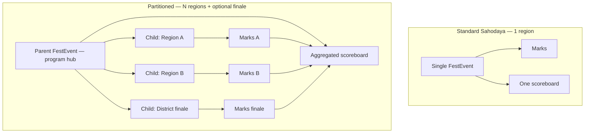

# Fest Conduct Topology — Single Region vs Multi-Region

**Audience:** Product, architects, developers  
**Problem:** Most Sahodayas run one district fest in one place. Some (e.g. MCS Malappuram) run **parallel regions** with separate scoreboards, then a **finale** and an **overall championship**. The platform must support both without per-tenant forks.

**Related:** [`MCS_KALOTSAV_IMPLEMENTATION_PLAN.md`](MCS_KALOTSAV_IMPLEMENTATION_PLAN.md) · [`erp/11-KALOTSAVAM.md`](erp/11-KALOTSAVAM.md)

---

## 1. Design principle

> **One engine, configurable topology — not one codebase per Sahodaya.**

| Sahodaya type | User experience | Platform mechanism |
|---------------|-----------------|-------------------|
| **Standard** (most) | One fest, one venue, one scoreboard | `conduct_mode: standard` — **today’s behaviour, unchanged** |
| **Multi-region** (MCS) | Tirur + Manjeri boards, then district + overall | `conduct_mode: partitioned` + region children |
| **Multi-cluster** (Kids Fest) | Geographic clusters + combined board | Same as partitioned (already shipped for Kids Fest) |
| **Multi-phase, single place** | Digi day → off-stage day → main day, one region | Usually **one event** + schedule; optional phase children |

**Default for new events:** `standard`. Multi-region is opt-in at event creation.

---

## 2. Conceptual model



### Vocabulary

| Term | Meaning |
|------|---------|
| **Program event** | Root fest instance schools recognise (may be parent or sole event) |
| **Partition child** | Child `FestEvent` where marks actually live for a slice of the program |
| **Partition role** | Why this child exists: `region`, `cluster`, `phase`, `finale`, `school_round` |
| **Conduct mode** | `standard` \| `partitioned` on the program event |
| **Aggregation** | How parent builds combined scoreboard from children |

---

## 3. Data model (proposed)

### 3.1 On `fest_events` (program / root)

```sql
conduct_mode          VARCHAR(20)  DEFAULT 'standard'  -- standard | partitioned
aggregation_config    JSON         NULL                -- see §3.3
scoring_preset        VARCHAR(64)  NULL                -- cksc_default | mcs_kalotsav | ...
```

Keep existing columns:

- `parent_event_id`, `cluster_key`, `cluster_label` — partition child identity (already used by Kids Fest)
- `level_round` — school / sahodaya / state (vertical level, orthogonal to geography)
- `conduct_levels` — which vertical levels run (school rounds, etc.)

### 3.2 On partition children

```sql
partition_role   VARCHAR(32)  NULL  -- region | cluster | phase | finale | school_round | digi_fest
partition_key    VARCHAR(64)  NULL  -- tirur | manjeri | nilambur (synonym: cluster_key)
```

**Migration strategy:** Treat `cluster_key` as `partition_key` for backward compatibility. New code reads `partition_key ?? cluster_key`.

### 3.3 `aggregation_config` JSON

```json
{
  "scoreboard": {
    "strategy": "sum_children",
    "include_roles": ["region", "finale"],
    "exclude_roles": ["school_round", "digi_fest"]
  },
  "registration": {
    "hub": "parent",
    "route_to": "region_child_by_school"
  },
  "results": {
    "parent_publishes": false,
    "children_publish_independently": true
  },
  "promotion": {
    "per_partition_qualifiers": 1,
    "finale_qualifiers": [1, 2]
  }
}
```

**Standard Sahodaya** — `conduct_mode: standard`, `aggregation_config: null`. No children required.

### 3.4 School → partition assignment (multi-region only)

```sql
fest_event_school_partitions
  event_id      -- parent program event
  school_id
  partition_key -- tirur | manjeri
  assigned_by, assigned_at
```

Not used when `conduct_mode = standard`.

### 3.5 Catalog item tags (optional phases / finale)

On `fest_catalog_items` / `fest_event_items`:

```json
{
  "partition_roles": ["region"],
  "mcs_only": true,
  "is_digi_fest": false
}
```

When syncing parent → child, enable only items matching child’s `partition_role`.

---

## 4. Service layer (single API for all topologies)

Replace Kids-Fest-only cluster service with a neutral **`FestPartitionService`**.

| Method | Standard | Partitioned |
|--------|----------|-------------|
| `isProgramHub($event)` | `!parent_event_id && conduct_mode=partitioned` | same |
| `partitions($hub)` | `[]` | child events |
| `marksEvent($hub, $school)` | `$hub` itself | region child for school |
| `scoreboard($event, $scope)` | school points on event | `self` = child only; `overall` = aggregate on hub |
| `combinedScoreboard($hub)` | same as scoreboard | sum per `aggregation_config` |

**`EventContext`** delegates to `FestPartitionService` instead of branching on `kids_fest`:

```php
// Pseudocode
public function scoreboardBySchool(): array
{
    $partition = app(FestPartitionService::class);

    if ($partition->shouldAggregateAt($this->event)) {
        return $partition->combinedScoreboard($this->event);
    }

    return $partition->scoreboardForEvent($this->event);
}
```

Controllers and portals **never** check `event_type === 'kids_fest'` for scoreboards — only conduct mode.

---

## 5. User flows by topology

### 5.1 Standard Sahodaya (default — no change)

```
Create event → Enable items → Schools register → Marks → Publish → One leaderboard
```

- Schools register on the **same** `fest_event`.
- `/leaderboard`, public portal, reports: all scoped to that `event_id`.
- **Zero** partition UI, **zero** school assignment step.

### 5.2 Multi-region (MCS-style)

```
Create program (partitioned) → Define regions (Tirur, Manjeri) → Assign schools to regions
→ Schools register on program hub → Registrations routed to region child
→ Each region: marks + publish + regional scoreboard
→ Finale child: district items + marks
→ Hub: overall scoreboard = sum(region points) + sum(finale points)
```

### 5.3 Multi-cluster (Kids Fest — migrate to same service)

Same as multi-region technically; UI labels say **“Cluster”** instead of **“Region”**. `partition_role = cluster`.

### 5.4 Multi-phase, single region (common variant)

Example: Digi Fest on 5 Sep, main fest on 25 Sep — **same city, no Tirur/Manjeri split**.

**Recommended (simple):** `conduct_mode: standard`, one event, items tagged `phase: digi|main`, schedule filters by date.

**Use partitioned only if** committee wants **separate result publish** or **separate appeal windows** per phase:

```
Parent (partitioned)
  ├── child phase=digi_fest
  └── child phase=main
aggregation: sum_children for overall trophy
```

### 5.5 School → Sahodaya → State (existing vertical)

`level_round` + `conduct_levels` stay as they are. **Geographic partition is orthogonal:**

| | Single region | Multi-region |
|--|---------------|--------------|
| School round | `level_round=school`, child per school | Same |
| Sahodaya cluster | `level_round=sahodaya`, one event | `level_round=sahodaya`, partitioned hub |
| State | promotion from sahodaya | promotion from hub or per-region rules |

---

## 6. UI rules (conditional, not separate apps)

| UI surface | `standard` | `partitioned` |
|------------|------------|---------------|
| Event create wizard | Hidden: regions | Step: “How is this fest conducted?” → Single / Multi-region / Multi-phase |
| Levels page | School rounds only | + “Manage partitions” (reuse Levels.vue cluster form) |
| School registration | Current page | + region badge; backend routes to child |
| Leaderboard hub | One table | Tabs: Overall \| Region A \| Region B \| Finale |
| Public fest portal | `/fest/{id}` | Hub page + deep links to partition results |
| Reports | Current exports | + per-partition + combined cumulative |

**Feature detection in frontend:**

```js
const isPartitioned = event.conduct_mode === 'partitioned';
const partitions = event.partitions ?? []; // eager-loaded on hub only
```

---

## 7. Configuration presets (per Sahodaya tenant, not hardcoded)

`config/fest_conduct_presets.php`:

```php
return [
    'standard_kalotsav' => [
        'conduct_mode' => 'standard',
        'label' => 'Single venue district Kalotsav',
    ],
    'mcs_regional_kalotsav' => [
        'conduct_mode' => 'partitioned',
        'label' => 'MCS — Tirur + Manjeri + District finale',
        'default_partitions' => [
            ['key' => 'tirur', 'role' => 'region', 'label' => 'തിരൂർ മേഖല'],
            ['key' => 'manjeri', 'role' => 'region', 'label' => 'മഞ്ചേരി മേഖല'],
            ['key' => 'district', 'role' => 'finale', 'label' => 'ജില്ലാ മത്സരം'],
        ],
        'aggregation_config' => [ /* ... */ ],
        'scoring_preset' => 'mcs_kalotsav',
    ],
    'kids_fest_clusters' => [
        'conduct_mode' => 'partitioned',
        'partition_role_default' => 'cluster',
        // ...
    ],
];
```

Tenant onboarding can set **default conduct preset** on `sahodaya_profiles` (optional). New events inherit; admin can override.

---

## 8. Similar cases checklist

| Scenario | Topology | Notes |
|----------|----------|-------|
| One district, one hall | `standard` | Default |
| Two regions, shared district finale | `partitioned` + `region` + `finale` | MCS |
| Three off-stage venues, two semi-stage regions | `partitioned` + optional sub-venues on schedule | Sub-venue ≠ partition unless separate scoreboards needed |
| Kids Fest geographic clusters | `partitioned` + `cluster` | Existing; migrate service |
| School kalotsav → cluster winner | `conduct_levels` includes `school` | Existing promotion |
| Digi fest + main fest, same place | `standard` + schedule **or** `partitioned` + `phase` | Prefer standard unless separate publish |
| State program sync | `state_program_id` | Unaffected by partition |
| Sports meet (houses) | `standard` + houses | Houses ≠ geographic partitions |

---

## 9. Implementation order (platform-wide)

| Step | Work | Breaks existing? |
|------|------|------------------|
| 1 | Add `conduct_mode`, `partition_role`, `aggregation_config` (nullable, default standard) | No |
| 2 | `FestPartitionService` extracting logic from `FestKidsFestClusterService` | No — Kids Fest keeps working |
| 3 | `EventContext` + leaderboard use partition service | No — standard events same path |
| 4 | Registration router (only when `route_to` config set) | No |
| 5 | `fest_event_school_partitions` + admin UI | No |
| 6 | Kalotsav preset `mcs_regional_kalotsav` | MCS only |
| 7 | Deprecate direct `kids_fest` checks in scoreboard code | Cleanup |

**Rule:** If `conduct_mode` is null or `standard`, **every code path must behave exactly as today**.

---

## 10. Decision guide for implementers

```
Does this Sahodaya need MORE THAN ONE independent scoreboard
for the same program before the final championship?

  NO  → conduct_mode = standard
        (one event_id for marks, results, leaderboard)

  YES → conduct_mode = partitioned
        → How many geographic competition zones?
            → N region/cluster children
        → Is there a final round that adds to overall points?
            → finale child (partition_role = finale)
        → Do schools compete in only one zone?
            → fest_event_school_partitions
        → aggregation_config.include_roles = [region, finale]
```

---

## 11. MCS mapped to generic model

| MCS concept | Generic field |
|-------------|---------------|
| തിരൂർ മേഖല | `partition_key=tirur`, `partition_role=region` |
| മഞ്ചേരി മേഖല | `partition_key=manjeri`, `partition_role=region` |
| ജില്ലാ മത്സരം | `partition_key=district`, `partition_role=finale` |
| ഓവറോൾ ചാമ്പ്യൻഷിപ്പ് | `combinedScoreboard(hub)` |
| മേഖലയുടെ സ്വന്തം റിസൽട്ട് | `scoreboard(region_child)` only |

---

*Last updated: July 2026*
