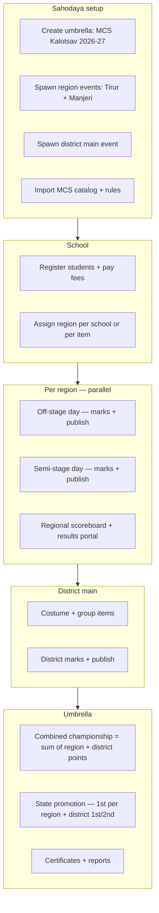

# MCS Kalotsav 2026–27 — Implementation Plan

**Sahodaya:** Malappuram Central Sahodaya (MCS)  
**Scope:** District Kalotsav with **two regional zones** — **തിരൂർ** and **മഞ്ചേരി**  
**Source manual:** `MCS KALOTSAV MANUAL 2026-27`  
**Companion:** [`FEST_CONDUCT_TOPOLOGY.md`](FEST_CONDUCT_TOPOLOGY.md) (platform-wide single vs multi-region design) · [`USER_FLOWS_AND_PAGES.md`](USER_FLOWS_AND_PAGES.md) · [`erp/11-KALOTSAVAM.md`](erp/11-KALOTSAVAM.md)

---

## 1. Business summary (Malayalam context)

മലപ്പുറം സെൻട്രൽ സഹോദയയുടെ ജില്ലാ കലോത്സവം **രണ്ട് മേഖലകളായി** നടക്കുന്നു:

| മേഖല | Region key | Role |
|------|------------|------|
| **തിരൂർ മേഖല** | `tirur` | Own off-stage (and semi-stage) competitions, own results |
| **മഞ്ചേരി മേഖല** | `manjeri` | Own off-stage (and semi-stage) competitions, own results |

**പ്രധാന നിയമങ്ങൾ:**

1. ഓരോ മേഖലയിലും ഓഫ്-സ്റ്റേജ് (അല്ലെങ്കിൽ അതാത് ഘട്ടത്തിലെ) മത്സരങ്ങൾ **വെവ്വേറെ** നടക്കും.
2. ഓരോ മേഖലയ്ക്കും **സ്വന്തം സ്കോർബോർഡും റിസൽട്ടും** കാണിക്കണം — മറ്റ് മേഖലയുടെ മാർക്ക് ഇല്ലാതെ.
3. **ജില്ലാ മത്സരം** (costume + group items, main venue) കഴിഞ്ഞ് **ഓവറോൾ ചാമ്പ്യൻഷിപ്പ്** കണക്കാക്കുമ്പോൾ:
   - തിരൂർ മേഖലയിൽ നേടിയ പോയിന്റുകൾ +
   - മഞ്ചേരി മേഖലയിൽ നേടിയ പോയിന്റുകൾ +
   - ജില്ലാ മത്സരത്തിൽ നേടിയ പോയിന്റുകൾ  
   → **ആകെ പോയിന്റിൽ** സ്കൂൾ റാങ്കിംഗ്.

> **Manual note:** The printed manual also lists **Nilambur** and **Perinthalmanna** as separate off-stage venues (10 Sep). Phase 1 implements the **two-region** model MCS described (Tirur + Manjeri). Nilambur/Perinthalmanna can be added later as sub-venues under Manjeri region if the committee confirms.

---

## 2. Target user journey



---

## 3. Architecture decision: Umbrella + child events

MCS is the first **multi-region** Kalotsav tenant; most other Sahodayas stay **`conduct_mode: standard`** (one event, one scoreboard). See [`FEST_CONDUCT_TOPOLOGY.md`](FEST_CONDUCT_TOPOLOGY.md).

**Reuse the existing Kids Fest cluster pattern** (`parent_event_id`, `cluster_key`, `cluster_label`) and **generalize via `FestPartitionService`** — not a Kalotsav-only fork.

| Event | `parent_event_id` | `cluster_key` | `event_segment` | Dates (manual) |
|-------|-------------------|---------------|-----------------|----------------|
| **MCS Kalotsav 2026-27** (umbrella) | `null` | `null` | `umbrella` | Academic year |
| Tirur Region Kalotsav | umbrella id | `tirur` | `region` | Off: 10 Sep · Semi: 19 Sep |
| Manjeri Region Kalotsav | umbrella id | `manjeri` | `region` | Off: 10 Sep · Semi: 19 Sep |
| Digi Fest (optional child) | umbrella id | `digi` | `digi_fest` | 05 Sep |
| District Main Kalotsav | umbrella id | `district` | `district` | 25–26 Sep |

**Why child events (not one event with venue tags):**

- Each region needs **independent** mark entry, results publish, appeals, and public scoreboard.
- District main is a **different date, venue, and item set** (costume + group).
- Umbrella already has `FestKidsFestClusterService::combinedScoreboard()` — extend for Kalotsav.
- Schools register once at umbrella level; registrations **route** to the correct region child (see §5).

---

## 4. Implementation phases

### Phase 0 — Discovery & committee sign-off (2–3 days)

| Task | Owner | Output |
|------|-------|--------|
| Confirm two-region model vs manual’s 3 off-stage venues | MCS committee | Written decision |
| Confirm school→region mapping (fixed by school address vs per-registration) | MCS committee | Rule doc |
| Freeze item list + MCS-only (`MCS`) + Digi (`**`) flags | Data entry | Signed-off CSV |
| Freeze fee: ₹4000 school + ₹400/₹50 tier | Finance | Fee schedule |

**Exit criteria:** Signed item CSV + region assignment rule.

---

### Phase 1 — Data model & region engine (1 week)

#### 1.1 Generalize cluster support for Kalotsav

| Change | File / area |
|--------|-------------|
| Rename or generalize `FestKidsFestClusterService` → `FestRegionalClusterService` | `app/Services/Events/` |
| `isUmbrella()` accepts `event_type in ['kids_fest', 'kalotsav']` | Same service |
| `spawnCluster()` accepts kalotsav | Same + `FestEventController` |
| `EventContext::scoreboardClusters()` works for kalotsav umbrella | `EventContext.php` |
| Levels UI: show cluster spawn for kalotsav umbrella | `Levels.vue` |

#### 1.2 New columns on `fest_events`

```sql
-- migration
event_segment  VARCHAR(32) NULL  -- umbrella | region | digi_fest | district | school
region_key     VARCHAR(64) NULL  -- tirur | manjeri (alias cluster_key for regions)
```

Keep `cluster_key` / `cluster_label` for backward compatibility with Kids Fest.

#### 1.3 School region assignment

```sql
-- tenant migration
fest_school_regions
  id, event_id (umbrella), school_id, region_key, assigned_at, assigned_by
```

**Rule options (config per umbrella):**

- `by_school` — one region per school for all items (simplest for MCS).
- `by_item` — rare; only if committee needs split teams.

Service: `FestSchoolRegionService::resolveRegion($umbrella, $school)`.

#### 1.4 Registration routing

When school registers on **umbrella** event:

1. Resolve school `region_key`.
2. Create `FestRegistration` on **region child** event (not umbrella).
3. Umbrella shows aggregated registration counts; region child is source of truth for marks.

**New:** `FestRegistrationRouterService` — called from `FestRegistrationReviewController` / school registration flow.

**Exit criteria:** Can create umbrella + 2 region children; school assigned to Tirur; registration appears only in Tirur child event.

---

### Phase 2 — MCS catalog & scoring rules (1 week)

#### 2.1 MCS item seed file

Create `app/Support/data/mcs_kalotsav_items.php` with:

| Field | Purpose |
|-------|---------|
| `item_code` | 101–513 per manual |
| `class_group` | lp / up / hs / hss |
| `stage_type` | off_stage / on_stage |
| `event_segment` | `region` \| `district` \| `digi_fest` |
| `mcs_only` | true = not at CBSE state |
| `is_digi_fest` | true for `**` items |
| `min_group_size` / `max_group_size` / `standbys` | Group rules |
| `criteria_json` | Value-point rubrics from manual (for judge PDF) |

Command: `php artisan fest:sync-catalog --preset=mcs_kalotsav`.

#### 2.2 Item filtering per child event

When copying items from umbrella → child via `FestItemSyncService`:

- **Region child:** enable only `event_segment in (region, digi_fest)` + off/semi items.
- **District child:** enable only `event_segment = district` + group items (501–513).

#### 2.3 MCS grade & point presets

New config: `config/fest_mcs_scoring.php`

**Grades (no A+):**

| Grade | Min % |
|-------|-------|
| A | 70 |
| B | 60 |
| C | 50 |

**Point tables** — individual and group from manual (grade × place matrix).

Apply via event settings:

- `FestGradeConfig` seeded on umbrella create.
- `FestPointRule` rows for `is_group` true/false.

Service update: `FestGradePointService` reads `event->scoring_preset === 'mcs_kalotsav'`.

#### 2.4 Participation & fee presets

New: `config/fest_participation_presets.php` entry `mcs_kalotsav_2026`:

| Rule | Value |
|------|-------|
| Student combo | OR: (2 off + 3 on) OR (3 off + 2 on), max 2 group |
| Per school regional | 2 participants per regional item |
| Per school digi + district | 1 participant/team |
| Standbys | 2, no fee, exclude from limits |
| Fees | ₹4000 school + tiered per-student |

**Combo OR logic:** extend `FestComboRuleService` with `combo_profiles` — student must satisfy **one** profile.

**Exit criteria:** MCS catalog synced; region event shows only regional items; grades/points match manual worked example.

---

### Phase 3 — Regional scoreboards & results (1 week)

#### 3.1 Per-region scoreboard (isolated)

| Surface | Behaviour |
|---------|-----------|
| Region child `/leaderboard` | Points from **this region event only** |
| Region public portal `/fest/{regionEventId}` | Results filtered to region |
| Display screens | Scoped to `event_id` = region child |

No code change to core scoring — **isolation is by event_id**.

#### 3.2 Umbrella combined championship

Extend `FestRegionalClusterService::combinedScoreboard()`:

```text
overall_school_points[school] =
  points(region_tirur, school) +
  points(region_manjeri, school) +
  points(district_main, school)
```

| Surface | Behaviour |
|---------|-----------|
| Umbrella `/leaderboard` | Tabs: **Overall** \| Tirur \| Manjeri \| District |
| Umbrella `/championship` | Combined school ranking |
| Report `cumulative` PDF | Breakdown columns per segment |

**UI:** `LeaderboardHub.vue` — add cluster tabs when `scoreboardClusters()` non-empty (already partially supported for Kids Fest; extend to kalotsav).

#### 3.3 Results publish workflow

| Level | Who publishes | What |
|-------|---------------|------|
| Region | Region mark entry admin | Per-item results → regional scoreboard updates |
| District | District mark entry admin | Costume/group results |
| Umbrella | Sahodaya admin | “Finalize championship” recalculates combined board (read-only aggregate) |

**Important:** Umbrella does **not** re-enter marks — it **aggregates** published marks from children.

**Exit criteria:** Tirur school sees only Tirur board; umbrella shows Tirur + Manjeri + District sum.

---

### Phase 4 — District event & state promotion (1 week)

#### 4.1 District main child event

- Spawn `cluster_key = district`, segment `district`.
- Items: costume on-stage + all group items (501–513).
- Venue: St. Alphonsa Public School, Oorakam (25–26 Sep).

#### 4.2 Qualification rules

| Source | Qualifiers to state |
|--------|---------------------|
| Each region (Tirur, Manjeri) | 1st in regional item (2nd if 1st declines + principal consent letter) |
| District main | 1st and 2nd |
| MCS-only items | No state propagation |
| English One Act Play | Only 1st (single state entry) |

Implement in `FestQualificationService`:

- New method `promoteRegionalWinnersToState($regionEvent, $stateEvent, $options)`.
- Track `declined_state` + `consent_letter_uploaded` on participant.

#### 4.3 Consent & substitution

| Feature | Implementation |
|---------|----------------|
| State decline + 2nd promotion | `FestParticipant.meta` JSON + admin action |
| 24h substitution ₹500 | Extend `FestSubstitutionRequest` with fee + affidavit upload |
| Appeal ₹5000 / 1 hour | Existing appeals + enforce principal-only + MCS PDF |

**Exit criteria:** Promotion sheet lists correct state qualifiers per manual rules.

---

### Phase 5 — Forms & downloadable sheets (1 week)

#### 5.1 PDF templates (new Blade views)

| Manual | Template | Export route |
|--------|----------|--------------|
| Appendix I | `fest/forms/judge-declaration.blade.php` | `/reports/export/judge-declaration` |
| Appendix II | `fest/forms/judge-feedback.blade.php` | `/reports/export/judge-feedback` |
| Appendix III | `fest/forms/appeal-proforma.blade.php` | Pre-fill from appeal record + download |
| Appendix IV | `fest/forms/appeal-order.blade.php` | Generated on appeal resolve |

#### 5.2 Existing exports (enhance)

| Export | Enhancement |
|--------|-------------|
| Judge Evaluation Sheet | Auto-fill `criteria_json` from MCS catalog |
| Mark Entry Sheet | Add grade + points columns per MCS |
| Tabulation Sheet | **New** — grade × place × points matrix per item |
| Result Sheet | Per region + combined umbrella PDF |

#### 5.3 Custody register

Report: **Marksheets / Tabulation / Results custody log** — who received, when, signature column (PDF for convener).

**Exit criteria:** Committee can print all day-of forms from Sahodaya admin without Excel.

---

### Phase 6 — School & ops portals (1 week)

#### 6.1 School admin

| Page | Change |
|------|--------|
| Registration | Show assigned region badge (തിരൂർ / മഞ്ചേരി) |
| Results | Filter by region event |
| Appeals | MCS proforma download after submit |

#### 6.2 Ops portals

| Role | Scope |
|------|-------|
| Judge | Assigned to **region or district** event only |
| Stage manager | Per venue within region/district |
| Mark entry coordinator | Per item head within one child event |
| Fest ops registration desk | Region-scoped |

#### 6.3 Public fest portal

- `/fest/{umbrellaId}` — overall championship + links to region results.
- `/fest/{regionEventId}` — regional results only.

**Exit criteria:** End-to-end UAT with 2 test schools (one per region).

---

### Phase 7 — UAT & go-live (1 week)

Follow [`erp/22-QA_UAT.md`](erp/22-QA_UAT.md) with MCS-specific scenarios:

| # | Scenario |
|---|----------|
| 1 | School in Tirur registers 3 off + 2 on — combo validation |
| 2 | Same item in Tirur and Manjeri — separate winners, separate boards |
| 3 | District group item — points flow to umbrella combined |
| 4 | Overall champion = Tirur pts + Manjeri pts + District pts |
| 5 | MCS-only item — no state promotion |
| 6 | Appeal within 1 hour, fee recorded |
| 7 | Judge sheet PDF shows correct 4×25 criteria for Pencil Drawing |
| 8 | Digi Fest digital painting — chest number file naming rule (ops checklist) |

---

## 5. File-level change map

### New files

| Path | Purpose |
|------|---------|
| `app/Support/data/mcs_kalotsav_items.php` | Full MCS catalog |
| `config/fest_mcs_scoring.php` | Grade bands + point matrices |
| `app/Services/Events/FestRegionalClusterService.php` | Generalized cluster + combined scoreboard |
| `app/Services/Events/FestSchoolRegionService.php` | School → region assignment |
| `app/Services/Events/FestRegistrationRouterService.php` | Route regs to region child |
| `database/migrations/tenant/..._fest_regional_kalotsav.php` | `event_segment`, `fest_school_regions` |
| `resources/views/fest/forms/*.blade.php` | Appendix I–IV |
| `resources/views/fest/reports/tabulation-sheet.blade.php` | MCS tabulation |
| `docs/MCS_KALOTSAV_IMPLEMENTATION_PLAN.md` | This document |

### Modified files (high touch)

| Path | Change |
|------|--------|
| `app/Services/Events/EventContext.php` | Kalotsav cluster scoreboards |
| `app/Services/Events/FestGradePointService.php` | MCS preset |
| `app/Services/Events/FestComboRuleService.php` | OR combo profiles |
| `app/Services/Events/FestQualificationService.php` | Regional → state rules |
| `config/fest_participation_presets.php` | `mcs_kalotsav_2026` |
| `app/Http/Controllers/SahodayaAdmin/FestEventController.php` | Spawn region/district children |
| `resources/js/Pages/Admin/Sahodaya/Events/Levels.vue` | Kalotsav region UI |
| `resources/js/Pages/Admin/Sahodaya/Events/LeaderboardHub.vue` | Region tabs + overall |
| `app/Support/FestReportCatalog.php` | New form exports |

---

## 6. Event calendar (from manual)

| Date | Segment | Event child | Venue |
|------|---------|-------------|-------|
| 05 Sep 2026 | Digi Fest | `digi` | Al Hidayath, Kondotty |
| 10 Sep 2026 | Off-stage regional | `tirur`, `manjeri` | Per region venues |
| 19 Sep 2026 | Semi-stage regional | `tirur`, `manjeri` | Per region venues |
| 25–26 Sep 2026 | District main | `district` | St. Alphonsa, Oorakam |

---

## 7. Scoring example (verify in UAT)

**Individual item, Grade A, 1st place:**

- Grade points: 5  
- Place points: 5  
- **Total: 10** (feeds regional scoreboard)

**Group item, Grade B, 2nd place:**

- Grade base: 6  
- Place: 6  
- **Total: 12**

School championship = sum of all such totals across all items in that region, then add other region + district.

---

## 8. Risks & mitigations

| Risk | Mitigation |
|------|------------|
| Kids Fest cluster logic hardcoded to `kids_fest` | Generalize service in Phase 1 before MCS go-live |
| Schools register on wrong region | Lock region at assignment; show badge; admin override |
| Double-counting marks at umbrella | Umbrella never stores marks — aggregate only from children |
| Manual has 3 off-stage venues, user wants 2 regions | Phase 0 committee decision; optional sub-venue field on schedule |
| Item code mismatch vs CKSC seed | Separate `mcs_kalotsav` preset — do not overwrite CKSC catalog |
| OR combo (2+3 vs 3+2) not supported | Phase 2 combo profiles before registration opens |

---

## 9. Suggested sprint breakdown

| Sprint | Duration | Deliverable |
|--------|----------|-------------|
| S1 | 1 week | Phase 0 + Phase 1 (umbrella, 2 regions, school assignment, reg routing) |
| S2 | 1 week | Phase 2 (MCS catalog, grades, fees, combo rules) |
| S3 | 1 week | Phase 3 (regional + combined scoreboards, leaderboard UI) |
| S4 | 1 week | Phase 4 (district event, state promotion) |
| S5 | 1 week | Phase 5 (PDF forms + tabulation sheets) |
| S6 | 1 week | Phase 6 + 7 (portals, UAT, go-live) |

**Total estimate:** ~6 weeks with 1 backend + 1 frontend developer.

---

## 10. Immediate next steps

1. **Committee:** Confirm Tirur + Manjeri two-region model and school→region mapping rule.  
2. **Dev:** Start Phase 1 — generalize `FestKidsFestClusterService` to Kalotsav.  
3. **Data:** Build `mcs_kalotsav_items.php` from manual (can start in parallel).  
4. **Pilot:** Create umbrella event on staging tenant; spawn Tirur + Manjeri; test with 2 schools.

---

*Last updated: July 2026*
