# Sports Meet — Full Verification Flow (School + Sahodaya)

**Audience:** Sahodaya admins, school admins, sports coordinators, finance, UAT / QA  
**Companion:** [`USER_FLOWS_AND_PAGES.md`](USER_FLOWS_AND_PAGES.md) · [`erp/10-SPORTS.md`](erp/10-SPORTS.md)  
**Last updated:** July 2026

This document is a **verification playbook**: what must be checked, by whom, on which page, and what “done” looks like before moving to the next phase.

---

## 1. Phases at a glance

| Phase | When | School responsibility | Sahodaya responsibility |
|-------|------|----------------------|-------------------------|
| **A. Membership & records** | Before sports season | Students complete, photos, compliance docs | Verify school membership, students, compliance docs |
| **B. Event setup** | Before registration opens | — | Catalog, age groups, event, fees, windows, rank points |
| **C. School joins event** | Registration open | Join event, pay fest fee, upload proof | Verify fest fee payment |
| **D. Item registration** | Per head window | Register athletes per item head/item | Approve/reject registrations |
| **E. Pre-event readiness** | Before fest day | Fix clashes, download ID cards / reports | Chest numbers, schedule, staff, document verification day |
| **F. Event day** | During meet | Fest day view, attendance awareness | Mark entry, gate, substitutions |
| **G. Results & closure** | After marks entered | View published results, certificates | Publish per item → event-wide, promote qualifiers |

---

## 2. Master flow

```mermaid
flowchart TB
    subgraph prereq [Phase A — Prerequisites]
        A1[School member + annual data]
        A2[Students verified]
        A3[School compliance docs approved]
    end

    subgraph setup [Phase B — Sahodaya setup]
        B1[Catalog + age groups]
        B2[Create sports event]
        B3[Setup: heads items fees windows points]
        B4[Open registration]
    end

    subgraph schooljoin [Phase C — School joins]
        C1[School registers for event]
        C2[Upload fest fee proof]
        C3[Sahodaya verifies fee]
    end

    subgraph items [Phase D — Item registration]
        D1[Step 1: Event athletes]
        D2[Step 2: Register by item head]
        D3[Sahodaya approves registrations]
    end

    subgraph pre [Phase E — Pre-event]
        E1[Document verification day]
        E2[Chest + item reg numbers]
        E3[Schedule published]
        E4[Item head coordinators assigned]
    end

    subgraph day [Phase F — Event day]
        F1[Attendance on mark entry]
        F2[Time distance rank marks]
    end

    subgraph post [Phase G — Results]
        G1[Marks complete per item]
        G2[Publish item results]
        G3[Publish all event results]
        G4[School sees published marks]
    end

    A1 --> A2 --> A3 --> B1
    B1 --> B2 --> B3 --> B4
    B4 --> C1 --> C2 --> C3
    C3 --> D1 --> D2 --> D3
    D3 --> E1 --> E2 --> E3 --> E4
    E4 --> F1 --> F2
    F2 --> G1 --> G2 --> G3 --> G4
```



---

## 3. URL patterns

| Actor | Base pattern |
|-------|----------------|
| **Sahodaya** | `/sahodaya-admin/{sahodayaId}/…` |
| **School** | `/school-admin/{schoolId}/sports-meet/…` (program slug may vary) |
| **Student portal** | `/portal/student/{schoolId}/…` |

Sports program hub (school): `/school-admin/{schoolId}/sports-meet`  
Sports event (school): `/school-admin/{schoolId}/sports-meet/events/{eventId}/…`  
Sports event (Sahodaya): `/sahodaya-admin/{sahodayaId}/events/{eventId}/…`

---

## 4. Phase A — Prerequisites (verify before sports registration)

### 4.1 Sahodaya verification checklist

| # | Check | Page | Done when |
|---|-------|------|-----------|
| A1 | School is approved member | `/membership/schools` | Status active, current academic year |
| A2 | Annual submission complete (if required) | Membership → annual submissions | Submitted & accepted |
| A3 | **Students verified** | `/students/verification` | Athletes show **Verified** (or event allows unverified) |
| A4 | **Compliance documents** | `/documents/review` | Required doc types **Approved** per school |
| A5 | Sports age groups configured | `/sports/age-groups` | Cutoffs match current season |
| A6 | Sports catalog / heads | `/sports/catalog` | Items enabled, heads aligned with CKSC |

**Gate in code:** `StudentVerificationGate` blocks item registration if `require_student_verification` is on (Sahodaya profile or per-event fee settings).

### 4.2 School verification checklist

| # | Check | Page | Done when |
|---|-------|------|-----------|
| A1 | Student records complete | `/students` | Name, reg no, class, photo, DOB for athletes |
| A2 | Student verification status | Student list / profile | **Verified** (or Sahodaya disabled requirement) |
| A3 | Upload compliance documents | `/documents` | All mandatory types uploaded, not rejected |
| A4 | Houses assigned (if used) | `/houses` | Athletes linked to houses for championship |

---

## 5. Phase B — Sahodaya event setup (verify before opening registration)

| # | Check | Page | Done when |
|---|-------|------|-----------|
| B1 | Event created | `/sports` → create event | Status draft/scheduled |
| B2 | **Setup hub** complete | `/events/{id}/setup` | Heads synced, items enabled, fees set |
| B3 | Registration windows | Settings → lifecycle / item heads | Per-head `reg_start` / `reg_end` set |
| B4 | Rank points master | `/settings/points` or setup | 1st/2nd/3rd points defined |
| B5 | Fee model | Settings → fees | Sports composite / per-item fees configured |
| B6 | Chest numbering | Settings → numbering | Start numbers defined |
| B7 | Open registration | Settings → lifecycle | `registration_open` / event status allows school join |

**Reports to verify setup:** Sahodaya → event → **Reports hub** → item counts, assignment completeness (empty until schools register).

---

## 6. Phase C — School joins event + fee verification

### 6.1 School flow

```
Sports Meet → Registration
  → Select Sahodaya event → Register school for event
  → If fee required: upload payment proof (Payments / event payment)
  → Wait for Sahodaya verification before Step 2 (item registration)
```

| Step | Page | Verify |
|------|------|--------|
| Join event | `/sports-meet/registration` or `/events/{id}/registration` | School appears on event registration list |
| Pay fest fee | Event registration → upload proof | Proof uploaded, status **Pending** |
| After verify | Same page | Banner clears; **Step 2** item registration enabled |

**Gate in code:** `FestRegistrationFeeGate` — for sports, school event fee must be **verified** before item registration (default).

### 6.2 Sahodaya fee verification

| # | Check | Page | Done when |
|---|-------|------|-----------|
| C1 | Review uploaded proofs | `/payments` (unified) or `/events/{id}/fees` | Proof visible per school |
| C2 | Approve / reject | `/events/{id}/school-fees/{id}/approve` | Status **Paid / Verified** |
| C3 | Receipt issued | Fees ledger | Receipt email/log if configured |

**School report:** `/sports-meet/reports/{eventId}/fee-summary` — school sees own fee status.

---

## 7. Phase D — Item registration & approval

### 7.1 School — two-step sports registration

| Step | Page | Purpose |
|------|------|---------|
| **Step 1** | `/events/{id}/registration` | Register **event athletes** (who participates in this fest) |
| **Step 2** | `/events/{id}/items?head_id=X` | Register athletes **per item** under item head (Athletics, Chess, …) |

**Per head:**
1. Pick item head tab (e.g. Athletics).
2. Select item via **search + dropdown** (not full list).
3. Assign students; submit registration (status **Pending** until approved).

**Eligibility checked on submit:**
- Student verified (if required)
- Age group / class / gender match item
- Max per school / max items per student
- Registration window open for head/item
- School fest fee cleared (Phase C)

### 7.2 Sahodaya — registration approval

| # | Check | Page | Done when |
|---|-------|------|-----------|
| D1 | Pending queue | `/events/{id}/registrations` | Filter pending; review by school/head/item |
| D2 | Approve / reject | Same | Status **Approved**; reject reason sent if rejected |
| D3 | Competition hub | `/events/{id}/competition` | Per-head counts match expectations |
| D4 | Clashes (optional) | `/events/{id}/clash-requests` | Conflicts resolved or approved |

**School reports to verify registrations:**

| Report | Path | Use |
|--------|------|-----|
| Item registration counts | `/reports/{eventId}/item-counts` | Counts by head/item; **eye icon** → participant list; PDF/Excel |
| Registration register | `/reports/{eventId}/registration-register` | Full register with fees |
| Pending approvals | `/reports/{eventId}/pending-approvals` | School’s pending items |
| Head-wise participants | `/reports/{eventId}/head-wise` | Printable list with photos |

---

## 8. Phase E — Pre-event verification

### 8.1 Document verification day (on-site)

| Actor | Page | Action |
|-------|------|--------|
| Sahodaya | `/events/{id}/settings` → **Lifecycle** | Set **verification day** date |
| Sahodaya | Same → School document verification table | **Mark verified** per school after physical check |
| School | `/events/{id}/fest-day` or registration | Banner: **Verified** / **Pending verification** |

Stored in `fest_school_verifications.documents_verified`.

### 8.2 Operational readiness (Sahodaya)

| # | Check | Page | Done when |
|---|-------|------|-----------|
| E1 | Chest numbers | `/events/{id}/chest-numbers` | All performers have chest # (head → item picker) |
| E2 | Item reg numbers | Chest numbers → assign item reg | Item registration numbers assigned |
| E3 | Schedule | `/events/{id}/schedule` | Items scheduled; **schedule published** if public |
| E4 | Item head staff | `/events/{id}/event-staff` | Coordinators assigned per head (marks duty) |
| E5 | ID cards / admit | Reports → ID cards | PDF generates for head/item |

**Readiness reports (both sides):**

| Report | Sahodaya | School |
|--------|----------|--------|
| Assignment completeness | Reports hub | `/reports/{eventId}/assignment-completeness` |
| Schedule / clashes | Reports hub | `/reports/{eventId}/schedule-clashes` |
| Attendance sheet (print) | Export | `/reports/{eventId}/attendance` |
| Numbering register | Export | `/reports/{eventId}/numbering-register` |

---

## 9. Phase F — Event day (marks & attendance)

### 9.1 Sahodaya / coordinators

| # | Check | Page | Done when |
|---|-------|------|-----------|
| F1 | Mark entry | `/events/{id}/marks?head_id=&item_id=` | Head → item navigation |
| F2 | Sports attendance | Same row | Present/absent marked |
| F3 | Time / distance | Same | Measurement entered for track/field |
| F4 | Rank / auto-rank | Same | Rank assigned; points applied from rank master |
| F5 | Portal coordinators | `/portal/fest-coordinator/{tenant}` | Head-scoped mark entry (if assigned) |

**Verify progress:** Sahodaya → Reports → **Mark entry status** (by item, % complete).

### 9.2 School (awareness only)

| Page | Purpose |
|------|---------|
| `/reports/{eventId}/mark-entry-status` | Which items still pending marks |
| `/events/{id}/fest-day` | Verification status + fest day info |

Schools do **not** enter Sahodaya meet marks unless given coordinator portal access.

---

## 10. Phase G — Results publish verification

### 10.1 Sahodaya — per-item then event-wide

```
/events/{id}/results
  → Pick item head → pick item (or use overview table)
  → Confirm all marks entered for item
  → Publish item results   (or Unpublish to correct)
  → When all items ready: Publish all results (public portal + completed status)
```

| # | Check | Page | Done when |
|---|-------|------|-----------|
| G1 | Marks complete | Results → item detail | `marks_entered = performers` |
| G2 | **Publish item** | Results → Publish | Item `results_published_at` set |
| G3 | Head-wise status | Results overview table | Published / pending counts per head |
| G4 | **Publish all** | Results → Event-wide release | `event.results_published = true` |
| G5 | Promote qualifiers | Results → promote | Next-level registrations created (if applicable) |

**Sahodaya reports:** Results exports, school-wise ranking, championship recalc.

### 10.2 School — verify published results

| # | Check | Page | Done when |
|---|-------|------|-----------|
| G1 | **Results publish status** | `/reports/{eventId}/results-publish-status` | Per head/item: Published vs pending |
| G2 | **Published results** | `/reports/{eventId}/published-results` | Marks visible for published items (or full event) |
| G3 | Student portal | `/portal/student/…/sports-results` | Student sees own published marks |
| G4 | Certificates / ID | Reports hub | After event-wide publish |

**Note:** Schools see marks for an item as soon as Sahodaya **publishes that item**, even before full event publish.

---

## 11. Side-by-side verification matrix (UAT)

Use this table to sign off a full sports meet cycle.

| Checkpoint | School can verify | Sahodaya verifies | Blocking? |
|------------|-------------------|-------------------|-----------|
| Membership active | Dashboard notice | Membership schools | Yes |
| Students verified | Student list | Student verification queue | Configurable |
| Compliance docs | `/documents` | `/documents/review` | Often yes for fest |
| Event setup complete | Event visible in registration | Setup hub checklist | Yes |
| Fest fee paid | Fee summary report | Fees → approve proof | Yes (sports default) |
| Event athletes registered | Step 1 registration | Registrations list | Yes for Step 2 |
| Items registered | Step 2 + item counts report | Approve registrations | Yes for chest/marks |
| Documents verified (fest day) | Fest day banner | Lifecycle → mark school | Operational |
| Chest / item reg | Numbering register | Chest numbers page | Yes for ops |
| Schedule | Item schedule report | Schedule published | Operational |
| Marks entered | Mark entry status report | Mark entry status report | Yes for publish |
| Item results published | Results publish status | Results page per item | Visibility gate |
| Event results published | Published results report | Publish all | Public portal |

---

## 12. Common blockers & where to fix

| Symptom | Likely cause | Fix location |
|---------|--------------|--------------|
| Cannot register for items | Fest fee not verified | School upload proof → Sahodaya approve fee |
| Student greyed out | Not verified | Sahodaya → student verification |
| “Registration closed” | Head/item window ended | Sahodaya → extend window in settings/heads |
| Cannot publish item results | Marks incomplete | Sahodaya → mark entry for that item |
| School sees no results | Item not published | Sahodaya → Results → publish item |
| No chest on reports | Not assigned | Sahodaya → chest numbers |
| Clash on schedule | Overlapping slots | Schedule clashes report → adjust or clash request |

---

## 13. Recommended verification order (Sahodaya admin run-through)

1. **Membership & students** — verification queues empty for participating schools.  
2. **Documents** — compliance docs approved.  
3. **Event setup** — setup hub green; registration opened.  
4. **Fees** — all participating schools’ fest fees verified.  
5. **Registrations** — pending queue cleared; item counts report matches expectations.  
6. **Pre-event** — verification day marked; chest numbers; schedule; staff assigned.  
7. **Event day** — mark entry status → 100% per item.  
8. **Results** — publish item-by-item; confirm schools see **Results publish status**; then **Publish all**.  
9. **Closure** — certificates, championship, leaderboard.

---

## 14. Recommended verification order (School admin run-through)

1. Students complete + verified.  
2. Upload compliance documents → wait for approval.  
3. **Step 1:** Register event athletes.  
4. Pay fest fee → wait for Sahodaya verify.  
5. **Step 2:** For each item head, use search/dropdown → register items → wait for approval.  
6. Reports: item counts, head-wise participants, ID cards.  
7. Fest day: check verification banner on fest day page.  
8. After meet: **Results publish status** → **Published results** → student portal.

---

*Derived from: `FestRegistrationFeeGate`, `StudentVerificationGate`, `FestSchoolVerification`, `FestItemResultsService`, school/Sahodaya report controllers, and sports registration UI (July 2026).*
