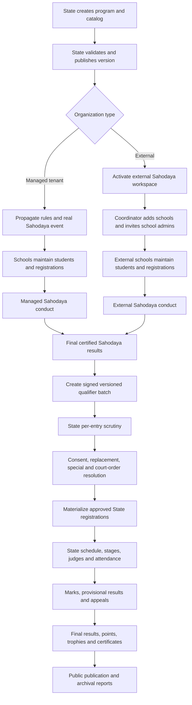
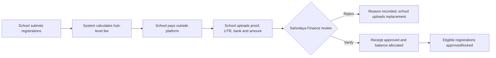
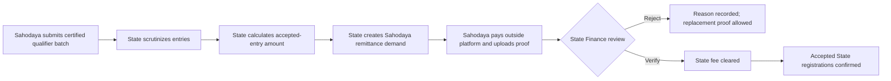
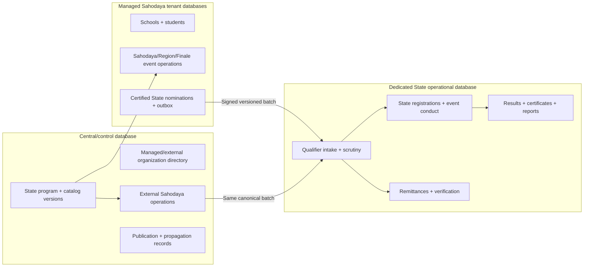
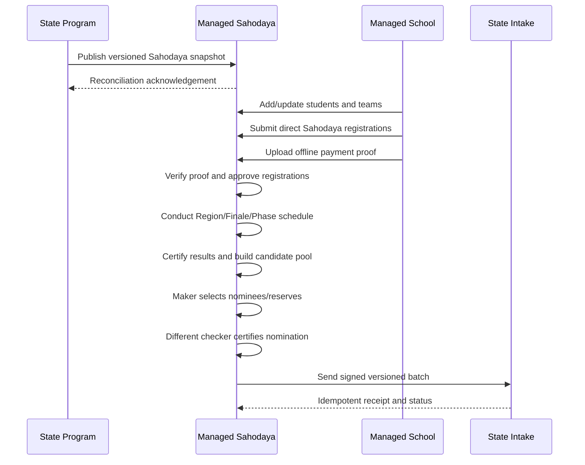

# State Kalotsav End-to-End Master Implementation Plan

**Status:** Proposed governing implementation plan — pending policy approval

**Version:** 1.3 — 10 August 2026

**Scope:** State → managed Sahodaya → managed school and State → external Sahodaya → external school, including students, event registration, conduct, qualification, State finals, results and audit

**Audience:** Product owners, State administrators, developers, QA and operations

## 1. Purpose and authority

This document defines the target production workflow for conducting a State-level Kalotsav across:

1. Sahodayas and schools that are full platform tenants.
2. Sahodayas and schools that are not platform tenants.
3. The State office that publishes the program, receives qualifiers and conducts the State final.

This is the governing plan for the complete vertical flow. It supersedes the lightweight external-winner-entry design in `STATE_LEVEL_KALOTSAV_ROLLOUT_PLAN.md` §2 and the unresolved State-database design in §3. The regional and partitioned-conduct plans remain valid for conducting a Sahodaya through regions and a finale.

The required external model is no longer:

```text
External school → type a winner's name directly into a State qualifier row
```

It is:

```text
External Sahodaya
  → External school
  → Student master
  → Event registration or team registration
  → Participation and result
  → Certified qualification
  → State scrutiny
  → State registration
```

## 2. Product outcomes

The completed system must provide:

- One authoritative State program, item catalog and rule set.
- Identical eligibility and qualification rules for managed and external organizations.
- Full school and student traceability for every State participant.
- Correct modeling of individuals, groups, teams, leaders and standbys.
- Certified, versioned and auditable result-to-qualification transitions.
- A State scrutiny process that can accept, reject, return, replace or specially admit each entry.
- A complete State competition workspace, including scheduling, judging, results, appeals, reports and public publication.
- Secure access appropriate for student data.
- Automated tests and operational checks covering the complete lifecycle.

## 3. Architectural decisions

### 3.1 System boundaries

| Boundary | Owns |
|---|---|
| Central/control database | State program master, catalog, versions, managed tenant registry, external Sahodaya/school identity, external users/invitations and propagation records |
| Managed Sahodaya tenant database | Member schools, students, school/Sahodaya events, registrations, schedules, marks, results and qualifier outbox |
| External operations schema on the central connection | External students, events, event items, registrations, teams, attendance, marks, results, evidence and certified qualifier outbox |
| State operational database | Qualifier intake, scrutiny, State registrations, participants, State event conduct, marks, appeals, certificates, reports and publication |

The State application is served on its own configured domain. State operational models use an explicit `state` database connection. State routes are domain-scoped and do not depend on accidental use of the default connection.

No database-level foreign keys are created across database boundaries. Cross-boundary references use UUIDs and are validated by application services.

### 3.2 Canonical identifiers

- State program IDs are UUIDs.
- State catalog item IDs are UUIDs everywhere, including intake and State registration tables.
- External Sahodaya, school, student, event and registration IDs are UUIDs.
- Managed tenant-local numeric IDs remain source references only; the qualifier contract transports them as strings.
- Every submission has a globally unique batch UUID and a monotonically increasing revision.
- A group/team has one registration UUID and many participant UUIDs. It must never be flattened into one registration per member.

### 3.3 Managed and external convergence

Managed and external workflows may differ before qualification, but must converge at one canonical qualifier contract:

```text
Certified managed result ─┐
                          ├─→ Versioned qualifier batch → State scrutiny → State registration
Certified external result ┘
```

State-side code must not query tenant `FestEvent`, `FestMark` or registration tables directly. The certified intake payload is the State system's source record.

## 4. Roles and permissions

| Role | Main permissions |
|---|---|
| State Admin | Configure program and catalog, onboard Sahodayas, publish, scrutinize qualifiers, manage State final, finalize and publish results |
| State Scrutiny Officer | Verify documents and eligibility; accept, reject or return entries; cannot alter program rules |
| State Event Officer | Schedule, stage, attendance, judging, marks and result operations after scrutiny |
| Managed Sahodaya Admin | Conduct propagated events, verify schools, certify results and submit qualifiers |
| Managed School Admin | Maintain students and register them directly for allowed Sahodaya events |
| External Sahodaya Coordinator | Maintain its schools, oversee registrations, conduct Sahodaya rounds, certify results and submit qualifiers |
| External School Admin | Maintain only its school and students; submit and correct its event registrations |
| Judge/Mark Entry Operator | Access only assigned items/stages and permitted mark-entry actions |
| Public user | View only explicitly published schedules, results and points |

Every authorization query must be organization-scoped. Possession of an object UUID must not grant access to another Sahodaya or school.

## 5. Authoritative end-to-end lifecycle



## 6. State program setup and publication

### 6.1 Program configuration

State Admin configures:

- Academic year, event type, title and description.
- Separate Sahodaya-level and State-level registration, scrutiny, conduct and publication windows.
- Separate Sahodaya-level defaults and State-level venues/dates.
- Conduct levels for this rollout: Sahodaya and State. Schools own registrations but do not conduct a separate Kalotsav event.
- Item catalog and catalog version.
- Individual, group or team type for each item.
- Class, age and gender eligibility.
- Minimum/maximum team sizes and standby count.
- Separate Sahodaya and State per-school/item quotas where applicable, plus the State nomination quota.
- Separate Sahodaya and State per-student on-stage, off-stage, group and total limits.
- Separate level scoring presets where the governing rules permit them; lock the State pathway scoring contract when the same table is mandatory at both levels.
- Separate Sahodaya and State fee schedules, appeal fees and refund/forfeit policies.
- Required declarations, consent and evidence.
- Regional/finale qualification policy where a Sahodaya is partitioned.

### 6.2 Publication validation

Publication is blocked unless:

- At least one conduct level is selected.
- Every item has a stable code and UUID.
- Eligibility and team-size rules are internally valid.
- Qualification counts are configured.
- Grade thresholds are ordered and non-overlapping.
- A State domain and operational database health check pass.
- At least one State administrator is active.

### 6.3 Propagation topology

For each managed Sahodaya, publication creates or updates exactly one real Sahodaya event. School child events are not created in the current rollout.

The created event receives a versioned snapshot of the program's `sahodaya` settings. The State final event receives the independent `state` settings. A Region, Finale or Phase inherits from its Sahodaya hub and may override only fields allowed by the program's override policy.

Do not create a fake top-level `school` event or a tenant-local State placeholder. State final events exist only in the State operational database.

Propagation is version-aware and idempotent:

- New catalog items are added.
- Updated unlocked fields are synchronized.
- Removed items are retired only when they have no registrations; otherwise publication reports a blocking conflict.
- Local Sahodaya/school items are never overwritten.
- Every synchronization produces an audit record and a reconciliation report.

## 7. Managed tenant flow

### 7.1 School registration stage

1. School Admin maintains the existing student registry.
2. School selects the open Sahodaya program/event.
3. School registers individuals or teams directly for Sahodaya conduct.
4. For a partitioned Sahodaya, backend routing stores each registration in the school's assigned Region or the shared Finale according to the item's advancement mode.
5. Eligibility, participation and quota checks run immediately and again on submission.
6. School certifies and submits its registrations for Sahodaya review.
7. No school-level Kalotsav event, school marks or School → Sahodaya winner promotion is created in the current rollout.

### 7.2 Sahodaya stage

1. Sahodaya reviews direct school registrations.
2. Invalid records are returned with reasons.
3. Registrations are locked at the published deadline.
4. The event is conducted as standard, regional/partitioned or phased.
5. Marks are double-verified before provisional publication.
6. Appeals and corrections are resolved.
7. Final results are certified by authorized officers.
8. The system builds an eligible State-nomination candidate pool from certified final results.
9. The authorized Sahodaya committee manually selects the permitted nominees and reserves for each State item.
10. The system builds the State qualifier batch only from the certified manual selections.

### 7.3 Submission gate

The managed `Submit qualifiers to State` action is enabled only when:

- The source is the real Sahodaya event or its configured finale.
- Results are final and certified.
- All required items have a completed result or an explicit `not_conducted` reason.
- The manual State-nomination selection is complete and certified by an authorized Sahodaya officer.
- The batch is non-empty.
- Each entry references a school and student/team.
- Participation, consent, quota and qualification checks pass.

## 8. External Sahodaya flow

### 8.1 Onboarding and secure access

1. State Admin creates an external Sahodaya under a State program.
2. The coordinator receives an expiring invitation by email/SMS.
3. The coordinator creates an account, verifies contact information and enables MFA or OTP.
4. State verifies the Sahodaya's official identity before activation.
5. Access automatically closes at the configured deadline, with State override recorded in audit history.

Permanent access must not depend only on an eight-character code in a URL. Temporary invitation tokens are single-use, hashed at rest and expire.

### 8.2 External school management

The coordinator can:

- Add, edit, verify, disable and reactivate schools.
- Record CBSE affiliation/school code, name, address, district, principal and contacts.
- Invite a school administrator.
- Act on behalf of a school only through an explicit audited impersonation/assistance action.
- View registration progress for every school.

Uniqueness rules:

- CBSE affiliation number is unique within the active academic year.
- Normalized school name is unique within a Sahodaya when no affiliation number exists.
- A school cannot simultaneously participate under two Sahodayas without a State-approved exception.

### 8.3 External student master

External School Admin creates reusable student records containing:

- Admission number.
- Full name and normalized search name.
- Date of birth, gender, class and division.
- Parent/guardian contact where required.
- Photo and identity/eligibility document references.
- Consent state and consent evidence.
- Academic year and active/withdrawn state.

Student uniqueness is based on external school + academic year + admission number. Name matching is a warning, never the sole duplicate key.

The coordinator may view necessary student data but cannot silently edit school-owned records. Corrections are attributed to the acting user.

### 8.4 External event structure

Publication activates one external Sahodaya event linked to the State program. External schools register their students/teams directly into that Sahodaya event or its routed Region/Finale child. No external school-round event is created in the current rollout.

External event items contain:

- State program item UUID for State-owned items.
- Optional local Sahodaya or school items with `owner_level`.
- Qualification count, eligibility and team rules inherited from the program version.

Only State-owned items can qualify to State.

### 8.5 External event registration

School Admin selects an event item and creates:

- One registration linked to the external school and item.
- One participant for an individual item.
- Multiple participants, leader and standbys for group/team items.
- Required consent and supporting documents.

Registration states:

```text
draft
  → submitted
  → under_sahodaya_review
  → approved | returned | rejected
  → locked
  → participated | absent | withdrawn | disqualified
  → qualified | not_qualified
```

Schools may edit `draft` and `returned` registrations. Approved/locked registrations require an audited reopen, withdrawal or substitution action.

### 8.6 External registration validation

Validate on draft save, submission and approval:

- Student belongs to the acting school.
- Class, age and gender match item eligibility.
- Student is not duplicated within the same registration.
- Per-school item quota is not exceeded.
- Per-student on-stage, off-stage, group and total limits are not exceeded.
- Team size, leader and standby rules pass.
- Required consent and evidence are present.
- Registration and event windows are open.
- The item belongs to the event's published program version.

Quota checks must run in a transaction with row/advisory locking and database uniqueness constraints. Do not use an unlocked count-then-insert sequence.

### 8.7 External conduct and results

The external Sahodaya chooses one of two declared conduct modes:

1. **Platform conduct:** schedule, chest numbers, attendance, judges, marks, results and appeals are operated in the external workspace.
2. **Certified offline conduct:** registrations are maintained in the system, then the coordinator uploads signed result sheets and records positions/grades against those registrations.

Both modes require:

- A registration must exist before a result can exist.
- Team results belong to the team registration, not individual duplicate rows.
- Attendance and disqualification status are captured.
- Result certification names the certifying officer and timestamp.
- Result changes after certification create a revision and reason.
- Only final certified results can create State qualifiers.

### 8.8 External qualifier submission

The coordinator opens the same State-nomination workspace used by managed Sahodayas. It combines eligible certified candidates across all external Regions, grouped by State item. The authorized committee manually selects the permitted nominees and ordered reserves, signs a declaration and submits only that certified selection to State.

The batch includes:

- Batch UUID, revision, program UUID and catalog version.
- External Sahodaya UUID and certified source event UUID.
- External school UUID and identity snapshot.
- Source registration UUID.
- State program item UUID and item snapshot.
- Individual participant or complete team/standby roster.
- Position, grade, points and attendance.
- Consent status and evidence references.
- Result certification and supporting result sheet.
- Nomination decision, selected/reserve order, committee resolution and reason where a higher-ranked candidate was not selected.
- Withdrawal, substitution, appeal or special-entry metadata where applicable.

After submission, entries are immutable. A returned batch becomes a new revision; a later accepted revision supersedes the earlier one without deleting history.

## 9. Canonical qualifier intake contract

The managed outbox and external outbox emit the same versioned schema.

Minimum envelope:

```json
{
  "schema_version": 2,
  "batch_id": "uuid",
  "revision": 1,
  "state_program_id": "uuid",
  "catalog_version": 1,
  "nomination_batch_id": "uuid",
  "nomination_revision": 1,
  "source": {
    "type": "managed_sahodaya|external_sahodaya",
    "organization_id": "string-or-uuid",
    "event_id": "string-or-uuid"
  },
  "certification": {
    "certified_by": "identifier",
    "certified_at": "ISO-8601",
    "result_version": 1,
    "committee_decision_ref": "string"
  },
  "entries": []
}
```

Each entry represents one individual registration or one team registration and contains a `participants` array.

Transport requirements:

- Per-Sahodaya credentials; credentials are not shared across organizations.
- HMAC/signature or OAuth client credentials.
- Idempotency key enforced by a unique database constraint.
- Payload hash and schema validation.
- Source organization in the payload must match the authenticated credential.
- Retryable outbox with exponential backoff and dead-letter status.
- No raw student documents embedded in the payload; transmit protected document references.

## 10. State scrutiny and qualification management

### 10.1 Intake states

```text
received
  → validating
  → under_review
  → returned | partially_approved | approved | rejected
  → materialized
  → superseded
```

Entry states:

```text
pending
  → accepted | correction_required | rejected
  → withdrawn | replaced
```

### 10.2 Per-entry scrutiny

State officers can:

- Verify source, school, student/team and item.
- View evidence and certification.
- Accept or reject one entry with a reason code.
- Return an entry or entire batch for correction.
- Record State consent confirmation.
- Record a withdrawal and approve a replacement.
- Resolve tie/lot decisions.
- Apply a qualification override with mandatory reason.
- Add court/government/committee/late entries with mandatory orders and audit.
- Mark entries as excluded from school/Sahodaya points while retaining item results and certificates where rules permit.

Bulk actions are allowed only after validation and remain individually auditable.

### 10.3 Materialization

Materialization occurs only for accepted entries and is idempotent.

- One State registration is created per source registration/team.
- Participant and standby rows are copied beneath it.
- State item UUID is retained.
- Source organization, school, registration and batch references remain immutable.
- Unique constraints prevent duplicate State events and duplicate qualifier materialization.
- Withdrawn/replaced entries retain history and point to their replacement chain.

## 11. State final conduct

The State workspace must support:

1. Registration scrutiny completion and final roster locking.
2. Chest-number allocation.
3. Venue, stage and time-slot planning.
4. Participant conflict detection.
5. Judge/panel assignments and conflict declarations.
6. Call-room and attendance controls.
7. Mark entry with two-person verification or configured approval.
8. Correct grade and point calculation.
9. Provisional results.
10. Appeals and recalculation.
11. Final result certification.
12. School- and Sahodaya-wise points.
13. Individual/group champions and trophies.
14. Certificates and result documents.
15. Public schedule, result and points pages.

State results are computed solely from State operational records. They must not query tenant databases by local event IDs.

## 12. Business rules that must be enforced centrally

- Official grade thresholds use first/highest matching band and have boundary tests.
- Official individual and group point tables are versioned with the program.
- Qualification count is configurable per item.
- Standard, regional and finale qualification policies are explicit; no hardcoded fallback positions.
- A participant's total, on-stage, off-stage and group caps are all enforced.
- One Act Play and other exceptional items use item-level overrides.
- Court/special entries retain their real school and Sahodaya identity.
- Court/special entries are excluded from aggregate points only where the governing rule requires it.
- Winner replacement records the original qualifier, replacement, authority, reason and evidence.
- Withdrawals never delete the original record.
- Local Sahodaya/school items cannot accidentally qualify to State.
- Registration, result, appeal and submission deadlines use the program timezone.

## 13. Security, privacy and audit requirements

- Replace permanent access-code authentication with user accounts plus expiring invitations and OTP/MFA.
- Hash invitation and recovery tokens at rest.
- Apply rate limits by account, organization and IP.
- Enforce CSRF protection for browser actions.
- Use signed, short-lived URLs for private documents.
- Encrypt sensitive document storage and prevent public indexing.
- Record login, impersonation, export and sensitive-document access.
- Record before/after values for eligibility, registration, result, scrutiny, replacement and publication changes.
- Require reason codes for privileged overrides.
- Apply least-privilege policies to State, Sahodaya, school and judge roles.
- Define data retention and archival rules for minors' records.
- Prevent student PII from appearing on public result pages beyond approved display policy.

## 14. Required data model changes

### 14.1 State foundation

- Add an explicit `state` database connection and deployment configuration.
- Load and execute `database/migrations/state` deliberately.
- Add explicit State connection behavior to every `App\Models\State` model.
- Change State qualifier/registration `item_id` columns to UUID.
- Add unique constraints for one State event per program and one materialization per qualifier entry.
- Expand State registrations to support one-to-many participants and standbys.
- Add audit, evidence, consent, replacement and special-entry structures.

### 14.2 External organization and identity

Retain and extend:

- `external_sahodayas`
- `external_schools`

Add:

- External organization users/memberships or a polymorphic organization membership layer.
- Invitation and authentication recovery records.
- Verification status and official identifiers for Sahodayas and schools.

### 14.3 External operations

Add UUID-backed tables equivalent to:

- `external_students`
- `external_fest_events`
- `external_fest_event_items`
- `external_fest_registrations`
- `external_fest_registration_participants`
- `external_fest_attendance`
- `external_fest_marks`
- `external_fest_results`
- `external_fest_appeals`
- `external_qualifier_batches`
- `external_qualifier_batch_entries`
- `external_evidence_documents`
- `external_audit_events`

Table names may reuse proven generic festival components if they can be safely scoped without tenant initialization. Reuse is acceptable only when authorization, connection choice and organization scoping are explicit and testable.

### 14.4 Sahodaya State-nomination records

Add equivalent managed-tenant and external-operation records for:

- State-nomination batch/draft per State program and Sahodaya.
- Eligible candidate rows derived from certified Standard, Regional or Finale results.
- Manual selection rows containing nominee/reserve order, selected-by, selected-at and committee decision reference.
- Selection-reason rows when a higher-ranked candidate is skipped or an authorized exception is used.
- Certification, revision, withdrawal, replacement and supersession history.

Candidate rows are derived/rebuildable result references. Certified selection rows are immutable source records for the State payload.

### 14.5 Level-specific settings and snapshots

Extend the State program configuration with:

- `level_event_settings.sahodaya` and `level_event_settings.state`.
- Existing/extended `level_policies.sahodaya` and `level_policies.state`.
- Existing/extended `level_fees.sahodaya` and `level_fees.state`.
- `settings_version` for every published program revision.
- An override policy identifying `locked`, `editable`, `stricter_only` and `operational_only` fields.

Store an immutable effective-settings snapshot/version on each Sahodaya hub and the State final event when registration opens. Region/Finale/Phase records retain their inherited source version and any permitted local override values.

## 15. Pages and user experience

### 15.1 State Admin

- Program builder and catalog import/versioning.
- Propagation reconciliation dashboard.
- Managed/external Sahodaya onboarding dashboard.
- Qualifier batch queue with filters and SLA indicators.
- Per-entry scrutiny and evidence viewer.
- Replacement, withdrawal, court and special-entry workflows.
- State final registration and conduct workspace.
- Reports, certificates and public publication controls.

### 15.2 External Sahodaya Coordinator

- Dashboard with program dates and completion status.
- School directory, verification and invitations.
- Cross-school registration review.
- Event setup/conduct mode declaration.
- Schedule, results and certification where platform conduct is used.
- Certified offline-result upload where offline conduct is used.
- Qualifier batch preview, validation errors, certification and submission history.

### 15.3 External School Admin

- School profile and principal certification.
- Student registry with import and duplicate warnings.
- Available event/item catalog.
- Individual and team registration wizard.
- Consent/document completion status.
- Submission, return/correction and approval status.
- Participant schedule and results after publication.

Forms must show actionable validation messages and never lose entered team rosters after validation failure.

## 16. Implementation phases

### Phase 0 — Governance and baseline

Tasks:

- Approve this document as the governing plan.
- Mark superseded sections in older plans.
- Freeze official catalog, scoring and qualification rules for the first program version.
- Capture a database backup and deployment rollback procedure.
- Define State domain and State database environment variables.

Exit criteria:

- Product owner signs off the managed and external flows.
- State database topology and production owner are recorded.
- Rule questions are configuration values, not unresolved architectural blockers.

### Phase 1 — Critical correctness foundation

Tasks:

- Provision the State connection and migration pipeline.
- Correct UUID item columns throughout State intake/materialization.
- Fix Confederation/MCS grade-threshold resolution.
- Remove cross-tenant State result queries.
- Add schema health checks and deployment smoke commands.
- Add State model connection tests.

Exit criteria:

- Fresh and upgraded databases migrate successfully.
- Scores at every grade boundary produce correct grades and points.
- State intake can persist a valid individual and team payload.
- State pages never query tenant event tables on the central/default connection.

### Phase 2 — Program publication and managed-flow hardening

Tasks:

- Correct propagation to create only the intended Sahodaya event/hub; do not create school events or tenant-local State placeholders.
- Implement catalog versioning, resynchronization and retirement rules.
- Add `max_total_per_student` to State validation and UI.
- Inherit the complete scoring, fee and participation policy into Region/Finale children.
- Add certified-result and source-event gates to State submission.
- Preserve teams in the managed qualifier payload.
- Add explicit per-item advancement mode and remove stage/team routing heuristics.
- Implement Region → Finale promotion for items configured to re-compete at Finale.
- Keep one hub-level fee/proof balance across Region, Finale and Phase records.
- Implement one effective-settings resolver for State defaults → Sahodaya level → permitted Sahodaya overrides → item overrides → Region/Phase operational overrides.
- Snapshot and lock effective Sahodaya settings when registration opens; provide a versioned amendment/revalidation workflow.

Exit criteria:

- Repeated publication is idempotent and produces a clean reconciliation report.
- One managed Sahodaya completes school → Sahodaya → certified qualifier submission in automated tests.
- No draft/unpublished/wrong-round result can be submitted.

### Phase 3 — External identity, schools and students

Tasks:

- Replace code-only access with accounts, expiring invitations and OTP/MFA.
- Extend external Sahodaya and school profiles and verification.
- Add organization memberships and authorization policies.
- Implement school invitation, disable and transfer actions.
- Add external student registry, document handling and import.
- Add audit events and impersonation controls.

Exit criteria:

- An external coordinator can add and invite multiple schools.
- A school user sees and changes only its own school and students.
- A coordinator can assist a school only through an audited action.
- Expired/disabled access is denied.

### Phase 4 — External event registration

Tasks:

- Create external events and versioned event items from the State program.
- Implement individual and team registration workflows.
- Implement consent, evidence, eligibility, participation and quota validation.
- Implement school submission and Sahodaya approve/return/reject actions.
- Add transactional quota enforcement and database uniqueness constraints.
- Add roster import/export with validation reports.
- Reuse the payment-proof upload, review, rejection, reversal and partial-allocation model for external Sahodaya fees.

Exit criteria:

- Individual and group/team registrations retain complete participant data.
- Boundary, duplicate, quota and concurrent-registration tests pass.
- Returned registrations can be corrected and resubmitted with history.

### Phase 5 — External conduct, results and certification

Tasks:

- Implement platform-conduct scheduling, attendance, marks and results, or integrate proven generic festival services safely.
- Implement certified offline-result entry and document upload.
- Add mark verification, grade/points calculation, provisional/final publication and appeals.
- Add result certification and revision history.
- Generate an eligible nomination-candidate pool from certified results; do not automatically create the State batch.

Exit criteria:

- Both platform and certified-offline modes produce the same canonical qualifier structure.
- A result cannot exist without a valid registration.
- A team result produces one qualifier registration with its full roster.
- Post-certification corrections create an auditable revision.

### Phase 6 — Unified qualifier contract and delivery

Tasks:

- Implement schema version 2 for managed and external payloads.
- Bind credentials to the submitting organization.
- Add payload signature, hash, idempotency and strict nested validation.
- Implement managed and external outbox/retry/dead-letter monitoring.
- Add batch revision and supersession behavior.
- Implement a Sahodaya State-nomination workspace that combines eligible Regional/Finale candidates by item, enforces the State quota and records manual nominees/reserves, reasons and certification.

Exit criteria:

- Identical State intake validation handles managed and external batches.
- State payloads contain only certified manual nominations, never every automatically detected regional winner.
- Spoofed source IDs, malformed entries and duplicate concurrent deliveries are rejected safely.
- Retry does not duplicate intakes or registrations.

### Phase 7 — State scrutiny and materialization

Tasks:

- Implement per-entry review actions and batch summaries.
- Add evidence, consent and identity verification.
- Implement return-for-correction and revised submission.
- Implement withdrawal, replacement, tie/lot and qualification override.
- Implement court/government/committee/late-entry workflows.
- Correct team-aware State materialization and uniqueness constraints.
- Generate one proof-upload State remittance demand per Sahodaya from the accepted qualifier roster and process later adjustments without rewriting verified receipts.
- Validate nominations and conduct against the independent State-level participation, fee, scoring, document and appeal settings rather than the Sahodaya event settings.

Exit criteria:

- Mixed accept/reject/return decisions work in one batch.
- Replacement and special-entry histories are reportable.
- Only accepted current-revision entries materialize.
- Materialization is idempotent under concurrent requests.

### Phase 8 — State final execution and public outputs

Tasks:

- Complete State scheduling, stages, panels, attendance and mark entry.
- Implement verification, provisional results, appeals and final certification.
- Implement school/Sahodaya points, champions and trophies.
- Generate certificates and mandatory reports.
- Implement State public schedule/results/points pages with privacy controls.

Exit criteria:

- A State final can be operated without reading source tenant databases.
- Official scoring and appeal recalculation tests pass.
- Published public data matches final certified reports.

### Phase 9 — Hardening and production rollout

Tasks:

- Run performance, concurrency, authorization and document-security tests.
- Run disaster recovery and outbox replay drills.
- Complete one managed-Sahodaya and one external-Sahodaya pilot.
- Train each role using role-specific checklists.
- Open registration in waves with monitoring and support ownership.
- Archive the pilot and verify all statutory reports.

Exit criteria:

- No unresolved critical/high audit findings.
- Operational dashboards and alerts are active.
- Pilot sign-off is recorded from State, Sahodaya and school users.
- Rollback and incident procedures have been rehearsed.

## 17. Test strategy

### 17.1 Unit tests

- Grade thresholds at below/minimum/exact/above boundaries.
- Individual and group point tables.
- Eligibility and all participation caps.
- Item-level qualification count.
- Team size, leader and standby validation.
- State payload schema and source-credential binding.
- Replacement, withdrawal and special-entry rules.
- Candidate-pool eligibility, State quota, nominee/reserve ordering and mandatory selection reasons.

### 17.2 Feature/integration tests

- State program publish and republish with additions, updates and retirement.
- Managed school direct registration → Sahodaya review and conduct.
- Standard and regional/finale managed qualification.
- Combined Regional-winner candidate pool and manual certified State nomination.
- External onboarding → school → student → individual registration.
- External team registration with standbys.
- External offline result certification.
- Managed and external batch delivery, retry and duplicate delivery.
- State mixed scrutiny decisions and revised submissions.
- Team-aware State materialization.
- State marks → appeal → final results → reports.

### 17.3 Security tests

- Cross-Sahodaya and cross-school object access attempts.
- Expired invitation, disabled account and revoked membership.
- Source-organization spoofing.
- Document URL expiry and unauthorized retrieval.
- Rate limiting, CSRF and credential replay.
- Audit coverage for impersonation, export and overrides.

### 17.4 Concurrency tests

- Last available per-school/item quota claimed simultaneously.
- Two schools submitting against a Sahodaya qualification cap.
- Two committee users selecting the last State nomination slot concurrently.
- Duplicate batch delivery.
- Concurrent State approval/materialization.
- Result certification while marks are being edited.

### 17.5 End-to-end UAT scenarios

At minimum:

1. Managed school individual winner → manual Sahodaya nomination → State result.
2. Combined Regional winners → manual nominee/reserve selection → State result.
3. Managed regional/finale team winner → manual Sahodaya nomination → State result.
4. External platform-conduct individual winner → manual nomination → State result.
5. External offline-conduct team winner with standbys → manual nomination → State result.
6. Returned qualifier corrected and resubmitted.
7. Winner withdrawal and approved replacement.
8. Court/special entry excluded from aggregate points as configured.
9. Appeal changes a State result and all reports/public pages recalculate.

## 18. Migration and cutover

1. Back up central and all tenant databases.
2. Deploy State connection configuration and run State migrations in a controlled job.
3. Migrate `item_id` to UUID using an explicit mapping from program/event item references; do not cast blindly.
4. Deploy code capable of reading old and new qualifier payload versions during transition.
5. Backfill external organization verification fields.
6. Convert existing draft external qualifier rows into student and registration records where unambiguous.
7. Put ambiguous legacy rows into a reconciliation queue for coordinator confirmation.
8. Disable old code-gated mutation routes after account invitations are delivered.
9. Run reconciliation totals before enabling State submission.
10. Retain legacy batch payloads as immutable audit evidence.

Rollback must restore application version and database compatibility without deleting accepted qualification history.

## 19. Operational monitoring

Dashboards and alerts must cover:

- Program propagation successes, skips and conflicts.
- Registration counts and validation failures by organization.
- Submission outbox age, retries and dead letters.
- State intake validation failures.
- Batches awaiting scrutiny and their age.
- Replacements, withdrawals and special entries.
- Result certification and post-certification revisions.
- Public publication version.
- Authentication failures and suspicious access-code/token attempts.
- State/central/tenant database connectivity and migration version.

## 20. Reports required before closure

- Participating Sahodayas and schools.
- Student and team registration summary.
- Eligibility and rejection report.
- Missing consent/evidence report.
- School and Sahodaya certification report.
- Qualifier submission and scrutiny report.
- Withdrawal and replacement report.
- Court/admin/special-entry report.
- State registration and attendance report.
- Item results and grade distribution.
- School-wise and Sahodaya-wise points.
- Champions, trophies and certificates issued.
- Appeals and result revisions.
- Complete audit export.

## 21. Definition of done

The State Kalotsav flow is production-ready only when all of the following are true:

- State schema deployment is automated and verified.
- Official grading and points have passing boundary tests.
- Managed publication produces the intended event hierarchy with no placeholders/orphans.
- External coordinators can add schools; schools can add students and create individual/team event registrations.
- Both external conduct modes generate certified results and qualifiers.
- Managed and external qualifier batches pass the same canonical validation.
- State supports per-entry scrutiny, correction, replacement and special admission.
- State registrations preserve full team rosters and source traceability.
- State competition conduct, results, appeals, reports and public publication are complete.
- Authorization, concurrency, retry and privacy tests pass.
- One managed and one external end-to-end pilot are signed off.
- There are no unresolved critical or high-severity audit findings.

## 22. Immediate implementation order

Work must begin in this order:

1. State database connection/migrations and UUID correctness.
2. Grade resolver and official scoring tests.
3. Publication topology and managed submission gates.
4. External authentication, schools and student master.
5. External individual/team registration.
6. External conduct/results and certification.
7. Unified qualifier contract/outbox.
8. State scrutiny and materialization.
9. State final conduct, reports and public portal.
10. Security/performance hardening and pilots.

No production registration window should open before Phases 1 and 2 pass. External registration should not open before Phases 3 and 4 pass. State qualification submission should not open before Phases 6 and 7 pass.

## 23. Recommended policy decision register

This section converts the remaining operational questions into explicit approval decisions. Option A in each row is the recommended real-world default. Alternatives are included where the organizing authority may reasonably choose a different operating model.

Legal and regulatory applicability must be confirmed by the organizing body's counsel before production launch. The product should nevertheless implement the privacy- and security-protective defaults below.

### P-01 — School-to-Sahodaya participation model

**Recommended — Option A: Direct School → Sahodaya registration; no school event**

- Every managed or external school maintains its students and registers individuals/teams directly into the Sahodaya event.
- In a region-wise Sahodaya, the system routes each registration to the school's assigned Region or the shared Finale according to the item's rule.
- The school submits registrations for Sahodaya review; it does not enter marks or publish results in a separate school event.
- Direct winner-name entry without a student and registration record is prohibited.
- `level_round=school` and school-round child creation remain disabled for this rollout.

Why: this preserves the platform's current School → Sahodaya registration flow and avoids introducing an event level the organization does not conduct.

Alternatives:

- **Option B:** Add optional platform school rounds in a future separately approved release. This is not part of the present State rollout.
- **Option C:** Certified winners-only upload. Lowest burden, but inadequate registration history and therefore not recommended except as an emergency fallback authorized by State.

Approval: [ ] A — Recommended  [ ] B  [ ] C

### P-02 — Authentication and account policy

**Recommended — Option A: Named accounts with verified email/mobile and MFA/OTP**

- State Admin, State staff and Sahodaya coordinators use named accounts with MFA.
- External School Admins use named accounts with verified email or mobile OTP; MFA is encouraged and required for privileged actions.
- Invitations are single-use, hashed and expire after 72 hours.
- Sessions expire after inactivity; sensitive actions require recent authentication.
- Shared permanent credentials and URL access codes are prohibited.

Alternatives:

- **Option B:** Passwordless magic-link/OTP accounts for all external users. Lower support burden but depends on reliable email/SMS delivery.
- **Option C:** Code-only portal. Not approved for production because the code is a bearer credential exposed through URLs, browser history and logs.

Approval: [ ] A — Recommended  [ ] B  [ ] C — Rejected-risk exception

### P-03 — Sahodaya and school verification

**Recommended — Option A: Tiered verification**

- State verifies and activates each external Sahodaya and its coordinator.
- The coordinator verifies its member schools using affiliation/school code and principal contact.
- The school principal digitally certifies the school profile and submissions.
- State performs automated duplicate checks and risk-based spot verification, with the ability to suspend a school or Sahodaya.

Alternatives:

- **Option B:** State manually verifies every school. Strong control, but a major operational bottleneck.
- **Option C:** Coordinator self-declaration only. Fastest, but unacceptable without State spot checks and suspension controls.

Approval: [ ] A — Recommended  [ ] B  [ ] C

### P-04 — Student identity, privacy and guardian consent

**Recommended — Option A: Minimum necessary data plus verifiable guardian consent**

- Required: admission number, name, date of birth, gender, class/division, school, photo and program-specific eligibility data.
- Obtain verifiable parent/legal-guardian consent before processing a minor's data and before public use of a photo.
- School principal certifies identity and eligibility.
- Do not collect Aadhaar or general government-ID copies unless a specific binding rule requires them; use school-held identity verification and token/reference evidence instead.
- Publish a plain-language privacy notice and a visible privacy/grievance contact.
- Allow access, correction, consent withdrawal and erasure requests subject to result-integrity and legal-retention obligations.

Alternatives:

- **Option B:** School/principal attestation without direct guardian workflow, only if legal review confirms the educational-activity basis and applicable exemption.
- **Option C:** Upload government ID for every student. Not recommended because it creates unnecessary high-risk data collection.

Approval: [ ] A — Recommended  [ ] B — Legal-review exception  [ ] C — Not recommended

### P-05 — External competition conduct mode

**Recommended — Option A: Hybrid with declared mode**

- Platform conduct is preferred: registration, scheduling, attendance, marks, appeals and results are performed in the workspace.
- Certified offline conduct is allowed when declared before registration closes.
- Offline conduct requires registration records, signed result sheets, certifying-officer identity and a reconciliation step before qualifier generation.
- The conduct mode and later changes are audited; State approval is required to change mode after registration closes.

Alternatives:

- **Option B:** Platform conduct only. Best consistency, but may exclude organizations lacking operational readiness.
- **Option C:** Offline conduct only. Easier rollout, but forfeits most conduct and audit benefits.

Approval: [ ] A — Recommended  [ ] B  [ ] C

### P-06 — Fees, payment-proof verification and refunds

**Recommended — Option A: Existing bank-payment proof workflow**

- No direct payment gateway is required for this rollout.
- State and Sahodaya publish their bank/UPI payment instructions outside the transaction form or through approved account settings.
- A school pays the Sahodaya outside the platform, then uploads one or more proof files with transaction reference/UTR, bank name, payment date and amount.
- Sahodaya Finance verifies, rejects or reverses the proof against its bank statement. Rejected proof can be replaced without deleting the registration or payment history.
- For a partitioned event, the school has one hub-level fee account covering its registrations across its assigned region, shared finale and all phases. It must not pay separately for each child event or phase.
- After State preliminary scrutiny, State creates one consolidated remittance demand for each Sahodaya based only on accepted State qualifier registrations.
- The managed or external Sahodaya pays outside the platform and uploads State-remittance proof with the same verification/rejection workflow.
- Partial and multiple proofs are allowed where the existing receipt model supports them; allocation and outstanding balance must remain visible.
- Refunds are recorded as an audited offline refund/credit with reference, date, amount, reason and approver. A refundable credit may be carried forward only with explicit Sahodaya/State approval.
- A rejected or failed payment proof must never delete or duplicate a registration.

Alternatives:

- **Option B:** Add a regulated online payment gateway later while retaining proof upload for exceptions. This is a future enhancement, not a dependency for State Kalotsav.
- **Option C:** Each school pays State directly. Not recommended because State registration belongs to a Sahodaya-certified qualifier batch and direct school payments greatly increase reconciliation work.

Approval: [ ] A — Recommended/current model  [ ] B — Future enhancement  [ ] C — Not recommended

### P-07 — Registration deadlines and exceptional access

**Recommended — Option A: Hard deadline with controlled organization-specific extension**

- Registration and submission close at the published timestamp in the program timezone.
- There is no hidden or automatic grace period.
- State may grant a time-limited extension to one organization with reason, approver and audit record.
- A general extension must notify all affected organizations.
- During a verified outage, State may activate an emergency signed-offline intake procedure followed by mandatory system reconciliation.

Alternatives:

- **Option B:** Automatic 24-hour grace period. Simpler for users but makes the published deadline misleading.
- **Option C:** No exceptions. Operationally brittle during connectivity or disaster events.

Approval: [ ] A — Recommended  [ ] B  [ ] C

### P-08 — Corrections, withdrawals, substitutions and exceptional entries

**Recommended — Option A: Immutable history with controlled correction workflows**

- Draft/returned records may be edited normally.
- Certified/submitted records are never overwritten or deleted; corrections create a revision.
- Withdrawal keeps the original record and reason.
- Replacement links original and replacement participants, authority, evidence and approval.
- Court/government/committee/late entries require an order, reason, approving authority and point-treatment rule.
- Emergency manual database edits are prohibited.

Alternatives:

- **Option B:** State Admin may directly edit submitted records with audit. Faster, but weakens source certification and is not recommended.
- **Option C:** No post-submission corrections. Not realistic for a live competition.

Approval: [ ] A — Recommended  [ ] B  [ ] C

### P-09 — Result publication and child privacy

**Recommended — Option A: Staged publication with minimum public data**

- Before final result: show chest number, item, schedule and status only where anonymity rules require it.
- After final certification: publish participant/team name, school, Sahodaya, item, position, grade and approved points.
- Never publish date of birth, admission number, contact details, consent documents or identity evidence.
- Photos/posters require separate guardian/publicity consent for minors.
- Result corrections display a revision timestamp and preserve the official archive.

Alternatives:

- **Option B:** Names visible throughout conduct. Easier spectator experience, weaker anonymity/privacy.
- **Option C:** Chest-number-only results permanently. Strong privacy, but poor certificate and public-recognition value.

Approval: [ ] A — Recommended  [ ] B  [ ] C

### P-10 — Data retention and deletion

**Recommended — Option A: Category-based minimization**

- Active student profile and private eligibility documents: retain through the event, appeal window and one following academic year; then erase or anonymize unless under legal hold.
- Consent and certification evidence: retain for three years after final closure, then erase unless a longer binding requirement applies.
- Official results, certificate identifiers and aggregate points: retain as the official historical record, stripped of unnecessary contact/identity data.
- Financial records: retain for the period set by the organization's finance/tax policy and applicable law.
- Security/system logs: retain securely in India for at least 180 days; longer retention requires a documented security purpose.
- A litigation, court-order or incident hold suspends deletion only for affected records.

Alternatives:

- **Option B:** Keep all student records for five years. Easier historical support, higher privacy exposure.
- **Option C:** Delete all private data immediately after certificates. Lowest exposure, but insufficient for appeals, disputes and audits.

Approval: [ ] A — Recommended  [ ] B  [ ] C

### P-11 — Notifications and support

**Recommended — Option A: In-app + email, selective SMS, opt-in messaging**

- In-app and email are the official record for invitations, submissions, returns, approvals and results.
- SMS is used for OTP, security alerts and critical deadline reminders.
- WhatsApp or other messaging is opt-in and informational only; no sensitive student data or documents are sent through it.
- Every notice is recorded with delivery status.
- Publish a support owner, escalation path and response targets for registration, payment and event-day incidents.

Alternatives:

- **Option B:** In-app/email only. Better privacy and lower cost, but weaker urgent reach.
- **Option C:** Messaging-app-first. Familiar to users, but weaker audit, consent and data-control properties.

Approval: [ ] A — Recommended  [ ] B  [ ] C

### P-12 — State hosting, isolation and recovery

**Recommended — Option A: Dedicated State domain and State operational database**

- Program/control records remain central; State intake, registrations, marks and results use a dedicated `state` PostgreSQL connection.
- External operational records remain centrally scoped and send certified batches through the same contract as managed Sahodayas.
- Use encrypted backups and point-in-time recovery.
- During registration and event windows, target RPO ≤ 15 minutes and RTO ≤ 2 hours; outside active windows, target RPO ≤ 24 hours and RTO ≤ 4 hours.
- Run quarterly restore tests and one restore rehearsal before each State event.

Alternatives:

- **Option B:** State domain with State operational tables in the central database. Faster to implement, weaker isolation and larger blast radius.
- **Option C:** State as a standard Sahodaya tenant. Rejected because its schema and workflow are structurally different.

Approval: [ ] A — Recommended  [ ] B  [ ] C — Rejected

### P-13 — Security incident and audit operations

**Recommended — Option A: Formal incident response and India-resident audit logging**

- Synchronize infrastructure clocks with an approved/traceable time source.
- Maintain security logs securely in India for at least 180 days.
- Name a security incident point of contact and escalation team.
- Maintain a runbook capable of meeting applicable CERT-In reporting timelines, including reporting specified incidents within six hours of notice.
- Preserve evidence, contain access, rotate credentials and notify affected stakeholders as legally required.
- Conduct an independent security assessment before the first State production launch and after material architectural changes.

Alternatives:

- **Option B:** Provider-managed incident response with contractual SLA and audit rights. Acceptable if the State retains accountable ownership.
- **Option C:** Ad-hoc developer response. Not approved for production.

Approval: [ ] A — Recommended  [ ] B  [ ] C — Rejected

### P-14 — Manual Sahodaya selection for State nomination

**Recommended — Option A: Combined eligible-winner pool with manual certified nomination**

- After Standard/Regional/Finale results are certified, the system creates candidate rows; it does not automatically submit them to State.
- For a Region-wise item without a re-competing Finale, eligible winners from every Region are combined into one Sahodaya candidate list grouped by State item.
- State defines which result positions may enter the pool and the maximum State nominees per item.
- An authorized Sahodaya committee manually selects the permitted primary nominees and ordered reserves from that pool.
- Use maker-checker control: a coordinator/committee member prepares selections and a different authorized Sahodaya head/General Convener certifies the batch.
- Raw marks from different Regions are displayed for information but are not automatically treated as directly comparable unless the State rule explicitly defines a common normalization method.
- Selecting a lower-ranked candidate while skipping a higher-ranked eligible candidate requires a reason and supporting committee decision/consent/withdrawal evidence.
- The system enforces State eligibility, item quota, duplicate-participation and consent before certification.
- Certification locks the selection and creates a versioned State batch. Changes require withdrawal/replacement or a revised batch; no silent overwrite is allowed.
- Managed and external Sahodayas use the same nomination workflow.

Alternatives:

- **Option B:** Automatically nominate the highest-scoring candidates across Regions. Not recommended because marks from different judging panels/venues may not be directly comparable.
- **Option C:** Automatically submit every Regional winner and let State choose. Not recommended because it transfers the Sahodaya's selection responsibility to State and can exceed State quotas.

Approval: [ ] A — Recommended/required flow  [ ] B  [ ] C

### P-15 — Independent settings by competition level

**Recommended — Option A: Separate Sahodaya and State settings with controlled inheritance**

- State Program stores separate `sahodaya` and `state` blocks for event dates/windows, fees, participation limits, approval, scoring, appeals and documents.
- State publication copies the Sahodaya block into each Sahodaya event/hub and the State block into the one State final event.
- School registration and Sahodaya conduct validate against the effective Sahodaya settings.
- Manual State nomination and State conduct validate independently against the State settings.
- A participant may validly compete in more Sahodaya items than State permits; the nomination workspace must enforce the lower/different State cap when nominees are selected.
- School → Sahodaya payment uses the Sahodaya fee schedule. Sahodaya → State remittance uses the State fee schedule for accepted nominees.
- Region/Finale children inherit participation and fee rules from their Sahodaya hub. Phases do not create separate participation caps or fee accounts.
- State-owned item identity and any expressly locked eligibility/team requirements remain protected, but Sahodaya event settings are not globally restricted to being “stricter than State.”
- Every screen shows the effective value, source level and lock/edit status.
- Settings are versioned and snapshotted when registration opens; later changes use an amendment and revalidation workflow.

Alternatives:

- **Option B:** Force the same settings at Sahodaya and State. Simpler technically, but does not match actual operations and fee/participation differences.
- **Option C:** Allow unrestricted Sahodaya overrides. Flexible but unsafe because State-linked item identity and required qualification conditions can be broken.

Approval: [ ] A — Recommended/required flow  [ ] B  [ ] C

## 24. Final approval package

The approving authority should select one of these package decisions after reviewing P-01 through P-15.

### Package A — Approve recommended production policy

Approve Option A for P-01 through P-15 and authorize implementation through the phased gates in this document.

Decision: [ ] APPROVED

### Package B — Approve with recorded exceptions

Approve the plan with the following alternative selections. Every exception must name an owner, risk acceptance and review date.

| Policy | Selected option | Reason/risk accepted | Owner | Review date |
|---|---|---|---|---|
|  |  |  |  |  |
|  |  |  |  |  |
|  |  |  |  |  |

Decision: [ ] APPROVED WITH EXCEPTIONS

### Package C — Pilot-only approval

Authorize only a controlled pilot with one managed and one external Sahodaya. No general registration or State go-live is authorized until pilot findings are resolved and Package A or B is signed.

Decision: [ ] PILOT ONLY

### Package D — Return for revision

Do not authorize implementation. Record required changes below and issue a new plan version for approval.

Decision: [ ] RETURNED FOR REVISION

Required changes:

1. _To be completed if returned._
2. _To be completed if returned._
3. _To be completed if returned._

### Sign-off

| Authority | Name | Decision/signature | Date |
|---|---|---|---|
| State Kalotsav Chair/General Convener |  |  |  |
| State Program Owner |  |  |  |
| Finance Owner |  |  |  |
| Privacy/Legal Reviewer |  |  |  |
| Security/Infrastructure Owner |  |  |  |
| Technical Owner |  |  |  |
| Sahodaya Representative |  |  |  |

## 25. Policy basis and review requirement

The recommendations above are informed by the following official materials and must be rechecked before each production cycle:

- [Digital Personal Data Protection Rules, 2025 — MeitY](https://www.meity.gov.in/documents/act-and-policies/digital-personal-data-protection-rules-2025-gDOxUjMtQWa), including verifiable consent expectations for processing children's personal data and transparent grievance/contact arrangements.
- [CERT-In directions under section 70B](https://www.cert-in.org.in/PDF/CERT-In_Directions_70B_28.04.2022.pdf), including incident reporting, time synchronization, a designated point of contact and secure India-resident logs for a rolling 180-day period.
- [RBI payment gateway/payment aggregator guidance](https://www.rbi.org.in/Scripts/PublicationReportDetails.aspx?ID=943&UrlPage=), to be applied if the optional future gateway in P-06 Option B is introduced. The current proof-upload workflow does not itself process card or UPI transactions.

The organizing authority's legal, finance and security owners remain responsible for confirming which provisions apply to its precise legal status and operating model.

## 26. Event creation, registration routing and payment-proof topology

This section is the authoritative operational answer for standard, region-wise and phase-wise conduct. It applies to both managed and external Sahodayas; external records use the external operations schema instead of a tenant database.

### 26.1 Four independent dimensions

Do not use one field or child-event type to represent several different concepts.

| Dimension | Values | Purpose |
|---|---|---|
| Vertical level | `sahodaya`, `state` for this rollout | Who conducts and where qualification moves next; school is the registration-owning organization |
| Geographic topology | `standard`, `partitioned` | Whether the Sahodaya conducts as one unit or through regions |
| Advancement mode | `direct_sahodaya`, `direct_finale`, `region_final`, `region_to_finale` | Where an item is conducted and which result can qualify to State |
| Phase | Off-stage, Digi, On-stage, Main day, etc. | When a set of items is conducted inside its actual event |

Region is not a vertical level. Phase is not a qualification level. Creating a phase must not create another participant registration or fee.

### 26.2 Canonical event hierarchy

#### Standard Sahodaya

```text
State Program (central control record)
├── Sahodaya Event A (tenant/external operations; registrations + conduct)
├── Sahodaya Event B
└── State Final Event (State DB; accepted qualifiers only)
```

Schools register into the Sahodaya event. The Sahodaya event holds registrations, attendance, marks and results. Certified winners are submitted to the State final.

#### Future optional school-round extension — not part of this rollout

```text
Sahodaya Event (parent and Sahodaya conduct)
├── School Round — School 1
├── School Round — School 2
└── School Round — School N
```

This hierarchy is retained only as a possible future extension. It must not be created by the current State program publication flow without a separate approved policy and implementation release.

#### Region-wise Sahodaya

```text
Sahodaya Hub (configuration, fee owner and aggregate reporting)
├── Region A Event (actual registrations/marks for Region A items)
├── Region B Event (actual registrations/marks for Region B items)
└── Shared Finale Event (only when required)
```

The hub is not a competing event. It owns configuration, partition assignments, the school's combined fee account and aggregate reports. Registrations and marks live in the actual Region or Finale child.

#### State

```text
One State Program
└── One State Final Event in the State operational database
    ├── Accepted registrations from managed Sahodayas
    └── Accepted registrations from external Sahodayas
```

Do not create a tenant-local State placeholder inside every Sahodaya.

### 26.3 Who creates each event

| Event | Created by | Creation rule |
|---|---|---|
| State program | State Admin | Manual draft followed by validated publication |
| State final event | State publication service | Exactly once per State program; initially `draft` |
| Managed Sahodaya event/hub | State propagation service | Exactly once per State program + Sahodaya |
| External Sahodaya event/hub | State publication/external activation service | Exactly once per State program + external Sahodaya |
| Region child | Region synchronization service | One per active region when topology is partitioned |
| Finale child | Topology service | One only when at least one item uses `direct_finale` or `region_to_finale` |
| Managed school round | Not created | Reserved for a future separately approved extension |
| External school round | Not created | Reserved for a future separately approved extension |
| Phase | Event administrator | Named grouping within each actual conducting event; not a `FestEvent` child |

All creation services must be idempotent and protected by unique constraints. Re-running publication/synchronization updates the expected records rather than creating duplicates.

### 26.4 Item advancement mode

Every State-owned item must have one explicit advancement mode for each partitioned Sahodaya program. Do not infer this only from `stage_type` or `participant_type`.

| Mode | Initial registration target | Conduct sequence | State nomination candidate source |
|---|---|---|---|
| `direct_sahodaya` | Standard Sahodaya event | Sahodaya once | Eligible certified Sahodaya result rows |
| `direct_finale` | Shared finale | Schools enter common Sahodaya/finale competition directly | Eligible certified Finale result rows |
| `region_final` | Assigned region | Each region conducts; no re-competition | Combined eligible winner pool from every Region |
| `region_to_finale` | Assigned region | Region winners are promoted to the shared finale and compete again | Eligible certified Finale result rows |

These results create candidates only. They are not automatically submitted. The Sahodaya manually selects State nominees from the applicable pool, and the payload builder reads only the certified selections. It must not submit both a regional result and the corresponding finale result.

### 26.5 Current registration routing — direct School → Sahodaya

1. School opens the recognizable Sahodaya program/hub page.
2. School selects an item and participants/team.
3. Backend resolves the item's advancement mode and the school's region assignment.
4. The registration is stored in:
   - Standard Sahodaya event for `direct_sahodaya`.
   - Shared finale for `direct_finale`.
   - School's assigned region for `region_final` or `region_to_finale`.
5. UI confirms the actual Region/Finale destination.
6. School sees one combined registration dashboard across all destinations.

The request must never trust a child-event ID supplied by the browser without verifying the school's region assignment and the item's configured target.

### 26.6 Future optional school-round routing — inactive

This subsection is reference design only. It is not part of the approved current rollout and none of these events should be spawned.

1. School registers individuals/teams into its own school-round event.
2. School conducts its items and publishes certified results.
3. Promotion resolves the destination separately for every item:
   - `direct_sahodaya` → parent standard Sahodaya event.
   - `direct_finale` → shared finale.
   - `region_final` → school's assigned region.
   - `region_to_finale` → school's assigned region first.
4. Promotion creates a linked destination registration, preserving the individual/team roster and standbys.
5. It is idempotent; repeating promotion does not create duplicates.
6. The destination registration is marked `winner_only`/promoted and retains source event, source registration, result version and qualification record.

For `region_to_finale`, a second promotion occurs only after the regional result is certified:

```text
School round → Assigned region → Shared finale → State
```

For `region_final`, no finale registration is created:

```text
School round → Assigned region → State, using configured per-region quota
```

### 26.7 Phase-wise operation

Phases are item-level schedule/lifecycle partitions within an actual event.

Example:

```text
Region A Event
├── Phase 1 — Off-stage
├── Phase 2 — Digi Fest
└── Phase 3 — On-stage
```

Rules:

- Each item belongs to exactly one phase when phase mode is enabled.
- A registration belongs to its event item; it does not create a separate phase registration.
- A team remains one registration even if the event has multiple phases.
- Phase dates can independently control registration cutoff, schedule publication, mark entry, result publication and appeal deadline.
- Phase completion publishes that phase's item results but does not certify the whole event.
- Event certification is enabled only after all required phases are final, or an authorized officer records why a phase/item was not conducted.
- Event-level points aggregate each included item once across phases.
- Promotion reads final item results once and is not repeated per phase.
- One hub-level fee account covers all phases.

Region and phase combine cleanly:

```text
Sahodaya Hub
├── Region A Event
│   ├── Off-stage phase
│   └── On-stage phase
├── Region B Event
│   ├── Off-stage phase
│   └── On-stage phase
└── Shared Finale Event
    └── Finale phase(s)
```

### 26.8 School-to-Sahodaya fee and proof flow

The current payment-proof model remains the policy.



Rules:

- The fee owner is the standard event or partitioned hub.
- Region/finale children and phases do not issue separate school invoices.
- The invoice is recalculated from the school's current chargeable registrations across the hub family.
- Direct school registrations recalculate the Sahodaya-level hub invoice according to the State program's `sahodaya` fee schedule.
- Schools may submit registrations before proof verification, but final registration approval/chest allocation is blocked when strict payment gating is enabled.
- One proof may pay all or part of the balance; multiple proof files may support one transaction.
- Rejection/reversal restores the outstanding balance and affected approval gate without deleting registrations.
- Withdrawal/refund/credit behavior follows the configured deadline and refund policy.

### 26.9 Sahodaya-to-State fee and proof flow

State payment is organization-level, not a direct student/school transaction.



Rules:

- One remittance demand is created per State program + Sahodaya + revision/settlement cycle.
- Its breakdown lists accepted individual/team registrations and adjustments.
- External and managed Sahodayas use the same remittance workflow.
- Schools do not pay State directly.
- State scrutiny determines the chargeable accepted roster; rejected entries are not charged.
- Later withdrawal/replacement produces an adjustment, credit or supplementary remittance rather than rewriting the verified payment.

### 26.10 State-nomination candidate source matrix

| Sahodaya topology/item mode | Results placed in the Sahodaya candidate pool |
|---|---|
| Standard | Eligible certified Sahodaya event winners |
| Region-wise `direct_finale` | Eligible certified shared-Finale winners |
| Region-wise `region_to_finale` | Eligible certified shared-Finale winners after regional promotion |
| Region-wise `region_final` | Eligible certified winners from every Region, combined by item |
| Any phase-wise event | Only final item results after the item's phase is final |
| School round | Not applicable in the current rollout |

Candidate inclusion does not mean State selection. The authorized Sahodaya committee manually selects up to the State quota for each item. The selection/batch preview must show the source event, Region, Phase, item, school, registration, result version, selected/reserve order and selection reason.

### 26.11 Required corrections to the current implementation

The existing services provide important parts of this topology, but the complete target flow requires these corrections:

1. Replace stage/team heuristics for Region vs Finale routing with explicit per-item advancement mode.
2. Implement region → finale promotion for `region_to_finale` items.
3. Replace automatic mark-to-State payload generation with a candidate-pool → manual selection → certification → payload workflow, and prevent Region/Finale duplicates.
4. Wire phase lifecycle fields into registration, scheduling, food cutoff, marks, results, appeals, certificates, promotion and public pages.
5. Require a phase for every item when phase mode is enabled.
6. Keep fee calculation and payment proof at the hub, with child/phase views resolving to the same fee record.
7. Create State remittance automatically from the accepted qualifier roster while retaining the existing proof-upload verification workflow.

### 26.12 Topology acceptance scenarios

Before production approval, automated tests must prove:

1. Standard: direct school registration → Sahodaya result → State.
2. Region-wise direct finale: school registration routes to Finale, not Region or Hub.
3. Region-wise regional final: school registration routes to assigned Region; winners from every Region appear in one item candidate pool; only manually selected nominees enter the State batch.
4. Region-wise region-to-finale: School registration → Region → Finale → State with one linked registration per conducting level.
5. Phase-wise standard: one registration and one payment covers an item assigned to a phase.
6. Region + phase: registration routes to the correct Region and phase gates only that item's lifecycle.
7. Payment proof rejection/re-upload does not duplicate registrations or receipts.
8. A school has one fee balance across Region/Finale/Phase children.
9. State remittance charges only accepted entries and correctly handles a later replacement/withdrawal adjustment.

## 27. Manual Sahodaya nomination from combined Regional winners

This is the approved Sahodaya → State registration flow for Region-wise conduct.

### 27.1 Candidate-pool creation

After every required Region/Phase result for an item is certified, the system creates eligible candidate rows from the State-configured source positions.

Example where State allows the first two Regional positions into the selection pool:

```text
Item 301 — Folk Song
├── Region North: Position 1, Position 2
├── Region South: Position 1, Position 2
└── Region Central: Position 1, Position 2

Combined Sahodaya candidate pool: 6 candidates
State nomination quota: 2 primary + configured reserves
```

The combined pool is a list of eligible candidates, not an automatic cross-Region rank. Raw marks remain visible, but the system does not assume different Regional judging panels produced directly comparable scores.

### 27.2 Candidate eligibility

A result enters the pool only when:

- The item is State-owned and enabled for State nomination.
- The source Region/Finale and its relevant Phase are final and certified.
- The result position is within the State-configured candidate-pool positions.
- The individual/team registration is approved, attended and not disqualified.
- State age/class/gender/team-size and participation requirements pass.
- Consent and required evidence are present.
- The candidate has not been superseded, withdrawn or already nominated incompatibly.

Ineligible results remain visible with reasons but cannot be selected.

### 27.3 Sahodaya nomination workspace

The authorized Sahodaya committee sees one page per State item with:

- Candidate, team and standby details.
- School and Region.
- Source Phase/event.
- Position, grade and marks.
- Eligibility, consent, payment and evidence status.
- Prior selection/withdrawal history.
- State primary and reserve quota remaining.

Committee actions:

1. Select primary nominee(s).
2. Set ordered reserve(s).
3. Record a reason when skipping a higher-ranked eligible candidate.
4. Attach or reference committee resolution/consent evidence where required.
5. Save the item decision as draft.
6. Mark the item selection complete.

The database enforces the primary/reserve quota transactionally. Two users cannot occupy the same final slot concurrently.

### 27.4 Nomination lifecycle

```text
candidate_pool_building
  → selection_in_progress
  → ready_for_certification
  → certified
  → submitted_to_state
  → returned_for_correction | under_state_review
  → accepted | partially_accepted | rejected
```

Certification is allowed only when every required State item is either:

- Selection complete.
- Explicitly `no_nominee` with reason.
- Explicitly `not_conducted` with authorization.

### 27.5 Certification and submission

Before submission, the system displays a final summary grouped by item, school and Region. The authorized officer certifies that:

- Selections were made from valid certified results.
- State quotas were observed.
- Candidate consent and availability were confirmed.
- Team rosters and standbys are complete.
- Reasons/evidence for exceptional selections are attached.

Certification locks the nomination revision. The State payload is generated only from `primary` certified selections; ordered reserves remain attached for later replacement but are not active State registrations.

The certifying user must be different from the last user who changed the selections unless State records an emergency single-officer override with reason.

### 27.6 Withdrawal and replacement

If a primary nominee withdraws:

1. Record withdrawal reason, date and evidence.
2. Select the next eligible ordered reserve or another candidate from the same certified pool.
3. Re-run eligibility and participation checks.
4. Obtain Sahodaya approval and, after State submission, State approval.
5. Create a revised nomination batch linked to the previous revision.

The original nominee is never deleted. Replacement history appears in State scrutiny and reports.

### 27.7 State processing and payment

State receives only the Sahodaya's certified primary selections. State may accept, reject or return each entry. After the accepted roster is determined, the system creates the Sahodaya-level remittance demand. Payment-proof upload and State Finance verification then clear the accepted State registrations.

### 27.8 Current-code replacement required

The existing `FestStateQualifierPayloadBuilder` derives entries directly from qualifying marks. It must be changed to:

```text
Certified results
  → Eligible candidate pool
  → Manual nominee/reserve selection
  → Sahodaya certification
  → State qualifier payload
```

Direct marks-to-State submission must be disabled once the nomination workflow is active.

## 28. Level-specific event settings, fees and participation policies

State and Sahodaya are separate competition levels. They may legitimately have different dates, fees, participation limits, approval rules and appeal settings.

### 28.1 Configuration shape

The State program is the control record for both levels but stores separate blocks:

```json
{
  "settings_version": 1,
  "level_event_settings": {
    "sahodaya": {
      "registration_open": "date-time",
      "registration_close": "date-time",
      "event_start": "date-time",
      "event_end": "date-time",
      "approval_policy": "manual",
      "require_verified_students": true
    },
    "state": {
      "registration_open": "date-time",
      "registration_close": "date-time",
      "event_start": "date-time",
      "event_end": "date-time",
      "approval_policy": "manual",
      "require_verified_students": true
    }
  },
  "level_policies": {
    "sahodaya": {
      "max_total_per_student": 5,
      "max_onstage_per_student": 3,
      "max_offstage_per_student": 5,
      "max_group_per_student": 2
    },
    "state": {
      "max_total_per_student": 3,
      "max_onstage_per_student": 2,
      "max_offstage_per_student": 3,
      "max_group_per_student": 2
    }
  },
  "level_fees": {
    "sahodaya": {
      "fee_model": "per_item",
      "individual_amount": 100,
      "team_amount": 500
    },
    "state": {
      "fee_model": "per_accepted_nominee",
      "individual_amount": 500,
      "team_amount": 1000
    }
  }
}
```

The values above are examples, not official fee/rule amounts.

### 28.2 Setting ownership matrix

| Setting | Sahodaya level | State level | Region/Phase behavior |
|---|---|---|---|
| Registration window | Sahodaya-specific | State-specific | Region/Phase inherit; may close earlier only when permitted |
| Event dates | Sahodaya-specific | State-specific | Region/Phase may set operational date/time |
| Venue/stage | Sahodaya-controlled | State-controlled | Region/Phase editable |
| Normal/Region topology | Sahodaya-controlled | Not applicable | Hub configuration |
| Phase structure | Sahodaya-controlled | State-controlled for State final if used | Local operational grouping |
| Maximum total items | Sahodaya-specific | State-specific | Inherit from conducting level; no child-specific cap |
| On-stage/off-stage/group caps | Sahodaya-specific | State-specific | Inherit from conducting level |
| Per-school item entry quota | Sahodaya-specific | Not used after nomination unless State requires | Inherit from Sahodaya hub |
| State nominee quota | Not editable by Sahodaya | State-controlled | Enforced in nomination workspace |
| School → Sahodaya fee | Sahodaya-specific | Not applicable | One hub fee across Region/Phase |
| Sahodaya → State fee | Not editable by Sahodaya | State-specific | One remittance for accepted nominees |
| Appeal fee/window | Sahodaya-specific | State-specific | Phase may have operational deadline |
| Scoring/grade table | Sahodaya-specific unless State locks same-table use for State-owned items | State-specific | Inherited by conducting event |
| State item UUID/code | Locked State contract | State-controlled | Copied, never locally replaced |
| State class/team eligibility | Locked or governed by explicit override policy | State-controlled | Rechecked at nomination |
| Local Sahodaya items | Sahodaya-controlled | Do not qualify | Region/Phase may conduct locally |

### 28.3 Effective-settings resolution

Use one service to calculate the effective settings for any operation:

```text
Platform defaults
  → State program settings for requested level
  → Allowed Sahodaya event overrides
  → Allowed item-specific overrides
  → Region/Finale/Phase operational overrides
```

Every returned value includes metadata:

```json
{
  "value": 5,
  "source": "state_program.level_policies.sahodaya",
  "settings_version": 1,
  "override_mode": "editable"
}
```

Controllers, registration services, fee services, nomination services and reports must use this resolver rather than reading unrelated raw columns independently.

### 28.4 Override modes

Each field is classified as:

- `locked` — Sahodaya cannot change it.
- `editable` — Sahodaya may set an independent value for its event.
- `stricter_only` — Sahodaya may narrow, but not expand, a protected State-linked condition.
- `operational_only` — Region/Phase may change time, venue or workflow timing without changing eligibility/fees.

The policy is field-specific. Do not apply `stricter_only` to the entire Sahodaya settings block.

### 28.5 School registration validation

Direct School → Sahodaya registration uses the effective Sahodaya settings:

```text
School selects registration
  → Validate Sahodaya item quota
  → Validate Sahodaya total/on-stage/off-stage/group limits
  → Calculate Sahodaya fee
  → Submit for Sahodaya review
```

For a State-owned item, immutable identity/category/team requirements are also checked so the registration can be traced correctly, but State-level participation caps and State fees are not charged or enforced as Sahodaya limits.

### 28.6 Manual State nomination validation

When the Sahodaya selects from its combined candidate pool, the system switches to the State settings:

```text
Candidate selected
  → Validate State nomination quota
  → Validate State total/on-stage/off-stage/group limits
  → Validate State eligibility/team/consent requirements
  → Mark candidate as primary or reserve
```

A student may validly participate in five Sahodaya items but be nominated in only three State items if the State cap is three. The unselected Sahodaya results remain valid and published.

### 28.7 Fee calculation by level

#### School → Sahodaya

- Calculate from accepted/chargeable school registrations using `level_fees.sahodaya` plus permitted Sahodaya overrides.
- Store one school balance on the standard event or partitioned hub.
- Region, Finale and Phase do not charge independently.
- School pays outside the platform and uploads proof for Sahodaya verification.

#### Sahodaya → State

- Calculate only after State scrutiny identifies accepted primary nominees.
- Use `level_fees.state`; do not reuse the Sahodaya fee schedule.
- Create one Sahodaya remittance demand with item/participant/team breakdown.
- Sahodaya pays outside the platform and uploads proof for State verification.

### 28.8 Settings publication and locking

1. State publishes a version containing separate Sahodaya and State blocks.
2. Each Sahodaya event receives the Sahodaya block and allowed override metadata.
3. The State final event receives the State block.
4. Sahodaya completes allowed local configuration before registration opens.
5. Opening registration stores an immutable effective-settings snapshot on the event.
6. Every registration records the settings version/snapshot reference used for validation and fee calculation.
7. State nomination records the State settings version used for selection.
8. State registration records the State settings version used for acceptance/payment.

### 28.9 Mid-cycle amendments

No published setting change silently rewrites active registrations or verified fees.

An amendment must:

1. Create a new settings version.
2. Show old and new values.
3. Identify affected Sahodayas, Regions, Phases, registrations, candidate selections and fees.
4. Revalidate affected records in preview mode.
5. Require authorized approval and reason.
6. Generate additional balance or credit adjustments rather than changing verified receipts.
7. Notify affected organizations.
8. Retain the previous snapshot and audit history.

### 28.10 User-interface requirements

State Program UI shows separate tabs:

- `Sahodaya settings`
- `State settings`
- `Locked fields and overrides`
- `Version/amendment history`

Sahodaya Event UI shows:

- Effective Sahodaya value.
- Source: State default, Sahodaya override or item override.
- Whether the field is editable, locked or stricter-only.
- The State value separately where it will later affect nomination.

The State nomination UI shows the student's current Sahodaya participation beside the State cap and explains why an otherwise valid Regional winner cannot be selected.

### 28.11 Acceptance scenarios

Automated tests must prove:

1. Sahodaya fee and State fee differ without overwriting one another.
2. School registration uses the Sahodaya participation cap.
3. Manual nomination uses the State participation cap.
4. A student valid in five Sahodaya items is blocked from a fourth State nomination when State maximum is three.
5. Region and Phase records inherit the hub fee/caps and cannot create duplicate balances.
6. An editable Sahodaya field can differ from State.
7. A locked State item identity cannot be changed by Sahodaya.
8. A stricter-only field rejects an expanding override.
9. Opening registration creates an immutable settings snapshot.
10. A mid-cycle amendment reports impacts and creates fee adjustments without rewriting verified proofs.

## 29. Detailed delivery blueprint — dedicated State platform and external Sahodayas

This section converts the approved policies into an implementation backlog. It is the controlling technical plan for the separate State domain/database and for Sahodayas that do not use the tenant product.

### 29.1 Final target architecture

Use one product codebase where practical, but operate three explicit security and data boundaries:



Recommended deployment:

| Surface | Example host | Reads/writes |
|---|---|---|
| Central product administration | Existing central host | Central/control database only |
| Managed Sahodaya and school application | Existing tenant domains | Current initialized tenant database; central catalog read through controlled services |
| State administration and State final | `state.<approved-domain>` | Dedicated State database plus read-only/control services for program metadata |
| External Sahodaya and school portal | `state.<approved-domain>/external` or `external.<approved-domain>` | Central external-operations records; submits through the canonical State intake adapter |
| Public State results | `state.<approved-domain>/results` | Published State projections only; never tenant or private external records |

The State site may initially run from the same Laravel repository and release artifact, but its route domain, middleware, database connection, queue, storage prefix, cache prefix and session cookie must be explicit. State is not initialized as a Stancl tenant.

### 29.2 Environment and deployment configuration

Add configuration with production secrets supplied by the deployment platform, never committed:

```text
STATE_APP_DOMAIN=
STATE_DB_CONNECTION=pgsql
STATE_DB_HOST=
STATE_DB_PORT=5432
STATE_DB_DATABASE=
STATE_DB_USERNAME=
STATE_DB_PASSWORD=
STATE_QUEUE_CONNECTION=
STATE_CACHE_PREFIX=
STATE_SESSION_COOKIE=
STATE_PRIVATE_DISK=
STATE_QUALIFIER_SIGNING_KEY_ID=
```

Required controls:

1. Add a named `state` connection in `config/database.php`.
2. Add a State-domain configuration value and domain-scoped route group.
3. Give every State operational model a shared base model with `protected $connection = 'state'`.
4. Run `database/migrations/state` through a dedicated deployment command; normal central or tenant migration must not silently include it.
5. Use a distinct State queue name and failed-job monitor so tenant backlog cannot hide State failures.
6. Prefix State cache, lock and session keys. Set the State cookie domain narrowly to the State host.
7. Use a private document storage prefix/bucket policy for qualifier evidence, payment proof and consent files.
8. Add health checks for State database connectivity, migration version, queue, cache, private storage and signing keys.
9. Back up the State database independently and test restore before registration opens.
10. Prevent production boot when the State host is configured but the State connection or required migrations are missing.

### 29.3 Data ownership and forbidden access

| Record | Source of truth | Copies allowed | Forbidden behavior |
|---|---|---|---|
| State program, catalog and published versions | Central/control | Immutable version snapshot in tenant/external/State event | Editing the catalog from a tenant or State event |
| Managed school/student | Managed tenant | Minimum required identity snapshot in certified payload and State registration | State querying the tenant database during scrutiny/conduct |
| External school/student | Central external operations | Minimum required identity snapshot in State intake/registration | Treating a manually typed winner name as a student record |
| Sahodaya registration/result | Source tenant or external operations | Certified evidence snapshot in nomination batch | State recomputing source results from live source tables |
| Nomination decision | Source tenant or external operations | Immutable intake payload in State database | Editing a certified source batch in place |
| State scrutiny and registration | State database | Read-only status projection to source organization | Tenant/external portal directly updating State rows |
| Payment proof | Receiving level: Sahodaya for school payment, State for Sahodaya remittance | Metadata/status projection to payer | Replacing or deleting a verified proof |
| State marks/results/certificates | State database | Privacy-filtered public projection | Publishing private participant fields from source data |

Cross-database references are UUIDs plus immutable snapshots. No foreign key may reference a table on another connection.

### 29.4 Domain, route and middleware plan

Create separate route groups rather than relying only on URL prefixes:

```text
State host
  /admin/programs                         State program administration
  /admin/sahodayas                        Managed/external onboarding and status
  /admin/qualifier-intakes                Intake and per-entry scrutiny
  /admin/state-events                     State conduct workspace
  /admin/remittances                      Sahodaya-to-State proof verification
  /external                               External user sign-in and workspace selection
  /external/sahodayas/{organization}      Coordinator workspace
  /external/schools/{school}              School workspace
  /results                                Public, privacy-filtered State output
  /api/v1/state/qualifier-batches         Machine intake endpoint
  /api/v1/state/qualifier-batches/{id}    Acknowledgement/status endpoint

Managed tenant host
  /school/events/{hub}                    Direct school registration
  /sahodaya/events/{hub}                  Sahodaya conduct
  /sahodaya/state-nominations/{program}   Manual nomination workspace
  /sahodaya/state-remittances/{program}   State proof upload/status
```

Middleware order for State and external routes:

1. Resolve the approved host.
2. Reject accidental tenant initialization on the State host.
3. Start secure State-host session and CSRF protection for browser requests.
4. Authenticate the user.
5. Resolve active organization membership where an external workspace is used.
6. Enforce program/organization/object scope.
7. Rate-limit sensitive actions.
8. Attach correlation ID and immutable audit context.

API intake uses organization credentials and signatures, not browser sessions or external portal access codes.

### 29.5 Database implementation backlog

#### Central/control database

Retain program/catalog records and add or complete:

- Published program versions with immutable Sahodaya and State settings JSON plus hashes.
- Managed/external organization participation records per program.
- External users, organization memberships, invitations, verification and account recovery.
- External Sahodaya and school official identifiers and status history.
- External student, event, registration, participant, payment, conduct, result, appeal, nomination and outbox tables listed in §14.
- Propagation attempts, reconciliation issues and acknowledgements.
- State status projections containing no authoritative State marks or decisions.

Every external operations table requires `external_sahodaya_id`; school-owned tables also require `external_school_id`. Add composite indexes beginning with those scope columns. Policies and query services must apply the scope even when looking up by UUID.

#### Managed tenant database

Add or complete:

- Program/catalog snapshot version on the Sahodaya hub and event items.
- Explicit item `advancement_mode` and destination mapping.
- Effective-settings snapshot and source metadata.
- Hub-level school fee account and proof allocations.
- Region-to-Finale advancement records where re-competition is configured.
- Nomination batches, candidate rows, primary/reserve selections, reasons, certification and revisions.
- Canonical qualifier outbox with payload hash, revision, attempts, acknowledgement and dead-letter status.

#### Dedicated State database

Add or complete these aggregates:

| Aggregate | Required records |
|---|---|
| Intake | `state_qualifier_intakes`, entries, participant snapshots, evidence, validation errors, decisions and revisions |
| Registration | State event, event items, registrations, participants, standbys, withdrawals, substitutions and special entries |
| Finance | Remittance demands, lines, proof submissions, proof files, reviews, adjustments, credits and audit trail |
| Conduct | Venues, stages, schedules, panels, attendance, marks, verification, results, appeals and certification |
| Output | Points, rankings, trophies, certificate issues, report runs and public publication snapshots |
| Operations | Outbox/inbox receipts, idempotency keys, audit events, security events and job/reconciliation status |

Critical constraints:

- Unique intake on `(source_organization_uuid, state_program_uuid, source_batch_uuid, revision)`.
- Unique active entry on `(state_program_uuid, source_entry_uuid)` with revision/supersession rules.
- Unique State event on `(state_program_uuid)` unless a future policy explicitly supports multiple State events.
- Unique State registration on the current accepted qualifier entry.
- UUID `item_id` matching the State catalog UUID throughout intake, registration and results.
- One primary nominee position per organization/item/slot and one reserve position per order.
- One current remittance demand per organization/program/version; later changes are adjustment rows.
- Verified proof rows are immutable except for append-only reversal/adjustment records.

### 29.6 Event creation and routing algorithm

State publication executes this order:

1. Validate and freeze a new program version.
2. Store independent `sahodaya` and `state` settings blocks and their hashes.
3. Create/update the one State final event in the State database from the State block.
4. For every participating managed Sahodaya, enqueue idempotent propagation of one Sahodaya hub from the Sahodaya block.
5. For every external Sahodaya, activate one externally scoped Sahodaya hub from the same Sahodaya block.
6. Reconcile item UUIDs and version acknowledgements from every destination.
7. Block registration for any organization whose snapshot/version reconciliation failed.

Within each Sahodaya hub:

- **Normal:** school registration is stored on the hub event/item.
- **Region-wise direct-final item:** registration routes to the shared Finale event/item.
- **Region-wise regional item:** registration routes to the school's assigned Region event/item.
- **Region-wise re-compete item:** Regional winners are promoted into the Finale only after Regional result certification; State candidates come from the certified Finale result.
- **Phase-wise:** phase is a schedule/lifecycle assignment on an existing event item. It never creates another registration, qualification round, invoice or proof requirement.
- **Region + phase:** resolve Region/Finale destination first, then assign the phase within that destination.

Routing must be driven by persisted item configuration. Stage number, team size or item type must not be used as an implicit routing rule.

### 29.7 Managed Sahodaya execution flow



Managed-flow completion gates:

- School is active and belongs to the Sahodaya.
- Registration window and effective settings version are valid.
- Student/team eligibility and caps pass at submission and approval.
- Required consent/evidence exists.
- Payment condition required by the Sahodaya policy is satisfied before final approval/chest allocation.
- Result is final, appeal window closed/resolved and certified.
- Nomination uses the combined eligible pool and satisfies State-level caps.
- Maker and checker are different active authorized users.
- Batch signature, revision, hash and outbox record are present.

### 29.8 External Sahodaya execution flow

An external Sahodaya does not need a tenant database or the full tenant product.

1. State creates the external Sahodaya participation record and invites its coordinator.
2. Coordinator activates a named account using expiring verification and MFA/OTP.
3. Coordinator completes official Sahodaya details and adds/verifies schools.
4. Coordinator invites at least one named School Admin for each school; assisted entry is permitted only as an audited coordinator action.
5. School Admin creates/imports student records and resolves duplicate/eligibility warnings.
6. School registers individuals and teams directly in the external Sahodaya hub; region and phase routing is identical to managed routing.
7. School submits its registration set and uploads payment proof when fees apply.
8. External Sahodaya reviews registrations and payment proof, then approves/returns/rejects with reasons.
9. Sahodaya uses either platform conduct or declared certified-offline conduct.
10. Certified results generate the candidate pool; no user can bypass registrations by entering only a winner name.
11. Maker selects State nominees/reserves from the combined pool; a different checker certifies.
12. The internal external-source adapter creates the same canonical payload, hash, revision and outbox receipt used by managed tenants.
13. State scrutiny, remittance and State conduct are identical after intake.

For certified-offline conduct, minimum evidence is the signed result sheet, item/result positions, registration references, participant/team roster, certifying officers, certification date and revision reason where applicable. The upload supplements structured results; it does not replace structured registration and result rows.

### 29.9 Nomination, intake and scrutiny state machines

#### Source nomination

```text
candidate_pool_open
  → selection_draft
  → ready_for_check
  → certified
  → queued
  → submitted
  → acknowledged
```

Exceptional transitions:

- `ready_for_check → selection_draft` with checker reason.
- `certified/submitted → superseded` only through a higher revision.
- `acknowledged → correction_required` from State, then a revised batch is prepared.
- Withdrawal/replacement after acceptance creates linked actions; it never edits the original certified row.

#### State batch and entry

```text
received → schema_validated → under_scrutiny → partially_decided → decided
```

Each entry independently moves through:

```text
pending → under_review → accepted
                       → returned_for_correction
                       → rejected
                       → withdrawn
```

Only `accepted` current-revision entries materialize into State registrations. Batch status is a summary and cannot override an entry decision.

Required State checks:

- Organization and program participation are active.
- Batch signature, credential binding, hash, schema version and revision are valid.
- Item UUID exists in the submitted program version.
- Source registration/result/certification references and required evidence exist.
- School, student/team, age/class/gender and consent pass State policy.
- Nominee slot, per-student State cap and team size pass State settings.
- No active duplicate State registration exists.
- Any skipped higher-ranked candidate or exceptional selection has the required reason/evidence.

### 29.10 Payment-proof workflows

There are two independent ledgers.

#### School pays Sahodaya

```text
registrations priced at Sahodaya settings
  → hub balance created
  → school pays outside platform
  → proof uploaded (UTR/reference, bank, date, amount, file)
  → pending verification
  → verified | rejected
  → allocation/remaining balance
```

Rules:

- One balance per school and Sahodaya hub, across Regions, Finale and Phases.
- Multiple proofs and partial allocations are supported.
- Rejection records reason and permits a replacement proof.
- Verification records verifier and bank-statement reference where used.
- Registration changes create debit/credit adjustments; verified proof remains unchanged.

#### Sahodaya pays State

```text
State accepts current primary nominees
  → consolidated remittance demand
  → Sahodaya pays outside platform
  → proof uploaded
  → State Finance verifies/rejects
  → paid/part-paid/overpaid balance
```

Rules:

- Demand uses State fees, not Sahodaya fees.
- One consolidated demand per Sahodaya/program/current calculation version.
- Reserves are charged only when State policy explicitly makes them chargeable or when activated.
- A later accepted replacement, withdrawal or fee amendment produces an adjustment.
- Proof files are private and accessible only to the payer's authorized users and receiving finance officers.
- No direct payment gateway is required for this release.

### 29.11 Canonical API and delivery contract

Use one contract for managed and external sources:

```http
POST /api/v1/state/qualifier-batches
Idempotency-Key: <batch-uuid>:<revision>
X-Organization-Id: <organization-uuid>
X-Key-Id: <active-key-id>
X-Timestamp: <UTC timestamp>
X-Content-SHA256: <body hash>
X-Signature: <signature>
```

The request contains:

- Schema version, program UUID/version and settings version.
- Source organization UUID/type and source event UUID.
- Batch UUID, revision, previous revision and certification metadata.
- One entry per individual or team registration.
- State item UUID, source result position and result/evidence references.
- School identity snapshot.
- Student identity/eligibility snapshot or full ordered team roster including leader/standby roles.
- Primary/reserve position, manual decision metadata and exception reason/evidence where required.
- Consent/document declarations and source audit references.

Response behavior:

- `202` for a new durable receipt, returning intake UUID and receipt status.
- `200` for an identical idempotent replay, returning the original receipt.
- `409` when the same idempotency key has a different hash or a stale revision is submitted.
- `422` for schema/business validation failures with stable field/error codes.
- `401/403` for invalid credentials, signature, timestamp or organization binding.

The receiver persists the raw body hash and durable receipt before asynchronous scrutiny. Source retry uses exponential backoff with jitter and stops only after acknowledgement or dead-letter escalation.

### 29.12 Background jobs and reconciliation

Required scheduled/queued operations:

- Program propagation and destination acknowledgement.
- Catalog/settings reconciliation with conflict reports.
- Qualifier outbox delivery, retry and dead-letter escalation.
- State intake schema/business validation.
- Accepted-entry materialization with idempotent locking.
- Remittance recalculation/adjustment generation.
- Notification delivery with retry and preference checks.
- Public result projection after certification.
- Document malware scan and retention enforcement.
- Daily cross-boundary reconciliation by program, organization, batch and accepted registration counts.

Operational dashboards must show:

- Published version acknowledgement per managed/external Sahodaya.
- Registration and payment status per school.
- Event/result/certification readiness per Region/Finale.
- Nomination readiness, batch revision and delivery status.
- Intake decision counts and correction SLA.
- Remittance demanded/verified/outstanding.
- Failed jobs, dead letters, signature failures and reconciliation differences.

### 29.13 Code work packages and dependency order

Implement in the following order. A later package must not be released before its dependencies meet their exit gate.

#### WP-01 — State isolation foundation

- Add State domain configuration, domain routes, explicit connection and State base model.
- Add dedicated State migration/health/deployment commands.
- Correct State UUID schema and connection tests.
- Move State operational reads/writes out of central/tenant assumptions.

Gate: a State-host request cannot read/write a State model on the default or tenant connection, and a fresh State database migrates successfully.

#### WP-02 — Program versions and event topology

- Separate Sahodaya/State settings and fee blocks.
- Publish the State event only to the State database.
- Propagate only Sahodaya hubs to managed tenants/external operations.
- Add explicit item advancement mode, settings snapshots and reconciliation.

Gate: standard, Region, Finale and Phase topology scenarios in §26.12 pass without school-round or tenant-State placeholder events.

#### WP-03 — Managed direct-registration hardening

- Complete direct school registration, team rosters, routing, hub fees and proof verification.
- Complete Region-to-Finale promotion and certified result gates.
- Fix grading/scoring defects and add boundary tests.

Gate: one managed pilot dataset reaches certified results with correct fees and no cross-event duplicate registration.

#### WP-04 — Unified manual nomination

- Add candidate pool, maker/checker selection, primary/reserve ordering, reasons, evidence, revisions and locks.
- Replace direct mark-to-State payload generation.
- Apply State settings independently at selection.

Gate: Regional winners can be combined and manually selected, and only the certified selection enters a payload.

#### WP-05 — External identity and school/student registry

- Replace access-code-only behavior with named accounts, membership scoping, invitation expiry and MFA/OTP.
- Add external school verification, students, imports, consent/documents and audit.

Gate: cross-Sahodaya and cross-school authorization tests pass; no external user can enumerate another organization's records.

#### WP-06 — External registration, payment and conduct

- Add external events/items, individual/team registration, routing, proof upload/review and approvals.
- Add platform and certified-offline result modes, appeals and certification.
- Reuse the nomination package through a source adapter, not a second policy implementation.

Gate: one external Sahodaya completes both an individual and team path from school/student creation to certified nomination.

#### WP-07 — Canonical intake and State scrutiny

- Implement signed v1 endpoint carrying schema version 2 payloads.
- Add durable inbox/idempotency, strict validation, per-entry scrutiny, corrections and revisions.
- Materialize accepted individuals/teams into State registrations.

Gate: managed and external payload fixtures receive identical validation outcomes, and replay/concurrency tests create no duplicates.

#### WP-08 — State remittance and final conduct

- Generate consolidated State demands, proof verification and adjustments.
- Complete State scheduling, attendance, marks, verification, appeals, results, points and certificates.
- Publish privacy-filtered outputs from State projections.

Gate: State final operates with source tenant databases unavailable.

#### WP-09 — Hardening, pilot and launch

- Complete load, authorization, security, recovery and operational drills.
- Pilot one managed and one external Sahodaya using production-like data volumes.
- Resolve all critical/high findings and obtain Package A/B approval.

Gate: every definition-of-done item and the launch checklist in §29.15 is signed.

### 29.14 Required automated test matrix

| Area | Minimum proof |
|---|---|
| Connection isolation | State models always use `state`; State routes never initialize tenant; State migration is independent |
| Publication | Idempotent republish, version conflict, retired item, missing State DB, failed destination acknowledgement |
| Routing | Normal, Region-direct, Region-to-Finale, direct-Finale, Phase, Region+Phase |
| Registration | Individual/team, leader/standby, eligibility boundaries, per-student caps, concurrent last-slot attempts |
| Settings | Different Sahodaya/State fees and caps; locked/editable/stricter-only overrides; amendment impacts |
| Payment proof | Partial/multiple proof, reject/resubmit, reversal, overpayment, adjustment, authorization and private files |
| Results | Double verification, tie, appeal change, result revision and certification lock |
| Nomination | Combined Regions, manual primary/reserve, skipped-rank evidence, maker-checker separation, State cap |
| Delivery | Valid signature, invalid signature, replay, hash conflict, stale/new revision, timeout/retry/dead-letter |
| Scrutiny | Mixed decisions, correction round-trip, withdrawal, replacement, special entry and team materialization |
| External security | Invitation expiry, MFA/OTP, disabled membership, cross-org UUID access, audited coordinator assistance |
| State conduct | Schedule conflict, attendance, judging, marks, appeal recalculation, points, certificate and privacy projection |
| Recovery | Restore State backup, replay outbox/inbox safely, rebuild public projections and reconcile totals |

### 29.15 Pilot and production launch checklist

Before pilot:

- Package A or pilot-only Package C is signed.
- State domain, TLS, database, backups, private storage, queue and alerts are operational.
- Official program/catalog/settings version is frozen.
- One managed and one external Sahodaya, with representative Region/Phase and team items, are configured.
- Role accounts, support owners, incident contacts and training checklists are ready.
- No open critical/high correctness or authorization defect remains.

Pilot must prove:

1. Managed and external schools can add students and teams and register directly to Sahodaya.
2. Region and phase routing does not duplicate registration or fees.
3. Both school-to-Sahodaya and Sahodaya-to-State proof workflows reconcile.
4. Certified results create candidate pools, not automatic State nominees.
5. Sahodaya can combine Regional winners and manually certify primaries/reserves.
6. Managed and external batches pass one State intake contract.
7. State can scrutinize, return, accept, replace and materialize entries.
8. The complete State final works while managed tenant databases are deliberately unavailable.
9. Final results, points, certificates and audit reports reconcile to accepted registrations.
10. Restore and replay drills recover without duplicate registrations or payment records.

Before general production:

- Pilot exceptions are closed or formally accepted with owner and review date.
- Package A or B receives all required signatures.
- Capacity/load test meets the approved participant and concurrent-user target.
- Privacy, security, finance and recovery owners sign their checklists.
- Registration is opened in controlled waves with dashboards and support coverage active.

### 29.16 Final approvals still required

The recommended technical choices are ready for approval, but implementation should not begin beyond reversible foundation work until the authority confirms:

| Decision | Recommended approval |
|---|---|
| State hosting | Dedicated State domain and operational database; State is not a normal tenant |
| External model | Lightweight secure external portal with real schools, students, registrations and results |
| School competition level | No separate school Kalotsav event in this release; school registers directly to Sahodaya |
| Region/Phase behavior | Explicit per-item Region/Finale routing; Phase is scheduling/lifecycle only |
| State selection | Combined eligible Regional/Finale pool with manual maker-checker nomination |
| Rules and fees | Independent Sahodaya and State settings with versioned snapshots/controlled overrides |
| Payments | Offline payment plus proof upload at both financial boundaries; no gateway dependency |
| External conduct | Platform conduct or structured certified-offline conduct with mandatory evidence |
| Launch | Managed + external pilot before general rollout |

Approval of Package A in §24 approves all recommended rows above. Any changed row must be recorded under Package B with its operational and data-model impact reviewed before development.

### 29.17 Current implementation delta and file map

This is the verified repository baseline as of this plan version. “Partial” means useful code exists but does not satisfy the target flow or production gate.

| Area | Current state | Main implementation locations | Required action |
|---|---|---|---|
| State database connection | Missing | `config/database.php` | Add explicit `state` connection and isolated environment values (WP-01) |
| State model connection | Missing | `app/Models/State/*` | Introduce a State base model/connection trait and migrate every State operational model (WP-01) |
| State migrations | Partial files exist, deployment path not isolated | `database/migrations/state/*` | Add dedicated migrate/status/health commands and CI/deployment gate (WP-01) |
| State domain routing | Partial URL-prefixed routes; not a dedicated host boundary | `routes/web.php`, `routes/api.php` | Add domain-scoped groups and prevent tenant initialization on the State host (WP-01) |
| State event propagation | Partially corrected: tenant publication now skips the `state` level | `app/Services/Events/FestStateProgramService.php` | Preserve this correction; create/version the actual State event on the State connection (WP-02) |
| Level settings and hub fee reuse | Partial | `FestStateProgram`, event settings services, `app/Services/Events/FestSchoolEventFeeService.php` | Complete effective resolver, snapshots, State-vs-Sahodaya validation and amendments (WP-02/WP-03) |
| Region routing | Partial with access checks, but still falls back to stage/team heuristics | `app/Services/Events/FestRegistrationRouterService.php` | Store and require explicit per-item advancement mode (WP-02) |
| Phase lifecycle | Schema/service partial; migration explicitly says pipeline enforcement is not wired | `app/Models/FestEventPhase.php`, `app/Services/Events/FestEventPhaseService.php`, tenant phase migrations | Wire registration, schedule, marks, results, appeals, reports and public views while retaining one registration/fee (WP-02/WP-03) |
| Managed qualifier creation | Directly derives payload entries from positioned marks | `app/Services/State/FestStateQualifierPayloadBuilder.php` | Replace with candidate pool → manual selection → maker-checker certification → payload adapter (WP-04) |
| Managed delivery | Basic outbox/client and shared-secret authentication exist | `app/Services/State/StateSubmissionClient.php`, outbox model/command | Add canonical batch revision, body signature, timestamp, hash conflict, acknowledgement and dead-letter contract (WP-07) |
| External access | Code-gated public Sahodaya/school portals | `routes/web.php`, `app/Http/Controllers/Public/External*PortalController.php` | Replace with named accounts, membership scope, expiring invitations and MFA/OTP (WP-05) |
| External school/winner flow | School record and direct qualifier-name entry only | `app/Services/State/ExternalIntakeService.php`, external portal controllers/views | Add real students, registrations, teams, payments, results, evidence and manual nominations; retire direct entry (WP-05/WP-06) |
| State intake | Basic credential check, shallow validation and idempotency key exist | `app/Http/Controllers/Api/V1/State/StateQualifierIntakeController.php`, `app/Services/State/StateQualifierIntakeService.php` | Move operational writes to State DB and add full signed nested contract/per-entry state machine (WP-07) |
| State materialization | Partial; creates one participant per entry and reads central program directly | `app/Services/State/StateQualifierMaterializationService.php` | Materialize complete teams/standbys from accepted revisions and use immutable program snapshots (WP-07) |
| School-to-Sahodaya proof | Substantial reusable flow exists, including hub fee ownership | school Fest registration controllers, `FestSchoolEventFeeService`, receipt/proof services | Close authorization, adjustment, partition/phase and external parity tests (WP-03/WP-06) |
| Sahodaya-to-State proof | Partial remittance upload/review structures exist | `app/Models/StateRemittance.php`, State/Sahodaya remittance controllers | Re-home State authority, calculate from accepted nominees, add immutable proof/adjustment ledger (WP-08) |
| State results/reporting | Partial and some screens depend on source tenant data | State admin controllers/services | Operate entirely from State registrations/conduct tables and publish State projections (WP-08) |

Implementation must start with WP-01 and WP-02. Building more external entry screens on the current code-gated direct-qualifier model would create data that later requires destructive conversion and therefore is not an approved intermediate release.
