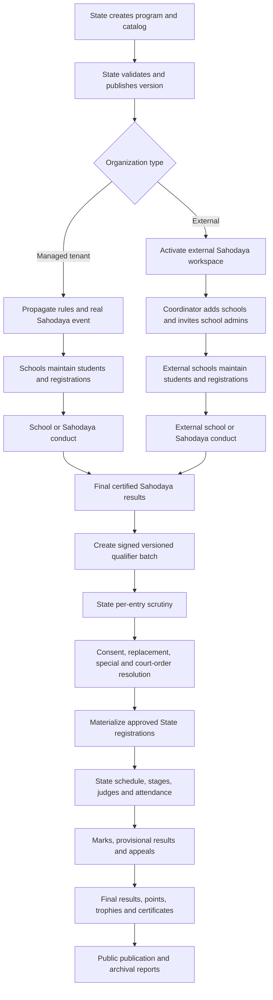

# State Kalotsav End-to-End Master Implementation Plan

**Status:** Proposed governing implementation plan  
**Version:** 1.0 — 7 August 2026  
**Scope:** State → managed Sahodaya → managed school and State → external Sahodaya → external school, including students, event registration, conduct, qualification, State finals, results and audit  
**Audience:** Product owners, State administrators, developers, QA and operations  

## 1. Purpose and authority

This document defines the target production workflow for conducting a State-level Kalotsav across:

1. Sahodayas and schools that are full platform tenants.
2. Sahodayas and schools that are not platform tenants.
3. The State office that publishes the program, receives qualifiers and conducts the State final.

This is the governing plan for the complete vertical flow. It supersedes the lightweight external-winner-entry design in `STATE_LEVEL_KALOTSAV_ROLLOUT_PLAN.md` §2 and the unresolved State-database design in §3. The regional and partitioned-conduct plans remain valid for conducting a Sahodaya through regions and a finale.

The required external model is no longer:

```text
External school → type a winner's name directly into a State qualifier row
```

It is:

```text
External Sahodaya
  → External school
  → Student master
  → Event registration or team registration
  → Participation and result
  → Certified qualification
  → State scrutiny
  → State registration
```

## 2. Product outcomes

The completed system must provide:

- One authoritative State program, item catalog and rule set.
- Identical eligibility and qualification rules for managed and external organizations.
- Full school and student traceability for every State participant.
- Correct modeling of individuals, groups, teams, leaders and standbys.
- Certified, versioned and auditable result-to-qualification transitions.
- A State scrutiny process that can accept, reject, return, replace or specially admit each entry.
- A complete State competition workspace, including scheduling, judging, results, appeals, reports and public publication.
- Secure access appropriate for student data.
- Automated tests and operational checks covering the complete lifecycle.

## 3. Architectural decisions

### 3.1 System boundaries

| Boundary | Owns |
|---|---|
| Central/control database | State program master, catalog, versions, managed tenant registry, external Sahodaya/school identity, external users/invitations and propagation records |
| Managed Sahodaya tenant database | Member schools, students, school/Sahodaya events, registrations, schedules, marks, results and qualifier outbox |
| External operations schema on the central connection | External students, events, event items, registrations, teams, attendance, marks, results, evidence and certified qualifier outbox |
| State operational database | Qualifier intake, scrutiny, State registrations, participants, State event conduct, marks, appeals, certificates, reports and publication |

The State application is served on its own configured domain. State operational models use an explicit `state` database connection. State routes are domain-scoped and do not depend on accidental use of the default connection.

No database-level foreign keys are created across database boundaries. Cross-boundary references use UUIDs and are validated by application services.

### 3.2 Canonical identifiers

- State program IDs are UUIDs.
- State catalog item IDs are UUIDs everywhere, including intake and State registration tables.
- External Sahodaya, school, student, event and registration IDs are UUIDs.
- Managed tenant-local numeric IDs remain source references only; the qualifier contract transports them as strings.
- Every submission has a globally unique batch UUID and a monotonically increasing revision.
- A group/team has one registration UUID and many participant UUIDs. It must never be flattened into one registration per member.

### 3.3 Managed and external convergence

Managed and external workflows may differ before qualification, but must converge at one canonical qualifier contract:

```text
Certified managed result ─┐
                          ├─→ Versioned qualifier batch → State scrutiny → State registration
Certified external result ┘
```

State-side code must not query tenant `FestEvent`, `FestMark` or registration tables directly. The certified intake payload is the State system's source record.

## 4. Roles and permissions

| Role | Main permissions |
|---|---|
| State Admin | Configure program and catalog, onboard Sahodayas, publish, scrutinize qualifiers, manage State final, finalize and publish results |
| State Scrutiny Officer | Verify documents and eligibility; accept, reject or return entries; cannot alter program rules |
| State Event Officer | Schedule, stage, attendance, judging, marks and result operations after scrutiny |
| Managed Sahodaya Admin | Conduct propagated events, verify schools, certify results and submit qualifiers |
| Managed School Admin | Maintain students and register them for allowed school/Sahodaya events |
| External Sahodaya Coordinator | Maintain its schools, oversee registrations, conduct Sahodaya rounds, certify results and submit qualifiers |
| External School Admin | Maintain only its school and students; submit and correct its event registrations |
| Judge/Mark Entry Operator | Access only assigned items/stages and permitted mark-entry actions |
| Public user | View only explicitly published schedules, results and points |

Every authorization query must be organization-scoped. Possession of an object UUID must not grant access to another Sahodaya or school.

## 5. Authoritative end-to-end lifecycle



## 6. State program setup and publication

### 6.1 Program configuration

State Admin configures:

- Academic year, event type, title and description.
- Registration, scrutiny, conduct and publication windows.
- State venues and dates.
- Conduct levels: school, Sahodaya and State.
- Item catalog and catalog version.
- Individual, group or team type for each item.
- Class, age and gender eligibility.
- Minimum/maximum team sizes and standby count.
- Per-school entry quota and State qualification count.
- Per-student on-stage, off-stage, group and total limits.
- Scoring preset, grade thresholds and point tables.
- Appeal rules, appeal fee and refund/forfeit policy.
- Required declarations, consent and evidence.
- Regional/finale qualification policy where a Sahodaya is partitioned.

### 6.2 Publication validation

Publication is blocked unless:

- At least one conduct level is selected.
- Every item has a stable code and UUID.
- Eligibility and team-size rules are internally valid.
- Qualification counts are configured.
- Grade thresholds are ordered and non-overlapping.
- A State domain and operational database health check pass.
- At least one State administrator is active.

### 6.3 Propagation topology

For each managed Sahodaya, publication creates or updates exactly one real Sahodaya event. If school conduct is enabled, school child events are spawned below that Sahodaya event.

Do not create a fake top-level `school` event or a tenant-local State placeholder. State final events exist only in the State operational database.

Propagation is version-aware and idempotent:

- New catalog items are added.
- Updated unlocked fields are synchronized.
- Removed items are retired only when they have no registrations; otherwise publication reports a blocking conflict.
- Local Sahodaya/school items are never overwritten.
- Every synchronization produces an audit record and a reconciliation report.

## 7. Managed tenant flow

### 7.1 School stage

1. School Admin maintains the existing student registry.
2. School selects an open propagated event.
3. School registers individuals or teams.
4. Eligibility, participation and quota checks run immediately and again on submission.
5. School certifies its submitted registrations.
6. If school-level conduct is enabled, the school records attendance, marks and final results.
7. Only certified qualifiers promote to the parent Sahodaya event.

### 7.2 Sahodaya stage

1. Sahodaya reviews school registrations or promoted qualifiers.
2. Invalid records are returned with reasons.
3. Registrations are locked at the published deadline.
4. The event is conducted as standard, regional/partitioned or phased.
5. Marks are double-verified before provisional publication.
6. Appeals and corrections are resolved.
7. Final results are certified by authorized officers.
8. The system builds the State qualifier batch from certified final results only.

### 7.3 Submission gate

The managed `Submit qualifiers to State` action is enabled only when:

- The source is the real Sahodaya event or its configured finale.
- Results are final and certified.
- All required items have a completed result or an explicit `not_conducted` reason.
- The batch is non-empty.
- Each entry references a school and student/team.
- Participation, consent, quota and qualification checks pass.

## 8. External Sahodaya flow

### 8.1 Onboarding and secure access

1. State Admin creates an external Sahodaya under a State program.
2. The coordinator receives an expiring invitation by email/SMS.
3. The coordinator creates an account, verifies contact information and enables MFA or OTP.
4. State verifies the Sahodaya's official identity before activation.
5. Access automatically closes at the configured deadline, with State override recorded in audit history.

Permanent access must not depend only on an eight-character code in a URL. Temporary invitation tokens are single-use, hashed at rest and expire.

### 8.2 External school management

The coordinator can:

- Add, edit, verify, disable and reactivate schools.
- Record CBSE affiliation/school code, name, address, district, principal and contacts.
- Invite a school administrator.
- Act on behalf of a school only through an explicit audited impersonation/assistance action.
- View registration progress for every school.

Uniqueness rules:

- CBSE affiliation number is unique within the active academic year.
- Normalized school name is unique within a Sahodaya when no affiliation number exists.
- A school cannot simultaneously participate under two Sahodayas without a State-approved exception.

### 8.3 External student master

External School Admin creates reusable student records containing:

- Admission number.
- Full name and normalized search name.
- Date of birth, gender, class and division.
- Parent/guardian contact where required.
- Photo and identity/eligibility document references.
- Consent state and consent evidence.
- Academic year and active/withdrawn state.

Student uniqueness is based on external school + academic year + admission number. Name matching is a warning, never the sole duplicate key.

The coordinator may view necessary student data but cannot silently edit school-owned records. Corrections are attributed to the acting user.

### 8.4 External event structure

Publication activates one external Sahodaya event linked to the State program. When school rounds are required, school child events can be spawned for selected external schools.

External event items contain:

- State program item UUID for State-owned items.
- Optional local Sahodaya or school items with `owner_level`.
- Qualification count, eligibility and team rules inherited from the program version.

Only State-owned items can qualify to State.

### 8.5 External event registration

School Admin selects an event item and creates:

- One registration linked to the external school and item.
- One participant for an individual item.
- Multiple participants, leader and standbys for group/team items.
- Required consent and supporting documents.

Registration states:

```text
draft
  → submitted
  → under_sahodaya_review
  → approved | returned | rejected
  → locked
  → participated | absent | withdrawn | disqualified
  → qualified | not_qualified
```

Schools may edit `draft` and `returned` registrations. Approved/locked registrations require an audited reopen, withdrawal or substitution action.

### 8.6 External registration validation

Validate on draft save, submission and approval:

- Student belongs to the acting school.
- Class, age and gender match item eligibility.
- Student is not duplicated within the same registration.
- Per-school item quota is not exceeded.
- Per-student on-stage, off-stage, group and total limits are not exceeded.
- Team size, leader and standby rules pass.
- Required consent and evidence are present.
- Registration and event windows are open.
- The item belongs to the event's published program version.

Quota checks must run in a transaction with row/advisory locking and database uniqueness constraints. Do not use an unlocked count-then-insert sequence.

### 8.7 External conduct and results

The external Sahodaya chooses one of two declared conduct modes:

1. **Platform conduct:** schedule, chest numbers, attendance, judges, marks, results and appeals are operated in the external workspace.
2. **Certified offline conduct:** registrations are maintained in the system, then the coordinator uploads signed result sheets and records positions/grades against those registrations.

Both modes require:

- A registration must exist before a result can exist.
- Team results belong to the team registration, not individual duplicate rows.
- Attendance and disqualification status are captured.
- Result certification names the certifying officer and timestamp.
- Result changes after certification create a revision and reason.
- Only final certified results can create State qualifiers.

### 8.8 External qualifier submission

The coordinator reviews a batch grouped by school and item, signs a declaration and submits it to State.

The batch includes:

- Batch UUID, revision, program UUID and catalog version.
- External Sahodaya UUID and certified source event UUID.
- External school UUID and identity snapshot.
- Source registration UUID.
- State program item UUID and item snapshot.
- Individual participant or complete team/standby roster.
- Position, grade, points and attendance.
- Consent status and evidence references.
- Result certification and supporting result sheet.
- Withdrawal, substitution, appeal or special-entry metadata where applicable.

After submission, entries are immutable. A returned batch becomes a new revision; a later accepted revision supersedes the earlier one without deleting history.

## 9. Canonical qualifier intake contract

The managed outbox and external outbox emit the same versioned schema.

Minimum envelope:

```json
{
  "schema_version": 2,
  "batch_id": "uuid",
  "revision": 1,
  "state_program_id": "uuid",
  "catalog_version": 1,
  "source": {
    "type": "managed_sahodaya|external_sahodaya",
    "organization_id": "string-or-uuid",
    "event_id": "string-or-uuid"
  },
  "certification": {
    "certified_by": "identifier",
    "certified_at": "ISO-8601",
    "result_version": 1
  },
  "entries": []
}
```

Each entry represents one individual registration or one team registration and contains a `participants` array.

Transport requirements:

- Per-Sahodaya credentials; credentials are not shared across organizations.
- HMAC/signature or OAuth client credentials.
- Idempotency key enforced by a unique database constraint.
- Payload hash and schema validation.
- Source organization in the payload must match the authenticated credential.
- Retryable outbox with exponential backoff and dead-letter status.
- No raw student documents embedded in the payload; transmit protected document references.

## 10. State scrutiny and qualification management

### 10.1 Intake states

```text
received
  → validating
  → under_review
  → returned | partially_approved | approved | rejected
  → materialized
  → superseded
```

Entry states:

```text
pending
  → accepted | correction_required | rejected
  → withdrawn | replaced
```

### 10.2 Per-entry scrutiny

State officers can:

- Verify source, school, student/team and item.
- View evidence and certification.
- Accept or reject one entry with a reason code.
- Return an entry or entire batch for correction.
- Record State consent confirmation.
- Record a withdrawal and approve a replacement.
- Resolve tie/lot decisions.
- Apply a qualification override with mandatory reason.
- Add court/government/committee/late entries with mandatory orders and audit.
- Mark entries as excluded from school/Sahodaya points while retaining item results and certificates where rules permit.

Bulk actions are allowed only after validation and remain individually auditable.

### 10.3 Materialization

Materialization occurs only for accepted entries and is idempotent.

- One State registration is created per source registration/team.
- Participant and standby rows are copied beneath it.
- State item UUID is retained.
- Source organization, school, registration and batch references remain immutable.
- Unique constraints prevent duplicate State events and duplicate qualifier materialization.
- Withdrawn/replaced entries retain history and point to their replacement chain.

## 11. State final conduct

The State workspace must support:

1. Registration scrutiny completion and final roster locking.
2. Chest-number allocation.
3. Venue, stage and time-slot planning.
4. Participant conflict detection.
5. Judge/panel assignments and conflict declarations.
6. Call-room and attendance controls.
7. Mark entry with two-person verification or configured approval.
8. Correct grade and point calculation.
9. Provisional results.
10. Appeals and recalculation.
11. Final result certification.
12. School- and Sahodaya-wise points.
13. Individual/group champions and trophies.
14. Certificates and result documents.
15. Public schedule, result and points pages.

State results are computed solely from State operational records. They must not query tenant databases by local event IDs.

## 12. Business rules that must be enforced centrally

- Official grade thresholds use first/highest matching band and have boundary tests.
- Official individual and group point tables are versioned with the program.
- Qualification count is configurable per item.
- Standard, regional and finale qualification policies are explicit; no hardcoded fallback positions.
- A participant's total, on-stage, off-stage and group caps are all enforced.
- One Act Play and other exceptional items use item-level overrides.
- Court/special entries retain their real school and Sahodaya identity.
- Court/special entries are excluded from aggregate points only where the governing rule requires it.
- Winner replacement records the original qualifier, replacement, authority, reason and evidence.
- Withdrawals never delete the original record.
- Local Sahodaya/school items cannot accidentally qualify to State.
- Registration, result, appeal and submission deadlines use the program timezone.

## 13. Security, privacy and audit requirements

- Replace permanent access-code authentication with user accounts plus expiring invitations and OTP/MFA.
- Hash invitation and recovery tokens at rest.
- Apply rate limits by account, organization and IP.
- Enforce CSRF protection for browser actions.
- Use signed, short-lived URLs for private documents.
- Encrypt sensitive document storage and prevent public indexing.
- Record login, impersonation, export and sensitive-document access.
- Record before/after values for eligibility, registration, result, scrutiny, replacement and publication changes.
- Require reason codes for privileged overrides.
- Apply least-privilege policies to State, Sahodaya, school and judge roles.
- Define data retention and archival rules for minors' records.
- Prevent student PII from appearing on public result pages beyond approved display policy.

## 14. Required data model changes

### 14.1 State foundation

- Add an explicit `state` database connection and deployment configuration.
- Load and execute `database/migrations/state` deliberately.
- Add explicit State connection behavior to every `App\Models\State` model.
- Change State qualifier/registration `item_id` columns to UUID.
- Add unique constraints for one State event per program and one materialization per qualifier entry.
- Expand State registrations to support one-to-many participants and standbys.
- Add audit, evidence, consent, replacement and special-entry structures.

### 14.2 External organization and identity

Retain and extend:

- `external_sahodayas`
- `external_schools`

Add:

- External organization users/memberships or a polymorphic organization membership layer.
- Invitation and authentication recovery records.
- Verification status and official identifiers for Sahodayas and schools.

### 14.3 External operations

Add UUID-backed tables equivalent to:

- `external_students`
- `external_fest_events`
- `external_fest_event_items`
- `external_fest_registrations`
- `external_fest_registration_participants`
- `external_fest_attendance`
- `external_fest_marks`
- `external_fest_results`
- `external_fest_appeals`
- `external_qualifier_batches`
- `external_qualifier_batch_entries`
- `external_evidence_documents`
- `external_audit_events`

Table names may reuse proven generic festival components if they can be safely scoped without tenant initialization. Reuse is acceptable only when authorization, connection choice and organization scoping are explicit and testable.

## 15. Pages and user experience

### 15.1 State Admin

- Program builder and catalog import/versioning.
- Propagation reconciliation dashboard.
- Managed/external Sahodaya onboarding dashboard.
- Qualifier batch queue with filters and SLA indicators.
- Per-entry scrutiny and evidence viewer.
- Replacement, withdrawal, court and special-entry workflows.
- State final registration and conduct workspace.
- Reports, certificates and public publication controls.

### 15.2 External Sahodaya Coordinator

- Dashboard with program dates and completion status.
- School directory, verification and invitations.
- Cross-school registration review.
- Event setup/conduct mode declaration.
- Schedule, results and certification where platform conduct is used.
- Certified offline-result upload where offline conduct is used.
- Qualifier batch preview, validation errors, certification and submission history.

### 15.3 External School Admin

- School profile and principal certification.
- Student registry with import and duplicate warnings.
- Available event/item catalog.
- Individual and team registration wizard.
- Consent/document completion status.
- Submission, return/correction and approval status.
- Participant schedule and results after publication.

Forms must show actionable validation messages and never lose entered team rosters after validation failure.

## 16. Implementation phases

### Phase 0 — Governance and baseline

Tasks:

- Approve this document as the governing plan.
- Mark superseded sections in older plans.
- Freeze official catalog, scoring and qualification rules for the first program version.
- Capture a database backup and deployment rollback procedure.
- Define State domain and State database environment variables.

Exit criteria:

- Product owner signs off the managed and external flows.
- State database topology and production owner are recorded.
- Rule questions are configuration values, not unresolved architectural blockers.

### Phase 1 — Critical correctness foundation

Tasks:

- Provision the State connection and migration pipeline.
- Correct UUID item columns throughout State intake/materialization.
- Fix Confederation/MCS grade-threshold resolution.
- Remove cross-tenant State result queries.
- Add schema health checks and deployment smoke commands.
- Add State model connection tests.

Exit criteria:

- Fresh and upgraded databases migrate successfully.
- Scores at every grade boundary produce correct grades and points.
- State intake can persist a valid individual and team payload.
- State pages never query tenant event tables on the central/default connection.

### Phase 2 — Program publication and managed-flow hardening

Tasks:

- Correct propagation to create only the intended Sahodaya event and school children.
- Implement catalog versioning, resynchronization and retirement rules.
- Add `max_total_per_student` to State validation and UI.
- Inherit the complete scoring, fee and participation policy into every school child event.
- Prevent school events from linking to State placeholders or wrong parents.
- Add certified-result and source-event gates to State submission.
- Preserve teams in the managed qualifier payload.

Exit criteria:

- Repeated publication is idempotent and produces a clean reconciliation report.
- One managed Sahodaya completes school → Sahodaya → certified qualifier submission in automated tests.
- No draft/unpublished/wrong-round result can be submitted.

### Phase 3 — External identity, schools and students

Tasks:

- Replace code-only access with accounts, expiring invitations and OTP/MFA.
- Extend external Sahodaya and school profiles and verification.
- Add organization memberships and authorization policies.
- Implement school invitation, disable and transfer actions.
- Add external student registry, document handling and import.
- Add audit events and impersonation controls.

Exit criteria:

- An external coordinator can add and invite multiple schools.
- A school user sees and changes only its own school and students.
- A coordinator can assist a school only through an audited action.
- Expired/disabled access is denied.

### Phase 4 — External event registration

Tasks:

- Create external events and versioned event items from the State program.
- Implement individual and team registration workflows.
- Implement consent, evidence, eligibility, participation and quota validation.
- Implement school submission and Sahodaya approve/return/reject actions.
- Add transactional quota enforcement and database uniqueness constraints.
- Add roster import/export with validation reports.

Exit criteria:

- Individual and group/team registrations retain complete participant data.
- Boundary, duplicate, quota and concurrent-registration tests pass.
- Returned registrations can be corrected and resubmitted with history.

### Phase 5 — External conduct, results and certification

Tasks:

- Implement platform-conduct scheduling, attendance, marks and results, or integrate proven generic festival services safely.
- Implement certified offline-result entry and document upload.
- Add mark verification, grade/points calculation, provisional/final publication and appeals.
- Add result certification and revision history.
- Generate eligible qualifiers from certified results.

Exit criteria:

- Both platform and certified-offline modes produce the same canonical qualifier structure.
- A result cannot exist without a valid registration.
- A team result produces one qualifier registration with its full roster.
- Post-certification corrections create an auditable revision.

### Phase 6 — Unified qualifier contract and delivery

Tasks:

- Implement schema version 2 for managed and external payloads.
- Bind credentials to the submitting organization.
- Add payload signature, hash, idempotency and strict nested validation.
- Implement managed and external outbox/retry/dead-letter monitoring.
- Add batch revision and supersession behavior.

Exit criteria:

- Identical State intake validation handles managed and external batches.
- Spoofed source IDs, malformed entries and duplicate concurrent deliveries are rejected safely.
- Retry does not duplicate intakes or registrations.

### Phase 7 — State scrutiny and materialization

Tasks:

- Implement per-entry review actions and batch summaries.
- Add evidence, consent and identity verification.
- Implement return-for-correction and revised submission.
- Implement withdrawal, replacement, tie/lot and qualification override.
- Implement court/government/committee/late-entry workflows.
- Correct team-aware State materialization and uniqueness constraints.

Exit criteria:

- Mixed accept/reject/return decisions work in one batch.
- Replacement and special-entry histories are reportable.
- Only accepted current-revision entries materialize.
- Materialization is idempotent under concurrent requests.

### Phase 8 — State final execution and public outputs

Tasks:

- Complete State scheduling, stages, panels, attendance and mark entry.
- Implement verification, provisional results, appeals and final certification.
- Implement school/Sahodaya points, champions and trophies.
- Generate certificates and mandatory reports.
- Implement State public schedule/results/points pages with privacy controls.

Exit criteria:

- A State final can be operated without reading source tenant databases.
- Official scoring and appeal recalculation tests pass.
- Published public data matches final certified reports.

### Phase 9 — Hardening and production rollout

Tasks:

- Run performance, concurrency, authorization and document-security tests.
- Run disaster recovery and outbox replay drills.
- Complete one managed-Sahodaya and one external-Sahodaya pilot.
- Train each role using role-specific checklists.
- Open registration in waves with monitoring and support ownership.
- Archive the pilot and verify all statutory reports.

Exit criteria:

- No unresolved critical/high audit findings.
- Operational dashboards and alerts are active.
- Pilot sign-off is recorded from State, Sahodaya and school users.
- Rollback and incident procedures have been rehearsed.

## 17. Test strategy

### 17.1 Unit tests

- Grade thresholds at below/minimum/exact/above boundaries.
- Individual and group point tables.
- Eligibility and all participation caps.
- Item-level qualification count.
- Team size, leader and standby validation.
- State payload schema and source-credential binding.
- Replacement, withdrawal and special-entry rules.

### 17.2 Feature/integration tests

- State program publish and republish with additions, updates and retirement.
- Managed school → Sahodaya promotion.
- Standard and regional/finale managed qualification.
- External onboarding → school → student → individual registration.
- External team registration with standbys.
- External offline result certification.
- Managed and external batch delivery, retry and duplicate delivery.
- State mixed scrutiny decisions and revised submissions.
- Team-aware State materialization.
- State marks → appeal → final results → reports.

### 17.3 Security tests

- Cross-Sahodaya and cross-school object access attempts.
- Expired invitation, disabled account and revoked membership.
- Source-organization spoofing.
- Document URL expiry and unauthorized retrieval.
- Rate limiting, CSRF and credential replay.
- Audit coverage for impersonation, export and overrides.

### 17.4 Concurrency tests

- Last available per-school/item quota claimed simultaneously.
- Two schools submitting against a Sahodaya qualification cap.
- Duplicate batch delivery.
- Concurrent State approval/materialization.
- Result certification while marks are being edited.

### 17.5 End-to-end UAT scenarios

At minimum:

1. Managed school individual winner to State result.
2. Managed regional/finale team winner to State result.
3. External platform-conduct individual winner to State result.
4. External offline-conduct team winner with standbys to State result.
5. Returned qualifier corrected and resubmitted.
6. Winner withdrawal and approved replacement.
7. Court/special entry excluded from aggregate points as configured.
8. Appeal changes a State result and all reports/public pages recalculate.

## 18. Migration and cutover

1. Back up central and all tenant databases.
2. Deploy State connection configuration and run State migrations in a controlled job.
3. Migrate `item_id` to UUID using an explicit mapping from program/event item references; do not cast blindly.
4. Deploy code capable of reading old and new qualifier payload versions during transition.
5. Backfill external organization verification fields.
6. Convert existing draft external qualifier rows into student and registration records where unambiguous.
7. Put ambiguous legacy rows into a reconciliation queue for coordinator confirmation.
8. Disable old code-gated mutation routes after account invitations are delivered.
9. Run reconciliation totals before enabling State submission.
10. Retain legacy batch payloads as immutable audit evidence.

Rollback must restore application version and database compatibility without deleting accepted qualification history.

## 19. Operational monitoring

Dashboards and alerts must cover:

- Program propagation successes, skips and conflicts.
- Registration counts and validation failures by organization.
- Submission outbox age, retries and dead letters.
- State intake validation failures.
- Batches awaiting scrutiny and their age.
- Replacements, withdrawals and special entries.
- Result certification and post-certification revisions.
- Public publication version.
- Authentication failures and suspicious access-code/token attempts.
- State/central/tenant database connectivity and migration version.

## 20. Reports required before closure

- Participating Sahodayas and schools.
- Student and team registration summary.
- Eligibility and rejection report.
- Missing consent/evidence report.
- School and Sahodaya certification report.
- Qualifier submission and scrutiny report.
- Withdrawal and replacement report.
- Court/admin/special-entry report.
- State registration and attendance report.
- Item results and grade distribution.
- School-wise and Sahodaya-wise points.
- Champions, trophies and certificates issued.
- Appeals and result revisions.
- Complete audit export.

## 21. Definition of done

The State Kalotsav flow is production-ready only when all of the following are true:

- State schema deployment is automated and verified.
- Official grading and points have passing boundary tests.
- Managed publication produces the intended event hierarchy with no placeholders/orphans.
- External coordinators can add schools; schools can add students and create individual/team event registrations.
- Both external conduct modes generate certified results and qualifiers.
- Managed and external qualifier batches pass the same canonical validation.
- State supports per-entry scrutiny, correction, replacement and special admission.
- State registrations preserve full team rosters and source traceability.
- State competition conduct, results, appeals, reports and public publication are complete.
- Authorization, concurrency, retry and privacy tests pass.
- One managed and one external end-to-end pilot are signed off.
- There are no unresolved critical or high-severity audit findings.

## 22. Immediate implementation order

Work must begin in this order:

1. State database connection/migrations and UUID correctness.
2. Grade resolver and official scoring tests.
3. Publication topology and managed submission gates.
4. External authentication, schools and student master.
5. External individual/team registration.
6. External conduct/results and certification.
7. Unified qualifier contract/outbox.
8. State scrutiny and materialization.
9. State final conduct, reports and public portal.
10. Security/performance hardening and pilots.

No production registration window should open before Phases 1 and 2 pass. External registration should not open before Phases 3 and 4 pass. State qualification submission should not open before Phases 6 and 7 pass.
