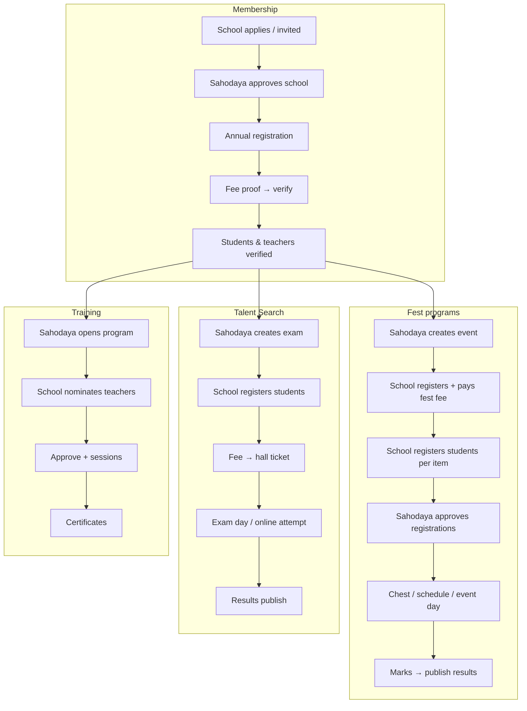

# User Flows, Pages & Roles — Complete Platform Reference

**Audience:** Product, support, developers, Sahodaya admins, school admins  
**Last updated:** July 2026  
**Companion:** [`PLATFORM_GUIDE.md`](PLATFORM_GUIDE.md) · [`erp/03-RBAC_CREDENTIALS.md`](erp/03-RBAC_CREDENTIALS.md)

This document maps **every major user journey** from school membership through fest events, Talent Search, training, finance, and portals — with **pages, purpose, and contents**.

---

## 1. Login surfaces

| Surface | URL | Who logs in |
|---------|-----|-------------|
| **Platform admin** | `/admin/login` | `superadmin`, `state_admin`, `state_staff` |
| **Sahodaya admin** | `/login` (cluster domain) | `sahodaya_admin`, permission-based Sahodaya staff |
| **School admin** | `/school-login` | Principal, VP, school admin, coordinators, staff |
| **Portal** | `/portal/login` | Students, teachers, judges, fest ops, exam staff, coordinators, group/house admin |

After login, users land on their role-specific dashboard. Password change may be forced (`must_change_password`).

---

## 2. Role catalog

### 2.1 Platform (central)

| Role | Purpose | Primary pages |
|------|---------|---------------|
| `superadmin` | Provision tenants, global config | `/admin/dashboard`, tenants CRUD, storage migration |
| `state_admin` | State programs & remittances | `/admin/state-dashboard`, state Kalotsav/sports views |
| `state_staff` | Limited state ops | Same as state admin (scoped) |

### 2.2 Sahodaya panel

| Role | Purpose | Access model |
|------|---------|--------------|
| `sahodaya_admin` | Full cluster control | All menus |
| `sahodaya_staff` | Day-to-day ops | Spatie permissions (fest, mcq, training, membership, finance, website, users) |
| `registration_coordinator` | Membership & school onboarding | Membership menus |
| `sahodaya_finance` | Payments, ledger, fest fees | Finance + payment queues |
| `certificate_collector` | Certificate templates & print | Fest certificates |
| `data_entry` | Catalog, masters | Fest setup, taxonomy |
| `event_coordinator` | Assigned events only | Scoped fest events |
| `mark_entry_admin` | All events mark entry | Marks + coordinator portal |
| `mark_entry_coordinator` | Assigned events marks | `/portal/fest-coordinator` |

**Portal-only (created at Sahodaya → Portal users):**

| Role | Portal | Purpose |
|------|--------|---------|
| `judge` | `/portal/judge/{tenant}` | Per-item scoring (Kalotsav/cultural only) |
| `fest_ops` | `/portal/fest-ops/{tenant}` | Event-day duties (registration desk, stage, attendance, marks, etc.) |
| `exam_controller` | `/portal/exam/{tenant}` | Talent Search hall: attendance + marks + supervision |
| `exam_staff` | `/portal/exam/{tenant}` | Talent Search attendance only |

### 2.3 School panel

| Role | Purpose | Scope |
|------|---------|-------|
| `school_principal` | Full school + create admins/coordinators | All school menus |
| `school_vice_principal` | Manage coordinators & staff | Same as principal (user mgmt) |
| `school_admin` | Day-to-day school ERP | Students, membership, fest, Talent Search, training |
| `school_staff` | Read + permission-gated writes | Per Spatie permission |
| `school_event_coordinator` | Fest/Talent Search for **assigned** programs/events | Scoped program nav |
| `school_sports_coordinator` | Sports Meet only | `/sports/*` |
| `school_kalotsavam_coordinator` | Kalotsav only | `/kalotsav/*` |
| `school_mcq_coordinator` | Talent Search exams | `/mcq/*` |
| `school_training_coordinator` | Teacher training nominations | `/training/*` |
| `school_finance_coordinator` | Fees & receipts | Membership + fest/Talent Search payments |

### 2.4 School portals

| Role | Portal path | Purpose |
|------|-------------|---------|
| `student` | `/portal/student/{schoolId}` | Schedule, results, Talent Search, profile |
| `teacher` | `/portal/teacher/{schoolId}` | Fest, training certs, Talent Search question banks |
| `group_admin` | `/portal/group/{schoolId}` | Class/group student fest view |
| `house_admin` | `/portal/house/{schoolId}` | House student lists |

---

## 3. Master journey map



---

## 4. Module A — Membership & schools

### 4.1 Purpose

Onboard member schools, collect annual data (students/teachers/counts), verify membership fees, maintain master student/teacher records, compliance documents, and academic years. **Gates fest/Talent Search** when incomplete or unverified.

### 4.2 Sahodaya user flow

```
Setup wizard → Academic year → Membership settings → Approve schools
    → Review annual submissions → Verify membership payments
    → Verify students/teachers → Open fest/Talent Search windows
```

### 4.3 Sahodaya pages

| Page | Path | Purpose | Key contents |
|------|------|---------|--------------|
| Dashboard | `/sahodaya-admin/{id}` | Action queue, program status | Pending fees, appeals, setup tasks, recent activity |
| Setup wizard | `/setup` | First-time checklist | Academic year, fees, windows, payment details |
| Configuration | `/membership/settings` | Membership rules | Prefix, fees, registration windows (V2 add/edit), payment details, class master, mail |
| Academic years | `/academic-years` | AY + financial year | Create, activate, link fee slabs |
| Schools | `/schools` | Member directory | Approved schools, search, export |
| Pending applications | `/schools/applications` | New school queue | Approve/reject applications |
| Membership fees | `/membership/payments` | Fee verification | Proof upload review, approve/reject, receipts |
| Student counts | `/membership/submissions` | Annual data review | Per-school track submissions (counts/teachers/full records) |
| Student verification | `/students/verification` | Verify student records | Bulk verify, filters |
| Teacher verification | `/teachers/verification` | Verify teachers | Same pattern |
| Student change requests | `/student-change-requests` | Post-registration edits | Approve school-requested student changes |
| Profile change requests | `/users/profile-change-requests` | Portal profile edits | Teacher/staff change approvals |
| Registration windows | `/students/registration-windows` | Student add/edit windows | Cluster-wide student record windows |
| Document review | `/documents/review` | Compliance docs | School-uploaded statutory documents |
| Document types | `/documents/types` | Configure required docs | Types, expiry rules |
| Membership reports | `/membership/reports` | ERP reports | Schools, payment due, pending, submissions |
| Program calendar | `/calendar` | Cluster calendar | Membership + program dates |
| Login audit | `/auth/login-audit` | Security audit | Login events by user |

### 4.4 School user flow

```
Set school code → Add students/teachers → Begin annual registration
    → Submit tracks (profile / counts / teachers / students)
    → Upload membership fee proof → Wait for verification
    → Maintain records + compliance documents
```

### 4.5 School pages

| Page | Path | Purpose | Key contents |
|------|------|---------|--------------|
| Dashboard | `/school-admin/{schoolId}` | Status & links | Registration deadline, fest summaries, Talent Search/training counts |
| Set school code | `/setup/code` | Reg number prefix | Required before bulk students |
| Students | `/students` | Day-to-day student ERP | CRUD, import, class, verification status |
| Teachers | `/teachers` | Teacher records | CRUD, fest/training linkage |
| School houses | `/houses` | Intra-school houses | For sports house championship |
| Settings | `/settings` | School profile | Contact, leadership, website toggle |
| Portal users | `/users` | Login accounts | Students, teachers, coordinators, group/house admin |
| Annual registration | `/registration` | Membership hub | Tracks, progress, begin/submit |
| Profile & account | `/registration/profile` | School profile for Sahodaya | Leadership, contact, declaration |
| Student records (annual) | `/registration/students` | Annual student submission | Linked to membership track |
| Student counts | `/registration/counts` | Count-only track | Class-wise counts |
| Teacher records (annual) | `/registration/teachers` | Annual teacher submission | |
| Membership payment | `/registration/payment` | Fee proof upload | Bank/UPI/cheque proof |
| Payments & receipts | `/payments` | All receipts | Membership + fest fee receipts |
| Compliance documents | `/documents` | Upload statutory docs | Per document type |
| Program calendar | `/calendar` | Read Sahodaya calendar | |

### 4.6 Gates (membership → fest)

| Gate | Blocks |
|------|--------|
| School not approved | Fest registration |
| Annual registration incomplete | Some fest actions |
| Membership fee not verified | Optional hard block (config) |
| Student not verified | Item registration (if `require_student_verification`) |
| Registration window closed | Student add/edit |

---

## 5. Module B — Fest programs (overview)

### 5.1 Program types

| Program | Sahodaya hub | Event type | School prefix |
|---------|--------------|------------|---------------|
| Kalotsav | `/kalotsav` | `kalolsavam` | `/kalotsav` |
| Sports Meet | `/sports` | `sports` | `/sports` |
| Kids Fest | `/kids-fest` | `kids_fest` | `/kids-fest` |
| Teacher Fest | `/teacher-fest` | `teacher_fest` | `/teacher-fest` |
| English Fest | `/english-fest` | `english_fest` | `/english-fest` |
| Science Fest | `/science-fest` | `science_fest` | `/science-fest` |
| Custom | `/programs/custom` | `custom` | — |
| All events | `/events` | any | — |

### 5.2 Event lifecycle statuses

`draft` → `published` → `registration_open` → `ongoing` → (results published) → `completed`

### 5.3 Generic fest user flow (school → Sahodaya → results)

```
Sahodaya: Program hub → Create event → Setup (catalog, fees, settings)
School:   Program → Register for Sahodaya event → Pay fest fee (if required)
School:   Register students for items → Submit
Sahodaya: Approve registrations → Assign chest numbers → Publish schedule
Event day: Attendance → Mark entry → Publish results
School/Student: View results, certificates, reports
```

### 5.4 Sports-specific differences

- **Item heads** (Athletics, Chess, …) — catalog grouped by head
- **School registers by head** — `/sports/events/{id}/registration?head_id=X`
- **No judges** — **Item head coordinators** (`marks` duty + `head_id`) at `/event-staff`
- **Mark entry** — time/distance, rank dropdown, auto-rank, attendance on same page
- **Chest numbers** + **rank points master** + optional **athletic records**
- **School internal sports day** — `/sports/my-events` → promote winners to Sahodaya event

### 5.5 Kalotsav/cultural differences

- **Judges** per item at `/judges` — portal at `/portal/judge`
- **Stage schedule** + performance order
- **Multi-judge scoring** + optional judge-score publish gate
- **Grade bands** (A, A+, B, C) on mark entry

---

## 6. Sahodaya — Program hub pages (per fest type)

Base: `/sahodaya-admin/{id}/{program-prefix}`

| Page | Purpose | Contents |
|------|---------|----------|
| Program dashboard | Hub home | Open events, quick stats, create event CTA |
| Catalog | Master item list | CKSC seed items, enable/disable, fees, heads (sports) |
| School rounds | Level propagation | School-round → cluster promotion (where enabled) |
| Age groups | Sports only | U12/U14/… cutoff configuration |
| Athletic records | Sports master | Historical records |
| Championship | Points trophy | School/house championship config |
| Results / rankings | Cross-event | Published results aggregate |

**Sports-only hub extras:** `/sports/catalog`, `/sports/age-groups`, `/sports/records`, `/sports/championship`, `/sports/results`, `/sports/rankings`

---

## 7. Sahodaya — Event workspace pages

Base: `/sahodaya-admin/{id}/events/{eventId}`

Sidebars differ: **Sports** uses compact workflow sidebar; **cultural** uses full event sidebar.

### 7.1 Event home (all types)

| Page | Path suffix | Purpose | Contents |
|------|-------------|---------|----------|
| Overview | `/` or `?overview=1` | Event summary | Status, workflow stepper, quick links, public URL |
| Setup hub | `/setup` | Sports guided setup | Checklist: heads, items, fees, windows, points |
| Settings | `/settings/*` | Tabs | Lifecycle, locks, venues, combo, grades, points, fees, volunteers, records, clone |
| Items & catalog | `/items` | Event item list | Enable items, fees, heads, reg windows |
| Rounds & levels | `/levels` | Multi-level cascade | School → cluster → district promotion |
| Activity log | `/activity` | Audit trail | Who changed what |

### 7.2 Registrations & requests

| Page | Path suffix | Purpose | Contents |
|------|-------------|---------|----------|
| All registrations | `/registrations` | Review queue | Approve/reject, filters, school/item |
| By item head | `/competition` | Sports competition hub | Per-head summary, drill to items |
| Clash requests | `/clash-requests` | Schedule conflicts | Approve/deny |
| Substitutions | `/substitution-requests` | Performer swaps | Standby promotion |
| Attendance | `/attendance` | Present/absent | Bulk mark, CSV import |

### 7.3 Schedule

| Page | Path suffix | Purpose | Contents |
|------|-------------|---------|----------|
| Stage / venue schedule | `/schedule` | Performance order / venues | Slots, stages |
| Item scheduling | `/schedule/items` | Per-item time/venue | Drag order, assign stage |

### 7.4 Competition

| Page | Path suffix | Purpose | Contents |
|------|-------------|---------|----------|
| Mark entry | `/marks` | Scoring | Sports: attendance, time, rank dropdown, auto-rank. Cultural: rank, grade, points |
| Import marks | `/marks/import` | CSV bulk marks | Template download |
| Chest numbers | `/chest-numbers` | Assign chest # | Bulk assign (sports) |
| Results & publish | `/results` | Publish control | Per-item publish, locks |
| Leaderboard | `/leaderboard` | Live standings | School points |
| Championship | `/championship` | Trophy view | Kids/English/Science/Kalotsav |

### 7.5 Outputs & finance

| Page | Path suffix | Purpose | Contents |
|------|-------------|---------|----------|
| Reports | `/reports`, `/reports/by-head` | ERP exports | 40+ report types, head-wise (sports) |
| Certificates | `/certificates` | Print/generate | Bulk cert run |
| ID cards | `/id-cards` | Admit cards | Bulk PDF |
| Registration fees | `/fees` | School fee status | Who paid, pending |
| Payment ledger | `/fees/ledger` | Per-school ledger | Fest fee accounting |
| School invoices | `/finance` | Invoices | Per-school billing |

### 7.6 Administration

| Page | Path suffix | Purpose | Contents |
|------|-------------|---------|----------|
| Judges & staff | `/judges` | Cultural only | Assign judges per item |
| Item head coordinators | `/event-staff` | Sports only | Assign marks duty + head |
| Event staff | `/event-staff` | Portal duty assignments | coordinator, registration, stage, … |
| Appeals | `/appeals` | Score appeals | Resolve |
| Houses | `/houses` | Sports houses | House assignment |
| Catering / food coupons | `/catering`, `/food-coupons` | Sports day-of | Kitchen orders, coupons |
| Athletic records | `/athletic-records` | Record log | Prize on record break |

### 7.7 Cross-fest Sahodaya tools

| Page | Path | Purpose |
|------|------|---------|
| Fest payments queue | `/fest/payments` | All pending fest fee proofs |
| Appeals hub | `/fest/appeals` | Cross-event appeals |
| Display screens | `/display-screens` | Public live boards |
| Certificate templates | `/certificate-templates` | PDF templates |
| Find certificate | `/events/certificates/search` | Lookup by chest/reg |
| Taxonomy masters | `/taxonomy-masters` | Shared fest masters |
| Finance hub | `/finance` | Unified money dashboard |

---

## 8. School — Fest program pages

Base: `/school-admin/{schoolId}/{program-prefix}`

### 8.1 Common program workflow (all fest types)

| Step | Page | Purpose | Contents |
|------|------|---------|----------|
| 1 | Overview | `/kalotsav` etc. | Open Sahodaya events, stats, links |
| 2 | Register for Sahodaya | `/registration` | School-level event registration, fee upload |
| 3 | My school events | `/my-events` | Internal school-round events |
| 4 | Event workspace | `/events/{id}/overview` | Per-event hub for school |
| 5 | Item registration | `/events/{id}/items` | Pick students per item |
| 6 | Results | `/results` | Published results (school view) |
| 7 | Qualifiers | `/qualifiers` | Promoted students |
| 8 | Reports | `/reports` | School-scoped fest reports |

### 8.2 Sports Meet extras

| Page | Path | Purpose |
|------|------|---------|
| Item registration (hub) | `/item-registration` | Pick event → head → items |
| Register by head | `/events/{id}/registration?head_id=X` | Head-filtered registration |
| Submit winners | `/submit-winners` | Promote school-round winners |
| My sports event | `/my-events/{id}/*` | Internal sports day marks |

### 8.3 School fest tools

| Page | Path | Purpose |
|------|------|---------|
| Fest hub | `/fest/hub` | Cross-program registrations & appeals |
| All fest reports | `/fest/reports` | Report launcher |
| School events | `/fest-programs` | Internal custom events |
| Food coupons | `/food-coupons` | Print coupons |

### 8.4 School fest registration flow (detailed)

```
1. Open program (e.g. Sports Meet)
2. "Register for Sahodaya" — join cluster event
3. If fee required: upload proof → wait for Sahodaya verify
4. "Item registration" — select event → item head → items
5. Pick eligible students (gates: age, gender, class, verified, limits)
6. Submit → status "submitted"
7. Sahodaya approves → chest number assigned
8. View schedule / admit cards / results after publish
```

---

## 9. Module C — Talent Search exams

### 9.1 Purpose

Online/offline exams, question banks, series/levels, school registrations, fees, hall tickets, exam-day ops, results.

**UAT:** After deploying Talent Search changes, walk through [Talent Search UAT checklist](MCQ_UAT_CHECKLIST.md) (registration open without annual fee; downloads gated until membership + exam fees paid).

### 9.2 Sahodaya Talent Search flow

```
Talent Search dashboard → Create exam (or series) → Configure eligibility & fee
    → Link question banks → Schools register students
    → Verify school fees → Generate hall tickets
    → Exam day: attendance (portal) → Enter marks / online auto-grade
    → Publish results
```

### 9.3 Sahodaya Talent Search pages

| Page | Path | Purpose | Contents |
|------|------|---------|----------|
| Talent Search dashboard | `/mcq` | Hub | Open exams, stats |
| All exams | `/mcq-exams` | List | Create, filter by status |
| Exam series | `/mcq-series` | Multi-level | Parent/child exams |
| Payments queue | `/mcq/payments` | Fee verification | School fee proofs |
| Question banks | `/mcq/question-banks` | Global banks | Shared questions |

**Per exam** (`/mcq-exams/{examId}`):

| Tab | Purpose |
|-----|---------|
| Overview | Settings, schedule, delivery mode, fee |
| Payments / Ledger | School fee status |
| Question banks | Link banks to exam |
| Hall tickets | Bulk generate |
| Attendance | Exam-day check-in |
| Results | Publish, ranks |
| Reports | Exports |
| Live session | Monitor online attempts |
| Leaderboard | Live scores |
| Exam staff | Assign controller/staff portal users |
| Activity log | Audit |

### 9.4 School Talent Search pages

| Page | Path | Purpose |
|------|------|---------|
| Available exams | `/mcq` | List open exams |
| Register students | `/mcq/{examId}/register` | Pick eligible students |
| Registered students | `/mcq/{examId}/students` | Status list |
| Hall tickets | `/mcq/{examId}/hall-tickets` | Print PDFs |
| Fee & payment | `/mcq/{examId}/fee` | Upload proof |
| Reports | `/mcq/{examId}/reports` | School exports |
| Results / Toppers | `/mcq/{examId}/results` | After publish |

### 9.5 Talent Search portal (exam day)

| Role | Path | Actions |
|------|------|---------|
| `exam_controller` | `/portal/exam/{tenant}/exams/{examId}/*` | Attendance, marks, supervision |
| `exam_staff` | Same (attendance focus) | Check-in |
| `student` | `/portal/student/{schoolId}/mcq/{regId}/exam` | Online attempt |
| `student` | Hall ticket PDF | Download ticket |

---

## 10. Module D — Teacher training

### 10.1 Purpose

Cluster-run teacher development programs: nomination, eligibility, fee, sessions, attendance, certificates.

### 10.2 Sahodaya training flow

```
Training programs list → Create program → Set dates, fee, eligibility
    → Schools nominate teachers → Approve registrations
    → Verify fees → Run sessions → Mark attendance → Issue certificates (ZIP)
```

### 10.3 Sahodaya training pages

| Page | Path | Purpose | Contents |
|------|------|---------|----------|
| Programs dashboard | `/training` | List programs | Create, status |
| Program workspace | `/training/{programId}` | Single program | Overview, sessions, registrations, ledger, cert export |

### 10.4 School training pages

| Page | Path | Purpose |
|------|------|---------|
| Available programs | `/training` | Open programs |
| Nominate | Per-program UI | Select teachers, submit |

### 10.5 Teacher portal

| Page | Path | Purpose |
|------|------|---------|
| Training | `/portal/teacher/{schoolId}/training` | My nominations, download certificate |

---

## 11. Module E — Finance & ledger

### 11.1 Sahodaya finance pages

| Page | Path | Purpose |
|------|------|---------|
| Finance hub | `/finance` | Cross-module money overview |
| Unified payments | `/finance/payments` | All payment types |
| Receipt emails | `/finance/receipt-emails` | Email log for receipts |
| Email delivery | `/finance/email-delivery` | Delivery status |
| Accounts ledger | `/ledger` | Double-entry ledger |
| Payables | `/finance/payables` | Outgoing |
| Receivables | `/finance/receivables` | Incoming |
| Opening balances | `/ledger/opening-balances` | Year start |
| State remittances | `/state-remittances` | State-level remittance |

### 11.2 Payment types unified

| Type | School uploads at | Sahodaya verifies at |
|------|-------------------|----------------------|
| Membership | `/registration/payment` | `/membership/payments` |
| Fest event fee | Program registration / `/fees` | `/fest/payments` or event fee ledger |
| Talent Search exam fee | `/mcq/{id}/fee` | `/mcq/payments` or exam payments tab |
| Training fee | Nomination flow | Program payment ledger |

---

## 12. Module F — Website & public content

*(When `WEBSITE_ENABLED`)*

### 12.1 Sahodaya public site

| Page | Path | Purpose |
|------|------|---------|
| Site builder | `/site-builder` | Layout/pages |
| Content | `/public-content` | News, pages |
| Office bearers | `/office-bearers` | Leadership list |
| Circulars | `/circulars` | Notices to schools |

### 12.2 School microsite

| Page | Path | Purpose |
|------|------|---------|
| Site builder hub | `/site-builder` | Links to all CMS sections |
| News, Gallery, Staff, Events, Downloads, etc. | Linked from builder | Public school website |
| Circulars | `/circulars` | Read Sahodaya notices |

---

## 13. Portal users — full page reference

### 13.1 Student portal

**Login:** `/portal/login` → `/portal/student/{schoolId}`

| Page | Path | Purpose | Contents |
|------|------|---------|----------|
| Home | `/` | Dashboard | Registrations, schedule, Talent Search, sports profile |
| Talent Search exams | `/mcq` | Exam list | Take online, hall ticket |
| Registrations | `/fest-registrations` | Self-reg (if enabled) | Register for event/items |
| Fest schedule | `/fest/schedule` | My slots | Item, chest, stage, time |
| Fest results | `/results` | Cultural results | After publish |
| Sports results | `/sports-results` | Sports by head | After publish |
| Certificates | `/certificates` | Download certs | After publish |
| Profile | `/profile` | View/edit request | Change request to school |

**Note:** Most schools register students via **school admin**; student self-registration requires `allow_student_self_register` on the event.

### 13.2 Teacher portal

| Page | Path | Purpose |
|------|------|---------|
| Home | `/portal/teacher/{schoolId}` | Dashboard |
| Fest | `/fest` | My fest participations |
| Schedule | `/fest/schedule` | Timetable |
| Results | `/results` | Marks/ranks |
| Certificates | `/certificates` | Downloads |
| Training | `/training` | Programs & certs |
| Talent Search banks | `/question-banks` | Author questions |
| Profile | `/profile` | Edit request |

### 13.3 Judge portal (Kalotsav/cultural)

| Page | Path | Purpose |
|------|------|---------|
| Dashboard | `/portal/judge/{tenant}` | Assigned items |
| Mark entry | `/events/{eventId}/marks` | Score assigned items |

**Not used for sports events** (404).

### 13.4 Fest coordinator / mark entry portal

| Page | Path | Purpose |
|------|------|---------|
| Dashboard | `/portal/fest-coordinator/{tenant}` | Assigned events |
| Mark entry | `/events/{eventId}/marks` | Head-scoped marks (sports) |

### 13.5 Fest ops portal (event-day staff)

**Login:** `/portal/login` as `fest_ops` user with assigned duties.

| Duty | Path suffix | Purpose |
|------|-------------|---------|
| Event desk | `/coordinator` | Overview desk |
| Registrations | `/registrations` | Approve/reject on floor |
| Stage | `/stage` | Call performers |
| Attendance | `/attendance` | Present/absent |
| Kitchen | `/kitchen` | Food orders |
| Appeals | `/appeals` | Floor appeals |
| Certificates | `/certificates` | Print desk |
| Mark entry | `/marks` | Marks duty (head-scoped) |
| Gate check | `/gate-check` | QR verify at gate |
| Participant search | `/participants/search` | Lookup + admit cards |

### 13.6 Exam ops portal (Talent Search)

| Page | Path | Purpose |
|------|------|---------|
| Dashboard | `/portal/exam/{tenant}` | Assigned exams |
| Attendance | `/exams/{examId}/attendance` | Hall check-in |
| Marks | `/exams/{examId}/marks` | Offline mark entry |
| Supervision | `/exams/{examId}/supervision` | Monitor session |

### 13.7 Group & house admin portals

| Portal | Path | Purpose |
|--------|------|---------|
| Group admin | `/portal/group/{schoolId}` | Students in assigned class/group |
| House admin | `/portal/house/{schoolId}` | Students in assigned house |

---

## 14. Registration & scoring status reference

### 14.1 Fest registration statuses

| Status | Meaning | Next action |
|--------|---------|-------------|
| `submitted` | School submitted | Sahodaya approve/reject |
| `approved` | Accepted | Chest, schedule, marks eligible |
| `rejected` | Declined | School re-submit or appeal |

### 14.2 Fest event gates (school)

| Gate | Error symptom |
|------|---------------|
| Membership not active | Cannot open program registration |
| Fest fee not verified | "Upload payment proof" |
| Student not verified | Eligibility error per student |
| Registration locked | Cannot add items |
| Item window closed | Item greyed out |
| Participation limit | Max items per student exceeded |
| Clash | Schedule conflict warning |

### 14.3 Results visibility

| Audience | Visible when |
|----------|--------------|
| Public fest portal | `results_published` + visibility rules |
| Student portal | Same |
| School admin | Usually after publish (some reports before) |
| Sahodaya admin | Always (with locks respected for mark entry) |

---

## 15. Sports Meet — end-to-end flow (detailed)

> **Full verification playbook (school + Sahodaya checklists, UAT matrix):** [`SPORTS_VERIFICATION_FLOW.md`](SPORTS_VERIFICATION_FLOW.md)

```
SAHODAYA SETUP
  /sports → catalog, age groups
  Create event → /events/{id}/setup
    → Heads & items, rank points, fees, reg windows, chest numbering
  Publish → registration_open

SCHOOL
  /sports → Register for Sahodaya event
  Upload fest fee proof (if required)
  /item-registration → pick head → register athletes per item
  Wait for approval

SAHODAYA PRE-EVENT
  /registrations → approve
  /chest-numbers → assign
  /schedule → venue times
  /event-staff → item head coordinators (marks duty + head)

EVENT DAY
  /marks → attendance, time/distance, rank (or auto-rank)
  OR portal fest-coordinator / fest-ops marks duty

POST-EVENT
  /results → publish per item or bulk
  /certificates, /leaderboard
  School /sports/results, student /sports-results
```

---

## 16. Kalotsav — end-to-end flow (detailed)

```
SAHODAYA SETUP
  /kalotsav → catalog
  Create event → items, venues, stages, grades, fees
  /judges → assign judges per item
  Publish schedule

SCHOOL
  /kalotsav/registration → join event
  /events/{id}/items → register students per cultural item

SAHODAYA
  Approve → schedule stage order
  Event day: attendance, judge portal marks
  Optional: require all judge scores before publish

RESULTS
  Publish → certificates, championship points
  Student portal results (chest anonymity before publish on public schedule)
```

---

## 17. Permissions quick reference

Staff menus are filtered by Spatie permissions:

| Permission | Unlocks |
|------------|---------|
| `fest.view` | View fest pages |
| `fest.manage` | Create/edit events, catalog |
| `fest.registrations` | Approve registrations, attendance |
| `fest.marks` | Mark entry |
| `fest.results` | Publish results |
| `fest.finance` | Fest fees, ledger |
| `fest.settings` | Event settings |
| `fest.schedule` | Scheduling |
| `fest.certificates` | Certificates |
| `fest.catering` | Food/catering |
| `mcq.view` / `mcq.manage` | Talent Search hub & exams |
| `training.view` / `training.manage` | Training programs |
| `membership.view` / `membership.manage` | Schools, fees, verification |
| `finance.view` | Ledger, finance hub |
| `website.view` / `website.manage` | Site builder |
| `users.manage` | Portal users |

---

## 18. Known UX gaps (July 2026)

For improvement tracking — not blockers:

1. **School fest registration** — multi-step (fee → event → head → items) lacks single wizard
2. **Gate errors** — verification/fee/window failures need deep-link fix pages
3. **Duplicate nav** — event sidebar + horizontal tabs overlap (cultural events)
4. **Student portal** — read-only when school registers; not explained in UI
5. **Publish pipeline** — schools don't see "marks entered / awaiting publish" clearly
6. **Attendance** — on mark entry (sports) plus separate `/attendance` page (duplicate)
7. **Hidden sidebar items** — many pages search-only (fest payments, Talent Search series, portal users)

---

## 18b. Per-program model: singletons, regions, coordinators & visibility

### One event per year (singleton fest types)
Kalotsav, Sports, Kids/Teacher/English/Science Fest are **one per Sahodaya per academic year** — the program *is* the event. Admins never pick from a list of events for these types.

| Side | Behaviour |
|------|-----------|
| **Sahodaya** | Opening the program (`/sahodaya-admin/{id}/kalotsav`, `/sports`, …) resolves/creates the single yearly hub via `FestPrimaryEventResolver` and redirects to its setup (sports) or overview page. |
| **School** | Opening the program's registration skips the event list and lands on the single yearly event's registration (`FestRegistrationController::index` → `resolveSingletonSchoolEvent`). If no event is open, the empty state renders. |

Enforced by `FestEvent::isSingletonType()` + `scopePrimaryHub()`.

### Kalotsav regions → partitions
Two linked layers:

1. **Membership regions** (`regions`, `school_region_assignments`) — Sahodaya defines regions (`/sahodaya-admin/{id}/regions`) and assigns schools; schools may also self-select their region during annual registration.
2. **Fest partitions** (`fest_event_school_partitions` + child events) — the Kalotsav hub can run `partitioned`, routing each school's registrations into its region's child event.

**Bridge (`FestRegionPartitionService`):**
- **Sync** — on the Kalotsav hub's *Regions & partitions* page (Levels), "Sync partitions from membership regions" creates a partition per active region and assigns every school by its membership region in one click (`POST …/sync-region-partitions`).
- **Fallback routing** — if a school has no explicit partition row, `FestSchoolPartitionService::resolvePartitionKey` derives it from the school's membership region (region code → partition key) when a matching partition exists.
- **Enforcement** — when a Sahodaya has active regions, Kalotsav registration is blocked until the school has a region (`assertRegionSelected`, surfaced as a banner on the school event overview & registration pages).

### Event coordinators — where to assign
| Level | Who | Where | Scope |
|-------|-----|-------|-------|
| **Sahodaya** | Item-head / stage coordinators (mark entry) | Event → *Event staff / Item head coordinators* (`…/events/{event}/event-staff`), also linked from Sports setup "Organiser tools" & event Overview | `fest_event_staff` — per event, head, stage |
| **School** | School event coordinators (teacher gets one program) | Users → *Event coordinators* (`/school-admin/{id}/users?coordinators=1`), also linked as "Assign coordinator" on each program hub | `school_user_event_scopes` — per program/event |

### Menu visibility / activating events
- **Super admin** toggles program availability per tenant; **Sahodaya admin** hides/shows programs and menu sections via *Settings → Sidebar visibility* (`/sahodaya-admin/{id}/settings/nav-visibility`, `sahodaya_profiles.nav_visibility`). Schools inherit this. Individual events can also be hidden via `nav_hidden` (event *toggle-nav-hidden*).
- Setup pages surface these under **Organiser tools** (visibility, coordinators, ID cards, reports) so each event type has a dedicated, self-contained flow.

### Sports item-head scheduling on reports
Item heads carry `schedule_mode` (`same_time` / `different_days`) and `competition_time`. These now appear on head navigators & info panels (`ReportHeadSubNav`, `ReportHeadItemNavigator`, `FestHeadItemInfoPanel`) alongside competition windows, on both Sahodaya and school report pages.

---

## 19. URL patterns cheat sheet

```
Sahodaya:     /sahodaya-admin/{tenantId}/…
School:       /school-admin/{schoolId}/…
Student:      /portal/student/{schoolId}/…
Teacher:      /portal/teacher/{schoolId}/…
Judge:        /portal/judge/{tenantId}/…
Fest ops:     /portal/fest-ops/{tenantId}/…
Coordinator:  /portal/fest-coordinator/{tenantId}/…
Exam ops:     /portal/exam/{tenantId}/…
Platform:     /admin/…
Public fest:  /fest/{tenantSlug}/…  (tenant public site)
```

---

*Generated from navigation sources: `sahodayaAdminNav.js`, `schoolAdminNav.js`, `schoolProgramNav.js`, `sportsEventNav.js`, `sahodayaEventNav.js`, `TenantUserCatalog.php`, and route definitions.*
