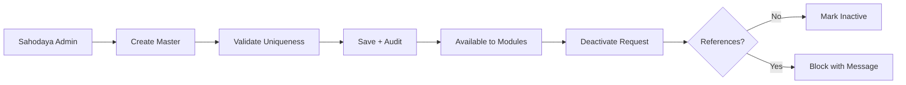

# Phase 2 — Common Masters Specification

All masters are tenant-scoped unless marked **Central**. Sahodaya admin manages masters; schools consume read-only or limited overrides per module rules.

## Master Inventory

| Master | Scope | Primary consumers |
|--------|-------|-------------------|
| Academic Year | Tenant | All modules |
| School Class | Tenant | Students, eligibility |
| Class Category | Tenant | Sports, Kalotsavam, MCQ |
| Teaching Type (PRT/TGT/PGT/PPT) | Central/Tenant | Teachers, training |
| Subject | Central/Tenant | Teachers, Kalotsavam |
| Designation | Central/Tenant | Teachers, officials |
| Age Category | Central/Tenant | Sports eligibility |
| Account Head | Tenant | Ledger, fees |
| Fee Head / Slab | Tenant | Membership, programs |
| Venue / Ground | Tenant | Sports schedule |
| Document Type | Tenant | School documents |
| Certificate Template | Tenant | Certs, ID cards |
| Notification Template | Tenant | Email engine |
| Report Definition | Platform | Report engine |

---

## 1. Academic Year

### Fields

| Field | Type | Required | Notes |
|-------|------|----------|-------|
| name | string | Yes | e.g. `2025-26` |
| start_date | date | Yes | |
| end_date | date | Yes | Must be after start |
| is_current | boolean | Yes | Only one current per tenant |
| status | enum | Yes | `draft`, `active`, `closed` |

### Validations

- Overlapping active years not allowed.  
- Cannot close year with pending unposted ledger entries (warning + override permission).

### Permissions

| Action | Roles |
|--------|-------|
| CRUD | `sahodaya_admin`, `secretary` |
| View | All authenticated tenant users |

### Audit Events

`academic_year.created`, `academic_year.updated`, `academic_year.closed`

---

## 2. School Class

### Fields

| Field | Type | Required |
|-------|------|----------|
| name | string | Yes |
| numeric_order | integer | Yes |
| class_category_id | FK | Yes |
| teaching_type_id | FK | No |
| is_active | boolean | Yes |

### Validations

- Unique `name` per tenant + academic year context.  
- `numeric_order` unique per tenant.

### Reports

- Class-wise student count  
- Class list export  

---

## 3. Class Category

Groups classes for eligibility (e.g. Primary, Secondary, Higher Secondary).

### Fields

| Field | Type | Required |
|-------|------|----------|
| name | string | Yes |
| code | string | Yes |
| min_class_order | integer | Yes |
| max_class_order | integer | Yes |
| is_active | boolean | Yes |

---

## 4. Teaching Type

Includes **PPT** (Pre-Primary Teacher) per ERP spec.

### Fields

| Field | Type | Required |
|-------|------|----------|
| code | string | Yes | `PRT`, `TGT`, `PGT`, `PPT` |
| label | string | Yes |
| min_class | integer | No | Class order range |
| max_class | integer | No |
| is_active | boolean | Yes |

### Seed defaults

PRT, TGT, PGT, PPT with class ranges per `SahodayaMasterDataSeeder`.

---

## 5. Subject Master

### Fields

| Field | Type | Required |
|-------|------|----------|
| name | string | Yes |
| code | string | Yes |
| category | enum | No | `language`, `science`, `arts`, etc. |
| is_active | boolean | Yes |

### Validations

- Unique `code` per tenant/central scope.  
- Cannot deactivate if linked to active teacher assignments (soft block).

### UI

- Admin → Master Data → Subjects (`MasterData/Subjects.vue`)

### Permissions

`sahodaya.masters.manage`

---

## 6. Designation Master

### Fields

| Field | Type | Required |
|-------|------|----------|
| name | string | Yes |
| code | string | Yes |
| rank | integer | No | For sorting org charts |
| is_active | boolean | Yes |

---

## 7. Age Category Master

Used primarily for **Sports** eligibility.

### Fields

| Field | Type | Required |
|-------|------|----------|
| name | string | Yes |
| min_age | decimal | Yes |
| max_age | decimal | Yes |
| as_of_date_rule | enum | Yes | `event_date`, `academic_year_start` |
| is_active | boolean | Yes |

### Validations

- `min_age` < `max_age`.  
- No overlapping ranges for same `as_of_date_rule` (configurable strictness).

---

## 8. Account Head (Chart of Accounts)

See [09-FEE_ACCOUNTS.md](09-FEE_ACCOUNTS.md). Summary fields: code, name, type (`asset`, `liability`, `income`, `expense`), parent_id, is_postable.

---

## 9. Common Master Workflows

---

## 10. Master Data Reports

| Report ID | Name | Filters |
|-----------|------|---------|
| RPT-MAST-001 | Master class list | active only |
| RPT-MAST-002 | Subject master export | category |
| RPT-MAST-003 | Designation list | — |
| RPT-MAST-004 | Age category matrix | — |
| RPT-MAST-005 | Teaching type with class ranges | — |
| RPT-MAST-006 | Inactive masters audit | date range |

---

## 11. Database Notes (Conceptual)

Central tables (where shared): `subjects`, `designations`, `age_categories`, `teaching_types` extensions.

Tenant tables: `school_classes`, `class_categories`, `account_heads`, program-specific fee configs.

Indexes:

- `(tenant_id, code)` unique on all coded masters  
- `(tenant_id, is_active)` for list screens  

Full DDL: [19-DATABASE_DESIGN.md](19-DATABASE_DESIGN.md)

---

## 12. Permissions Summary

| Permission | Description |
|------------|-------------|
| `sahodaya.masters.view` | Read all masters |
| `sahodaya.masters.manage` | CRUD masters |
| `school.masters.view` | Read classes/categories for own school context |

---

Phase 2 complete. Next: [03-RBAC_CREDENTIALS.md](03-RBAC_CREDENTIALS.md)
