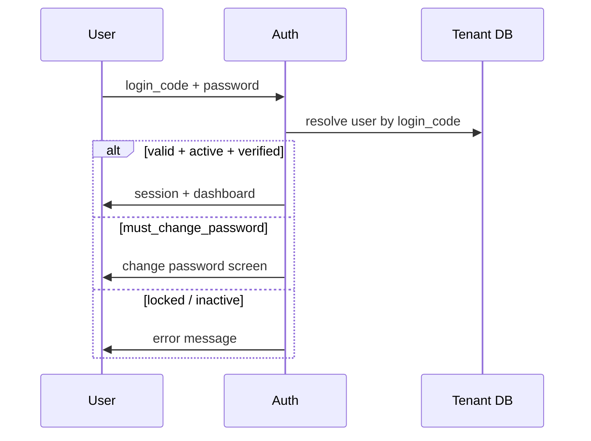
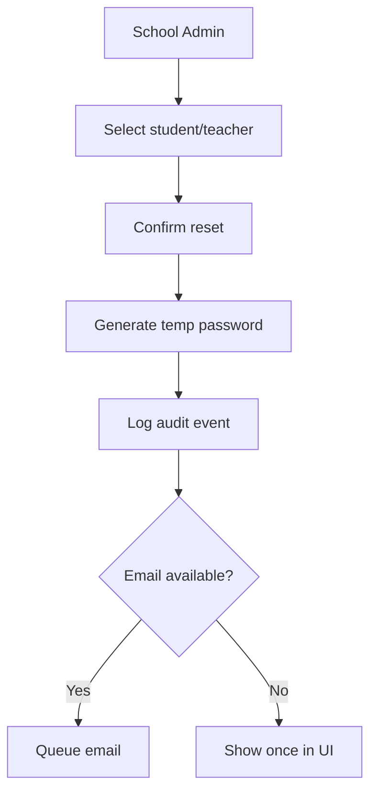

# Phase 3 — RBAC and Credentials Specification

## 1. Role Hierarchy

### 1.1 Platform Roles (Central)

| Role | Scope |
|------|-------|
| `platform_super_admin` | All tenants, provisioning |
| `platform_support` | Read-only cross-tenant support |

### 1.2 Sahodaya Roles (Tenant)

| Role | Description |
|------|-------------|
| `sahodaya_admin` | Full tenant administration |
| `secretary` | Org profile, membership, approvals |
| `finance_manager` | Payments, ledger, reconciliation |
| `finance_clerk` | Data entry, receipt generation |
| `sports_coordinator` | Sports meet operations |
| `kalotsavam_coordinator` | Kalotsavam operations |
| `mcq_coordinator` | MCQ operations |
| `training_coordinator` | Teacher training |
| `discipline_admin` | Cross-event discipline scope |
| `item_head` | Scoped item/mark entry |
| `judge` | Portal judging only |
| `mark_coordinator` | Mark verification |
| `event_ops` | Gate, attendance, venue ops |
| `report_viewer` | Read-only reports |

### 1.3 School Roles (Tenant)

| Role | Description |
|------|-------------|
| `school_admin` | Full school data and registrations |
| `school_finance` | Upload payment proofs, view receipts |
| `school_sports_coordinator` | Sports registrations for school |
| `school_kalotsavam_coordinator` | Kalotsavam registrations |
| `school_mcq_coordinator` | MCQ registrations |
| `school_training_coordinator` | Training nominations |
| `teacher` | Portal: profile, assigned duties |
| `student` | Portal: registrations, exams, results |

---

## 2. Permission Matrix (Abbreviated)

Full matrix maintained in `TenantUserCatalog` and `RolesAndPermissionsSeeder`.

| Permission key | Admin | Finance | Sport Coord | School Admin | Teacher | Student |
|----------------|-------|---------|-------------|--------------|---------|---------|
| `students.view` | ✓ | — | ✓ | ✓ (own school) | — | self |
| `students.manage` | ✓ | — | — | ✓ | — | — |
| `students.verify` | ✓ | — | — | — | — | — |
| `teachers.view` | ✓ | — | ✓ | ✓ | self | — |
| `teachers.manage` | ✓ | — | — | ✓ | — | — |
| `teachers.verify` | ✓ | — | — | — | — | — |
| `membership.approve` | ✓ | ✓ | — | — | — | — |
| `payments.verify` | ✓ | ✓ | — | upload | — | — |
| `ledger.post` | ✓ | ✓ | — | — | — | — |
| `fest.register` | ✓ | — | ✓ | ✓ | — | — |
| `fest.marks.enter` | ✓ | — | ✓ | — | ✓ (assigned) | — |
| `reports.export` | ✓ | ✓ | ✓ | ✓ (school) | — | — |
| `masters.manage` | ✓ | — | — | — | — | — |

**Rule:** School roles are scoped by `school_id` via middleware (`EnsureSchoolAdmin`, `EventCoordinatorScope`, etc.).

---

## 3. Student Login — STU Code

### 3.1 Format Decision

**Canonical format:** `STU` + zero-padded numeric suffix, **6 digits**: `STU000001` … `STU999999`.

Rationale: sortable, fixed width, supports 105k+ students per tenant.

Legacy aliases (`STU1`) may exist; new records use padded format only.

### 3.2 Generation Rules

1. Generated on **student record creation** (or first verification — configurable; default: creation).  
2. **Globally unique** within tenant DB (`students.login_code` UNIQUE).  
3. Sequence from tenant counter table or `MAX(numeric_suffix)+1` with row lock.  
4. Immutable after issue; change only via admin override with audit (`login_code.changed`).

### 3.3 Password Flow

| Step | Behavior |
|------|----------|
| Initial password | Random 8-char; shown once to school admin on create |
| First login | Force password change |
| Reset | School admin triggers reset → email temp password to guardian email if present; else display once |
| Lockout | 5 failed attempts / 15 min lock |

### 3.4 Portal Username

User authenticates with `login_code` (STU…) as username, not email.

---

## 4. Teacher Login — T Code

### 4.1 Format

**Canonical:** `T` + 6-digit padding: `T000001`.

### 4.2 Email Requirement

| Field | Rule |
|-------|------|
| `email` | **Mandatory**, valid format, unique per tenant |
| `login_code` | Generated T-prefix; used as username |
| Communication | All teacher notifications to `email` |

Validation blocks save/update if email blank or duplicate.

### 4.3 Password Flow

Same pattern as students: initial random, forced change, admin reset with audit.

---

## 5. School Admin Credentials

- Primary login: email + password (existing `User` model).  
- Linked to `school_id` and role `school_admin`.  
- Optional secondary coordinators with subset permissions.

---

## 6. Sahodaya Staff Credentials

- Email-based login on central/tenant user table.  
- MFA: future scope; document hook in auth config.

---

## 7. Login Workflow Diagrams

### 7.1 Student / Teacher Portal

### 7.2 Password Reset (School Admin)

---

## 8. Credential Reports

| Report ID | Name |
|-----------|------|
| RPT-AUTH-001 | Student login report (school-wise) |
| RPT-AUTH-002 | Teacher login report |
| RPT-AUTH-003 | Never logged in students |
| RPT-AUTH-004 | Never logged in teachers |
| RPT-AUTH-005 | Failed login attempts |
| RPT-AUTH-006 | Password reset audit |

---

## 9. Implementation References

- `app/Support/TenantUserCatalog.php` — role/permission catalog  
- `database/seeders/RolesAndPermissionsSeeder.php`  
- `app/Services/Students/StudentRegistrationNumberGenerator.php` — extend for STU login  
- `app/Services/Portal/TeacherPortalProvisioner.php` — T code provisioning  
- `app/Services/Teachers/TeacherVerificationGate.php`  
- `app/Services/Students/StudentVerificationGate.php`  

---

## 10. Deliverables Checklist

- [x] User Management chapter (roles above)  
- [x] Role & Permission Matrix  
- [x] STU / T credential specification  
- [x] Login and password workflow diagrams  

Next: [04-COMMON_ENGINES.md](04-COMMON_ENGINES.md)
