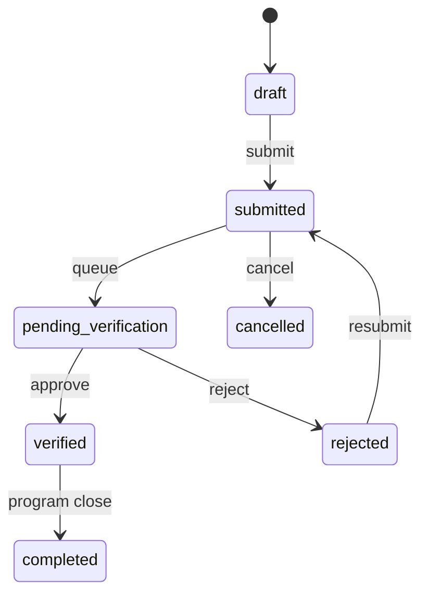
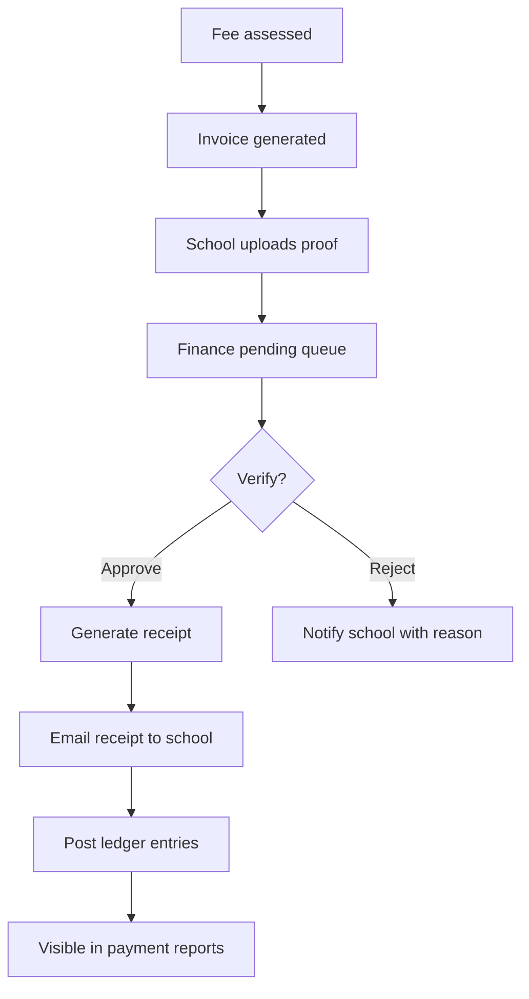

# Phase 4 — Common Engine Specification

Purpose: one set of engines reused across Sports, Kalotsavam, MCQ, Training, and Membership to avoid duplicate tables and logic.

## Engine Overview

| Engine | Responsibility | Primary modules |
|--------|----------------|-----------------|
| Registration | Draft → submit participant/application | All programs |
| Approval | Verification, reject, resubmit | Students, teachers, membership, fees |
| Offline Fee | Invoice, proof, verify, receipt, ledger | Membership, fest, MCQ, training |
| Scheduling | Venues, slots, clash detection | Sports, Kalotsavam |
| Result | Marks, ranks, publish, appeals | Sports, Kalotsavam, MCQ |
| Certificate | Template merge, PDF, bulk, email | All programs |
| Report | Filters, columns, export, queue | All |
| Email Notification | Templates, queue, delivery status | All |
| Audit | Immutable action log | All |
| Dashboard | KPI aggregation, cache | All roles |

---

## 1. Common Registration Engine

### Statuses

`draft` → `submitted` → `pending_verification` → `verified` | `rejected` → (resubmit) → `submitted`  
Terminal: `verified`, `cancelled`, `completed`

### Core entities (conceptual)

- `registrations` — polymorphic `registrable_type/id` (student, teacher, school)  
- `registration_lines` — items, tiers, or fee lines  
- `registration_documents` — attachments  

### Module plug-in points

| Module | Registrable | Lines |
|--------|-------------|-------|
| Sports | Student | Fest event items |
| Kalotsavam | Student | Catalog items |
| MCQ | Student | Tier/level |
| Training | Teacher | Program session |
| Membership | School | Fee slab year |

### Extension rules

- Module-specific eligibility services **pre-check** before `submitted`.  
- Module hooks: `onSubmitted`, `onVerified`, `onCancelled`.  
- No duplicate per `(program, registrable, line)` when status not cancelled.

---

## 2. Common Approval Engine

### Actors

| Actor | Typical actions |
|-------|-----------------|
| School admin | Submit |
| Sahodaya verifier | Verify / reject |
| Finance | Payment verify (parallel track) |

### Transitions

### Audit

Every transition logs: `actor_id`, `from_status`, `to_status`, `comment`, `timestamp`.

---

## 3. Common Offline Fee Engine

### Flow (mandatory for all modules)

### Core statuses

`unpaid` → `proof_uploaded` → `pending_verification` → `paid` | `rejected`  
Optional: `partial`, `waived` (with approval)

### Receipt requirements

- Unique receipt number per tenant + fiscal year  
- PDF storage path + public signed URL for school download  
- Fields: payer school, amount, fee head breakdown, payment mode, verified by, date  
- **100%** of `paid` transitions must have `receipt_id` and `email_sent_at` (or queued)

### Services (implementation)

- `ProgramFeeReceiptService`, `MembershipReceiptService`  
- `ProgramFeeReceiptMailer`, `MembershipNotifier`  
- `LedgerPostingService`, `PayableLedgerService`

### Module mapping

| Module | Invoice source | Receipt service |
|--------|----------------|-----------------|
| Membership | Membership fee | `MembershipReceiptService` |
| Sports/Kalotsav | Fest school event fee | `ProgramFeeReceiptMailer` |
| MCQ | Mcq school fee | `McqFeeLedgerService` |
| Training | Training school fee | `ProgramFeeReceiptService` |

---

## 4. Common Scheduling Engine

### Concepts

- **Schedule slot:** date, time, venue, capacity  
- **Assignment:** registration_line → slot  
- **Clash rule:** same participant, overlapping times  

### Statuses

`unscheduled` → `scheduled` → `conducted` | `postponed` | `cancelled`

### Module mapping

Sports (heats/lanes), Kalotsavam (stage/time), MCQ (exam window — date range not slot).

Implementation: `FestItemScheduleService`, `FestScheduleConflictService`.

---

## 5. Common Result Engine

### Pipeline

`entry_open` → `marks_entered` → `marks_verified` → `published` → `appeal_window` → `final`

### Entities

- Scores per judge or single entry  
- Normalized rank/points  
- Publication snapshot (immutable)  

### Module mapping

| Module | Entry UI | Publish |
|--------|----------|---------|
| Sports | Mark coordinator | Championship calc |
| Kalotsavam | Judge portal | Item head verify |
| MCQ | Auto + manual override | Tier results |

Services: `FestMarkSaveService`, `FestJudgeScoreService`, MCQ scoring services.

---

## 6. Common Certificate Engine

### Steps

1. Select template + dataset (results, training completion)  
2. Render PDF (single or bulk queue)  
3. Optional QR verification URL  
4. Email / download / print  

Service: `FestCertificateService` (extend for all modules).

---

## 7. Common Report Engine

See [16-REPORT_ENGINE.md](16-REPORT_ENGINE.md).

### Contract

Each report implements:

- `definition()` — id, columns, default filters  
- `query(filters)` — Eloquent/builder  
- `authorize(user)` — permission check  
- `export(format)` — csv/pdf via queue if large  

---

## 8. Common Email Notification Engine

See [15-EMAIL_NOTIFICATIONS.md](15-EMAIL_NOTIFICATIONS.md).

### Contract

- Trigger → template key → recipient resolver → queue mail → log status  

Single channel: **email only** in current release.

---

## 9. Common Audit Engine

### Logged actions

Create, update, delete (soft), status change, login, export, payment verify, receipt email.

Service: `PlatformAuditLogger`.

### Fields

`tenant_id`, `user_id`, `action`, `subject_type`, `subject_id`, `properties` (JSON diff), `ip`, `user_agent`, `created_at`.

---

## 10. Common Dashboard Engine

See [17-DASHBOARDS.md](17-DASHBOARDS.md).

### Pattern

- Widget registry keyed by role  
- Data providers return DTOs  
- Cache key: `dashboard:{role}:{tenant}:{school?}:{date}`  
- Invalidate on: approval, payment verify, registration window change  

---

## 11. Engine-to-Module Matrix

| Engine | Membership | Sports | Kalotsav | MCQ | Training | Students | Teachers |
|--------|------------|--------|----------|-----|----------|----------|----------|
| Registration | ✓ | ✓ | ✓ | ✓ | ✓ | ✓ | ✓ |
| Approval | ✓ | ✓ | ✓ | ✓ | ✓ | ✓ | ✓ |
| Offline Fee | ✓ | ✓ | ✓ | ✓ | ✓ | — | — |
| Scheduling | — | ✓ | ✓ | partial | ✓ | — | — |
| Result | — | ✓ | ✓ | ✓ | — | — | — |
| Certificate | ✓ | ✓ | ✓ | ✓ | ✓ | ✓ | ✓ |
| Report | ✓ | ✓ | ✓ | ✓ | ✓ | ✓ | ✓ |
| Email | ✓ | ✓ | ✓ | ✓ | ✓ | ✓ | ✓ |
| Audit | ✓ | ✓ | ✓ | ✓ | ✓ | ✓ | ✓ |
| Dashboard | ✓ | ✓ | ✓ | ✓ | ✓ | ✓ | ✓ |

---

## 12. Extension Rules

1. New program modules **must** use Offline Fee Engine — no ad-hoc receipt logic.  
2. Status enums extend via module-specific columns, not parallel status tables.  
3. Hooks registered in service provider or module config array.  
4. Breaking engine contract requires Phase 19 DB migration plan update.

---

Phase 4 complete. Next: [05-ORGANIZATION_SCHOOL.md](05-ORGANIZATION_SCHOOL.md)
