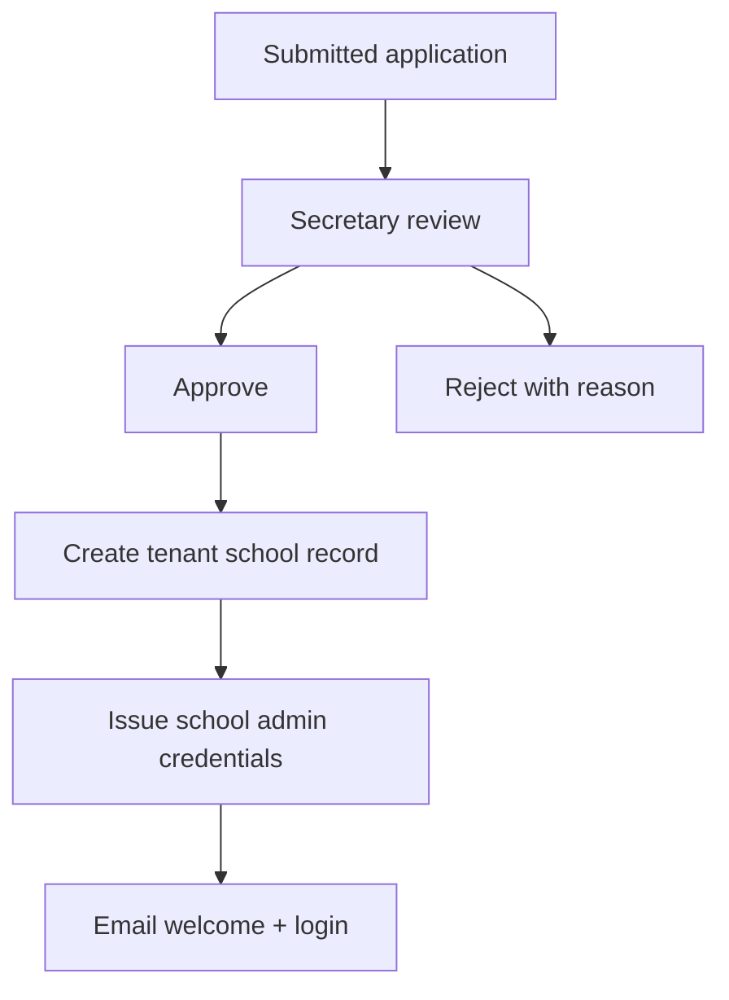

# Phase 5 — Organization and School Management

## Part A — Organization (Sahodaya)

### A.1 Organization Profile

**Screen:** Sahodaya Admin → Settings → Organization Profile

| Field | Required | Notes |
|-------|----------|-------|
| name | Yes | Legal name |
| short_name | No | Nav display |
| registration_number | No | |
| address, district, state, pin | Yes | |
| phone, email, website | Yes email | |
| logo | No | Image upload |
| academic_year_default | Yes | FK |

**Actions:** Save, preview public site  
**Permissions:** `sahodaya_admin`, `secretary`  
**Audit:** `organization.profile.updated`

### A.2 Executive Committee & Office Bearers

**Screens:** Office Bearers list, add/edit

| Field | Required |
|-------|----------|
| name | Yes |
| designation | Yes |
| term_start, term_end | Yes |
| photo | No |
| display_order | Yes |
| is_active | Yes |

Publishes to public Sahodaya site section.

### A.3 District / Region / Cluster

Optional hierarchy for grouping schools.

| Entity | Fields |
|--------|--------|
| District | name, code |
| Cluster | name, district_id |

Used in filters for reports and event allocation.

---

## Part B — School Lifecycle

### B.1 School Registration (Apply)

**Actor:** Invited school or Sahodaya admin on behalf

| Field | Required |
|-------|----------|
| school_name | Yes |
| affiliation_board | Yes |
| address, contact | Yes |
| principal_name | Yes |
| official_email | Yes | Receipt + notifications |
| phone | Yes |

**Status:** `draft` → `submitted` → `approved` | `rejected`

### B.2 School Approval Workflow

### B.3 School Profile

**Screen:** School Admin → Profile; Sahodaya → Member Schools → View

| Section | Fields |
|---------|--------|
| Identity | name, code, board, category |
| Contact | email, phone, address |
| Leadership | principal, coordinator contacts |
| Stats | student count, teacher count (computed) |
| Membership | current year status, expiry |

### B.4 School Documents

**Workflow:** Required document types configured by Sahodaya → school uploads → verifier approves/rejects

| Status | Meaning |
|--------|---------|
| pending | Uploaded, awaiting review |
| approved | Valid |
| rejected | Re-upload required |
| expired | Past validity date |

**Notifications:** Email on reject and expiry reminder (30/7 days).

### B.5 School Coordinators

Assign users to coordinator roles scoped to school:

- Sports, Kalotsavam, MCQ, Training, Finance  
- Multiple users allowed per role type  

### B.6 School Login Credentials

- Primary `school_admin` user tied to `official_email`  
- Reset password via email link  
- Activity: last login, IP (audit)

### B.7 School Activity Log

Read-only timeline: registrations, uploads, payments, logins (from audit engine).

---

## Part C — School Reports

| Report ID | Name | Scope |
|-----------|------|-------|
| RPT-SCH-001 | School list | All members |
| RPT-SCH-002 | Membership status | By year |
| RPT-SCH-003 | Student count by school | Current year |
| RPT-SCH-004 | Teacher count by school | Current |
| RPT-SCH-005 | Login history | School users |
| RPT-SCH-006 | Activity report | Date range |
| RPT-SCH-007 | Document compliance | Pending/expired |
| RPT-SCH-008 | New registrations pending approval | |
| RPT-SCH-009 | Cluster/district summary | |

---

## Part D — Notifications & Audit

| Event | Email recipient | Audit action |
|-------|-----------------|--------------|
| School approved | official_email | `school.approved` |
| School rejected | applicant email | `school.rejected` |
| Document rejected | school_admin | `school.document.rejected` |
| Coordinator assigned | user email | `school.coordinator.assigned` |
| Credential reset | user email | `user.password.reset` |

---

## Implementation References

- `MemberSchoolsController`, `MembershipSettingsController`  
- `SchoolAdminController`, `RegistrationProfileController`  
- `SahodayaProfile`, `Registration` models  

Next: [06-STUDENT_MANAGEMENT.md](06-STUDENT_MANAGEMENT.md)
