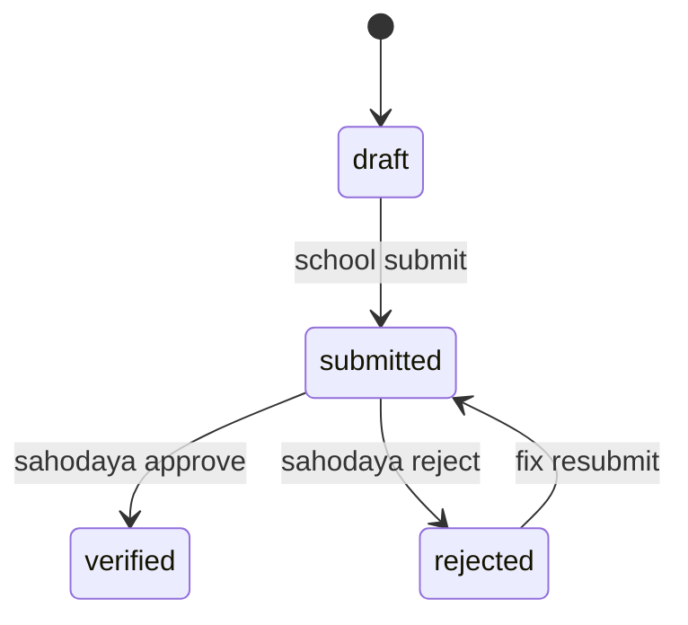

# Phase 6 — Student Management Specification

Scale target: **105,000+** active students per tenant.

## 1. Student Registration Screen

### Fields

| Field | Required | Validation |
|-------|----------|------------|
| admission_no | Yes | Unique per school |
| first_name, last_name | Yes | |
| gender | Yes | enum |
| date_of_birth | Yes | Age computed |
| class_id | Yes | FK school_class |
| section | No | |
| category | No | SC/ST/OBC/General etc. |
| religion | No | |
| blood_group | No | |
| guardian_name | Yes | |
| guardian_phone | Yes | 10-digit |
| guardian_email | No | Used for password reset |
| address | Yes | |
| photo | No | JPG/PNG max 2MB |
| aadhar | No | Masked display |
| login_code | Auto | STU000001 format |

### Actions

Create draft → Submit for verification (school) → Sahodaya verify

**Permissions:** `school_admin` create; `sahodaya_admin` verify

---

## 2. Bulk Upload

### Template columns

Match registration fields + `school_code` for Sahodaya import.

### Validation pipeline

1. File type CSV, max 10MB  
2. Row-level validation with error collection  
3. Duplicate detection: admission_no + school  
4. Class must exist  
5. Preview screen before commit  
6. **Queued import** if rows > 500  

### Import error report

RPT-STU-020 — row number, field, message, raw values

Service: `StudentCsvImporter`

---

## 3. Student Photo Upload

- Stored on tenant disk/S3 path `students/{id}/photo.jpg`  
- Thumbnail for ID cards  
- Replace triggers audit  

---

## 4. Verification Workflow

**Gate:** `StudentVerificationGate` blocks fest/MCQ registration until `verified`.

---

## 5. Edit Request Workflow

School submits change → Sahodaya approves → applied to record  
Service: `StudentEditChangeService`, `StudentEditLockService`

Locked fields after verification: name, DOB, gender (configurable).

---

## 6. Student Profile Screen

Tabs: Personal, Academic, Sports profile, Registrations, Achievements, Documents, Audit history

Portal view (student): subset — own profile, registrations, results, hall tickets.

---

## 7. STU Login

See [03-RBAC_CREDENTIALS.md](03-RBAC_CREDENTIALS.md).

- Username = `login_code`  
- Provision on create via `StudentRecordCreator` + generator  
- Portal: `StudentDashboardController`, `StudentMcqController`

---

## 8. Student ID Card

- Template per program/year  
- Bulk generate by school/class  
- QR links to verification URL  
Service: `FestIdCardService` (generalized)

---

## 9. Student Certificates

Achievement, participation, merit — via Certificate Engine.

---

## 10. Lifecycle Flows

| Flow | Trigger | End state |
|------|---------|-----------|
| Inactive | School marks left | `inactive`, portal disabled |
| Alumni | Graduation year | `alumni` |
| Transfer | TC request approved | New school record or link |
| Achievement | Manual entry | Linked achievement row |
| History | All status changes | Audit + optional history table |

---

## 11. Student Reports

| Report ID | Name |
|-----------|------|
| RPT-STU-001 | School-wise student list |
| RPT-STU-002 | Gender-wise summary |
| RPT-STU-003 | Class-wise summary |
| RPT-STU-004 | Category-wise summary |
| RPT-STU-005 | Age category-wise (sports) |
| RPT-STU-006 | Verification pending |
| RPT-STU-007 | Verification completed |
| RPT-STU-008 | Inactive students |
| RPT-STU-009 | Login report |
| RPT-STU-010 | Import error report |
| RPT-STU-011 | Photo missing |
| RPT-STU-012 | Duplicate admission numbers |

---

## 12. Performance Rules

| Rule | Implementation |
|------|----------------|
| Pagination | All lists default 25, max 100 |
| Search | Indexed: `school_id`, `class_id`, `login_code`, `admission_no`, `last_name` |
| Export > 5000 | `ExportStudentsJob` queued |
| Eager load | `class`, `school` on index |
| Counts | Cached `school_student_counts` materialized nightly |

---

## Implementation References

- `SchoolStudentsController`, `StudentController`, `StudentProfileController`  
- `StudentVerificationController`  
- `StudentEditChangeRequestController`  
- `StudentSportsProfileService`  

Next: [07-TEACHER_MANAGEMENT.md](07-TEACHER_MANAGEMENT.md)
