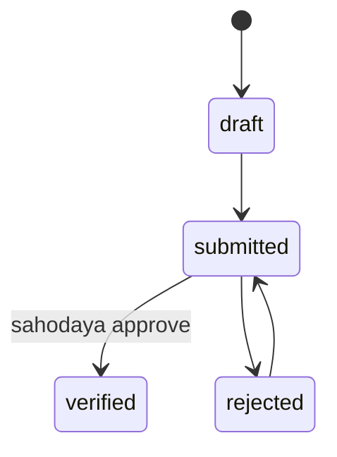

# Phase 7 — Teacher Management Specification

## 1. Teacher Registration Screen

### Fields

| Field | Required | Validation |
|-------|----------|------------|
| employee_id | Yes | Unique per school |
| first_name, last_name | Yes | |
| email | **Yes** | Unique per tenant, valid RFC |
| phone | Yes | |
| gender | Yes | |
| date_of_birth | No | |
| teaching_type_id | Yes | PRT/TGT/PGT/PPT |
| designation_id | Yes | FK designation master |
| qualification | No | Text |
| experience_years | No | Numeric ≥ 0 |
| date_of_joining | No | |
| photo | No | |
| login_code | Auto | T000001 format |
| subjects | No | Many-to-many subject |
| classes_handled | No | Many-to-many school_class |
| sections_handled | No | Text/JSON |
| is_active | Yes | |

**Block save if email missing or duplicate.**

---

## 2. Teacher Category

Mapped via **Teaching Type** master (PRT, TGT, PGT, PPT) — not a separate uncontrolled field.

---

## 3. T Login Code

See [03-RBAC_CREDENTIALS.md](03-RBAC_CREDENTIALS.md).

- Generated on create by `TeacherPortalProvisioner`  
- Username = `login_code`; password flow identical to students  
- Portal routes: judge dashboard, mark entry, training  

---

## 4. Verification Workflow

**Gate:** `TeacherVerificationGate` — blocks training nomination, judging assignment until verified.

**Screen:** Sahodaya → Teachers → Verification (`Teachers/Verification.vue`)

---

## 5. Edit Request Workflow

Same pattern as students: `UserProfileChangeRequest` / teacher-specific change requests with Sahodaya approval.

---

## 6. Teacher Profile Screen

Tabs: Personal, Professional, Subjects & Classes, Training history, Assignments (committee, judge, resource person), Documents, Audit

---

## 7. Training History

Computed from `training_registrations` where teacher verified and attendance complete.

| Column | Source |
|--------|--------|
| Program name | training_programs |
| Year | academic_year |
| Status | registration status |
| Certificate | link if issued |

Service: `TeacherTrainingEligibilityService` uses history + config for eligibility.

---

## 8. Assignments

| Type | Description |
|------|-------------|
| Committee | Executive/subcommittee membership |
| Official | Sports/Kalotsav official roles |
| Judge | Item-level judge portal access |
| Resource Person | Training sessions |

Each assignment: date range, program reference, audit on assign/remove.

---

## 9. Teacher Certificates & ID Card

- Event official ID cards via `FestIdCardService`  
- Training completion certificates via Certificate Engine  

---

## 10. Teacher Reports

| Report ID | Name |
|-----------|------|
| RPT-TCH-001 | Teacher list (all schools) |
| RPT-TCH-002 | Category-wise (teaching type) |
| RPT-TCH-003 | Subject-wise |
| RPT-TCH-004 | School-wise |
| RPT-TCH-005 | Training history |
| RPT-TCH-006 | Verification pending |
| RPT-TCH-007 | Verification completed |
| RPT-TCH-008 | Qualification-wise |
| RPT-TCH-009 | Experience-wise |
| RPT-TCH-010 | Login report |
| RPT-TCH-011 | Judge assignment list |
| RPT-TCH-012 | Missing email (data quality) |

---

## 11. Credential Rules Summary

| Rule | Enforcement |
|------|-------------|
| Email mandatory | Form + DB NOT NULL |
| T code unique | UNIQUE index |
| Email unique | UNIQUE index per tenant |
| Verified for duties | Middleware + gate services |

---

## Implementation References

- `TeacherController`, `TeacherVerificationController`  
- `Teacher` model with `teacher_subject`, `teacher_school_class` pivots  
- `TeacherPortalProvisioner`, `TeacherVerificationGate`  
- `TeacherTrainingEligibilityService`  

Next: [08-MEMBERSHIP_PAYMENTS.md](08-MEMBERSHIP_PAYMENTS.md)
