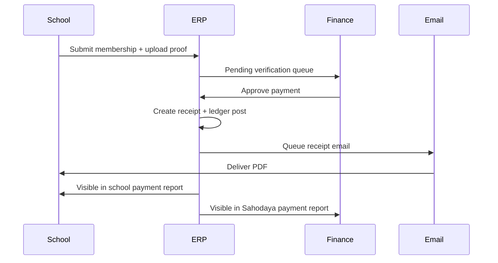

# Phase 8 — Membership and Offline Payment Specification

**Current release:** offline payments only. Every approved payment **must** produce receipt, email school, appear in school + Sahodaya payment reports.

## 1. Membership Fee Setup

| Config | Description |
|--------|-------------|
| Fee slabs | By school category / size |
| Academic year binding | Slab active per year |
| Due dates | Registration vs renewal |
| Late fee | Optional via `LateFeeCalculator` |

**Screen:** Sahodaya → Membership → Settings (`MembershipSettingsController`)

---

## 2. Membership Registration & Renewal

### School actor flow

1. View current membership status  
2. Select year / renewal  
3. System calculates fee + late fee if applicable  
4. Submit → `submitted`  
5. Upload payment proof (if not prepaid by Sahodaya)  
6. Finance verifies → receipt + email  

### Statuses

`not_registered` → `submitted` → `proof_uploaded` → `verified` | `rejected` → `active` / `expired`

---

## 3. Offline Payment Proof Upload

| Field | Rule |
|-------|------|
| file | PDF/JPG/PNG max 5MB |
| payment_date | Required |
| amount | Must match invoice ± tolerance |
| reference_no | UTR/cheque number |
| payment_mode | NEFT/RTGS/cheque/cash |

**Actor:** `school_finance` or `school_admin`  
**Storage:** tenant disk, linked to `membership_payments` or `fee_receipts` parent

---

## 4. Finance Verification

**Queue:** Sahodaya → Finance → Payment Verification

| Action | Result |
|--------|--------|
| Approve | Generate receipt, post ledger, email school |
| Reject | Reason required, email school |
| Request info | Status `pending_info`, email school |

Controllers: `PaymentVerificationController`, `FinanceHubController`

---

## 5. Receipt Generation (Mandatory)

### Receipt record

| Field | Required |
|-------|----------|
| receipt_number | Yes, sequential per FY |
| school_id | Yes |
| amount | Yes |
| fee_breakdown | JSON lines |
| payment_mode | Yes |
| verified_by | Yes |
| verified_at | Yes |
| pdf_path | Yes |

Services: `MembershipReceiptService`, `ProgramFeeReceiptService`

### Numbering

Format: `{PREFIX}-{SEQ}` e.g. `MEM-0123` — matches the same `ProgramFeeReceiptService::formatNumber()` pattern Fest (`EF-0074`) and Training (`TRN-0074`) already use, sharing one atomic per-Sahodaya sequence (`SahodayaReceiptNumberAllocator`). Previously documented as `{FY}/{PREFIX}/{SEQ}` (e.g. `2025-26/MEM/000123`) — that finer-grained, year-prefixed format was never actually implemented for any program, not just Membership; corrected here to match what's live rather than leaving an aspirational format on record. Adopting a real `{FY}/...` scheme would be a separate, larger change affecting Fest/Training/MCQ numbering too, not a Membership-only fix.

---

## 6. Receipt Email to School

**Trigger:** On finance approve (sync queue job)

| Field | Purpose |
|-------|---------|
| to | `school.official_email` + finance contact |
| attachment | Receipt PDF |
| body | Template `membership.receipt_issued` |
| tracking | `email_sent_at`, `email_status`, retry count |

Service: `MembershipNotifier`, `ProgramFeeReceiptMailer`

**Requirement:** 100% of approved payments must enqueue email; failures visible in admin delivery report.

---

## 7. Payment Reports (School & Sahodaya)

### School Payment Report

**Screen:** School Admin → Payments → History (`PaymentHistoryController`)

| Column | Notes |
|--------|-------|
| Date | Payment/verify date |
| Program | Membership / Sports / MCQ / Training |
| Amount | |
| Status | |
| Receipt # | Link to PDF |
| Verified by | Sahodaya only |

### Sahodaya Payment Report

**Screen:** Finance Hub → All payments

Same columns + school filter, export, receipt resend action.

| Report ID | Name |
|-----------|------|
| RPT-PAY-001 | Membership collection summary |
| RPT-PAY-002 | Pending membership payments |
| RPT-PAY-003 | Expired membership |
| RPT-PAY-004 | Renewed membership |
| RPT-PAY-005 | School membership history |
| RPT-PAY-006 | Payment due (all modules) |
| RPT-PAY-007 | Payment verified register |
| RPT-PAY-008 | Payment rejected log |
| RPT-PAY-009 | Receipt email delivery status |
| RPT-PAY-010 | Unified offline payment hub |

---

## 8. Membership Certificate

Optional PDF after `active` membership — template per Sahodaya config.

---

## 9. End-to-End Offline Flow

---

## 10. Receipt Email Tracking Requirements

| Column | Table |
|--------|-------|
| receipt_emailed_at | fee_receipts |
| receipt_email_status | enum: queued/sent/failed |
| receipt_email_error | text nullable |
| resend_count | integer |

Admin action: **Resend receipt email** with audit log.

---

## 11. Ledger Integration

On approve: Dr Bank/Cash, Cr Membership Income (account heads from `LedgerAccountCatalog`)

Service: `LedgerPostingService`, `MembershipReceiptService`

---

## Implementation References

- `MembershipPayment`, `MembershipFeeSlab`, `FeeReceipt`  
- `PayableController`, `BankReconciliationController`  
- `FeeWaiverService` for approved waivers  

Next: [09-FEE_ACCOUNTS.md](09-FEE_ACCOUNTS.md)
