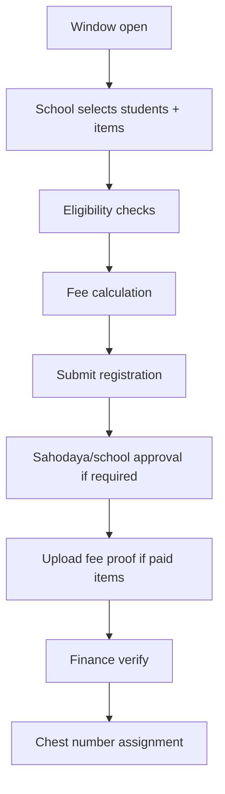

# Phase 10 — Sports Specification

Sports uses the **Event Engine** (see [04-COMMON_ENGINES.md](04-COMMON_ENGINES.md)) with program type `sports`.

## Architecture (Head = Event)

| Layer | Entity | Role |
|-------|--------|------|
| Season hub | `FestEvent` (`partition_role=sports_season`) | Config only: age cutoff, catalog sync, state remittance |
| Sport event | `FestEvent` (`partition_role=sports_discipline`) | Athletics, Chess, … — fees, items, registration, marks, results |

There is **no separate FestItemHead runtime entity for Sports**. Catalog templates may still use `FestItemHead` with `event_id=null`. Kalotsav continues to use item heads.

**Migration:** `php artisan fest:migrate-sports-head-to-event {--sahodaya=} {--dry-run}` copies legacy head fields onto sport events and consolidates per-head fees.

**Sync:** `FestSportsEventSyncService` ensures one child sport event per catalog sport on the season hub.

## 1. Sports Meet Setup

| Config | Description |
|--------|-------------|
| fest_event (season) | Year container |
| fest_event (sport) | One per sport (Athletics, Chess, …) |
| registration windows | On the sport event / items via `FestItemWindowResolver` |
| free quota | On the sport event (`included_items_per_student`, `included_teams`) |
| points schema | Championship calculation |

**Controllers:** `SportsProgramController`, `FestEventController`, `FestEventSettingsController`, `FestSportsSetupController`

---

## 2. Sport events and Items

| Entity | Description |
|--------|-------------|
| Sport event | One `FestEvent` per sport (fees, policy, schedule on the event) |
| Catalog item | Individual competition item under that event |
| Item config | Gender, age category, team size, max participants |

Services: `FestCatalogService`, `FestSportsEventSyncService`, `FestSportsCompositeFeeService`

**Taxonomy:** `config/fest_item_taxonomy.php` — sports-specific codes

---

## 3. Eligibility Rules

| Rule | Enforced by |
|------|-------------|
| Class category | `FestRegistrationEligibilityService` |
| Age category | Age as of event date vs `AgeCategory` master |
| Gender | Item config |
| Max participants per school | Per item counters |
| Max items per student | `FestItemRegistrationGate` |
| Student verified | `StudentVerificationGate` |
| Sports profile | `StudentSportsProfileService` |

---

## 4. Registration Flow

Services: `FestRegistrationRegisterService`, `FestRegistrationCreateService`, `FestRegistrationApprovalService`, `FestRegistrationFeeGate`

---

## 5. Free Quota and Paid Items

- Free items within quota per student/school  
- Additional items billed via `FestSportsCompositeFeeService`  
- Invoice → offline payment → receipt (Phase 8 flow)

---

## 6. Venue, Ground, Officials, Schedule

| Feature | Service |
|---------|---------|
| Venue/ground master | Event settings |
| Official assignment | `FestEventStaffController` |
| Schedule slots | `FestItemScheduleService` |
| Clash detection | `FestScheduleConflictService` |
| Substitution | `FestSubstitutionRequest` workflow |

---

## 7. Lane Allocation, Heats, Finals

Optional per track event configuration:

- Preliminary heats → semi-finals → finals  
- Lane draw rules documented per item template  
- Results carry heat/lane metadata  

(Status: retain existing behavior; extend in item settings JSON.)

---

## 8. Attendance & Absent Students

**Screens:** Event ops portal — gate, attendance  
**Controller:** `FestGateController`, `FestEventOpsController`

Mark present/absent before result entry; absent blocks ranking.

---

## 9. Results Pipeline

| Stage | Actor |
|-------|-------|
| Mark entry | Mark coordinator / item head |
| Verification | Discipline admin / item head |
| Publish | Sports coordinator |
| Appeal | `FestAppealsHubController` (if enabled) |

Services: `FestMarkSaveService`, `FestMarkEntryScopeService`, `FestJudgeScoreService`

---

## 10. Records, Points, Championship

| Feature | Description |
|---------|-------------|
| Athletic records | `AthleticRecordsDashboardController` |
| Points table | School points by placement |
| Championship | Aggregate by category/level |
| Ranking | Tie-break rules in config |

---

## 11. Certificates & ID Cards

- Participation / merit certificates via `FestCertificateService`  
- Chest number + ID cards via `FestIdCardService`, `FestChestNumberController`  

---

## 12. Sports Reports (Catalogue Extract)

| Report ID | Name | Status |
|-----------|------|--------|
| RPT-SPT-001 | Registered students by item | retain |
| RPT-SPT-002 | School-wise registration summary | retain |
| RPT-SPT-003 | Fee collection sports | retain |
| RPT-SPT-004 | Schedule by venue | retain |
| RPT-SPT-005 | Clash report | retain |
| RPT-SPT-006 | Chest number list | retain |
| RPT-SPT-007 | Attendance sheet | retain |
| RPT-SPT-008 | Result sheet by item | retain |
| RPT-SPT-009 | Points table | retain |
| RPT-SPT-010 | Championship standings | retain |
| RPT-SPT-011 | Athletic records | retain |
| RPT-SPT-012 | Substitution log | retain |
| RPT-SPT-013 | Eligibility exception log | new |
| RPT-SPT-014 | Absentee list | retain |

Legacy duplicate routes: mark `alias` in report engine — do not remove until UAT.

---

## Implementation References

- `FestReportController`, `FestSchoolReportController`, `FestReportService`  
- `StateDashboardService`, `SportsAgeGroupController`  
- `EnsureFestDisciplineAdmin`, `EnsureFestEventOps` middleware  

Next: [11-KALOTSAVAM.md](11-KALOTSAVAM.md)
