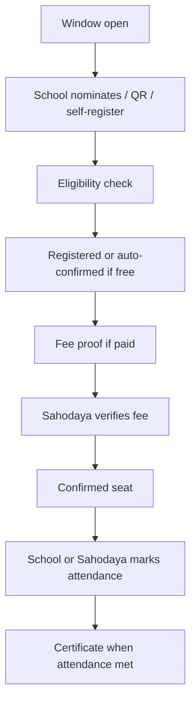

# Phase 13 — Teacher Training Specification

## 1. Program Setup

| Field | Description |
|-------|-------------|
| title | Program name |
| academic_year | FK |
| dates | Start/end |
| venue | Location / online flag |
| capacity | Max nominations |
| fee | Per teacher or school bundle |
| eligibility_config | JSON — see below |
| certificate_template | FK |

Model: `TrainingProgram` with `eligibility_config`  
Config schema: `TrainingProgramEligibilityConfig`

---

## 2. Eligibility Rules

Evaluated by `TeacherTrainingEligibilityService`:

| Rule type | Example |
|-----------|---------|
| teaching_type | PRT only |
| designation | Headmaster excluded |
| min_experience | ≥ 2 years |
| subjects | Must teach Mathematics |
| prior_training | Must have completed Program X |
| verified | Teacher must be verified |

Block nomination with clear message if fail.

---

## 3b. QR Registration (public)

Per-program public registration via dedicated QR / URL on the Sahodaya domain.

| Capability | Detail |
|------------|--------|
| Registration QR | Unique token URL `/training/register/{token}` — PNG/SVG/PDF download |
| Window control | Honours `registration_open` / `registration_close`, program status, and `qr_registration_enabled` |
| Form | Name*, email*, phone, DOB, gender, school search (+ manual school), designation, department, experience, photo, consent |
| Teacher linking | Match by email / mobile / name+school; else create teacher with `verified_at = null` (pending school verification) |
| Pending schools | Manual school name creates `training_pending_schools` row |
| Attendance QR | Separate program + per-session QR; check-in by email/mobile/registration ID; only confirmed registrations |
| Reports | QR registrations, teachers created, pending schools, designation-wise — admin page + Excel export |
| Audit | `training.qr.registered`, `training.qr.teacher_created`, `training.qr.pending_school`, `training.qr.attendance`, `training.qr.regenerated` |

**Services:** `TrainingQrService`, `TrainingPublicRegistrationService`, `TrainingAttendanceCheckInService`, `TrainingQrReportService`  
**Public controller:** `Public\TrainingQrRegistrationController`

---

## 3. Nomination & attendance flow

Unverified teachers may register and attend unless **Require verified teachers** is on.  
Schools mark attendance at `/school-admin/{id}/training/{program}/attendance` when **School attendance** is enabled.

**Controllers:** `TrainingRegistrationController`, school admin training index / attendance

---

## 4. Offline Payment

Same as Phase 8:

- `TrainingSchoolFee` invoice  
- Proof upload  
- Receipt + email on verify  
- Ledger post via `ProgramFeeReceiptService`

---

## 5. Attendance

| Session | Mark |
|---------|------|
| Day 1 AM | present/absent |
| Day 1 PM | |
| ... | |

Minimum attendance % for certificate (configurable).

---

## 6. Feedback

Post-training survey (optional): rating + comments per teacher, aggregated in reports.

---

## 7. Certificates

Issued when:

- Attendance threshold met  
- Program completed  
- Fee verified (if paid)  

Bulk PDF + email to teacher `email` (mandatory).

---

## 8. Training Reports

| Report ID | Name |
|-----------|------|
| RPT-TRN-001 | Program list |
| RPT-TRN-002 | Nominations by school |
| RPT-TRN-003 | Eligibility rejection log |
| RPT-TRN-004 | Fee collection training |
| RPT-TRN-005 | Attendance register |
| RPT-TRN-006 | Certificate issued |
| RPT-TRN-007 | Teacher training history (cross-program) |
| RPT-TRN-008 | Feedback summary |
| RPT-TRN-009 | Capacity utilization |

---

## Implementation References

- `TrainingProgram`, `TrainingRegistration`, `TrainingSchoolFee`  
- `TeacherTrainingEligibilityService`  
- School: `School/Training/Index.vue`  

Next: [14-CERTIFICATES_ID_CARDS.md](14-CERTIFICATES_ID_CARDS.md)
