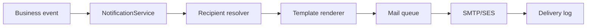

# Phase 15 — Email Notification Specification

**Current release: email only.** SMS/WhatsApp removed from scope; `NotificationService` routes external notifications to mail queue only.

## 1. Architecture

---

## 2. Template Catalog

| Template key | Trigger | Recipients |
|--------------|---------|------------|
| `membership.submitted` | School submits | Secretary |
| `membership.approved` | Verified | School official_email |
| `membership.rejected` | Rejected | School |
| `membership.receipt_issued` | Payment approved | School finance + official |
| `fest.registration.confirmed` | Registration approved | School coordinator |
| `fest.schedule.published` | Schedule publish | School coordinators |
| `fest.results.published` | Results publish | School coordinators |
| `mcq.hall_ticket` | Hall ticket ready | School / guardian |
| `mcq.results.published` | Results | School |
| `training.nomination.confirmed` | Seat confirmed | Teacher email |
| `training.receipt_issued` | Fee verified | School |
| `training.certificate` | Certificate issued | Teacher email |
| `student.verification.approved` | Student verified | School |
| `teacher.verification.approved` | Teacher verified | Teacher email |
| `payment.proof.rejected` | Finance reject | School finance |
| `user.password.reset` | Admin reset | User email |
| `school.welcome` | School approved | School admin |
| `document.rejected` | Doc reject | School admin |
| `export.ready` | Large export done | Requesting user |

Templates stored in DB (`notification_templates`) or config files per tenant override.

---

## 3. Recipient Resolution Rules

| Entity | Primary | CC |
|--------|---------|-----|
| School | official_email | coordinator emails for module |
| Teacher | teacher.email (mandatory) | — |
| Student | guardian_email if set | — |
| Sahodaya staff | role-based distribution lists | — |

Fallback: if no email, log warning + show in-app notification for school admin only.

---

## 4. Queue and Status

| Status | Meaning |
|--------|---------|
| queued | Job dispatched |
| sent | SMTP accepted |
| failed | Error after retries |
| skipped | No recipient |

### Tracking fields (per notification log row)

`notification_logs`: id, template_key, notifiable_type/id, to, subject, status, error, sent_at, created_at

Receipt-specific: on `fee_receipts` — `receipt_emailed_at`, `receipt_email_status`

---

## 5. Retry Policy

- 3 attempts exponential backoff (1m, 5m, 15m)  
- Dead letter visible in admin **Email Delivery Report**  
- Manual resend action with audit  

---

## 6. Content Rules

- HTML + plain text multipart  
- Sahodaya branding header/footer  
- Unsubscribe: N/A (transactional only)  
- Max attachment 10MB; use link for larger PDFs  

---

## 7. In-App vs External

| Channel | Use |
|---------|-----|
| Email | External official communication |
| In-app | Bell icon for school/sahodaya users |
| Database notifications | Laravel notifications table |

---

## 8. Delivery Reports

| Report ID | Name |
|-----------|------|
| RPT-EML-001 | Email delivery log |
| RPT-EML-002 | Failed emails pending retry |
| RPT-EML-003 | Receipt email status |
| RPT-EML-004 | Template usage counts |
| RPT-EML-005 | Emails by module (monthly) |

---

## Implementation References

- `app/Services/Notifications/NotificationService.php`  
- `ProgramFeeReceiptMailer`, `MembershipNotifier`  
- Removed: `SmsChannelService` (future re-add documented only)

Next: [16-REPORT_ENGINE.md](16-REPORT_ENGINE.md)
