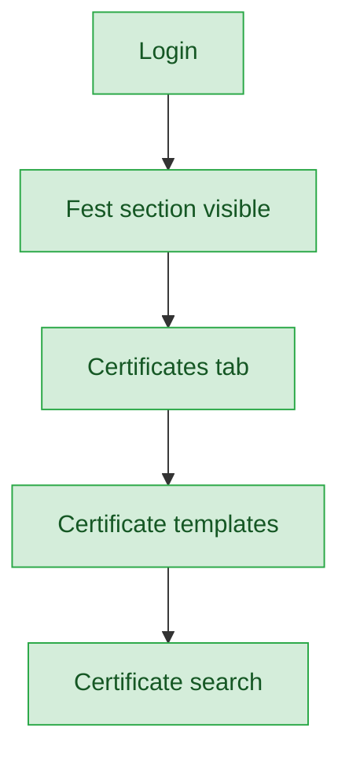
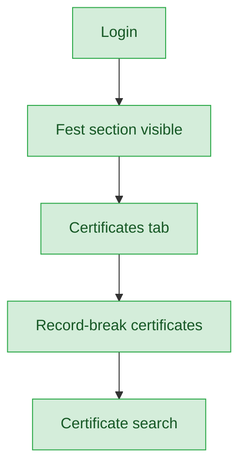
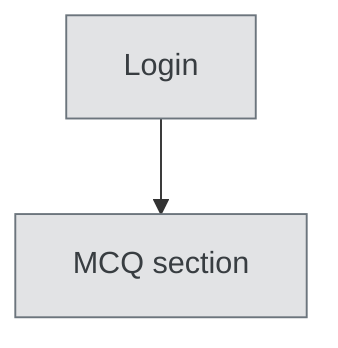

# Certificate Collector — User Journey

**Landing dashboard:** `/sahodaya-admin/{tenant_id}` → `DashboardController::index`
**Scope:** Holds only `fest.view` and `fest.certificates` — the cleanest-scoped role in the whole audit. Full read+write on certificates for every fest event type, plus global certificate templates and search; every other fest tab is correctly excluded. No certificate system exists for MCQ at all, so that section is not applicable regardless of role.

## Kalotsav / Kids Fest / Teacher Fest / Custom Events (identical pattern)

| Stage | Menu path | Route | Status | Note |
|---|---|---|---|---|
| Login | Sahodaya dashboard | `/sahodaya-admin/{tenant_id}` | ✅ | |
| Onboarding/setup | Fest section visible | `fest.view` | ✅ | |
| Registration/enrollment | 🚫 | requires `fest.registrations` (not granted) | 🚫 | Correctly excluded |
| Configuration | 🚫 | requires `fest.settings` (not granted) | 🚫 | Correctly excluded |
| Execution | 🚫 | requires `fest.marks`/`fest.manage` (not granted) | 🚫 | Correctly excluded |
| Review/approval | 🚫 | requires `fest.manage` (not granted) | 🚫 | Correctly excluded |
| Publishing/results | 🚫 | requires `fest.results` (not granted) | 🚫 | Correctly excluded (results is separate from certificates) |
| Post-result | Certificates tab / Templates / Search | `fest.certificates` — exact match | ✅ | Full read+write; global certificate templates and search also available |

**Known issues:** None found.

## Sports Meet

| Stage | Menu path | Route | Status | Note |
|---|---|---|---|---|
| Login | Sahodaya dashboard | `/sahodaya-admin/{tenant_id}` | ✅ | |
| Onboarding/setup | Fest section visible | `fest.view` | ✅ | |
| Registration/enrollment | 🚫 | requires `fest.registrations` (not granted) | 🚫 | Correctly excluded |
| Configuration | 🚫 | requires `fest.settings` (not granted) | 🚫 | Correctly excluded |
| Execution | 🚫 | requires `fest.marks`/`fest.manage` (not granted) | 🚫 | Correctly excluded |
| Review/approval | 🚫 | requires `fest.manage` (not granted) | 🚫 | Correctly excluded |
| Publishing/results | 🚫 | requires `fest.results` (not granted) | 🚫 | Correctly excluded |
| Post-result | Certificates / Record-break certificates | `fest.certificates` — same gate, also covers record-break certificates unique to Sports | ✅ | |

**Known issues:** None found.

## MCQ Exams

| Stage | Menu path | Route | Status | Note |
|---|---|---|---|---|
| All stages | Certificates | n/a | 🚫 | No certificate system exists for MCQ at all, regardless of role |

**Known issues:** None (structural — MCQ has no certificate feature platform-wide).

---
## Summary for this role
Certificate Collector is complete and cleanly scoped across all five fest types (Kalotsav, Sports Meet, Kids Fest, Teacher Fest, Custom Events): certificates, templates, and search all work correctly, and every other fest tab is correctly excluded since only `fest.certificates` is granted. MCQ is not applicable because no certificate system exists there at all — a platform-wide gap, not a role-specific one. No actionable fix needed for this role itself.
