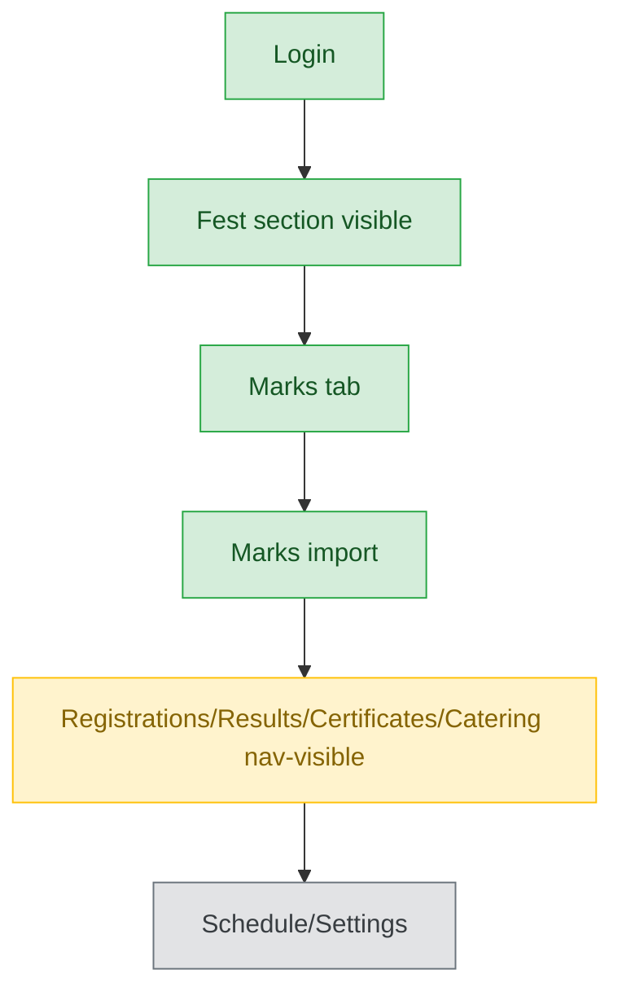
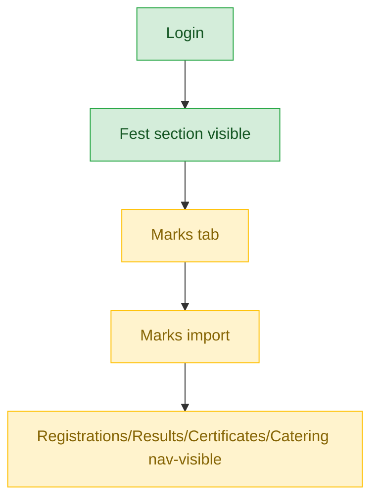
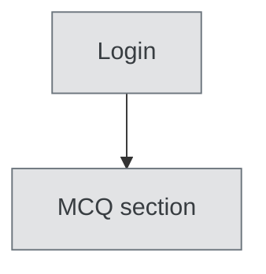
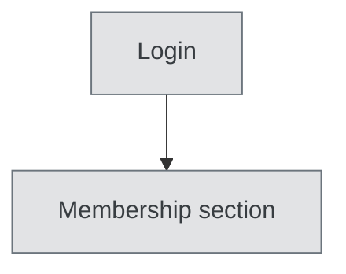

# Data Entry — User Journey

**Landing dashboard:** `/sahodaya-admin/{tenant_id}` → `DashboardController::index`
**Scope:** Holds `fest.view`, `fest.manage`, `fest.marks`. The intended scope is marks entry, but the extra `fest.manage` grant also makes Registrations/Results/Certificates/Catering nav-visible — broader than "data entry" implies. Writes on those pages remain correctly gated server-side by their own specific permission strings, so this is a nav-clutter issue, not an access breach. MCQ and Membership are entirely out of scope.

## Kalotsav / Kids Fest / Teacher Fest / Custom Events (identical pattern)

| Stage | Menu path | Route | Status | Note |
|---|---|---|---|---|
| Login | Sahodaya dashboard | `/sahodaya-admin/{tenant_id}` | ✅ | |
| Onboarding/setup | Fest section visible | `fest.view` | ✅ | |
| Registration/enrollment | Registrations tab | nav-visible via `fest.manage`, writes still gated by `fest.registrations` | ⚠️ | Broader nav visibility than role implies, but no actual write-access breach |
| Configuration | Schedule/Settings | requires `fest.schedule`/`fest.settings` specifically (not granted) | 🚫 | Correctly excluded |
| Execution | Marks tab / Marks import | `fest.marks` — matches FEST_MARKS | ✅ | |
| Review/approval | Results review workflow | nav-visible via `fest.manage`, writes gated separately | ⚠️ | Nav-visible but not the intended action for this role |
| Publishing/results | Results tab | nav-visible via `fest.manage`, writes still gated by `fest.results` | ⚠️ | Broader nav visibility than role implies |
| Post-result | Certificates / Catering | nav-visible via `fest.manage`, writes still gated by `fest.certificates` | ⚠️ | Broader nav visibility than role implies |

**Known issues:**
- The `fest.manage` grant makes Registrations, Results, Certificates, and Catering tabs nav-visible even though this role is intended to be marks-entry only. Writes on those pages are still correctly gated server-side by their own specific permission strings, so this is a nav-clutter/over-broad-visibility issue, not an actual access breach.

## Sports Meet

| Stage | Menu path | Route | Status | Note |
|---|---|---|---|---|
| Login | Sahodaya dashboard | `/sahodaya-admin/{tenant_id}` | ✅ | |
| Onboarding/setup | Fest section visible | `fest.view` | ✅ | |
| Registration/enrollment | Registrations tab | nav-visible via `fest.manage` | ⚠️ | Broader than role implies |
| Configuration | Schedule/Settings | requires `fest.schedule`/`fest.settings` (not granted) | 🚫 | Correctly excluded |
| Execution | Marks tab | `fest.marks` | ✅ | |
| Execution (import) | Marks import | Sports Meet's separate sidebar | ⚠️ | Missing on Sports Meet's dedicated sidebar specifically — works for the other four event types |
| Review/approval | Results review | nav-visible via `fest.manage` | ⚠️ | Broader than role implies |
| Publishing/results | Results tab | nav-visible via `fest.manage` | ⚠️ | Broader than role implies |
| Post-result | Certificates / Catering | nav-visible via `fest.manage` | ⚠️ | Broader than role implies |

**Known issues:**
- Marks import is missing specifically from Sports Meet's separate sidebar — it works correctly for the other four event types (Kalotsav, Kids Fest, Teacher Fest, Custom Events).
- Same nav-clutter issue as other fest types: `fest.manage` over-exposes Registrations/Results/Certificates/Catering tabs.

## MCQ Exams

| Stage | Menu path | Route | Status | Note |
|---|---|---|---|---|
| All stages | MCQ section | requires `mcq.view`/`mcq.marks` (not granted) | 🚫 | Hidden entirely |

**Known issues:** None (expected — not applicable).

## Membership

| Stage | Menu path | Route | Status | Note |
|---|---|---|---|---|
| All stages | Membership section | requires `membership.view` (not granted) | 🚫 | Hidden entirely |

**Known issues:** None (expected — not applicable).

---
## Summary for this role
Data Entry works correctly for its core purpose — marks entry — across all five fest types, with Marks import missing only on Sports Meet's dedicated sidebar. The more systemic issue is that the `fest.manage` grant (needed to make marks entry work at all in the current permission model) also nav-exposes Registrations, Results, Certificates, and Catering tabs, which is broader visibility than "data entry" implies. This is not an access breach since writes on those pages remain gated by their own specific permissions server-side, but it is confusing UX. The single biggest actionable fix: add Marks import to the Sports Meet sidebar, and consider splitting a narrower "marks-only" permission bundle so this role doesn't need the broad `fest.manage` grant just to see the Marks tab.
