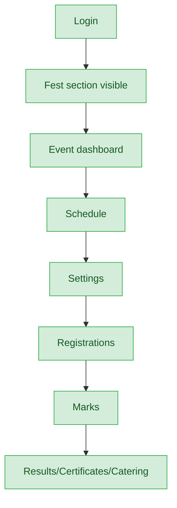
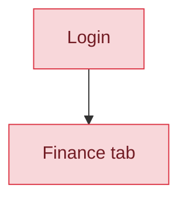
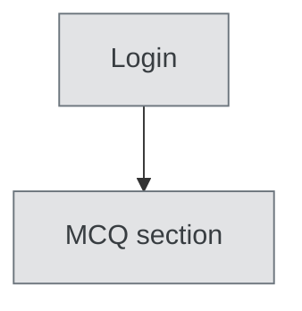
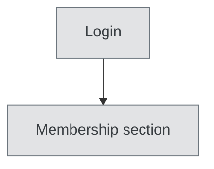

# Event Coordinator — User Journey

**Landing dashboard:** `/sahodaya-admin/{tenant_id}` → `DashboardController::index`
**Scope:** Holds `fest.view`, `fest.manage`, `fest.schedule`, `fest.settings`. `fest.manage` alone satisfies 6 of 8 FEST_* nav bundles, giving broad fest execution/scheduling authority across all fest event types — but Finance is correctly excluded (requires `fest.finance` specifically), and MCQ/Membership are entirely out of scope (no view permission for either).

## Kalotsav / Sports Meet / Kids Fest / Teacher Fest / Custom Events (same pattern for all fest types)

| Stage | Menu path | Route | Status | Note |
|---|---|---|---|---|
| Login | Sahodaya dashboard | `/sahodaya-admin/{tenant_id}` | ✅ | |
| Onboarding/setup | Fest section visible / Event dashboard | `fest.view` | ✅ | |
| Registration/enrollment | Registrations | `fest.manage` satisfies this bundle | ✅ | |
| Configuration | Settings | `fest.settings` | ✅ | |
| Execution | Schedule / Marks / Catering | `fest.schedule`, `fest.manage` | ✅ | |
| Review/approval | Results review workflow | `fest.manage` | ✅ | |
| Publishing/results | Results | `fest.manage` satisfies this bundle | ✅ | |
| Post-result | Certificates | `fest.manage` satisfies this bundle | ✅ | |

**Known issues:**
- Finance is intentionally excluded across all fest types: `fest.manage` does NOT satisfy the Finance permission bundle, which correctly requires `fest.finance` specifically. This exclusion is also write-blocked server-side, so it's a correctly-enforced boundary, not a gap.

## Finance (explicitly excluded, all fest types)

| Stage | Menu path | Route | Status | Note |
|---|---|---|---|---|
| Finance tab | Finance | requires `fest.finance` (not granted; `fest.manage` does not substitute) | ❌ | Correctly excluded — server-side write is also blocked |

**Known issues:**
- Not a bug: this is the one deliberately excluded stage for this role, correctly enforced both in the nav and server-side.

## MCQ Exams

| Stage | Menu path | Route | Status | Note |
|---|---|---|---|---|
| All stages | MCQ section | requires `mcq.view` (not granted) | 🚫 | Hidden entirely — not applicable to this role |

**Known issues:** None (expected — not applicable).

## Membership

| Stage | Menu path | Route | Status | Note |
|---|---|---|---|---|
| All stages | Membership section | requires `membership.view` (not granted) | 🚫 | Hidden entirely — not applicable to this role |

**Known issues:** None (expected — not applicable).

---
## Summary for this role
Event Coordinator is complete for fest-event execution and scheduling across all five fest types (Kalotsav, Sports Meet, Kids Fest, Teacher Fest, Custom Events) — dashboard, schedule, settings, registrations, marks, results, and certificates all work correctly via the `fest.manage`/`fest.schedule`/`fest.settings` grants. Finance is correctly and deliberately excluded (needs `fest.finance` specifically, both in nav and server-side enforcement). MCQ and Membership are out of scope by design (no view permission). No actionable fix needed — this role is working as intended.
