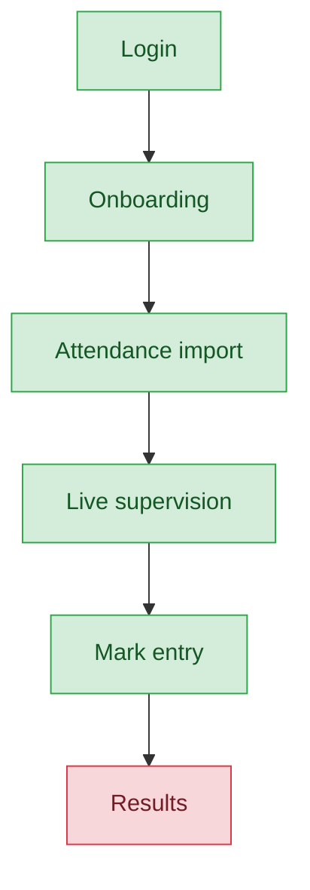
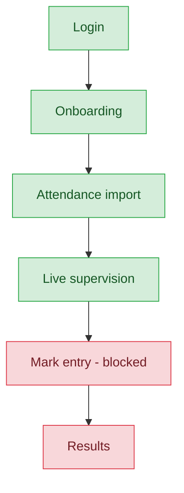

# Exam Controller & Exam Staff — User Journey

**Landing dashboard:** `ExamOpsController::index`, via `AuthController::homeFor()` → `/portal/exam/{tenant_id}` (same landing for both roles)
**Scope:** Both roles run MCQ exam-day operations (attendance import, live supervision). Only `exam_controller` may enter/edit marks server-side; `exam_staff` is blocked from mark entry despite the nav showing the link to both roles. Neither role can see published results — no results/ranklist view exists anywhere in the exam portal.

## exam_controller

| Stage | Menu path | Route | Status | Note |
|---|---|---|---|---|
| Login | Portal login | `/portal/exam/{tenant_id}` | ✅ | |
| Onboarding | Dashboard welcome | `ExamOpsController::index` | ✅ | |
| Registration | — | — | 🚫 | Staff assignment is Sahodaya-tier |
| Configuration | — | — | 🚫 | Not an exam_controller action |
| Execution — Attendance | Attendance import | bulk CSV import | ✅ | |
| Execution — Supervision | Live status view | total/present/started/submitted/absent | ✅ | |
| Review/Approval — Mark entry | Mark entry | `ExamOpsController::marks` / `storeMark` | ✅ | Allowed for exam_controller |
| Publishing/Results | Results/ranklist | — | ❌ | No results/ranklist Vue page exists anywhere under Portal/Exam/* (only Attendance, Dashboard, MarkEntry, Supervision exist) |
| Post-result | — | — | 🚫 | |

**Known issues:**
- No in-portal results/ranklist view exists for exam_controller after mark entry is complete.

## exam_staff

| Stage | Menu path | Route | Status | Note |
|---|---|---|---|---|
| Login | Portal login | `/portal/exam/{tenant_id}` | ✅ | Same landing as exam_controller |
| Onboarding | Dashboard welcome | `ExamOpsController::index` | ✅ | |
| Registration | — | — | 🚫 | Staff assignment is Sahodaya-tier |
| Configuration | — | — | 🚫 | Not an exam_staff action |
| Execution — Attendance | Attendance import | bulk CSV import | ✅ | Same as exam_controller |
| Execution — Supervision | Live status view | total/present/started/submitted/absent | ✅ | Same as exam_controller |
| Review/Approval — Mark entry | "Mark entry" nav link | `ExamOpsController::marks` / `storeMark` | ❌ | Blocked server-side via `abort_unless`, but `examPortalNav.js` shows the link unconditionally — exam_staff sees a menu item that 403s if clicked. Nav/permission mismatch. |
| Publishing/Results | Results/ranklist | — | ❌ | Same missing view as exam_controller — compounds the dead end, since exam_staff can't even enter marks in the first place |
| Post-result | — | — | 🚫 | |

**Known issues:**
- Nav/permission mismatch: `examPortalNav.js` shows "Mark entry" to `exam_staff` unconditionally even though `ExamOpsController::marks`/`storeMark` block the role server-side via `abort_unless` — clicking the link produces a 403.
- Same missing results/ranklist view as exam_controller, compounding the dead end for exam_staff.

---
## Summary for this role

Attendance and supervision are solid and identical for both roles. The exam_controller journey works through mark entry but hits a wall at Publishing/Results — no results view exists anywhere in the exam portal, so controllers who finish entering marks have no in-portal way to see the outcome. exam_staff has it worse: the nav shows a "Mark entry" link that will always 403, a clear and easily-fixable nav/permission mismatch. The two most actionable fixes are (1) hide the Mark entry nav item from exam_staff, and (2) build a results/ranklist view for the exam portal so mark-entry work has a visible payoff.
