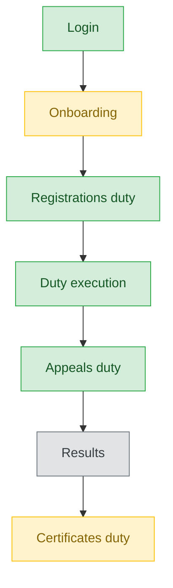

# Fest Ops — User Journey

**Landing dashboard:** `FestEventOpsController::index`, via `AuthController::homeFor()` → `/portal/fest-ops/{tenant_id}`
**Scope:** Event-day operations role covering all duty types (stage, attendance, kitchen, discipline/admit-card, mark-entry, appeals, gate check, certificates) across Kalotsav, Sports Meet, Kids Fest, and Teacher Fest; event configuration and results-publishing remain Sahodaya-tier actions.

## Kalotsav / Sports Meet / Kids Fest / Teacher Fest (Event-Day Operations)

| Stage | Menu path | Route | Status | Note |
|---|---|---|---|---|
| Login | Portal login | `/portal/fest-ops/{tenant_id}` | ✅ | |
| Onboarding | Dashboard welcome | `FestEventOpsController::index` | ⚠️ | Welcome text is generic/duty-agnostic — known minor gap |
| Registration | Registrations duty (gated) | bulk-approve/reject/cancel/substitute | ✅ | Fee-gate enforced |
| Configuration | — | — | 🚫 | Event setup is Sahodaya-tier |
| Execution — Stage duty | Stage duty | reorder, mark-called, scoped via `assignedStageIds()` | ✅ | Finest-grained access control of any portal role |
| Execution — Attendance duty | Attendance duty | — | ✅ | |
| Execution — Kitchen duty | Kitchen duty | — | ✅ | |
| Execution — Discipline/Admit-card duty | Participant search | — | ✅ | "discipline" and "admit_cards" duty keys both map to the same participants/search page — confusing labeling, not broken |
| Execution — Mark-entry duty | Mark entry | reuses same Vue component as mark_entry_coordinator | ✅ | Good code reuse |
| Execution — Gate Check duty | QR/photo verification at entry | — | ✅ | Camera/photo gaps already fixed per a prior audit |
| Review/Approval | Appeals duty | view + resolve | ✅ | |
| Publishing/Results | Results | — | 🚫 | fest_ops doesn't toggle `results_published` — Sahodaya-tier action; no read-only preview exists either (minor nice-to-have gap) |
| Post-result | Certificates duty | lists generated certs | ⚠️ | Known gap: no bulk-print/download-all option |

**Known issues:**
- Onboarding welcome text is generic/duty-agnostic rather than tailored to the ops's assigned duties (minor).
- "discipline" and "admit_cards" duty keys both route to the same participants/search page — cosmetically confusing labeling, not a functional bug.
- No read-only results preview available to fest_ops before/around publishing (minor nice-to-have).
- Certificates duty has no bulk-print/download-all option — known gap.

---
## Summary for this role

Fest Ops is the most operationally complete portal role: every event-day duty (stage, attendance, kitchen, discipline/admit-card, mark-entry, gate check, appeals, certificates) is wired and working, with the Stage duty offering the finest-grained access control in the portal tier and Mark-entry duty showing good code reuse from mark_entry_coordinator. The gaps are all minor polish items — a generic onboarding message, confusing duty-key labeling, no results preview, and no bulk certificate download — rather than functional breaks. The most actionable fix is adding bulk-print/download-all to the Certificates duty, since that's the one gap operators are likely to hit on every single event.
