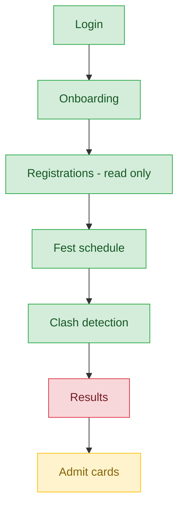

# Group Admin — User Journey

**Landing dashboard:** `GroupAdminController::index`, via `AuthController::homeFor()` → `/portal/group/{tenant_id}`
**Scope:** Oversees a set of assigned class-groups across Sports Meet and Kalotsav — read-only registrations view, schedule visibility, and clash detection for assigned-class students; no configuration and, critically, no results view exists at all.

## Sports Meet / Kalotsav (Class-Group Oversight)

| Stage | Menu path | Route | Status | Note |
|---|---|---|---|---|
| Login | Portal login | `/portal/group/{tenant_id}` | ✅ | |
| Onboarding | Dashboard welcome | `GroupAdminController::index` | ✅ | |
| Registration | Fest registrations (read-only) | scoped to assigned classes via `assignedClassIds()` | ✅ | |
| Configuration | — | — | 🚫 | Not a group_admin action |
| Execution | Fest schedule | schedule view | ✅ | |
| Review/Approval | Clash detection | for assigned-class students | ✅ | |
| Publishing/Results | Results | — | ❌ | **No Results nav item AND no controller method exists** — `GroupAdminController` has no `festResults`/`festCertificates` method at all. Clearest missing-stage finding in the whole portal-tier audit. |
| Post-result | Admit cards | — | ⚠️ | Works, but is conceptually a pre-event artifact, not a real "post-result" stage — no certificates exist either |

**Known issues:**
- `GroupAdminController` has no results or certificates method whatsoever — group admins have zero visibility into fest outcomes for the classes they oversee.

---
## Summary for this role

Registration visibility, scheduling, and clash detection all work well and are correctly scoped to assigned classes. The Publishing/Results stage is a hard break, not a minor gap: there is no nav item and no controller method for results or certificates anywhere in `GroupAdminController`. This is especially conspicuous next to `house_admin`, which has a working results-equivalent view (House Ranking) for its own scope — group_admin has no equivalent at all. Adding a results view scoped to assigned classes is the single most actionable and highest-impact fix identified for this role.
