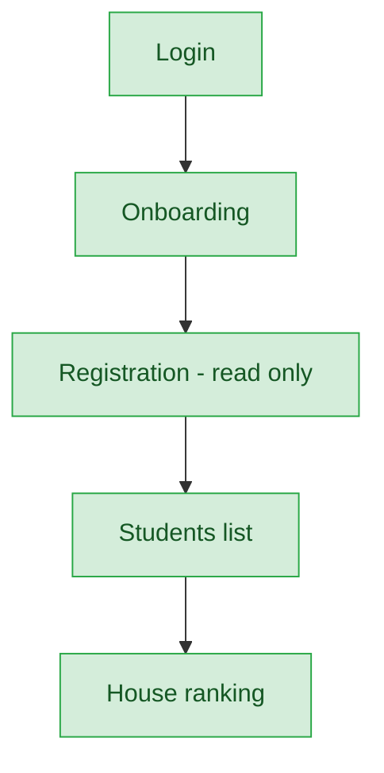

# House Admin — User Journey

**Landing dashboard:** `HouseAdminController::index`, via `AuthController::homeFor()` → `/portal/house-admin/{tenant_id}`
**Scope:** Manages a single house's participation in the Sports Meet house-points system — read-only student list and a House Ranking view; no approval powers and no house-level certificates (individual student certificates are handled in the student's own portal).

## Sports Meet (House-Points System)

| Stage | Menu path | Route | Status | Note |
|---|---|---|---|---|
| Login | Portal login | `/portal/house-admin/{tenant_id}` | ✅ | |
| Onboarding | Dashboard welcome | `HouseAdminController::index` | ✅ | |
| Registration | Registrations (read-only) | scoped to `resolveHouse()` | ✅ | |
| Configuration | — | — | 🚫 | Not a house_admin action |
| Execution | Students list | scoped to house | ✅ | |
| Review/Approval | — | — | 🚫 | house_admin doesn't approve/reject — school/Sahodaya tier does |
| Publishing/Results | House Ranking | `SchoolHouseFestPointsService::rankingForSchool()` | ✅ | Doubles as the results view for this role |
| Post-result | Certificates | — | 🚫 | No house-level certificate; individual student certs covered under the student's own portal — correct by design |

**Known issues:**
- None found.

---
## Summary for this role

The house_admin journey is compact and functionally complete for its narrow scope: registration visibility, student list, and House Ranking together give a full picture of house standing, with the ranking view correctly doubling as the results stage. Absence of a house-level certificate is by design, since individual certificates already live in the student portal. No gaps or actionable fixes identified — this role stands in useful contrast to group_admin, which has no results view at all despite a similar oversight scope.
