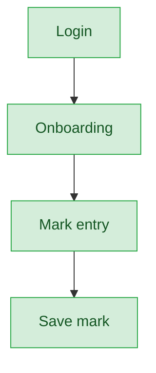

# Judge — User Journey

**Landing dashboard:** `JudgeDashboardController::index`, via `AuthController::homeFor()` → `/portal/judge/{tenant_id}`
**Scope:** Judges score assigned items for Kalotsav, Kids Fest, and Teacher Fest only — they are assigned by the Sahodaya admin (not self-enrolled), never publish results, and are explicitly excluded from Sports Meet scoring. Portal is shared at the middleware level with `mark_entry_admin`/`mark_entry_coordinator`/`sahodaya_admin` (`EnsureJudgePortal::ALLOWED_ROLES`).

## Kalotsav / Kids Fest / Teacher Fest (Scoring)

| Stage | Menu path | Route | Status | Note |
|---|---|---|---|---|
| Login | Portal login | `/portal/judge/{tenant_id}` | ✅ | Shared portal middleware (`EnsureJudgePortal`) |
| Onboarding | Dashboard welcome | `JudgeDashboardController::index` | ✅ | |
| Registration | — | — | 🚫 | Judges are assigned by Sahodaya admin, not self-enrolled |
| Configuration | — | — | 🚫 | Not a judge action |
| Execution | Mark entry per assigned event | `JudgeDashboardController::marks` | ✅ | |
| Review/Approval | Save mark | `FestMarkEntryScopeService::judgeItemIds` | ✅ | Item-scoped server-side (addresses a previously-known gap); grade is enum-validated A/A+/B/C, not free text (previously-known UX bug, already fixed) |
| Publishing/Results | — | — | 🚫 | Judge doesn't publish; Sahodaya-tier action |
| Post-result | — | — | 🚫 | |

**Known issues:**
- None found — the item-scoping and grade-enum validation issues noted in earlier audits are already fixed.

## Sports Meet

Not applicable — sports scoring is handled by Mark Entry Coordinator / Fest Ops instead. `JudgeDashboardController::marks` explicitly 404s if `event_type==='sports'`; this is by design, not a bug.

---
## Summary for this role

The judge journey is tight and correctly scoped: assignment happens upstream at the Sahodaya tier, mark entry is item-scoped server-side, and grade validation uses a proper enum. No gaps found for Kalotsav/Kids Fest/Teacher Fest scoring. Sports Meet is a clean, intentional exclusion rather than a missing feature. No actionable fixes identified for this role in this pass.
