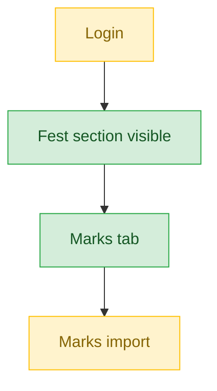
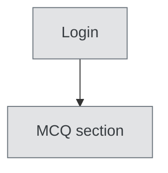

# Mark Entry Admin — User Journey

**Landing dashboard:** `/sahodaya-admin/{tenant_id}` → `DashboardController::index` (via a bug — see note below)
**Scope:** Holds `fest.view`, `fest.marks` — the cleanest marks-only scope alongside Certificate Collector. Does NOT get `fest.manage`, so unlike Data Entry there's no nav-bleed into other tabs. The real defect for this role is in login routing/identity, not in its permission scope.

> **Login routing bug note:** `AuthController::homeFor()` has a bug where the if-chain at line 383-392 matches `mark_entry_admin` FIRST and sends it to `/sahodaya-admin/{tenant_id}` — this is the REAL, working landing. A second check later in the same method that would send it to `/portal/fest-coordinator/{tenant_id}` can never execute (dead code) because PHP's early-return if-chain already matched. This is flagged as a bug to fix (remove the misleading dead-code reference), not a real user-facing block — the user does land somewhere functional.

## Kalotsav / Sports Meet / Kids Fest / Teacher Fest / Custom Events (identical pattern)

| Stage | Menu path | Route | Status | Note |
|---|---|---|---|---|
| Login | Sahodaya-admin dashboard | `AuthController::homeFor()` matches `mark_entry_admin` at line 383-392 → `/sahodaya-admin/{tenant_id}` | ⚠️ | Lands correctly on the Sahodaya-admin dashboard; a dead code path elsewhere in `AuthController` incorrectly suggests it should land in `/portal/fest-coordinator/{tenant_id}` instead — flagged as a bug to fix (remove the misleading reference), not a real user-facing block |
| Onboarding/setup | Fest section visible | `fest.view` | ✅ | |
| Registration/enrollment | 🚫 | requires `fest.registrations` (not granted) | 🚫 | Correctly excluded — no `fest.manage`, so no nav-bleed |
| Configuration | 🚫 | requires `fest.schedule`/`fest.settings` (not granted) | 🚫 | Correctly excluded |
| Execution | Marks tab / Marks import | `fest.marks` — exact match | ✅ | Marks import works for these four event types |
| Review/approval | 🚫 | requires `fest.manage` (not granted) | 🚫 | Correctly excluded |
| Publishing/results | 🚫 | requires `fest.results` (not granted) | 🚫 | Correctly excluded |
| Post-result | 🚫 | requires `fest.certificates` (not granted) | 🚫 | Correctly excluded |

**Known issues:**
- The `AuthController::homeFor()` login routing bug (see note above) — cosmetic/dead-code issue, not user-facing.

## Sports Meet

| Stage | Menu path | Route | Status | Note |
|---|---|---|---|---|
| Login | Sahodaya-admin dashboard | `AuthController::homeFor()` → `/sahodaya-admin/{tenant_id}` | ⚠️ | Same routing bug as above — lands correctly regardless |
| Onboarding/setup | Fest section visible | `fest.view` | ✅ | |
| Registration/enrollment | 🚫 | requires `fest.registrations` (not granted) | 🚫 | Correctly excluded |
| Configuration | 🚫 | requires `fest.schedule`/`fest.settings` (not granted) | 🚫 | Correctly excluded |
| Execution | Marks tab | `fest.marks` — exact match | ✅ | |
| Execution (import) | Marks import | Sports Meet's separate sidebar | ⚠️ | Missing on Sports sidebar specifically — same gap as Data Entry |
| Review/approval | 🚫 | requires `fest.manage` (not granted) | 🚫 | Correctly excluded |
| Publishing/results | 🚫 | requires `fest.results` (not granted) | 🚫 | Correctly excluded |
| Post-result | 🚫 | requires `fest.certificates` (not granted) | 🚫 | Correctly excluded |

**Known issues:**
- Marks import missing from Sports Meet's dedicated sidebar (same gap noted for Data Entry) — works correctly for the other four event types.

## MCQ Exams

| Stage | Menu path | Route | Status | Note |
|---|---|---|---|---|
| All stages | MCQ section | requires `mcq.view`/`mcq.marks` (not granted) | 🚫 | Hidden entirely |

**Known issues:** None (expected — not applicable).

---
## Summary for this role
Mark Entry Admin is the cleanest-scoped marks role together with Certificate Collector: `fest.marks` gives exact-match access to the Marks tab across all five fest types with no nav-bleed into other tabs (unlike Data Entry, since this role lacks `fest.manage`). The only functional gap is Marks import missing from the Sports Meet sidebar. The role's actual defect isn't its permission scope — it's identity/routing: `AuthController::homeFor()` contains a dead code path that incorrectly implies this role should land in a portal view. The single biggest actionable fix: clean up `AuthController::homeFor()` to remove the misleading dead-code reference to `/portal/fest-coordinator/{tenant_id}`, and add Marks import to the Sports Meet sidebar.
