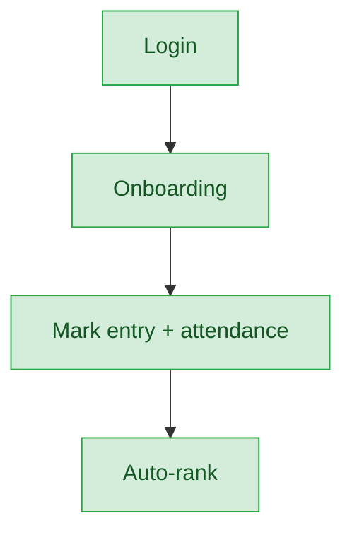

# Mark Entry Coordinator — User Journey

**Landing dashboard:** `FestMarkCoordinatorController::index`, via `AuthController::homeFor()` → `/portal/fest-coordinator/{tenant_id}`
**Scope:** Coordinates mark entry (including attendance and sports-specific rank points) for fest items assigned at the Sahodaya tier; never assigns events, never publishes results.

> **Bug callout — `mark_entry_admin` dead-code reference:**
> The same `homeFor()` check that grants the `/portal/fest-coordinator/{tenant_id}` landing also lists `mark_entry_admin` as an allowed role, but `mark_entry_admin` can **never** actually reach this landing in practice. An earlier, unrelated check inside `AuthController::homeFor()` (lines 383–392) matches `mark_entry_admin` **first** and routes it to the Sahodaya-admin dashboard instead — because PHP's if-chain returns early, the fest-coordinator check is never reached for that role. So this file documents the journey for `mark_entry_coordinator` only. `mark_entry_admin`'s real journey is documented separately in the Sahodaya-tier `mark-entry-admin.md` file. **This should be flagged as a bug:** the `mark_entry_admin` reference in the fest-coordinator branch of `homeFor()` is dead/misleading code and should be removed.

## Sports Meet (and other fest types generically)

| Stage | Menu path | Route | Status | Note |
|---|---|---|---|---|
| Login | Portal login | `/portal/fest-coordinator/{tenant_id}` | ✅ | Correct landing for `mark_entry_coordinator` |
| Onboarding | Dashboard welcome | "you coordinate mark entry for assigned fest items" | ✅ | |
| Registration | — | — | 🚫 | Event assignment done at Sahodaya tier |
| Configuration | — | — | 🚫 | Not a coordinator action |
| Execution | Mark entry per assigned event/item-head | includes attendance + sports rank points via `FestRankPointService` | ✅ | |
| Review/Approval | Attendance + auto-rank | `autoRankItem`, gated sports-only | ✅ | |
| Publishing/Results | — | — | 🚫 | Coordinator doesn't publish; Sahodaya-tier action |
| Post-result | — | — | 🚫 | |

**Known issues:**
- `mark_entry_admin` reference in the `homeFor()` fest-coordinator check is dead code (see callout above) — should be removed for clarity, even though it causes no functional harm today because the earlier check intercepts first.

---
## Summary for this role

The mark_entry_coordinator journey itself is solid: onboarding, mark entry, attendance, and sports auto-ranking all work as designed, with registration and publishing correctly deferred to the Sahodaya tier. The one actionable item isn't a functional break but a code-cleanliness bug — the dead `mark_entry_admin` reference in the same `homeFor()` branch should be removed to avoid confusing future maintainers, since that role is actually handled entirely elsewhere.
