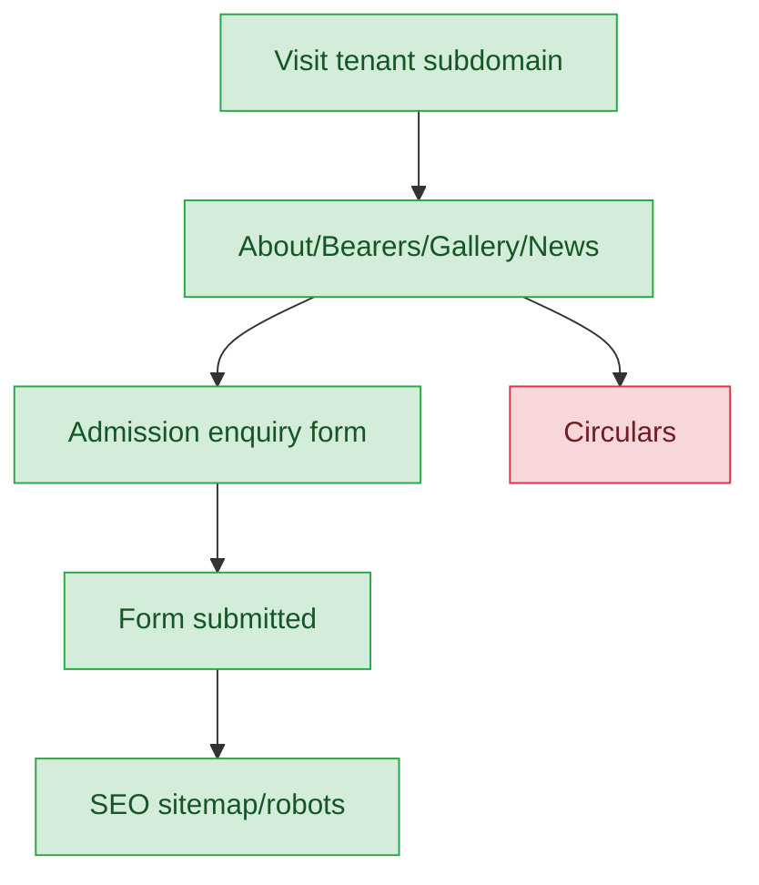
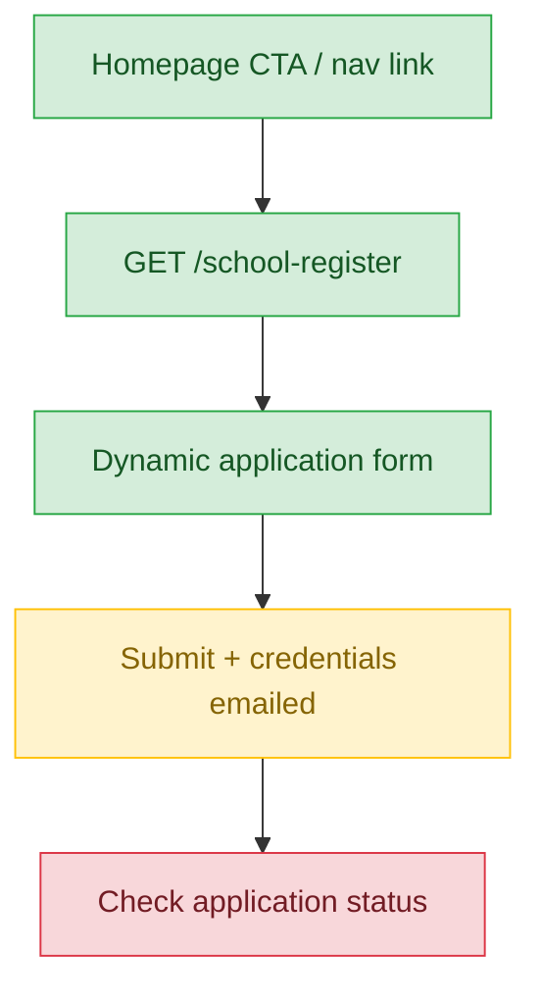
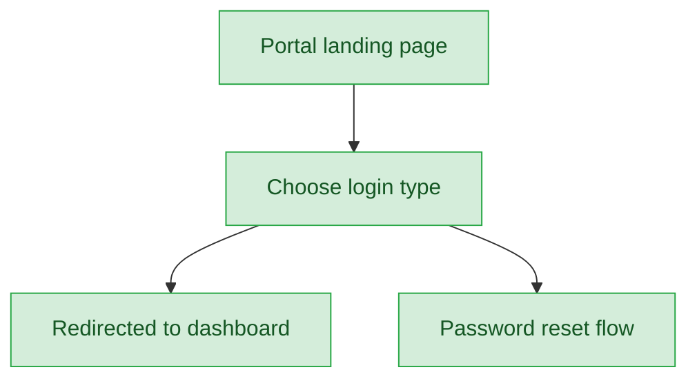
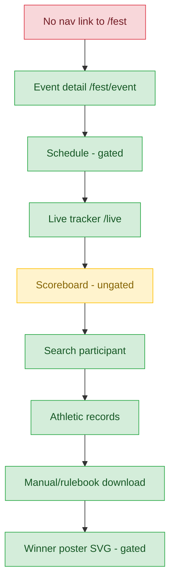
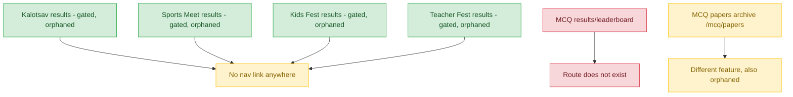
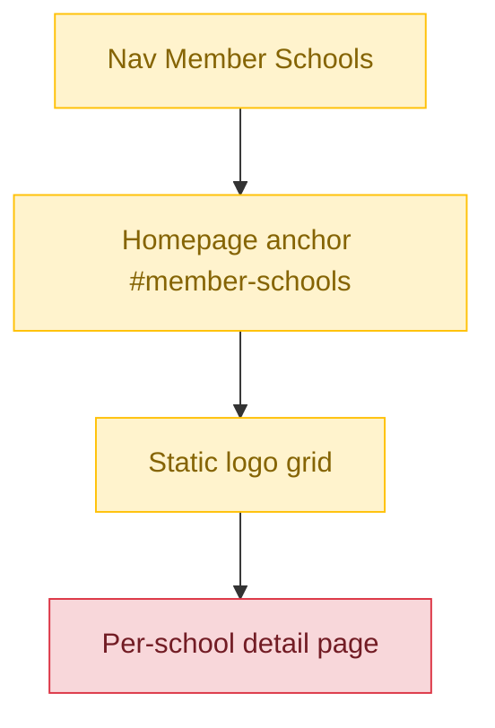

# Public / Unauthenticated Journeys

**Note:** every public route in this app renders a classic Blade view, never a Vue/Inertia page — this is architecturally intentional (marketing/verification pages don't need SPA behavior).

## 1. Sahodaya/School Public Website



| Stage | Route | Status | Note |
|---|---|---|---|
| Discovery | `GET /` (tenant subdomain) | ✅ | Loads homepage, gated behind `website.enabled` + `public.website.enabled` tenant toggle |
| Content/Info | About / Office Bearers / Gallery / News pages | ✅ | Same tenant toggle gate applies |
| Content/Info | Circulars | ❌ | No public equivalent exists at all — both Sahodaya and School circular controllers are authenticated-only; a visitor can never see a published circular |
| Action | Admission enquiry form submission | ✅ | Works as expected |
| Post-action | SEO sitemap / robots | ✅ | Present and functional |

**Known issues:**
- Circulars have no public-facing route or view whatsoever (Sahodaya-level and School-level both require auth), so published circulars are invisible to the general public despite otherwise being a public-facing content type.

## 2. School-Application / Join-a-Sahodaya Flow



| Stage | Route | Status | Note |
|---|---|---|---|
| Discovery | Homepage "School Registration" CTA / nav "Membership Renewal" → `GET /school-register` | ✅ | Reachable via clear entry points |
| Content/Info | Dynamic application form | ✅ | Fields configurable per-Sahodaya |
| Action | `POST /school-register` (throttled 10/min) | ⚠️ | Creates Tenant (school, `membership_status='pending'`) + User (role `school_admin`), and **emails login credentials immediately**, before any Sahodaya approval |
| Data/Result | Check application status | 🚫 / ❌ | No public "check my application status" page exists at all — applicant can only infer approval by attempting to log in with the emailed credentials |
| Post-action | Admin approval queue | ✅ | Correctly authenticated-only, handled by Sahodaya-admin approval queue |

**Known issues:**
- Credentials are issued and emailed **before** Sahodaya approval, inverting the expected trust order (approve → then credential). Recommend a follow-up check confirming `membership_status='pending'` actually locks down dashboard functionality for a not-yet-approved school — this was not verified in this pass.
- No public application-status-check page exists; the only feedback loop is trying to log in.

## 3. Portal Landing / Login / Password-Reset Pages



| Stage | Route | Status | Note |
|---|---|---|---|
| Discovery | `/portal` (landing page with role cards) | ✅ | No accidental double-gating |
| Action | `/login`, `/school-login`, `/portal/login`, `/portal/s/{schoolCode}/login` (branded per-school login) | ✅ | All correctly public |
| Action | Forgot-password, reset-password | ✅ | Correctly public |
| Post-action | Signed email-verification link | ✅ | Correctly public |
| Post-action | Redirect to role-appropriate dashboard | ✅ | Works as expected |

**Known issues:** None found.

## 4. Event Schedules & Results Discovery (Kalotsav / Sports Meet / Kids Fest / Teacher Fest)



| Stage | Route | Status | Note |
|---|---|---|---|
| Discovery | `/fest` (public index) | ❌ | No default nav link anywhere points here — fully orphaned, reachable only via direct/shared URL |
| Content/Info | `/fest/{event}` (detail) | ✅ | Works once reached |
| Content/Info | `/fest/{event}/schedule` | ✅ | Gated on schedule-publish flag |
| Data/Result | `/live` (live tracker) | ✅ | No gate |
| Data/Result | `/scoreboard` | ⚠️ | **No `results_published` check — always visible**, inconsistent with the official `/results` page which IS gated |
| Data/Result | `/search` (participant search) | ✅ | Privacy-gated |
| Data/Result | `/records` (athletic records) | ✅ | Works as expected |
| Action | Manual/rulebook download | ✅ | Works as expected |
| Post-action | Winner poster SVG | ✅ | Top-3 only, gated on `results_published` |

**Known issues:**
- `/fest` index has no nav entry anywhere — built but fully orphaned.
- Gating inconsistency: `/scoreboard` shows live/interim scores with no `results_published` check, while the "official" `/fest/{event}/results` page is correctly gated — a visitor can see scores early through one URL while the official one is still locked. This applies identically across all four event types (Kalotsav, Sports Meet, Kids Fest, Teacher Fest), since they share the same `FestEvent` model and `FestPortalController`.

## 5. Event Results per Type + MCQ



| Stage | Route | Status | Note |
|---|---|---|---|
| Data/Result | Kalotsav — `/fest/{event}/results`, `/fest/{event}/items/{item}/results`, results PDF, winner posters | ✅ (orphaned) | Fully built, correctly gated on `results_published`, but no nav link anywhere |
| Data/Result | Sports Meet — same route set | ✅ (orphaned) | Same as above |
| Data/Result | Kids Fest — same route set | ✅ (orphaned) | Same as above |
| Data/Result | Teacher Fest — same route set | ✅ (orphaned) | Same as above |
| Data/Result | MCQ Exam results/leaderboard | ❌ | **No route stub exists at all** — not merely admin-only, a full absence |
| Content/Info | `/mcq/papers` (question-paper archive) | ⚠️ | A different feature entirely (archived papers, not results); also orphaned, no nav link |

**Known issues:**
- All four fest event types have fully built, correctly-gated results pages, but zero discoverability — no nav link anywhere.
- MCQ has no public results/leaderboard route at all, a true absence rather than an access-control gap.
- `/mcq/papers` is unrelated to results and is itself orphaned.

## 6. Public School Directory



| Stage | Route | Status | Note |
|---|---|---|---|
| Discovery | Nav "Member Schools" → `/#member-schools` | ⚠️ | In-page anchor on homepage, not a real route; only appears if the Sahodaya opted this section into their homepage layout — not guaranteed present |
| Content/Info | Static logo grid | ⚠️ | Name + logo only, via `SahodayaPublicData::memberSchools()`; unlinked (no click-through) |
| Data/Result | Per-school detail page | ❌ | No per-school click-through/detail page exists anywhere |
| Data/Result | Search/filter | ❌ | No search or filter capability |

**Known issues:**
- The public directory is a thin, static, unlinked logo grid compared to the authenticated Sahodaya-admin equivalent (`MemberSchoolsController`), which has full search, export, and detail views. The public version has none of that depth.
- Entire section is conditionally present depending on homepage layout configuration.

## 7. Certificate Verification

```mermaid
flowchart TD
    A[Scan QR on printed certificate] --> B[/certificates/verify/uuid]
    B --> C[View authenticity + details]
    C --> D[Print view]

    classDef ok fill:#d4edda,stroke:#28a745,color:#155724
    classDef warn fill:#fff3cd,stroke:#ffc107,color:#856404
    classDef broken fill:#f8d7da,stroke:#dc3545,color:#721c24
    classDef na fill:#e2e3e5,stroke:#6c757d,color:#383d41

    class A ok
    class B ok
    class C ok
    class D ok
```

| Stage | Route | Status | Note |
|---|---|---|---|
| Discovery | Scan QR code on printed certificate | ✅ | Not a menu link by design — intentional "scan to verify" UX, correctly not treated as an orphan |
| Data/Result | `/certificates/verify/{uuid}` | ✅ | Shows authenticity + details (name/event/position), no auth required, works independent of the `website.enabled` toggle chain that gates almost everything else |
| Action | `/certificates/print/{uuid}` (print view) | ✅ | Works as expected |

**Known issues:** None found. This is the one fully clean, always-on public journey found in the entire audit.

---
## Summary

Across the seven public journeys audited, the platform's biggest weakness is not broken functionality but poor discoverability: `/fest` (the event index), `/fest/{event}/schedule`, `/fest/{event}/results`, and `/mcq/papers` are all fully built and correctly gated, yet none are linked from any navigation — a cheap fix (just add nav entries) would recover most of this surface. A smaller set of genuine absences remain: there is no public circulars page (Sahodaya or School level), no public MCQ results/leaderboard route at all, no application-status-check page for prospective schools, and no per-school detail pages in the public directory. Two issues deserve closer engineering attention rather than a simple link fix: the scoreboard-vs-results gating inconsistency (live scores are visible with no `results_published` check while the official results page is properly gated, across all four fest event types), and the school-application flow's practice of emailing login credentials before Sahodaya approval, which inverts the expected trust order and should be paired with a check that pending schools are actually locked out of meaningful dashboard actions. Certificate verification stands out as the one journey with zero issues found — a clean, always-on, intentionally QR-discoverable flow independent of the `website.enabled` toggle chain that gates nearly everything else.
