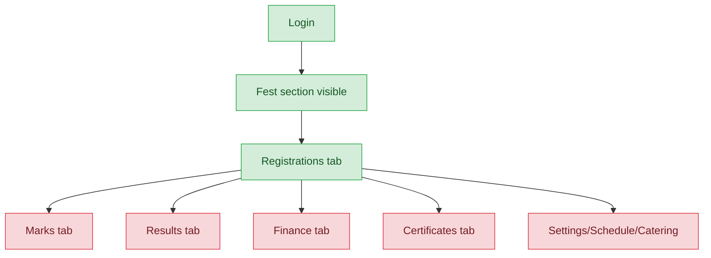
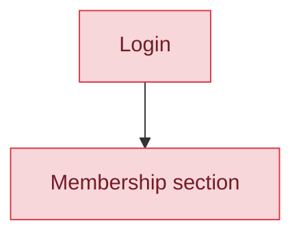
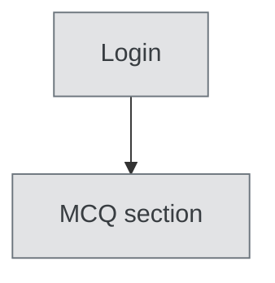

# Registration Coordinator — User Journey

**Landing dashboard:** `/sahodaya-admin/{tenant_id}` → `DashboardController::index`
**Scope:** Holds only `fest.view` and `fest.registrations` — despite the role name, has ZERO `membership.*` permissions. Fully functional for fest-event registrations only; the Membership section (which the name implies ownership of) is entirely hidden, and MCQ is inaccessible.

## Kalotsav / Sports Meet / Kids Fest / Teacher Fest / Custom Events (same pattern for all fest types)

| Stage | Menu path | Route | Status | Note |
|---|---|---|---|---|
| Login | Sahodaya dashboard | `/sahodaya-admin/{tenant_id}` | ✅ | |
| Onboarding/setup | Fest section visible | `fest.view` | ✅ | |
| Registration/enrollment | Registrations tab | `fest.registrations` | ✅ | The one fully-working stage |
| Configuration | Settings tab | requires `fest.settings` (not granted) | ❌ | Hidden |
| Execution | Marks / Schedule / Catering | requires `fest.marks`/`fest.manage` (not granted) | ❌ | Hidden |
| Review/approval | Clash/appeals review | requires `fest.manage` (not granted) | ❌ | Hidden |
| Publishing/results | Results tab | requires `fest.results` (not granted) | ❌ | Hidden |
| Post-result | Certificates tab | requires `fest.certificates` (not granted) | ❌ | Hidden |

**Known issues:**
- Only the Registrations tab is functional; every other fest tab (Marks, Results, Finance, Certificates, Settings, Schedule, Catering) is hidden due to lacking the corresponding permission. This is correctly scoped if the role is meant only for fest registrations.

## Membership

| Stage | Menu path | Route | Status | Note |
|---|---|---|---|---|
| Login | Sahodaya dashboard | `/sahodaya-admin/{tenant_id}` | ✅ | |
| All other stages | Membership section | requires `membership.view` (not granted) | ❌ | Entire Membership section hidden — no `membership.*` permission at all, despite the role's name implying ownership of school/student registration |

**Known issues:**
- The entire Membership section is hidden because `registration_coordinator` holds zero `membership.*` permissions — a naming mismatch, since the role's title implies registration/enrollment ownership across the platform, but it has no access to the Membership (school/student annual registration) module at all.

## MCQ Exams

| Stage | Menu path | Route | Status | Note |
|---|---|---|---|---|
| Login | Sahodaya dashboard | `/sahodaya-admin/{tenant_id}` | ✅ | |
| All other stages | MCQ section | requires `mcq.view` (not granted) | 🚫 | Entire section hidden — not applicable to this role |

**Known issues:** None beyond the missing grant (expected, not a bug).

---
## Summary for this role
Registration Coordinator is complete and solid for its actual permission grant: fest-event registrations work correctly across all five fest types (Kalotsav, Sports, Kids Fest, Teacher Fest, Custom), with every other fest tab correctly hidden. However, the role's name strongly implies it should also own school/student registration (Membership), yet it holds zero `membership.*` permissions and the entire Membership section is invisible. The single biggest actionable fix: either grant `membership.view` (+ appropriate registration permissions) to match the role's name, or rename the role to something like "Fest Registration Coordinator" to reflect its actual, narrower scope.
