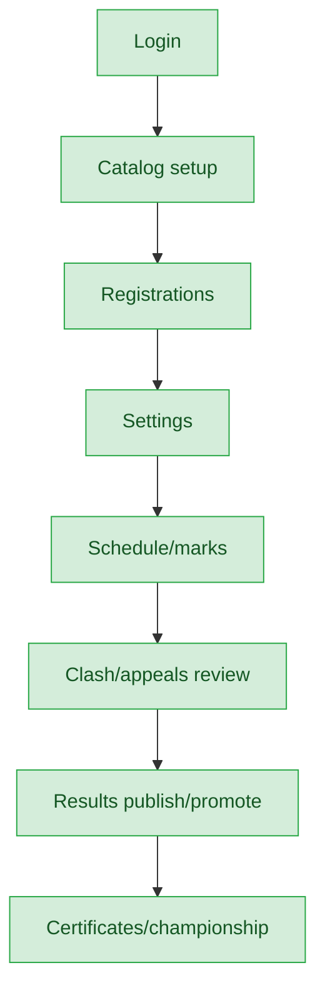
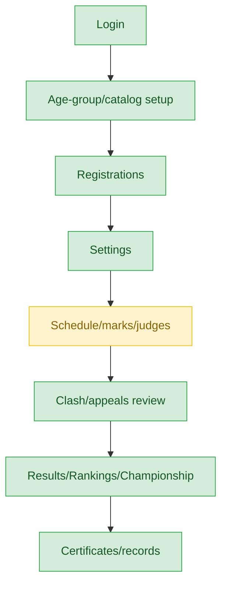
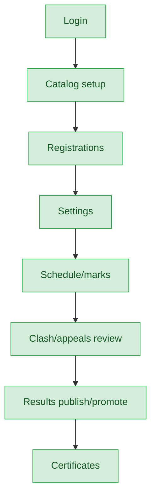
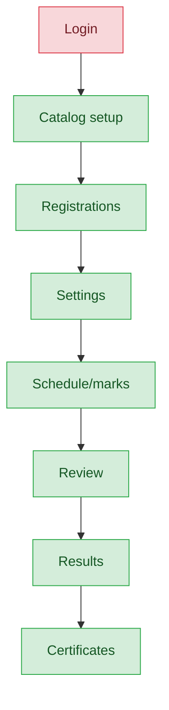
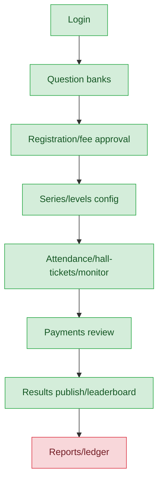
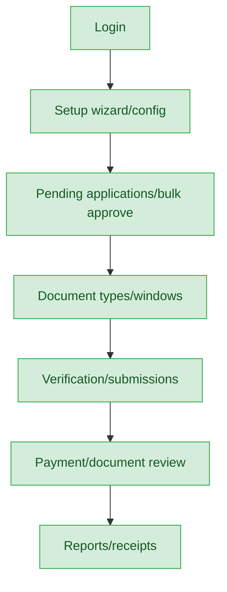

# Sahodaya Admin — User Journey

**Landing dashboard:** `/sahodaya-admin/{tenant_id}` → `DashboardController::index`
**Scope:** Full tenant-level administrator — has complete authority across every event type (Kalotsav, Sports Meet, Kids Fest, Teacher Fest, Custom events, MCQ exams, Membership) within their own Sahodaya, from catalog setup through certificates. This is the most complete role in the audit; the few gaps found are access-entry-point or downstream-feature issues, not authority gaps.

## Kalotsav

| Stage | Menu path | Route | Status | Note |
|---|---|---|---|---|
| Login | Sahodaya Admin dashboard | `/sahodaya-admin/{tenant_id}` → `DashboardController::index` | ✅ | |
| Onboarding/setup | Kalotsav Catalog | `kalotsav.catalog.*` → `FestCatalogController` | ✅ | |
| Registration/enrollment | Registrations | `events.registrations.*` → `FestRegistrationReviewController` | ✅ | |
| Configuration | Event Settings | `events.settings` → `FestEventSettingsController` | ✅ | |
| Execution | Schedule / Chest numbers / Marks | `events.schedule.*`, `events.marks.*` → `FestScheduleController`, `FestMarkEntryController` | ⚠️ | Item-heads routes exist but have no nav link in the generic sidebar (Sports sidebar is the only one with it) — minor orphan note |
| Review/approval | Clash / Substitution / Appeals | `events.clash-requests.*` etc. → `FestClashReviewController` etc. | ✅ | |
| Publishing/results | Results publish/unpublish/promote | `events.results.publish/unpublish/promote` → `FestResultsController` | ✅ | |
| Post-result | Certificates / Championship | `events.certificates.*` → `FestCertificateController` | ✅ | |

**Known issues:**
- Item-heads management routes exist but have no nav link in the generic sidebar; only the Sports sidebar surfaces it. Minor navigation gap, not a functional one.

## Sports Meet

| Stage | Menu path | Route | Status | Note |
|---|---|---|---|---|
| Login | Sahodaya Admin dashboard | `/sahodaya-admin/{tenant_id}` → `DashboardController::index` | ✅ | |
| Onboarding/setup | Age-group setup / Setup hub | Sports catalog + age-group setup routes | ✅ | Extra stage not present for other event types |
| Registration/enrollment | Registrations | `events.registrations.*` → `FestRegistrationReviewController` | ✅ | |
| Configuration | Settings | `events.settings` → `FestEventSettingsController` | ✅ | |
| Execution | Schedule / Marks / Judges / Marks import | `events.schedule.*`, `events.marks.*` + Judges & Marks-import routes | ⚠️ | Sidebar (`sportsEventNav.js`) is missing "Judges" and "Marks import" links — routes work, just no menu entry |
| Review/approval | Clash / Substitution / Appeals | `FestClashReviewController` etc. | ✅ | |
| Publishing/results | Program-level Results / Rankings / Championship | Sports-specific results/rankings/championship routes | ✅ | Extra stages beyond the generic pattern |
| Post-result | Certificates / Athletic records / Record-break certificates | `events.certificates.*` + athletic records routes | ✅ | Extra record-break certificate feature unique to Sports |

**Known issues:**
- Dedicated `sportsEventNav.js` sidebar is missing menu links for "Judges" and "Marks import" — both routes function correctly if reached directly, but there's no way to navigate to them from the sidebar.

## Kids Fest

| Stage | Menu path | Route | Status | Note |
|---|---|---|---|---|
| Login | Sahodaya Admin dashboard | `/sahodaya-admin/{tenant_id}` | ✅ | |
| Onboarding/setup | Catalog | `kalotsav.catalog.*` → `FestCatalogController` (shared generic wiring) | ✅ | Simpler than Sports — no age-group/item-head split |
| Registration/enrollment | Registrations | `events.registrations.*` → `FestRegistrationReviewController` | ✅ | |
| Configuration | Settings | `events.settings` → `FestEventSettingsController` | ✅ | |
| Execution | Schedule/Marks | `events.schedule.*`, `events.marks.*` | ✅ | |
| Review/approval | Clash/Appeals | `FestClashReviewController` etc. | ✅ | |
| Publishing/results | Results publish/promote | `events.results.publish/unpublish/promote` | ✅ | |
| Post-result | Certificates | `events.certificates.*` → `FestCertificateController` | ✅ | |

**Known issues:** None found.

## Teacher Fest

| Stage | Menu path | Route | Status | Note |
|---|---|---|---|---|
| Login | Sahodaya Admin dashboard | `/sahodaya-admin/{tenant_id}` | ✅ | |
| Onboarding/setup | Catalog | `kalotsav.catalog.*` → `FestCatalogController` (shared generic wiring) | ✅ | Simpler than Sports — no age-group/item-head split |
| Registration/enrollment | Registrations | `events.registrations.*` → `FestRegistrationReviewController` | ✅ | |
| Configuration | Settings | `events.settings` → `FestEventSettingsController` | ✅ | |
| Execution | Schedule/Marks | `events.schedule.*`, `events.marks.*` | ✅ | |
| Review/approval | Clash/Appeals | `FestClashReviewController` etc. | ✅ | |
| Publishing/results | Results publish/promote | `events.results.publish/unpublish/promote` | ✅ | |
| Post-result | Certificates | `events.certificates.*` → `FestCertificateController` | ✅ | |

**Known issues:** None found.

## Custom Events

| Stage | Menu path | Route | Status | Note |
|---|---|---|---|---|
| Login | Custom Events (hidden nav entry) | Nav item hardcoded `hidden:true` in `sahodayaAdminNav.js:375` | ❌ | Not reachable from the sidebar at all — only via direct URL |
| Onboarding/setup | Catalog | `kalotsav.catalog.*` → `FestCatalogController` | ✅ | Built and functional once reached |
| Registration/enrollment | Registrations | `events.registrations.*` → `FestRegistrationReviewController` | ✅ | |
| Configuration | Settings | `events.settings` → `FestEventSettingsController` | ✅ | |
| Execution | Schedule/Marks | `events.schedule.*`, `events.marks.*` | ✅ | |
| Review/approval | Clash/Appeals | `FestClashReviewController` etc. | ✅ | |
| Publishing/results | Results publish/promote | `events.results.publish/unpublish/promote` | ✅ | |
| Post-result | Certificates | `events.certificates.*` → `FestCertificateController` | ✅ | |

**Known issues:**
- The Custom Events nav item is hardcoded `hidden:true` in `sahodayaAdminNav.js:375`. Every downstream stage (catalog → registrations → settings → schedule/marks → review → results → certificates) is fully built and functional, but there is no entry point in the sidebar — it's only reachable via a direct URL.

## MCQ Exams

| Stage | Menu path | Route | Status | Note |
|---|---|---|---|---|
| Login | MCQ dashboard | `/mcq` → `McqDashboardController::index` | ✅ | |
| Onboarding/setup | Question banks | question bank routes | ✅ | |
| Registration/enrollment | Registrations / Fee approval | `mcq.registrations.*` → `McqExamController` | ✅ | |
| Configuration | Exam series / Levels | `mcq-series.*` | ✅ | |
| Execution | Attendance / Hall tickets / Session monitor | `mcq.attendance`, `mcq.hall-tickets.*`, `mcq.session` | ✅ | |
| Review/approval | Payments review | `mcq.payments` | ✅ | |
| Publishing/results | Results publish / Leaderboard / Ranking | `mcq.results.publish`, `mcq.leaderboard`, `mcq.ranking.compute` | ✅ | |
| Post-result | Reports / Ledger / Certificates | Reports/ledger routes; **no `mcq.certificates.*` route exists** | ❌ | No certificate stage exists at all for MCQ |

**Known issues:**
- No certificate system exists for MCQ exams — there is no `mcq.certificates.*` route anywhere in the codebase. Reports and ledger work fine, but participants cannot receive MCQ certificates through the platform.

## Membership / Annual Registration

| Stage | Menu path | Route | Status | Note |
|---|---|---|---|---|
| Login | Schools list | Membership dashboard | ✅ | |
| Onboarding/setup | Setup wizard / Membership config | membership config routes | ✅ | |
| Registration/enrollment | Pending applications / Bulk approve-reject | membership registration routes | ✅ | |
| Configuration | Document types / Registration windows | membership config routes | ✅ | |
| Execution | Student/teacher verification / Submissions | membership verification routes | ✅ | |
| Review/approval | Payment verification / Document review | membership review routes | ✅ | |
| Publishing/results | 🚫 | n/a | 🚫 | Not applicable — membership is an ongoing registry, not an event with a results phase |
| Post-result | Reports / Receipts | membership reporting routes | ✅ | |

**Known issues:** None found.

---
## Summary for this role
Sahodaya Admin is the most complete role audited: Kalotsav, Sports Meet, Kids Fest, Teacher Fest, and Membership are all fully solid end-to-end. Custom Events has every stage built but its nav entry point is hardcoded hidden, making it invisible to admins who don't already know the direct URL. MCQ Exams is solid through results and reporting but has no certificate feature at all. The single biggest actionable fix: un-hide the Custom Events nav item in `sahodayaAdminNav.js:375` — the functionality already works, it's simply not discoverable.
