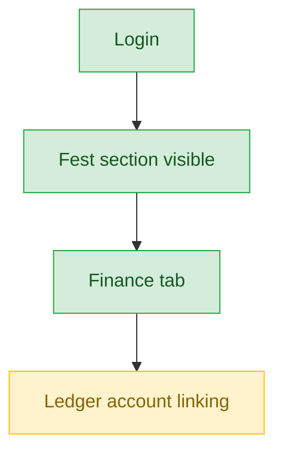
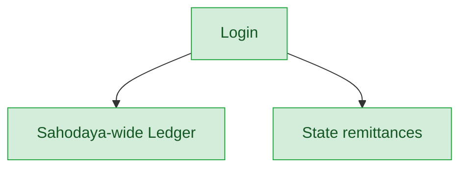
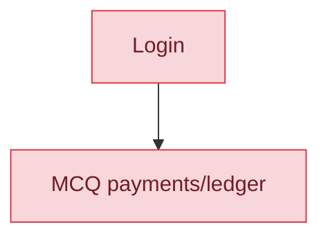
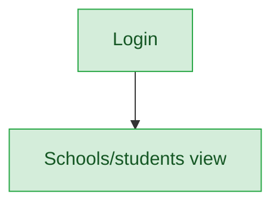

# Sahodaya Finance — User Journey

**Landing dashboard:** `/sahodaya-admin/{tenant_id}` → `DashboardController::index`
**Scope:** Holds `fest.view`, `fest.finance`, `finance.view`, `membership.view`. Full read+write on fest finance and Sahodaya-wide ledger/remittances, view-only on Membership. One real gap: cannot link an event to its ledger account itself due to a misassigned permission check. MCQ payments are hidden from nav but reachable via direct URL (orphan page).

## Kalotsav / Sports Meet / Kids Fest / Teacher Fest / Custom Events (same pattern for all fest types)

| Stage | Menu path | Route | Status | Note |
|---|---|---|---|---|
| Login | Sahodaya dashboard | `/sahodaya-admin/{tenant_id}` | ✅ | |
| Onboarding/setup | Fest section visible | `fest.view` | ✅ | |
| Registration/enrollment | 🚫 | requires `fest.registrations` (not granted) | 🚫 | Not applicable to this role |
| Configuration | Ledger account linking | `updateLedgerAccount` → falls through to require `fest.manage` in `TenantUserCatalog::writePermissionForPath()` | ⚠️ | Finance role cannot link an event to its own ledger account — real gap, should require `fest.finance` |
| Execution | 🚫 | requires `fest.marks`/`fest.manage` (not granted) | 🚫 | Not applicable to this role |
| Review/approval | Finance tab (full read+write) | `fest.finance` — matches FEST_FINANCE bundle exactly | ✅ | |
| Publishing/results | 🚫 | requires `fest.results` (not granted) | 🚫 | Not applicable to this role |
| Post-result | Reports | Finance reporting routes | ✅ | |

**Known issues:**
- `updateLedgerAccount` incorrectly requires `fest.manage` instead of `fest.finance` in `TenantUserCatalog::writePermissionForPath()` — the finance role can view and record all fest finance activity but cannot itself link an event to its ledger account. This is a real permission-mapping gap.

## Cross-cutting: Ledger & State Remittances

| Stage | Menu path | Route | Status | Note |
|---|---|---|---|---|
| Ledger | `/ledger` | Sahodaya-wide ledger, via `finance.view` | ✅ | |
| State remittances | State remittances | via `membership.view`/`finance.view` | ✅ | |

**Known issues:** None found.

## MCQ Exams

| Stage | Menu path | Route | Status | Note |
|---|---|---|---|---|
| All stages | MCQ payments/ledger | requires `mcq.view` (not granted) | ❌ | Hidden from nav entirely |

**Known issues:**
- MCQ payments/ledger nav is hidden (no `mcq.view`), but the MCQ ledger page itself has no additional server-side gate and IS reachable by direct URL — an orphan page accessible outside the intended nav structure.

## Membership

| Stage | Menu path | Route | Status | Note |
|---|---|---|---|---|
| View | Schools / Students | `membership.view` | ✅ | View-only; writes need `membership.manage` (not granted) |

**Known issues:** None found — correctly view-only.

---
## Summary for this role
Sahodaya Finance is largely complete: fest finance (all five fest types), Sahodaya-wide ledger, state remittances, and Membership viewing all work correctly. The one real gap is that the ledger-account-linking action (`updateLedgerAccount`) is misassigned to require `fest.manage` instead of `fest.finance`, so the finance role can't link an event to its own ledger account despite having full finance read/write elsewhere. A secondary orphan issue: the MCQ ledger page is reachable by direct URL even though it's hidden from nav (no `mcq.view` gate on the page itself). The single biggest actionable fix: correct the permission check in `TenantUserCatalog::writePermissionForPath()` so `updateLedgerAccount` requires `fest.finance` instead of `fest.manage`.
