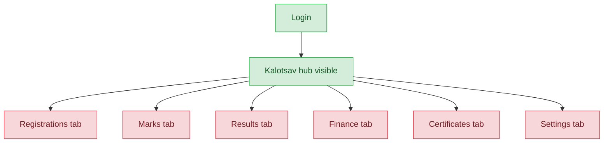

# Sahodaya Staff — User Journey

**Landing dashboard:** `/sahodaya-admin/{tenant_id}` → `DashboardController::index` (same landing as Sahodaya Admin, permissions gate what's usable inside)
**Scope:** View-only role holding only `fest.view`, `mcq.view`, `membership.view`, `website.view` — no `*.manage`/`*.marks`/`*.results`/`*.finance`/`*.certificates`/`*.settings`/`*.registrations` permissions anywhere. Can see every top-level section hub but cannot act on registrations, marks, results, finance, certificates, or settings inside any of them.

## Kalotsav (representative — pattern is identical across all event types)

| Stage | Menu path | Route | Status | Note |
|---|---|---|---|---|
| Login | Sahodaya dashboard | `/sahodaya-admin/{tenant_id}` → `DashboardController::index` | ✅ | |
| Onboarding/setup | Kalotsav hub visible | `fest.view` unlocks the top-level section | ✅ | Hub/dashboard is visible |
| Registration/enrollment | Registrations tab | requires `fest.registrations` (not granted) | ❌ | Hidden/blocked — "door to an empty room" |
| Configuration | Settings tab | requires `fest.settings` (not granted) | ❌ | Hidden/blocked |
| Execution | Marks / Schedule tab | requires `fest.marks`/`fest.manage` (not granted) | ❌ | Hidden/blocked |
| Review/approval | Clash/appeals review | requires `fest.manage` (not granted) | ❌ | Hidden/blocked |
| Publishing/results | Results tab | requires `fest.results` (not granted) | ❌ | Hidden/blocked |
| Post-result | Certificates tab | requires `fest.certificates` (not granted) | ❌ | Hidden/blocked |

**Known issues:**
- None — this is correct view-only design, not a bug. Every action tab is intentionally hidden because `sahodaya_staff` holds only `*.view` permissions.

## Other event types (same pattern — view-only, top hub visible, action stages blocked)

| Event type | Login | Hub visible | Registrations/Marks/Results/Finance/Certificates/Settings |
|---|---|---|---|
| Sports Meet | ✅ | ✅ (`fest.view`) | ❌ all blocked (no manage/marks/results/finance/certificates/settings grants) |
| Kids Fest | ✅ | ✅ (`fest.view`) | ❌ all blocked |
| Teacher Fest | ✅ | ✅ (`fest.view`) | ❌ all blocked |
| Custom events | ✅ | ✅ (`fest.view`) | ❌ all blocked |
| MCQ exams | ✅ | ✅ (`mcq.view`) | ❌ all blocked |
| Membership | ✅ | ✅ (`membership.view`) | ❌ all blocked |

**Known issues:** None — identical view-only pattern by design across all six additional event types.

---
## Summary for this role
Sahodaya Staff is consistent and correct across every event type: the top-level hub is always visible (thanks to the `*.view` permission), but every action stage — registrations, marks, results, finance, certificates, settings — is uniformly hidden or blocked because no `*.manage`/`*.marks`/`*.results`/`*.finance`/`*.certificates`/`*.settings`/`*.registrations` permission is ever granted. This is intentional view-only design, not a defect. No actionable fix needed; the role is complete for its intended scope.
