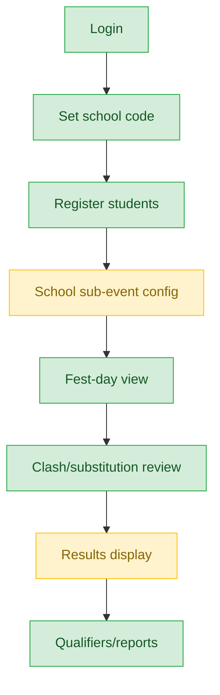
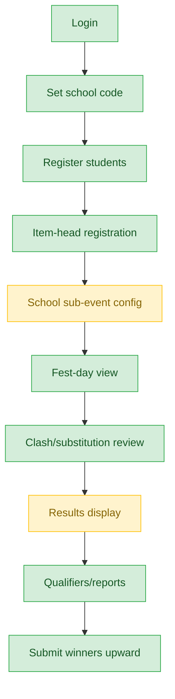
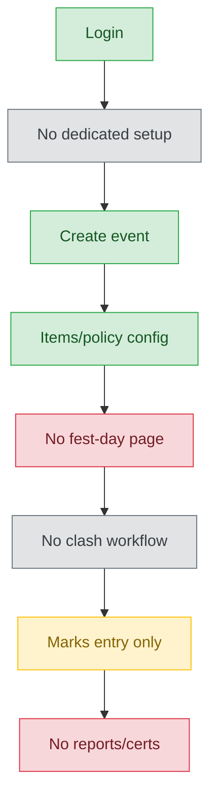
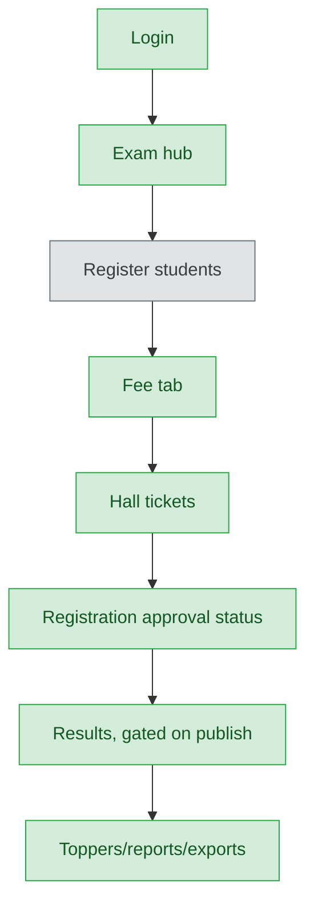
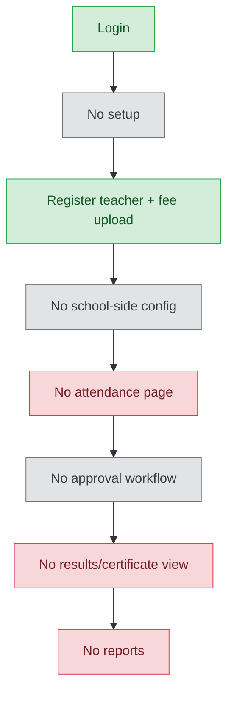
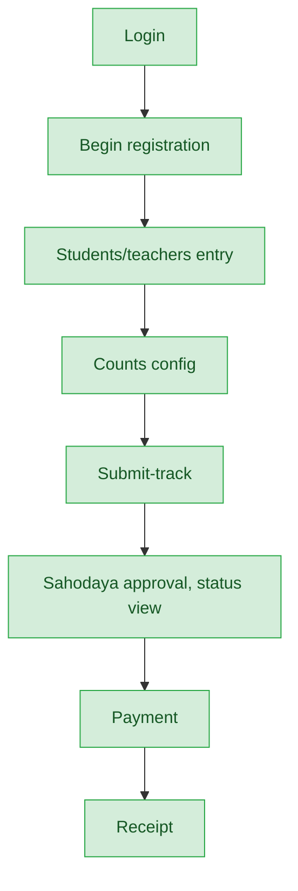

# School Admin / Principal / Vice-Principal — User Journey

**Landing dashboard:** `AuthController.php:394-396` → `/school-admin/{tenant_id}` → `DashboardController::index` → `Dashboard.vue`
**Scope:** These three roles (`school_admin`, `school_principal`, `school_vice_principal`) are treated **identically** by every SchoolAdmin controller for every stage of every event type — `EnsureSchoolAdmin` groups all three under `schoolManagementRoles()`. The **only** difference found: `school_principal` alone can assign the `school_admin`/`school_vice_principal` roles to other staff (`TenantUserController::assertRoleCombinationAllowed`) — a staff-management permission, outside event-type scope. (A vestigial `users.manage` grant exists for `school_vice_principal` in `defaultPermissionsForRole()` but is never actually checked, since vice-principal bypasses the permission gate entirely — a code-cleanliness note, not user-facing.) Everything below applies equally to all three roles.

## Kalotsav (and identically: Sports Meet, Kids Fest, Teacher Fest, English Fest, Science Fest)

All six dedicated fest programs share the same `ForwardsFestProgramActions` trait wiring, byte-identical across school nav files. English Fest and Science Fest mirror Kalotsav exactly (see summary below) — only Kalotsav is diagrammed in full; Sports Meet is diagrammed separately below for its two bonus stages.

| Stage | Menu path | Route | Status | Note |
|---|---|---|---|---|
| Login | School Admin sidebar | `/school-admin/{tenant_id}` | ✅ | `DashboardController::index` |
| Onboarding/Setup | Set school code (if not already set) | `KalotsavController` | ✅ | One-time per school |
| Registration/Enrollment | Register students for program | `KalotsavController::registration` → `FestRegistrationController::index` | ✅ | |
| Configuration | School-conducted sub-event config | `ForwardsFestProgramActions` | ⚠️ | Main config lives at Sahodaya tier for Sahodaya-run events — school only configures school-conducted custom sub-events. Expected/by design, not a defect |
| Execution | Fest-day view | `FestRegistrationController::festDay` | ✅ | |
| Review/Approval | Clash/substitution requests | `ForwardsFestProgramActions` | ✅ | |
| Publishing/Results | Results display | `ForwardsFestProgramActions` | ⚠️ | Read-only display; publishing authority correctly sits at Sahodaya tier (by design). Orphan: certificate-download-all and appeals routes exist in `FestEventPortalController` but have **no menu entry** in any of the 3 school nav files |
| Post-result | Qualifiers, reports | `ForwardsFestProgramActions` | ✅ | |

**Known issues:**
- Certificate-download-all and appeals routes exist server-side but are unreachable via any school-tier nav menu (orphaned functionality).

## Sports Meet (bonus stages)

Identical to Kalotsav above, plus two Sports-specific stages not present for the other five programs.

| Stage | Menu path | Route | Status | Note |
|---|---|---|---|---|
| Login | School Admin sidebar | `/school-admin/{tenant_id}` | ✅ | Same landing as all fest programs |
| Onboarding/Setup | Set school code | `KalotsavController`-equivalent | ✅ | |
| Registration/Enrollment | Register students + item-head registration | `ForwardsFestProgramActions` | ✅ | Item-head registration is a Sports-only extra stage |
| Configuration | School sub-event config | `ForwardsFestProgramActions` | ⚠️ | Same by-design split as Kalotsav |
| Execution | Fest-day view | `FestRegistrationController::festDay` | ✅ | |
| Review/Approval | Clash/substitution review | `ForwardsFestProgramActions` | ✅ | |
| Publishing/Results | Results display | `ForwardsFestProgramActions` | ⚠️ | Read-only; same orphaned certificate/appeals nav gap as other fest types |
| Post-result | Qualifiers/reports + submit winners to Sahodaya | `ForwardsFestProgramActions` | ✅ | "Submit winners" (school → Sahodaya level) is a Sports-only extra stage |

**Known issues:**
- Same certificate-download-all/appeals nav orphan as Kalotsav.
- Extra stages (item-registration, submit-winners) are intentional Sports-specific bonuses, not gaps in the other five programs.

## Custom events

The single biggest gap found in the whole school-tier audit. Only the first four of eight stages are actually built.

| Stage | Menu path | Route | Status | Note |
|---|---|---|---|---|
| Login | School Admin sidebar | `/school-admin/{tenant_id}` | ✅ | |
| Onboarding/Setup | — | — | 🚫 | No dedicated setup; event created ad hoc |
| Registration/Enrollment | Create custom event | `FestProgramController::store` | ✅ | |
| Configuration | Items/participation policy | `FestProgramController` | ✅ | |
| Execution | Fest-day/attendance/registration-desk | — | ❌ | **No such page exists at all** for Custom events |
| Review/Approval | Clash/substitution | — | 🚫 | No routes exist for Custom events |
| Publishing/Results | Marks entry only | `FestProgramController::marks` / `storeMark` | ⚠️ | Only mark entry exists — no dedicated Results/Qualifiers view |
| Post-result | Reports/certificates/ID cards | — | ❌ | Entire reporting suite that exists for the 6 dedicated programs is absent for Custom |

**Known issues:**
- This is the single biggest gap in the school-tier audit: stages 5-8 (Execution through Post-result) are broken or entirely missing, not merely partial.
- No fest-day/attendance view, no review workflow, no results/qualifiers page, no reports suite, no certificates, no ID cards for Custom events.

## MCQ Exams

| Stage | Menu path | Route | Status | Note |
|---|---|---|---|---|
| Login | School Admin sidebar | `/school-admin/{tenant_id}` | ✅ | MCQ hub |
| Onboarding/Setup | — | — | 🚫 | Exam created at Sahodaya tier |
| Registration/Enrollment | Register students (individually or by class) | MCQ registration controller | ✅ | |
| Configuration | Fee tab | MCQ fee controller | ✅ | |
| Execution | Hall tickets | MCQ hall-ticket controller | ✅ | |
| Review/Approval | Registration approval status | Shown inline | ✅ | |
| Publishing/Results | Results | Gated on Sahodaya publish | ✅ | |
| Post-result | Toppers, reports, exports | MCQ reports controller | ✅ | |

**Known issues:** None found. All stages complete.

## Teacher Training

| Stage | Menu path | Route | Status | Note |
|---|---|---|---|---|
| Login | School Admin sidebar | `/school-admin/{tenant_id}` | ✅ | Training hub |
| Onboarding/Setup | — | — | 🚫 | No such stage |
| Registration/Enrollment | Register teacher + fee upload | `TrainingController` / `TrainingRegistrationController` | ✅ | |
| Configuration | — | — | 🚫 | No school-side config exists |
| Execution | Attendance/execution page | — | ❌ | No such page exists |
| Review/Approval | — | — | 🚫 | No approval workflow beyond payment upload |
| Publishing/Results | Results/certificate view | — | ❌ | No such view exists anywhere for Training |
| Post-result | Reports | — | ❌ | No reports exist |

**Known issues:**
- Much thinner than MCQ/fest programs — only registration and fee-payment upload are actually built. No execution, no results, no certificates, no reports.

## Membership / Annual Registration

| Stage | Menu path | Route | Status | Note |
|---|---|---|---|---|
| Login | School Admin sidebar | `/school-admin/{tenant_id}` | ✅ | |
| Onboarding/Setup | Begin registration | Membership controller | ✅ | |
| Registration/Enrollment | Students/teachers entry | Membership controller | ✅ | |
| Configuration | Counts | Membership controller | ✅ | |
| Execution | Submit-track | Membership controller | ✅ | |
| Review/Approval | Sahodaya approves; school sees status | Membership controller | ✅ | Approval authority correctly sits one tier up — by design |
| Publishing/Results | Payment | Membership controller | ✅ | |
| Post-result | Receipt | Membership controller | ✅ | |

**Known issues:** None found. Fully complete.

---
## Summary for this role

`school_admin`/`school_principal`/`school_vice_principal` are functionally identical across the entire platform (the only difference is a staff-role-assignment permission held solely by `school_principal`). Kalotsav, Sports Meet, Kids Fest, Teacher Fest, English Fest, and Science Fest are all solid end-to-end journeys (English Fest and Science Fest are byte-identical to Kalotsav), with only a minor orphaned certificate/appeals nav link as a blemish. MCQ Exams and Membership/Annual Registration are both fully complete. The two clear weak spots are Custom events — where everything past marks-entry (execution, review, results, reports, certificates) simply doesn't exist — and Teacher Training, which stops at registration + fee upload with no execution, results, or reporting stage at all. The single biggest actionable fix: build out the missing back half (fest-day/execution through reports/certificates) for Custom events, since it is the most structurally incomplete journey in the entire school tier.
