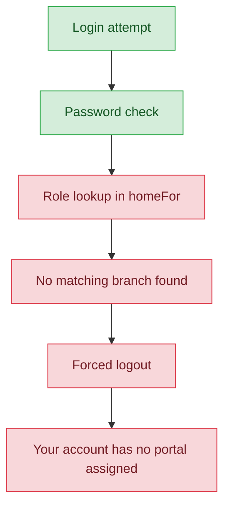

# School Domain Coordinators — User Journey

**Landing dashboard:** None reachable. Every one of these 5 roles is blocked before reaching any dashboard.
**Scope:** This file covers 5 distinct, named roles — `school_finance_coordinator`, `school_training_coordinator`, `school_mcq_coordinator`, `school_kalotsavam_coordinator`, `school_sports_coordinator` — that share **one single root-cause bug**, not five separate issues. All five are fully assignable through the real staff-creation UI today, have fully-built bespoke permission sets, and are fully expected by the middleware layer to reach school-admin routes — but a missing code branch in the login handler locks every one of them out immediately after a correct password check.

## The actual journey: Login → BLOCKED

| Stage | Menu path | Route | Status | Note |
|---|---|---|---|---|
| Login | Standard login form | `AuthController::homeFor()` (`app/Http/Controllers/Admin/AuthController.php:365-439`) | ❌ | Password check succeeds; `homeFor()` has no branch for any of the 5 role names; execution falls through the entire method to `return null;` |
| Onboarding/Setup | — | — | 🚫 | Unreachable — never gets past login |
| Registration/Enrollment | — | — | 🚫 | Unreachable |
| Configuration | — | — | 🚫 | Unreachable |
| Execution | — | — | 🚫 | Unreachable |
| Review/Approval | — | — | 🚫 | Unreachable |
| Publishing/Results | — | — | 🚫 | Unreachable |
| Post-result | — | — | 🚫 | Unreachable |

## The bug, in detail

This is a **release-blocking login bug affecting 5 fully-provisioned roles**, not a case of dead/unused roles:

- **Fully assignable today**: `TenantUserCatalog::schoolAdminCreatableRoles()` includes all 5 role names.
- **Real UI exposure**: `Pages/Admin/School/Users/Index.vue` renders all 5 as selectable options in the staff-creation screen (though they display as raw role slugs rather than friendly labels — a second, cosmetic bug stacked on top, since `TenantUserCatalog::roleLabels()` has no entries for any of the 5).
- **No guard on creation**: `TenantUserController::store()` → `TenantUserProvisioner::upsert()` → `syncRoles()` assigns any of the 5 roles with no validation blocking it.
- **Fully-built permission sets exist**: `TenantUserCatalog::defaultPermissionsForRole()` has bespoke, clearly-intentional permission grants for each of the 5 (e.g. `school_mcq_coordinator` → `mcq.view` + `mcq.manage`; `school_finance_coordinator` → `finance.view` + `fest.finance`; and similarly-scoped sets for training, kalotsavam, and sports).
- **Middleware fully expects them**: `EnsureSchoolAdmin.php` explicitly lists all 5 for email-verification and school-status gating, fully expecting them to reach school-admin routes.
- **The actual break**: `AuthController::homeFor()` (`app/Http/Controllers/Admin/AuthController.php:365-439`) has no `if` branch checking for any of these 5 role names. Execution falls through the entire method to `return null;`. The login handler then runs: `if ($home === null) { Auth::logout(); ...; return authErrorResponse('Your account has no portal assigned. Contact your administrator.'); }` — the user is **actively logged back out immediately after a correct password check**, every single time, with no path forward.
- **100% reproducible** for anyone holding only one of these 5 roles.

**Recommended fix:** add 5 branches to `homeFor()` routing each role to its appropriate scoped landing (finance → payments/registration-payment, training → `/training`, mcq → `/mcq`, kalotsavam → `/kalotsav`, sports → `/sports`), plus add the 5 missing display labels to `TenantUserCatalog::roleLabels()`.

## The 5 affected roles and their intended-but-unreachable landing pages

| Role | Intended landing (per its permission set) | Permissions already built | Currently reachable? |
|---|---|---|---|
| `school_finance_coordinator` | Payments / registration-payment area | `finance.view`, `fest.finance` | ❌ No — blocked at login |
| `school_training_coordinator` | `/training` | Training-scoped permissions | ❌ No — blocked at login |
| `school_mcq_coordinator` | `/mcq` | `mcq.view`, `mcq.manage` | ❌ No — blocked at login |
| `school_kalotsavam_coordinator` | `/kalotsav` | Kalotsav-scoped permissions | ❌ No — blocked at login |
| `school_sports_coordinator` | `/sports` | Sports-scoped permissions | ❌ No — blocked at login |

**Known issues:**
- One root-cause bug (missing branches in `AuthController::homeFor()`) blocks all 5 roles identically — this is a single fix, not five separate investigations.
- Secondary cosmetic bug: the staff-creation UI shows raw role slugs instead of friendly labels for all 5 roles, because `TenantUserCatalog::roleLabels()` has no entries for them either.

---
## Summary for this role

All 5 domain coordinator roles are otherwise-complete, intentionally-designed features — permission sets, middleware gating, and UI exposure all exist and work — but every one of them is completely unusable today because `AuthController::homeFor()` never learned to route them anywhere. Every user assigned one of these roles passes their password check and is then immediately logged back out with a generic "no portal assigned" error, with zero path forward. This is the single highest-priority fix in the whole school tier: a 5-branch addition to `homeFor()` (plus 5 missing role labels) would unlock all five roles at once.
