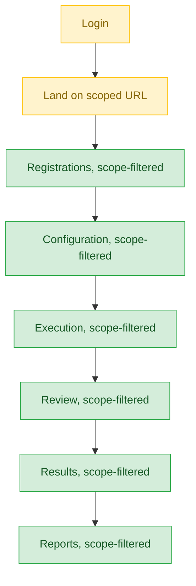
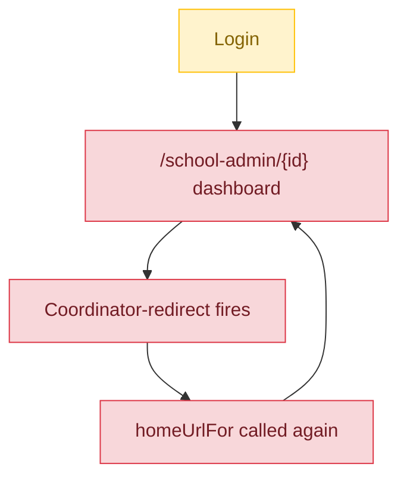

# School Event Coordinator — User Journey

**Landing dashboard:** `AuthController.php:398-400` → `SchoolUserScopeService::homeUrlFor()` (`app/Services/School/SchoolUserScopeService.php:172-201`) — routes to a scoped URL (MCQ/training/fest-event/fest-program) based on the coordinator's first assigned scope row.
**Scope:** Once correctly assigned to a scope (a specific fest event or program), registrations/configuration/execution/review/results/reports are all correctly filtered to just that program/event via `SchoolUserScopeService::filterFestEventsForUser` — a genuinely well-scoped role. However, the Login/access stage itself has two real bugs: a non-deterministic landing when a coordinator holds multiple scope assignments, and a reachable dead-end loop when a coordinator's scope is cleared.

## Assigned scope (representative journey — mechanism is identical regardless of which program/event is assigned)

| Stage | Menu path | Route | Status | Note |
|---|---|---|---|---|
| Login | Coordinator login | `SchoolUserScopeService::homeUrlFor()` | ⚠️ | `scopesForUser()` has no `ORDER BY` — a coordinator with multiple scope assignments lands on an arbitrary one every login |
| Onboarding/Setup | N/A within scope | — | 🚫 | Not a distinct stage for this role |
| Registration/Enrollment | Registrations for assigned scope | `SchoolUserScopeService::filterFestEventsForUser` | ✅ | Correctly filtered to just the assigned program/event |
| Configuration | Config for assigned scope | `SchoolUserScopeService::filterFestEventsForUser` | ✅ | Correctly scoped |
| Execution | Execution for assigned scope | `SchoolUserScopeService::filterFestEventsForUser` | ✅ | Correctly scoped |
| Review/Approval | Review for assigned scope | `SchoolUserScopeService::filterFestEventsForUser` | ✅ | Correctly scoped |
| Publishing/Results | Results for assigned scope | `SchoolUserScopeService::filterFestEventsForUser` | ✅ | Correctly scoped |
| Post-result | Reports for assigned scope | `SchoolUserScopeService::filterFestEventsForUser` | ✅ | Correctly scoped |

**Known issues:**
- Non-deterministic landing: with multiple scope assignments and no `ORDER BY` in `scopesForUser()`, the coordinator lands on an arbitrary assignment each login rather than a predictable default.

## Zero-scope edge case (login loop)

Reachable whenever a coordinator's assigned event is deleted, or their role is toggled off then back on, clearing their scope rows.

| Stage | Menu path | Route | Status | Note |
|---|---|---|---|---|
| Login | Coordinator login, zero scope rows | `DashboardController::index` | ❌ | Lands on `/school-admin/{id}`, whose coordinator-redirect logic immediately calls `homeUrlFor()` again — a self-referential dead-end loop with no path forward |

**Known issues:**
- The "No assignments yet" nav fallback item links into this exact same loop, so there is no in-app escape once a coordinator's scope is cleared — they need an administrator to re-assign a scope out-of-band.

---
## Summary for this role

Within a correctly assigned scope, `school_event_coordinator` works exactly as intended: registrations, configuration, execution, review, results, and reports are all cleanly filtered to just the coordinator's assigned program or event, regardless of which of the fest programs, MCQ, or training it is. The gaps are entirely concentrated in the Login/access stage: a coordinator with multiple assignments lands somewhere arbitrary each time (missing `ORDER BY`), and a coordinator whose scope is later cleared falls into a self-referential redirect loop with no nav-based way out. Biggest actionable fix: add a deterministic ordering to `scopesForUser()` and give `DashboardController::index`'s coordinator-redirect a real fallback landing (e.g. a "no assignments" info page) instead of re-calling `homeUrlFor()` into the same dead end.
