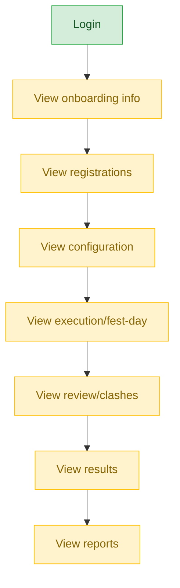

# School Staff — User Journey

**Landing dashboard:** `AuthController.php:402-404` → `/school-admin/{tenant_id}` — same dashboard as `school_admin`.
**Scope:** Write-gated via `EnsureSchoolAdmin` / `TenantUserCatalog::writePermissionForPath()`. Default permissions are `fest.view` + `website.view` unless the creating admin grants more at account-creation time. View access to every stage of every event type works as designed (nav visible per default/granted permissions); write actions (submitting registrations, entering marks, publishing, etc.) correctly require the specific permission to have been explicitly granted, and are blocked both server-side (403) and hidden from nav when not granted.

## Kalotsav (representative — same pattern repeats identically for every event type + MCQ + Membership)

| Stage | Menu path | Route | Status | Note |
|---|---|---|---|---|
| Login | School Admin sidebar | `/school-admin/{tenant_id}` | ✅ | Same landing as `school_admin` |
| Onboarding/Setup | View school code setup | `ForwardsFestProgramActions` | ⚠️ | View ✅ always; write requires explicit permission grant |
| Registration/Enrollment | View/submit registrations | `KalotsavController::registration` → `FestRegistrationController::index` | ⚠️ | View ✅ by default (`fest.view`); submitting registrations requires the specific write permission to have been granted at account creation — correctly 403'd server-side and hidden from nav if not granted |
| Configuration | View sub-event config | `ForwardsFestProgramActions` | ⚠️ | Same view/write split |
| Execution | View fest-day view | `FestRegistrationController::festDay` | ⚠️ | Same view/write split |
| Review/Approval | View clash/substitution requests | `ForwardsFestProgramActions` | ⚠️ | Same view/write split |
| Publishing/Results | View results | `ForwardsFestProgramActions` | ⚠️ | Read-only for everyone at school tier regardless of role (publishing authority is Sahodaya-tier); no additional restriction beyond that |
| Post-result | View qualifiers/reports | `ForwardsFestProgramActions` | ⚠️ | Same view/write split |

**Known issues:** None found — this is the intended, correctly-implemented permission-gated design, not a defect. The same pattern (view ✅ always, write ⚠️ conditional on granted permission) repeats identically across every fest event type (Sports Meet, Kids Fest, Teacher Fest, English Fest, Science Fest, Custom events), MCQ Exams, and Membership/Annual Registration.

---
## Summary for this role

`school_staff` is a complete, correctly-implemented permission-gated view role: every stage of every event type and module is visible by default, while write actions (registrations, marks entry, publishing, etc.) are correctly blocked both server-side and in the nav unless the creating admin explicitly grants the relevant permission at account-creation time. No gaps were found for this role — the view/write split is working exactly as designed across all event types, MCQ, and Membership. No actionable fix needed.
