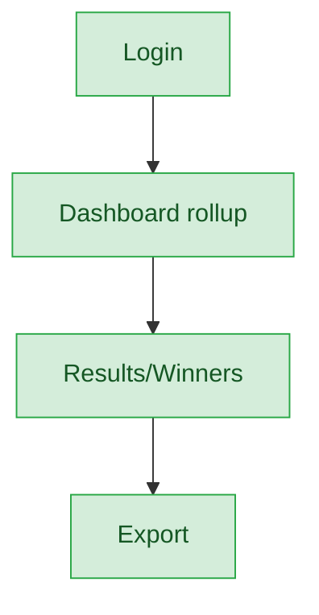
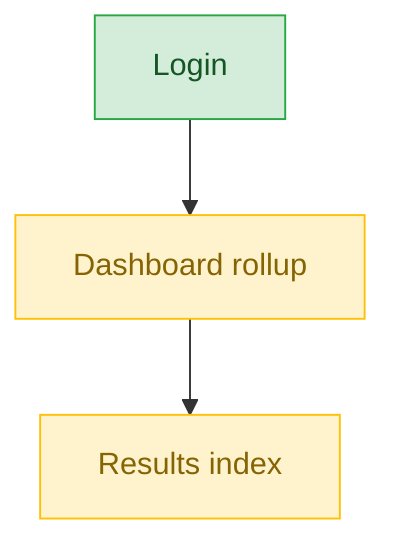
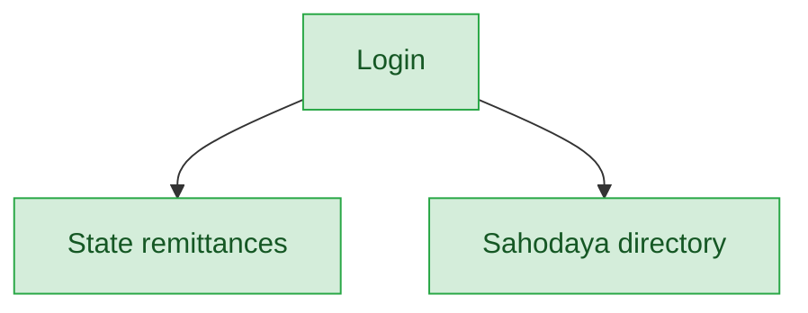

# State Admin / State Staff — User Journey

**Landing dashboard:** `AuthController.php:372` → `route('admin.state.dashboard')` → `StateAdminDashboardController::index` → `State/Dashboard.vue`
**Scope:** Aggregated, cross-Sahodaya, read-mostly oversight tier with no execution authority — state_admin and state_staff follow an identical journey. It rolls up results and remittances across Sahodayas within the state; it does not run events, enter marks, or configure anything at the event level.

## Kalotsav

| Stage | Menu path | Route | Status | Note |
|---|---|---|---|---|
| Login | State Admin login | `AuthController.php:372` → `admin.state.dashboard` | ✅ | Lands on `State/Dashboard.vue` |
| Onboarding/setup | 🚫 | n/a | 🚫 | Not applicable — state tier does not set up events |
| Registration/enrollment | 🚫 | n/a | 🚫 | Not applicable — state tier is oversight-only |
| Configuration | 🚫 | n/a | 🚫 | Not applicable — no execution authority |
| Execution | 🚫 | n/a | 🚫 | Not applicable — state tier doesn't execute events |
| Review/approval | Dashboard rollup | `admin.kalotsav.index/show` → `Admin\KalotsavStateController::index/show` | ✅ | Aggregated view across Sahodayas |
| Publishing/results | Results / Winners | `admin.kalotsav.results/winners` → `Admin\KalotsavStateController::results/winners` | ✅ | Full read rollup of results and winners |
| Post-result | Export winners | `admin.kalotsav.exportWinners` → `Admin\KalotsavStateController::exportWinners` | ✅ | Export supported |

**Known issues:** None found — Kalotsav is the strongest rollup at this tier.

## Sports Meet

| Stage | Menu path | Route | Status | Note |
|---|---|---|---|---|
| Login | State Admin login | `admin.state.dashboard` | ✅ | Same landing as Kalotsav |
| Onboarding/setup | 🚫 | n/a | 🚫 | Not applicable |
| Registration/enrollment | 🚫 | n/a | 🚫 | Not applicable |
| Configuration | 🚫 | n/a | 🚫 | Not applicable |
| Execution | 🚫 | n/a | 🚫 | Not applicable |
| Review/approval | Dashboard rollup | `admin.sports.index` → `Admin\SportsResultsController::index` | ⚠️ | Controller exists but thinner than Kalotsav |
| Publishing/results | Results index | `Admin\SportsResultsController::index` | ⚠️ | No drill-down comparable to Kalotsav's winners/export |
| Post-result | — | — | ⚠️ | No dedicated export equivalent found |

**Known issues:**
- Sports Meet rollup is noticeably thinner than Kalotsav's — has an index/results controller but lacks the winners drill-down and export parity that Kalotsav offers.

## Kids Fest

Not audited in this pass — no dedicated state-tier rollup controller exists for this event type.

| Stage | Menu path | Route | Status | Note |
|---|---|---|---|---|
| Login | State Admin login | `admin.state.dashboard` | ✅ | Shared landing |
| All other stages | — | — | ❌ | No dedicated state-tier rollup controller exists for Kids Fest — asymmetric gap vs. Kalotsav |

**Known issues:**
- No dedicated state-tier rollup controller exists for Kids Fest at all.

## Teacher Fest

Not audited in this pass — no dedicated state-tier rollup controller exists for this event type.

| Stage | Menu path | Route | Status | Note |
|---|---|---|---|---|
| Login | State Admin login | `admin.state.dashboard` | ✅ | Shared landing |
| All other stages | — | — | ❌ | No dedicated state-tier rollup controller exists for Teacher Fest — asymmetric gap vs. Kalotsav |

**Known issues:**
- No dedicated state-tier rollup controller exists for Teacher Fest at all.

## Custom Events

Not audited in this pass — no dedicated state-tier rollup controller exists for this event type.

| Stage | Menu path | Route | Status | Note |
|---|---|---|---|---|
| Login | State Admin login | `admin.state.dashboard` | ✅ | Shared landing |
| All other stages | — | — | ❌ | No dedicated state-tier rollup controller exists for Custom events — asymmetric gap vs. Kalotsav |

**Known issues:**
- No dedicated state-tier rollup controller exists for Custom events at all.

## MCQ Exams

Not audited in this pass — no dedicated state-tier rollup controller exists for this event type.

| Stage | Menu path | Route | Status | Note |
|---|---|---|---|---|
| Login | State Admin login | `admin.state.dashboard` | ✅ | Shared landing |
| All other stages | — | — | ❌ | No dedicated state-tier rollup controller exists for MCQ exams — asymmetric gap vs. Kalotsav |

**Known issues:**
- No dedicated state-tier rollup controller exists for MCQ at all.

## Membership / Annual Registration

Not audited in this pass — not covered / not applicable at state tier in this pass.

| Stage | Menu path | Route | Status | Note |
|---|---|---|---|---|
| All stages | — | — | 🚫 | Not covered / not applicable at state tier in this pass |

**Known issues:** None found (not audited).

## Cross-cutting (not tied to a single event type)

| Stage | Menu path | Route | Status | Note |
|---|---|---|---|---|
| State remittances | Remittances | `admin.state-remittances.*` → `Admin\StateRemittanceController` | ✅ | Verify/reject actions supported |
| Sahodaya directory | Sahodayas | `admin.sahodayas.index` → `TenantController::indexSahodayas` | ✅ | Read-only directory of Sahodayas |

**Known issues:** None found.

---
## Summary for this role
Kalotsav is the strongest state-tier journey — full read rollup with results, winners, and export. Sports Meet works but is noticeably thinner (no winners/export parity). Kids Fest, Teacher Fest, Custom events, and MCQ have no dedicated state-tier rollup controller at all — a clear asymmetric gap across event types. Membership isn't covered at this tier in this pass. Cross-cutting features (state remittances, Sahodaya directory) work correctly. The single biggest actionable fix: build state-tier rollup controllers for Kids Fest, Teacher Fest, Custom events, and MCQ to match the Kalotsav pattern, since state admins currently have no visibility into four of the six event types.
