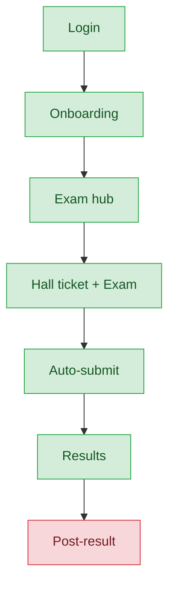
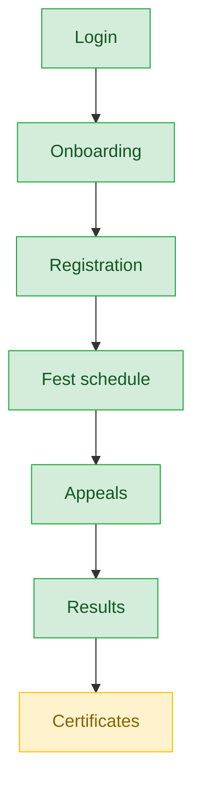
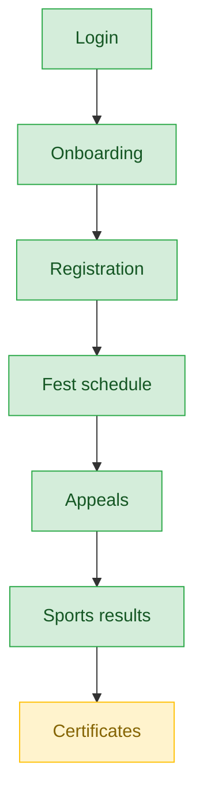

# Student — User Journey

**Landing dashboard:** `StudentDashboardController::index`, via `AuthController::homeFor()` → `/portal/student/{tenant_id}`
**Scope:** Students can enroll/self-register (where permitted), take MCQ exams, view fest schedules, lodge appeals, and view published results/certificates for their own participation only — no configuration or admin powers anywhere in this portal.

## MCQ Exam

| Stage | Menu path | Route | Status | Note |
|---|---|---|---|---|
| Login | Portal login | `/portal/student/{tenant_id}` | ✅ | Standard landing via `homeFor()` |
| Onboarding | Dashboard welcome | `StudentDashboardController::index` | ✅ | First-login welcome shown |
| Registration | MCQ hub | `mcqExamsFor()` | ✅ | Lists available exams |
| Configuration | — | — | 🚫 | Students don't configure exams |
| Execution | Exam → Start | `StudentMcqController::startExam` / `saveAnswer` | ✅ | Autosave is wired (contrary to an older doc's claim); already fixed elsewhere |
| Review/Approval | Auto-submit on expiry | `StudentMcqController::submitExam` | ✅ | Audit-logged |
| Publishing/Results | MCQ result page | `McqResult.vue` | ✅ | Gated on `exam.results_published` |
| Post-result | Certificate | — | ❌ | No certificate exists for MCQ at all — the only event type where students get zero certificate even on a win/pass |

**Known issues:**
- No MCQ certificate exists anywhere in the platform, regardless of student performance.

## Kalotsav / Kids Fest

| Stage | Menu path | Route | Status | Note |
|---|---|---|---|---|
| Login | Portal login | `/portal/student/{tenant_id}` | ✅ | |
| Onboarding | Dashboard welcome | `StudentDashboardController::index` | ✅ | |
| Registration | Fest registration | self-register flag or school-admin entry | ✅ | Self-register only if `allow_student_self_register` is on; otherwise school admin registers — correct by design |
| Configuration | — | — | 🚫 | Not a student action |
| Execution | Fest schedule | `festResultsPage` support data | ✅ | Chest number/stage/time shown |
| Review/Approval | Appeals | gated on `event.appeals_open` | ✅ | |
| Publishing/Results | Fest results | `festResultsPage`, gated on `results_published` | ✅ | |
| Post-result | Certificates | — | ⚠️ | Only top-3/podium get a certificate; non-placing participants see an empty stage — platform policy, not a bug |

**Known issues:**
- Certificates limited to podium finishers by design (policy note, not a defect).

## Sports Meet

| Stage | Menu path | Route | Status | Note |
|---|---|---|---|---|
| Login | Portal login | `/portal/student/{tenant_id}` | ✅ | |
| Onboarding | Dashboard welcome | `StudentDashboardController::index` | ✅ | |
| Registration | Fest registration | self-register flag or school-admin entry | ✅ | Same as Kalotsav |
| Configuration | — | — | 🚫 | |
| Execution | Fest schedule | shared fest schedule view | ✅ | |
| Review/Approval | Appeals | gated on `event.appeals_open` | ✅ | |
| Publishing/Results | Sports results | `SportsResults.vue` | ✅ | Richer than generic fest results — adds athletic-record comparisons; correctly sports-specific |
| Post-result | Certificates | — | ⚠️ | Top-3 only, same policy as other fests |

**Known issues:**
- Same podium-only certificate policy as Kalotsav/Kids Fest.

## Teacher Fest

🚫 N/A for student — Teacher Fest is the teacher's own event type; students have no role in it.

---
## Student sees results/certificates — the single most important check

| Event type | Results visible | Certificate |
|---|---|---|
| Kalotsav | ✅ | ✅ (top-3 only) |
| Kids Fest | ✅ | ✅ (top-3 only) |
| Sports Meet | ✅ | ✅ (top-3 only) |
| MCQ Exam | ✅ | ❌ Missing entirely |

## Summary for this role

Kalotsav, Kids Fest, and Sports Meet journeys are solid end-to-end, with Sports Meet's dedicated results view being a nice touch. The MCQ exam journey is fully functional through execution and results, but the total absence of an MCQ certificate is the standout gap for students — every other event type rewards top performers with a certificate, while MCQ students get none regardless of score. That is the single most actionable fix for this role.
