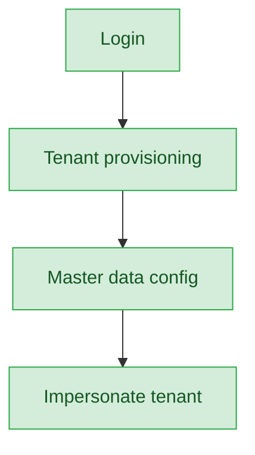

# Super Admin — User Journey

**Landing dashboard:** `AuthController.php:368` → `route('admin.dashboard')`
**Scope:** Platform-level tenant provisioning and master data management one level above all Sahodaya tenants; has no direct event-type (Kalotsav/Sports/MCQ/etc.) operational role of its own — to touch any event-level work it must impersonate a tenant, which is out of scope for this audit.

## Platform Oversight (no event-type breakdown)

| Stage | Menu path | Route | Status | Note |
|---|---|---|---|---|
| Login | Super Admin login | `AuthController.php:368` → `route('admin.dashboard')` | ✅ | Lands on platform admin dashboard |
| Tenant provisioning | Sahodayas / Schools | `admin.sahodayas.index`, `admin.schools.index` | ✅ | Create/manage Sahodaya tenants and member schools |
| Master data config | Master data / Website Builder / Storage migration | `admin.*` master-data routes, Website Builder, storage migration tools | ✅ | Platform-wide configuration, not event-specific |
| Impersonate tenant (event-level work) | Impersonate | n/a | ✅ (out of scope) | Only path into event-type operations; those journeys are covered by tenant-tier roles in their own docs |

**Known issues:** None found.

---
## Summary for this role
Super Admin is complete for its actual scope: tenant provisioning, master data, and platform administration all work end-to-end. It intentionally has no event-type (Kalotsav, Sports, MCQ, etc.) breakdown of its own — any event-level action requires impersonating a Sahodaya tenant, which is a deliberate design boundary rather than a gap. No actionable fix identified.
