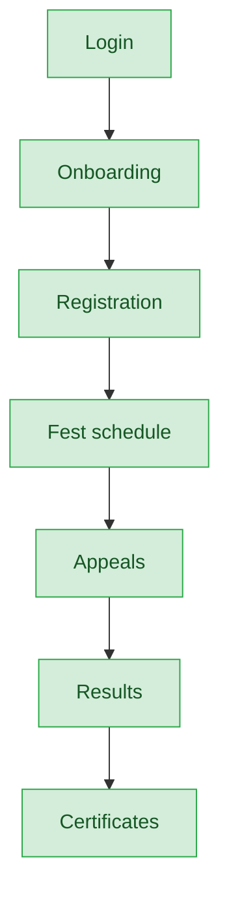
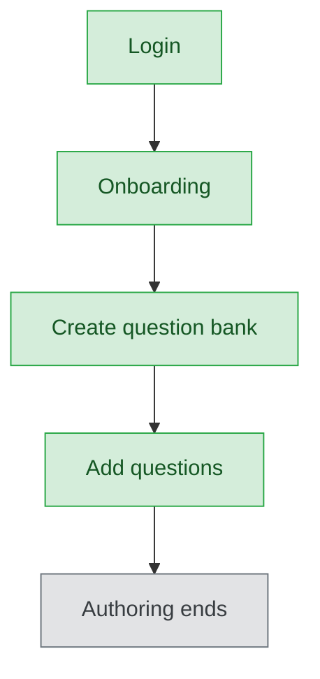

# Teacher — User Journey

**Landing dashboard:** `TeacherDashboardController::index`, via `AuthController::homeFor()` → `/portal/teacher/{tenant_id}`
**Scope:** Teachers view/appeal on Teacher Fest results (registration handled by school admin) and author MCQ question banks for use in exams assembled at the Sahodaya tier — teachers never take exams themselves and never see downstream exam performance.

## Teacher Fest

| Stage | Menu path | Route | Status | Note |
|---|---|---|---|---|
| Login | Portal login | `/portal/teacher/{tenant_id}` | ✅ | |
| Onboarding | Dashboard welcome | `TeacherDashboardController::index` | ✅ | |
| Registration | Fest page (read-only) | done by school admin | ✅ | Teacher portal is read/appeal-only — correct by design |
| Configuration | — | — | 🚫 | Not a teacher action |
| Execution | Fest schedule | Fest page | ✅ | |
| Review/Approval | Appeals | inline on Fest page | ✅ | |
| Publishing/Results | Results page | `resultsPage`, scoped to `teacher_id`, gated on `results_published` | ✅ | |
| Post-result | Certificates | — | ✅ | |

**Known issues:**
- Admit-card route exists but has no persistent nav entry (only reachable via a dynamic in-page link) — same pattern as the student portal, so this is consistent behavior rather than a standalone bug.

## MCQ (Question-Bank Authoring)

| Stage | Menu path | Route | Status | Note |
|---|---|---|---|---|
| Login | Portal login | `/portal/teacher/{tenant_id}` | ✅ | |
| Onboarding | Dashboard welcome | mentions question banks | ✅ | |
| Registration | Create question bank | `TeacherMcqController::banks` / `storeBank` | ✅ | Scoped to teacher_id + school_id |
| Configuration | Add questions | `TeacherMcqController::storeQuestion` | ✅ | Text/options/document upload supported |
| Execution | — | — | 🚫 | Teacher's role ends at authoring; exam assembly is Sahodaya-tier |
| Review/Approval | — | — | 🚫 | Not a teacher action |
| Publishing/Results | — | — | 🚫 | Teacher never sees how their questions performed — a thin feedback loop, not a bug; noted as a nice-to-have |
| Post-result | — | — | 🚫 | |

**Known issues:**
- No feedback loop showing question-level performance back to the authoring teacher (nice-to-have, not a defect).

## Other Fest Types (Kalotsav / Sports Meet / Kids Fest)

Not audited in this pass for the teacher role.

---
## Summary for this role

Teacher Fest is a complete, well-scoped journey from onboarding through certificates, correctly limiting teachers to read/appeal actions since registration belongs to the school admin. MCQ authoring works cleanly through question-bank creation and question entry, but stops there by design — teachers get no visibility into exam assembly or question performance, which is a minor feedback gap rather than a functional break. The most actionable improvement would be adding a lightweight question-performance summary for teachers, though this is a nice-to-have rather than a fix for something broken.
